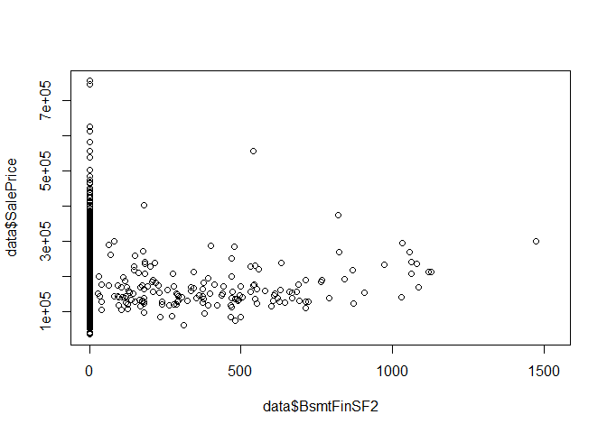
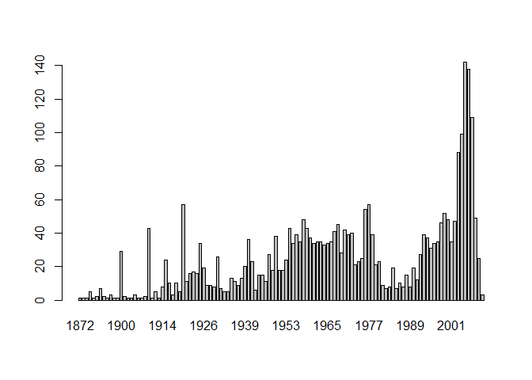
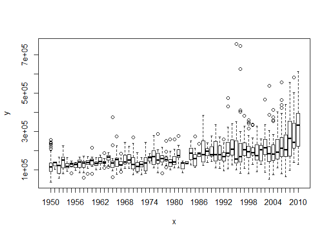
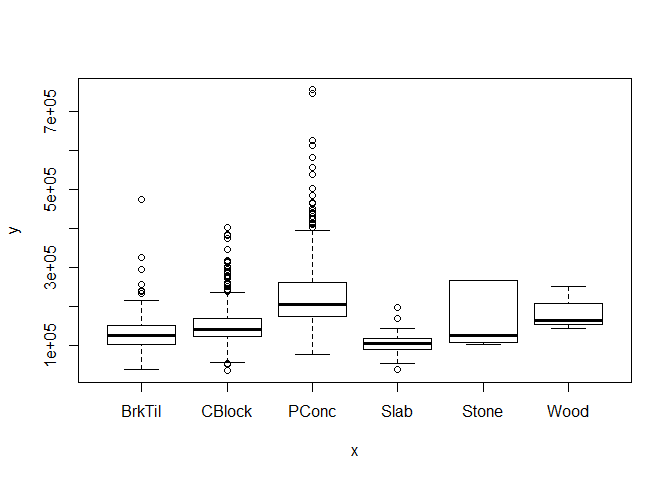
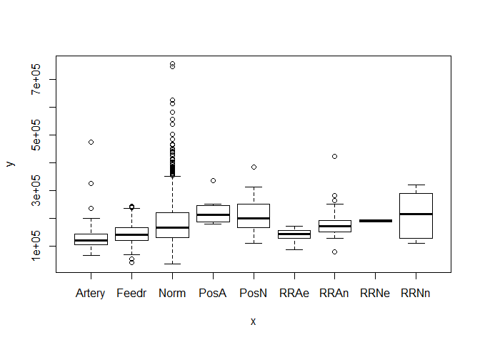

House Prices: Prediction and Data analysis
==========================================

-   First, we will load the libraries we need.

``` r
library(plyr)
library(dplyr)
```

-   Then we load the data, the train and the test set seperately.

``` r
setwd("C:/Users/User/Desktop/Άγγελος/R/Data analysis/House prices/house-prices-advanced-regression-techniques")
train<-read.csv("train.csv",stringsAsFactors = FALSE)
test<-read.csv("test.csv",header=TRUE,stringsAsFactors = FALSE)
```

-   We can add the SalePrice variable in the test set as NA.

``` r
test$SalePrice <- NA
```

-   Now we combine the test and train set and explore our data.

``` r
data <- rbind(train,test)
str(data)
```

    ## 'data.frame':    2919 obs. of  81 variables:
    ##  $ Id           : int  1 2 3 4 5 6 7 8 9 10 ...
    ##  $ MSSubClass   : int  60 20 60 70 60 50 20 60 50 190 ...
    ##  $ MSZoning     : chr  "RL" "RL" "RL" "RL" ...
    ##  $ LotFrontage  : int  65 80 68 60 84 85 75 NA 51 50 ...
    ##  $ LotArea      : int  8450 9600 11250 9550 14260 14115 10084 10382 6120 7420 ...
    ##  $ Street       : chr  "Pave" "Pave" "Pave" "Pave" ...
    ##  $ Alley        : chr  NA NA NA NA ...
    ##  $ LotShape     : chr  "Reg" "Reg" "IR1" "IR1" ...
    ##  $ LandContour  : chr  "Lvl" "Lvl" "Lvl" "Lvl" ...
    ##  $ Utilities    : chr  "AllPub" "AllPub" "AllPub" "AllPub" ...
    ##  $ LotConfig    : chr  "Inside" "FR2" "Inside" "Corner" ...
    ##  $ LandSlope    : chr  "Gtl" "Gtl" "Gtl" "Gtl" ...
    ##  $ Neighborhood : chr  "CollgCr" "Veenker" "CollgCr" "Crawfor" ...
    ##  $ Condition1   : chr  "Norm" "Feedr" "Norm" "Norm" ...
    ##  $ Condition2   : chr  "Norm" "Norm" "Norm" "Norm" ...
    ##  $ BldgType     : chr  "1Fam" "1Fam" "1Fam" "1Fam" ...
    ##  $ HouseStyle   : chr  "2Story" "1Story" "2Story" "2Story" ...
    ##  $ OverallQual  : int  7 6 7 7 8 5 8 7 7 5 ...
    ##  $ OverallCond  : int  5 8 5 5 5 5 5 6 5 6 ...
    ##  $ YearBuilt    : int  2003 1976 2001 1915 2000 1993 2004 1973 1931 1939 ...
    ##  $ YearRemodAdd : int  2003 1976 2002 1970 2000 1995 2005 1973 1950 1950 ...
    ##  $ RoofStyle    : chr  "Gable" "Gable" "Gable" "Gable" ...
    ##  $ RoofMatl     : chr  "CompShg" "CompShg" "CompShg" "CompShg" ...
    ##  $ Exterior1st  : chr  "VinylSd" "MetalSd" "VinylSd" "Wd Sdng" ...
    ##  $ Exterior2nd  : chr  "VinylSd" "MetalSd" "VinylSd" "Wd Shng" ...
    ##  $ MasVnrType   : chr  "BrkFace" "None" "BrkFace" "None" ...
    ##  $ MasVnrArea   : int  196 0 162 0 350 0 186 240 0 0 ...
    ##  $ ExterQual    : chr  "Gd" "TA" "Gd" "TA" ...
    ##  $ ExterCond    : chr  "TA" "TA" "TA" "TA" ...
    ##  $ Foundation   : chr  "PConc" "CBlock" "PConc" "BrkTil" ...
    ##  $ BsmtQual     : chr  "Gd" "Gd" "Gd" "TA" ...
    ##  $ BsmtCond     : chr  "TA" "TA" "TA" "Gd" ...
    ##  $ BsmtExposure : chr  "No" "Gd" "Mn" "No" ...
    ##  $ BsmtFinType1 : chr  "GLQ" "ALQ" "GLQ" "ALQ" ...
    ##  $ BsmtFinSF1   : int  706 978 486 216 655 732 1369 859 0 851 ...
    ##  $ BsmtFinType2 : chr  "Unf" "Unf" "Unf" "Unf" ...
    ##  $ BsmtFinSF2   : int  0 0 0 0 0 0 0 32 0 0 ...
    ##  $ BsmtUnfSF    : int  150 284 434 540 490 64 317 216 952 140 ...
    ##  $ TotalBsmtSF  : int  856 1262 920 756 1145 796 1686 1107 952 991 ...
    ##  $ Heating      : chr  "GasA" "GasA" "GasA" "GasA" ...
    ##  $ HeatingQC    : chr  "Ex" "Ex" "Ex" "Gd" ...
    ##  $ CentralAir   : chr  "Y" "Y" "Y" "Y" ...
    ##  $ Electrical   : chr  "SBrkr" "SBrkr" "SBrkr" "SBrkr" ...
    ##  $ X1stFlrSF    : int  856 1262 920 961 1145 796 1694 1107 1022 1077 ...
    ##  $ X2ndFlrSF    : int  854 0 866 756 1053 566 0 983 752 0 ...
    ##  $ LowQualFinSF : int  0 0 0 0 0 0 0 0 0 0 ...
    ##  $ GrLivArea    : int  1710 1262 1786 1717 2198 1362 1694 2090 1774 1077 ...
    ##  $ BsmtFullBath : int  1 0 1 1 1 1 1 1 0 1 ...
    ##  $ BsmtHalfBath : int  0 1 0 0 0 0 0 0 0 0 ...
    ##  $ FullBath     : int  2 2 2 1 2 1 2 2 2 1 ...
    ##  $ HalfBath     : int  1 0 1 0 1 1 0 1 0 0 ...
    ##  $ BedroomAbvGr : int  3 3 3 3 4 1 3 3 2 2 ...
    ##  $ KitchenAbvGr : int  1 1 1 1 1 1 1 1 2 2 ...
    ##  $ KitchenQual  : chr  "Gd" "TA" "Gd" "Gd" ...
    ##  $ TotRmsAbvGrd : int  8 6 6 7 9 5 7 7 8 5 ...
    ##  $ Functional   : chr  "Typ" "Typ" "Typ" "Typ" ...
    ##  $ Fireplaces   : int  0 1 1 1 1 0 1 2 2 2 ...
    ##  $ FireplaceQu  : chr  NA "TA" "TA" "Gd" ...
    ##  $ GarageType   : chr  "Attchd" "Attchd" "Attchd" "Detchd" ...
    ##  $ GarageYrBlt  : int  2003 1976 2001 1998 2000 1993 2004 1973 1931 1939 ...
    ##  $ GarageFinish : chr  "RFn" "RFn" "RFn" "Unf" ...
    ##  $ GarageCars   : int  2 2 2 3 3 2 2 2 2 1 ...
    ##  $ GarageArea   : int  548 460 608 642 836 480 636 484 468 205 ...
    ##  $ GarageQual   : chr  "TA" "TA" "TA" "TA" ...
    ##  $ GarageCond   : chr  "TA" "TA" "TA" "TA" ...
    ##  $ PavedDrive   : chr  "Y" "Y" "Y" "Y" ...
    ##  $ WoodDeckSF   : int  0 298 0 0 192 40 255 235 90 0 ...
    ##  $ OpenPorchSF  : int  61 0 42 35 84 30 57 204 0 4 ...
    ##  $ EnclosedPorch: int  0 0 0 272 0 0 0 228 205 0 ...
    ##  $ X3SsnPorch   : int  0 0 0 0 0 320 0 0 0 0 ...
    ##  $ ScreenPorch  : int  0 0 0 0 0 0 0 0 0 0 ...
    ##  $ PoolArea     : int  0 0 0 0 0 0 0 0 0 0 ...
    ##  $ PoolQC       : chr  NA NA NA NA ...
    ##  $ Fence        : chr  NA NA NA NA ...
    ##  $ MiscFeature  : chr  NA NA NA NA ...
    ##  $ MiscVal      : int  0 0 0 0 0 700 0 350 0 0 ...
    ##  $ MoSold       : int  2 5 9 2 12 10 8 11 4 1 ...
    ##  $ YrSold       : int  2008 2007 2008 2006 2008 2009 2007 2009 2008 2008 ...
    ##  $ SaleType     : chr  "WD" "WD" "WD" "WD" ...
    ##  $ SaleCondition: chr  "Normal" "Normal" "Normal" "Abnorml" ...
    ##  $ SalePrice    : int  208500 181500 223500 140000 250000 143000 307000 200000 129900 118000 ...

-   Let’s explore SalePrice variable, which is the variable we want to
    predict.

``` r
summary(data$SalePrice) # We can see that the median for the sales price is 163000
```

    ##    Min. 1st Qu.  Median    Mean 3rd Qu.    Max.    NA's 
    ##   34900  129975  163000  180921  214000  755000    1459

``` r
data$SalePrice<-as.numeric(data$SalePrice) # Change to numeric
hist(data$SalePrice, breaks=30, xlab = 'Price', main = 'Histogram of Sale Price') # There is a slightly skewed distribution to the right, possibly because of the extreme values.
```


-   We will now check for missing values.

``` r
sort(sapply(data, function(x) sum(is.na(x))),decreasing=TRUE)
```

    ##        PoolQC   MiscFeature         Alley         Fence     SalePrice 
    ##          2909          2814          2721          2348          1459 
    ##   FireplaceQu   LotFrontage   GarageYrBlt  GarageFinish    GarageQual 
    ##          1420           486           159           159           159 
    ##    GarageCond    GarageType      BsmtCond  BsmtExposure      BsmtQual 
    ##           159           157            82            82            81 
    ##  BsmtFinType2  BsmtFinType1    MasVnrType    MasVnrArea      MSZoning 
    ##            80            79            24            23             4 
    ##     Utilities  BsmtFullBath  BsmtHalfBath    Functional   Exterior1st 
    ##             2             2             2             2             1 
    ##   Exterior2nd    BsmtFinSF1    BsmtFinSF2     BsmtUnfSF   TotalBsmtSF 
    ##             1             1             1             1             1 
    ##    Electrical   KitchenQual    GarageCars    GarageArea      SaleType 
    ##             1             1             1             1             1 
    ##            Id    MSSubClass       LotArea        Street      LotShape 
    ##             0             0             0             0             0 
    ##   LandContour     LotConfig     LandSlope  Neighborhood    Condition1 
    ##             0             0             0             0             0 
    ##    Condition2      BldgType    HouseStyle   OverallQual   OverallCond 
    ##             0             0             0             0             0 
    ##     YearBuilt  YearRemodAdd     RoofStyle      RoofMatl     ExterQual 
    ##             0             0             0             0             0 
    ##     ExterCond    Foundation       Heating     HeatingQC    CentralAir 
    ##             0             0             0             0             0 
    ##     X1stFlrSF     X2ndFlrSF  LowQualFinSF     GrLivArea      FullBath 
    ##             0             0             0             0             0 
    ##      HalfBath  BedroomAbvGr  KitchenAbvGr  TotRmsAbvGrd    Fireplaces 
    ##             0             0             0             0             0 
    ##    PavedDrive    WoodDeckSF   OpenPorchSF EnclosedPorch    X3SsnPorch 
    ##             0             0             0             0             0 
    ##   ScreenPorch      PoolArea       MiscVal        MoSold        YrSold 
    ##             0             0             0             0             0 
    ## SaleCondition 
    ##             0

``` r
plot(sort(sapply(data, function(x) sum(is.na(x))),decreasing=TRUE),type='h')
```


There are some columns with lots of missing values. However, in most
cases these are not missing values, but an indication that the apartment
doesn’t have these amenities. So let’s replace these Na’s with ‘None’
and explore these variables.

**PoolQC: Pool quality**
------------------------

<br> This is the first variable we will examine. From the documentation,
we observe that indeed, the ‘NA’ value in this variable means that there
is no pool. We will also replace the values with integers from 0 to 5 as
long as it is a scaling variable.<br> We will continue in a similar way
with the other variables that have missing values.

``` r
data$PoolQC[is.na(data$PoolQC)] <- "None"
table(data$PoolQC)
```

    ## 
    ##   Ex   Fa   Gd None 
    ##    4    2    4 2909

``` r
Qual_Cond <- c('None' = 0, 'Po' = 1, 'Fa' = 2, 'TA' = 3, 'Gd' = 4, 'Ex' = 5)
data$PoolQC<-revalue(data$PoolQC,Qual_Cond)
data$PoolQC<-as.integer(data$PoolQC)
```

**MiscFeature: Miscellaneous feature not covered in other categories**
----------------------------------------------------------------------

``` r
table(data$MiscFeature)
```

    ## 
    ## Gar2 Othr Shed TenC 
    ##    5    4   95    1

``` r
data$MiscFeature[is.na(data$MiscFeature)] <- "None"
table(data$MiscFeature)
```

    ## 
    ## Gar2 None Othr Shed TenC 
    ##    5 2814    4   95    1

``` r
data$MiscFeature<-as.factor(data$MiscFeature) 
plot(data$MiscFeature)
```


**Alley: Type of alley access to property**
-------------------------------------------

``` r
table(data$Alley)
```

    ## 
    ## Grvl Pave 
    ##  120   78

``` r
data$Alley[is.na(data$Alley)] <- "None"
data$Alley<-as.factor(data$Alley)
plot(data$Alley,data$SalePrice) #Seems to affect the price
```


``` r
table(data$Alley)
```

    ## 
    ## Grvl None Pave 
    ##  120 2721   78

**Fence: Fence quality**
------------------------

``` r
table(data$Fence)
```

    ## 
    ## GdPrv  GdWo MnPrv  MnWw 
    ##   118   112   329    12

``` r
data$Fence[is.na(data$Fence)] <- "None"
data$Fence<-as.factor(data$Fence)
plot(data$Fence,data$SalePrice) # Seems to affect the price. The 'no fence' variable has the highest median!
```


``` r
table(data$Fence)
```

    ## 
    ## GdPrv  GdWo MnPrv  MnWw  None 
    ##   118   112   329    12  2348

**FireplaceQu: Fireplace quality**
----------------------------------

``` r
table(data$FireplaceQu)
```

    ## 
    ##  Ex  Fa  Gd  Po  TA 
    ##  43  74 744  46 592

``` r
data$FireplaceQu[is.na(data$FireplaceQu)] <- "None"
data$FireplaceQu<-revalue(data$FireplaceQu,Qual_Cond) #replace the values with Quality/Condition values
data$FireplaceQu<-as.integer(data$FireplaceQu)
plot(data$FireplaceQu,data$SalePrice) #Seems to affect the price!
abline(lm(data$SalePrice~data$FireplaceQu))
```


``` r
table(data$FireplaceQu)
```

    ## 
    ##    0    1    2    3    4    5 
    ## 1420   46   74  592  744   43

**LotFrontage: Linear feet of street connected to property.**
-------------------------------------------------------------

There are 259 NA’s. We will replace the missing values with the median
and not the mean, because of the extreme values (outliers).

``` r
summary(data$LotFrontage)
```

    ##    Min. 1st Qu.  Median    Mean 3rd Qu.    Max.    NA's 
    ##   21.00   59.00   68.00   69.31   80.00  313.00     486

``` r
cor(data$LotFrontage,data$SalePrice, use = "pairwise.complete.obs")
```

    ## [1] 0.3517991

``` r
hist(data$LotFrontage,breaks=30,xlim = c(0,200))
```


``` r
plot(data$LotFrontage,data$SalePrice) # There are 2 extreme values
```


``` r
data$LotFrontage[is.na(data$LotFrontage)]<-median(na.omit(as.numeric(data$LotFrontage)))
```

**GarageYrBlt**
---------------

``` r
summary(data$GarageYrBlt)
```

    ##    Min. 1st Qu.  Median    Mean 3rd Qu.    Max.    NA's 
    ##    1895    1960    1979    1978    2002    2207     159

``` r
plot(data$GarageYrBlt) 
```


There is a wrong observation unless it is a house from the future
(2207)! We replace it with the year 2007.

``` r
which(data[,"GarageYrBlt"]>2019)
```

    ## [1] 2593

``` r
data[2593,"GarageYrBlt"]<-2007 # Replace the observation
plot(as.factor(data$GarageYrBlt),data$SalePrice,xlab = 'Year the garage was built', ylab = 'House Price')
```


We will find out the NA’s by examining another variable, YearBuilt.
Let’s see if they have a correlation.

``` r
head(data.frame(data$YearBuilt,data$GarageYrBlt),15)
```

    ##    data.YearBuilt data.GarageYrBlt
    ## 1            2003             2003
    ## 2            1976             1976
    ## 3            2001             2001
    ## 4            1915             1998
    ## 5            2000             2000
    ## 6            1993             1993
    ## 7            2004             2004
    ## 8            1973             1973
    ## 9            1931             1931
    ## 10           1939             1939
    ## 11           1965             1965
    ## 12           2005             2005
    ## 13           1962             1962
    ## 14           2006             2006
    ## 15           1960             1960

``` r
length(which(data$YearBuilt!=data$GarageYrBlt)) # Number of different rows
```

    ## [1] 544

Indeed the year the house was built is in most cases the same as the
year the garage was built, so we will drop the variable and keep the
YearBuilt variable.

``` r
data <- subset(data, select = -GarageYrBlt)
```

**GarageFinish:Interior finish of the garage**
----------------------------------------------

``` r
plot(as.factor(data$GarageFinish))
```


``` r
plot(as.factor(data$GarageFinish),data$SalePrice)
```


``` r
data$GarageFinish[is.na(data$GarageFinish)] <- "None"
plot(as.factor(data$GarageFinish),data$SalePrice) # It seems ordinal 
```


``` r
levels(as.factor(data$GarageFinish))
```

    ## [1] "Fin"  "None" "RFn"  "Unf"

``` r
Finish <- c('None' = 0, "Unf" = 1, "RFn" = 2, "Fin" = 3)
data$GarageFinish<-revalue(data$GarageFinish,Finish)
data$GarageFinish<-as.integer(data$GarageFinish)  
plot(data$GarageFinish,data$SalePrice)
```


**GarageQual: Garage quality**
------------------------------

``` r
table(data$GarageQual)
```

    ## 
    ##   Ex   Fa   Gd   Po   TA 
    ##    3  124   24    5 2604

``` r
plot(as.factor(data$GarageQual),data$SalePrice)
```


``` r
data$GarageQual[is.na(data$GarageQual)] <- "None"
plot(as.factor(data$GarageQual),data$SalePrice)
```


``` r
data$GarageQual<-revalue(data$GarageQual,Qual_Cond)
table(data$GarageQual)
```

    ## 
    ##    0    1    2    3    4    5 
    ##  159    5  124 2604   24    3

``` r
data$GarageQual<-as.integer(data$GarageQual)
```

**GarageCond: Garage condition**
--------------------------------

``` r
table(data$GarageCond)
```

    ## 
    ##   Ex   Fa   Gd   Po   TA 
    ##    3   74   15   14 2654

``` r
plot(as.factor(data$GarageCond),data$SalePrice)
```


``` r
data$GarageCond[is.na(data$GarageCond)] <- "None"
plot(as.factor(data$GarageCond),data$SalePrice)
```


``` r
data$GarageCond<-revalue(data$GarageCond,Qual_Cond)
table(data$GarageCond)
```

    ## 
    ##    0    1    2    3    4    5 
    ##  159   14   74 2654   15    3

``` r
data$GarageCond<-as.integer(data$GarageCond)
```

We can see the correlation between garage condition and quality.

``` r
cor(data$GarageCond,data$GarageQual)
```

    ## [1] 0.9466563

It is a huge correlation,we must drop one of 2 variables

``` r
cor(data[1:1459,'SalePrice'],data[1:1459,'GarageCond'])
```

    ## [1] 0.2632897

``` r
cor(data[1:1459,'SalePrice'],data[1:1459,'GarageQual'])
```

    ## [1] 0.2739379

We’ll drop the variable less correlated with sales price

``` r
data <- subset(data, select = -GarageCond)
```

**GarageType: Garage location**
-------------------------------

``` r
table(data$GarageType)
```

    ## 
    ##  2Types  Attchd Basment BuiltIn CarPort  Detchd 
    ##      23    1723      36     186      15     779

``` r
plot(as.factor(data$GarageType),data$SalePrice)
```


``` r
data$GarageType[is.na(data$GarageType)] <- "None"
plot(as.factor(data$GarageType),data$SalePrice)
data$GarageType<-as.factor(data$GarageType)
plot(data$GarageType,data$SalePrice)
```


**BsmtCond:Evaluates the general condition of the basement**
------------------------------------------------------------

``` r
table(data$BsmtCond)
```

    ## 
    ##   Fa   Gd   Po   TA 
    ##  104  122    5 2606

``` r
plot(as.factor(data$BsmtCond),data$SalePrice)
```


``` r
data$BsmtCond[is.na(data$BsmtCond)] <- "None"
plot(as.factor(data$BsmtCond),data$SalePrice)
```


``` r
data$BsmtCond<-revalue(data$BsmtCond,Qual_Cond)
table(data$BsmtCond)
```

    ## 
    ##    0    1    2    3    4 
    ##   82    5  104 2606  122

``` r
data$BsmtCond<-as.integer(data$BsmtCond)
plot(as.factor(data$BsmtCond),data$SalePrice)
```


There seems to be a correlation with the house price.

**BsmtExposure:Refers to walkout or garden level walls**
--------------------------------------------------------

``` r
table(data$BsmtExposure)
```

    ## 
    ##   Av   Gd   Mn   No 
    ##  418  276  239 1904

``` r
plot(as.factor(data$BsmtExposure),data$SalePrice)
```


``` r
data$BsmtExposure[is.na(data$BsmtExposure)] <- "None"
plot(as.factor(data$BsmtExposure),data$SalePrice)
```


``` r
Exposure<-c("None"=0,"No"=1,'Mn'=2,'Av'=3,'Gd'=4)
data$BsmtExposure<-revalue(data$BsmtExposure,Exposure)
table(data$BsmtExposure)
```

    ## 
    ##    0    1    2    3    4 
    ##   82 1904  239  418  276

``` r
data$BsmtExposure<-as.integer(data$BsmtExposure)
plot(as.factor(data$BsmtExposure),data$SalePrice)
```


**BsmtQual:Evaluates the height of the basement**
-------------------------------------------------

``` r
table(data$BsmtQual)
```

    ## 
    ##   Ex   Fa   Gd   TA 
    ##  258   88 1209 1283

``` r
plot(as.factor(data$BsmtQual),data$SalePrice)
```


``` r
data$BsmtQual[is.na(data$BsmtQual)] <- "None"
plot(as.factor(data$BsmtQual),data$SalePrice)
```


``` r
data$BsmtQual<-revalue(data$BsmtQual,Qual_Cond)
table(data$BsmtQual)
```

    ## 
    ##    0    2    3    4    5 
    ##   81   88 1283 1209  258

``` r
data$BsmtQual<-as.integer(data$BsmtQual)
plot(as.factor(data$BsmtQual),data$SalePrice)
```


**BsmtFinType1:Rating of basement finished area**
-------------------------------------------------

``` r
table(data$BsmtFinType1)
```

    ## 
    ## ALQ BLQ GLQ LwQ Rec Unf 
    ## 429 269 849 154 288 851

``` r
plot(as.factor(data$BsmtFinType1),data$SalePrice)
```


``` r
data$BsmtFinType1[is.na(data$BsmtFinType1)] <- "None"
plot(as.factor(data$BsmtFinType1),data$SalePrice)
```


``` r
Bsm_type<-c("None"=0,"Unf"=1,'LwQ'=2,'Rec'=3,'BLQ'=4,'ALQ'=5,'GLQ'=6)
data$BsmtFinType1<-revalue(data$BsmtFinType1,Bsm_type)
table(data$BsmtFinType1)
```

    ## 
    ##   0   1   2   3   4   5   6 
    ##  79 851 154 288 269 429 849

``` r
data$BsmtFinType1<-as.integer(data$BsmtFinType1)
plot(as.factor(data$BsmtFinType1),data$SalePrice)
```


**BsmtFinType2:Rating of basement finished area (if multiple types)**
---------------------------------------------------------------------

``` r
table(data$BsmtFinType2)
```

    ## 
    ##  ALQ  BLQ  GLQ  LwQ  Rec  Unf 
    ##   52   68   34   87  105 2493

``` r
plot(as.factor(data$BsmtFinType2),data$SalePrice)
```


``` r
data$BsmtFinType2[is.na(data$BsmtFinType2)] <- "None"
plot(as.factor(data$BsmtFinType2),data$SalePrice)
```


``` r
data$BsmtFinType2<-revalue(data$BsmtFinType2,Bsm_type)
table(data$BsmtFinType2)
```

    ## 
    ##    0    1    2    3    4    5    6 
    ##   80 2493   87  105   68   52   34

``` r
data$BsmtFinType2<-as.integer(data$BsmtFinType2)
plot(as.factor(data$BsmtFinType2),data$SalePrice)
```


**MasVnrType: Masonry veneer type (walls).**
--------------------------------------------

``` r
table(data$MasVnrType)
```

    ## 
    ##  BrkCmn BrkFace    None   Stone 
    ##      25     879    1742     249

``` r
plot(as.factor(data$MasVnrType),data$SalePrice)
```


``` r
data$MasVnrType[is.na(data$MasVnrType)] <- "None" #Replace all Na's with 'none'
Masonry <- c('None'=0, 'BrkCmn'=1, 'BrkFace'=2, 'Stone'=3)
data$MasVnrType<-revalue(data$MasVnrType,Masonry)
table(data$MasVnrType)
```

    ## 
    ##    0    1    2    3 
    ## 1766   25  879  249

``` r
data$MasVnrType<-as.integer(data$MasVnrType)
plot(as.factor(data$MasVnrType),data$SalePrice)
```


**MasVnrArea: Masonry veneer area in square feet**
--------------------------------------------------

``` r
plot(data$MasVnrArea,data$SalePrice)
```


``` r
data$MasVnrArea[is.na(data$MasVnrArea)] <- 0
data$MasVnrArea<-as.numeric(data$MasVnrArea)
plot(data$MasVnrArea,data$SalePrice)
```


**MSZoning: Identifies the general zoning classification of the sale.**
-----------------------------------------------------------------------

``` r
table(data$MSZoning)
```

    ## 
    ## C (all)      FV      RH      RL      RM 
    ##      25     139      26    2265     460

``` r
plot(as.factor(data$MSZoning),data$SalePrice)
```


How we can find the missing values? Let’s check out the MSSubClass

``` r
data[is.na(data$MSZoning),c("MSZoning",'MSSubClass')]
```

    ##      MSZoning MSSubClass
    ## 1916     <NA>         30
    ## 2217     <NA>         20
    ## 2251     <NA>         70
    ## 2905     <NA>         20

``` r
table(data[,c("MSZoning",'MSSubClass')])
```

    ##          MSSubClass
    ## MSZoning    20   30   40   45   50   60   70   75   80   85   90  120  150
    ##   C (all)    3    8    0    0    7    0    4    0    0    0    0    0    0
    ##   FV        34    0    0    0    0   43    0    0    0    0    0   19    0
    ##   RH         4    2    0    1    2    0    3    0    0    0    4    6    0
    ##   RL      1016   61    4    6  159  529   57    9  115   47   92  117    1
    ##   RM        20   67    2   11  119    3   63   14    3    1   13   40    0
    ##          MSSubClass
    ## MSZoning   160  180  190
    ##   C (all)    0    0    3
    ##   FV        43    0    0
    ##   RH         0    0    4
    ##   RL        21    0   31
    ##   RM        64   17   23

And now the correlations with numeric variables.

``` r
library(corrplot)
cor(data$MSSubClass,data[,sapply(data, is.numeric)]) #
```

    ##               Id MSSubClass LotFrontage  LotArea OverallQual OverallCond
    ## [1,] 0.008930622          1   -0.389469 -0.20173  0.03363797 -0.06562504
    ##       YearBuilt YearRemodAdd  MasVnrType  MasVnrArea   BsmtQual
    ## [1,] 0.03440874   0.04331491 0.007170029 0.006309137 0.06525105
    ##          BsmtCond BsmtExposure BsmtFinType1 BsmtFinSF1 BsmtFinType2
    ## [1,] -0.003662076   0.05929913   0.05162957         NA  -0.03622638
    ##      BsmtFinSF2 BsmtUnfSF TotalBsmtSF  X1stFlrSF X2ndFlrSF LowQualFinSF
    ## [1,]         NA        NA          NA -0.2486415 0.3093091   0.02648179
    ##       GrLivArea BsmtFullBath BsmtHalfBath  FullBath  HalfBath BedroomAbvGr
    ## [1,] 0.07167745           NA           NA 0.1391396 0.1787502 -0.008796152
    ##      KitchenAbvGr TotRmsAbvGrd  Fireplaces FireplaceQu GarageFinish
    ## [1,]    0.2601555   0.04050946 -0.05515069 -0.05154243  -0.03689839
    ##      GarageCars GarageArea  GarageQual  WoodDeckSF OpenPorchSF
    ## [1,]         NA         NA -0.09573865 -0.01765413  -0.0159232
    ##      EnclosedPorch  X3SsnPorch ScreenPorch     PoolArea       PoolQC
    ## [1,]   -0.02086725 -0.03752892 -0.04918147 -0.003079582 -0.001679514
    ##          MiscVal       MoSold     YrSold SalePrice
    ## [1,] -0.02886686 -0.001231139 -0.0150278        NA

It is not higly correlated with other numeric variables.<br> So by
examining the above table, we will replace MSSubClass=20 with RL ,
MSSubClass=70 and MSSubClass=30 with RM.

``` r
data$MSZoning[is.na(data$MSZoning)]<-c('RM','RL','RM','RL')
data[is.na(data$MSZoning),c("MSZoning",'MSSubClass')]
```

    ## [1] MSZoning   MSSubClass
    ## <0 rows> (or 0-length row.names)

``` r
data$MSZoning<-as.factor(data$MSZoning)
```

**Utilities: Type of utilities available**
------------------------------------------

We don’t need this variable for prediction , as there is only one house
“NoSeWa”.

``` r
table(data$Utilities)
```

    ## 
    ## AllPub NoSeWa 
    ##   2916      1

``` r
data <- subset(data, select = -Utilities)
```

**BsmtFullBath:Basement full bathrooms**
----------------------------------------

``` r
table(data$BsmtFullBath)
```

    ## 
    ##    0    1    2    3 
    ## 1705 1172   38    2

Let’s find all the basement variables below.

``` r
paste(colnames(select(data,contains("Bsmt"))),collapse="','")
```

    ## [1] "BsmtQual','BsmtCond','BsmtExposure','BsmtFinType1','BsmtFinSF1','BsmtFinType2','BsmtFinSF2','BsmtUnfSF','TotalBsmtSF','BsmtFullBath','BsmtHalfBath"

``` r
data[is.na(data$BsmtFullBath),c('BsmtQual','BsmtCond','BsmtExposure','BsmtFinType1','BsmtFinSF1','BsmtFinType2','BsmtFinSF2','BsmtUnfSF','TotalBsmtSF','BsmtFullBath','BsmtHalfBath')]
```

    ##      BsmtQual BsmtCond BsmtExposure BsmtFinType1 BsmtFinSF1 BsmtFinType2
    ## 2121        0        0            0            0         NA            0
    ## 2189        0        0            0            0          0            0
    ##      BsmtFinSF2 BsmtUnfSF TotalBsmtSF BsmtFullBath BsmtHalfBath
    ## 2121         NA        NA          NA           NA           NA
    ## 2189          0         0           0           NA           NA

We conclude that these variables are higly corralated and so we will
replace the Na’s with zero value

``` r
data$BsmtFullBath[is.na(data$BsmtFullBath)]<-0 # Replace missing value with zero
plot(as.factor(data$BsmtFullBath),data$SalePrice)
```


``` r
data$BsmtFullBath<-as.integer(data$BsmtFullBath)
```

**BsmtHalfBath: Basement half bathrooms**
-----------------------------------------

We proceed with the same way as above.

``` r
table(data$BsmtHalfBath)
```

    ## 
    ##    0    1    2 
    ## 2742  171    4

``` r
paste(colnames(select(data,contains("Bsmt"))),collapse="','")
```

    ## [1] "BsmtQual','BsmtCond','BsmtExposure','BsmtFinType1','BsmtFinSF1','BsmtFinType2','BsmtFinSF2','BsmtUnfSF','TotalBsmtSF','BsmtFullBath','BsmtHalfBath"

``` r
data[is.na(data$BsmtHalfBath),c('BsmtQual','BsmtCond','BsmtExposure','BsmtFinType1','BsmtFinSF1','BsmtFinType2','BsmtFinSF2','BsmtUnfSF','TotalBsmtSF','BsmtFullBath','BsmtHalfBath')]
```

    ##      BsmtQual BsmtCond BsmtExposure BsmtFinType1 BsmtFinSF1 BsmtFinType2
    ## 2121        0        0            0            0         NA            0
    ## 2189        0        0            0            0          0            0
    ##      BsmtFinSF2 BsmtUnfSF TotalBsmtSF BsmtFullBath BsmtHalfBath
    ## 2121         NA        NA          NA            0           NA
    ## 2189          0         0           0            0           NA

``` r
data$BsmtHalfBath[is.na(data$BsmtHalfBath)]<-0 # Replace missing value with zero
plot(as.factor(data$BsmtHalfBath),data$SalePrice)
```


``` r
data$BsmtHalfBath<-as.integer(data$BsmtHalfBath)
#we can see the correlation 
cor(data$BsmtHalfBath,data$BsmtFullBath) #It is not correlated
```

    ## [1] -0.1486548

**Functional: Home functionality (Assume typical unless deductions are warranted)**
-----------------------------------------------------------------------------------

``` r
table(data$Functional)
```

    ## 
    ## Maj1 Maj2 Min1 Min2  Mod  Sev  Typ 
    ##   19    9   65   70   35    2 2717

``` r
plot(as.factor(data$Functional),data$SalePrice)
```


We will replace the Na’s with the most common value 7, which is typical
functionality

``` r
data$Functional[is.na(data$Functional)]<-7
Functional<-c('Sal'=0, 'Sev'=1, 'Maj2'=2, 'Maj1'=3, 'Mod'=4, 'Min2'=5, 'Min1'=6, 'Typ'=7)
data$Functional <- as.integer(revalue(data$Functional, Functional))
table(data$Functional)
```

    ## 
    ##    1    2    3    4    5    6    7 
    ##    2    9   19   35   70   65 2719

**GarageCars Size of garage in car capacity**
---------------------------------------------

``` r
table(as.factor(data$GarageCars))
```

    ## 
    ##    0    1    2    3    4    5 
    ##  157  776 1594  374   16    1

``` r
plot(as.factor(data$GarageCars))
```


``` r
plot(as.factor(data$GarageCars),data$SalePrice)
```


``` r
paste(colnames(select(data,contains("Garage"))),collapse="','")
```

    ## [1] "GarageType','GarageFinish','GarageCars','GarageArea','GarageQual"

``` r
data[is.na(data$GarageCars),c('GarageType','GarageFinish','GarageCars','GarageArea','GarageQual')]
```

    ##      GarageType GarageFinish GarageCars GarageArea GarageQual
    ## 2577     Detchd            0         NA         NA          0

``` r
data$GarageCars[is.na(data$GarageCars)]<-0 # Replace missing value with zero
data$GarageCars<-as.integer(data$GarageCars)
```

**GarageArea**
--------------

``` r
paste(colnames(select(data,contains("Garage"))),collapse="','")
```

    ## [1] "GarageType','GarageFinish','GarageCars','GarageArea','GarageQual"

``` r
data[is.na(data$GarageArea),c('GarageType','GarageFinish','GarageCars','GarageArea','GarageQual')]
```

    ##      GarageType GarageFinish GarageCars GarageArea GarageQual
    ## 2577     Detchd            0          0         NA          0

``` r
data$GarageArea[is.na(data$GarageArea)]<-0 # Replace missing value with zero
data$GarageArea<-as.integer(data$GarageArea)
plot(data$GarageArea,data$SalePrice)
```


Let’s find its correlation with other numeric values

``` r
cor(data[,sapply(data, is.numeric)],data$GarageArea)
```

    ##                       [,1]
    ## Id            -0.009851054
    ## MSSubClass    -0.103534194
    ## LotFrontage    0.338418737
    ## LotArea        0.213180376
    ## OverallQual    0.565179205
    ## OverallCond   -0.154311762
    ## YearBuilt      0.481328133
    ## YearRemodAdd   0.375892265
    ## MasVnrType     0.368002725
    ## MasVnrArea     0.371071383
    ## BsmtQual       0.422730492
    ## BsmtCond       0.136238741
    ## BsmtExposure   0.280947231
    ## BsmtFinType1   0.235311964
    ## BsmtFinSF1              NA
    ## BsmtFinType2   0.004557102
    ## BsmtFinSF2              NA
    ## BsmtUnfSF               NA
    ## TotalBsmtSF             NA
    ## X1stFlrSF      0.491996421
    ## X2ndFlrSF      0.127463905
    ## LowQualFinSF  -0.053430694
    ## GrLivArea      0.484547335
    ## BsmtFullBath   0.185151379
    ## BsmtHalfBath  -0.021217905
    ## FullBath       0.407519909
    ## HalfBath       0.179396010
    ## BedroomAbvGr   0.073723102
    ## KitchenAbvGr  -0.057647570
    ## TotRmsAbvGrd   0.328627638
    ## Functional     0.068753326
    ## Fireplaces     0.295175204
    ## FireplaceQu    0.342810880
    ## GarageFinish   0.511991097
    ## GarageCars     0.889890224
    ## GarageArea     1.000000000
    ## GarageQual     0.552595491
    ## WoodDeckSF     0.237384942
    ## OpenPorchSF    0.232875830
    ## EnclosedPorch -0.108382360
    ## X3SsnPorch     0.029493114
    ## ScreenPorch    0.062552079
    ## PoolArea       0.053053039
    ## PoolQC         0.063360935
    ## MiscVal        0.008506144
    ## MoSold         0.041181698
    ## YrSold        -0.012986182
    ## SalePrice               NA

It is correlated with GarageCars (Rsq = 0.889) <br> Should we drop
GarageArea or GarageCars? <br> We will examine which is less corellated
with Sales Price.

``` r
cor(data[1:1459,'SalePrice'],data[1:1459,'GarageArea'])
```

    ## [1] 0.6233849

``` r
cor(data[1:1459,'SalePrice'],data[1:1459,'GarageCars']) 
```

    ## [1] 0.6403833

We’ll drop the GarageArea variable, since it is less corellated with
sales Price

``` r
data <- subset(data, select = -GarageArea)
```

**TotalBsmtSF : Total square feet of basement area**
----------------------------------------------------

``` r
plot(data$TotalBsmtSF,data$SalePrice)
```


``` r
cor(data[1:1459,'SalePrice'],data[1:1459,'TotalBsmtSF'])
```

    ## [1] 0.6137915

``` r
data$TotalBsmtSF[is.na(data$TotalBsmtSF)]
```

    ## [1] NA

``` r
paste(colnames(select(data,contains("Bsmt"))),collapse="','")
```

    ## [1] "BsmtQual','BsmtCond','BsmtExposure','BsmtFinType1','BsmtFinSF1','BsmtFinType2','BsmtFinSF2','BsmtUnfSF','TotalBsmtSF','BsmtFullBath','BsmtHalfBath"

``` r
data[is.na(data$TotalBsmtSF),c('BsmtQual','BsmtCond','BsmtExposure','BsmtFinType1','BsmtFinSF1','BsmtFinType2','BsmtFinSF2','BsmtUnfSF','TotalBsmtSF','BsmtFullBath','BsmtHalfBath')]
```

    ##      BsmtQual BsmtCond BsmtExposure BsmtFinType1 BsmtFinSF1 BsmtFinType2
    ## 2121        0        0            0            0         NA            0
    ##      BsmtFinSF2 BsmtUnfSF TotalBsmtSF BsmtFullBath BsmtHalfBath
    ## 2121         NA        NA          NA            0            0

``` r
data$TotalBsmtSF[is.na(data$TotalBsmtSF)]<-0 # Replace missing value with zero
```

**BsmtFinSF1: Type 1 finished square feet**
-------------------------------------------

``` r
plot(data$BsmtFinSF1,data$SalePrice)
```


``` r
cor(data[1:1459,'SalePrice'],data[1:1459,'BsmtFinSF1'])
```

    ## [1] 0.3867829

``` r
data$BsmtFinSF1[is.na(data$BsmtFinSF1)]
```

    ## [1] NA

``` r
paste(colnames(select(data,contains("Bsmt"))),collapse="','")
```

    ## [1] "BsmtQual','BsmtCond','BsmtExposure','BsmtFinType1','BsmtFinSF1','BsmtFinType2','BsmtFinSF2','BsmtUnfSF','TotalBsmtSF','BsmtFullBath','BsmtHalfBath"

``` r
data[is.na(data$BsmtFinSF1),c('BsmtQual','BsmtCond','BsmtExposure','BsmtFinType1','BsmtFinSF1','BsmtFinType2','BsmtFinSF2','BsmtUnfSF','TotalBsmtSF','BsmtFullBath','BsmtHalfBath')]
```

    ##      BsmtQual BsmtCond BsmtExposure BsmtFinType1 BsmtFinSF1 BsmtFinType2
    ## 2121        0        0            0            0         NA            0
    ##      BsmtFinSF2 BsmtUnfSF TotalBsmtSF BsmtFullBath BsmtHalfBath
    ## 2121         NA        NA           0            0            0

``` r
data$BsmtFinSF1[is.na(data$BsmtFinSF1)]<-0 # Replace missing value with zero
```

**BsmtUnfSF: Unfinished square feet of basement area**
------------------------------------------------------

``` r
plot(data$BsmtUnfSF,data$SalePrice)
```


``` r
cor(data[1:1459,'SalePrice'],data[1:1459,'BsmtUnfSF'])
```

    ## [1] 0.2142805

``` r
data$BsmtUnfSF[is.na(data$BsmtUnfSF)]
```

    ## [1] NA

``` r
paste(colnames(select(data,contains("Bsmt"))),collapse="','")
```

    ## [1] "BsmtQual','BsmtCond','BsmtExposure','BsmtFinType1','BsmtFinSF1','BsmtFinType2','BsmtFinSF2','BsmtUnfSF','TotalBsmtSF','BsmtFullBath','BsmtHalfBath"

``` r
data[is.na(data$BsmtUnfSF),c('BsmtQual','BsmtCond','BsmtExposure','BsmtFinType1','BsmtFinSF1','BsmtFinType2','BsmtFinSF2','BsmtUnfSF','TotalBsmtSF','BsmtFullBath','BsmtHalfBath')]
```

    ##      BsmtQual BsmtCond BsmtExposure BsmtFinType1 BsmtFinSF1 BsmtFinType2
    ## 2121        0        0            0            0          0            0
    ##      BsmtFinSF2 BsmtUnfSF TotalBsmtSF BsmtFullBath BsmtHalfBath
    ## 2121         NA        NA           0            0            0

``` r
data$BsmtUnfSF[is.na(data$BsmtUnfSF)]<-0 # Replace missing value with zero
```

Let’s see if it is correlated with another variable

``` r
cor(data$BsmtUnfSF,data[,sapply(data, is.numeric)])
```

    ##               Id MSSubClass LotFrontage    LotArea OverallQual OverallCond
    ## [1,] -0.01479023 -0.1255609   0.1063813 0.02158978   0.2756429  -0.1386875
    ##      YearBuilt YearRemodAdd MasVnrType MasVnrArea  BsmtQual  BsmtCond
    ## [1,] 0.1307862    0.1657697  0.1086214 0.08817341 0.2358125 0.1748441
    ##      BsmtExposure BsmtFinType1 BsmtFinSF1 BsmtFinType2 BsmtFinSF2
    ## [1,]  -0.04344334   -0.3881147 -0.4767712   -0.1902104         NA
    ##      BsmtUnfSF TotalBsmtSF X1stFlrSF     X2ndFlrSF LowQualFinSF GrLivArea
    ## [1,]         1   0.4128104 0.2967876 -3.236541e-05   0.04694399 0.2343882
    ##      BsmtFullBath BsmtHalfBath  FullBath    HalfBath BedroomAbvGr
    ## [1,]   -0.3976477   -0.1068404 0.2735304 -0.03545913    0.1836307
    ##      KitchenAbvGr TotRmsAbvGrd Functional  Fireplaces FireplaceQu
    ## [1,]   0.06505947    0.2480153 0.03766712 0.005216017   0.1097402
    ##      GarageFinish GarageCars   GarageQual  WoodDeckSF OpenPorchSF
    ## [1,]    0.0847243  0.1807326 -0.009866555 -0.03896365   0.1200272
    ##      EnclosedPorch   X3SsnPorch ScreenPorch    PoolArea      PoolQC
    ## [1,]   0.005161546 -0.005763676 -0.04901855 -0.03223645 -0.02994952
    ##          MiscVal     MoSold      YrSold SalePrice
    ## [1,] -0.01045017 0.02295447 -0.03807293        NA

It is correlated with BsmtFinSF1 (-0.476). <br> We continue with the
next variable

**BsmtFinSF2: Type 2 finished square feet**
-------------------------------------------

``` r
plot(data$BsmtFinSF2,data$SalePrice)
```



``` r
cor(data[1:1459,'SalePrice'],data[1:1459,'BsmtFinSF2'])
```

    ## [1] -0.01095189

``` r
data$BsmtFinSF2[is.na(data$BsmtFinSF2)]
```

    ## [1] NA

``` r
paste(colnames(select(data,contains("Bsmt"))),collapse="','")
```

    ## [1] "BsmtQual','BsmtCond','BsmtExposure','BsmtFinType1','BsmtFinSF1','BsmtFinType2','BsmtFinSF2','BsmtUnfSF','TotalBsmtSF','BsmtFullBath','BsmtHalfBath"

``` r
data[is.na(data$BsmtFinSF2),c('BsmtQual','BsmtCond','BsmtExposure','BsmtFinType1','BsmtFinSF1','BsmtFinType2','BsmtFinSF2','BsmtUnfSF','TotalBsmtSF','BsmtFullBath','BsmtHalfBath')]
```

    ##      BsmtQual BsmtCond BsmtExposure BsmtFinType1 BsmtFinSF1 BsmtFinType2
    ## 2121        0        0            0            0          0            0
    ##      BsmtFinSF2 BsmtUnfSF TotalBsmtSF BsmtFullBath BsmtHalfBath
    ## 2121         NA         0           0            0            0

``` r
data$BsmtFinSF2[is.na(data$BsmtFinSF2)]<-0 # Replace missing value with zero
cor(data$BsmtFinSF1,data$BsmtFinSF2)
```

    ## [1] -0.05493841

We will probably drop this variable,let’s see if it is correlated with
another

``` r
cor(data$BsmtFinSF2,data[,sapply(data, is.numeric)])
```

    ##              Id  MSSubClass LotFrontage    LotArea OverallQual OverallCond
    ## [1,] 0.01817004 -0.07243126  0.04032958 0.08410715  -0.0426052  0.04135923
    ##        YearBuilt YearRemodAdd  MasVnrType  MasVnrArea    BsmtQual
    ## [1,] -0.02750704  -0.06195898 -0.02374806 -0.01457983 -0.01267815
    ##        BsmtCond BsmtExposure BsmtFinType1  BsmtFinSF1 BsmtFinType2
    ## [1,] 0.07567332    0.1025202   0.02628983 -0.05493841    0.7992987
    ##      BsmtFinSF2  BsmtUnfSF TotalBsmtSF  X1stFlrSF   X2ndFlrSF LowQualFinSF
    ## [1,]          1 -0.2380433  0.08956092 0.08438942 -0.09765352  -0.00491318
    ##        GrLivArea BsmtFullBath BsmtHalfBath    FullBath    HalfBath
    ## [1,] -0.01774713    0.1629569   0.09953007 -0.07531358 -0.03236835
    ##      BedroomAbvGr KitchenAbvGr TotRmsAbvGrd  Functional Fireplaces
    ## [1,]   -0.0311113   -0.0377576  -0.04824545 -0.06372228 0.06570734
    ##      FireplaceQu GarageFinish  GarageCars GarageQual WoodDeckSF
    ## [1,] 0.004498087  0.009004049 -0.01447615 0.06432276  0.0984622
    ##       OpenPorchSF EnclosedPorch  X3SsnPorch ScreenPorch   PoolArea
    ## [1,] -0.005804508    0.03277453 -0.02326797  0.06332908 0.04452989
    ##          PoolQC      MiscVal     MoSold      YrSold SalePrice
    ## [1,] 0.02187298 -0.005129682 -0.0095096 0.008866935        NA

Correlated with BsmtFinType2 <br> Now we see the correlations between
basement variables

``` r
paste(colnames(select(data,contains("Bsmt"))),collapse="','")
```

    ## [1] "BsmtQual','BsmtCond','BsmtExposure','BsmtFinType1','BsmtFinSF1','BsmtFinType2','BsmtFinSF2','BsmtUnfSF','TotalBsmtSF','BsmtFullBath','BsmtHalfBath"

``` r
cor(data[,c('BsmtQual','BsmtCond','BsmtExposure','BsmtFinType1','BsmtFinSF1','BsmtFinType2','BsmtFinSF2','BsmtUnfSF','TotalBsmtSF','BsmtFullBath','BsmtHalfBath')])
```

    ##                  BsmtQual   BsmtCond BsmtExposure BsmtFinType1
    ## BsmtQual      1.000000000 0.62515749   0.43626210   0.41987055
    ## BsmtCond      0.625157488 1.00000000   0.26430401   0.30704435
    ## BsmtExposure  0.436262102 0.26430401   1.00000000   0.36706771
    ## BsmtFinType1  0.419870554 0.30704435   0.36706771   1.00000000
    ## BsmtFinSF1    0.337365829 0.16986992   0.39857979   0.70298124
    ## BsmtFinType2  0.101212924 0.22661106   0.13262795   0.09950210
    ## BsmtFinSF2   -0.012678151 0.07567332   0.10252021   0.02628983
    ## BsmtUnfSF     0.235812550 0.17484410  -0.04344334  -0.38811470
    ## TotalBsmtSF   0.578576765 0.37870825   0.40769434   0.34937955
    ## BsmtFullBath  0.259072937 0.16954774   0.33859998   0.58455430
    ## BsmtHalfBath -0.006908995 0.04755341   0.08910495   0.08452306
    ##                BsmtFinSF1 BsmtFinType2  BsmtFinSF2   BsmtUnfSF TotalBsmtSF
    ## BsmtQual      0.337365829  0.101212924 -0.01267815  0.23581255  0.57857677
    ## BsmtCond      0.169869918  0.226611061  0.07567332  0.17484410  0.37870825
    ## BsmtExposure  0.398579791  0.132627953  0.10252021 -0.04344334  0.40769434
    ## BsmtFinType1  0.702981238  0.099502102  0.02628983 -0.38811470  0.34937955
    ## BsmtFinSF1    1.000000000 -0.008849972 -0.05493841 -0.47677116  0.53665002
    ## BsmtFinType2 -0.008849972  1.000000000  0.79929873 -0.19021038  0.10785668
    ## BsmtFinSF2   -0.054938405  0.799298733  1.00000000 -0.23804333  0.08956092
    ## BsmtUnfSF    -0.476771163 -0.190210384 -0.23804333  1.00000000  0.41281039
    ## TotalBsmtSF   0.536650022  0.107856678  0.08956092  0.41281039  1.00000000
    ## BsmtFullBath  0.639038348  0.187877971  0.16295695 -0.39764765  0.32625176
    ## BsmtHalfBath  0.078500167  0.109564023  0.09953007 -0.10684037  0.01277996
    ##              BsmtFullBath BsmtHalfBath
    ## BsmtQual        0.2590729 -0.006908995
    ## BsmtCond        0.1695477  0.047553407
    ## BsmtExposure    0.3386000  0.089104955
    ## BsmtFinType1    0.5845543  0.084523061
    ## BsmtFinSF1      0.6390383  0.078500167
    ## BsmtFinType2    0.1878780  0.109564023
    ## BsmtFinSF2      0.1629569  0.099530071
    ## BsmtUnfSF      -0.3976477 -0.106840367
    ## TotalBsmtSF     0.3262518  0.012779965
    ## BsmtFullBath    1.0000000 -0.148654812
    ## BsmtHalfBath   -0.1486548  1.000000000

We will create a corrplot for better understanding the correlations

``` r
corrplot(cor(data[,c('BsmtQual','BsmtCond','BsmtExposure','BsmtFinType1','BsmtFinSF1','BsmtFinType2','BsmtFinSF2','BsmtUnfSF','TotalBsmtSF','BsmtFullBath','BsmtHalfBath')])
,method = "square")
```


The basement quality and basement condition (which are important
variables) are not correlated with BsmtHalfBath and BsmtFinSF2. So we
will drop these two variables

``` r
data <- subset(data, select = -BsmtFinSF2)
data <- subset(data, select = -BsmtHalfBath)
```

**Now that we have taken care of Na’s let’s see which are the numeric variables.**
----------------------------------------------------------------------------------

``` r
colnames(data[,sapply(data, is.numeric)]) #check out which columns are numeric 
```

    ##  [1] "Id"            "MSSubClass"    "LotFrontage"   "LotArea"      
    ##  [5] "OverallQual"   "OverallCond"   "YearBuilt"     "YearRemodAdd" 
    ##  [9] "MasVnrType"    "MasVnrArea"    "BsmtQual"      "BsmtCond"     
    ## [13] "BsmtExposure"  "BsmtFinType1"  "BsmtFinSF1"    "BsmtFinType2" 
    ## [17] "BsmtUnfSF"     "TotalBsmtSF"   "X1stFlrSF"     "X2ndFlrSF"    
    ## [21] "LowQualFinSF"  "GrLivArea"     "BsmtFullBath"  "FullBath"     
    ## [25] "HalfBath"      "BedroomAbvGr"  "KitchenAbvGr"  "TotRmsAbvGrd" 
    ## [29] "Functional"    "Fireplaces"    "FireplaceQu"   "GarageFinish" 
    ## [33] "GarageCars"    "GarageQual"    "WoodDeckSF"    "OpenPorchSF"  
    ## [37] "EnclosedPorch" "X3SsnPorch"    "ScreenPorch"   "PoolArea"     
    ## [41] "PoolQC"        "MiscVal"       "MoSold"        "YrSold"       
    ## [45] "SalePrice"

Let’s see also some correlations. <br> We will find the numeric
variables that have the highest correlation with the Saleprice variable
and examine them further.

``` r
corrplot(cor(na.omit(data[,sapply(data, is.numeric)])),method = "square")
```


``` r
paste(which(cor(data[1:1459,sapply(data, is.numeric)],data[1:1459,'SalePrice'])>0.5 | cor(data[1:1459,sapply(data, is.numeric)],data[1:1459,'SalePrice'])<(-0.5)),collapse=',') # Check for high or low correlations
```

    ## [1] "5,7,8,11,18,19,22,24,28,31,32,33,45"

So the numeric variables that have the highest correlation with the
Saleprice are the following:

``` r
colnames(data[,sapply(data,is.numeric)][c(5,7,8,11,18,19,22,24,28,31,32,33,45)])
```

    ##  [1] "OverallQual"  "YearBuilt"    "YearRemodAdd" "BsmtQual"    
    ##  [5] "TotalBsmtSF"  "X1stFlrSF"    "GrLivArea"    "FullBath"    
    ##  [9] "TotRmsAbvGrd" "FireplaceQu"  "GarageFinish" "GarageCars"  
    ## [13] "SalePrice"

**Id**
------

We will get rid of the Id column and keep it in a vector called Id

``` r
Id<-data$Id[1461:nrow(data)]
data <- data[,-1]
```

**MSSubClass: Identifies the type of dwelling involved in the sale.**
---------------------------------------------------------------------

``` r
plot(data$MSSubClass,data$SalePrice)
```


**In reality this is a factor and not numeric.**

``` r
table(as.factor(data$MSSubClass))
```

    ## 
    ##   20   30   40   45   50   60   70   75   80   85   90  120  150  160  180 
    ## 1079  139    6   18  287  575  128   23  118   48  109  182    1  128   17 
    ##  190 
    ##   61

``` r
data$MSSubClass<-as.factor(data$MSSubClass) # Change into factor variable
```

**OverallQual: Rates the overall material and finish of the house**
-------------------------------------------------------------------

``` r
table(as.factor(data$OverallQual))
```

    ## 
    ##   1   2   3   4   5   6   7   8   9  10 
    ##   4  13  40 226 825 731 600 342 107  31

``` r
plot(as.factor(data$OverallQual),data$SalePrice)
```


``` r
data$OverallQual<-as.integer(data$OverallQual) # Change into integer variable
table(data$OverallQual)
```

    ## 
    ##   1   2   3   4   5   6   7   8   9  10 
    ##   4  13  40 226 825 731 600 342 107  31

**OverallCond: Rates the overall condition of the house**
---------------------------------------------------------

``` r
table(as.factor(data$OverallCond))
```

    ## 
    ##    1    2    3    4    5    6    7    8    9 
    ##    7   10   50  101 1645  531  390  144   41

``` r
plot(as.factor(data$OverallCond),data$SalePrice)
```



``` r
data$OverallCond<-as.integer(data$OverallCond)
table(data$OverallCond)
```

    ## 
    ##    1    2    3    4    5    6    7    8    9 
    ##    7   10   50  101 1645  531  390  144   41

**YearBuilt: Original construction date**
-----------------------------------------

``` r
plot(as.factor(data$YearBuilt))
```


``` r
table(as.factor(data$YearBuilt))
```

    ## 
    ## 1872 1875 1879 1880 1882 1885 1890 1892 1893 1895 1896 1898 1900 1901 1902 
    ##    1    1    1    5    1    2    7    2    1    3    1    1   29    2    1 
    ## 1904 1905 1906 1907 1908 1910 1911 1912 1913 1914 1915 1916 1917 1918 1919 
    ##    1    3    1    1    2   43    1    5    1    8   24   10    3   10    5 
    ## 1920 1921 1922 1923 1924 1925 1926 1927 1928 1929 1930 1931 1932 1934 1935 
    ##   57   11   16   17   16   34   19    9    9    8   26    7    5    5   13 
    ## 1936 1937 1938 1939 1940 1941 1942 1945 1946 1947 1948 1949 1950 1951 1952 
    ##   11    9   13   20   36   23    6   15   15   11   27   18   38   18   18 
    ## 1953 1954 1955 1956 1957 1958 1959 1960 1961 1962 1963 1964 1965 1966 1967 
    ##   24   43   34   39   35   48   43   37   34   35   35   33   34   35   41 
    ## 1968 1969 1970 1971 1972 1973 1974 1975 1976 1977 1978 1979 1980 1981 1982 
    ##   45   28   42   39   40   21   23   25   54   57   39   21   23    9    7 
    ## 1983 1984 1985 1986 1987 1988 1989 1990 1991 1992 1993 1994 1995 1996 1997 
    ##    8   19    7   10    8   15    8   19   12   27   39   37   31   34   35 
    ## 1998 1999 2000 2001 2002 2003 2004 2005 2006 2007 2008 2009 2010 
    ##   46   52   48   35   47   88   99  142  138  109   49   25    3

``` r
plot(as.factor(data$YearBuilt),data$SalePrice)
```



``` r
cor(data[1:1459,'SalePrice'],data[1:1459,'YearBuilt'])
```

    ## [1] 0.5228769

**YearRemodAdd: Remodel date (same as construction date if no remodeling or additions)**
----------------------------------------------------------------------------------------

``` r
plot(as.factor(data$YearRemodAdd))
```


``` r
table(as.factor(data$YearRemodAdd))
```

    ## 
    ## 1950 1951 1952 1953 1954 1955 1956 1957 1958 1959 1960 1961 1962 1963 1964 
    ##  361   14   15   20   28   25   30   20   34   30   29   24   26   30   26 
    ## 1965 1966 1967 1968 1969 1970 1971 1972 1973 1974 1975 1976 1977 1978 1979 
    ##   28   27   34   39   26   44   31   35   21   19   30   48   46   36   24 
    ## 1980 1981 1982 1983 1984 1985 1986 1987 1988 1989 1990 1991 1992 1993 1994 
    ##   26   12    9   11   19   14   12   16   15   18   29   29   32   43   53 
    ## 1995 1996 1997 1998 1999 2000 2001 2002 2003 2004 2005 2006 2007 2008 2009 
    ##   56   59   49   77   60  104   49   82   99  111  141  202  164   81   34 
    ## 2010 
    ##   13

Interestingly, we observe that after year 2006 there is a sudden
decrease in remodelings.

``` r
plot(as.factor(data$YearRemodAdd),data$SalePrice)
```


**Pool Area**
-------------

``` r
table(data$PoolArea) # We'll drop this variable (most observations belong to one parameter)
```

    ## 
    ##    0  144  228  368  444  480  512  519  555  561  576  648  738  800 
    ## 2906    1    1    1    1    1    1    1    1    1    1    1    1    1

``` r
data <- subset(data, select = -c(PoolArea))
```

### **PoolQC**

``` r
table(data$PoolQC) #we'll drop this variable
```

    ## 
    ##    0    2    4    5 
    ## 2909    2    4    4

``` r
data <- subset(data, select = -c(PoolQC))
```

**Afer examining the above numeric variables, we also need to examine the remaining character variables.**
----------------------------------------------------------------------------------------------------------

``` r
colnames(data[,sapply(data, is.character)]) 
```

    ##  [1] "Street"        "LotShape"      "LandContour"   "LotConfig"    
    ##  [5] "LandSlope"     "Neighborhood"  "Condition1"    "Condition2"   
    ##  [9] "BldgType"      "HouseStyle"    "RoofStyle"     "RoofMatl"     
    ## [13] "Exterior1st"   "Exterior2nd"   "ExterQual"     "ExterCond"    
    ## [17] "Foundation"    "Heating"       "HeatingQC"     "CentralAir"   
    ## [21] "Electrical"    "KitchenQual"   "PavedDrive"    "SaleType"     
    ## [25] "SaleCondition"

**Street: Type of road access to property**
-------------------------------------------

``` r
plot(as.factor(data$Street))
```


``` r
table(data$Street)
```

    ## 
    ## Grvl Pave 
    ##   12 2907

``` r
#Only 12 Gravels      
#removing Street variable 
data <- subset(data, select = -Street)
```

**Neighborhood**
----------------

``` r
data$Neighborhood <- as.factor(data$Neighborhood) # Convert to factor
table(data$Neighborhood)
```

    ## 
    ## Blmngtn Blueste  BrDale BrkSide ClearCr CollgCr Crawfor Edwards Gilbert 
    ##      28      10      30     108      44     267     103     194     165 
    ##  IDOTRR MeadowV Mitchel   NAmes NoRidge NPkVill NridgHt  NWAmes OldTown 
    ##      93      37     114     443      71      23     166     131     239 
    ##  Sawyer SawyerW Somerst StoneBr   SWISU  Timber Veenker 
    ##     151     125     182      51      48      72      24

``` r
plot(data$Neighborhood,data$SalePrice)
```

 As
expected, Neighborhood seems to affect the price of a house.

**Foundation: Type of foundation**
----------------------------------

``` r
data$Foundation <- as.factor(data$Foundation) # Convert to factor
table(data$Foundation)
```

    ## 
    ## BrkTil CBlock  PConc   Slab  Stone   Wood 
    ##    311   1235   1308     49     11      5

``` r
plot(data$Foundation,data$SalePrice)
```



**Condition1: Proximity to various conditions**
-----------------------------------------------

``` r
data$Condition1 <- as.factor(data$Condition1) # Convert to factor
table(data$Condition1)
```

    ## 
    ## Artery  Feedr   Norm   PosA   PosN   RRAe   RRAn   RRNe   RRNn 
    ##     92    164   2511     20     39     28     50      6      9

``` r
plot(data$Condition1,data$SalePrice)
```


**LotShape: General shape of property**
---------------------------------------

``` r
data$LotShape<-as.integer(revalue(data$LotShape, c('IR3'=0, 'IR2'=1, 'IR1'=2, 'Reg'=3))) # Convert to integer
table(data$LotShape)
```

    ## 
    ##    0    1    2    3 
    ##   16   76  968 1859

``` r
plot(data$LotShape,data$SalePrice)
```


**Prediction**
==============

**Using multiple regression**
-----------------------------

Now that we have taken care of most variables, we will use a multiple
regression to predict the prices on the test set and submit our
predictions to Kaggle. <br>

First, let’s examine the skewness of variable we want to predict

``` r
qqnorm(data$SalePrice)
qqline(data$SalePrice)
```


Our variable is not normally distributed so we will take the log of
SalePrice.

``` r
data$SalePrice <- log(data$SalePrice)
qqnorm(data$SalePrice)
qqline(data$SalePrice)
```


The log transformation seems to have solved this problem.

-   We will now split our dataset in train and test set

``` r
train_data <- data[!is.na(data$SalePrice),]
test_data <- data[is.na(data$SalePrice),]
```

``` r
fit <- lm(SalePrice ~. , data=train_data)
summary(fit)
```

    ## 
    ## Call:
    ## lm(formula = SalePrice ~ ., data = train_data)
    ## 
    ## Residuals:
    ##      Min       1Q   Median       3Q      Max 
    ## -0.71333 -0.04574  0.00109  0.05272  0.71333 
    ## 
    ## Coefficients: (3 not defined because of singularities)
    ##                        Estimate Std. Error t value Pr(>|t|)    
    ## (Intercept)           9.410e+00  4.748e+00   1.982 0.047700 *  
    ## MSSubClass30         -5.787e-02  2.156e-02  -2.685 0.007354 ** 
    ## MSSubClass40         -8.381e-02  8.012e-02  -1.046 0.295775    
    ## MSSubClass45         -2.206e-01  1.033e-01  -2.135 0.032996 *  
    ## MSSubClass50          3.499e-02  3.969e-02   0.882 0.378105    
    ## MSSubClass60         -3.290e-02  3.501e-02  -0.940 0.347532    
    ## MSSubClass70          1.391e-02  3.780e-02   0.368 0.712819    
    ## MSSubClass75         -4.074e-02  6.903e-02  -0.590 0.555189    
    ## MSSubClass80         -1.135e-02  5.261e-02  -0.216 0.829259    
    ## MSSubClass85          1.265e-02  4.798e-02   0.264 0.792066    
    ## MSSubClass90         -2.641e-02  3.255e-02  -0.811 0.417371    
    ## MSSubClass120        -6.145e-02  6.694e-02  -0.918 0.358854    
    ## MSSubClass160        -1.465e-01  7.987e-02  -1.835 0.066808 .  
    ## MSSubClass180        -4.832e-02  8.874e-02  -0.544 0.586212    
    ## MSSubClass190        -9.281e-03  1.236e-01  -0.075 0.940173    
    ## MSZoningFV            4.813e-01  5.531e-02   8.702  < 2e-16 ***
    ## MSZoningRH            4.565e-01  5.436e-02   8.398  < 2e-16 ***
    ## MSZoningRL            4.545e-01  4.685e-02   9.701  < 2e-16 ***
    ## MSZoningRM            4.114e-01  4.403e-02   9.345  < 2e-16 ***
    ## LotFrontage           5.069e-04  1.978e-04   2.563 0.010497 *  
    ## LotArea               2.434e-06  4.623e-07   5.265 1.65e-07 ***
    ## AlleyNone            -6.666e-03  1.933e-02  -0.345 0.730338    
    ## AlleyPave             2.899e-02  2.860e-02   1.014 0.310914    
    ## LotShape              1.533e-03  6.211e-03   0.247 0.805137    
    ## LandContourHLS        3.560e-02  2.363e-02   1.507 0.132080    
    ## LandContourLow        5.895e-03  2.915e-02   0.202 0.839768    
    ## LandContourLvl        3.031e-02  1.697e-02   1.786 0.074416 .  
    ## LotConfigCulDSac      3.400e-02  1.509e-02   2.253 0.024451 *  
    ## LotConfigFR2         -2.939e-02  1.844e-02  -1.594 0.111250    
    ## LotConfigFR3         -9.315e-02  5.781e-02  -1.611 0.107348    
    ## LotConfigInside      -1.216e-02  8.129e-03  -1.496 0.134944    
    ## LandSlopeMod          2.427e-02  1.817e-02   1.336 0.181794    
    ## LandSlopeSev         -1.310e-01  4.877e-02  -2.687 0.007309 ** 
    ## NeighborhoodBlueste   4.455e-02  9.012e-02   0.494 0.621178    
    ## NeighborhoodBrDale    1.318e-02  5.308e-02   0.248 0.803911    
    ## NeighborhoodBrkSide   3.568e-02  4.289e-02   0.832 0.405600    
    ## NeighborhoodClearCr   4.450e-02  4.201e-02   1.059 0.289719    
    ## NeighborhoodCollgCr  -1.800e-04  3.275e-02  -0.005 0.995616    
    ## NeighborhoodCrawfor   1.262e-01  3.913e-02   3.226 0.001289 ** 
    ## NeighborhoodEdwards  -4.679e-02  3.624e-02  -1.291 0.196930    
    ## NeighborhoodGilbert  -5.327e-03  3.503e-02  -0.152 0.879146    
    ## NeighborhoodIDOTRR    1.339e-02  4.877e-02   0.274 0.783790    
    ## NeighborhoodMeadowV  -1.072e-01  5.564e-02  -1.926 0.054280 .  
    ## NeighborhoodMitchel  -2.771e-02  3.692e-02  -0.750 0.453162    
    ## NeighborhoodNAmes    -1.544e-02  3.533e-02  -0.437 0.662169    
    ## NeighborhoodNoRidge   5.593e-02  3.830e-02   1.460 0.144497    
    ## NeighborhoodNPkVill   7.466e-03  6.321e-02   0.118 0.905997    
    ## NeighborhoodNridgHt   1.036e-01  3.291e-02   3.147 0.001691 ** 
    ## NeighborhoodNWAmes   -1.613e-02  3.636e-02  -0.444 0.657346    
    ## NeighborhoodOldTown  -1.498e-02  4.362e-02  -0.343 0.731323    
    ## NeighborhoodSawyer   -5.386e-03  3.673e-02  -0.147 0.883437    
    ## NeighborhoodSawyerW   1.008e-02  3.536e-02   0.285 0.775739    
    ## NeighborhoodSomerst   4.879e-02  3.988e-02   1.223 0.221419    
    ## NeighborhoodStoneBr   1.519e-01  3.745e-02   4.054 5.34e-05 ***
    ## NeighborhoodSWISU     6.143e-03  4.410e-02   0.139 0.889244    
    ## NeighborhoodTimber    1.215e-02  3.714e-02   0.327 0.743690    
    ## NeighborhoodVeenker   6.577e-02  4.746e-02   1.386 0.166038    
    ## Condition1Feedr       3.052e-02  2.258e-02   1.351 0.176887    
    ## Condition1Norm        7.585e-02  1.872e-02   4.051 5.41e-05 ***
    ## Condition1PosA        1.773e-02  4.546e-02   0.390 0.696626    
    ## Condition1PosN        7.607e-02  3.370e-02   2.258 0.024148 *  
    ## Condition1RRAe       -2.967e-02  4.148e-02  -0.715 0.474497    
    ## Condition1RRAn        5.409e-02  3.142e-02   1.722 0.085349 .  
    ## Condition1RRNe        1.948e-04  8.050e-02   0.002 0.998069    
    ## Condition1RRNn        4.360e-02  5.776e-02   0.755 0.450511    
    ## Condition2Feedr       2.145e-01  1.156e-01   1.855 0.063783 .  
    ## Condition2Norm        1.851e-01  1.021e-01   1.813 0.070067 .  
    ## Condition2PosA        3.251e-01  1.751e-01   1.857 0.063565 .  
    ## Condition2PosN       -6.736e-01  1.330e-01  -5.066 4.68e-07 ***
    ## Condition2RRAe       -4.958e-01  3.263e-01  -1.520 0.128824    
    ## Condition2RRAn        9.286e-02  1.513e-01   0.614 0.539475    
    ## Condition2RRNn        1.796e-01  1.313e-01   1.368 0.171482    
    ## BldgType2fmCon       -8.638e-03  1.204e-01  -0.072 0.942796    
    ## BldgTypeDuplex               NA         NA      NA       NA    
    ## BldgTypeTwnhs        -5.570e-03  7.172e-02  -0.078 0.938113    
    ## BldgTypeTwnhsE        1.166e-02  6.815e-02   0.171 0.864129    
    ## HouseStyle1.5Unf      2.601e-01  1.026e-01   2.535 0.011378 *  
    ## HouseStyle1Story      3.461e-02  4.013e-02   0.862 0.388587    
    ## HouseStyle2.5Fin     -1.849e-02  7.609e-02  -0.243 0.808049    
    ## HouseStyle2.5Unf      1.102e-01  7.252e-02   1.520 0.128852    
    ## HouseStyle2Story      3.621e-02  3.698e-02   0.979 0.327699    
    ## HouseStyleSFoyer      2.852e-03  5.336e-02   0.053 0.957377    
    ## HouseStyleSLvl        4.262e-02  5.871e-02   0.726 0.467972    
    ## OverallQual           3.969e-02  4.658e-03   8.521  < 2e-16 ***
    ## OverallCond           3.575e-02  3.940e-03   9.074  < 2e-16 ***
    ## YearBuilt             1.791e-03  3.721e-04   4.813 1.67e-06 ***
    ## YearRemodAdd          7.164e-04  2.477e-04   2.892 0.003893 ** 
    ## RoofStyleGable       -2.626e-02  8.284e-02  -0.317 0.751322    
    ## RoofStyleGambrel     -6.010e-02  9.135e-02  -0.658 0.510690    
    ## RoofStyleHip         -2.455e-02  8.309e-02  -0.295 0.767669    
    ## RoofStyleMansard      6.066e-03  9.696e-02   0.063 0.950123    
    ## RoofStyleShed         4.102e-01  1.748e-01   2.347 0.019083 *  
    ## RoofMatlCompShg       2.467e+00  1.466e-01  16.822  < 2e-16 ***
    ## RoofMatlMembran       2.777e+00  2.061e-01  13.472  < 2e-16 ***
    ## RoofMatlMetal         2.627e+00  2.078e-01  12.643  < 2e-16 ***
    ## RoofMatlRoll          2.428e+00  1.859e-01  13.056  < 2e-16 ***
    ## RoofMatlTar&Grv       2.474e+00  1.682e-01  14.703  < 2e-16 ***
    ## RoofMatlWdShake       2.414e+00  1.636e-01  14.752  < 2e-16 ***
    ## RoofMatlWdShngl       2.559e+00  1.517e-01  16.869  < 2e-16 ***
    ## Exterior1stAsphShn   -5.256e-02  1.512e-01  -0.348 0.728122    
    ## Exterior1stBrkComm   -3.186e-01  1.278e-01  -2.493 0.012798 *  
    ## Exterior1stBrkFace    8.057e-02  5.878e-02   1.371 0.170745    
    ## Exterior1stCBlock    -1.158e-01  1.238e-01  -0.936 0.349535    
    ## Exterior1stCemntBd   -7.879e-02  8.708e-02  -0.905 0.365730    
    ## Exterior1stHdBoard   -2.794e-02  5.913e-02  -0.473 0.636611    
    ## Exterior1stImStucc   -4.815e-02  1.278e-01  -0.377 0.706491    
    ## Exterior1stMetalSd    2.164e-02  6.701e-02   0.323 0.746735    
    ## Exterior1stPlywood   -1.276e-02  5.846e-02  -0.218 0.827297    
    ## Exterior1stStone      1.439e-02  1.094e-01   0.132 0.895399    
    ## Exterior1stStucco     2.930e-02  6.455e-02   0.454 0.650009    
    ## Exterior1stVinylSd   -1.968e-03  6.161e-02  -0.032 0.974517    
    ## Exterior1stWd Sdng   -4.246e-02  5.703e-02  -0.744 0.456725    
    ## Exterior1stWdShing    9.220e-03  6.147e-02   0.150 0.880795    
    ## Exterior2ndAsphShn    8.301e-02  1.013e-01   0.819 0.412727    
    ## Exterior2ndBrk Cmn    1.119e-01  9.437e-02   1.186 0.235753    
    ## Exterior2ndBrkFace   -2.981e-02  6.043e-02  -0.493 0.621938    
    ## Exterior2ndCBlock            NA         NA      NA       NA    
    ## Exterior2ndCmentBd    1.179e-01  8.563e-02   1.376 0.168955    
    ## Exterior2ndHdBoard    3.250e-02  5.656e-02   0.575 0.565641    
    ## Exterior2ndImStucc    5.394e-02  6.503e-02   0.830 0.406964    
    ## Exterior2ndMetalSd    1.442e-02  6.529e-02   0.221 0.825280    
    ## Exterior2ndOther     -8.469e-02  1.245e-01  -0.680 0.496425    
    ## Exterior2ndPlywood    2.438e-02  5.514e-02   0.442 0.658415    
    ## Exterior2ndStone     -3.002e-02  7.842e-02  -0.383 0.701876    
    ## Exterior2ndStucco    -3.440e-03  6.204e-02  -0.055 0.955785    
    ## Exterior2ndVinylSd    3.068e-02  5.919e-02   0.518 0.604301    
    ## Exterior2ndWd Sdng    5.323e-02  5.474e-02   0.972 0.331026    
    ## Exterior2ndWd Shng    2.895e-03  5.706e-02   0.051 0.959550    
    ## MasVnrType            5.830e-03  4.195e-03   1.390 0.164847    
    ## MasVnrArea            6.622e-06  2.509e-05   0.264 0.791909    
    ## ExterQualFa           1.419e-02  4.966e-02   0.286 0.775161    
    ## ExterQualGd          -1.426e-02  2.136e-02  -0.668 0.504347    
    ## ExterQualTA          -1.394e-02  2.393e-02  -0.583 0.560229    
    ## ExterCondFa          -7.961e-02  8.287e-02  -0.961 0.336934    
    ## ExterCondGd          -7.076e-02  7.921e-02  -0.893 0.371827    
    ## ExterCondPo          -5.050e-02  1.422e-01  -0.355 0.722518    
    ## ExterCondTA          -4.907e-02  7.901e-02  -0.621 0.534672    
    ## FoundationCBlock      4.351e-03  1.457e-02   0.299 0.765299    
    ## FoundationPConc       3.068e-02  1.574e-02   1.948 0.051588 .  
    ## FoundationSlab       -1.761e-02  4.149e-02  -0.424 0.671314    
    ## FoundationStone       9.961e-02  5.108e-02   1.950 0.051406 .  
    ## FoundationWood       -1.217e-01  6.783e-02  -1.794 0.072996 .  
    ## BsmtQual              2.726e-03  7.810e-03   0.349 0.727144    
    ## BsmtCond              1.667e-03  9.742e-03   0.171 0.864177    
    ## BsmtExposure          1.221e-02  3.835e-03   3.184 0.001489 ** 
    ## BsmtFinType1          3.446e-03  2.309e-03   1.493 0.135776    
    ## BsmtFinSF1            2.455e-05  3.240e-05   0.758 0.448687    
    ## BsmtFinType2         -2.794e-03  5.776e-03  -0.484 0.628687    
    ## BsmtUnfSF            -3.779e-05  3.199e-05  -1.181 0.237729    
    ## TotalBsmtSF           1.013e-04  3.594e-05   2.820 0.004884 ** 
    ## HeatingGasA           1.457e-01  1.138e-01   1.281 0.200596    
    ## HeatingGasW           1.976e-01  1.169e-01   1.691 0.091132 .  
    ## HeatingGrav           2.713e-03  1.247e-01   0.022 0.982638    
    ## HeatingOthW           6.984e-02  1.416e-01   0.493 0.622060    
    ## HeatingWall           2.054e-01  1.323e-01   1.552 0.120935    
    ## HeatingQCFa          -2.449e-02  2.116e-02  -1.157 0.247407    
    ## HeatingQCGd          -2.095e-02  9.499e-03  -2.206 0.027598 *  
    ## HeatingQCPo          -1.294e-01  1.222e-01  -1.059 0.289769    
    ## HeatingQCTA          -3.048e-02  9.406e-03  -3.241 0.001224 ** 
    ## CentralAirY           6.240e-02  1.778e-02   3.510 0.000464 ***
    ## ElectricalFuseF      -2.230e-02  2.660e-02  -0.839 0.401899    
    ## ElectricalFuseP      -1.986e-02  7.687e-02  -0.258 0.796149    
    ## ElectricalMix         5.519e-02  1.197e-01   0.461 0.644932    
    ## ElectricalSBrkr      -1.816e-02  1.359e-02  -1.336 0.181695    
    ## X1stFlrSF             2.493e-04  2.416e-05  10.320  < 2e-16 ***
    ## X2ndFlrSF             2.414e-04  2.512e-05   9.609  < 2e-16 ***
    ## LowQualFinSF          2.283e-04  8.381e-05   2.725 0.006529 ** 
    ## GrLivArea                    NA         NA      NA       NA    
    ## BsmtFullBath          2.652e-02  8.458e-03   3.136 0.001756 ** 
    ## FullBath              2.563e-02  9.997e-03   2.563 0.010484 *  
    ## HalfBath              2.417e-02  9.540e-03   2.533 0.011418 *  
    ## BedroomAbvGr         -1.187e-03  6.307e-03  -0.188 0.850706    
    ## KitchenAbvGr         -3.945e-02  2.738e-02  -1.441 0.149841    
    ## KitchenQualFa        -6.320e-02  2.847e-02  -2.220 0.026630 *  
    ## KitchenQualGd        -6.988e-02  1.547e-02  -4.516 6.91e-06 ***
    ## KitchenQualTA        -7.252e-02  1.757e-02  -4.128 3.90e-05 ***
    ## TotRmsAbvGrd          4.741e-03  4.330e-03   1.095 0.273773    
    ## Functional            3.063e-02  5.209e-03   5.879 5.31e-09 ***
    ## Fireplaces            1.474e-02  1.002e-02   1.471 0.141526    
    ## FireplaceQu           3.330e-03  3.638e-03   0.915 0.360142    
    ## GarageTypeAttchd      1.035e-01  4.925e-02   2.102 0.035753 *  
    ## GarageTypeBasment     8.469e-02  5.768e-02   1.468 0.142303    
    ## GarageTypeBuiltIn     8.961e-02  5.154e-02   1.739 0.082357 .  
    ## GarageTypeCarPort     9.738e-02  6.469e-02   1.505 0.132507    
    ## GarageTypeDetchd      1.044e-01  4.913e-02   2.125 0.033791 *  
    ## GarageTypeNone        1.986e-01  6.553e-02   3.030 0.002494 ** 
    ## GarageFinish          3.996e-03  5.546e-03   0.721 0.471346    
    ## GarageCars            4.361e-02  7.333e-03   5.947 3.54e-09 ***
    ## GarageQual            4.179e-02  1.377e-02   3.035 0.002454 ** 
    ## PavedDriveP           3.518e-03  2.540e-02   0.138 0.889869    
    ## PavedDriveY           2.502e-02  1.548e-02   1.617 0.106162    
    ## WoodDeckSF            1.013e-04  2.648e-05   3.824 0.000138 ***
    ## OpenPorchSF           6.159e-05  5.272e-05   1.168 0.242944    
    ## EnclosedPorch         1.272e-04  5.707e-05   2.229 0.025967 *  
    ## X3SsnPorch            1.603e-04  1.023e-04   1.566 0.117528    
    ## ScreenPorch           2.854e-04  5.600e-05   5.096 4.00e-07 ***
    ## FenceGdWo            -4.002e-02  2.203e-02  -1.816 0.069560 .  
    ## FenceMnPrv           -8.352e-03  1.773e-02  -0.471 0.637680    
    ## FenceMnWw            -2.404e-02  3.714e-02  -0.647 0.517548    
    ## FenceNone            -2.272e-03  1.606e-02  -0.141 0.887530    
    ## MiscFeatureNone      -3.582e-01  4.503e-01  -0.796 0.426442    
    ## MiscFeatureOthr      -3.587e-01  4.093e-01  -0.876 0.381101    
    ## MiscFeatureShed      -3.508e-01  4.309e-01  -0.814 0.415725    
    ## MiscFeatureTenC      -4.894e-01  4.149e-01  -1.179 0.238427    
    ## MiscVal              -2.041e-05  2.829e-05  -0.722 0.470721    
    ## MoSold               -7.758e-04  1.122e-03  -0.691 0.489512    
    ## YrSold               -3.454e-03  2.322e-03  -1.488 0.137068    
    ## SaleTypeCon           9.505e-02  8.099e-02   1.174 0.240752    
    ## SaleTypeConLD         1.258e-01  4.495e-02   2.798 0.005216 ** 
    ## SaleTypeConLI        -3.285e-02  5.292e-02  -0.621 0.534896    
    ## SaleTypeConLw         1.159e-02  5.485e-02   0.211 0.832711    
    ## SaleTypeCWD           6.827e-02  5.874e-02   1.162 0.245390    
    ## SaleTypeNew           1.182e-01  7.075e-02   1.671 0.095016 .  
    ## SaleTypeOth           5.838e-02  6.688e-02   0.873 0.382893    
    ## SaleTypeWD           -1.428e-02  1.912e-02  -0.747 0.455168    
    ## SaleConditionAdjLand  1.096e-01  6.629e-02   1.654 0.098465 .  
    ## SaleConditionAlloca   6.602e-02  3.924e-02   1.682 0.092778 .  
    ## SaleConditionFamily   1.382e-02  2.793e-02   0.495 0.620745    
    ## SaleConditionNormal   6.851e-02  1.307e-02   5.241 1.88e-07 ***
    ## SaleConditionPartial -1.996e-02  6.807e-02  -0.293 0.769448    
    ## ---
    ## Signif. codes:  0 '***' 0.001 '**' 0.01 '*' 0.05 '.' 0.1 ' ' 1
    ## 
    ## Residual standard error: 0.1048 on 1242 degrees of freedom
    ##   (1 observation deleted due to missingness)
    ## Multiple R-squared:  0.9414, Adjusted R-squared:  0.9312 
    ## F-statistic:  92.3 on 216 and 1242 DF,  p-value: < 2.2e-16

**Let’s remove some variables with low p-value that don’t seem important
and run the regression again**

``` r
fit <- lm(SalePrice ~.-Electrical-Exterior1st-Exterior2nd-ExterQual-ExterCond-Fence-MiscFeature-RoofStyle, data=train_data)
summary(fit)
```

    ## 
    ## Call:
    ## lm(formula = SalePrice ~ . - Electrical - Exterior1st - Exterior2nd - 
    ##     ExterQual - ExterCond - Fence - MiscFeature - RoofStyle, 
    ##     data = train_data)
    ## 
    ## Residuals:
    ##      Min       1Q   Median       3Q      Max 
    ## -0.71624 -0.04653  0.00336  0.05284  0.71624 
    ## 
    ## Coefficients: (2 not defined because of singularities)
    ##                        Estimate Std. Error t value Pr(>|t|)    
    ## (Intercept)           8.168e+00  4.661e+00   1.752 0.079988 .  
    ## MSSubClass30         -4.839e-02  2.092e-02  -2.313 0.020855 *  
    ## MSSubClass40          1.030e-03  6.000e-02   0.017 0.986303    
    ## MSSubClass45         -2.204e-01  1.028e-01  -2.143 0.032295 *  
    ## MSSubClass50          2.858e-02  3.902e-02   0.732 0.464032    
    ## MSSubClass60         -4.206e-02  3.428e-02  -1.227 0.220123    
    ## MSSubClass70          9.992e-03  3.696e-02   0.270 0.786907    
    ## MSSubClass75         -7.329e-02  6.565e-02  -1.116 0.264452    
    ## MSSubClass80          8.357e-03  5.223e-02   0.160 0.872899    
    ## MSSubClass85          1.425e-02  4.755e-02   0.300 0.764544    
    ## MSSubClass90         -5.954e-03  3.170e-02  -0.188 0.851047    
    ## MSSubClass120        -9.860e-02  6.688e-02  -1.474 0.140629    
    ## MSSubClass160        -1.803e-01  7.898e-02  -2.283 0.022576 *  
    ## MSSubClass180        -8.307e-02  8.877e-02  -0.936 0.349546    
    ## MSSubClass190        -5.304e-02  1.174e-01  -0.452 0.651542    
    ## MSZoningFV            4.585e-01  5.457e-02   8.402  < 2e-16 ***
    ## MSZoningRH            4.444e-01  5.403e-02   8.225 4.69e-16 ***
    ## MSZoningRL            4.326e-01  4.597e-02   9.410  < 2e-16 ***
    ## MSZoningRM            3.938e-01  4.306e-02   9.145  < 2e-16 ***
    ## LotFrontage           5.403e-04  1.945e-04   2.778 0.005556 ** 
    ## LotArea               1.977e-06  4.444e-07   4.448 9.40e-06 ***
    ## AlleyNone            -4.416e-03  1.884e-02  -0.234 0.814661    
    ## AlleyPave             2.980e-02  2.790e-02   1.068 0.285644    
    ## LotShape              1.447e-03  6.122e-03   0.236 0.813221    
    ## LandContourHLS        4.029e-02  2.329e-02   1.730 0.083884 .  
    ## LandContourLow        1.639e-02  2.853e-02   0.575 0.565671    
    ## LandContourLvl        2.858e-02  1.672e-02   1.709 0.087694 .  
    ## LotConfigCulDSac      3.883e-02  1.500e-02   2.590 0.009719 ** 
    ## LotConfigFR2         -2.890e-02  1.824e-02  -1.585 0.113302    
    ## LotConfigFR3         -9.371e-02  5.787e-02  -1.619 0.105625    
    ## LotConfigInside      -8.510e-03  8.038e-03  -1.059 0.289940    
    ## LandSlopeMod          2.834e-02  1.775e-02   1.597 0.110603    
    ## LandSlopeSev         -8.148e-02  4.664e-02  -1.747 0.080868 .  
    ## NeighborhoodBlueste   4.383e-02  8.826e-02   0.497 0.619604    
    ## NeighborhoodBrDale    5.915e-03  5.128e-02   0.115 0.908182    
    ## NeighborhoodBrkSide   4.079e-02  4.186e-02   0.974 0.330098    
    ## NeighborhoodClearCr   6.901e-02  4.088e-02   1.688 0.091637 .  
    ## NeighborhoodCollgCr   9.124e-03  3.270e-02   0.279 0.780274    
    ## NeighborhoodCrawfor   1.260e-01  3.831e-02   3.289 0.001033 ** 
    ## NeighborhoodEdwards  -3.782e-02  3.582e-02  -1.056 0.291192    
    ## NeighborhoodGilbert   3.499e-03  3.489e-02   0.100 0.920135    
    ## NeighborhoodIDOTRR    1.589e-02  4.755e-02   0.334 0.738368    
    ## NeighborhoodMeadowV  -8.987e-02  5.087e-02  -1.767 0.077507 .  
    ## NeighborhoodMitchel  -2.664e-02  3.639e-02  -0.732 0.464139    
    ## NeighborhoodNAmes     1.522e-04  3.481e-02   0.004 0.996511    
    ## NeighborhoodNoRidge   6.025e-02  3.782e-02   1.593 0.111399    
    ## NeighborhoodNPkVill   4.579e-02  4.931e-02   0.929 0.353226    
    ## NeighborhoodNridgHt   1.112e-01  3.268e-02   3.404 0.000685 ***
    ## NeighborhoodNWAmes   -1.127e-02  3.573e-02  -0.315 0.752521    
    ## NeighborhoodOldTown  -8.067e-03  4.288e-02  -0.188 0.850789    
    ## NeighborhoodSawyer   -4.406e-03  3.642e-02  -0.121 0.903713    
    ## NeighborhoodSawyerW   7.246e-03  3.490e-02   0.208 0.835553    
    ## NeighborhoodSomerst   5.844e-02  3.969e-02   1.472 0.141143    
    ## NeighborhoodStoneBr   1.402e-01  3.677e-02   3.811 0.000145 ***
    ## NeighborhoodSWISU     1.686e-02  4.371e-02   0.386 0.699746    
    ## NeighborhoodTimber    2.187e-02  3.687e-02   0.593 0.553211    
    ## NeighborhoodVeenker   6.583e-02  4.639e-02   1.419 0.156152    
    ## Condition1Feedr       3.024e-02  2.224e-02   1.360 0.174190    
    ## Condition1Norm        7.457e-02  1.829e-02   4.077 4.85e-05 ***
    ## Condition1PosA        3.363e-02  4.443e-02   0.757 0.449328    
    ## Condition1PosN        7.787e-02  3.325e-02   2.342 0.019326 *  
    ## Condition1RRAe       -2.781e-02  4.145e-02  -0.671 0.502295    
    ## Condition1RRAn        5.044e-02  3.042e-02   1.658 0.097585 .  
    ## Condition1RRNe       -8.471e-03  8.074e-02  -0.105 0.916459    
    ## Condition1RRNn        5.538e-02  5.623e-02   0.985 0.324881    
    ## Condition2Feedr       1.891e-01  1.150e-01   1.644 0.100347    
    ## Condition2Norm        1.689e-01  1.017e-01   1.660 0.097134 .  
    ## Condition2PosA        3.646e-01  1.571e-01   2.321 0.020441 *  
    ## Condition2PosN       -6.865e-01  1.322e-01  -5.191 2.42e-07 ***
    ## Condition2RRAe        9.305e-02  1.684e-01   0.552 0.580704    
    ## Condition2RRAn        8.463e-02  1.514e-01   0.559 0.576216    
    ## Condition2RRNn        1.630e-01  1.308e-01   1.246 0.212944    
    ## BldgType2fmCon        4.320e-02  1.137e-01   0.380 0.704118    
    ## BldgTypeDuplex               NA         NA      NA       NA    
    ## BldgTypeTwnhs         3.440e-02  7.165e-02   0.480 0.631195    
    ## BldgTypeTwnhsE        5.076e-02  6.807e-02   0.746 0.455986    
    ## HouseStyle1.5Unf      2.574e-01  1.018e-01   2.528 0.011601 *  
    ## HouseStyle1Story      2.367e-02  3.935e-02   0.602 0.547545    
    ## HouseStyle2.5Fin      8.993e-03  7.297e-02   0.123 0.901941    
    ## HouseStyle2.5Unf      1.274e-01  6.892e-02   1.848 0.064783 .  
    ## HouseStyle2Story      3.377e-02  3.617e-02   0.934 0.350722    
    ## HouseStyleSFoyer     -1.223e-02  5.274e-02  -0.232 0.816626    
    ## HouseStyleSLvl        9.858e-03  5.825e-02   0.169 0.865631    
    ## OverallQual           4.182e-02  4.444e-03   9.411  < 2e-16 ***
    ## OverallCond           3.748e-02  3.746e-03  10.006  < 2e-16 ***
    ## YearBuilt             1.949e-03  3.582e-04   5.441 6.32e-08 ***
    ## YearRemodAdd          5.089e-04  2.395e-04   2.124 0.033836 *  
    ## RoofMatlCompShg       2.481e+00  1.433e-01  17.320  < 2e-16 ***
    ## RoofMatlMembran       2.744e+00  1.895e-01  14.480  < 2e-16 ***
    ## RoofMatlMetal         2.588e+00  1.895e-01  13.661  < 2e-16 ***
    ## RoofMatlRoll          2.437e+00  1.814e-01  13.435  < 2e-16 ***
    ## RoofMatlTar&Grv       2.461e+00  1.479e-01  16.641  < 2e-16 ***
    ## RoofMatlWdShake       2.488e+00  1.540e-01  16.150  < 2e-16 ***
    ## RoofMatlWdShngl       2.571e+00  1.486e-01  17.302  < 2e-16 ***
    ## MasVnrType            3.105e-03  4.124e-03   0.753 0.451661    
    ## MasVnrArea           -1.283e-06  2.428e-05  -0.053 0.957850    
    ## FoundationCBlock      3.419e-03  1.445e-02   0.237 0.812926    
    ## FoundationPConc       3.270e-02  1.556e-02   2.102 0.035714 *  
    ## FoundationSlab       -2.745e-02  3.919e-02  -0.701 0.483731    
    ## FoundationStone       9.344e-02  4.731e-02   1.975 0.048489 *  
    ## FoundationWood       -1.312e-01  6.775e-02  -1.936 0.053024 .  
    ## BsmtQual              4.366e-03  7.648e-03   0.571 0.568242    
    ## BsmtCond             -3.546e-03  9.493e-03  -0.373 0.708844    
    ## BsmtExposure          1.131e-02  3.814e-03   2.966 0.003070 ** 
    ## BsmtFinType1          3.794e-03  2.292e-03   1.655 0.098179 .  
    ## BsmtFinSF1            8.396e-06  3.190e-05   0.263 0.792439    
    ## BsmtFinType2         -4.732e-03  5.681e-03  -0.833 0.405025    
    ## BsmtUnfSF            -5.108e-05  3.143e-05  -1.625 0.104408    
    ## TotalBsmtSF           1.220e-04  3.513e-05   3.474 0.000530 ***
    ## HeatingGasA           1.205e-01  1.131e-01   1.065 0.286923    
    ## HeatingGasW           1.765e-01  1.161e-01   1.521 0.128622    
    ## HeatingGrav          -3.040e-02  1.236e-01  -0.246 0.805761    
    ## HeatingOthW           3.909e-02  1.408e-01   0.278 0.781391    
    ## HeatingWall           2.086e-01  1.295e-01   1.611 0.107326    
    ## HeatingQCFa          -2.269e-02  2.072e-02  -1.095 0.273742    
    ## HeatingQCGd          -2.331e-02  9.327e-03  -2.499 0.012561 *  
    ## HeatingQCPo          -1.196e-01  1.218e-01  -0.983 0.326018    
    ## HeatingQCTA          -3.288e-02  9.055e-03  -3.631 0.000293 ***
    ## CentralAirY           7.204e-02  1.670e-02   4.314 1.72e-05 ***
    ## X1stFlrSF             2.556e-04  2.317e-05  11.029  < 2e-16 ***
    ## X2ndFlrSF             2.436e-04  2.465e-05   9.882  < 2e-16 ***
    ## LowQualFinSF          2.086e-04  8.218e-05   2.538 0.011265 *  
    ## GrLivArea                    NA         NA      NA       NA    
    ## BsmtFullBath          2.407e-02  8.354e-03   2.881 0.004033 ** 
    ## FullBath              2.440e-02  9.838e-03   2.480 0.013265 *  
    ## HalfBath              2.713e-02  9.373e-03   2.894 0.003867 ** 
    ## BedroomAbvGr         -5.439e-03  6.175e-03  -0.881 0.378537    
    ## KitchenAbvGr         -5.216e-02  2.644e-02  -1.973 0.048747 *  
    ## KitchenQualFa        -7.754e-02  2.656e-02  -2.919 0.003569 ** 
    ## KitchenQualGd        -7.686e-02  1.434e-02  -5.358 9.94e-08 ***
    ## KitchenQualTA        -7.838e-02  1.654e-02  -4.740 2.37e-06 ***
    ## TotRmsAbvGrd          5.248e-03  4.253e-03   1.234 0.217531    
    ## Functional            3.202e-02  4.914e-03   6.515 1.04e-10 ***
    ## Fireplaces            1.257e-02  9.950e-03   1.264 0.206548    
    ## FireplaceQu           4.336e-03  3.596e-03   1.206 0.228094    
    ## GarageTypeAttchd      9.342e-02  4.771e-02   1.958 0.050421 .  
    ## GarageTypeBasment     9.231e-02  5.589e-02   1.651 0.098896 .  
    ## GarageTypeBuiltIn     8.135e-02  5.002e-02   1.626 0.104149    
    ## GarageTypeCarPort     7.713e-02  6.147e-02   1.255 0.209786    
    ## GarageTypeDetchd      9.514e-02  4.749e-02   2.003 0.045347 *  
    ## GarageTypeNone        1.760e-01  6.335e-02   2.778 0.005555 ** 
    ## GarageFinish          6.002e-03  5.419e-03   1.108 0.268262    
    ## GarageCars            4.646e-02  7.248e-03   6.411 2.02e-10 ***
    ## GarageQual            3.416e-02  1.325e-02   2.577 0.010071 *  
    ## PavedDriveP          -5.899e-04  2.515e-02  -0.023 0.981293    
    ## PavedDriveY           2.399e-02  1.504e-02   1.595 0.110972    
    ## WoodDeckSF            8.666e-05  2.614e-05   3.315 0.000942 ***
    ## OpenPorchSF           6.542e-05  5.154e-05   1.269 0.204549    
    ## EnclosedPorch         1.342e-04  5.565e-05   2.412 0.016000 *  
    ## X3SsnPorch            1.669e-04  1.021e-04   1.635 0.102320    
    ## ScreenPorch           2.583e-04  5.450e-05   4.739 2.38e-06 ***
    ## MiscVal              -1.227e-06  6.408e-06  -0.191 0.848219    
    ## MoSold               -8.934e-04  1.111e-03  -0.804 0.421281    
    ## YrSold               -2.985e-03  2.291e-03  -1.303 0.192832    
    ## SaleTypeCon           1.200e-01  8.070e-02   1.487 0.137172    
    ## SaleTypeConLD         1.442e-01  4.407e-02   3.271 0.001101 ** 
    ## SaleTypeConLI        -1.834e-02  5.290e-02  -0.347 0.728952    
    ## SaleTypeConLw         3.729e-02  5.439e-02   0.686 0.493086    
    ## SaleTypeCWD           6.912e-02  5.859e-02   1.180 0.238284    
    ## SaleTypeNew           1.426e-01  7.058e-02   2.021 0.043492 *  
    ## SaleTypeOth           8.831e-02  6.627e-02   1.333 0.182910    
    ## SaleTypeWD           -1.658e-04  1.894e-02  -0.009 0.993018    
    ## SaleConditionAdjLand  1.146e-01  6.047e-02   1.895 0.058313 .  
    ## SaleConditionAlloca   7.227e-02  3.862e-02   1.871 0.061531 .  
    ## SaleConditionFamily   1.015e-02  2.785e-02   0.365 0.715538    
    ## SaleConditionNormal   7.152e-02  1.277e-02   5.599 2.63e-08 ***
    ## SaleConditionPartial -2.462e-02  6.796e-02  -0.362 0.717233    
    ## ---
    ## Signif. codes:  0 '***' 0.001 '**' 0.01 '*' 0.05 '.' 0.1 ' ' 1
    ## 
    ## Residual standard error: 0.106 on 1294 degrees of freedom
    ##   (1 observation deleted due to missingness)
    ## Multiple R-squared:  0.9375, Adjusted R-squared:  0.9296 
    ## F-statistic: 118.4 on 164 and 1294 DF,  p-value: < 2.2e-16

``` r
fit$xlevels[["MSSubClass"]] <- union(fit$xlevels[["MSSubClass"]], levels(train_data$MSSubClass))
pred <- predict(fit, data=test_data)
pr <- exp(pred)
```

``` r
summary(pr)
```

    ##    Min. 1st Qu.  Median    Mean 3rd Qu.    Max. 
    ##   43989  128850  163611  180139  213141  826936

``` r
df <- data.frame(Id,pr)
colnames(df)<-c("Id","SalePrice")
which(is.na(df))
```

    ## integer(0)

**We have 3 NA’s (further investigate… for now we will use the mean)**
----------------------------------------------------------------------

``` r
df[is.na(df$SalePrice), "SalePrice"] <- mean(df$SalePrice, na.rm = TRUE)
```

``` r
write.csv(df,"C:/Users/User/Desktop/Άγγελος/R/Data analysis/House prices/house-prices-advanced-regression-techniques\\submission.csv", row.names = FALSE)
```
