House Prices: Prediction and Data analysis
==========================================

-   First, we will load the libraries we need.

``` r
library(plyr)
library(dplyr)
```

-   Then we load the data, the train and the test set seperately.

``` r
setwd("C:/Users/User/Desktop/Άγγελος/R/Data analysis/House prices/house-prices-advanced-regression-techniques")
train<-read.csv("train.csv",stringsAsFactors = FALSE)
test<-read.csv("test.csv",header=TRUE,stringsAsFactors = FALSE)
```

-   We can add the SalePrice variable in the test set as NA.

``` r
test$SalePrice <- NA
```

-   Now we combine the test and train set and explore our data.

``` r
data <- rbind(train,test)
str(data)
```

    ## 'data.frame':    2919 obs. of  81 variables:
    ##  $ Id           : int  1 2 3 4 5 6 7 8 9 10 ...
    ##  $ MSSubClass   : int  60 20 60 70 60 50 20 60 50 190 ...
    ##  $ MSZoning     : chr  "RL" "RL" "RL" "RL" ...
    ##  $ LotFrontage  : int  65 80 68 60 84 85 75 NA 51 50 ...
    ##  $ LotArea      : int  8450 9600 11250 9550 14260 14115 10084 10382 6120 7420 ...
    ##  $ Street       : chr  "Pave" "Pave" "Pave" "Pave" ...
    ##  $ Alley        : chr  NA NA NA NA ...
    ##  $ LotShape     : chr  "Reg" "Reg" "IR1" "IR1" ...
    ##  $ LandContour  : chr  "Lvl" "Lvl" "Lvl" "Lvl" ...
    ##  $ Utilities    : chr  "AllPub" "AllPub" "AllPub" "AllPub" ...
    ##  $ LotConfig    : chr  "Inside" "FR2" "Inside" "Corner" ...
    ##  $ LandSlope    : chr  "Gtl" "Gtl" "Gtl" "Gtl" ...
    ##  $ Neighborhood : chr  "CollgCr" "Veenker" "CollgCr" "Crawfor" ...
    ##  $ Condition1   : chr  "Norm" "Feedr" "Norm" "Norm" ...
    ##  $ Condition2   : chr  "Norm" "Norm" "Norm" "Norm" ...
    ##  $ BldgType     : chr  "1Fam" "1Fam" "1Fam" "1Fam" ...
    ##  $ HouseStyle   : chr  "2Story" "1Story" "2Story" "2Story" ...
    ##  $ OverallQual  : int  7 6 7 7 8 5 8 7 7 5 ...
    ##  $ OverallCond  : int  5 8 5 5 5 5 5 6 5 6 ...
    ##  $ YearBuilt    : int  2003 1976 2001 1915 2000 1993 2004 1973 1931 1939 ...
    ##  $ YearRemodAdd : int  2003 1976 2002 1970 2000 1995 2005 1973 1950 1950 ...
    ##  $ RoofStyle    : chr  "Gable" "Gable" "Gable" "Gable" ...
    ##  $ RoofMatl     : chr  "CompShg" "CompShg" "CompShg" "CompShg" ...
    ##  $ Exterior1st  : chr  "VinylSd" "MetalSd" "VinylSd" "Wd Sdng" ...
    ##  $ Exterior2nd  : chr  "VinylSd" "MetalSd" "VinylSd" "Wd Shng" ...
    ##  $ MasVnrType   : chr  "BrkFace" "None" "BrkFace" "None" ...
    ##  $ MasVnrArea   : int  196 0 162 0 350 0 186 240 0 0 ...
    ##  $ ExterQual    : chr  "Gd" "TA" "Gd" "TA" ...
    ##  $ ExterCond    : chr  "TA" "TA" "TA" "TA" ...
    ##  $ Foundation   : chr  "PConc" "CBlock" "PConc" "BrkTil" ...
    ##  $ BsmtQual     : chr  "Gd" "Gd" "Gd" "TA" ...
    ##  $ BsmtCond     : chr  "TA" "TA" "TA" "Gd" ...
    ##  $ BsmtExposure : chr  "No" "Gd" "Mn" "No" ...
    ##  $ BsmtFinType1 : chr  "GLQ" "ALQ" "GLQ" "ALQ" ...
    ##  $ BsmtFinSF1   : int  706 978 486 216 655 732 1369 859 0 851 ...
    ##  $ BsmtFinType2 : chr  "Unf" "Unf" "Unf" "Unf" ...
    ##  $ BsmtFinSF2   : int  0 0 0 0 0 0 0 32 0 0 ...
    ##  $ BsmtUnfSF    : int  150 284 434 540 490 64 317 216 952 140 ...
    ##  $ TotalBsmtSF  : int  856 1262 920 756 1145 796 1686 1107 952 991 ...
    ##  $ Heating      : chr  "GasA" "GasA" "GasA" "GasA" ...
    ##  $ HeatingQC    : chr  "Ex" "Ex" "Ex" "Gd" ...
    ##  $ CentralAir   : chr  "Y" "Y" "Y" "Y" ...
    ##  $ Electrical   : chr  "SBrkr" "SBrkr" "SBrkr" "SBrkr" ...
    ##  $ X1stFlrSF    : int  856 1262 920 961 1145 796 1694 1107 1022 1077 ...
    ##  $ X2ndFlrSF    : int  854 0 866 756 1053 566 0 983 752 0 ...
    ##  $ LowQualFinSF : int  0 0 0 0 0 0 0 0 0 0 ...
    ##  $ GrLivArea    : int  1710 1262 1786 1717 2198 1362 1694 2090 1774 1077 ...
    ##  $ BsmtFullBath : int  1 0 1 1 1 1 1 1 0 1 ...
    ##  $ BsmtHalfBath : int  0 1 0 0 0 0 0 0 0 0 ...
    ##  $ FullBath     : int  2 2 2 1 2 1 2 2 2 1 ...
    ##  $ HalfBath     : int  1 0 1 0 1 1 0 1 0 0 ...
    ##  $ BedroomAbvGr : int  3 3 3 3 4 1 3 3 2 2 ...
    ##  $ KitchenAbvGr : int  1 1 1 1 1 1 1 1 2 2 ...
    ##  $ KitchenQual  : chr  "Gd" "TA" "Gd" "Gd" ...
    ##  $ TotRmsAbvGrd : int  8 6 6 7 9 5 7 7 8 5 ...
    ##  $ Functional   : chr  "Typ" "Typ" "Typ" "Typ" ...
    ##  $ Fireplaces   : int  0 1 1 1 1 0 1 2 2 2 ...
    ##  $ FireplaceQu  : chr  NA "TA" "TA" "Gd" ...
    ##  $ GarageType   : chr  "Attchd" "Attchd" "Attchd" "Detchd" ...
    ##  $ GarageYrBlt  : int  2003 1976 2001 1998 2000 1993 2004 1973 1931 1939 ...
    ##  $ GarageFinish : chr  "RFn" "RFn" "RFn" "Unf" ...
    ##  $ GarageCars   : int  2 2 2 3 3 2 2 2 2 1 ...
    ##  $ GarageArea   : int  548 460 608 642 836 480 636 484 468 205 ...
    ##  $ GarageQual   : chr  "TA" "TA" "TA" "TA" ...
    ##  $ GarageCond   : chr  "TA" "TA" "TA" "TA" ...
    ##  $ PavedDrive   : chr  "Y" "Y" "Y" "Y" ...
    ##  $ WoodDeckSF   : int  0 298 0 0 192 40 255 235 90 0 ...
    ##  $ OpenPorchSF  : int  61 0 42 35 84 30 57 204 0 4 ...
    ##  $ EnclosedPorch: int  0 0 0 272 0 0 0 228 205 0 ...
    ##  $ X3SsnPorch   : int  0 0 0 0 0 320 0 0 0 0 ...
    ##  $ ScreenPorch  : int  0 0 0 0 0 0 0 0 0 0 ...
    ##  $ PoolArea     : int  0 0 0 0 0 0 0 0 0 0 ...
    ##  $ PoolQC       : chr  NA NA NA NA ...
    ##  $ Fence        : chr  NA NA NA NA ...
    ##  $ MiscFeature  : chr  NA NA NA NA ...
    ##  $ MiscVal      : int  0 0 0 0 0 700 0 350 0 0 ...
    ##  $ MoSold       : int  2 5 9 2 12 10 8 11 4 1 ...
    ##  $ YrSold       : int  2008 2007 2008 2006 2008 2009 2007 2009 2008 2008 ...
    ##  $ SaleType     : chr  "WD" "WD" "WD" "WD" ...
    ##  $ SaleCondition: chr  "Normal" "Normal" "Normal" "Abnorml" ...
    ##  $ SalePrice    : int  208500 181500 223500 140000 250000 143000 307000 200000 129900 118000 ...

-   Let’s explore SalePrice variable, which is the variable we want to
    predict.

``` r
summary(data$SalePrice) # We can see that the median for the sales price is 163000
```

    ##    Min. 1st Qu.  Median    Mean 3rd Qu.    Max.    NA's 
    ##   34900  129975  163000  180921  214000  755000    1459

``` r
data$SalePrice<-as.numeric(data$SalePrice) # Change to numeric
hist(data$SalePrice, breaks=30, xlab = 'Price', main = 'Histogram of Sale Price') # There is a slightly skewed distribution to the right, possibly because of the extreme values.
```


-   We will now check for missing values.

``` r
sort(sapply(data, function(x) sum(is.na(x))),decreasing=TRUE)
```

    ##        PoolQC   MiscFeature         Alley         Fence     SalePrice 
    ##          2909          2814          2721          2348          1459 
    ##   FireplaceQu   LotFrontage   GarageYrBlt  GarageFinish    GarageQual 
    ##          1420           486           159           159           159 
    ##    GarageCond    GarageType      BsmtCond  BsmtExposure      BsmtQual 
    ##           159           157            82            82            81 
    ##  BsmtFinType2  BsmtFinType1    MasVnrType    MasVnrArea      MSZoning 
    ##            80            79            24            23             4 
    ##     Utilities  BsmtFullBath  BsmtHalfBath    Functional   Exterior1st 
    ##             2             2             2             2             1 
    ##   Exterior2nd    BsmtFinSF1    BsmtFinSF2     BsmtUnfSF   TotalBsmtSF 
    ##             1             1             1             1             1 
    ##    Electrical   KitchenQual    GarageCars    GarageArea      SaleType 
    ##             1             1             1             1             1 
    ##            Id    MSSubClass       LotArea        Street      LotShape 
    ##             0             0             0             0             0 
    ##   LandContour     LotConfig     LandSlope  Neighborhood    Condition1 
    ##             0             0             0             0             0 
    ##    Condition2      BldgType    HouseStyle   OverallQual   OverallCond 
    ##             0             0             0             0             0 
    ##     YearBuilt  YearRemodAdd     RoofStyle      RoofMatl     ExterQual 
    ##             0             0             0             0             0 
    ##     ExterCond    Foundation       Heating     HeatingQC    CentralAir 
    ##             0             0             0             0             0 
    ##     X1stFlrSF     X2ndFlrSF  LowQualFinSF     GrLivArea      FullBath 
    ##             0             0             0             0             0 
    ##      HalfBath  BedroomAbvGr  KitchenAbvGr  TotRmsAbvGrd    Fireplaces 
    ##             0             0             0             0             0 
    ##    PavedDrive    WoodDeckSF   OpenPorchSF EnclosedPorch    X3SsnPorch 
    ##             0             0             0             0             0 
    ##   ScreenPorch      PoolArea       MiscVal        MoSold        YrSold 
    ##             0             0             0             0             0 
    ## SaleCondition 
    ##             0

``` r
plot(sort(sapply(data, function(x) sum(is.na(x))),decreasing=TRUE),type='h')
```


There are some columns with lots of missing values. However, in most
cases these are not missing values, but an indication that the apartment
doesn’t have these amenities. So let’s replace these Na’s with ‘None’
and explore these variables.

**PoolQC: Pool quality**
------------------------

<br> This is the first variable we will examine. From the documentation,
we observe that indeed, the ‘NA’ value in this variable means that there
is no pool. We will also replace the values with integers from 0 to 5 as
long as it is a scaling variable.<br> We will continue in a similar way
with the other variables that have missing values.

``` r
data$PoolQC[is.na(data$PoolQC)] <- "None"
table(data$PoolQC)
```

    ## 
    ##   Ex   Fa   Gd None 
    ##    4    2    4 2909

``` r
Qual_Cond <- c('None' = 0, 'Po' = 1, 'Fa' = 2, 'TA' = 3, 'Gd' = 4, 'Ex' = 5)
data$PoolQC<-revalue(data$PoolQC,Qual_Cond)
data$PoolQC<-as.integer(data$PoolQC)
```

**MiscFeature: Miscellaneous feature not covered in other categories**
----------------------------------------------------------------------

``` r
table(data$MiscFeature)
```

    ## 
    ## Gar2 Othr Shed TenC 
    ##    5    4   95    1

``` r
data$MiscFeature[is.na(data$MiscFeature)] <- "None"
table(data$MiscFeature)
```

    ## 
    ## Gar2 None Othr Shed TenC 
    ##    5 2814    4   95    1

``` r
data$MiscFeature<-as.factor(data$MiscFeature) 
plot(data$MiscFeature)
```


**Alley: Type of alley access to property**
-------------------------------------------

``` r
table(data$Alley)
```

    ## 
    ## Grvl Pave 
    ##  120   78

``` r
data$Alley[is.na(data$Alley)] <- "None"
data$Alley<-as.factor(data$Alley)
plot(data$Alley,data$SalePrice) #Seems to affect the price
```


``` r
table(data$Alley)
```

    ## 
    ## Grvl None Pave 
    ##  120 2721   78

**Fence: Fence quality**
------------------------

``` r
table(data$Fence)
```

    ## 
    ## GdPrv  GdWo MnPrv  MnWw 
    ##   118   112   329    12

``` r
data$Fence[is.na(data$Fence)] <- "None"
data$Fence<-as.factor(data$Fence)
plot(data$Fence,data$SalePrice) # Seems to affect the price. The 'no fence' variable has the highest median!
```


``` r
table(data$Fence)
```

    ## 
    ## GdPrv  GdWo MnPrv  MnWw  None 
    ##   118   112   329    12  2348

**FireplaceQu: Fireplace quality**
----------------------------------

``` r
table(data$FireplaceQu)
```

    ## 
    ##  Ex  Fa  Gd  Po  TA 
    ##  43  74 744  46 592

``` r
data$FireplaceQu[is.na(data$FireplaceQu)] <- "None"
data$FireplaceQu<-revalue(data$FireplaceQu,Qual_Cond) #replace the values with Quality/Condition values
data$FireplaceQu<-as.integer(data$FireplaceQu)
plot(data$FireplaceQu,data$SalePrice) #Seems to affect the price!
abline(lm(data$SalePrice~data$FireplaceQu))
```


``` r
table(data$FireplaceQu)
```

    ## 
    ##    0    1    2    3    4    5 
    ## 1420   46   74  592  744   43

**LotFrontage: Linear feet of street connected to property.**
-------------------------------------------------------------

There are 259 NA’s. We will replace the missing values with the median
and not the mean, because of the extreme values (outliers).

``` r
summary(data$LotFrontage)
```

    ##    Min. 1st Qu.  Median    Mean 3rd Qu.    Max.    NA's 
    ##   21.00   59.00   68.00   69.31   80.00  313.00     486

``` r
cor(data$LotFrontage,data$SalePrice, use = "pairwise.complete.obs")
```

    ## [1] 0.3517991

``` r
hist(data$LotFrontage,breaks=30,xlim = c(0,200))
```


``` r
plot(data$LotFrontage,data$SalePrice) # There are 2 extreme values
```


``` r
data$LotFrontage[is.na(data$LotFrontage)]<-median(na.omit(as.numeric(data$LotFrontage)))
```

**GarageYrBlt**
---------------

``` r
summary(data$GarageYrBlt)
```

    ##    Min. 1st Qu.  Median    Mean 3rd Qu.    Max.    NA's 
    ##    1895    1960    1979    1978    2002    2207     159

``` r
plot(data$GarageYrBlt) 
```


There is a wrong observation unless it is a house from the future
(2207)! We replace it with the year 2007.

``` r
which(data[,"GarageYrBlt"]>2019)
```

    ## [1] 2593

``` r
data[2593,"GarageYrBlt"]<-2007 # Replace the observation
plot(as.factor(data$GarageYrBlt),data$SalePrice,xlab = 'Year the garage was built', ylab = 'House Price')
```


We will find out the NA’s by examining another variable, YearBuilt.
Let’s see if they have a correlation.

``` r
head(data.frame(data$YearBuilt,data$GarageYrBlt),15)
```

    ##    data.YearBuilt data.GarageYrBlt
    ## 1            2003             2003
    ## 2            1976             1976
    ## 3            2001             2001
    ## 4            1915             1998
    ## 5            2000             2000
    ## 6            1993             1993
    ## 7            2004             2004
    ## 8            1973             1973
    ## 9            1931             1931
    ## 10           1939             1939
    ## 11           1965             1965
    ## 12           2005             2005
    ## 13           1962             1962
    ## 14           2006             2006
    ## 15           1960             1960

``` r
length(which(data$YearBuilt!=data$GarageYrBlt)) # Number of different rows
```

    ## [1] 544

Indeed the year the house was built is in most cases the same as the
year the garage was built, so we will drop the variable and keep the
YearBuilt variable.

``` r
data <- subset(data, select = -GarageYrBlt)
```

**GarageFinish:Interior finish of the garage**
----------------------------------------------

``` r
plot(as.factor(data$GarageFinish))
```


``` r
plot(as.factor(data$GarageFinish),data$SalePrice)
```

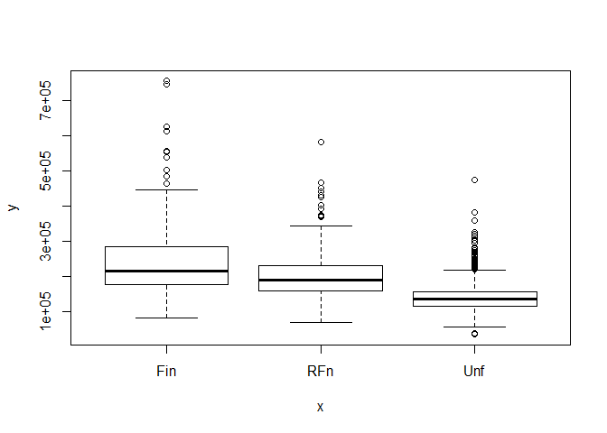

``` r
data$GarageFinish[is.na(data$GarageFinish)] <- "None"
plot(as.factor(data$GarageFinish),data$SalePrice) # It seems ordinal 
```

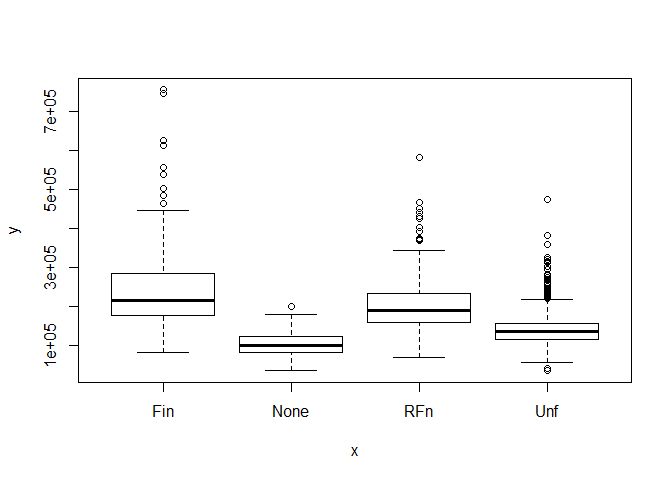

``` r
levels(as.factor(data$GarageFinish))
```

    ## [1] "Fin"  "None" "RFn"  "Unf"

``` r
Finish <- c('None' = 0, "Unf" = 1, "RFn" = 2, "Fin" = 3)
data$GarageFinish<-revalue(data$GarageFinish,Finish)
data$GarageFinish<-as.integer(data$GarageFinish)  
plot(data$GarageFinish,data$SalePrice)
```

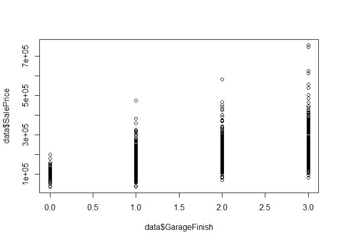

**GarageQual: Garage quality**
------------------------------

``` r
table(data$GarageQual)
```

    ## 
    ##   Ex   Fa   Gd   Po   TA 
    ##    3  124   24    5 2604

``` r
plot(as.factor(data$GarageQual),data$SalePrice)
```


``` r
data$GarageQual[is.na(data$GarageQual)] <- "None"
plot(as.factor(data$GarageQual),data$SalePrice)
```

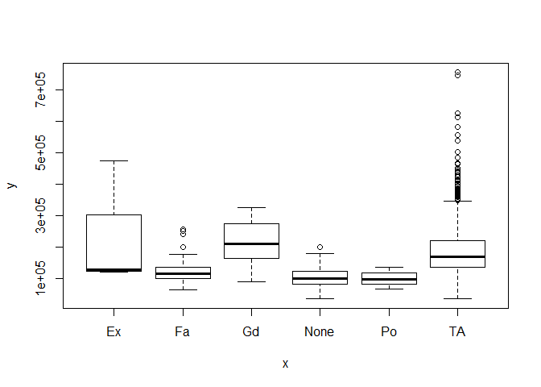

``` r
data$GarageQual<-revalue(data$GarageQual,Qual_Cond)
table(data$GarageQual)
```

    ## 
    ##    0    1    2    3    4    5 
    ##  159    5  124 2604   24    3

``` r
data$GarageQual<-as.integer(data$GarageQual)
```

**GarageCond: Garage condition**
--------------------------------

``` r
table(data$GarageCond)
```

    ## 
    ##   Ex   Fa   Gd   Po   TA 
    ##    3   74   15   14 2654

``` r
plot(as.factor(data$GarageCond),data$SalePrice)
```


``` r
data$GarageCond[is.na(data$GarageCond)] <- "None"
plot(as.factor(data$GarageCond),data$SalePrice)
```


``` r
data$GarageCond<-revalue(data$GarageCond,Qual_Cond)
table(data$GarageCond)
```

    ## 
    ##    0    1    2    3    4    5 
    ##  159   14   74 2654   15    3

``` r
data$GarageCond<-as.integer(data$GarageCond)
```

We can see the correlation between garage condition and quality.

``` r
cor(data$GarageCond,data$GarageQual)
```

    ## [1] 0.9466563

It is a huge correlation,we must drop one of 2 variables

``` r
cor(data[1:1459,'SalePrice'],data[1:1459,'GarageCond'])
```

    ## [1] 0.2632897

``` r
cor(data[1:1459,'SalePrice'],data[1:1459,'GarageQual'])
```

    ## [1] 0.2739379

We’ll drop the variable less correlated with sales price

``` r
data <- subset(data, select = -GarageCond)
```

**GarageType: Garage location**
-------------------------------

``` r
table(data$GarageType)
```

    ## 
    ##  2Types  Attchd Basment BuiltIn CarPort  Detchd 
    ##      23    1723      36     186      15     779

``` r
plot(as.factor(data$GarageType),data$SalePrice)
```

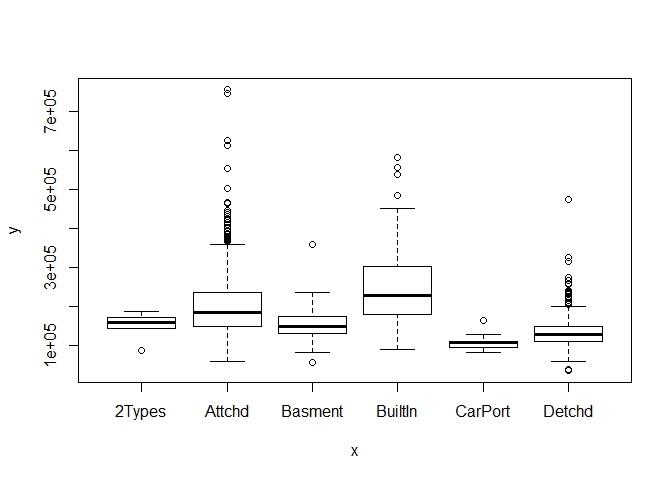

``` r
data$GarageType[is.na(data$GarageType)] <- "None"
plot(as.factor(data$GarageType),data$SalePrice)
data$GarageType<-as.factor(data$GarageType)
plot(data$GarageType,data$SalePrice)
```

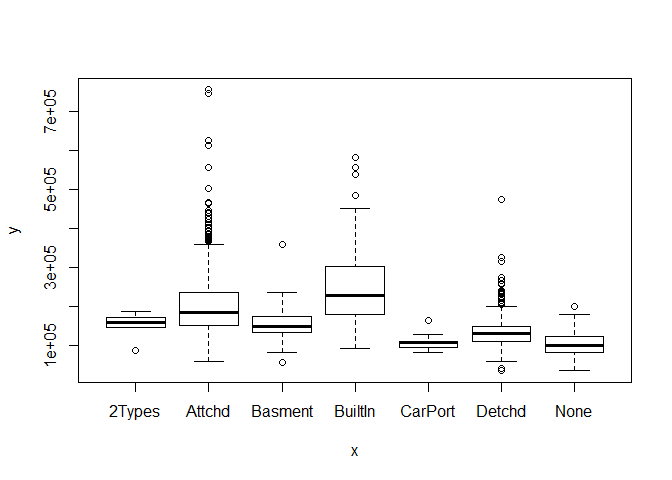

**BsmtCond:Evaluates the general condition of the basement**
------------------------------------------------------------

``` r
table(data$BsmtCond)
```

    ## 
    ##   Fa   Gd   Po   TA 
    ##  104  122    5 2606

``` r
plot(as.factor(data$BsmtCond),data$SalePrice)
```

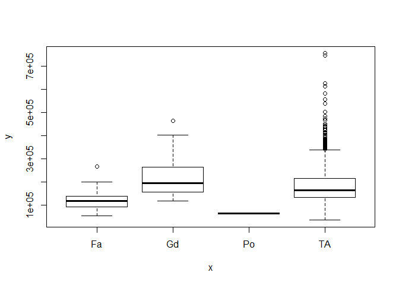

``` r
data$BsmtCond[is.na(data$BsmtCond)] <- "None"
plot(as.factor(data$BsmtCond),data$SalePrice)
```

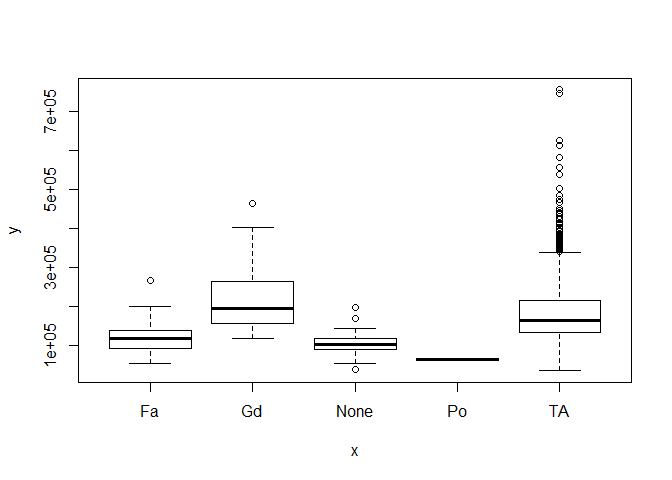

``` r
data$BsmtCond<-revalue(data$BsmtCond,Qual_Cond)
table(data$BsmtCond)
```

    ## 
    ##    0    1    2    3    4 
    ##   82    5  104 2606  122

``` r
data$BsmtCond<-as.integer(data$BsmtCond)
plot(as.factor(data$BsmtCond),data$SalePrice)
```


There seems to be a correlation with the house price.

**BsmtExposure:Refers to walkout or garden level walls**
--------------------------------------------------------

``` r
table(data$BsmtExposure)
```

    ## 
    ##   Av   Gd   Mn   No 
    ##  418  276  239 1904

``` r
plot(as.factor(data$BsmtExposure),data$SalePrice)
```


``` r
data$BsmtExposure[is.na(data$BsmtExposure)] <- "None"
plot(as.factor(data$BsmtExposure),data$SalePrice)
```


``` r
Exposure<-c("None"=0,"No"=1,'Mn'=2,'Av'=3,'Gd'=4)
data$BsmtExposure<-revalue(data$BsmtExposure,Exposure)
table(data$BsmtExposure)
```

    ## 
    ##    0    1    2    3    4 
    ##   82 1904  239  418  276

``` r
data$BsmtExposure<-as.integer(data$BsmtExposure)
plot(as.factor(data$BsmtExposure),data$SalePrice)
```

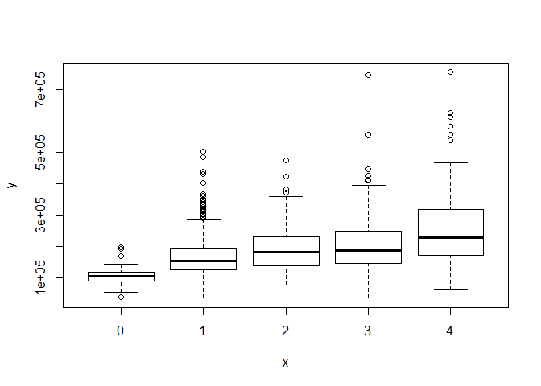

**BsmtQual:Evaluates the height of the basement**
-------------------------------------------------

``` r
table(data$BsmtQual)
```

    ## 
    ##   Ex   Fa   Gd   TA 
    ##  258   88 1209 1283

``` r
plot(as.factor(data$BsmtQual),data$SalePrice)
```


``` r
data$BsmtQual[is.na(data$BsmtQual)] <- "None"
plot(as.factor(data$BsmtQual),data$SalePrice)
```


``` r
data$BsmtQual<-revalue(data$BsmtQual,Qual_Cond)
table(data$BsmtQual)
```

    ## 
    ##    0    2    3    4    5 
    ##   81   88 1283 1209  258

``` r
data$BsmtQual<-as.integer(data$BsmtQual)
plot(as.factor(data$BsmtQual),data$SalePrice)
```


**BsmtFinType1:Rating of basement finished area**
-------------------------------------------------

``` r
table(data$BsmtFinType1)
```

    ## 
    ## ALQ BLQ GLQ LwQ Rec Unf 
    ## 429 269 849 154 288 851

``` r
plot(as.factor(data$BsmtFinType1),data$SalePrice)
```


``` r
data$BsmtFinType1[is.na(data$BsmtFinType1)] <- "None"
plot(as.factor(data$BsmtFinType1),data$SalePrice)
```


``` r
Bsm_type<-c("None"=0,"Unf"=1,'LwQ'=2,'Rec'=3,'BLQ'=4,'ALQ'=5,'GLQ'=6)
data$BsmtFinType1<-revalue(data$BsmtFinType1,Bsm_type)
table(data$BsmtFinType1)
```

    ## 
    ##   0   1   2   3   4   5   6 
    ##  79 851 154 288 269 429 849

``` r
data$BsmtFinType1<-as.integer(data$BsmtFinType1)
plot(as.factor(data$BsmtFinType1),data$SalePrice)
```


**BsmtFinType2:Rating of basement finished area (if multiple types)**
---------------------------------------------------------------------

``` r
table(data$BsmtFinType2)
```

    ## 
    ##  ALQ  BLQ  GLQ  LwQ  Rec  Unf 
    ##   52   68   34   87  105 2493

``` r
plot(as.factor(data$BsmtFinType2),data$SalePrice)
```


``` r
data$BsmtFinType2[is.na(data$BsmtFinType2)] <- "None"
plot(as.factor(data$BsmtFinType2),data$SalePrice)
```


``` r
data$BsmtFinType2<-revalue(data$BsmtFinType2,Bsm_type)
table(data$BsmtFinType2)
```

    ## 
    ##    0    1    2    3    4    5    6 
    ##   80 2493   87  105   68   52   34

``` r
data$BsmtFinType2<-as.integer(data$BsmtFinType2)
plot(as.factor(data$BsmtFinType2),data$SalePrice)
```


**MasVnrType: Masonry veneer type (walls).**
--------------------------------------------

``` r
table(data$MasVnrType)
```

    ## 
    ##  BrkCmn BrkFace    None   Stone 
    ##      25     879    1742     249

``` r
plot(as.factor(data$MasVnrType),data$SalePrice)
```


``` r
data$MasVnrType[is.na(data$MasVnrType)] <- "None" #Replace all Na's with 'none'
Masonry <- c('None'=0, 'BrkCmn'=1, 'BrkFace'=2, 'Stone'=3)
data$MasVnrType<-revalue(data$MasVnrType,Masonry)
table(data$MasVnrType)
```

    ## 
    ##    0    1    2    3 
    ## 1766   25  879  249

``` r
data$MasVnrType<-as.integer(data$MasVnrType)
plot(as.factor(data$MasVnrType),data$SalePrice)
```


**MasVnrArea: Masonry veneer area in square feet**
--------------------------------------------------

``` r
plot(data$MasVnrArea,data$SalePrice)
```


``` r
data$MasVnrArea[is.na(data$MasVnrArea)] <- 0
data$MasVnrArea<-as.numeric(data$MasVnrArea)
plot(data$MasVnrArea,data$SalePrice)
```


**MSZoning: Identifies the general zoning classification of the sale.**
-----------------------------------------------------------------------

``` r
table(data$MSZoning)
```

    ## 
    ## C (all)      FV      RH      RL      RM 
    ##      25     139      26    2265     460

``` r
plot(as.factor(data$MSZoning),data$SalePrice)
```


How we can find the missing values? Let’s check out the MSSubClass

``` r
data[is.na(data$MSZoning),c("MSZoning",'MSSubClass')]
```

    ##      MSZoning MSSubClass
    ## 1916     <NA>         30
    ## 2217     <NA>         20
    ## 2251     <NA>         70
    ## 2905     <NA>         20

``` r
table(data[,c("MSZoning",'MSSubClass')])
```

    ##          MSSubClass
    ## MSZoning    20   30   40   45   50   60   70   75   80   85   90  120  150
    ##   C (all)    3    8    0    0    7    0    4    0    0    0    0    0    0
    ##   FV        34    0    0    0    0   43    0    0    0    0    0   19    0
    ##   RH         4    2    0    1    2    0    3    0    0    0    4    6    0
    ##   RL      1016   61    4    6  159  529   57    9  115   47   92  117    1
    ##   RM        20   67    2   11  119    3   63   14    3    1   13   40    0
    ##          MSSubClass
    ## MSZoning   160  180  190
    ##   C (all)    0    0    3
    ##   FV        43    0    0
    ##   RH         0    0    4
    ##   RL        21    0   31
    ##   RM        64   17   23

And now the correlations with numeric variables.

``` r
library(corrplot)
cor(data$MSSubClass,data[,sapply(data, is.numeric)]) #
```

    ##               Id MSSubClass LotFrontage  LotArea OverallQual OverallCond
    ## [1,] 0.008930622          1   -0.389469 -0.20173  0.03363797 -0.06562504
    ##       YearBuilt YearRemodAdd  MasVnrType  MasVnrArea   BsmtQual
    ## [1,] 0.03440874   0.04331491 0.007170029 0.006309137 0.06525105
    ##          BsmtCond BsmtExposure BsmtFinType1 BsmtFinSF1 BsmtFinType2
    ## [1,] -0.003662076   0.05929913   0.05162957         NA  -0.03622638
    ##      BsmtFinSF2 BsmtUnfSF TotalBsmtSF  X1stFlrSF X2ndFlrSF LowQualFinSF
    ## [1,]         NA        NA          NA -0.2486415 0.3093091   0.02648179
    ##       GrLivArea BsmtFullBath BsmtHalfBath  FullBath  HalfBath BedroomAbvGr
    ## [1,] 0.07167745           NA           NA 0.1391396 0.1787502 -0.008796152
    ##      KitchenAbvGr TotRmsAbvGrd  Fireplaces FireplaceQu GarageFinish
    ## [1,]    0.2601555   0.04050946 -0.05515069 -0.05154243  -0.03689839
    ##      GarageCars GarageArea  GarageQual  WoodDeckSF OpenPorchSF
    ## [1,]         NA         NA -0.09573865 -0.01765413  -0.0159232
    ##      EnclosedPorch  X3SsnPorch ScreenPorch     PoolArea       PoolQC
    ## [1,]   -0.02086725 -0.03752892 -0.04918147 -0.003079582 -0.001679514
    ##          MiscVal       MoSold     YrSold SalePrice
    ## [1,] -0.02886686 -0.001231139 -0.0150278        NA

It is not higly correlated with other numeric variables.<br> So by
examining the above table, we will replace MSSubClass=20 with RL ,
MSSubClass=70 and MSSubClass=30 with RM.

``` r
data$MSZoning[is.na(data$MSZoning)]<-c('RM','RL','RM','RL')
data[is.na(data$MSZoning),c("MSZoning",'MSSubClass')]
```

    ## [1] MSZoning   MSSubClass
    ## <0 rows> (or 0-length row.names)

``` r
data$MSZoning<-as.factor(data$MSZoning)
```

**Utilities: Type of utilities available**
------------------------------------------

We don’t need this variable for prediction , as there is only one house
“NoSeWa”.

``` r
table(data$Utilities)
```

    ## 
    ## AllPub NoSeWa 
    ##   2916      1

``` r
data <- subset(data, select = -Utilities)
```

**BsmtFullBath:Basement full bathrooms**
----------------------------------------

``` r
table(data$BsmtFullBath)
```

    ## 
    ##    0    1    2    3 
    ## 1705 1172   38    2

Let’s find all the basement variables below.

``` r
paste(colnames(select(data,contains("Bsmt"))),collapse="','")
```

    ## [1] "BsmtQual','BsmtCond','BsmtExposure','BsmtFinType1','BsmtFinSF1','BsmtFinType2','BsmtFinSF2','BsmtUnfSF','TotalBsmtSF','BsmtFullBath','BsmtHalfBath"

``` r
data[is.na(data$BsmtFullBath),c('BsmtQual','BsmtCond','BsmtExposure','BsmtFinType1','BsmtFinSF1','BsmtFinType2','BsmtFinSF2','BsmtUnfSF','TotalBsmtSF','BsmtFullBath','BsmtHalfBath')]
```

    ##      BsmtQual BsmtCond BsmtExposure BsmtFinType1 BsmtFinSF1 BsmtFinType2
    ## 2121        0        0            0            0         NA            0
    ## 2189        0        0            0            0          0            0
    ##      BsmtFinSF2 BsmtUnfSF TotalBsmtSF BsmtFullBath BsmtHalfBath
    ## 2121         NA        NA          NA           NA           NA
    ## 2189          0         0           0           NA           NA

We conclude that these variables are higly corralated and so we will
replace the Na’s with zero value

``` r
data$BsmtFullBath[is.na(data$BsmtFullBath)]<-0 # Replace missing value with zero
plot(as.factor(data$BsmtFullBath),data$SalePrice)
```


``` r
data$BsmtFullBath<-as.integer(data$BsmtFullBath)
```

**BsmtHalfBath: Basement half bathrooms**
-----------------------------------------

We proceed with the same way as above.

``` r
table(data$BsmtHalfBath)
```

    ## 
    ##    0    1    2 
    ## 2742  171    4

``` r
paste(colnames(select(data,contains("Bsmt"))),collapse="','")
```

    ## [1] "BsmtQual','BsmtCond','BsmtExposure','BsmtFinType1','BsmtFinSF1','BsmtFinType2','BsmtFinSF2','BsmtUnfSF','TotalBsmtSF','BsmtFullBath','BsmtHalfBath"

``` r
data[is.na(data$BsmtHalfBath),c('BsmtQual','BsmtCond','BsmtExposure','BsmtFinType1','BsmtFinSF1','BsmtFinType2','BsmtFinSF2','BsmtUnfSF','TotalBsmtSF','BsmtFullBath','BsmtHalfBath')]
```

    ##      BsmtQual BsmtCond BsmtExposure BsmtFinType1 BsmtFinSF1 BsmtFinType2
    ## 2121        0        0            0            0         NA            0
    ## 2189        0        0            0            0          0            0
    ##      BsmtFinSF2 BsmtUnfSF TotalBsmtSF BsmtFullBath BsmtHalfBath
    ## 2121         NA        NA          NA            0           NA
    ## 2189          0         0           0            0           NA

``` r
data$BsmtHalfBath[is.na(data$BsmtHalfBath)]<-0 # Replace missing value with zero
plot(as.factor(data$BsmtHalfBath),data$SalePrice)
```


``` r
data$BsmtHalfBath<-as.integer(data$BsmtHalfBath)
#we can see the correlation 
cor(data$BsmtHalfBath,data$BsmtFullBath) #It is not correlated
```

    ## [1] -0.1486548

**Functional: Home functionality (Assume typical unless deductions are warranted)**
-----------------------------------------------------------------------------------

``` r
table(data$Functional)
```

    ## 
    ## Maj1 Maj2 Min1 Min2  Mod  Sev  Typ 
    ##   19    9   65   70   35    2 2717

``` r
plot(as.factor(data$Functional),data$SalePrice)
```


We will replace the Na’s with the most common value 7, which is typical
functionality

``` r
data$Functional[is.na(data$Functional)]<-7
Functional<-c('Sal'=0, 'Sev'=1, 'Maj2'=2, 'Maj1'=3, 'Mod'=4, 'Min2'=5, 'Min1'=6, 'Typ'=7)
data$Functional <- as.integer(revalue(data$Functional, Functional))
table(data$Functional)
```

    ## 
    ##    1    2    3    4    5    6    7 
    ##    2    9   19   35   70   65 2719

**GarageCars Size of garage in car capacity**
---------------------------------------------

``` r
table(as.factor(data$GarageCars))
```

    ## 
    ##    0    1    2    3    4    5 
    ##  157  776 1594  374   16    1

``` r
plot(as.factor(data$GarageCars))
```


``` r
plot(as.factor(data$GarageCars),data$SalePrice)
```


``` r
paste(colnames(select(data,contains("Garage"))),collapse="','")
```

    ## [1] "GarageType','GarageFinish','GarageCars','GarageArea','GarageQual"

``` r
data[is.na(data$GarageCars),c('GarageType','GarageFinish','GarageCars','GarageArea','GarageQual')]
```

    ##      GarageType GarageFinish GarageCars GarageArea GarageQual
    ## 2577     Detchd            0         NA         NA          0

``` r
data$GarageCars[is.na(data$GarageCars)]<-0 # Replace missing value with zero
data$GarageCars<-as.integer(data$GarageCars)
```

**GarageArea**
--------------

``` r
paste(colnames(select(data,contains("Garage"))),collapse="','")
```

    ## [1] "GarageType','GarageFinish','GarageCars','GarageArea','GarageQual"

``` r
data[is.na(data$GarageArea),c('GarageType','GarageFinish','GarageCars','GarageArea','GarageQual')]
```

    ##      GarageType GarageFinish GarageCars GarageArea GarageQual
    ## 2577     Detchd            0          0         NA          0

``` r
data$GarageArea[is.na(data$GarageArea)]<-0 # Replace missing value with zero
data$GarageArea<-as.integer(data$GarageArea)
plot(data$GarageArea,data$SalePrice)
```


Let’s find its correlation with other numeric values

``` r
cor(data[,sapply(data, is.numeric)],data$GarageArea)
```

    ##                       [,1]
    ## Id            -0.009851054
    ## MSSubClass    -0.103534194
    ## LotFrontage    0.338418737
    ## LotArea        0.213180376
    ## OverallQual    0.565179205
    ## OverallCond   -0.154311762
    ## YearBuilt      0.481328133
    ## YearRemodAdd   0.375892265
    ## MasVnrType     0.368002725
    ## MasVnrArea     0.371071383
    ## BsmtQual       0.422730492
    ## BsmtCond       0.136238741
    ## BsmtExposure   0.280947231
    ## BsmtFinType1   0.235311964
    ## BsmtFinSF1              NA
    ## BsmtFinType2   0.004557102
    ## BsmtFinSF2              NA
    ## BsmtUnfSF               NA
    ## TotalBsmtSF             NA
    ## X1stFlrSF      0.491996421
    ## X2ndFlrSF      0.127463905
    ## LowQualFinSF  -0.053430694
    ## GrLivArea      0.484547335
    ## BsmtFullBath   0.185151379
    ## BsmtHalfBath  -0.021217905
    ## FullBath       0.407519909
    ## HalfBath       0.179396010
    ## BedroomAbvGr   0.073723102
    ## KitchenAbvGr  -0.057647570
    ## TotRmsAbvGrd   0.328627638
    ## Functional     0.068753326
    ## Fireplaces     0.295175204
    ## FireplaceQu    0.342810880
    ## GarageFinish   0.511991097
    ## GarageCars     0.889890224
    ## GarageArea     1.000000000
    ## GarageQual     0.552595491
    ## WoodDeckSF     0.237384942
    ## OpenPorchSF    0.232875830
    ## EnclosedPorch -0.108382360
    ## X3SsnPorch     0.029493114
    ## ScreenPorch    0.062552079
    ## PoolArea       0.053053039
    ## PoolQC         0.063360935
    ## MiscVal        0.008506144
    ## MoSold         0.041181698
    ## YrSold        -0.012986182
    ## SalePrice               NA

It is correlated with GarageCars (Rsq = 0.889) <br> Should we drop
GarageArea or GarageCars? <br> We will examine which is less corellated
with Sales Price.

``` r
cor(data[1:1459,'SalePrice'],data[1:1459,'GarageArea'])
```

    ## [1] 0.6233849

``` r
cor(data[1:1459,'SalePrice'],data[1:1459,'GarageCars']) 
```

    ## [1] 0.6403833

We’ll drop the GarageArea variable, since it is less corellated with
sales Price

``` r
data <- subset(data, select = -GarageArea)
```

**KitchenQual: Kitchen quality**
--------------------------------

``` r
table(data$KitchenQual)
```

    ## 
    ##   Ex   Fa   Gd   TA 
    ##  205   70 1151 1492

``` r
data$KitchenQual[is.na(data$KitchenQual)] <- 'TA' #replace with most common value
KitchenQual <- c('None' = 0, 'Po' = 1, 'Fa' = 2, 'TA' = 3, 'Gd' = 4, 'Ex' = 5)
data$KitchenQual<-revalue(data$KitchenQual,KitchenQual)
data$KitchenQual<-as.integer(data$KitchenQual)
```

**TotalBsmtSF : Total square feet of basement area**
----------------------------------------------------

``` r
plot(data$TotalBsmtSF,data$SalePrice)
```


``` r
cor(data[1:1459,'SalePrice'],data[1:1459,'TotalBsmtSF'])
```

    ## [1] 0.6137915

``` r
data$TotalBsmtSF[is.na(data$TotalBsmtSF)]
```

    ## [1] NA

``` r
paste(colnames(select(data,contains("Bsmt"))),collapse="','")
```

    ## [1] "BsmtQual','BsmtCond','BsmtExposure','BsmtFinType1','BsmtFinSF1','BsmtFinType2','BsmtFinSF2','BsmtUnfSF','TotalBsmtSF','BsmtFullBath','BsmtHalfBath"

``` r
data[is.na(data$TotalBsmtSF),c('BsmtQual','BsmtCond','BsmtExposure','BsmtFinType1','BsmtFinSF1','BsmtFinType2','BsmtFinSF2','BsmtUnfSF','TotalBsmtSF','BsmtFullBath','BsmtHalfBath')]
```

    ##      BsmtQual BsmtCond BsmtExposure BsmtFinType1 BsmtFinSF1 BsmtFinType2
    ## 2121        0        0            0            0         NA            0
    ##      BsmtFinSF2 BsmtUnfSF TotalBsmtSF BsmtFullBath BsmtHalfBath
    ## 2121         NA        NA          NA            0            0

``` r
data$TotalBsmtSF[is.na(data$TotalBsmtSF)]<-0 # Replace missing value with zero
```

**BsmtFinSF1: Type 1 finished square feet**
-------------------------------------------

``` r
plot(data$BsmtFinSF1,data$SalePrice)
```


``` r
cor(data[1:1459,'SalePrice'],data[1:1459,'BsmtFinSF1'])
```

    ## [1] 0.3867829

``` r
data$BsmtFinSF1[is.na(data$BsmtFinSF1)]
```

    ## [1] NA

``` r
paste(colnames(select(data,contains("Bsmt"))),collapse="','")
```

    ## [1] "BsmtQual','BsmtCond','BsmtExposure','BsmtFinType1','BsmtFinSF1','BsmtFinType2','BsmtFinSF2','BsmtUnfSF','TotalBsmtSF','BsmtFullBath','BsmtHalfBath"

``` r
data[is.na(data$BsmtFinSF1),c('BsmtQual','BsmtCond','BsmtExposure','BsmtFinType1','BsmtFinSF1','BsmtFinType2','BsmtFinSF2','BsmtUnfSF','TotalBsmtSF','BsmtFullBath','BsmtHalfBath')]
```

    ##      BsmtQual BsmtCond BsmtExposure BsmtFinType1 BsmtFinSF1 BsmtFinType2
    ## 2121        0        0            0            0         NA            0
    ##      BsmtFinSF2 BsmtUnfSF TotalBsmtSF BsmtFullBath BsmtHalfBath
    ## 2121         NA        NA           0            0            0

``` r
data$BsmtFinSF1[is.na(data$BsmtFinSF1)]<-0 # Replace missing value with zero
```

**BsmtUnfSF: Unfinished square feet of basement area**
------------------------------------------------------

``` r
plot(data$BsmtUnfSF,data$SalePrice)
```


``` r
cor(data[1:1459,'SalePrice'],data[1:1459,'BsmtUnfSF'])
```

    ## [1] 0.2142805

``` r
data$BsmtUnfSF[is.na(data$BsmtUnfSF)]
```

    ## [1] NA

``` r
paste(colnames(select(data,contains("Bsmt"))),collapse="','")
```

    ## [1] "BsmtQual','BsmtCond','BsmtExposure','BsmtFinType1','BsmtFinSF1','BsmtFinType2','BsmtFinSF2','BsmtUnfSF','TotalBsmtSF','BsmtFullBath','BsmtHalfBath"

``` r
data[is.na(data$BsmtUnfSF),c('BsmtQual','BsmtCond','BsmtExposure','BsmtFinType1','BsmtFinSF1','BsmtFinType2','BsmtFinSF2','BsmtUnfSF','TotalBsmtSF','BsmtFullBath','BsmtHalfBath')]
```

    ##      BsmtQual BsmtCond BsmtExposure BsmtFinType1 BsmtFinSF1 BsmtFinType2
    ## 2121        0        0            0            0          0            0
    ##      BsmtFinSF2 BsmtUnfSF TotalBsmtSF BsmtFullBath BsmtHalfBath
    ## 2121         NA        NA           0            0            0

``` r
data$BsmtUnfSF[is.na(data$BsmtUnfSF)]<-0 # Replace missing value with zero
```

Let’s see if it is correlated with another variable

``` r
cor(data$BsmtUnfSF,data[,sapply(data, is.numeric)])
```

    ##               Id MSSubClass LotFrontage    LotArea OverallQual OverallCond
    ## [1,] -0.01479023 -0.1255609   0.1063813 0.02158978   0.2756429  -0.1386875
    ##      YearBuilt YearRemodAdd MasVnrType MasVnrArea  BsmtQual  BsmtCond
    ## [1,] 0.1307862    0.1657697  0.1086214 0.08817341 0.2358125 0.1748441
    ##      BsmtExposure BsmtFinType1 BsmtFinSF1 BsmtFinType2 BsmtFinSF2
    ## [1,]  -0.04344334   -0.3881147 -0.4767712   -0.1902104         NA
    ##      BsmtUnfSF TotalBsmtSF X1stFlrSF     X2ndFlrSF LowQualFinSF GrLivArea
    ## [1,]         1   0.4128104 0.2967876 -3.236541e-05   0.04694399 0.2343882
    ##      BsmtFullBath BsmtHalfBath  FullBath    HalfBath BedroomAbvGr
    ## [1,]   -0.3976477   -0.1068404 0.2735304 -0.03545913    0.1836307
    ##      KitchenAbvGr KitchenQual TotRmsAbvGrd Functional  Fireplaces
    ## [1,]   0.06505947   0.1892703    0.2480153 0.03766712 0.005216017
    ##      FireplaceQu GarageFinish GarageCars   GarageQual  WoodDeckSF
    ## [1,]   0.1097402    0.0847243  0.1807326 -0.009866555 -0.03896365
    ##      OpenPorchSF EnclosedPorch   X3SsnPorch ScreenPorch    PoolArea
    ## [1,]   0.1200272   0.005161546 -0.005763676 -0.04901855 -0.03223645
    ##           PoolQC     MiscVal     MoSold      YrSold SalePrice
    ## [1,] -0.02994952 -0.01045017 0.02295447 -0.03807293        NA

It is correlated with BsmtFinSF1 (-0.476). <br> We continue with the
next variable

**BsmtFinSF2: Type 2 finished square feet**
-------------------------------------------

``` r
plot(data$BsmtFinSF2,data$SalePrice)
```

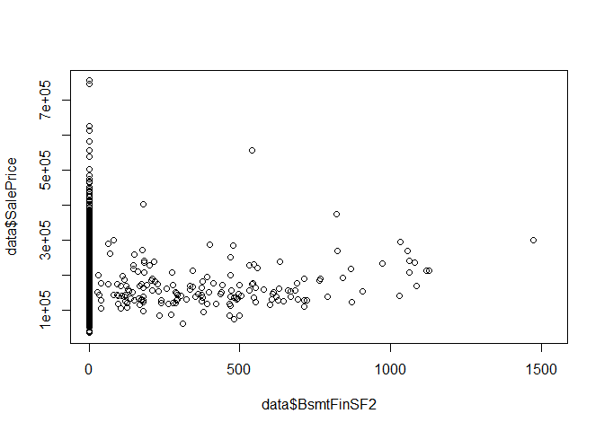

``` r
cor(data[1:1459,'SalePrice'],data[1:1459,'BsmtFinSF2'])
```

    ## [1] -0.01095189

``` r
data$BsmtFinSF2[is.na(data$BsmtFinSF2)]
```

    ## [1] NA

``` r
paste(colnames(select(data,contains("Bsmt"))),collapse="','")
```

    ## [1] "BsmtQual','BsmtCond','BsmtExposure','BsmtFinType1','BsmtFinSF1','BsmtFinType2','BsmtFinSF2','BsmtUnfSF','TotalBsmtSF','BsmtFullBath','BsmtHalfBath"

``` r
data[is.na(data$BsmtFinSF2),c('BsmtQual','BsmtCond','BsmtExposure','BsmtFinType1','BsmtFinSF1','BsmtFinType2','BsmtFinSF2','BsmtUnfSF','TotalBsmtSF','BsmtFullBath','BsmtHalfBath')]
```

    ##      BsmtQual BsmtCond BsmtExposure BsmtFinType1 BsmtFinSF1 BsmtFinType2
    ## 2121        0        0            0            0          0            0
    ##      BsmtFinSF2 BsmtUnfSF TotalBsmtSF BsmtFullBath BsmtHalfBath
    ## 2121         NA         0           0            0            0

``` r
data$BsmtFinSF2[is.na(data$BsmtFinSF2)]<-0 # Replace missing value with zero
cor(data$BsmtFinSF1,data$BsmtFinSF2)
```

    ## [1] -0.05493841

We will probably drop this variable,let’s see if it is correlated with
another

``` r
cor(data$BsmtFinSF2,data[,sapply(data, is.numeric)])
```

    ##              Id  MSSubClass LotFrontage    LotArea OverallQual OverallCond
    ## [1,] 0.01817004 -0.07243126  0.04032958 0.08410715  -0.0426052  0.04135923
    ##        YearBuilt YearRemodAdd  MasVnrType  MasVnrArea    BsmtQual
    ## [1,] -0.02750704  -0.06195898 -0.02374806 -0.01457983 -0.01267815
    ##        BsmtCond BsmtExposure BsmtFinType1  BsmtFinSF1 BsmtFinType2
    ## [1,] 0.07567332    0.1025202   0.02628983 -0.05493841    0.7992987
    ##      BsmtFinSF2  BsmtUnfSF TotalBsmtSF  X1stFlrSF   X2ndFlrSF LowQualFinSF
    ## [1,]          1 -0.2380433  0.08956092 0.08438942 -0.09765352  -0.00491318
    ##        GrLivArea BsmtFullBath BsmtHalfBath    FullBath    HalfBath
    ## [1,] -0.01774713    0.1629569   0.09953007 -0.07531358 -0.03236835
    ##      BedroomAbvGr KitchenAbvGr KitchenQual TotRmsAbvGrd  Functional
    ## [1,]   -0.0311113   -0.0377576  -0.0453763  -0.04824545 -0.06372228
    ##      Fireplaces FireplaceQu GarageFinish  GarageCars GarageQual WoodDeckSF
    ## [1,] 0.06570734 0.004498087  0.009004049 -0.01447615 0.06432276  0.0984622
    ##       OpenPorchSF EnclosedPorch  X3SsnPorch ScreenPorch   PoolArea
    ## [1,] -0.005804508    0.03277453 -0.02326797  0.06332908 0.04452989
    ##          PoolQC      MiscVal     MoSold      YrSold SalePrice
    ## [1,] 0.02187298 -0.005129682 -0.0095096 0.008866935        NA

Correlated with BsmtFinType2 <br> Now we see the correlations between
basement variables

``` r
paste(colnames(select(data,contains("Bsmt"))),collapse="','")
```

    ## [1] "BsmtQual','BsmtCond','BsmtExposure','BsmtFinType1','BsmtFinSF1','BsmtFinType2','BsmtFinSF2','BsmtUnfSF','TotalBsmtSF','BsmtFullBath','BsmtHalfBath"

``` r
cor(data[,c('BsmtQual','BsmtCond','BsmtExposure','BsmtFinType1','BsmtFinSF1','BsmtFinType2','BsmtFinSF2','BsmtUnfSF','TotalBsmtSF','BsmtFullBath','BsmtHalfBath')])
```

    ##                  BsmtQual   BsmtCond BsmtExposure BsmtFinType1
    ## BsmtQual      1.000000000 0.62515749   0.43626210   0.41987055
    ## BsmtCond      0.625157488 1.00000000   0.26430401   0.30704435
    ## BsmtExposure  0.436262102 0.26430401   1.00000000   0.36706771
    ## BsmtFinType1  0.419870554 0.30704435   0.36706771   1.00000000
    ## BsmtFinSF1    0.337365829 0.16986992   0.39857979   0.70298124
    ## BsmtFinType2  0.101212924 0.22661106   0.13262795   0.09950210
    ## BsmtFinSF2   -0.012678151 0.07567332   0.10252021   0.02628983
    ## BsmtUnfSF     0.235812550 0.17484410  -0.04344334  -0.38811470
    ## TotalBsmtSF   0.578576765 0.37870825   0.40769434   0.34937955
    ## BsmtFullBath  0.259072937 0.16954774   0.33859998   0.58455430
    ## BsmtHalfBath -0.006908995 0.04755341   0.08910495   0.08452306
    ##                BsmtFinSF1 BsmtFinType2  BsmtFinSF2   BsmtUnfSF TotalBsmtSF
    ## BsmtQual      0.337365829  0.101212924 -0.01267815  0.23581255  0.57857677
    ## BsmtCond      0.169869918  0.226611061  0.07567332  0.17484410  0.37870825
    ## BsmtExposure  0.398579791  0.132627953  0.10252021 -0.04344334  0.40769434
    ## BsmtFinType1  0.702981238  0.099502102  0.02628983 -0.38811470  0.34937955
    ## BsmtFinSF1    1.000000000 -0.008849972 -0.05493841 -0.47677116  0.53665002
    ## BsmtFinType2 -0.008849972  1.000000000  0.79929873 -0.19021038  0.10785668
    ## BsmtFinSF2   -0.054938405  0.799298733  1.00000000 -0.23804333  0.08956092
    ## BsmtUnfSF    -0.476771163 -0.190210384 -0.23804333  1.00000000  0.41281039
    ## TotalBsmtSF   0.536650022  0.107856678  0.08956092  0.41281039  1.00000000
    ## BsmtFullBath  0.639038348  0.187877971  0.16295695 -0.39764765  0.32625176
    ## BsmtHalfBath  0.078500167  0.109564023  0.09953007 -0.10684037  0.01277996
    ##              BsmtFullBath BsmtHalfBath
    ## BsmtQual        0.2590729 -0.006908995
    ## BsmtCond        0.1695477  0.047553407
    ## BsmtExposure    0.3386000  0.089104955
    ## BsmtFinType1    0.5845543  0.084523061
    ## BsmtFinSF1      0.6390383  0.078500167
    ## BsmtFinType2    0.1878780  0.109564023
    ## BsmtFinSF2      0.1629569  0.099530071
    ## BsmtUnfSF      -0.3976477 -0.106840367
    ## TotalBsmtSF     0.3262518  0.012779965
    ## BsmtFullBath    1.0000000 -0.148654812
    ## BsmtHalfBath   -0.1486548  1.000000000

We will create a corrplot for better understanding the correlations

``` r
corrplot(cor(data[,c('BsmtQual','BsmtCond','BsmtExposure','BsmtFinType1','BsmtFinSF1','BsmtFinType2','BsmtFinSF2','BsmtUnfSF','TotalBsmtSF','BsmtFullBath','BsmtHalfBath')])
,method = "square")
```

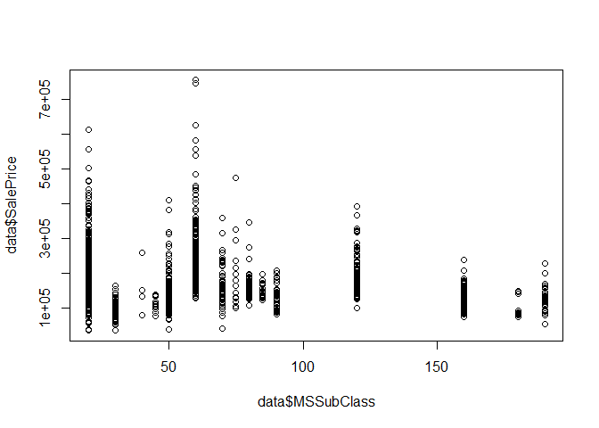

The basement quality and basement condition (which are important
variables) are not correlated with BsmtHalfBath and BsmtFinSF2. So we
will drop these two variables

``` r
data <- subset(data, select = -BsmtFinSF2)
data <- subset(data, select = -BsmtHalfBath)
```

**Now that we have taken care of Na’s let’s see which are the numeric variables.**
----------------------------------------------------------------------------------

``` r
colnames(data[,sapply(data, is.numeric)]) #check out which columns are numeric 
```

    ##  [1] "Id"            "MSSubClass"    "LotFrontage"   "LotArea"      
    ##  [5] "OverallQual"   "OverallCond"   "YearBuilt"     "YearRemodAdd" 
    ##  [9] "MasVnrType"    "MasVnrArea"    "BsmtQual"      "BsmtCond"     
    ## [13] "BsmtExposure"  "BsmtFinType1"  "BsmtFinSF1"    "BsmtFinType2" 
    ## [17] "BsmtUnfSF"     "TotalBsmtSF"   "X1stFlrSF"     "X2ndFlrSF"    
    ## [21] "LowQualFinSF"  "GrLivArea"     "BsmtFullBath"  "FullBath"     
    ## [25] "HalfBath"      "BedroomAbvGr"  "KitchenAbvGr"  "KitchenQual"  
    ## [29] "TotRmsAbvGrd"  "Functional"    "Fireplaces"    "FireplaceQu"  
    ## [33] "GarageFinish"  "GarageCars"    "GarageQual"    "WoodDeckSF"   
    ## [37] "OpenPorchSF"   "EnclosedPorch" "X3SsnPorch"    "ScreenPorch"  
    ## [41] "PoolArea"      "PoolQC"        "MiscVal"       "MoSold"       
    ## [45] "YrSold"        "SalePrice"

Let’s see also some correlations. <br> We will find the numeric
variables that have the highest correlation with the Saleprice variable
and examine them further.

``` r
corrplot(cor(na.omit(data[,sapply(data, is.numeric)])),method = "square")
```

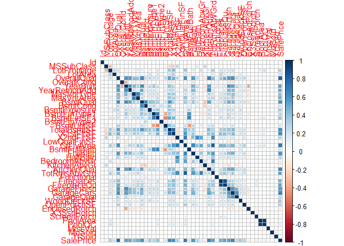

``` r
paste(which(cor(data[1:1459,sapply(data, is.numeric)],data[1:1459,'SalePrice'])>0.5 | cor(data[1:1459,sapply(data, is.numeric)],data[1:1459,'SalePrice'])<(-0.5)),collapse=',') # Check for high or low correlations
```

    ## [1] "5,7,8,11,18,19,22,24,28,29,32,33,34,46"

So the numeric variables that have the highest correlation with the
Saleprice are the following:

``` r
colnames(data[,sapply(data,is.numeric)][c(5,7,8,11,18,19,22,24,28,31,32,33,45)])
```

    ##  [1] "OverallQual"  "YearBuilt"    "YearRemodAdd" "BsmtQual"    
    ##  [5] "TotalBsmtSF"  "X1stFlrSF"    "GrLivArea"    "FullBath"    
    ##  [9] "KitchenQual"  "Fireplaces"   "FireplaceQu"  "GarageFinish"
    ## [13] "YrSold"

**MSSubClass: Identifies the type of dwelling involved in the sale.**
---------------------------------------------------------------------

``` r
plot(data$MSSubClass,data$SalePrice)
```

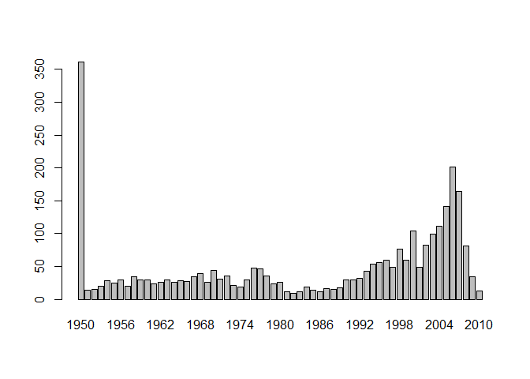

**In reality this is a factor and not numeric.**

``` r
table(as.factor(data$MSSubClass))
```

    ## 
    ##   20   30   40   45   50   60   70   75   80   85   90  120  150  160  180 
    ## 1079  139    6   18  287  575  128   23  118   48  109  182    1  128   17 
    ##  190 
    ##   61

``` r
data$MSSubClass<-as.factor(data$MSSubClass) # Change into factor variable
```

**OverallQual: Rates the overall material and finish of the house**
-------------------------------------------------------------------

``` r
table(as.factor(data$OverallQual))
```

    ## 
    ##   1   2   3   4   5   6   7   8   9  10 
    ##   4  13  40 226 825 731 600 342 107  31

``` r
plot(as.factor(data$OverallQual),data$SalePrice)
```

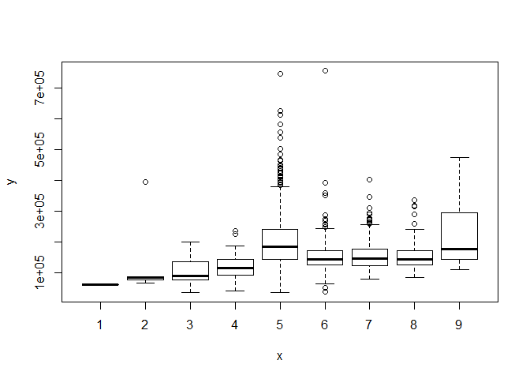

``` r
data$OverallQual<-as.integer(data$OverallQual) # Change into integer variable
table(data$OverallQual)
```

    ## 
    ##   1   2   3   4   5   6   7   8   9  10 
    ##   4  13  40 226 825 731 600 342 107  31

This seems very important variable for our predictions. Let’s see what
will happen if we run a regression just with this variable.

``` r
linreg_qual <- lm(SalePrice ~ OverallQual, data=data)
summary(linreg_qual)
```

    ## 
    ## Call:
    ## lm(formula = SalePrice ~ OverallQual, data = data)
    ## 
    ## Residuals:
    ##     Min      1Q  Median      3Q     Max 
    ## -198152  -29409   -1845   21463  396848 
    ## 
    ## Coefficients:
    ##             Estimate Std. Error t value Pr(>|t|)    
    ## (Intercept) -96206.1     5756.4  -16.71   <2e-16 ***
    ## OverallQual  45435.8      920.4   49.36   <2e-16 ***
    ## ---
    ## Signif. codes:  0 '***' 0.001 '**' 0.01 '*' 0.05 '.' 0.1 ' ' 1
    ## 
    ## Residual standard error: 48620 on 1458 degrees of freedom
    ##   (1459 observations deleted due to missingness)
    ## Multiple R-squared:  0.6257, Adjusted R-squared:  0.6254 
    ## F-statistic:  2437 on 1 and 1458 DF,  p-value: < 2.2e-16

We have a very high R-sqaure of 0.66! Just this variable is able to
explain much variance in our model.

**OverallCond: Rates the overall condition of the house**
---------------------------------------------------------

``` r
table(as.factor(data$OverallCond))
```

    ## 
    ##    1    2    3    4    5    6    7    8    9 
    ##    7   10   50  101 1645  531  390  144   41

``` r
plot(as.factor(data$OverallCond),data$SalePrice)
```


``` r
data$OverallCond<-as.integer(data$OverallCond)
table(data$OverallCond)
```

    ## 
    ##    1    2    3    4    5    6    7    8    9 
    ##    7   10   50  101 1645  531  390  144   41

**YearBuilt: Original construction date**
-----------------------------------------

``` r
plot(as.factor(data$YearBuilt))
```


``` r
table(as.factor(data$YearBuilt))
```

    ## 
    ## 1872 1875 1879 1880 1882 1885 1890 1892 1893 1895 1896 1898 1900 1901 1902 
    ##    1    1    1    5    1    2    7    2    1    3    1    1   29    2    1 
    ## 1904 1905 1906 1907 1908 1910 1911 1912 1913 1914 1915 1916 1917 1918 1919 
    ##    1    3    1    1    2   43    1    5    1    8   24   10    3   10    5 
    ## 1920 1921 1922 1923 1924 1925 1926 1927 1928 1929 1930 1931 1932 1934 1935 
    ##   57   11   16   17   16   34   19    9    9    8   26    7    5    5   13 
    ## 1936 1937 1938 1939 1940 1941 1942 1945 1946 1947 1948 1949 1950 1951 1952 
    ##   11    9   13   20   36   23    6   15   15   11   27   18   38   18   18 
    ## 1953 1954 1955 1956 1957 1958 1959 1960 1961 1962 1963 1964 1965 1966 1967 
    ##   24   43   34   39   35   48   43   37   34   35   35   33   34   35   41 
    ## 1968 1969 1970 1971 1972 1973 1974 1975 1976 1977 1978 1979 1980 1981 1982 
    ##   45   28   42   39   40   21   23   25   54   57   39   21   23    9    7 
    ## 1983 1984 1985 1986 1987 1988 1989 1990 1991 1992 1993 1994 1995 1996 1997 
    ##    8   19    7   10    8   15    8   19   12   27   39   37   31   34   35 
    ## 1998 1999 2000 2001 2002 2003 2004 2005 2006 2007 2008 2009 2010 
    ##   46   52   48   35   47   88   99  142  138  109   49   25    3

``` r
plot(as.factor(data$YearBuilt),data$SalePrice)
```

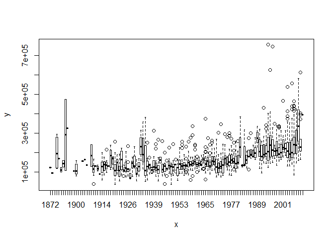

``` r
cor(data[1:1459,'SalePrice'],data[1:1459,'YearBuilt'])
```

    ## [1] 0.5228769

**YearRemodAdd: Remodel date (same as construction date if no remodeling or additions)**
----------------------------------------------------------------------------------------

``` r
plot(as.factor(data$YearRemodAdd))
```

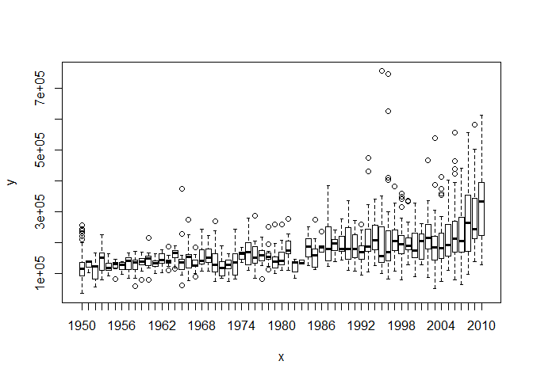

``` r
table(as.factor(data$YearRemodAdd))
```

    ## 
    ## 1950 1951 1952 1953 1954 1955 1956 1957 1958 1959 1960 1961 1962 1963 1964 
    ##  361   14   15   20   28   25   30   20   34   30   29   24   26   30   26 
    ## 1965 1966 1967 1968 1969 1970 1971 1972 1973 1974 1975 1976 1977 1978 1979 
    ##   28   27   34   39   26   44   31   35   21   19   30   48   46   36   24 
    ## 1980 1981 1982 1983 1984 1985 1986 1987 1988 1989 1990 1991 1992 1993 1994 
    ##   26   12    9   11   19   14   12   16   15   18   29   29   32   43   53 
    ## 1995 1996 1997 1998 1999 2000 2001 2002 2003 2004 2005 2006 2007 2008 2009 
    ##   56   59   49   77   60  104   49   82   99  111  141  202  164   81   34 
    ## 2010 
    ##   13

Interestingly, we observe that after year 2006 there is a sudden
decrease in remodelings.

``` r
plot(data$YearRemodAdd,data$SalePrice)
```

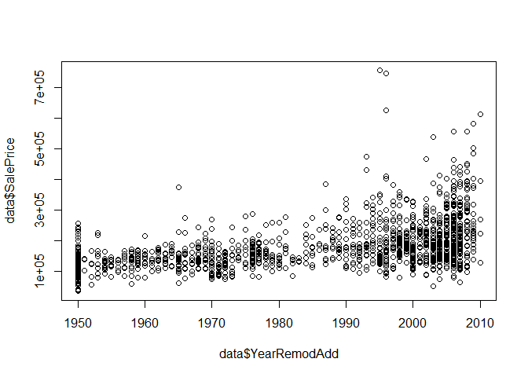

**Pool Area**
-------------

``` r
table(data$PoolArea) # We'll drop this variable (most observations belong to one parameter)
```

    ## 
    ##    0  144  228  368  444  480  512  519  555  561  576  648  738  800 
    ## 2906    1    1    1    1    1    1    1    1    1    1    1    1    1

``` r
data <- subset(data, select = -c(PoolArea))
```

### **PoolQC**

``` r
table(data$PoolQC) #we'll drop this variable
```

    ## 
    ##    0    2    4    5 
    ## 2909    2    4    4

``` r
data <- subset(data, select = -c(PoolQC))
```

**FullBath: Full bathrooms above grade**
----------------------------------------

We will convert this to integer

``` r
table(data$FullBath) 
```

    ## 
    ##    0    1    2    3    4 
    ##   12 1309 1530   64    4

``` r
FullBath <- as.integer(data$FullBath)
```

**TotRmsAbvGrd: Total rooms above grade (does not include bathrooms)**
----------------------------------------------------------------------

We will convert this to integer

``` r
table(data$TotRmsAbvGrd) 
```

    ## 
    ##   2   3   4   5   6   7   8   9  10  11  12  13  14  15 
    ##   1  25 196 583 844 649 347 143  80  32  16   1   1   1

``` r
TotRmsAbvGrd <- as.integer(data$TotRmsAbvGrd)
```

**GarageCars: Size of garage in car capacity**
----------------------------------------------

We will convert this to integer

``` r
table(data$GarageCars) 
```

    ## 
    ##    0    1    2    3    4    5 
    ##  158  776 1594  374   16    1

``` r
GarageCars <- as.integer(data$GarageCars)
```

**GrLivArea: Above grade (ground) living area square feet**
-----------------------------------------------------------

``` r
plot(data$GrLivArea,data$SalePrice)
```

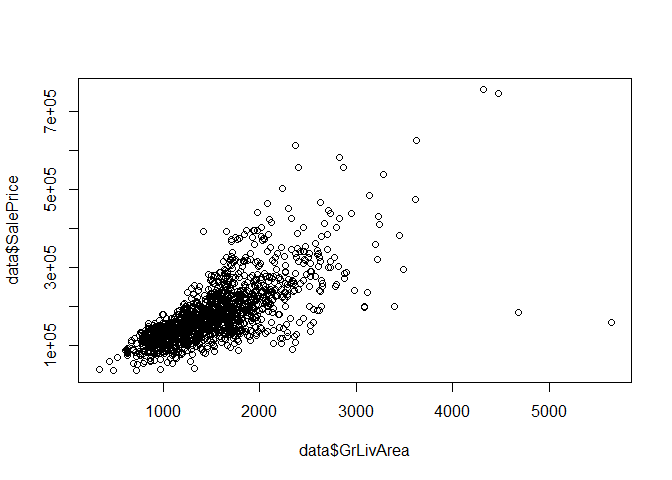

``` r
which(data[,"GrLivArea"]>4600) # outliers
```

    ## [1]  524 1299 2550

**Afer examining the above numeric variables, we also need to examine the remaining character variables.**
----------------------------------------------------------------------------------------------------------

``` r
colnames(data[,sapply(data, is.character)]) 
```

    ##  [1] "Street"        "LotShape"      "LandContour"   "LotConfig"    
    ##  [5] "LandSlope"     "Neighborhood"  "Condition1"    "Condition2"   
    ##  [9] "BldgType"      "HouseStyle"    "RoofStyle"     "RoofMatl"     
    ## [13] "Exterior1st"   "Exterior2nd"   "ExterQual"     "ExterCond"    
    ## [17] "Foundation"    "Heating"       "HeatingQC"     "CentralAir"   
    ## [21] "Electrical"    "PavedDrive"    "SaleType"      "SaleCondition"

**Street: Type of road access to property**
-------------------------------------------

``` r
plot(as.factor(data$Street))
```

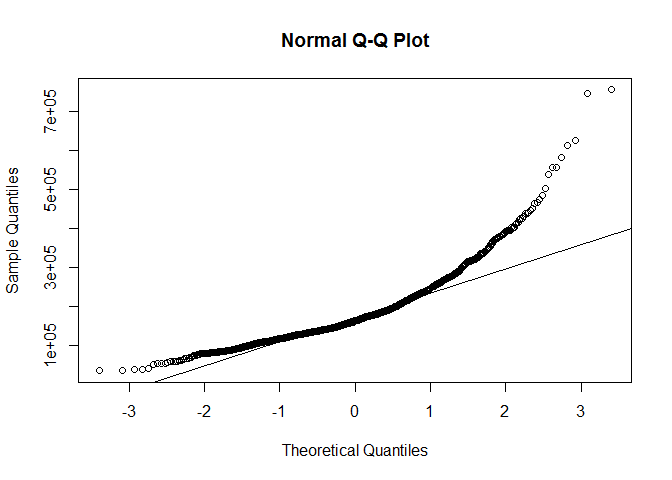

``` r
table(data$Street)
```

    ## 
    ## Grvl Pave 
    ##   12 2907

``` r
#Only 12 Gravels      
#removing Street variable 
data <- subset(data, select = -Street)
```

**Neighborhood**
----------------

``` r
data$Neighborhood <- as.factor(data$Neighborhood) # Convert to factor
table(data$Neighborhood)
```

    ## 
    ## Blmngtn Blueste  BrDale BrkSide ClearCr CollgCr Crawfor Edwards Gilbert 
    ##      28      10      30     108      44     267     103     194     165 
    ##  IDOTRR MeadowV Mitchel   NAmes NoRidge NPkVill NridgHt  NWAmes OldTown 
    ##      93      37     114     443      71      23     166     131     239 
    ##  Sawyer SawyerW Somerst StoneBr   SWISU  Timber Veenker 
    ##     151     125     182      51      48      72      24

``` r
plot(data$Neighborhood,data$SalePrice)
```

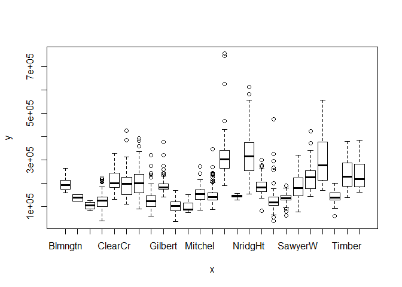 As
expected, Neighborhood seems to affect the price of a house.

**Foundation: Type of foundation**
----------------------------------

``` r
data$Foundation <- as.factor(data$Foundation) # Convert to factor
table(data$Foundation)
```

    ## 
    ## BrkTil CBlock  PConc   Slab  Stone   Wood 
    ##    311   1235   1308     49     11      5

``` r
plot(data$Foundation,data$SalePrice)
```

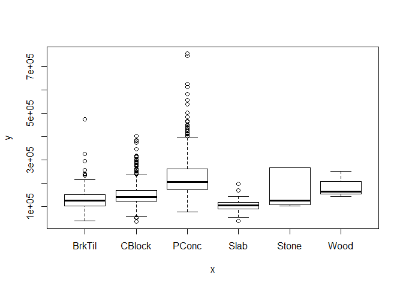

**Condition1: Proximity to various conditions**
-----------------------------------------------

``` r
data$Condition1 <- as.factor(data$Condition1) # Convert to factor
table(data$Condition1)
```

    ## 
    ## Artery  Feedr   Norm   PosA   PosN   RRAe   RRAn   RRNe   RRNn 
    ##     92    164   2511     20     39     28     50      6      9

``` r
plot(data$Condition1,data$SalePrice)
```

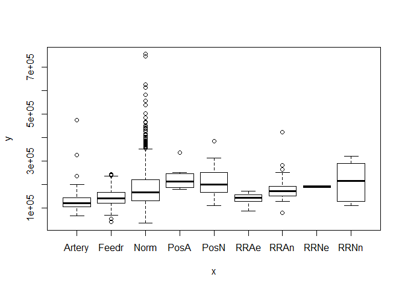

**LotShape: General shape of property**
---------------------------------------

``` r
data$LotShape<-as.integer(revalue(data$LotShape, c('IR3'=0, 'IR2'=1, 'IR1'=2, 'Reg'=3))) # Convert to integer
table(data$LotShape)
```

    ## 
    ##    0    1    2    3 
    ##   16   76  968 1859

``` r
plot(data$LotShape,data$SalePrice)
```

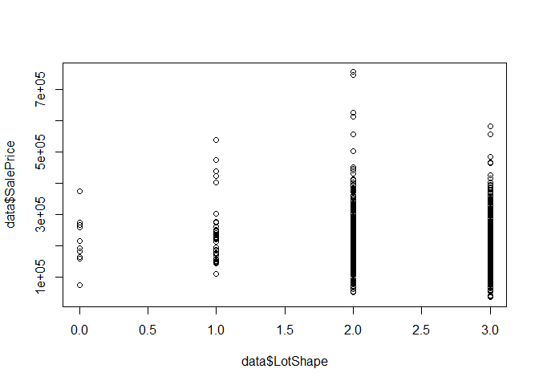

**ExterQual: Evaluates the quality of the material on the exterior**
--------------------------------------------------------------------

``` r
table(data$ExterQual)
```

    ## 
    ##   Ex   Fa   Gd   TA 
    ##  107   35  979 1798

``` r
ExterQual <- c('None' = 0, 'Po' = 1, 'Fa' = 2, 'TA' = 3, 'Gd' = 4, 'Ex' = 5)
data$ExterQual<-revalue(data$ExterQual,ExterQual)
data$ExterQual<-as.integer(data$ExterQual)
```

**Prediction**
==============

**Using multiple regression**
-----------------------------

Now that we have taken care of most variables, we will use a multiple
regression to predict the prices on the test set and submit our
predictions to Kaggle. <br>

First, let’s examine the skewness of variable we want to predict

``` r
qqnorm(data$SalePrice)
qqline(data$SalePrice)
```


Our variable is not normally distributed so we will take the log of
SalePrice.

``` r
data$SalePrice <- log(data$SalePrice)
qqnorm(data$SalePrice)
qqline(data$SalePrice)
```

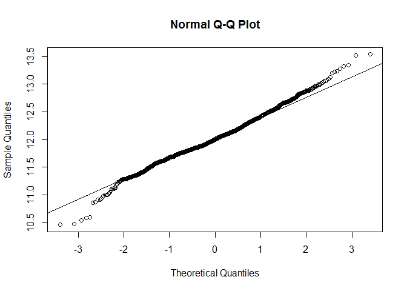

The log transformation seems to have solved this problem.

**Id**
------

We will keep id in a vector called Id

``` r
Id<-data[is.na(data$SalePrice),"Id"]
```

**We will now split our dataset in train and test set**
-------------------------------------------------------

``` r
train_data <- data[!is.na(data$SalePrice),]
test_data <- data[is.na(data$SalePrice),]
```

``` r
fitall <- lm(SalePrice ~. , data=train_data)
summary(fitall)
```

    ## 
    ## Call:
    ## lm(formula = SalePrice ~ ., data = train_data)
    ## 
    ## Residuals:
    ##      Min       1Q   Median       3Q      Max 
    ## -0.71073 -0.04598  0.00000  0.05643  0.71073 
    ## 
    ## Coefficients: (3 not defined because of singularities)
    ##                        Estimate Std. Error t value Pr(>|t|)    
    ## (Intercept)           8.997e+00  4.756e+00   1.892 0.058723 .  
    ## Id                   -4.495e-06  7.107e-06  -0.632 0.527179    
    ## MSSubClass30         -5.778e-02  2.160e-02  -2.675 0.007570 ** 
    ## MSSubClass40         -1.034e-01  8.005e-02  -1.291 0.196806    
    ## MSSubClass45         -2.370e-01  1.038e-01  -2.283 0.022607 *  
    ## MSSubClass50          3.369e-02  3.993e-02   0.844 0.398917    
    ## MSSubClass60         -3.389e-02  3.523e-02  -0.962 0.336285    
    ## MSSubClass70          9.339e-03  3.802e-02   0.246 0.806001    
    ## MSSubClass75         -5.817e-02  6.801e-02  -0.855 0.392598    
    ## MSSubClass80         -4.877e-03  5.282e-02  -0.092 0.926455    
    ## MSSubClass85          1.894e-02  4.820e-02   0.393 0.694414    
    ## MSSubClass90         -2.136e-02  3.271e-02  -0.653 0.513864    
    ## MSSubClass120        -7.602e-02  6.722e-02  -1.131 0.258319    
    ## MSSubClass160        -1.607e-01  8.023e-02  -2.003 0.045435 *  
    ## MSSubClass180        -5.314e-02  8.928e-02  -0.595 0.551825    
    ## MSSubClass190        -3.885e-02  1.179e-01  -0.329 0.741893    
    ## MSZoningFV            4.655e-01  5.547e-02   8.393  < 2e-16 ***
    ## MSZoningRH            4.599e-01  5.472e-02   8.405  < 2e-16 ***
    ## MSZoningRL            4.492e-01  4.695e-02   9.567  < 2e-16 ***
    ## MSZoningRM            4.053e-01  4.408e-02   9.196  < 2e-16 ***
    ## LotFrontage           5.187e-04  1.979e-04   2.621 0.008862 ** 
    ## LotArea               2.312e-06  4.623e-07   5.001 6.51e-07 ***
    ## AlleyNone            -9.947e-03  1.944e-02  -0.512 0.608972    
    ## AlleyPave             2.839e-02  2.878e-02   0.986 0.324158    
    ## LotShape              1.998e-03  6.245e-03   0.320 0.749106    
    ## LandContourHLS        3.653e-02  2.368e-02   1.542 0.123235    
    ## LandContourLow        4.408e-03  2.916e-02   0.151 0.879871    
    ## LandContourLvl        2.715e-02  1.701e-02   1.596 0.110757    
    ## LotConfigCulDSac      3.361e-02  1.518e-02   2.214 0.027009 *  
    ## LotConfigFR2         -2.605e-02  1.855e-02  -1.404 0.160478    
    ## LotConfigFR3         -9.116e-02  5.802e-02  -1.571 0.116391    
    ## LotConfigInside      -1.137e-02  8.190e-03  -1.388 0.165457    
    ## LandSlopeMod          2.208e-02  1.827e-02   1.208 0.227221    
    ## LandSlopeSev         -1.153e-01  4.863e-02  -2.370 0.017945 *  
    ## NeighborhoodBlueste   5.866e-02  9.060e-02   0.647 0.517468    
    ## NeighborhoodBrDale    2.409e-02  5.335e-02   0.452 0.651581    
    ## NeighborhoodBrkSide   4.565e-02  4.299e-02   1.062 0.288581    
    ## NeighborhoodClearCr   4.888e-02  4.222e-02   1.158 0.247157    
    ## NeighborhoodCollgCr   2.006e-03  3.297e-02   0.061 0.951482    
    ## NeighborhoodCrawfor   1.253e-01  3.933e-02   3.186 0.001479 ** 
    ## NeighborhoodEdwards  -3.999e-02  3.641e-02  -1.098 0.272345    
    ## NeighborhoodGilbert  -1.986e-03  3.522e-02  -0.056 0.955051    
    ## NeighborhoodIDOTRR    1.828e-02  4.898e-02   0.373 0.709052    
    ## NeighborhoodMeadowV  -1.086e-01  5.598e-02  -1.940 0.052609 .  
    ## NeighborhoodMitchel  -2.015e-02  3.709e-02  -0.543 0.587001    
    ## NeighborhoodNAmes    -1.091e-02  3.550e-02  -0.307 0.758690    
    ## NeighborhoodNoRidge   5.278e-02  3.855e-02   1.369 0.171143    
    ## NeighborhoodNPkVill   1.807e-02  6.355e-02   0.284 0.776248    
    ## NeighborhoodNridgHt   1.216e-01  3.277e-02   3.710 0.000216 ***
    ## NeighborhoodNWAmes   -1.140e-02  3.660e-02  -0.311 0.755484    
    ## NeighborhoodOldTown  -1.060e-02  4.386e-02  -0.242 0.809070    
    ## NeighborhoodSawyer    6.923e-04  3.691e-02   0.019 0.985036    
    ## NeighborhoodSawyerW   8.429e-03  3.558e-02   0.237 0.812769    
    ## NeighborhoodSomerst   5.742e-02  4.012e-02   1.431 0.152630    
    ## NeighborhoodStoneBr   1.575e-01  3.765e-02   4.183 3.08e-05 ***
    ## NeighborhoodSWISU     1.118e-02  4.423e-02   0.253 0.800469    
    ## NeighborhoodTimber    1.389e-02  3.739e-02   0.371 0.710400    
    ## NeighborhoodVeenker   7.102e-02  4.769e-02   1.489 0.136689    
    ## Condition1Feedr       2.687e-02  2.270e-02   1.184 0.236794    
    ## Condition1Norm        7.384e-02  1.883e-02   3.922 9.28e-05 ***
    ## Condition1PosA        1.869e-02  4.575e-02   0.409 0.682959    
    ## Condition1PosN        7.354e-02  3.389e-02   2.170 0.030211 *  
    ## Condition1RRAe       -3.059e-02  4.173e-02  -0.733 0.463731    
    ## Condition1RRAn        5.653e-02  3.161e-02   1.788 0.073939 .  
    ## Condition1RRNe       -3.926e-03  8.098e-02  -0.048 0.961343    
    ## Condition1RRNn        4.796e-02  5.759e-02   0.833 0.405165    
    ## Condition2Feedr       2.181e-01  1.162e-01   1.877 0.060750 .  
    ## Condition2Norm        1.873e-01  1.026e-01   1.825 0.068287 .  
    ## Condition2PosA        3.231e-01  1.756e-01   1.840 0.065993 .  
    ## Condition2PosN       -6.633e-01  1.337e-01  -4.960 8.03e-07 ***
    ## Condition2RRAe       -4.797e-01  3.282e-01  -1.462 0.144113    
    ## Condition2RRAn        1.079e-01  1.522e-01   0.709 0.478349    
    ## Condition2RRNn        1.924e-01  1.314e-01   1.464 0.143414    
    ## BldgType2fmCon        2.005e-02  1.144e-01   0.175 0.860881    
    ## BldgTypeDuplex               NA         NA      NA       NA    
    ## BldgTypeTwnhs         1.634e-03  7.203e-02   0.023 0.981906    
    ## BldgTypeTwnhsE        2.345e-02  6.845e-02   0.343 0.731968    
    ## HouseStyle1.5Unf      2.671e-01  1.031e-01   2.589 0.009729 ** 
    ## HouseStyle1Story      3.930e-02  4.020e-02   0.978 0.328489    
    ## HouseStyle2.5Fin     -9.273e-03  7.513e-02  -0.123 0.901794    
    ## HouseStyle2.5Unf      1.254e-01  7.111e-02   1.763 0.078084 .  
    ## HouseStyle2Story      4.064e-02  3.716e-02   1.094 0.274248    
    ## HouseStyleSFoyer      2.925e-03  5.368e-02   0.054 0.956553    
    ## HouseStyleSLvl        4.346e-02  5.908e-02   0.736 0.462131    
    ## OverallQual           4.127e-02  4.673e-03   8.831  < 2e-16 ***
    ## OverallCond           3.530e-02  3.953e-03   8.931  < 2e-16 ***
    ## YearBuilt             1.655e-03  3.730e-04   4.437 9.93e-06 ***
    ## YearRemodAdd          5.757e-04  2.473e-04   2.328 0.020074 *  
    ## RoofStyleGable       -3.251e-02  8.334e-02  -0.390 0.696562    
    ## RoofStyleGambrel     -7.619e-02  9.185e-02  -0.830 0.406946    
    ## RoofStyleHip         -2.658e-02  8.359e-02  -0.318 0.750547    
    ## RoofStyleMansard     -6.681e-03  9.749e-02  -0.069 0.945376    
    ## RoofStyleShed         3.950e-01  1.758e-01   2.247 0.024841 *  
    ## RoofMatlCompShg       2.453e+00  1.475e-01  16.628  < 2e-16 ***
    ## RoofMatlMembran       2.746e+00  2.073e-01  13.251  < 2e-16 ***
    ## RoofMatlMetal         2.590e+00  2.091e-01  12.386  < 2e-16 ***
    ## RoofMatlRoll          2.417e+00  1.868e-01  12.940  < 2e-16 ***
    ## RoofMatlTar&Grv       2.451e+00  1.692e-01  14.487  < 2e-16 ***
    ## RoofMatlWdShake       2.385e+00  1.645e-01  14.501  < 2e-16 ***
    ## RoofMatlWdShngl       2.549e+00  1.527e-01  16.688  < 2e-16 ***
    ## Exterior1stAsphShn   -6.127e-02  1.521e-01  -0.403 0.687121    
    ## Exterior1stBrkComm   -3.123e-01  1.286e-01  -2.429 0.015270 *  
    ## Exterior1stBrkFace    7.845e-02  5.867e-02   1.337 0.181419    
    ## Exterior1stCBlock    -8.377e-02  1.172e-01  -0.715 0.474956    
    ## Exterior1stCemntBd   -6.812e-02  8.736e-02  -0.780 0.435699    
    ## Exterior1stHdBoard   -2.566e-02  5.913e-02  -0.434 0.664470    
    ## Exterior1stImStucc   -4.934e-02  1.284e-01  -0.384 0.700799    
    ## Exterior1stMetalSd    2.510e-02  6.716e-02   0.374 0.708624    
    ## Exterior1stPlywood   -1.219e-02  5.846e-02  -0.208 0.834892    
    ## Exterior1stStone      3.333e-02  1.099e-01   0.303 0.761626    
    ## Exterior1stStucco     3.700e-02  6.479e-02   0.571 0.568031    
    ## Exterior1stVinylSd    2.140e-03  6.174e-02   0.035 0.972362    
    ## Exterior1stWd Sdng   -4.120e-02  5.688e-02  -0.724 0.468966    
    ## Exterior1stWdShing    1.241e-02  6.146e-02   0.202 0.839963    
    ## Exterior2ndAsphShn    9.195e-02  1.017e-01   0.904 0.366151    
    ## Exterior2ndBrk Cmn    1.114e-01  9.452e-02   1.178 0.238971    
    ## Exterior2ndBrkFace   -2.970e-02  6.004e-02  -0.495 0.620940    
    ## Exterior2ndCBlock            NA         NA      NA       NA    
    ## Exterior2ndCmentBd    1.229e-01  8.580e-02   1.432 0.152265    
    ## Exterior2ndHdBoard    3.133e-02  5.625e-02   0.557 0.577655    
    ## Exterior2ndImStucc    5.791e-02  6.473e-02   0.895 0.371124    
    ## Exterior2ndMetalSd    1.416e-02  6.521e-02   0.217 0.828110    
    ## Exterior2ndOther     -1.011e-01  1.251e-01  -0.808 0.419318    
    ## Exterior2ndPlywood    2.730e-02  5.480e-02   0.498 0.618508    
    ## Exterior2ndStone     -2.211e-02  7.845e-02  -0.282 0.778102    
    ## Exterior2ndStucco    -1.540e-02  6.213e-02  -0.248 0.804280    
    ## Exterior2ndVinylSd    2.827e-02  5.916e-02   0.478 0.632896    
    ## Exterior2ndWd Sdng    5.358e-02  5.440e-02   0.985 0.324815    
    ## Exterior2ndWd Shng   -1.524e-03  5.688e-02  -0.027 0.978628    
    ## MasVnrType            4.326e-03  4.188e-03   1.033 0.301871    
    ## MasVnrArea            1.227e-05  2.484e-05   0.494 0.621454    
    ## ExterQual             2.362e-03  9.667e-03   0.244 0.807018    
    ## ExterCondFa          -7.216e-02  8.333e-02  -0.866 0.386712    
    ## ExterCondGd          -7.314e-02  7.971e-02  -0.918 0.359015    
    ## ExterCondPo          -3.906e-02  1.417e-01  -0.276 0.782855    
    ## ExterCondTA          -5.176e-02  7.950e-02  -0.651 0.515127    
    ## FoundationCBlock      6.375e-03  1.464e-02   0.436 0.663242    
    ## FoundationPConc       3.174e-02  1.575e-02   2.016 0.044014 *  
    ## FoundationSlab       -2.497e-03  4.160e-02  -0.060 0.952144    
    ## FoundationStone       9.462e-02  5.135e-02   1.843 0.065631 .  
    ## FoundationWood       -1.125e-01  6.821e-02  -1.649 0.099339 .  
    ## BsmtQual              5.110e-03  7.825e-03   0.653 0.513907    
    ## BsmtCond              6.541e-04  9.789e-03   0.067 0.946735    
    ## BsmtExposure          1.197e-02  3.860e-03   3.100 0.001976 ** 
    ## BsmtFinType1          3.179e-03  2.321e-03   1.369 0.171101    
    ## BsmtFinSF1            3.436e-05  3.252e-05   1.057 0.290844    
    ## BsmtFinType2         -1.628e-03  5.809e-03  -0.280 0.779286    
    ## BsmtUnfSF            -3.174e-05  3.216e-05  -0.987 0.323918    
    ## TotalBsmtSF           9.812e-05  3.613e-05   2.716 0.006706 ** 
    ## HeatingGasA           1.418e-01  1.143e-01   1.241 0.215000    
    ## HeatingGasW           2.008e-01  1.173e-01   1.713 0.087008 .  
    ## HeatingGrav           1.053e-02  1.248e-01   0.084 0.932753    
    ## HeatingOthW           5.621e-02  1.424e-01   0.395 0.693133    
    ## HeatingWall           1.975e-01  1.330e-01   1.485 0.137856    
    ## HeatingQCFa          -2.306e-02  2.127e-02  -1.084 0.278525    
    ## HeatingQCGd          -2.034e-02  9.562e-03  -2.127 0.033585 *  
    ## HeatingQCPo          -1.184e-01  1.229e-01  -0.964 0.335325    
    ## HeatingQCTA          -2.785e-02  9.435e-03  -2.952 0.003219 ** 
    ## CentralAirY           6.186e-02  1.786e-02   3.463 0.000552 ***
    ## ElectricalFuseF      -2.344e-02  2.670e-02  -0.878 0.380100    
    ## ElectricalFuseP      -8.882e-03  7.687e-02  -0.116 0.908026    
    ## ElectricalMix         2.525e-02  1.200e-01   0.210 0.833360    
    ## ElectricalSBrkr      -1.995e-02  1.365e-02  -1.461 0.144207    
    ## X1stFlrSF             2.481e-04  2.426e-05  10.228  < 2e-16 ***
    ## X2ndFlrSF             2.411e-04  2.508e-05   9.613  < 2e-16 ***
    ## LowQualFinSF          2.461e-04  8.373e-05   2.940 0.003347 ** 
    ## GrLivArea                    NA         NA      NA       NA    
    ## BsmtFullBath          2.515e-02  8.496e-03   2.960 0.003133 ** 
    ## FullBath              2.316e-02  1.003e-02   2.310 0.021063 *  
    ## HalfBath              2.679e-02  9.574e-03   2.798 0.005214 ** 
    ## BedroomAbvGr         -3.859e-03  6.315e-03  -0.611 0.541273    
    ## KitchenAbvGr         -4.334e-02  2.754e-02  -1.573 0.115881    
    ## KitchenQual           1.991e-02  7.502e-03   2.655 0.008038 ** 
    ## TotRmsAbvGrd          6.481e-03  4.324e-03   1.499 0.134169    
    ## Functional            3.044e-02  5.230e-03   5.819 7.50e-09 ***
    ## Fireplaces            1.588e-02  1.009e-02   1.574 0.115839    
    ## FireplaceQu           2.935e-03  3.660e-03   0.802 0.422796    
    ## GarageTypeAttchd      9.461e-02  4.949e-02   1.912 0.056128 .  
    ## GarageTypeBasment     8.532e-02  5.799e-02   1.471 0.141457    
    ## GarageTypeBuiltIn     8.408e-02  5.183e-02   1.622 0.105031    
    ## GarageTypeCarPort     9.119e-02  6.477e-02   1.408 0.159376    
    ## GarageTypeDetchd      9.752e-02  4.940e-02   1.974 0.048574 *  
    ## GarageTypeNone        1.860e-01  6.583e-02   2.825 0.004801 ** 
    ## GarageFinish          5.407e-03  5.561e-03   0.972 0.331037    
    ## GarageCars            4.290e-02  7.374e-03   5.817 7.61e-09 ***
    ## GarageQual            3.799e-02  1.382e-02   2.750 0.006047 ** 
    ## PavedDriveP           1.620e-03  2.550e-02   0.064 0.949361    
    ## PavedDriveY           2.345e-02  1.551e-02   1.513 0.130603    
    ## WoodDeckSF            9.720e-05  2.664e-05   3.648 0.000275 ***
    ## OpenPorchSF           5.475e-05  5.293e-05   1.034 0.301234    
    ## EnclosedPorch         1.221e-04  5.739e-05   2.128 0.033528 *  
    ## X3SsnPorch            1.640e-04  1.030e-04   1.592 0.111665    
    ## ScreenPorch           2.895e-04  5.632e-05   5.141 3.17e-07 ***
    ## FenceGdWo            -3.553e-02  2.211e-02  -1.607 0.108386    
    ## FenceMnPrv           -5.675e-03  1.783e-02  -0.318 0.750340    
    ## FenceMnWw            -1.811e-02  3.733e-02  -0.485 0.627647    
    ## FenceNone            -3.859e-05  1.615e-02  -0.002 0.998094    
    ## MiscFeatureNone      -3.422e-01  4.522e-01  -0.757 0.449373    
    ## MiscFeatureOthr      -3.181e-01  4.098e-01  -0.776 0.437806    
    ## MiscFeatureShed      -3.341e-01  4.327e-01  -0.772 0.440088    
    ## MiscFeatureTenC      -4.946e-01  4.168e-01  -1.187 0.235541    
    ## MiscVal              -1.947e-05  2.840e-05  -0.685 0.493241    
    ## MoSold               -8.654e-04  1.128e-03  -0.767 0.443113    
    ## YrSold               -3.047e-03  2.327e-03  -1.309 0.190738    
    ## SaleTypeCon           9.328e-02  8.139e-02   1.146 0.251971    
    ## SaleTypeConLD         1.286e-01  4.475e-02   2.875 0.004110 ** 
    ## SaleTypeConLI        -3.095e-02  5.324e-02  -0.581 0.561118    
    ## SaleTypeConLw         1.804e-02  5.486e-02   0.329 0.742304    
    ## SaleTypeCWD           6.613e-02  5.909e-02   1.119 0.263227    
    ## SaleTypeNew           1.216e-01  7.103e-02   1.711 0.087245 .  
    ## SaleTypeOth           6.664e-02  6.740e-02   0.989 0.322995    
    ## SaleTypeWD           -9.253e-03  1.921e-02  -0.482 0.630163    
    ## SaleConditionAdjLand  1.107e-01  6.668e-02   1.661 0.096991 .  
    ## SaleConditionAlloca   6.807e-02  3.937e-02   1.729 0.084076 .  
    ## SaleConditionFamily   1.117e-02  2.806e-02   0.398 0.690524    
    ## SaleConditionNormal   6.785e-02  1.314e-02   5.163 2.83e-07 ***
    ## SaleConditionPartial -1.525e-02  6.837e-02  -0.223 0.823560    
    ## ---
    ## Signif. codes:  0 '***' 0.001 '**' 0.01 '*' 0.05 '.' 0.1 ' ' 1
    ## 
    ## Residual standard error: 0.1055 on 1245 degrees of freedom
    ##   (1 observation deleted due to missingness)
    ## Multiple R-squared:  0.9405, Adjusted R-squared:  0.9303 
    ## F-statistic: 92.34 on 213 and 1245 DF,  p-value: < 2.2e-16

**We will now try to fit a model using variable selection and more
specifically stepwise regression. We start with no variables and
gradually adding (or removing) variables in our model. Also we will
exclude the variable MsSubClass from our scope.**

    ## Start:  AIC=-2678.57
    ## SalePrice ~ 1
    ## 
    ##                 Df Sum of Sq     RSS     AIC
    ## + OverallQual    1   155.532  77.269 -4282.9
    ## + Neighborhood  24   132.999  99.801 -3863.5
    ## + GrLivArea      1   114.379 118.421 -3659.9
    ## + GarageCars     1   107.851 124.949 -3581.6
    ## + ExterQual      1   107.317 125.484 -3575.4
    ## + KitchenQual    1   103.885 128.916 -3536.0
    ## + BsmtQual       1    88.301 144.500 -3369.5
    ## + TotalBsmtSF    1    87.377 145.424 -3360.2
    ## + GarageFinish   1    85.294 147.506 -3339.5
    ## + X1stFlrSF      1    83.033 149.768 -3317.3
    ## + FullBath       1    82.387 150.413 -3311.0
    ## + YearBuilt      1    80.169 152.632 -3289.7
    ## + GarageType     6    78.025 154.775 -3259.3
    ## + YearRemodAdd   1    74.532 158.268 -3236.8
    ## + Foundation     5    70.744 162.056 -3194.2
    ## + FireplaceQu    1    69.544 163.256 -3191.5
    ## + TotRmsAbvGrd   1    66.493 166.308 -3164.5
    ## + Fireplaces     1    55.806 176.994 -3073.6
    ## + HeatingQC      4    54.377 178.424 -3055.9
    ## + MasVnrArea     1    42.412 190.389 -2967.2
    ## + MasVnrType     1    42.032 190.769 -2964.3
    ## + MSZoning       4    40.939 191.862 -2949.9
    ## + Exterior1st   14    42.292 190.509 -2940.2
    ## + Exterior2nd   15    39.949 192.851 -2920.4
    ## + BsmtFinSF1     1    32.242 200.558 -2891.2
    ## + GarageQual     1    30.721 202.080 -2880.2
    ## + BsmtExposure   1    29.748 203.052 -2873.2
    ## + SaleCondition  5    30.036 202.764 -2867.3
    ## + CentralAir     1    28.780 204.020 -2866.3
    ## + BsmtFinType1   1    26.123 206.678 -2847.4
    ## + LotFrontage    1    26.027 206.773 -2846.7
    ## + WoodDeckSF     1    25.991 206.809 -2846.5
    ## + SaleType       8    27.964 204.836 -2846.4
    ## + OpenPorchSF    1    24.005 208.796 -2832.5
    ## + X2ndFlrSF      1    23.741 209.059 -2830.7
    ## + HalfBath       1    22.973 209.828 -2825.3
    ## + HouseStyle     7    23.769 209.032 -2818.9
    ## + Electrical     4    22.471 210.330 -2815.8
    ## + PavedDrive     2    21.704 211.096 -2814.5
    ## + LotShape       1    19.050 213.751 -2798.3
    ## + BsmtCond       1    17.547 215.254 -2788.1
    ## + LotArea        1    15.415 217.386 -2773.7
    ## + BsmtFullBath   1    12.997 219.803 -2757.6
    ## + BsmtUnfSF      1    11.474 221.327 -2747.5
    ## + BedroomAbvGr   1    10.173 222.627 -2738.9
    ## + ExterCond      4    10.596 222.205 -2735.7
    ## + Fence          4     9.870 222.931 -2730.9
    ## + RoofStyle      5    10.035 222.765 -2730.0
    ## + BldgType       4     9.345 223.456 -2727.5
    ## + Condition1     8     9.879 222.922 -2723.0
    ## + Heating        5     7.670 225.131 -2714.6
    ## + Alley          2     6.434 226.367 -2712.6
    ## + LandContour    3     5.967 226.833 -2707.6
    ## + EnclosedPorch  1     5.172 227.628 -2706.5
    ## + KitchenAbvGr   1     5.068 227.732 -2705.9
    ## + LotConfig      4     5.434 227.367 -2702.2
    ## + Functional     1     4.325 228.476 -2701.1
    ## + ScreenPorch    1     3.420 229.380 -2695.3
    ## + RoofMatl       7     4.167 228.633 -2688.1
    ## + MiscFeature    4     2.295 230.506 -2682.2
    ## + Condition2     7     2.803 229.998 -2679.4
    ## + MoSold         1     0.765 232.035 -2678.5
    ## + X3SsnPorch     1     0.702 232.099 -2678.1
    ## + LowQualFinSF   1     0.335 232.465 -2675.8
    ## + YrSold         1     0.323 232.477 -2675.8
    ## <none>                       232.801 -2675.7
    ## + OverallCond    1     0.316 232.484 -2675.7
    ## + MiscVal        1     0.093 232.707 -2674.3
    ## + Id             1     0.075 232.725 -2674.2
    ## + BsmtFinType2   1     0.046 232.755 -2674.0
    ## + LandSlope      2     0.346 232.455 -2673.9
    ## 
    ## Step:  AIC=-4285.48
    ## SalePrice ~ OverallQual
    ## 
    ##                 Df Sum of Sq     RSS     AIC
    ## + Neighborhood  24    20.579  56.689 -4686.7
    ## + GrLivArea      1    16.788  60.481 -4638.3
    ## + GarageCars     1    13.075  64.194 -4551.3
    ## + X1stFlrSF      1    13.047  64.222 -4550.7
    ## + MSZoning       4    11.011  66.258 -4499.2
    ## + TotalBsmtSF    1     9.831  67.438 -4479.4
    ## + TotRmsAbvGrd   1     9.734  67.535 -4477.3
    ## + GarageType     6     9.270  67.998 -4457.3
    ## + BsmtFinSF1     1     7.700  69.569 -4434.0
    ## + Fireplaces     1     7.571  69.698 -4431.3
    ## + GarageFinish   1     7.514  69.754 -4430.1
    ## + FullBath       1     6.964  70.305 -4418.7
    ## + LotArea        1     6.873  70.396 -4416.8
    ## + FireplaceQu    1     6.501  70.767 -4409.1
    ## + KitchenQual    1     5.850  71.419 -4395.7
    ## + BsmtFinType1   1     5.198  72.071 -4382.5
    ## + BsmtFullBath   1     5.010  72.258 -4378.7
    ## + LotFrontage    1     4.963  72.305 -4377.7
    ## + YearBuilt      1     4.845  72.423 -4375.3
    ## + WoodDeckSF     1     4.756  72.513 -4373.5
    ## + YearRemodAdd   1     4.422  72.847 -4366.8
    ## + CentralAir     1     4.189  73.079 -4362.2
    ## + BldgType       4     4.366  72.903 -4359.7
    ## + Foundation     5     4.358  72.910 -4357.6
    ## + BsmtQual       1     3.937  73.331 -4357.2
    ## + GarageQual     1     3.921  73.348 -4356.8
    ## + BedroomAbvGr   1     3.725  73.543 -4353.0
    ## + LotShape       1     3.706  73.563 -4352.6
    ## + ExterQual      1     3.592  73.677 -4350.3
    ## + BsmtExposure   1     3.392  73.877 -4346.4
    ## + PavedDrive     2     3.369  73.900 -4343.9
    ## + HeatingQC      4     3.222  74.047 -4337.0
    ## + Exterior1st   14     4.107  73.162 -4334.5
    ## + MasVnrArea     1     2.471  74.798 -4328.3
    ## + Electrical     4     2.697  74.572 -4326.7
    ## + Exterior2nd   15     3.714  73.555 -4324.7
    ## + SaleCondition  5     2.603  74.666 -4322.9
    ## + HalfBath       1     2.035  75.234 -4319.8
    ## + LandSlope      2     2.021  75.248 -4317.5
    ## + HouseStyle     7     2.514  74.755 -4317.1
    ## + LandContour    3     1.949  75.320 -4314.1
    ## + LotConfig      4     1.879  75.390 -4310.8
    ## + X2ndFlrSF      1     1.530  75.739 -4310.0
    ## + MasVnrType     1     1.450  75.819 -4308.5
    ## + Heating        5     1.820  75.449 -4307.6
    ## + Alley          2     1.408  75.861 -4305.7
    ## + OpenPorchSF    1     1.222  76.047 -4304.1
    ## + ExterCond      4     1.516  75.753 -4303.8
    ## + ScreenPorch    1     1.090  76.179 -4301.6
    ## + Condition1     8     1.685  75.584 -4299.0
    ## + RoofStyle      5     1.284  75.985 -4297.3
    ## + RoofMatl       7     1.444  75.824 -4296.4
    ## + BsmtCond       1     0.753  76.516 -4295.1
    ## + EnclosedPorch  1     0.733  76.536 -4294.8
    ## + SaleType       8     1.432  75.837 -4294.2
    ## + BsmtFinType2   1     0.593  76.676 -4292.1
    ## + Condition2     7     0.998  76.271 -4287.8
    ## + OverallCond    1     0.349  76.920 -4287.5
    ## <none>                        77.339 -4285.5
    ## + BsmtUnfSF      1     0.228  77.041 -4285.2
    ## + X3SsnPorch     1     0.211  77.057 -4284.9
    ## + Functional     1     0.071  77.198 -4282.2
    ## + YrSold         1     0.052  77.217 -4281.8
    ## + LowQualFinSF   1     0.040  77.229 -4281.6
    ## + MiscVal        1     0.008  77.261 -4281.0
    ## + Id             1     0.005  77.264 -4280.9
    ## + KitchenAbvGr   1     0.002  77.267 -4280.9
    ## + MoSold         1     0.000  77.269 -4280.9
    ## + MiscFeature    4     0.256  77.013 -4279.7
    ## + Fence          4     0.118  77.151 -4277.1
    ## - OverallQual    1   155.462 232.801 -2678.6
    ## 
    ## Step:  AIC=-4690.89
    ## SalePrice ~ OverallQual + Neighborhood
    ## 
    ##                 Df Sum of Sq    RSS     AIC
    ## + GrLivArea      1    14.828 41.861 -5127.1
    ## + TotRmsAbvGrd   1     8.841 47.848 -4932.1
    ## + X1stFlrSF      1     7.904 48.785 -4903.8
    ## + GarageCars     1     6.962 49.728 -4875.9
    ## + TotalBsmtSF    1     5.487 51.202 -4833.2
    ## + Fireplaces     1     4.355 52.334 -4801.3
    ## + FullBath       1     4.227 52.462 -4797.8
    ## + BsmtFinSF1     1     3.925 52.765 -4789.4
    ## + FireplaceQu    1     3.737 52.952 -4784.2
    ## + KitchenQual    1     3.579 53.110 -4779.9
    ## + GarageFinish   1     3.360 53.330 -4773.9
    ## + BedroomAbvGr   1     3.340 53.349 -4773.3
    ## + GarageType     6     3.414 53.275 -4765.3
    ## + LotArea        1     3.012 53.677 -4764.4
    ## + BldgType       4     3.153 53.537 -4762.2
    ## + X2ndFlrSF      1     2.675 54.015 -4755.2
    ## + YearRemodAdd   1     2.593 54.096 -4753.0
    ## + WoodDeckSF     1     2.510 54.179 -4750.8
    ## + BsmtFullBath   1     2.397 54.292 -4747.8
    ## + GarageQual     1     2.185 54.505 -4742.1
    ## + BsmtFinType1   1     2.180 54.509 -4741.9
    ## + CentralAir     1     2.048 54.641 -4738.4
    ## + LotFrontage    1     1.917 54.772 -4734.9
    ## + BsmtQual       1     1.877 54.812 -4733.8
    ## + BsmtExposure   1     1.797 54.893 -4731.7
    ## + HeatingQC      4     1.965 54.724 -4730.2
    ## + SaleCondition  5     2.030 54.659 -4729.9
    ## + HalfBath       1     1.645 55.045 -4727.7
    ## + OverallCond    1     1.553 55.136 -4725.2
    ## + OpenPorchSF    1     1.492 55.197 -4723.6
    ## + ExterQual      1     1.357 55.332 -4720.1
    ## + Exterior1st   14     2.332 54.358 -4720.0
    ## + Heating        5     1.628 55.062 -4719.2
    ## + HouseStyle     7     1.600 55.089 -4714.5
    ## + MSZoning       4     1.324 55.365 -4713.2
    ## + MasVnrArea     1     1.045 55.644 -4711.9
    ## + ScreenPorch    1     1.029 55.660 -4711.4
    ## + Foundation     5     1.240 55.450 -4709.0
    ## + Electrical     4     1.116 55.574 -4707.7
    ## + BsmtCond       1     0.846 55.843 -4706.7
    ## + LotShape       1     0.828 55.862 -4706.2
    ## + YearBuilt      1     0.752 55.938 -4704.2
    ## + PavedDrive     2     0.769 55.921 -4702.6
    ## + ExterCond      4     0.916 55.774 -4702.5
    ## + LotConfig      4     0.861 55.828 -4701.1
    ## + SaleType       8     1.145 55.544 -4700.5
    ## + LandSlope      2     0.647 56.043 -4699.5
    ## + MasVnrType     1     0.506 56.183 -4697.8
    ## + Exterior2nd   15     1.525 55.164 -4696.5
    ## + RoofMatl       7     0.827 55.862 -4694.2
    ## + BsmtFinType2   1     0.356 56.333 -4693.9
    ## <none>                       56.692 -4690.9
    ## + RoofStyle      5     0.497 56.192 -4689.6
    ## + LandContour    3     0.315 56.375 -4688.8
    ## + Condition1     8     0.669 56.021 -4688.0
    ## + X3SsnPorch     1     0.124 56.565 -4687.9
    ## + LowQualFinSF   1     0.045 56.644 -4685.9
    ## + BsmtUnfSF      1     0.042 56.647 -4685.8
    ## + EnclosedPorch  1     0.039 56.650 -4685.7
    ## + YrSold         1     0.039 56.650 -4685.7
    ## + Functional     1     0.032 56.658 -4685.5
    ## + MiscVal        1     0.013 56.676 -4685.1
    ## + KitchenAbvGr   1     0.009 56.680 -4685.0
    ## + MoSold         1     0.006 56.684 -4684.9
    ## + Alley          2     0.082 56.608 -4684.8
    ## + Id             1     0.004 56.686 -4684.8
    ## + MiscFeature    4     0.158 56.532 -4682.8
    ## + Condition2     7     0.370 56.320 -4682.3
    ## + Fence          4     0.111 56.579 -4681.6
    ## - Neighborhood  24    20.647 77.339 -4285.5
    ## - OverallQual    1    43.224 99.916 -3865.5
    ## 
    ## Step:  AIC=-5131.67
    ## SalePrice ~ OverallQual + Neighborhood + GrLivArea
    ## 
    ##                 Df Sum of Sq    RSS     AIC
    ## + BsmtFinType1   1    3.5951 38.266 -5256.1
    ## + GarageCars     1    3.3599 38.501 -5247.2
    ## + BsmtFullBath   1    3.0768 38.784 -5236.5
    ## + BsmtFinSF1     1    2.9393 38.922 -5231.3
    ## + OverallCond    1    2.8867 38.974 -5229.4
    ## + CentralAir     1    2.7253 39.136 -5223.3
    ## + YearRemodAdd   1    2.4160 39.445 -5211.9
    ## + KitchenQual    1    2.3942 39.467 -5211.1
    ## + GarageFinish   1    2.3407 39.521 -5209.1
    ## + TotalBsmtSF    1    2.3351 39.526 -5208.9
    ## + GarageType     6    2.5298 39.331 -5206.1
    ## + BsmtExposure   1    2.2588 39.602 -5206.1
    ## + BsmtQual       1    2.1090 39.752 -5200.5
    ## + RoofMatl       7    2.4252 39.436 -5200.2
    ## + GarageQual     1    2.0236 39.838 -5197.4
    ## + YearBuilt      1    1.8490 40.012 -5191.0
    ## + X1stFlrSF      1    1.6955 40.166 -5185.4
    ## + BsmtCond       1    1.6560 40.205 -5184.0
    ## + HeatingQC      4    1.7806 40.081 -5182.5
    ## + HouseStyle     7    1.9076 39.954 -5181.2
    ## + X2ndFlrSF      1    1.5151 40.346 -5178.9
    ## + SaleCondition  5    1.6902 40.171 -5177.3
    ## + BldgType       4    1.6261 40.235 -5176.9
    ## + Foundation     5    1.6371 40.224 -5175.3
    ## + WoodDeckSF     1    1.2895 40.572 -5170.8
    ## + Fireplaces     1    1.2827 40.578 -5170.5
    ## + MSZoning       4    1.4019 40.459 -5168.8
    ## + FireplaceQu    1    1.2255 40.636 -5168.5
    ## + ExterCond      4    1.2280 40.633 -5162.6
    ## + Heating        5    1.2264 40.635 -5160.5
    ## + Exterior1st   14    1.7226 40.139 -5160.4
    ## + PavedDrive     2    1.0540 40.807 -5160.3
    ## + KitchenAbvGr   1    0.9720 40.889 -5159.4
    ## + Electrical     4    1.0498 40.811 -5156.2
    ## + LotArea        1    0.8540 41.007 -5155.2
    ## + Functional     1    0.8013 41.060 -5153.3
    ## + Exterior2nd   15    1.5680 40.293 -5152.8
    ## + ExterQual      1    0.7094 41.152 -5150.1
    ## + ScreenPorch    1    0.5998 41.261 -5146.2
    ## + LandContour    3    0.6278 41.233 -5143.2
    ## + Condition1     8    0.8658 40.995 -5141.6
    ## + SaleType       8    0.8038 41.057 -5139.4
    ## + BsmtUnfSF      1    0.3871 41.474 -5138.7
    ## + BsmtFinType2   1    0.3795 41.482 -5138.4
    ## + LotConfig      4    0.5474 41.314 -5138.3
    ## + MasVnrType     1    0.3091 41.552 -5135.9
    ## + Condition2     7    0.6431 41.218 -5135.7
    ## + LotShape       1    0.2738 41.587 -5134.7
    ## + LandSlope      2    0.2946 41.567 -5133.4
    ## + OpenPorchSF    1    0.1986 41.663 -5132.1
    ## <none>                       41.861 -5131.7
    ## + LowQualFinSF   1    0.1619 41.699 -5130.8
    ## + X3SsnPorch     1    0.1378 41.723 -5129.9
    ## + BedroomAbvGr   1    0.1327 41.728 -5129.8
    ## + LotFrontage    1    0.1175 41.744 -5129.2
    ## + MasVnrArea     1    0.0908 41.770 -5128.3
    ## + EnclosedPorch  1    0.0753 41.786 -5127.8
    ## + Alley          2    0.1307 41.730 -5127.7
    ## + RoofStyle      5    0.2840 41.577 -5127.1
    ## + FullBath       1    0.0162 41.845 -5125.7
    ## + Id             1    0.0155 41.846 -5125.7
    ## + MoSold         1    0.0103 41.851 -5125.5
    ## + YrSold         1    0.0057 41.856 -5125.3
    ## + HalfBath       1    0.0025 41.859 -5125.2
    ## + TotRmsAbvGrd   1    0.0007 41.861 -5125.1
    ## + MiscVal        1    0.0005 41.861 -5125.1
    ## + MiscFeature    4    0.1056 41.756 -5122.8
    ## + Fence          4    0.0704 41.791 -5121.6
    ## - OverallQual    1   14.2873 56.149 -4705.0
    ## - GrLivArea      1   14.8307 56.692 -4690.9
    ## - Neighborhood  24   18.6732 60.535 -4641.1
    ## 
    ## Step:  AIC=-5260.49
    ## SalePrice ~ OverallQual + Neighborhood + GrLivArea + BsmtFinType1
    ## 
    ##                 Df Sum of Sq    RSS     AIC
    ## + GarageCars     1    3.1649 35.101 -5380.1
    ## + OverallCond    1    2.4593 35.807 -5351.1
    ## + RoofMatl       7    2.7018 35.564 -5349.0
    ## + CentralAir     1    2.2714 35.995 -5343.4
    ## + YearRemodAdd   1    1.8943 36.372 -5328.2
    ## + GarageType     6    2.1343 36.132 -5327.9
    ## + GarageQual     1    1.7922 36.474 -5324.1
    ## + KitchenQual    1    1.7824 36.484 -5323.7
    ## + GarageFinish   1    1.7668 36.499 -5323.1
    ## + BldgType       4    1.8257 36.440 -5319.5
    ## + SaleCondition  5    1.8700 36.396 -5319.2
    ## + MSZoning       4    1.4849 36.781 -5305.9
    ## + HeatingQC      4    1.4358 36.830 -5303.9
    ## + TotalBsmtSF    1    1.2695 36.997 -5303.4
    ## + X1stFlrSF      1    1.2139 37.052 -5301.2
    ## + YearBuilt      1    1.1608 37.105 -5299.1
    ## + FireplaceQu    1    1.1438 37.122 -5298.4
    ## + X2ndFlrSF      1    1.0663 37.200 -5295.4
    ## + BsmtExposure   1    1.0498 37.216 -5294.7
    ## + HouseStyle     7    1.3543 36.912 -5294.7
    ## + WoodDeckSF     1    0.9570 37.309 -5291.1
    ## + Fireplaces     1    0.9507 37.315 -5290.8
    ## + BsmtQual       1    0.9098 37.356 -5289.2
    ## + ExterCond      4    0.9986 37.268 -5286.7
    ## + Heating        5    1.0370 37.229 -5286.2
    ## + Exterior1st   14    1.4563 36.810 -5284.7
    ## + LotArea        1    0.7621 37.504 -5283.5
    ## + BsmtFullBath   1    0.7011 37.565 -5281.1
    ## + Foundation     5    0.8894 37.377 -5280.4
    ## + Exterior2nd   15    1.3946 36.871 -5280.3
    ## + BsmtCond       1    0.6722 37.594 -5280.0
    ## + KitchenAbvGr   1    0.6418 37.624 -5278.8
    ## + Functional     1    0.6244 37.642 -5278.1
    ## + SaleType       8    0.9834 37.283 -5278.1
    ## + PavedDrive     2    0.6455 37.621 -5277.0
    ## + ScreenPorch    1    0.5599 37.706 -5275.6
    ## + Electrical     4    0.6979 37.568 -5275.0
    ## + ExterQual      1    0.5182 37.748 -5274.0
    ## + LotConfig      4    0.6280 37.638 -5272.3
    ## + Condition2     7    0.7712 37.495 -5271.8
    ## + LandContour    3    0.5523 37.714 -5271.3
    ## + Condition1     8    0.7718 37.494 -5269.9
    ## + BsmtFinSF1     1    0.3513 37.915 -5267.6
    ## + BsmtFinType2   1    0.2126 38.053 -5262.3
    ## + LotShape       1    0.1781 38.088 -5260.9
    ## <none>                       38.274 -5260.5
    ## + LowQualFinSF   1    0.1540 38.112 -5260.0
    ## + MasVnrType     1    0.1476 38.118 -5259.8
    ## + BsmtUnfSF      1    0.1473 38.119 -5259.8
    ## + OpenPorchSF    1    0.1153 38.151 -5258.5
    ## + LandSlope      2    0.1653 38.101 -5258.5
    ## + LotFrontage    1    0.0948 38.171 -5257.8
    ## + X3SsnPorch     1    0.0886 38.177 -5257.5
    ## + FullBath       1    0.0837 38.182 -5257.3
    ## + TotRmsAbvGrd   1    0.0647 38.201 -5256.6
    ## + Alley          2    0.0959 38.170 -5255.8
    ## + EnclosedPorch  1    0.0419 38.224 -5255.7
    ## + RoofStyle      5    0.2416 38.024 -5255.4
    ## + MasVnrArea     1    0.0277 38.238 -5255.2
    ## + YrSold         1    0.0254 38.241 -5255.1
    ## + Id             1    0.0091 38.257 -5254.5
    ## + BedroomAbvGr   1    0.0044 38.262 -5254.3
    ## + MiscVal        1    0.0004 38.266 -5254.1
    ## + HalfBath       1    0.0002 38.266 -5254.1
    ## + MoSold         1    0.0001 38.266 -5254.1
    ## + Fence          4    0.0981 38.168 -5251.9
    ## + MiscFeature    4    0.0800 38.186 -5251.2
    ## - BsmtFinType1   1    3.5877 41.861 -5131.7
    ## - OverallQual    1   12.2083 50.482 -4858.3
    ## - Neighborhood  24   14.8565 53.130 -4829.6
    ## - GrLivArea      1   16.2475 54.521 -4745.9
    ## 
    ## Step:  AIC=-5384.52
    ## SalePrice ~ OverallQual + Neighborhood + GrLivArea + BsmtFinType1 + 
    ##     GarageCars
    ## 
    ##                 Df Sum of Sq    RSS     AIC
    ## + OverallCond    1    2.8987 32.203 -5503.8
    ## + RoofMatl       7    2.3636 32.738 -5467.8
    ## + CentralAir     1    2.0426 33.059 -5465.6
    ## + YearRemodAdd   1    1.7339 33.367 -5452.0
    ## + MSZoning       4    1.6093 33.492 -5440.6
    ## + BldgType       4    1.5898 33.511 -5439.7
    ## + KitchenQual    1    1.3153 33.786 -5433.8
    ## + SaleCondition  5    1.4907 33.610 -5433.4
    ## + HeatingQC      4    1.3623 33.739 -5429.8
    ## + TotalBsmtSF    1    0.9614 34.140 -5418.6
    ## + FireplaceQu    1    0.9457 34.155 -5417.9
    ## + GarageType     6    1.1122 33.989 -5415.1
    ## + Fireplaces     1    0.8446 34.257 -5413.6
    ## + BsmtQual       1    0.8136 34.288 -5412.3
    ## + WoodDeckSF     1    0.7971 34.304 -5411.6
    ## + BsmtExposure   1    0.7591 34.342 -5410.0
    ## + X1stFlrSF      1    0.7574 34.344 -5409.9
    ## + BsmtCond       1    0.7260 34.375 -5408.6
    ## + GarageFinish   1    0.7096 34.392 -5407.9
    ## + KitchenAbvGr   1    0.6982 34.403 -5407.4
    ## + Foundation     5    0.8666 34.235 -5406.6
    ## + X2ndFlrSF      1    0.6759 34.425 -5406.5
    ## + Exterior1st   14    1.2756 33.826 -5406.1
    ## + ExterCond      4    0.7905 34.311 -5405.3
    ## + Functional     1    0.6281 34.473 -5404.4
    ## + LotArea        1    0.6212 34.480 -5404.1
    ## + Exterior2nd   15    1.2686 33.833 -5403.8
    ## + HouseStyle     7    0.8955 34.206 -5403.8
    ## + Heating        5    0.7775 34.324 -5402.8
    ## + YearBuilt      1    0.5724 34.529 -5402.1
    ## + Condition2     7    0.8305 34.271 -5401.0
    ## + BsmtFullBath   1    0.5048 34.596 -5399.2
    ## + ScreenPorch    1    0.4969 34.604 -5398.9
    ## + SaleType       8    0.8137 34.287 -5398.3
    ## + LotConfig      4    0.5796 34.522 -5396.4
    ## + Electrical     4    0.5623 34.539 -5395.7
    ## + Condition1     8    0.7389 34.362 -5395.1
    ## + ExterQual      1    0.3501 34.751 -5392.7
    ## + LandContour    3    0.4166 34.685 -5391.5
    ## + PavedDrive     2    0.3248 34.776 -5389.7
    ## + BsmtFinSF1     1    0.2351 34.866 -5387.9
    ## + GarageQual     1    0.2070 34.894 -5386.7
    ## + BsmtFinType2   1    0.2040 34.897 -5386.6
    ## + LotShape       1    0.1562 34.945 -5384.6
    ## <none>                       35.108 -5384.5
    ## + OpenPorchSF    1    0.1270 34.974 -5383.4
    ## + BsmtUnfSF      1    0.1049 34.996 -5382.5
    ## + LowQualFinSF   1    0.0677 35.033 -5380.9
    ## + LandSlope      2    0.1155 34.986 -5380.9
    ## + X3SsnPorch     1    0.0665 35.035 -5380.9
    ## + TotRmsAbvGrd   1    0.0519 35.049 -5380.2
    ## + FullBath       1    0.0497 35.052 -5380.2
    ## + Id             1    0.0255 35.076 -5379.2
    ## + Alley          2    0.0729 35.028 -5379.1
    ## + LotFrontage    1    0.0229 35.078 -5379.0
    ## + EnclosedPorch  1    0.0220 35.079 -5379.0
    ## + MasVnrType     1    0.0143 35.087 -5378.7
    ## + YrSold         1    0.0130 35.088 -5378.6
    ## + BedroomAbvGr   1    0.0029 35.098 -5378.2
    ## + MiscVal        1    0.0017 35.099 -5378.2
    ## + HalfBath       1    0.0008 35.100 -5378.1
    ## + MasVnrArea     1    0.0003 35.101 -5378.1
    ## + MoSold         1    0.0001 35.101 -5378.1
    ## + RoofStyle      5    0.1578 34.943 -5376.7
    ## + Fence          4    0.0923 35.009 -5375.9
    ## + MiscFeature    4    0.0388 35.062 -5373.7
    ## - GarageCars     1    3.1654 38.274 -5260.5
    ## - BsmtFinType1   1    3.3932 38.501 -5251.8
    ## - Neighborhood  24   10.5947 45.703 -5047.5
    ## - OverallQual    1    9.6788 44.787 -5031.0
    ## - GrLivArea      1   12.4849 47.593 -4942.3
    ## 
    ## Step:  AIC=-5508.44
    ## SalePrice ~ OverallQual + Neighborhood + GrLivArea + BsmtFinType1 + 
    ##     GarageCars + OverallCond
    ## 
    ##                 Df Sum of Sq    RSS     AIC
    ## + RoofMatl       7    2.3002 29.902 -5598.0
    ## + TotalBsmtSF    1    1.5272 30.675 -5572.7
    ## + YearBuilt      1    1.3580 30.844 -5564.7
    ## + X1stFlrSF      1    1.2030 31.000 -5557.4
    ## + MSZoning       4    1.3158 30.887 -5556.7
    ## + CentralAir     1    1.1787 31.024 -5556.2
    ## + X2ndFlrSF      1    1.1045 31.098 -5552.8
    ## + BldgType       4    1.2202 30.982 -5552.2
    ## + SaleCondition  5    1.2588 30.944 -5552.0
    ## + FireplaceQu    1    1.0719 31.131 -5551.2
    ## + HouseStyle     7    1.2732 30.929 -5548.7
    ## + Fireplaces     1    0.9816 31.221 -5547.0
    ## + BsmtQual       1    0.9429 31.260 -5545.2
    ## + GarageType     6    1.1509 31.052 -5544.9
    ## + Foundation     5    0.9874 31.215 -5539.3
    ## + GarageFinish   1    0.7740 31.429 -5537.3
    ## + BsmtExposure   1    0.7462 31.456 -5536.0
    ## + KitchenQual    1    0.7351 31.467 -5535.5
    ## + HeatingQC      4    0.8103 31.392 -5533.0
    ## + BsmtFullBath   1    0.6803 31.522 -5533.0
    ## + Exterior1st   14    1.1816 31.021 -5530.4
    ## + YearRemodAdd   1    0.5857 31.617 -5528.6
    ## + SaleType       8    0.8872 31.315 -5528.6
    ## + WoodDeckSF     1    0.5804 31.622 -5528.4
    ## + LotArea        1    0.5530 31.650 -5527.1
    ## + Exterior2nd   15    1.1185 31.084 -5525.4
    ## + Condition2     7    0.7616 31.441 -5524.8
    ## + Condition1     8    0.7680 31.435 -5523.1
    ## + ScreenPorch    1    0.4592 31.743 -5522.8
    ## + KitchenAbvGr   1    0.4066 31.796 -5520.4
    ## + BsmtCond       1    0.3913 31.811 -5519.7
    ## + LandContour    3    0.4626 31.740 -5519.0
    ## + BsmtFinSF1     1    0.3602 31.842 -5518.3
    ## + LotConfig      4    0.4833 31.719 -5517.9
    ## + Heating        5    0.4602 31.742 -5514.8
    ## + Functional     1    0.2612 31.941 -5513.7
    ## + PavedDrive     2    0.2892 31.913 -5513.0
    ## + ExterQual      1    0.2396 31.963 -5512.7
    ## + BsmtUnfSF      1    0.2098 31.993 -5511.4
    ## <none>                       32.207 -5508.4
    ## + LotShape       1    0.1167 32.086 -5507.1
    ## + BsmtFinType2   1    0.1116 32.091 -5506.9
    ## + ExterCond      4    0.2410 31.961 -5506.8
    ## + OpenPorchSF    1    0.1060 32.096 -5506.7
    ## + FullBath       1    0.0833 32.119 -5505.6
    ## + LandSlope      2    0.1149 32.088 -5505.1
    ## + MasVnrType     1    0.0650 32.138 -5504.8
    ## + GarageQual     1    0.0614 32.141 -5504.6
    ## + Electrical     4    0.1891 32.013 -5504.4
    ## + LowQualFinSF   1    0.0556 32.147 -5504.4
    ## + X3SsnPorch     1    0.0489 32.154 -5504.1
    ## + YrSold         1    0.0420 32.161 -5503.7
    ## + Alley          2    0.0808 32.122 -5503.5
    ## + TotRmsAbvGrd   1    0.0356 32.167 -5503.5
    ## + LotFrontage    1    0.0346 32.168 -5503.4
    ## + Id             1    0.0338 32.169 -5503.4
    ## + RoofStyle      5    0.2039 31.999 -5503.1
    ## + MasVnrArea     1    0.0057 32.197 -5502.1
    ## + EnclosedPorch  1    0.0041 32.198 -5502.0
    ## + MiscVal        1    0.0029 32.200 -5502.0
    ## + BedroomAbvGr   1    0.0003 32.202 -5501.9
    ## + HalfBath       1    0.0002 32.202 -5501.8
    ## + MoSold         1    0.0002 32.202 -5501.8
    ## + MiscFeature    4    0.0630 32.139 -5498.7
    ## + Fence          4    0.0426 32.160 -5497.8
    ## - OverallCond    1    2.9010 35.108 -5384.5
    ## - BsmtFinType1   1    2.9334 35.141 -5383.2
    ## - GarageCars     1    3.6049 35.812 -5355.5
    ## - OverallQual    1    7.6378 39.845 -5199.7
    ## - Neighborhood  24   12.1459 44.353 -5089.3
    ## - GrLivArea      1   13.4701 45.677 -5000.3
    ## 
    ## Step:  AIC=-5602.57
    ## SalePrice ~ OverallQual + Neighborhood + GrLivArea + BsmtFinType1 + 
    ##     GarageCars + OverallCond + RoofMatl
    ## 
    ##                 Df Sum of Sq    RSS     AIC
    ## + TotalBsmtSF    1    3.1329 26.769 -5757.4
    ## + X1stFlrSF      1    1.9382 27.964 -5693.7
    ## + YearBuilt      1    1.8045 28.098 -5686.8
    ## + X2ndFlrSF      1    1.7554 28.147 -5684.2
    ## + BsmtFinSF1     1    1.4918 28.411 -5670.6
    ## + HouseStyle     7    1.7206 28.182 -5670.4
    ## + SaleCondition  5    1.5078 28.395 -5663.5
    ## + CentralAir     1    1.2302 28.672 -5657.3
    ## + MSZoning       4    1.3224 28.580 -5656.0
    ## + BldgType       4    1.1691 28.733 -5648.2
    ## + Fireplaces     1    1.0331 28.869 -5647.3
    ## + BsmtQual       1    1.0286 28.874 -5647.0
    ## + GarageType     6    1.1803 28.722 -5644.7
    ## + FireplaceQu    1    0.9405 28.962 -5642.6
    ## + Foundation     5    1.0983 28.804 -5642.6
    ## + GarageFinish   1    0.8690 29.033 -5639.0
    ## + BsmtFullBath   1    0.8523 29.050 -5638.2
    ## + SaleType       8    1.1192 28.783 -5637.6
    ## + BsmtExposure   1    0.8295 29.073 -5637.0
    ## + KitchenQual    1    0.7958 29.106 -5635.3
    ## + LotArea        1    0.7665 29.136 -5633.9
    ## + HeatingQC      4    0.8239 29.078 -5630.7
    ## + Condition2     7    0.8833 29.019 -5627.7
    ## + YearRemodAdd   1    0.6314 29.271 -5627.1
    ## + WoodDeckSF     1    0.5313 29.371 -5622.1
    ## + KitchenAbvGr   1    0.4772 29.425 -5619.4
    ## + Exterior1st   14    0.9815 28.921 -5618.7
    ## + BsmtCond       1    0.3942 29.508 -5615.3
    ## + ScreenPorch    1    0.3836 29.519 -5614.8
    ## + Condition1     8    0.6587 29.244 -5614.5
    ## + Functional     1    0.3753 29.527 -5614.4
    ## + LotFrontage    1    0.3693 29.533 -5614.1
    ## + ExterQual      1    0.3362 29.566 -5612.5
    ## + LotConfig      4    0.4516 29.451 -5612.2
    ## + Exterior2nd   15    0.8691 29.033 -5611.0
    ## + Heating        5    0.4569 29.445 -5610.4
    ## + PavedDrive     2    0.3204 29.582 -5609.7
    ## + LotShape       1    0.2405 29.662 -5607.7
    ## + LandContour    3    0.2827 29.620 -5605.8
    ## + BsmtUnfSF      1    0.1807 29.722 -5604.8
    ## + ExterCond      4    0.2646 29.638 -5602.9
    ## + OpenPorchSF    1    0.1358 29.766 -5602.6
    ## <none>                       29.908 -5602.6
    ## + LowQualFinSF   1    0.1162 29.786 -5601.6
    ## + MasVnrType     1    0.1112 29.791 -5601.4
    ## + BsmtFinType2   1    0.0921 29.810 -5600.5
    ## + GarageQual     1    0.0887 29.814 -5600.3
    ## + RoofStyle      5    0.2465 29.656 -5600.0
    ## + Electrical     4    0.1908 29.712 -5599.3
    ## + BedroomAbvGr   1    0.0636 29.839 -5599.1
    ## + X3SsnPorch     1    0.0444 29.858 -5598.1
    ## + LandSlope      2    0.0847 29.818 -5598.1
    ## + Alley          2    0.0844 29.818 -5598.1
    ## + MasVnrArea     1    0.0362 29.866 -5597.7
    ## + YrSold         1    0.0336 29.869 -5597.6
    ## + FullBath       1    0.0164 29.886 -5596.8
    ## + Id             1    0.0123 29.890 -5596.6
    ## + HalfBath       1    0.0089 29.893 -5596.4
    ## + EnclosedPorch  1    0.0066 29.896 -5596.3
    ## + MoSold         1    0.0051 29.897 -5596.2
    ## + MiscVal        1    0.0046 29.898 -5596.2
    ## + TotRmsAbvGrd   1    0.0004 29.902 -5596.0
    ## + MiscFeature    4    0.0646 29.838 -5593.1
    ## + Fence          4    0.0478 29.855 -5592.3
    ## - RoofMatl       7    2.2992 32.207 -5508.4
    ## - OverallCond    1    2.8381 32.746 -5472.2
    ## - BsmtFinType1   1    3.1611 33.069 -5457.9
    ## - GarageCars     1    3.2338 33.142 -5454.7
    ## - OverallQual    1    7.4659 37.374 -5279.2
    ## - Neighborhood  24   11.4610 41.369 -5176.9
    ## - GrLivArea      1   15.0477 44.956 -5009.5
    ## 
    ## Step:  AIC=-5760.94
    ## SalePrice ~ OverallQual + Neighborhood + GrLivArea + BsmtFinType1 + 
    ##     GarageCars + OverallCond + RoofMatl + TotalBsmtSF
    ## 
    ##                 Df Sum of Sq    RSS     AIC
    ## + YearBuilt      1    1.5201 25.249 -5840.7
    ## + SaleCondition  5    1.2670 25.502 -5818.2
    ## + MSZoning       4    1.1527 25.617 -5813.7
    ## + Condition2     7    1.2128 25.557 -5811.1
    ## + CentralAir     1    0.9679 25.802 -5809.2
    ## + Fireplaces     1    0.8068 25.963 -5800.1
    ## + GarageFinish   1    0.7885 25.981 -5799.1
    ## + FireplaceQu    1    0.7485 26.021 -5796.8
    ## + GarageType     6    0.8665 25.903 -5793.4
    ## + BldgType       4    0.7416 26.028 -5790.4
    ## + Foundation     5    0.7668 26.003 -5789.8
    ## + KitchenQual    1    0.6181 26.151 -5789.5
    ## + SaleType       8    0.8366 25.933 -5787.8
    ## + BsmtUnfSF      1    0.5814 26.188 -5787.5
    ## + YearRemodAdd   1    0.5611 26.208 -5786.3
    ## + HeatingQC      4    0.6518 26.118 -5785.4
    ## + BsmtFinSF1     1    0.5435 26.226 -5785.4
    ## + BsmtFullBath   1    0.4643 26.305 -5781.0
    ## + KitchenAbvGr   1    0.4602 26.309 -5780.7
    ## + LotArea        1    0.4100 26.359 -5778.0
    ## + WoodDeckSF     1    0.3920 26.377 -5777.0
    ## + Functional     1    0.3860 26.383 -5776.6
    ## + BsmtExposure   1    0.3245 26.445 -5773.2
    ## + ScreenPorch    1    0.3034 26.466 -5772.1
    ## + Condition1     8    0.5540 26.215 -5772.0
    ## + HalfBath       1    0.2490 26.520 -5769.1
    ## + Heating        5    0.3836 26.386 -5768.5
    ## + LotConfig      4    0.3448 26.425 -5768.4
    ## + PavedDrive     2    0.2456 26.524 -5766.9
    ## + Exterior1st   14    0.6748 26.095 -5766.7
    ## + GarageQual     1    0.1871 26.582 -5765.7
    ## + ExterQual      1    0.1674 26.602 -5764.6
    ## + LotShape       1    0.1537 26.616 -5763.8
    ## + LotFrontage    1    0.1535 26.616 -5763.8
    ## + BsmtQual       1    0.1454 26.624 -5763.4
    ## + LandContour    3    0.2108 26.559 -5763.0
    ## <none>                       26.797 -5760.9
    ## + LowQualFinSF   1    0.0958 26.674 -5760.7
    ## + ExterCond      4    0.1856 26.584 -5759.6
    ## + OpenPorchSF    1    0.0625 26.707 -5758.9
    ## + MasVnrType     1    0.0440 26.725 -5757.8
    ## + X1stFlrSF      1    0.0364 26.733 -5757.4
    ## + YrSold         1    0.0308 26.739 -5757.1
    ## + LandSlope      2    0.0625 26.707 -5756.8
    ## + X3SsnPorch     1    0.0221 26.747 -5756.6
    ## + BedroomAbvGr   1    0.0203 26.749 -5756.5
    ## + Electrical     4    0.1291 26.640 -5756.5
    ## + FullBath       1    0.0161 26.753 -5756.3
    ## + X2ndFlrSF      1    0.0131 26.756 -5756.2
    ## + TotRmsAbvGrd   1    0.0118 26.758 -5756.1
    ## + Id             1    0.0102 26.759 -5756.0
    ## + MasVnrArea     1    0.0087 26.761 -5755.9
    ## + Alley          2    0.0416 26.728 -5755.7
    ## + EnclosedPorch  1    0.0036 26.766 -5755.6
    ## + MoSold         1    0.0030 26.766 -5755.6
    ## + MiscVal        1    0.0025 26.767 -5755.6
    ## + BsmtFinType2   1    0.0007 26.769 -5755.5
    ## + BsmtCond       1    0.0000 26.769 -5755.4
    ## + Exterior2nd   15    0.4770 26.292 -5753.7
    ## + HouseStyle     7    0.1608 26.609 -5752.2
    ## + Fence          4    0.0333 26.736 -5751.3
    ## + MiscFeature    4    0.0311 26.738 -5751.1
    ## + RoofStyle      5    0.0617 26.708 -5750.8
    ## - BsmtFinType1   1    1.7402 28.537 -5671.1
    ## - GarageCars     1    2.6174 29.414 -5626.9
    ## - TotalBsmtSF    1    3.1111 29.908 -5602.6
    ## - RoofMatl       7    3.8939 30.691 -5576.9
    ## - OverallCond    1    3.7004 30.497 -5574.1
    ## - OverallQual    1    5.0739 31.871 -5509.8
    ## - Neighborhood  24   10.1572 36.954 -5339.7
    ## - GrLivArea      1   12.7870 39.584 -5193.3
    ## 
    ## Step:  AIC=-5845.24
    ## SalePrice ~ OverallQual + Neighborhood + GrLivArea + BsmtFinType1 + 
    ##     GarageCars + OverallCond + RoofMatl + TotalBsmtSF + YearBuilt
    ## 
    ##                 Df Sum of Sq    RSS     AIC
    ## + Condition2     7    1.3386 23.911 -5906.2
    ## + MSZoning       4    1.2267 24.023 -5905.4
    ## + BldgType       4    1.1166 24.133 -5898.7
    ## + Fireplaces     1    0.9477 24.302 -5894.6
    ## + SaleCondition  5    1.0382 24.211 -5892.0
    ## + FireplaceQu    1    0.8710 24.378 -5890.0
    ## + BsmtUnfSF      1    0.6556 24.594 -5877.1
    ## + LotArea        1    0.6530 24.596 -5877.0
    ## + BsmtFinSF1     1    0.5844 24.665 -5872.9
    ## + CentralAir     1    0.5551 24.694 -5871.2
    ## + BsmtFullBath   1    0.5032 24.746 -5868.1
    ## + KitchenAbvGr   1    0.4441 24.805 -5864.6
    ## + GarageFinish   1    0.4295 24.820 -5863.8
    ## + Functional     1    0.4191 24.830 -5863.2
    ## + ScreenPorch    1    0.3682 24.881 -5860.2
    ## + GarageType     6    0.5233 24.726 -5859.3
    ## + KitchenQual    1    0.3405 24.909 -5858.5
    ## + WoodDeckSF     1    0.3313 24.918 -5858.0
    ## + SaleType       8    0.5632 24.686 -5857.6
    ## + BsmtExposure   1    0.3016 24.948 -5856.3
    ## + LotFrontage    1    0.2482 25.001 -5853.2
    ## + Condition1     8    0.4703 24.779 -5852.2
    ## + LotConfig      4    0.3155 24.934 -5851.1
    ## + HeatingQC      4    0.3099 24.939 -5850.8
    ## + Heating        5    0.3195 24.930 -5849.3
    ## + GarageQual     1    0.1708 25.079 -5848.6
    ## + YearRemodAdd   1    0.1388 25.110 -5846.8
    ## + HalfBath       1    0.1301 25.119 -5846.3
    ## <none>                       25.259 -5845.2
    ## + LotShape       1    0.1102 25.139 -5845.1
    ## + LandContour    3    0.1749 25.074 -5844.9
    ## + LowQualFinSF   1    0.0606 25.189 -5842.2
    ## + Exterior1st   14    0.5015 24.748 -5842.0
    ## + Foundation     5    0.1912 25.058 -5841.8
    ## + EnclosedPorch  1    0.0494 25.200 -5841.6
    ## + LandSlope      2    0.0820 25.167 -5841.5
    ## + X1stFlrSF      1    0.0431 25.206 -5841.2
    ## + ExterQual      1    0.0408 25.208 -5841.1
    ## + TotRmsAbvGrd   1    0.0353 25.214 -5840.8
    ## + OpenPorchSF    1    0.0294 25.220 -5840.4
    ## + BsmtQual       1    0.0284 25.221 -5840.4
    ## + PavedDrive     2    0.0620 25.187 -5840.3
    ## + YrSold         1    0.0244 25.225 -5840.1
    ## + X2ndFlrSF      1    0.0213 25.228 -5840.0
    ## + X3SsnPorch     1    0.0142 25.235 -5839.6
    ## + FullBath       1    0.0114 25.238 -5839.4
    ## + ExterCond      4    0.1132 25.136 -5839.3
    ## + BedroomAbvGr   1    0.0093 25.240 -5839.3
    ## + MiscVal        1    0.0051 25.244 -5839.0
    ## + Id             1    0.0046 25.245 -5839.0
    ## + MoSold         1    0.0044 25.245 -5839.0
    ## + BsmtFinType2   1    0.0035 25.246 -5838.9
    ## + BsmtCond       1    0.0002 25.249 -5838.7
    ## + MasVnrArea     1    0.0001 25.249 -5838.7
    ## + MasVnrType     1    0.0000 25.249 -5838.7
    ## + Alley          2    0.0199 25.229 -5837.9
    ## + Electrical     4    0.0595 25.190 -5836.2
    ## + Fence          4    0.0474 25.202 -5835.5
    ## + MiscFeature    4    0.0413 25.208 -5835.1
    ## + RoofStyle      5    0.0721 25.177 -5834.9
    ## + HouseStyle     7    0.0904 25.159 -5832.0
    ## + Exterior2nd   15    0.2235 25.026 -5823.7
    ## - BsmtFinType1   1    1.2565 26.515 -5776.4
    ## - YearBuilt      1    1.5381 26.797 -5760.9
    ## - GarageCars     1    1.8790 27.138 -5742.5
    ## - TotalBsmtSF    1    2.8391 28.098 -5691.7
    ## - OverallQual    1    3.5865 28.845 -5653.4
    ## - RoofMatl       7    4.2995 29.558 -5629.7
    ## - Neighborhood  24    5.4688 30.728 -5607.1
    ## - OverallCond    1    4.5941 29.853 -5603.3
    ## - GrLivArea      1   14.0643 39.323 -5201.0
    ## 
    ## Step:  AIC=-5910.61
    ## SalePrice ~ OverallQual + Neighborhood + GrLivArea + BsmtFinType1 + 
    ##     GarageCars + OverallCond + RoofMatl + TotalBsmtSF + YearBuilt + 
    ##     Condition2
    ## 
    ##                 Df Sum of Sq    RSS     AIC
    ## + MSZoning       4    1.2545 22.656 -5976.8
    ## + SaleCondition  5    1.1620 22.749 -5968.9
    ## + BldgType       4    1.0880 22.823 -5966.2
    ## + Fireplaces     1    0.8202 23.090 -5955.1
    ## + BsmtUnfSF      1    0.8066 23.104 -5954.3
    ## + FireplaceQu    1    0.7733 23.137 -5952.2
    ## + BsmtFinSF1     1    0.7514 23.159 -5950.8
    ## + LotArea        1    0.7361 23.175 -5949.8
    ## + CentralAir     1    0.5272 23.384 -5936.7
    ## + BsmtFullBath   1    0.5023 23.408 -5935.2
    ## + Functional     1    0.4851 23.426 -5934.1
    ## + SaleType       8    0.7086 23.202 -5934.1
    ## + GarageFinish   1    0.4366 23.474 -5931.1
    ## + KitchenAbvGr   1    0.4034 23.507 -5929.0
    ## + KitchenQual    1    0.3430 23.568 -5925.3
    ## + GarageType     6    0.4901 23.421 -5924.4
    ## + BsmtExposure   1    0.3278 23.583 -5924.4
    ## + WoodDeckSF     1    0.3226 23.588 -5924.0
    ## + ScreenPorch    1    0.3188 23.592 -5923.8
    ## + LotFrontage    1    0.3059 23.605 -5923.0
    ## + LotConfig      4    0.2929 23.618 -5916.2
    ## + HeatingQC      4    0.2852 23.626 -5915.7
    ## + Condition1     8    0.4118 23.499 -5915.6
    ## + Heating        5    0.3103 23.600 -5915.3
    ## + GarageQual     1    0.1648 23.746 -5914.3
    ## + YearRemodAdd   1    0.1289 23.782 -5912.1
    ## + LotShape       1    0.1247 23.786 -5911.8
    ## + Exterior1st   14    0.5442 23.366 -5911.8
    ## + HalfBath       1    0.1149 23.796 -5911.2
    ## <none>                       23.922 -5910.6
    ## + LowQualFinSF   1    0.0632 23.848 -5908.1
    ## + Foundation     5    0.1893 23.721 -5907.8
    ## + ExterQual      1    0.0544 23.856 -5907.5
    ## + LandContour    3    0.1184 23.792 -5907.5
    ## + EnclosedPorch  1    0.0520 23.859 -5907.4
    ## + X1stFlrSF      1    0.0513 23.859 -5907.3
    ## + LandSlope      2    0.0804 23.830 -5907.1
    ## + BedroomAbvGr   1    0.0466 23.864 -5907.1
    ## + OpenPorchSF    1    0.0369 23.874 -5906.5
    ## + X2ndFlrSF      1    0.0269 23.884 -5905.9
    ## + YrSold         1    0.0266 23.884 -5905.8
    ## + FullBath       1    0.0218 23.889 -5905.5
    ## + BsmtQual       1    0.0192 23.891 -5905.4
    ## + PavedDrive     2    0.0510 23.860 -5905.3
    ## + RoofStyle      5    0.1410 23.770 -5904.8
    ## + X3SsnPorch     1    0.0103 23.900 -5904.8
    ## + MasVnrArea     1    0.0094 23.901 -5904.8
    ## + TotRmsAbvGrd   1    0.0088 23.902 -5904.7
    ## + BsmtCond       1    0.0049 23.906 -5904.5
    ## + Id             1    0.0041 23.907 -5904.5
    ## + MoSold         1    0.0019 23.909 -5904.3
    ## + BsmtFinType2   1    0.0016 23.909 -5904.3
    ## + MasVnrType     1    0.0003 23.910 -5904.2
    ## + MiscVal        1    0.0000 23.911 -5904.2
    ## + ExterCond      4    0.0955 23.815 -5904.0
    ## + Alley          2    0.0197 23.891 -5903.4
    ## + Electrical     4    0.0588 23.852 -5901.8
    ## + Fence          4    0.0463 23.864 -5901.0
    ## + MiscFeature    4    0.0306 23.880 -5900.1
    ## + HouseStyle     7    0.0971 23.814 -5898.1
    ## + Exterior2nd   15    0.2662 23.645 -5892.5
    ## - Condition2     7    1.3364 25.259 -5845.2
    ## - BsmtFinType1   1    1.2930 25.215 -5835.8
    ## - YearBuilt      1    1.6665 25.589 -5814.3
    ## - GarageCars     1    1.8571 25.780 -5803.5
    ## - TotalBsmtSF    1    3.1693 27.092 -5731.0
    ## - OverallQual    1    3.4629 27.385 -5715.2
    ## - Neighborhood  24    5.1507 29.073 -5673.9
    ## - RoofMatl       7    4.6330 28.555 -5666.1
    ## - OverallCond    1    4.5867 28.509 -5656.5
    ## - GrLivArea      1   14.6687 38.591 -5214.4
    ## 
    ## Step:  AIC=-5981.33
    ## SalePrice ~ OverallQual + Neighborhood + GrLivArea + BsmtFinType1 + 
    ##     GarageCars + OverallCond + RoofMatl + TotalBsmtSF + YearBuilt + 
    ##     Condition2 + MSZoning
    ## 
    ##                 Df Sum of Sq    RSS     AIC
    ## + SaleCondition  5    0.9594 21.697 -6030.0
    ## + BsmtUnfSF      1    0.8332 21.823 -6029.5
    ## + BsmtFinSF1     1    0.8050 21.851 -6027.6
    ## + Fireplaces     1    0.7566 21.900 -6024.4
    ## + BldgType       4    0.8332 21.823 -6023.5
    ## + FireplaceQu    1    0.7198 21.936 -6021.9
    ## + LotArea        1    0.6696 21.987 -6018.6
    ## + Functional     1    0.5375 22.119 -6009.9
    ## + GarageFinish   1    0.5071 22.149 -6007.9
    ## + BsmtFullBath   1    0.5040 22.152 -6007.7
    ## + SaleType       8    0.6856 21.971 -6005.7
    ## + CentralAir     1    0.4205 22.236 -6002.2
    ## + BsmtExposure   1    0.4082 22.248 -6001.4
    ## + KitchenAbvGr   1    0.3363 22.320 -5996.7
    ## + ScreenPorch    1    0.3171 22.339 -5995.4
    ## + KitchenQual    1    0.3108 22.345 -5995.0
    ## + GarageType     6    0.4347 22.222 -5993.1
    ## + WoodDeckSF     1    0.2654 22.391 -5992.0
    ## + HeatingQC      4    0.3275 22.329 -5990.1
    ## + LotFrontage    1    0.2321 22.424 -5989.9
    ## + Heating        5    0.3307 22.325 -5988.3
    ## + Exterior1st   14    0.6027 22.053 -5988.2
    ## + GarageQual     1    0.1750 22.481 -5986.2
    ## + Condition1     8    0.3836 22.273 -5985.8
    ## + YearRemodAdd   1    0.1502 22.506 -5984.5
    ## + LotConfig      4    0.2347 22.421 -5984.0
    ## + LandContour    3    0.1920 22.464 -5983.3
    ## <none>                       22.667 -5981.3
    ## + BedroomAbvGr   1    0.0835 22.573 -5980.2
    ## + LotShape       1    0.0817 22.574 -5980.1
    ## + LandSlope      2    0.1066 22.550 -5979.7
    ## + HalfBath       1    0.0729 22.583 -5979.5
    ## + Foundation     5    0.1961 22.460 -5979.5
    ## + EnclosedPorch  1    0.0606 22.596 -5978.8
    ## + OpenPorchSF    1    0.0580 22.598 -5978.6
    ## + ExterQual      1    0.0551 22.601 -5978.4
    ## + BsmtQual       1    0.0545 22.602 -5978.4
    ## + LowQualFinSF   1    0.0389 22.617 -5977.3
    ## + RoofStyle      5    0.1600 22.496 -5977.2
    ## + X1stFlrSF      1    0.0355 22.621 -5977.1
    ## + FullBath       1    0.0279 22.628 -5976.6
    ## + X2ndFlrSF      1    0.0193 22.637 -5976.1
    ## + YrSold         1    0.0182 22.638 -5976.0
    ## + MasVnrArea     1    0.0145 22.642 -5975.8
    ## + ExterCond      4    0.1073 22.549 -5975.8
    ## + Electrical     4    0.1051 22.551 -5975.6
    ## + X3SsnPorch     1    0.0075 22.649 -5975.3
    ## + Id             1    0.0035 22.653 -5975.1
    ## + TotRmsAbvGrd   1    0.0029 22.653 -5975.0
    ## + MasVnrType     1    0.0014 22.655 -5974.9
    ## + PavedDrive     2    0.0319 22.624 -5974.9
    ## + BsmtCond       1    0.0005 22.656 -5974.9
    ## + BsmtFinType2   1    0.0003 22.656 -5974.9
    ## + MoSold         1    0.0001 22.656 -5974.8
    ## + MiscVal        1    0.0000 22.656 -5974.8
    ## + Alley          2    0.0007 22.655 -5972.9
    ## + MiscFeature    4    0.0493 22.607 -5972.0
    ## + Fence          4    0.0412 22.615 -5971.5
    ## + HouseStyle     7    0.0893 22.567 -5968.6
    ## + Exterior2nd   15    0.3288 22.327 -5968.2
    ## - MSZoning       4    1.2557 23.922 -5910.6
    ## - Condition2     7    1.3644 24.031 -5910.0
    ## - BsmtFinType1   1    1.3382 24.005 -5899.6
    ## - YearBuilt      1    1.7711 24.438 -5873.5
    ## - GarageCars     1    2.0230 24.690 -5858.5
    ## - Neighborhood  24    3.4691 26.136 -5821.4
    ## - TotalBsmtSF    1    2.9641 25.631 -5803.9
    ## - OverallQual    1    3.2260 25.893 -5789.1
    ## - OverallCond    1    4.2179 26.885 -5734.2
    ## - RoofMatl       7    4.6126 27.279 -5724.9
    ## - GrLivArea      1   14.5406 37.207 -5259.7
    ## 
    ## Step:  AIC=-6034.34
    ## SalePrice ~ OverallQual + Neighborhood + GrLivArea + BsmtFinType1 + 
    ##     GarageCars + OverallCond + RoofMatl + TotalBsmtSF + YearBuilt + 
    ##     Condition2 + MSZoning + SaleCondition
    ## 
    ##                 Df Sum of Sq    RSS     AIC
    ## + BsmtUnfSF      1    0.8980 20.799 -6089.6
    ## + BsmtFinSF1     1    0.8210 20.876 -6084.2
    ## + Fireplaces     1    0.7055 20.991 -6076.2
    ## + FireplaceQu    1    0.6398 21.057 -6071.6
    ## + LotArea        1    0.6371 21.060 -6071.4
    ## + BldgType       4    0.6595 21.037 -6067.0
    ## + Functional     1    0.5293 21.168 -6064.0
    ## + BsmtFullBath   1    0.5235 21.173 -6063.6
    ## + CentralAir     1    0.4896 21.207 -6061.3
    ## + GarageFinish   1    0.4710 21.226 -6060.0
    ## + BsmtExposure   1    0.3830 21.314 -6054.0
    ## + KitchenAbvGr   1    0.3497 21.347 -6051.7
    ## + KitchenQual    1    0.3293 21.368 -6050.3
    ## + ScreenPorch    1    0.3288 21.368 -6050.2
    ## + WoodDeckSF     1    0.3025 21.394 -6048.5
    ## + GarageType     6    0.3812 21.316 -6043.8
    ## + HeatingQC      4    0.3165 21.380 -6043.4
    ## + Heating        5    0.3288 21.368 -6042.2
    ## + LotFrontage    1    0.1974 21.499 -6041.3
    ## + LotConfig      4    0.2685 21.428 -6040.1
    ## + GarageQual     1    0.1796 21.517 -6040.1
    ## + Condition1     8    0.3768 21.320 -6039.5
    ## + Exterior1st   14    0.4996 21.197 -6036.0
    ## + YearRemodAdd   1    0.0994 21.597 -6034.7
    ## + LandContour    3    0.1575 21.539 -6034.6
    ## <none>                       21.709 -6034.3
    ## + LotShape       1    0.0933 21.604 -6034.3
    ## + LandSlope      2    0.1191 21.578 -6034.0
    ## + Foundation     5    0.1952 21.502 -6033.2
    ## + BedroomAbvGr   1    0.0725 21.624 -6032.9
    ## + EnclosedPorch  1    0.0703 21.627 -6032.7
    ## + SaleType       8    0.2729 21.424 -6032.4
    ## + HalfBath       1    0.0553 21.642 -6031.7
    ## + OpenPorchSF    1    0.0461 21.651 -6031.1
    ## + X1stFlrSF      1    0.0389 21.658 -6030.6
    ## + BsmtQual       1    0.0376 21.659 -6030.5
    ## + FullBath       1    0.0328 21.664 -6030.2
    ## + ExterQual      1    0.0315 21.665 -6030.1
    ## + ExterCond      4    0.1202 21.577 -6030.1
    ## + LowQualFinSF   1    0.0279 21.669 -6029.8
    ## + X2ndFlrSF      1    0.0237 21.673 -6029.6
    ## + PavedDrive     2    0.0478 21.649 -6029.2
    ## + Electrical     4    0.1059 21.591 -6029.1
    ## + MasVnrArea     1    0.0097 21.687 -6028.6
    ## + YrSold         1    0.0093 21.688 -6028.6
    ## + X3SsnPorch     1    0.0063 21.691 -6028.4
    ## + Id             1    0.0022 21.695 -6028.1
    ## + BsmtFinType2   1    0.0019 21.695 -6028.1
    ## + MoSold         1    0.0014 21.695 -6028.1
    ## + RoofStyle      5    0.1196 21.577 -6028.0
    ## + MasVnrType     1    0.0006 21.696 -6028.0
    ## + MiscVal        1    0.0002 21.697 -6028.0
    ## + BsmtCond       1    0.0001 21.697 -6028.0
    ## + TotRmsAbvGrd   1    0.0000 21.697 -6028.0
    ## + Alley          2    0.0001 21.697 -6026.0
    ## + MiscFeature    4    0.0561 21.641 -6025.7
    ## + Fence          4    0.0330 21.664 -6024.2
    ## + HouseStyle     7    0.0935 21.603 -6022.3
    ## + Exterior2nd   15    0.2521 21.445 -6017.0
    ## - SaleCondition  5    0.9574 22.667 -5981.3
    ## - MSZoning       4    1.0527 22.762 -5973.2
    ## - Condition2     7    1.4833 23.193 -5951.8
    ## - BsmtFinType1   1    1.4587 23.168 -5941.4
    ## - YearBuilt      1    1.5088 23.218 -5938.2
    ## - GarageCars     1    1.8429 23.552 -5917.4
    ## - Neighborhood  24    3.0105 24.720 -5892.7
    ## - TotalBsmtSF    1    2.8354 24.545 -5857.1
    ## - OverallQual    1    3.1924 24.902 -5836.0
    ## - OverallCond    1    3.8658 25.575 -5797.1
    ## - RoofMatl       7    4.7820 26.491 -5757.7
    ## - GrLivArea      1   14.4356 36.145 -5292.0
    ## 
    ## Step:  AIC=-6093.96
    ## SalePrice ~ OverallQual + Neighborhood + GrLivArea + BsmtFinType1 + 
    ##     GarageCars + OverallCond + RoofMatl + TotalBsmtSF + YearBuilt + 
    ##     Condition2 + MSZoning + SaleCondition + BsmtUnfSF
    ## 
    ##                 Df Sum of Sq    RSS     AIC
    ## + FireplaceQu    1    0.5834 20.215 -6129.1
    ## + Functional     1    0.5782 20.221 -6128.8
    ## + BldgType       4    0.6485 20.150 -6127.9
    ## + Fireplaces     1    0.5488 20.250 -6126.6
    ## + LotArea        1    0.4915 20.307 -6122.5
    ## + CentralAir     1    0.4751 20.324 -6121.4
    ## + GarageFinish   1    0.3571 20.442 -6112.9
    ## + KitchenAbvGr   1    0.3358 20.463 -6111.4
    ## + KitchenQual    1    0.3188 20.480 -6110.2
    ## + ScreenPorch    1    0.2790 20.520 -6107.3
    ## + HeatingQC      4    0.3609 20.438 -6107.2
    ## + BsmtExposure   1    0.2479 20.551 -6105.1
    ## + GarageType     6    0.3634 20.435 -6103.4
    ## + WoodDeckSF     1    0.2201 20.579 -6103.2
    ## + LotFrontage    1    0.2112 20.588 -6102.5
    ## + Heating        5    0.3153 20.484 -6101.9
    ## + Condition1     8    0.3957 20.403 -6101.7
    ## + LotConfig      4    0.2345 20.564 -6098.2
    ## + Foundation     5    0.2626 20.536 -6098.2
    ## + GarageQual     1    0.1486 20.650 -6098.1
    ## + YearRemodAdd   1    0.1308 20.668 -6096.8
    ## + BsmtFullBath   1    0.1215 20.677 -6096.2
    ## + Exterior1st   14    0.4859 20.313 -6096.1
    ## <none>                       20.812 -6094.0
    ## + EnclosedPorch  1    0.0717 20.727 -6092.7
    ## + BsmtQual       1    0.0715 20.727 -6092.7
    ## + LotShape       1    0.0702 20.729 -6092.6
    ## + SaleType       8    0.2673 20.532 -6092.5
    ## + LandContour    3    0.1229 20.676 -6092.3
    ## + ExterQual      1    0.0509 20.748 -6091.2
    ## + OpenPorchSF    1    0.0485 20.750 -6091.0
    ## + HalfBath       1    0.0473 20.752 -6091.0
    ## + BsmtFinSF1     1    0.0379 20.761 -6090.3
    ## + LandSlope      2    0.0655 20.733 -6090.2
    ## + ExterCond      4    0.1196 20.679 -6090.1
    ## + BsmtFinType2   1    0.0296 20.769 -6089.7
    ## + LowQualFinSF   1    0.0268 20.772 -6089.5
    ## - BsmtFinType1   1    0.0965 20.909 -6089.2
    ## + PavedDrive     2    0.0495 20.749 -6089.1
    ## + BedroomAbvGr   1    0.0159 20.783 -6088.8
    ## + Electrical     4    0.1000 20.699 -6088.7
    ## + BsmtCond       1    0.0144 20.784 -6088.7
    ## + X3SsnPorch     1    0.0127 20.786 -6088.5
    ## + FullBath       1    0.0122 20.787 -6088.5
    ## + X1stFlrSF      1    0.0110 20.788 -6088.4
    ## + TotRmsAbvGrd   1    0.0090 20.790 -6088.3
    ## + MasVnrArea     1    0.0074 20.791 -6088.2
    ## + YrSold         1    0.0067 20.792 -6088.1
    ## + X2ndFlrSF      1    0.0041 20.795 -6087.9
    ## + Id             1    0.0032 20.796 -6087.9
    ## + MoSold         1    0.0019 20.797 -6087.8
    ## + MiscVal        1    0.0005 20.798 -6087.7
    ## + MasVnrType     1    0.0001 20.799 -6087.6
    ## + MiscFeature    4    0.0746 20.724 -6086.9
    ## + Alley          2    0.0003 20.799 -6085.7
    ## + RoofStyle      5    0.0742 20.725 -6084.8
    ## + Fence          4    0.0388 20.760 -6084.4
    ## + HouseStyle     7    0.0696 20.729 -6080.5
    ## + Exterior2nd   15    0.2799 20.519 -6079.4
    ## - BsmtUnfSF      1    0.8972 21.709 -6034.3
    ## - SaleCondition  5    1.0221 21.834 -6034.0
    ## - MSZoning       4    1.0681 21.880 -6028.9
    ## - Condition2     7    1.6569 22.469 -5996.1
    ## - YearBuilt      1    1.6077 22.420 -5987.3
    ## - GarageCars     1    1.7246 22.537 -5979.7
    ## - Neighborhood  24    2.8675 23.680 -5953.5
    ## - OverallQual    1    3.4124 24.224 -5874.3
    ## - TotalBsmtSF    1    3.6952 24.507 -5857.3
    ## - OverallCond    1    3.9211 24.733 -5843.9
    ## - RoofMatl       7    5.5366 26.349 -5763.6
    ## - GrLivArea      1   14.1669 34.979 -5337.9
    ## 
    ## Step:  AIC=-6133.08
    ## SalePrice ~ OverallQual + Neighborhood + GrLivArea + BsmtFinType1 + 
    ##     GarageCars + OverallCond + RoofMatl + TotalBsmtSF + YearBuilt + 
    ##     Condition2 + MSZoning + SaleCondition + BsmtUnfSF + FireplaceQu
    ## 
    ##                 Df Sum of Sq    RSS     AIC
    ## + Functional     1    0.5473 19.668 -6167.2
    ## + LotArea        1    0.4401 19.775 -6159.3
    ## + BldgType       4    0.5144 19.701 -6158.8
    ## + CentralAir     1    0.3807 19.835 -6154.9
    ## + KitchenQual    1    0.2756 19.940 -6147.2
    ## + GarageFinish   1    0.2637 19.952 -6146.3
    ## + HeatingQC      4    0.3298 19.886 -6145.1
    ## + BsmtExposure   1    0.2420 19.973 -6144.7
    ## + KitchenAbvGr   1    0.2276 19.988 -6143.7
    ## + Condition1     8    0.4105 19.805 -6143.1
    ## + ScreenPorch    1    0.2139 20.002 -6142.7
    ## + Heating        5    0.3227 19.893 -6142.6
    ## + LotFrontage    1    0.1910 20.024 -6141.0
    ## + YearRemodAdd   1    0.1672 20.048 -6139.3
    ## + WoodDeckSF     1    0.1659 20.050 -6139.2
    ## + Foundation     5    0.2665 19.949 -6138.5
    ## + LotConfig      4    0.2055 20.010 -6136.1
    ## + GarageType     6    0.2559 19.960 -6135.7
    ## + BsmtFullBath   1    0.1165 20.099 -6135.6
    ## + GarageQual     1    0.1064 20.109 -6134.8
    ## + Exterior1st   14    0.4533 19.762 -6134.2
    ## <none>                       20.234 -6133.1
    ## + BsmtQual       1    0.0809 20.135 -6133.0
    ## + EnclosedPorch  1    0.0766 20.139 -6132.7
    ## + LandContour    3    0.1302 20.085 -6132.6
    ## + SaleType       8    0.2531 19.962 -6131.5
    ## + LotShape       1    0.0522 20.163 -6130.9
    ## + OpenPorchSF    1    0.0443 20.171 -6130.3
    ## + ExterQual      1    0.0427 20.173 -6130.2
    ## + Fireplaces     1    0.0423 20.173 -6130.2
    ## + HalfBath       1    0.0418 20.174 -6130.2
    ## + BsmtFinSF1     1    0.0301 20.185 -6129.3
    ## + LandSlope      2    0.0545 20.161 -6129.1
    ## + BsmtFinType2   1    0.0234 20.192 -6128.8
    ## + ExterCond      4    0.1048 20.111 -6128.7
    ## + TotRmsAbvGrd   1    0.0195 20.196 -6128.6
    ## + BsmtCond       1    0.0187 20.197 -6128.5
    ## + LowQualFinSF   1    0.0179 20.198 -6128.4
    ## + X3SsnPorch     1    0.0124 20.203 -6128.0
    ## - BsmtFinType1   1    0.1007 20.335 -6127.8
    ## + PavedDrive     2    0.0339 20.182 -6127.6
    ## + MiscFeature    4    0.0878 20.128 -6127.5
    ## + YrSold         1    0.0036 20.212 -6127.4
    ## + Id             1    0.0035 20.212 -6127.4
    ## + MoSold         1    0.0027 20.213 -6127.3
    ## + Electrical     4    0.0845 20.131 -6127.3
    ## + BedroomAbvGr   1    0.0013 20.214 -6127.2
    ## + MasVnrArea     1    0.0012 20.214 -6127.2
    ## + FullBath       1    0.0009 20.215 -6127.2
    ## + X1stFlrSF      1    0.0007 20.215 -6127.2
    ## + MasVnrType     1    0.0003 20.215 -6127.2
    ## + X2ndFlrSF      1    0.0000 20.215 -6127.2
    ## + MiscVal        1    0.0000 20.215 -6127.2
    ## + Alley          2    0.0020 20.213 -6125.3
    ## + RoofStyle      5    0.0736 20.142 -6124.5
    ## + Fence          4    0.0380 20.177 -6123.9
    ## + Exterior2nd   15    0.2907 19.925 -6120.3
    ## + HouseStyle     7    0.0449 20.171 -6118.4
    ## - FireplaceQu    1    0.5779 20.812 -6094.0
    ## - SaleCondition  5    0.9394 21.174 -6076.8
    ## - BsmtUnfSF      1    0.8410 21.075 -6075.6
    ## - MSZoning       4    1.0441 21.278 -6067.6
    ## - Condition2     7    1.5733 21.807 -6037.8
    ## - GarageCars     1    1.6418 21.876 -6021.2
    ## - YearBuilt      1    1.7183 21.952 -6016.1
    ## - Neighborhood  24    2.6120 22.846 -6003.8
    ## - OverallQual    1    2.7425 22.977 -5949.5
    ## - TotalBsmtSF    1    3.4932 23.727 -5902.6
    ## - OverallCond    1    4.0624 24.297 -5868.0
    ## - RoofMatl       7    5.2823 25.516 -5808.4
    ## - GrLivArea      1   12.6001 32.834 -5428.3
    ## 
    ## Step:  AIC=-6171.27
    ## SalePrice ~ OverallQual + Neighborhood + GrLivArea + BsmtFinType1 + 
    ##     GarageCars + OverallCond + RoofMatl + TotalBsmtSF + YearBuilt + 
    ##     Condition2 + MSZoning + SaleCondition + BsmtUnfSF + FireplaceQu + 
    ##     Functional
    ## 
    ##                 Df Sum of Sq    RSS     AIC
    ## + BldgType       4    0.5289 19.139 -6199.0
    ## + LotArea        1    0.4213 19.247 -6196.8
    ## + CentralAir     1    0.3861 19.282 -6194.1
    ## + HeatingQC      4    0.3852 19.283 -6188.0
    ## + KitchenQual    1    0.2995 19.369 -6187.6
    ## + Condition1     8    0.4769 19.191 -6187.0
    ## + KitchenAbvGr   1    0.2713 19.397 -6185.5
    ## + YearRemodAdd   1    0.2623 19.406 -6184.8
    ## + GarageFinish   1    0.2432 19.425 -6183.3
    ## + Heating        5    0.3313 19.337 -6182.0
    ## + BsmtExposure   1    0.2194 19.449 -6181.6
    ## + ScreenPorch    1    0.2170 19.451 -6181.4
    ## + WoodDeckSF     1    0.1825 19.486 -6178.8
    ## + LotFrontage    1    0.1690 19.499 -6177.8
    ## + Foundation     5    0.2494 19.419 -6175.8
    ## + LotConfig      4    0.2138 19.454 -6175.1
    ## + Exterior1st   14    0.4677 19.200 -6174.3
    ## + BsmtFullBath   1    0.1105 19.558 -6173.4
    ## + GarageQual     1    0.1011 19.567 -6172.7
    ## + GarageType     6    0.2200 19.448 -6171.6
    ## <none>                       19.685 -6171.3
    ## + LandContour    3    0.1322 19.536 -6171.0
    ## + BsmtQual       1    0.0746 19.594 -6170.7
    ## + SaleType       8    0.2580 19.410 -6170.5
    ## + EnclosedPorch  1    0.0695 19.599 -6170.4
    ## + ExterQual      1    0.0688 19.599 -6170.3
    ## + LotShape       1    0.0550 19.613 -6169.3
    ## + Fireplaces     1    0.0525 19.616 -6169.1
    ## + OpenPorchSF    1    0.0414 19.627 -6168.3
    ## + LandSlope      2    0.0657 19.602 -6168.1
    ## - BsmtFinType1   1    0.0754 19.760 -6167.7
    ## + HalfBath       1    0.0248 19.643 -6167.0
    ## + X1stFlrSF      1    0.0156 19.653 -6166.4
    ## + BsmtFinSF1     1    0.0151 19.653 -6166.3
    ## + BsmtFinType2   1    0.0123 19.656 -6166.1
    ## + LowQualFinSF   1    0.0123 19.656 -6166.1
    ## + X3SsnPorch     1    0.0118 19.656 -6166.1
    ## + BedroomAbvGr   1    0.0106 19.658 -6166.0
    ## + TotRmsAbvGrd   1    0.0102 19.658 -6165.9
    ## + X2ndFlrSF      1    0.0092 19.659 -6165.9
    ## + BsmtCond       1    0.0079 19.660 -6165.8
    ## + MoSold         1    0.0043 19.664 -6165.5
    ## + Electrical     4    0.0848 19.583 -6165.5
    ## + Id             1    0.0033 19.665 -6165.4
    ## + PavedDrive     2    0.0290 19.639 -6165.3
    ## + MiscVal        1    0.0010 19.667 -6165.3
    ## + YrSold         1    0.0010 19.667 -6165.3
    ## + MasVnrType     1    0.0007 19.667 -6165.2
    ## + MasVnrArea     1    0.0001 19.668 -6165.2
    ## + FullBath       1    0.0000 19.668 -6165.2
    ## + MiscFeature    4    0.0689 19.599 -6164.3
    ## + ExterCond      4    0.0566 19.612 -6163.4
    ## + Alley          2    0.0021 19.666 -6163.3
    ## + RoofStyle      5    0.0763 19.592 -6162.9
    ## + Fence          4    0.0306 19.638 -6161.5
    ## + HouseStyle     7    0.0714 19.597 -6158.5
    ## + Exterior2nd   15    0.2638 19.404 -6156.9
    ## - FireplaceQu    1    0.5474 20.232 -6133.2
    ## - Functional     1    0.5495 20.234 -6133.1
    ## - SaleCondition  5    0.9334 20.618 -6113.6
    ## - BsmtUnfSF      1    0.8886 20.573 -6108.8
    ## - MSZoning       4    1.0810 20.766 -6101.2
    ## - Condition2     7    1.6398 21.324 -6068.4
    ## - GarageCars     1    1.5991 21.284 -6059.2
    ## - YearBuilt      1    1.7469 21.432 -6049.1
    ## - Neighborhood  24    2.6283 22.313 -6036.3
    ## - OverallQual    1    2.4948 22.179 -5999.1
    ## - OverallCond    1    3.4399 23.125 -5938.1
    ## - TotalBsmtSF    1    3.5811 23.266 -5929.2
    ## - RoofMatl       7    5.4985 25.183 -5825.6
    ## - GrLivArea      1   13.1399 32.825 -5426.7
    ## 
    ## Step:  AIC=-6203.39
    ## SalePrice ~ OverallQual + Neighborhood + GrLivArea + BsmtFinType1 + 
    ##     GarageCars + OverallCond + RoofMatl + TotalBsmtSF + YearBuilt + 
    ##     Condition2 + MSZoning + SaleCondition + BsmtUnfSF + FireplaceQu + 
    ##     Functional + BldgType
    ## 
    ##                 Df Sum of Sq    RSS     AIC
    ## + LotArea        1    0.3781 18.761 -6226.1
    ## + CentralAir     1    0.3320 18.807 -6222.5
    ## + KitchenQual    1    0.2950 18.844 -6219.6
    ## + Heating        5    0.3807 18.758 -6218.3
    ## + HeatingQC      4    0.3476 18.792 -6217.7
    ## + YearRemodAdd   1    0.2638 18.875 -6217.2
    ## + Condition1     8    0.4429 18.696 -6217.1
    ## + BsmtExposure   1    0.2291 18.910 -6214.5
    ## + ScreenPorch    1    0.2127 18.927 -6213.3
    ## + Exterior1st   14    0.4958 18.643 -6209.3
    ## + BsmtFullBath   1    0.1549 18.984 -6208.8
    ## + WoodDeckSF     1    0.1436 18.996 -6208.0
    ## + GarageFinish   1    0.1429 18.996 -6207.9
    ## + Foundation     5    0.2381 18.901 -6207.2
    ## + LotConfig      4    0.1809 18.958 -6204.8
    ## <none>                       19.151 -6203.4
    ## + LandContour    3    0.1357 19.004 -6203.3
    ## + SaleType       8    0.2639 18.875 -6203.2
    ## + LotFrontage    1    0.0748 19.064 -6202.7
    ## + ExterQual      1    0.0735 19.066 -6202.6
    ## + GarageQual     1    0.0660 19.073 -6202.0
    ## + EnclosedPorch  1    0.0525 19.087 -6201.0
    ## + KitchenAbvGr   1    0.0513 19.088 -6200.9
    ## + Fireplaces     1    0.0449 19.094 -6200.4
    ## + LotShape       1    0.0413 19.098 -6200.1
    ## + X1stFlrSF      1    0.0403 19.099 -6200.0
    ## - BsmtFinType1   1    0.0706 19.222 -6200.0
    ## + BsmtQual       1    0.0391 19.100 -6199.9
    ## + X2ndFlrSF      1    0.0283 19.111 -6199.1
    ## + LandSlope      2    0.0526 19.087 -6199.0
    ## + OpenPorchSF    1    0.0214 19.118 -6198.6
    ## + BedroomAbvGr   1    0.0200 19.119 -6198.5
    ## + BsmtFinType2   1    0.0170 19.122 -6198.3
    ## + BsmtFinSF1     1    0.0167 19.123 -6198.2
    ## + HalfBath       1    0.0148 19.124 -6198.1
    ## + LowQualFinSF   1    0.0133 19.126 -6198.0
    ## + FullBath       1    0.0114 19.128 -6197.8
    ## + X3SsnPorch     1    0.0110 19.128 -6197.8
    ## + TotRmsAbvGrd   1    0.0100 19.129 -6197.7
    ## + MasVnrType     1    0.0027 19.137 -6197.2
    ## + MoSold         1    0.0025 19.137 -6197.2
    ## + YrSold         1    0.0019 19.137 -6197.1
    ## + PavedDrive     2    0.0278 19.111 -6197.1
    ## + Id             1    0.0008 19.138 -6197.0
    ## + MiscVal        1    0.0008 19.138 -6197.0
    ## + BsmtCond       1    0.0002 19.139 -6197.0
    ## + MasVnrArea     1    0.0001 19.139 -6197.0
    ## + Alley          2    0.0217 19.117 -6196.6
    ## + ExterCond      4    0.0703 19.069 -6196.3
    ## + MiscFeature    4    0.0686 19.071 -6196.2
    ## + Electrical     4    0.0677 19.072 -6196.1
    ## + RoofStyle      5    0.0814 19.058 -6195.2
    ## + Fence          4    0.0542 19.085 -6195.1
    ## + GarageType     6    0.0995 19.040 -6194.6
    ## + HouseStyle     7    0.0877 19.052 -6191.7
    ## + Exterior2nd   15    0.2413 18.898 -6187.5
    ## - FireplaceQu    1    0.4040 19.555 -6174.9
    ## - BldgType       4    0.5335 19.685 -6171.3
    ## - Functional     1    0.5640 19.715 -6163.0
    ## - SaleCondition  5    0.7872 19.938 -6154.6
    ## - MSZoning       4    0.9345 20.086 -6141.8
    ## - BsmtUnfSF      1    0.8882 20.039 -6139.2
    ## - Condition2     7    1.5942 20.745 -6100.7
    ## - GarageCars     1    1.5091 20.660 -6094.7
    ## - Neighborhood  24    2.4333 21.584 -6076.8
    ## - YearBuilt      1    1.9669 21.118 -6062.7
    ## - OverallQual    1    2.2767 21.428 -6041.4
    ## - OverallCond    1    3.1430 22.294 -5983.5
    ## - TotalBsmtSF    1    3.3994 22.551 -5966.8
    ## - RoofMatl       7    5.4008 24.552 -5854.7
    ## - GrLivArea      1   12.6857 31.837 -5463.3
    ## 
    ## Step:  AIC=-6230.16
    ## SalePrice ~ OverallQual + Neighborhood + GrLivArea + BsmtFinType1 + 
    ##     GarageCars + OverallCond + RoofMatl + TotalBsmtSF + YearBuilt + 
    ##     Condition2 + MSZoning + SaleCondition + BsmtUnfSF + FireplaceQu + 
    ##     Functional + BldgType + LotArea
    ## 
    ##                 Df Sum of Sq    RSS     AIC
    ## + KitchenQual    1    0.3136 18.448 -6248.7
    ## + CentralAir     1    0.3118 18.449 -6248.5
    ## + HeatingQC      4    0.3688 18.392 -6247.0
    ## + YearRemodAdd   1    0.2778 18.483 -6245.8
    ## + Condition1     8    0.4458 18.315 -6245.2
    ## + Heating        5    0.3671 18.394 -6244.9
    ## + ScreenPorch    1    0.2269 18.534 -6241.8
    ## + BsmtExposure   1    0.1785 18.583 -6238.0
    ## + Foundation     5    0.2681 18.493 -6237.1
    ## + Exterior1st   14    0.4817 18.279 -6236.0
    ## + GarageFinish   1    0.1332 18.628 -6234.5
    ## + BsmtFullBath   1    0.1326 18.628 -6234.4
    ## + WoodDeckSF     1    0.1197 18.641 -6233.4
    ## + SaleType       8    0.2598 18.501 -6230.4
    ## + ExterQual      1    0.0804 18.681 -6230.3
    ## <none>                       18.777 -6230.2
    ## + LandSlope      2    0.0909 18.670 -6229.2
    ## + GarageQual     1    0.0629 18.698 -6229.0
    ## + EnclosedPorch  1    0.0615 18.700 -6228.9
    ## + LotConfig      4    0.1323 18.629 -6228.4
    ## + LandContour    3    0.0958 18.665 -6227.5
    ## + LotFrontage    1    0.0420 18.719 -6227.4
    ## + BsmtQual       1    0.0419 18.719 -6227.3
    ## + KitchenAbvGr   1    0.0329 18.728 -6226.6
    ## + X1stFlrSF      1    0.0286 18.733 -6226.3
    ## + BsmtFinSF1     1    0.0210 18.740 -6225.7
    ## + OpenPorchSF    1    0.0208 18.740 -6225.7
    ## + BsmtFinType2   1    0.0207 18.740 -6225.7
    ## + HalfBath       1    0.0201 18.741 -6225.6
    ## + X2ndFlrSF      1    0.0196 18.741 -6225.6
    ## + Fireplaces     1    0.0184 18.743 -6225.5
    ## + BedroomAbvGr   1    0.0172 18.744 -6225.4
    ## + TotRmsAbvGrd   1    0.0160 18.745 -6225.3
    ## - BsmtFinType1   1    0.0927 18.870 -6225.0
    ## + LowQualFinSF   1    0.0108 18.750 -6224.9
    ## + X3SsnPorch     1    0.0088 18.752 -6224.8
    ## + FullBath       1    0.0084 18.753 -6224.7
    ## + MasVnrType     1    0.0050 18.756 -6224.5
    ## + LotShape       1    0.0049 18.756 -6224.5
    ## + PavedDrive     2    0.0305 18.731 -6224.5
    ## + MoSold         1    0.0023 18.759 -6224.3
    ## + YrSold         1    0.0019 18.759 -6224.2
    ## + Alley          2    0.0260 18.735 -6224.1
    ## + BsmtCond       1    0.0002 18.761 -6224.1
    ## + Id             1    0.0000 18.761 -6224.1
    ## + MiscVal        1    0.0000 18.761 -6224.1
    ## + MasVnrArea     1    0.0000 18.761 -6224.1
    ## + MiscFeature    4    0.0626 18.698 -6223.0
    ## + Electrical     4    0.0623 18.699 -6222.9
    ## + ExterCond      4    0.0609 18.700 -6222.8
    ## + RoofStyle      5    0.0811 18.680 -6222.4
    ## + Fence          4    0.0477 18.713 -6221.8
    ## + GarageType     6    0.0899 18.671 -6221.1
    ## + HouseStyle     7    0.0846 18.677 -6218.7
    ## + Exterior2nd   15    0.2387 18.522 -6214.8
    ## - FireplaceQu    1    0.3654 19.143 -6204.0
    ## - LotArea        1    0.3737 19.151 -6203.4
    ## - BldgType       4    0.4912 19.269 -6200.5
    ## - Functional     1    0.5504 19.328 -6190.0
    ## - SaleCondition  5    0.7772 19.555 -6181.0
    ## - BsmtUnfSF      1    0.7690 19.546 -6173.6
    ## - MSZoning       4    0.9225 19.700 -6168.1
    ## - GarageCars     1    1.4260 20.203 -6125.3
    ## - Condition2     7    1.6484 20.426 -6121.3
    ## - Neighborhood  24    2.2991 21.076 -6109.5
    ## - YearBuilt      1    2.1249 20.902 -6075.6
    ## - OverallQual    1    2.3913 21.169 -6057.2
    ## - TotalBsmtSF    1    2.9681 21.745 -6017.9
    ## - OverallCond    1    3.1089 21.886 -6008.5
    ## - RoofMatl       7    5.5143 24.292 -5868.2
    ## - GrLivArea      1   12.2140 30.991 -5500.6
    ## 
    ## Step:  AIC=-6253.12
    ## SalePrice ~ OverallQual + Neighborhood + GrLivArea + BsmtFinType1 + 
    ##     GarageCars + OverallCond + RoofMatl + TotalBsmtSF + YearBuilt + 
    ##     Condition2 + MSZoning + SaleCondition + BsmtUnfSF + FireplaceQu + 
    ##     Functional + BldgType + LotArea + KitchenQual
    ## 
    ##                 Df Sum of Sq    RSS     AIC
    ## + CentralAir     1    0.3174 18.130 -6272.0
    ## + Condition1     8    0.4160 18.032 -6265.9
    ## + Heating        5    0.3405 18.107 -6265.9
    ## + ScreenPorch    1    0.2301 18.217 -6265.0
    ## + HeatingQC      4    0.2852 18.162 -6263.4
    ## + BsmtExposure   1    0.1831 18.264 -6261.2
    ## + YearRemodAdd   1    0.1492 18.298 -6258.5
    ## + GarageFinish   1    0.1164 18.331 -6255.9
    ## + WoodDeckSF     1    0.1155 18.332 -6255.8
    ## + Foundation     5    0.2145 18.233 -6255.7
    ## + Exterior1st   14    0.4355 18.012 -6255.5
    ## + BsmtFullBath   1    0.1025 18.345 -6254.8
    ## + SaleType       8    0.2692 18.178 -6254.1
    ## <none>                       18.459 -6253.1
    ## + GarageQual     1    0.0725 18.375 -6252.4
    ## + LotConfig      4    0.1385 18.309 -6251.7
    ## + LandSlope      2    0.0861 18.361 -6251.5
    ## + BsmtQual       1    0.0459 18.402 -6250.3
    ## + LotFrontage    1    0.0453 18.402 -6250.3
    ## + EnclosedPorch  1    0.0446 18.403 -6250.2
    ## + LandContour    3    0.0907 18.357 -6249.9
    ## + KitchenAbvGr   1    0.0355 18.412 -6249.5
    ## - BsmtFinType1   1    0.0800 18.539 -6248.8
    ## + Fireplaces     1    0.0261 18.421 -6248.7
    ## + HalfBath       1    0.0232 18.424 -6248.5
    ## + BsmtFinSF1     1    0.0204 18.427 -6248.3
    ## + X1stFlrSF      1    0.0200 18.427 -6248.3
    ## + BsmtFinType2   1    0.0187 18.429 -6248.1
    ## + OpenPorchSF    1    0.0177 18.430 -6248.1
    ## + TotRmsAbvGrd   1    0.0148 18.433 -6247.8
    ## + ExterQual      1    0.0134 18.434 -6247.7
    ## + X2ndFlrSF      1    0.0130 18.434 -6247.7
    ## + LowQualFinSF   1    0.0102 18.437 -6247.5
    ## + X3SsnPorch     1    0.0094 18.438 -6247.4
    ## + MasVnrType     1    0.0081 18.439 -6247.3
    ## + PavedDrive     2    0.0328 18.415 -6247.3
    ## + BedroomAbvGr   1    0.0063 18.441 -6247.2
    ## + LotShape       1    0.0058 18.442 -6247.1
    ## + FullBath       1    0.0054 18.442 -6247.1
    ## + YrSold         1    0.0042 18.443 -6247.0
    ## + BsmtCond       1    0.0031 18.444 -6246.9
    ## + MoSold         1    0.0026 18.445 -6246.9
    ## + Id             1    0.0014 18.446 -6246.8
    ## + MasVnrArea     1    0.0009 18.447 -6246.7
    ## + MiscVal        1    0.0006 18.447 -6246.7
    ## + Alley          2    0.0237 18.424 -6246.6
    ## + MiscFeature    4    0.0602 18.387 -6245.4
    ## + ExterCond      4    0.0593 18.388 -6245.4
    ## + RoofStyle      5    0.0807 18.367 -6245.1
    ## + GarageType     6    0.1027 18.345 -6244.8
    ## + Electrical     4    0.0456 18.402 -6244.3
    ## + Fence          4    0.0352 18.412 -6243.5
    ## + HouseStyle     7    0.0881 18.359 -6241.7
    ## + Exterior2nd   15    0.1886 18.259 -6233.7
    ## - KitchenQual    1    0.3183 18.777 -6230.2
    ## - FireplaceQu    1    0.3337 18.793 -6229.0
    ## - LotArea        1    0.3931 18.852 -6224.4
    ## - BldgType       4    0.4782 18.937 -6223.8
    ## - Functional     1    0.5678 19.027 -6210.9
    ## - SaleCondition  5    0.8033 19.262 -6200.9
    ## - BsmtUnfSF      1    0.7542 19.213 -6196.7
    ## - MSZoning       4    0.9072 19.366 -6191.1
    ## - GarageCars     1    1.2911 19.750 -6156.4
    ## - Neighborhood  24    2.0205 20.480 -6149.5
    ## - Condition2     7    1.6509 20.110 -6142.1
    ## - YearBuilt      1    1.8162 20.275 -6118.1
    ## - OverallQual    1    1.9534 20.413 -6108.3
    ## - OverallCond    1    2.5386 20.998 -6067.0
    ## - TotalBsmtSF    1    2.9016 21.361 -6042.0
    ## - RoofMatl       7    5.4831 23.942 -5887.4
    ## - GrLivArea      1   11.6441 30.103 -5541.1
    ## 
    ## Step:  AIC=-6276.49
    ## SalePrice ~ OverallQual + Neighborhood + GrLivArea + BsmtFinType1 + 
    ##     GarageCars + OverallCond + RoofMatl + TotalBsmtSF + YearBuilt + 
    ##     Condition2 + MSZoning + SaleCondition + BsmtUnfSF + FireplaceQu + 
    ##     Functional + BldgType + LotArea + KitchenQual + CentralAir
    ## 
    ##                 Df Sum of Sq    RSS     AIC
    ## + Condition1     8    0.4299 17.700 -6291.0
    ## + ScreenPorch    1    0.2153 17.915 -6287.4
    ## + Heating        5    0.2854 17.845 -6285.1
    ## + BsmtExposure   1    0.1867 17.943 -6285.1
    ## + YearRemodAdd   1    0.1367 17.994 -6281.0
    ## + Foundation     5    0.2292 17.901 -6280.6
    ## + HeatingQC      4    0.1890 17.941 -6279.3
    ## + GarageFinish   1    0.1118 18.018 -6279.0
    ## + WoodDeckSF     1    0.1105 18.020 -6278.9
    ## + SaleType       8    0.2766 17.854 -6278.4
    ## + BsmtFullBath   1    0.1006 18.030 -6278.1
    ## + Exterior1st   14    0.4186 17.712 -6278.1
    ## + LotConfig      4    0.1610 17.969 -6277.0
    ## <none>                       18.141 -6276.5
    ## + LandSlope      2    0.0825 18.048 -6274.6
    ## + LotFrontage    1    0.0459 18.084 -6273.7
    ## + GarageQual     1    0.0439 18.086 -6273.5
    ## + EnclosedPorch  1    0.0388 18.091 -6273.1
    ## + BsmtQual       1    0.0387 18.091 -6273.1
    ## + OpenPorchSF    1    0.0339 18.096 -6272.7
    ## + LandContour    3    0.0795 18.051 -6272.4
    ## + ExterQual      1    0.0269 18.103 -6272.2
    ## + X1stFlrSF      1    0.0247 18.105 -6272.0
    ## + BsmtFinType2   1    0.0239 18.106 -6271.9
    ## - BsmtFinType1   1    0.0833 18.224 -6271.8
    ## + KitchenAbvGr   1    0.0216 18.108 -6271.7
    ## + BsmtFinSF1     1    0.0205 18.110 -6271.6
    ## + Fireplaces     1    0.0204 18.110 -6271.6
    ## + HalfBath       1    0.0192 18.111 -6271.5
    ## + LowQualFinSF   1    0.0189 18.111 -6271.5
    ## + BedroomAbvGr   1    0.0152 18.115 -6271.2
    ## + X2ndFlrSF      1    0.0144 18.116 -6271.2
    ## + FullBath       1    0.0116 18.119 -6270.9
    ## + TotRmsAbvGrd   1    0.0104 18.120 -6270.8
    ## + LotShape       1    0.0103 18.120 -6270.8
    ## + X3SsnPorch     1    0.0100 18.120 -6270.8
    ## + MasVnrType     1    0.0092 18.121 -6270.7
    ## + Alley          2    0.0294 18.101 -6270.4
    ## + MoSold         1    0.0030 18.127 -6270.2
    ## + YrSold         1    0.0025 18.128 -6270.2
    ## + Id             1    0.0016 18.128 -6270.1
    ## + MasVnrArea     1    0.0016 18.129 -6270.1
    ## + MiscVal        1    0.0009 18.129 -6270.1
    ## + BsmtCond       1    0.0006 18.130 -6270.0
    ## + PavedDrive     2    0.0179 18.112 -6269.4
    ## + RoofStyle      5    0.0868 18.043 -6269.0
    ## + ExterCond      4    0.0556 18.075 -6268.5
    ## + MiscFeature    4    0.0550 18.075 -6268.4
    ## + Fence          4    0.0383 18.092 -6267.1
    ## + GarageType     6    0.0842 18.046 -6266.8
    ## + HouseStyle     7    0.1037 18.026 -6266.4
    ## + Electrical     4    0.0082 18.122 -6264.6
    ## + Exterior2nd   15    0.1901 17.940 -6257.4
    ## - FireplaceQu    1    0.2839 18.425 -6255.8
    ## - CentralAir     1    0.3180 18.459 -6253.1
    ## - KitchenQual    1    0.3237 18.465 -6252.7
    ## - BldgType       4    0.4241 18.565 -6250.8
    ## - LotArea        1    0.3726 18.514 -6248.8
    ## - Functional     1    0.5591 18.700 -6234.2
    ## - BsmtUnfSF      1    0.7367 18.878 -6220.4
    ## - SaleCondition  5    0.8453 18.986 -6220.0
    ## - MSZoning       4    0.8252 18.966 -6219.6
    ## - GarageCars     1    1.2759 19.417 -6179.3
    ## - YearBuilt      1    1.4424 19.584 -6166.8
    ## - Condition2     7    1.6389 19.780 -6164.2
    ## - Neighborhood  24    2.1384 20.279 -6161.8
    ## - OverallQual    1    1.9381 20.079 -6130.3
    ## - OverallCond    1    1.9699 20.111 -6128.0
    ## - TotalBsmtSF    1    2.7849 20.926 -6070.0
    ## - RoofMatl       7    5.3815 23.523 -5911.2
    ## - GrLivArea      1   11.6249 29.766 -5555.5
    ## 
    ## Step:  AIC=-6295.49
    ## SalePrice ~ OverallQual + Neighborhood + GrLivArea + BsmtFinType1 + 
    ##     GarageCars + OverallCond + RoofMatl + TotalBsmtSF + YearBuilt + 
    ##     Condition2 + MSZoning + SaleCondition + BsmtUnfSF + FireplaceQu + 
    ##     Functional + BldgType + LotArea + KitchenQual + CentralAir + 
    ##     Condition1
    ## 
    ##                 Df Sum of Sq    RSS     AIC
    ## + ScreenPorch    1    0.1996 17.501 -6305.5
    ## + BsmtExposure   1    0.1785 17.522 -6303.8
    ## + Heating        5    0.2578 17.442 -6302.4
    ## + Exterior1st   14    0.4578 17.242 -6301.2
    ## + Foundation     5    0.2305 17.470 -6300.1
    ## + YearRemodAdd   1    0.1210 17.579 -6299.0
    ## + BsmtFullBath   1    0.1151 17.585 -6298.5
    ## + HeatingQC      4    0.1860 17.514 -6298.4
    ## + SaleType       8    0.2792 17.421 -6298.2
    ## + LotConfig      4    0.1667 17.534 -6296.8
    ## + WoodDeckSF     1    0.0902 17.610 -6296.5
    ## + GarageFinish   1    0.0902 17.610 -6296.5
    ## <none>                       17.711 -6295.5
    ## + LandSlope      2    0.0954 17.605 -6294.9
    ## + LotFrontage    1    0.0552 17.645 -6293.6
    ## + EnclosedPorch  1    0.0465 17.654 -6292.8
    ## + LandContour    3    0.0910 17.609 -6292.5
    ## + GarageQual     1    0.0402 17.660 -6292.3
    ## + BsmtQual       1    0.0318 17.669 -6291.6
    ## + OpenPorchSF    1    0.0283 17.672 -6291.3
    ## + BsmtFinSF1     1    0.0254 17.675 -6291.1
    ## + BsmtFinType2   1    0.0245 17.676 -6291.0
    ## + X1stFlrSF      1    0.0240 17.676 -6291.0
    ## + ExterQual      1    0.0220 17.678 -6290.8
    ## + KitchenAbvGr   1    0.0219 17.678 -6290.8
    ## - BsmtFinType1   1    0.0817 17.793 -6290.8
    ## + Fireplaces     1    0.0211 17.679 -6290.7
    ## + HalfBath       1    0.0196 17.681 -6290.6
    ## + X2ndFlrSF      1    0.0152 17.685 -6290.3
    ## + LowQualFinSF   1    0.0134 17.687 -6290.1
    ## + X3SsnPorch     1    0.0117 17.689 -6290.0
    ## + TotRmsAbvGrd   1    0.0104 17.690 -6289.9
    ## + MoSold         1    0.0083 17.692 -6289.7
    ## + LotShape       1    0.0078 17.692 -6289.6
    ## + FullBath       1    0.0077 17.692 -6289.6
    ## + BedroomAbvGr   1    0.0075 17.693 -6289.6
    ## + MasVnrType     1    0.0067 17.694 -6289.6
    ## + Alley          2    0.0264 17.674 -6289.2
    ## + Id             1    0.0018 17.698 -6289.2
    ## + YrSold         1    0.0017 17.699 -6289.1
    ## + BsmtCond       1    0.0017 17.699 -6289.1
    ## + MasVnrArea     1    0.0016 17.699 -6289.1
    ## + MiscVal        1    0.0009 17.699 -6289.1
    ## + PavedDrive     2    0.0113 17.689 -6287.9
    ## + MiscFeature    4    0.0560 17.644 -6287.6
    ## + RoofStyle      5    0.0707 17.630 -6286.8
    ## + ExterCond      4    0.0357 17.665 -6286.0
    ## + Fence          4    0.0328 17.668 -6285.7
    ## + GarageType     6    0.0748 17.625 -6285.2
    ## + Electrical     4    0.0102 17.690 -6283.8
    ## + HouseStyle     7    0.0797 17.620 -6283.6
    ## + Exterior2nd   15    0.2246 17.476 -6279.6
    ## - Condition1     8    0.4297 18.141 -6276.5
    ## - KitchenQual    1    0.2922 18.004 -6273.6
    ## - FireplaceQu    1    0.3043 18.016 -6272.6
    ## - BldgType       4    0.3954 18.107 -6271.3
    ## - CentralAir     1    0.3320 18.044 -6270.4
    ## - LotArea        1    0.3727 18.084 -6267.1
    ## - Functional     1    0.6075 18.319 -6248.3
    ## - SaleCondition  5    0.8344 18.546 -6238.3
    ## - MSZoning       4    0.8108 18.522 -6238.1
    ## - BsmtUnfSF      1    0.7476 18.459 -6237.1
    ## - GarageCars     1    1.2930 19.005 -6194.6
    ## - YearBuilt      1    1.3194 19.031 -6192.6
    ## - Condition2     7    1.5122 19.224 -6189.9
    ## - Neighborhood  24    1.9657 19.677 -6189.8
    ## - OverallQual    1    1.9240 19.635 -6146.9
    ## - OverallCond    1    1.9550 19.666 -6144.6
    ## - TotalBsmtSF    1    2.6908 20.402 -6091.0
    ## - RoofMatl       7    5.1396 22.851 -5937.5
    ## - GrLivArea      1   11.6338 29.345 -5560.3
    ## 
    ## Step:  AIC=-6310.08
    ## SalePrice ~ OverallQual + Neighborhood + GrLivArea + BsmtFinType1 + 
    ##     GarageCars + OverallCond + RoofMatl + TotalBsmtSF + YearBuilt + 
    ##     Condition2 + MSZoning + SaleCondition + BsmtUnfSF + FireplaceQu + 
    ##     Functional + BldgType + LotArea + KitchenQual + CentralAir + 
    ##     Condition1 + ScreenPorch
    ## 
    ##                 Df Sum of Sq    RSS     AIC
    ## + BsmtExposure   1    0.1750 17.326 -6318.2
    ## + Heating        5    0.2486 17.252 -6316.4
    ## + Foundation     5    0.2405 17.260 -6315.7
    ## + Exterior1st   14    0.4461 17.055 -6315.2
    ## + WoodDeckSF     1    0.1310 17.370 -6314.5
    ## + YearRemodAdd   1    0.1296 17.371 -6314.4
    ## + HeatingQC      4    0.1984 17.302 -6314.2
    ## + SaleType       8    0.2909 17.210 -6314.0
    ## + BsmtFullBath   1    0.1219 17.379 -6313.7
    ## + GarageFinish   1    0.0897 17.411 -6311.0
    ## + LotConfig      4    0.1605 17.340 -6311.0
    ## <none>                       17.511 -6310.1
    ## + EnclosedPorch  1    0.0745 17.426 -6309.8
    ## + LandSlope      2    0.0912 17.410 -6309.2
    ## + LotFrontage    1    0.0588 17.442 -6308.5
    ## + LandContour    3    0.0975 17.403 -6307.7
    ## + GarageQual     1    0.0365 17.464 -6306.6
    ## + X1stFlrSF      1    0.0316 17.469 -6306.2
    ## + BsmtFinSF1     1    0.0305 17.470 -6306.1
    ## + BsmtQual       1    0.0273 17.473 -6305.8
    ## + BsmtFinType2   1    0.0248 17.476 -6305.6
    ## + ExterQual      1    0.0218 17.479 -6305.4
    ## + OpenPorchSF    1    0.0206 17.480 -6305.3
    ## + X2ndFlrSF      1    0.0205 17.480 -6305.3
    ## + KitchenAbvGr   1    0.0191 17.482 -6305.1
    ## + LowQualFinSF   1    0.0155 17.485 -6304.8
    ## + X3SsnPorch     1    0.0153 17.485 -6304.8
    ## + MiscFeature    4    0.0848 17.416 -6304.6
    ## - BsmtFinType1   1    0.0898 17.601 -6304.6
    ## + TotRmsAbvGrd   1    0.0121 17.489 -6304.6
    ## + Fireplaces     1    0.0121 17.489 -6304.6
    ## + HalfBath       1    0.0116 17.489 -6304.5
    ## + FullBath       1    0.0106 17.490 -6304.4
    ## + BedroomAbvGr   1    0.0096 17.491 -6304.3
    ## + MoSold         1    0.0090 17.492 -6304.3
    ## + MasVnrType     1    0.0053 17.495 -6304.0
    ## + LotShape       1    0.0041 17.497 -6303.9
    ## + Alley          2    0.0276 17.473 -6303.9
    ## + YrSold         1    0.0027 17.498 -6303.8
    ## + Id             1    0.0017 17.499 -6303.7
    ## + BsmtCond       1    0.0017 17.499 -6303.7
    ## + MasVnrArea     1    0.0005 17.500 -6303.6
    ## + MiscVal        1    0.0002 17.500 -6303.6
    ## + PavedDrive     2    0.0085 17.492 -6302.3
    ## + RoofStyle      5    0.0732 17.427 -6301.7
    ## + ExterCond      4    0.0377 17.463 -6300.7
    ## + GarageType     6    0.0811 17.420 -6300.3
    ## + Fence          4    0.0309 17.470 -6300.1
    ## + HouseStyle     7    0.0849 17.416 -6298.6
    ## + Electrical     4    0.0097 17.491 -6298.4
    ## - ScreenPorch    1    0.2001 17.711 -6295.5
    ## + Exterior2nd   15    0.2196 17.281 -6294.0
    ## - Condition1     8    0.4139 17.925 -6292.0
    ## - FireplaceQu    1    0.2624 17.774 -6290.4
    ## - KitchenQual    1    0.2947 17.806 -6287.7
    ## - CentralAir     1    0.3183 17.830 -6285.8
    ## - BldgType       4    0.3958 17.907 -6285.5
    ## - LotArea        1    0.3884 17.900 -6280.1
    ## - Functional     1    0.6022 18.113 -6262.7
    ## - BsmtUnfSF      1    0.7097 18.221 -6254.1
    ## - MSZoning       4    0.8137 18.325 -6251.8
    ## - SaleCondition  5    0.8457 18.357 -6251.2
    ## - GarageCars     1    1.2650 18.776 -6210.2
    ## - Condition2     7    1.5005 19.012 -6204.0
    ## - YearBuilt      1    1.3638 18.875 -6202.6
    ## - Neighborhood  24    1.9916 19.503 -6200.8
    ## - OverallQual    1    1.8896 19.401 -6162.5
    ## - OverallCond    1    1.9431 19.454 -6158.5
    ## - TotalBsmtSF    1    2.5955 20.107 -6110.3
    ## - RoofMatl       7    5.0293 22.541 -5955.5
    ## - GrLivArea      1   11.4697 28.981 -5576.5
    ## 
    ## Step:  AIC=-6322.64
    ## SalePrice ~ OverallQual + Neighborhood + GrLivArea + BsmtFinType1 + 
    ##     GarageCars + OverallCond + RoofMatl + TotalBsmtSF + YearBuilt + 
    ##     Condition2 + MSZoning + SaleCondition + BsmtUnfSF + FireplaceQu + 
    ##     Functional + BldgType + LotArea + KitchenQual + CentralAir + 
    ##     Condition1 + ScreenPorch + BsmtExposure
    ## 
    ##                 Df Sum of Sq    RSS     AIC
    ## + Exterior1st   14    0.4866 16.839 -6331.8
    ## + Heating        5    0.2645 17.061 -6330.7
    ## + HeatingQC      4    0.2177 17.108 -6328.7
    ## + Foundation     5    0.2409 17.085 -6328.6
    ## + YearRemodAdd   1    0.1264 17.199 -6326.9
    ## + BsmtFullBath   1    0.1048 17.221 -6325.1
    ## + WoodDeckSF     1    0.0996 17.226 -6324.6
    ## + SaleType       8    0.2636 17.062 -6324.6
    ## + GarageFinish   1    0.0904 17.235 -6323.8
    ## + LotConfig      4    0.1585 17.167 -6323.6
    ## <none>                       17.338 -6322.6
    ## + EnclosedPorch  1    0.0714 17.254 -6322.2
    ## + LandSlope      2    0.0910 17.235 -6321.9
    ## + LotFrontage    1    0.0505 17.275 -6320.5
    ## + GarageQual     1    0.0498 17.276 -6320.4
    ## + LandContour    3    0.0889 17.237 -6319.7
    ## + BsmtFinType2   1    0.0362 17.290 -6319.3
    ## + BsmtFinSF1     1    0.0356 17.290 -6319.2
    ## + X1stFlrSF      1    0.0345 17.291 -6319.1
    ## - BsmtFinType1   1    0.0659 17.404 -6319.1
    ## + ExterQual      1    0.0254 17.300 -6318.3
    ## + X2ndFlrSF      1    0.0233 17.302 -6318.2
    ## + OpenPorchSF    1    0.0218 17.304 -6318.0
    ## + X3SsnPorch     1    0.0196 17.306 -6317.9
    ## + TotRmsAbvGrd   1    0.0164 17.309 -6317.6
    ## + FullBath       1    0.0159 17.310 -6317.5
    ## + LowQualFinSF   1    0.0138 17.312 -6317.4
    ## + HalfBath       1    0.0117 17.314 -6317.2
    ## + MoSold         1    0.0096 17.316 -6317.0
    ## + KitchenAbvGr   1    0.0096 17.316 -6317.0
    ## + BsmtQual       1    0.0093 17.316 -6317.0
    ## + Fireplaces     1    0.0084 17.317 -6316.9
    ## + BsmtCond       1    0.0083 17.317 -6316.9
    ## + MiscFeature    4    0.0781 17.248 -6316.8
    ## + BedroomAbvGr   1    0.0058 17.320 -6316.7
    ## + Alley          2    0.0283 17.297 -6316.6
    ## + Id             1    0.0045 17.321 -6316.6
    ## + MasVnrType     1    0.0026 17.323 -6316.4
    ## + LotShape       1    0.0019 17.324 -6316.4
    ## + YrSold         1    0.0007 17.325 -6316.3
    ## + MiscVal        1    0.0002 17.326 -6316.2
    ## + MasVnrArea     1    0.0000 17.326 -6316.2
    ## + PavedDrive     2    0.0119 17.314 -6315.2
    ## + RoofStyle      5    0.0722 17.253 -6314.3
    ## + GarageType     6    0.0921 17.234 -6314.0
    ## + ExterCond      4    0.0415 17.284 -6313.7
    ## + Fence          4    0.0380 17.288 -6313.4
    ## + Electrical     4    0.0113 17.314 -6311.2
    ## - BsmtExposure   1    0.1738 17.511 -6310.1
    ## + HouseStyle     7    0.0579 17.268 -6309.1
    ## + Exterior2nd   15    0.2451 17.081 -6309.0
    ## - ScreenPorch    1    0.1966 17.534 -6308.2
    ## - Condition1     8    0.4068 17.744 -6304.8
    ## - FireplaceQu    1    0.2589 17.596 -6303.0
    ## - KitchenQual    1    0.3001 17.638 -6299.6
    ## - CentralAir     1    0.3217 17.659 -6297.8
    ## - BldgType       4    0.3985 17.736 -6297.5
    ## - LotArea        1    0.3385 17.676 -6296.4
    ## - Functional     1    0.5853 17.923 -6276.2
    ## - BsmtUnfSF      1    0.6191 17.957 -6273.4
    ## - SaleCondition  5    0.8318 18.169 -6264.2
    ## - MSZoning       4    0.8502 18.188 -6260.7
    ## - GarageCars     1    1.2218 18.559 -6225.2
    ## - YearBuilt      1    1.3399 18.677 -6216.0
    ## - Condition2     7    1.5111 18.849 -6214.6
    ## - Neighborhood  24    1.9603 19.298 -6214.2
    ## - OverallQual    1    1.7658 19.103 -6183.0
    ## - OverallCond    1    1.8879 19.226 -6173.7
    ## - TotalBsmtSF    1    2.2233 19.561 -6148.5
    ## - RoofMatl       7    4.9122 22.250 -5972.4
    ## - GrLivArea      1   11.6321 28.970 -5575.1
    ## 
    ## Step:  AIC=-6336.34
    ## SalePrice ~ OverallQual + Neighborhood + GrLivArea + BsmtFinType1 + 
    ##     GarageCars + OverallCond + RoofMatl + TotalBsmtSF + YearBuilt + 
    ##     Condition2 + MSZoning + SaleCondition + BsmtUnfSF + FireplaceQu + 
    ##     Functional + BldgType + LotArea + KitchenQual + CentralAir + 
    ##     Condition1 + ScreenPorch + BsmtExposure + Exterior1st
    ## 
    ##                 Df Sum of Sq    RSS     AIC
    ## + YearRemodAdd   1    0.1416 16.698 -6342.1
    ## + Heating        5    0.2311 16.608 -6341.9
    ## + WoodDeckSF     1    0.1192 16.720 -6340.1
    ## + Foundation     5    0.2095 16.630 -6340.0
    ## + BsmtFullBath   1    0.1135 16.726 -6339.6
    ## + SaleType       8    0.2619 16.577 -6338.6
    ## + LotConfig      4    0.1686 16.671 -6338.4
    ## + HeatingQC      4    0.1662 16.673 -6338.2
    ## + LandSlope      2    0.1011 16.738 -6336.6
    ## <none>                       16.849 -6336.3
    ## + GarageFinish   1    0.0698 16.769 -6335.8
    ## + GarageQual     1    0.0641 16.775 -6335.3
    ## + LotFrontage    1    0.0626 16.776 -6335.2
    ## + EnclosedPorch  1    0.0625 16.777 -6335.2
    ## + LandContour    3    0.0954 16.744 -6334.1
    ## + BsmtFinSF1     1    0.0383 16.801 -6333.1
    ## + X1stFlrSF      1    0.0364 16.803 -6332.9
    ## - BsmtFinType1   1    0.0645 16.914 -6332.8
    ## + BsmtFinType2   1    0.0260 16.813 -6332.0
    ## + X2ndFlrSF      1    0.0259 16.813 -6332.0
    ## + OpenPorchSF    1    0.0244 16.815 -6331.9
    ## + X3SsnPorch     1    0.0234 16.816 -6331.8
    ## + MasVnrType     1    0.0190 16.820 -6331.4
    ## + HalfBath       1    0.0148 16.824 -6331.1
    ## + TotRmsAbvGrd   1    0.0143 16.825 -6331.0
    ## + Fireplaces     1    0.0134 16.826 -6330.9
    ## + BsmtQual       1    0.0134 16.826 -6330.9
    ## + ExterQual      1    0.0108 16.828 -6330.7
    ## + LowQualFinSF   1    0.0097 16.829 -6330.6
    ## + MoSold         1    0.0096 16.829 -6330.6
    ## + FullBath       1    0.0077 16.831 -6330.4
    ## + Id             1    0.0075 16.832 -6330.4
    ## + KitchenAbvGr   1    0.0062 16.833 -6330.3
    ## + BsmtCond       1    0.0054 16.834 -6330.2
    ## + MasVnrArea     1    0.0039 16.835 -6330.1
    ## + Alley          2    0.0263 16.813 -6330.1
    ## + LotShape       1    0.0028 16.836 -6330.0
    ## + BedroomAbvGr   1    0.0015 16.838 -6329.9
    ## + GarageType     6    0.1165 16.723 -6329.9
    ## + YrSold         1    0.0011 16.838 -6329.9
    ## + MiscVal        1    0.0000 16.839 -6329.8
    ## + MiscFeature    4    0.0667 16.772 -6329.6
    ## + PavedDrive     2    0.0105 16.829 -6328.7
    ## + ExterCond      4    0.0483 16.791 -6328.0
    ## + RoofStyle      5    0.0594 16.780 -6326.9
    ## + Fence          4    0.0338 16.805 -6326.7
    ## + Electrical     4    0.0082 16.831 -6324.5
    ## + HouseStyle     7    0.0576 16.782 -6322.8
    ## - Exterior1st   14    0.4882 17.338 -6322.6
    ## - ScreenPorch    1    0.1844 17.034 -6322.4
    ## - BsmtExposure   1    0.2143 17.064 -6319.9
    ## - KitchenQual    1    0.2408 17.090 -6317.6
    ## - FireplaceQu    1    0.2491 17.099 -6316.9
    ## + Exterior2nd   14    0.1186 16.721 -6314.1
    ## - CentralAir     1    0.2826 17.132 -6314.1
    ## - Condition1     8    0.4516 17.301 -6313.7
    ## - LotArea        1    0.3266 17.176 -6310.3
    ## - BldgType       4    0.4193 17.269 -6308.5
    ## - Functional     1    0.5937 17.443 -6287.8
    ## - BsmtUnfSF      1    0.6210 17.470 -6285.5
    ## - SaleCondition  5    0.7232 17.573 -6285.0
    ## - MSZoning       4    0.9078 17.757 -6267.7
    ## - YearBuilt      1    1.1029 17.952 -6245.8
    ## - GarageCars     1    1.2330 18.082 -6235.2
    ## - Neighborhood  24    1.8398 18.689 -6233.0
    ## - Condition2     7    1.5051 18.355 -6225.4
    ## - OverallQual    1    1.6781 18.527 -6199.7
    ## - OverallCond    1    1.8035 18.653 -6189.9
    ## - TotalBsmtSF    1    2.0631 18.913 -6169.7
    ## - RoofMatl       7    4.6595 21.509 -5993.9
    ## - GrLivArea      1   11.1792 28.029 -5595.3
    ## 
    ## Step:  AIC=-6346.78
    ## SalePrice ~ OverallQual + Neighborhood + GrLivArea + BsmtFinType1 + 
    ##     GarageCars + OverallCond + RoofMatl + TotalBsmtSF + YearBuilt + 
    ##     Condition2 + MSZoning + SaleCondition + BsmtUnfSF + FireplaceQu + 
    ##     Functional + BldgType + LotArea + KitchenQual + CentralAir + 
    ##     Condition1 + ScreenPorch + BsmtExposure + Exterior1st + YearRemodAdd
    ## 
    ##                 Df Sum of Sq    RSS     AIC
    ## + Heating        5    0.2187 16.479 -6351.3
    ## + WoodDeckSF     1    0.1131 16.584 -6350.0
    ## + Foundation     5    0.1958 16.502 -6349.3
    ## + BsmtFullBath   1    0.0996 16.598 -6348.8
    ## + LotConfig      4    0.1661 16.531 -6348.7
    ## + GarageQual     1    0.0936 16.604 -6348.3
    ## + SaleType       8    0.2425 16.455 -6347.4
    ## + LandSlope      2    0.1018 16.596 -6347.0
    ## <none>                       16.706 -6346.8
    ## + GarageFinish   1    0.0638 16.634 -6345.7
    ## + LotFrontage    1    0.0632 16.634 -6345.6
    ## + HeatingQC      4    0.1314 16.566 -6345.6
    ## + EnclosedPorch  1    0.0593 16.638 -6345.3
    ## + LandContour    3    0.0915 16.606 -6344.1
    ## - BsmtFinType1   1    0.0581 16.765 -6343.7
    ## + BsmtFinSF1     1    0.0393 16.658 -6343.5
    ## + X1stFlrSF      1    0.0255 16.672 -6342.3
    ## + BsmtFinType2   1    0.0251 16.672 -6342.3
    ## + OpenPorchSF    1    0.0237 16.674 -6342.2
    ## + MasVnrType     1    0.0210 16.677 -6341.9
    ## + X3SsnPorch     1    0.0191 16.678 -6341.8
    ## + GarageType     6    0.1312 16.566 -6341.6
    ## + X2ndFlrSF      1    0.0169 16.681 -6341.6
    ## + Fireplaces     1    0.0155 16.682 -6341.4
    ## + HalfBath       1    0.0153 16.682 -6341.4
    ## + TotRmsAbvGrd   1    0.0136 16.684 -6341.3
    ## + LowQualFinSF   1    0.0103 16.687 -6341.0
    ## + MoSold         1    0.0100 16.688 -6341.0
    ## + BsmtQual       1    0.0086 16.689 -6340.8
    ## + KitchenAbvGr   1    0.0082 16.689 -6340.8
    ## + ExterQual      1    0.0077 16.690 -6340.8
    ## + MasVnrArea     1    0.0072 16.690 -6340.7
    ## + Id             1    0.0060 16.692 -6340.6
    ## + FullBath       1    0.0037 16.694 -6340.4
    ## + YrSold         1    0.0035 16.694 -6340.4
    ## + BsmtCond       1    0.0029 16.695 -6340.3
    ## + LotShape       1    0.0020 16.695 -6340.3
    ## + BedroomAbvGr   1    0.0004 16.697 -6340.1
    ## + MiscVal        1    0.0001 16.697 -6340.1
    ## + Alley          2    0.0194 16.678 -6339.8
    ## + PavedDrive     2    0.0136 16.684 -6339.3
    ## + MiscFeature    4    0.0571 16.640 -6339.1
    ## + ExterCond      4    0.0543 16.643 -6338.8
    ## + RoofStyle      5    0.0601 16.637 -6337.4
    ## + Fence          4    0.0336 16.664 -6337.0
    ## - KitchenQual    1    0.1359 16.842 -6336.9
    ## - YearRemodAdd   1    0.1429 16.849 -6336.3
    ## + Electrical     4    0.0155 16.682 -6335.4
    ## + HouseStyle     7    0.0531 16.644 -6332.7
    ## - ScreenPorch    1    0.1916 16.898 -6332.1
    ## - Exterior1st   14    0.5032 17.210 -6331.5
    ## - BsmtExposure   1    0.2102 16.917 -6330.5
    ## - CentralAir     1    0.2683 16.975 -6325.5
    ## - Condition1     8    0.4321 17.139 -6325.5
    ## - FireplaceQu    1    0.2719 16.978 -6325.2
    ## + Exterior2nd   14    0.1266 16.571 -6325.2
    ## - LotArea        1    0.3317 17.038 -6320.1
    ## - BldgType       4    0.4423 17.149 -6316.6
    ## - SaleCondition  5    0.6598 17.366 -6300.2
    ## - BsmtUnfSF      1    0.6425 17.349 -6293.7
    ## - Functional     1    0.6525 17.359 -6292.8
    ## - MSZoning       4    0.9211 17.628 -6276.4
    ## - YearBuilt      1    0.9082 17.615 -6271.5
    ## - OverallCond    1    1.2432 17.950 -6244.0
    ## - Neighborhood  24    1.8194 18.526 -6243.9
    ## - GarageCars     1    1.2514 17.958 -6243.3
    ## - Condition2     7    1.4817 18.188 -6236.7
    ## - OverallQual    1    1.6611 18.368 -6210.4
    ## - TotalBsmtSF    1    2.0796 18.786 -6177.5
    ## - RoofMatl       7    4.6469 21.353 -6002.5
    ## - GrLivArea      1   10.8434 27.550 -5618.5
    ## 
    ## Step:  AIC=-6356.01
    ## SalePrice ~ OverallQual + Neighborhood + GrLivArea + BsmtFinType1 + 
    ##     GarageCars + OverallCond + RoofMatl + TotalBsmtSF + YearBuilt + 
    ##     Condition2 + MSZoning + SaleCondition + BsmtUnfSF + FireplaceQu + 
    ##     Functional + BldgType + LotArea + KitchenQual + CentralAir + 
    ##     Condition1 + ScreenPorch + BsmtExposure + Exterior1st + YearRemodAdd + 
    ##     Heating
    ## 
    ##                 Df Sum of Sq    RSS     AIC
    ## + WoodDeckSF     1    0.1155 16.363 -6359.6
    ## + LotConfig      4    0.1735 16.305 -6358.8
    ## + BsmtFullBath   1    0.0993 16.380 -6358.1
    ## + Foundation     5    0.1762 16.303 -6357.0
    ## + LandSlope      2    0.1030 16.376 -6356.5
    ## <none>                       16.488 -6356.0
    ## + LotFrontage    1    0.0738 16.405 -6355.9
    ## + SaleType       8    0.2279 16.251 -6355.6
    ## + GarageQual     1    0.0681 16.411 -6355.4
    ## + GarageFinish   1    0.0665 16.412 -6355.2
    ## + HeatingQC      4    0.1230 16.356 -6354.3
    ## + EnclosedPorch  1    0.0546 16.424 -6354.2
    ## + BsmtFinSF1     1    0.0403 16.439 -6352.9
    ## - BsmtFinType1   1    0.0580 16.546 -6352.9
    ## + LandContour    3    0.0829 16.396 -6352.7
    ## + X1stFlrSF      1    0.0232 16.456 -6351.4
    ## + BsmtFinType2   1    0.0221 16.457 -6351.3
    ## + MasVnrType     1    0.0207 16.458 -6351.2
    ## + X3SsnPorch     1    0.0196 16.459 -6351.1
    ## + OpenPorchSF    1    0.0181 16.461 -6350.9
    ## + Fireplaces     1    0.0171 16.462 -6350.8
    ## + BsmtQual       1    0.0165 16.462 -6350.8
    ## + HalfBath       1    0.0163 16.462 -6350.8
    ## + X2ndFlrSF      1    0.0160 16.463 -6350.7
    ## + KitchenAbvGr   1    0.0147 16.464 -6350.6
    ## + MoSold         1    0.0138 16.465 -6350.6
    ## + TotRmsAbvGrd   1    0.0133 16.465 -6350.5
    ## + GarageType     6    0.1248 16.354 -6350.4
    ## + MasVnrArea     1    0.0083 16.471 -6350.1
    ## + LowQualFinSF   1    0.0076 16.471 -6350.0
    ## + ExterQual      1    0.0057 16.473 -6349.8
    ## + Id             1    0.0040 16.475 -6349.7
    ## + LotShape       1    0.0033 16.476 -6349.6
    ## + FullBath       1    0.0020 16.477 -6349.5
    ## + BedroomAbvGr   1    0.0018 16.477 -6349.5
    ## + YrSold         1    0.0016 16.477 -6349.5
    ## + Alley          2    0.0230 16.456 -6349.4
    ## + BsmtCond       1    0.0003 16.479 -6349.4
    ## + MiscVal        1    0.0001 16.479 -6349.3
    ## + PavedDrive     2    0.0149 16.464 -6348.6
    ## + MiscFeature    4    0.0547 16.424 -6348.2
    ## - Heating        5    0.2187 16.706 -6346.8
    ## + ExterCond      4    0.0388 16.440 -6346.8
    ## - YearRemodAdd   1    0.1304 16.618 -6346.5
    ## + RoofStyle      5    0.0582 16.421 -6346.5
    ## - KitchenQual    1    0.1328 16.621 -6346.3
    ## + Fence          4    0.0311 16.448 -6346.1
    ## + Electrical     4    0.0178 16.461 -6344.9
    ## - Exterior1st   14    0.4626 16.950 -6343.6
    ## - ScreenPorch    1    0.1804 16.668 -6342.1
    ## + HouseStyle     7    0.0468 16.432 -6341.5
    ## - CentralAir     1    0.2176 16.705 -6338.9
    ## - BsmtExposure   1    0.2187 16.706 -6338.8
    ## - Condition1     8    0.4082 16.896 -6336.3
    ## + Exterior2nd   14    0.1443 16.334 -6336.2
    ## - FireplaceQu    1    0.2868 16.775 -6332.8
    ## - LotArea        1    0.2971 16.785 -6331.9
    ## - BldgType       4    0.4749 16.963 -6322.6
    ## - SaleCondition  5    0.6449 17.133 -6310.0
    ## - BsmtUnfSF      1    0.6214 17.109 -6304.0
    ## - Functional     1    0.6576 17.145 -6300.9
    ## - MSZoning       4    0.9546 17.442 -6281.8
    ## - YearBuilt      1    0.9237 17.412 -6278.4
    ## - GarageCars     1    1.1287 17.616 -6261.3
    ## - OverallCond    1    1.2249 17.713 -6253.4
    ## - Neighborhood  24    1.8692 18.357 -6247.2
    ## - Condition2     7    1.4686 17.956 -6245.4
    ## - OverallQual    1    1.6571 18.145 -6218.2
    ## - TotalBsmtSF    1    2.0604 18.548 -6186.1
    ## - RoofMatl       7    4.5590 21.047 -6013.6
    ## - GrLivArea      1   10.6050 27.093 -5632.9
    ## 
    ## Step:  AIC=-6364.29
    ## SalePrice ~ OverallQual + Neighborhood + GrLivArea + BsmtFinType1 + 
    ##     GarageCars + OverallCond + RoofMatl + TotalBsmtSF + YearBuilt + 
    ##     Condition2 + MSZoning + SaleCondition + BsmtUnfSF + FireplaceQu + 
    ##     Functional + BldgType + LotArea + KitchenQual + CentralAir + 
    ##     Condition1 + ScreenPorch + BsmtExposure + Exterior1st + YearRemodAdd + 
    ##     Heating + WoodDeckSF
    ## 
    ##                 Df Sum of Sq    RSS     AIC
    ## + LotConfig      4    0.1721 16.191 -6367.0
    ## + BsmtFullBath   1    0.0927 16.271 -6365.9
    ## + LotFrontage    1    0.0876 16.276 -6365.4
    ## + Foundation     5    0.1710 16.192 -6364.9
    ## + LandSlope      2    0.0978 16.265 -6364.3
    ## <none>                       16.372 -6364.3
    ## + SaleType       8    0.2272 16.136 -6364.0
    ## + EnclosedPorch  1    0.0674 16.296 -6363.6
    ## + GarageQual     1    0.0664 16.297 -6363.5
    ## + HeatingQC      4    0.1306 16.233 -6363.3
    ## + GarageFinish   1    0.0575 16.306 -6362.7
    ## + BsmtFinSF1     1    0.0459 16.317 -6361.7
    ## - BsmtFinType1   1    0.0634 16.436 -6360.7
    ## + LandContour    3    0.0763 16.287 -6360.4
    ## + X3SsnPorch     1    0.0260 16.337 -6359.9
    ## + BsmtFinType2   1    0.0245 16.339 -6359.8
    ## + OpenPorchSF    1    0.0227 16.341 -6359.6
    ## + X1stFlrSF      1    0.0220 16.341 -6359.6
    ## + MasVnrType     1    0.0202 16.343 -6359.4
    ## + Fireplaces     1    0.0190 16.344 -6359.3
    ## + MoSold         1    0.0157 16.348 -6359.0
    ## + HalfBath       1    0.0157 16.348 -6359.0
    ## + X2ndFlrSF      1    0.0157 16.348 -6359.0
    ## + KitchenAbvGr   1    0.0147 16.349 -6358.9
    ## + TotRmsAbvGrd   1    0.0136 16.350 -6358.8
    ## + BsmtQual       1    0.0119 16.351 -6358.7
    ## + MasVnrArea     1    0.0081 16.355 -6358.3
    ## + ExterQual      1    0.0061 16.357 -6358.1
    ## + LowQualFinSF   1    0.0059 16.357 -6358.1
    ## + GarageType     6    0.1173 16.246 -6358.1
    ## + Alley          2    0.0265 16.337 -6358.0
    ## + Id             1    0.0031 16.360 -6357.9
    ## + LotShape       1    0.0024 16.361 -6357.8
    ## + YrSold         1    0.0021 16.361 -6357.8
    ## + FullBath       1    0.0018 16.361 -6357.8
    ## + BedroomAbvGr   1    0.0016 16.362 -6357.7
    ## + BsmtCond       1    0.0009 16.362 -6357.7
    ## + MiscVal        1    0.0001 16.363 -6357.6
    ## + PavedDrive     2    0.0138 16.349 -6356.8
    ## + MiscFeature    4    0.0530 16.310 -6356.3
    ## - WoodDeckSF     1    0.1156 16.488 -6356.0
    ## + ExterCond      4    0.0445 16.319 -6355.6
    ## - YearRemodAdd   1    0.1242 16.496 -6355.3
    ## + Fence          4    0.0364 16.327 -6354.8
    ## - Heating        5    0.2212 16.593 -6354.7
    ## + RoofStyle      5    0.0560 16.307 -6354.6
    ## - KitchenQual    1    0.1326 16.505 -6354.5
    ## + Electrical     4    0.0190 16.344 -6353.3
    ## + HouseStyle     7    0.0501 16.313 -6350.1
    ## - BsmtExposure   1    0.1834 16.555 -6350.0
    ## - Exterior1st   14    0.4812 16.853 -6350.0
    ## - CentralAir     1    0.2138 16.586 -6347.3
    ## - ScreenPorch    1    0.2177 16.590 -6347.0
    ## - Condition1     8    0.3837 16.756 -6346.5
    ## + Exterior2nd   14    0.1480 16.215 -6344.9
    ## - FireplaceQu    1    0.2572 16.629 -6343.5
    ## - LotArea        1    0.2792 16.651 -6341.6
    ## - BldgType       4    0.4463 16.819 -6333.0
    ## - SaleCondition  5    0.6708 17.043 -6315.7
    ## - BsmtUnfSF      1    0.5784 16.951 -6315.6
    ## - Functional     1    0.6735 17.046 -6307.4
    ## - MSZoning       4    0.9324 17.305 -6291.4
    ## - YearBuilt      1    0.8833 17.256 -6289.6
    ## - GarageCars     1    1.1053 17.477 -6270.9
    ## - OverallCond    1    1.1707 17.543 -6265.5
    ## - Condition2     7    1.4294 17.802 -6256.1
    ## - Neighborhood  24    1.8941 18.266 -6252.5
    ## - OverallQual    1    1.6875 18.060 -6223.1
    ## - TotalBsmtSF    1    1.9901 18.362 -6198.8
    ## - RoofMatl       7    4.4722 20.844 -6025.7
    ## - GrLivArea      1   10.3163 26.688 -5652.9
    ## 
    ## Step:  AIC=-6371.64
    ## SalePrice ~ OverallQual + Neighborhood + GrLivArea + BsmtFinType1 + 
    ##     GarageCars + OverallCond + RoofMatl + TotalBsmtSF + YearBuilt + 
    ##     Condition2 + MSZoning + SaleCondition + BsmtUnfSF + FireplaceQu + 
    ##     Functional + BldgType + LotArea + KitchenQual + CentralAir + 
    ##     Condition1 + ScreenPorch + BsmtExposure + Exterior1st + YearRemodAdd + 
    ##     Heating + WoodDeckSF + LotConfig
    ## 
    ##                 Df Sum of Sq    RSS     AIC
    ## + LotFrontage    1    0.1065 16.085 -6374.7
    ## + BsmtFullBath   1    0.0885 16.103 -6373.0
    ## + Foundation     5    0.1753 16.016 -6372.9
    ## <none>                       16.201 -6371.6
    ## + LandSlope      2    0.0934 16.098 -6371.5
    ## + HeatingQC      4    0.1366 16.055 -6371.4
    ## + GarageQual     1    0.0661 16.125 -6371.0
    ## + EnclosedPorch  1    0.0603 16.131 -6370.5
    ## + GarageFinish   1    0.0596 16.132 -6370.4
    ## + SaleType       8    0.2037 15.987 -6369.5
    ## + BsmtFinSF1     1    0.0418 16.149 -6368.8
    ## + X3SsnPorch     1    0.0266 16.165 -6367.4
    ## + BsmtFinType2   1    0.0259 16.165 -6367.4
    ## + LandContour    3    0.0679 16.123 -6367.2
    ## + OpenPorchSF    1    0.0229 16.168 -6367.1
    ## + MasVnrType     1    0.0216 16.170 -6367.0
    ## + X1stFlrSF      1    0.0208 16.170 -6366.9
    ## - BsmtFinType1   1    0.0758 16.277 -6366.8
    ## + TotRmsAbvGrd   1    0.0186 16.173 -6366.7
    ## + Fireplaces     1    0.0185 16.173 -6366.7
    ## + HalfBath       1    0.0158 16.175 -6366.4
    ## + KitchenAbvGr   1    0.0143 16.177 -6366.3
    ## + MoSold         1    0.0142 16.177 -6366.3
    ## + X2ndFlrSF      1    0.0142 16.177 -6366.3
    ## + BsmtQual       1    0.0110 16.180 -6366.0
    ## + LowQualFinSF   1    0.0072 16.184 -6365.7
    ## + FullBath       1    0.0064 16.185 -6365.6
    ## + MasVnrArea     1    0.0057 16.186 -6365.5
    ## + ExterQual      1    0.0055 16.186 -6365.5
    ## + Alley          2    0.0269 16.164 -6365.4
    ## + LotShape       1    0.0031 16.188 -6365.3
    ## + YrSold         1    0.0030 16.188 -6365.3
    ## + BsmtCond       1    0.0015 16.190 -6365.2
    ## + MiscVal        1    0.0015 16.190 -6365.2
    ## + Id             1    0.0013 16.190 -6365.1
    ## + BedroomAbvGr   1    0.0002 16.191 -6365.0
    ## + GarageType     6    0.1086 16.082 -6364.8
    ## - LotConfig      4    0.1713 16.372 -6364.3
    ## + PavedDrive     2    0.0122 16.179 -6364.1
    ## + ExterCond      4    0.0514 16.140 -6363.7
    ## - WoodDeckSF     1    0.1142 16.315 -6363.4
    ## + MiscFeature    4    0.0465 16.145 -6363.2
    ## - YearRemodAdd   1    0.1213 16.322 -6362.8
    ## + RoofStyle      5    0.0570 16.134 -6362.2
    ## + Fence          4    0.0346 16.157 -6362.1
    ## - KitchenQual    1    0.1371 16.338 -6361.3
    ## - Heating        5    0.2288 16.430 -6361.2
    ## + Electrical     4    0.0206 16.171 -6360.9
    ## + HouseStyle     7    0.0486 16.143 -6357.4
    ## - BsmtExposure   1    0.1817 16.383 -6357.4
    ## - Exterior1st   14    0.4894 16.690 -6356.2
    ## - ScreenPorch    1    0.2106 16.412 -6354.8
    ## - LotArea        1    0.2303 16.431 -6353.0
    ## + Exterior2nd   14    0.1545 16.037 -6353.0
    ## - CentralAir     1    0.2324 16.433 -6352.8
    ## - Condition1     8    0.3938 16.595 -6352.6
    ## - FireplaceQu    1    0.2454 16.446 -6351.7
    ## - BldgType       4    0.4265 16.627 -6341.7
    ## - BsmtUnfSF      1    0.5633 16.764 -6323.7
    ## - SaleCondition  5    0.6964 16.897 -6320.2
    ## - Functional     1    0.6773 16.878 -6313.8
    ## - MSZoning       4    0.9131 17.114 -6299.6
    ## - YearBuilt      1    0.8557 17.057 -6298.5
    ## - GarageCars     1    1.0875 17.288 -6278.8
    ## - OverallCond    1    1.1240 17.325 -6275.7
    ## - Condition2     7    1.3998 17.601 -6264.7
    ## - Neighborhood  24    1.9350 18.136 -6254.9
    ## - OverallQual    1    1.6807 17.882 -6229.5
    ## - TotalBsmtSF    1    1.9590 18.160 -6207.0
    ## - RoofMatl       7    4.4278 20.629 -6032.9
    ## - GrLivArea      1   10.1949 26.396 -5661.0
    ## 
    ## Step:  AIC=-6379.36
    ## SalePrice ~ OverallQual + Neighborhood + GrLivArea + BsmtFinType1 + 
    ##     GarageCars + OverallCond + RoofMatl + TotalBsmtSF + YearBuilt + 
    ##     Condition2 + MSZoning + SaleCondition + BsmtUnfSF + FireplaceQu + 
    ##     Functional + BldgType + LotArea + KitchenQual + CentralAir + 
    ##     Condition1 + ScreenPorch + BsmtExposure + Exterior1st + YearRemodAdd + 
    ##     Heating + WoodDeckSF + LotConfig + LotFrontage
    ## 
    ##                 Df Sum of Sq    RSS     AIC
    ## + Foundation     5    0.1976 15.887 -6382.7
    ## + BsmtFullBath   1    0.0910 15.994 -6380.9
    ## <none>                       16.093 -6379.4
    ## + GarageQual     1    0.0724 16.012 -6379.2
    ## + HeatingQC      4    0.1332 15.951 -6378.8
    ## + EnclosedPorch  1    0.0552 16.029 -6377.7
    ## + GarageFinish   1    0.0537 16.031 -6377.5
    ## + LandSlope      2    0.0749 16.010 -6377.5
    ## + BsmtFinSF1     1    0.0450 16.040 -6376.7
    ## + SaleType       8    0.1925 15.892 -6376.2
    ## + BsmtFinType2   1    0.0276 16.057 -6375.2
    ## - BsmtFinType1   1    0.0707 16.164 -6375.0
    ## + LandContour    3    0.0684 16.016 -6374.9
    ## + OpenPorchSF    1    0.0242 16.061 -6374.8
    ## + MasVnrType     1    0.0234 16.061 -6374.8
    ## + Fireplaces     1    0.0222 16.062 -6374.7
    ## + X3SsnPorch     1    0.0203 16.064 -6374.5
    ## + HalfBath       1    0.0199 16.065 -6374.5
    ## + TotRmsAbvGrd   1    0.0177 16.067 -6374.3
    ## + Alley          2    0.0384 16.046 -6374.1
    ## + KitchenAbvGr   1    0.0141 16.070 -6373.9
    ## + X1stFlrSF      1    0.0136 16.071 -6373.9
    ## + MoSold         1    0.0127 16.072 -6373.8
    ## + LowQualFinSF   1    0.0125 16.072 -6373.8
    ## + BsmtQual       1    0.0099 16.075 -6373.5
    ## + X2ndFlrSF      1    0.0073 16.077 -6373.3
    ## + FullBath       1    0.0071 16.078 -6373.3
    ## + MasVnrArea     1    0.0065 16.078 -6373.2
    ## + ExterQual      1    0.0052 16.079 -6373.1
    ## + YrSold         1    0.0043 16.080 -6373.0
    ## + LotShape       1    0.0039 16.081 -6373.0
    ## + MiscVal        1    0.0019 16.083 -6372.8
    ## + Id             1    0.0012 16.083 -6372.8
    ## + BsmtCond       1    0.0010 16.084 -6372.7
    ## + BedroomAbvGr   1    0.0006 16.084 -6372.7
    ## + GarageType     6    0.1025 15.982 -6372.0
    ## + PavedDrive     2    0.0128 16.072 -6371.8
    ## - LotFrontage    1    0.1075 16.201 -6371.6
    ## + ExterCond      4    0.0485 16.036 -6371.1
    ## + MiscFeature    4    0.0482 16.036 -6371.0
    ## - YearRemodAdd   1    0.1200 16.213 -6370.5
    ## + Fence          4    0.0398 16.045 -6370.3
    ## - LotConfig      4    0.1905 16.284 -6370.2
    ## - WoodDeckSF     1    0.1302 16.224 -6369.6
    ## + RoofStyle      5    0.0478 16.037 -6369.0
    ## - KitchenQual    1    0.1426 16.236 -6368.5
    ## + Electrical     4    0.0202 16.064 -6368.5
    ## - Heating        5    0.2432 16.337 -6367.5
    ## - BsmtExposure   1    0.1661 16.259 -6366.4
    ## + HouseStyle     7    0.0527 16.032 -6365.4
    ## - LotArea        1    0.1857 16.279 -6364.6
    ## - Exterior1st   14    0.5061 16.599 -6362.2
    ## - ScreenPorch    1    0.2189 16.312 -6361.6
    ## - CentralAir     1    0.2313 16.325 -6360.5
    ## - BldgType       4    0.3023 16.396 -6360.2
    ## - FireplaceQu    1    0.2356 16.329 -6360.1
    ## - Condition1     8    0.4009 16.494 -6359.4
    ## + Exterior2nd   14    0.1398 15.945 -6359.4
    ## - BsmtUnfSF      1    0.5760 16.669 -6330.0
    ## - SaleCondition  5    0.7054 16.799 -6326.7
    ## - Functional     1    0.6798 16.773 -6321.0
    ## - YearBuilt      1    0.8528 16.946 -6306.0
    ## - MSZoning       4    0.9302 17.024 -6305.3
    ## - GarageCars     1    1.0249 17.118 -6291.2
    ## - OverallCond    1    1.1408 17.234 -6281.4
    ## - Condition2     7    1.4379 17.531 -6268.4
    ## - Neighborhood  24    1.9380 18.031 -6261.4
    ## - OverallQual    1    1.6606 17.754 -6238.0
    ## - TotalBsmtSF    1    1.9392 18.032 -6215.3
    ## - RoofMatl       7    4.4890 20.582 -6034.2
    ## - GrLivArea      1    9.8563 25.950 -5683.8
    ## 
    ## Step:  AIC=-6387.6
    ## SalePrice ~ OverallQual + Neighborhood + GrLivArea + BsmtFinType1 + 
    ##     GarageCars + OverallCond + RoofMatl + TotalBsmtSF + YearBuilt + 
    ##     Condition2 + MSZoning + SaleCondition + BsmtUnfSF + FireplaceQu + 
    ##     Functional + BldgType + LotArea + KitchenQual + CentralAir + 
    ##     Condition1 + ScreenPorch + BsmtExposure + Exterior1st + YearRemodAdd + 
    ##     Heating + WoodDeckSF + LotConfig + LotFrontage + Foundation
    ## 
    ##                 Df Sum of Sq    RSS     AIC
    ## + BsmtFullBath   1    0.0837 15.803 -6388.4
    ## + GarageQual     1    0.0770 15.810 -6387.8
    ## <none>                       15.894 -6387.6
    ## + HeatingQC      4    0.1304 15.757 -6386.7
    ## + LandSlope      2    0.0871 15.800 -6386.7
    ## + EnclosedPorch  1    0.0511 15.836 -6385.4
    ## + GarageFinish   1    0.0458 15.841 -6384.9
    ## + SaleType       8    0.1968 15.690 -6384.9
    ## + BsmtFinSF1     1    0.0437 15.843 -6384.7
    ## - BsmtFinType1   1    0.0624 15.956 -6383.9
    ## + X3SsnPorch     1    0.0341 15.853 -6383.8
    ## + BsmtFinType2   1    0.0265 15.861 -6383.1
    ## + MasVnrType     1    0.0265 15.861 -6383.1
    ## + KitchenAbvGr   1    0.0233 15.864 -6382.8
    ## + Fireplaces     1    0.0224 15.865 -6382.7
    ## + HalfBath       1    0.0224 15.865 -6382.7
    ## + X1stFlrSF      1    0.0199 15.867 -6382.5
    ## + OpenPorchSF    1    0.0174 15.870 -6382.3
    ## + TotRmsAbvGrd   1    0.0125 15.874 -6381.8
    ## + LowQualFinSF   1    0.0125 15.874 -6381.8
    ## + MoSold         1    0.0116 15.876 -6381.7
    ## + X2ndFlrSF      1    0.0114 15.876 -6381.7
    ## + LandContour    3    0.0544 15.833 -6381.7
    ## + MasVnrArea     1    0.0096 15.877 -6381.6
    ## + BsmtQual       1    0.0094 15.878 -6381.5
    ## + Alley          2    0.0311 15.856 -6381.5
    ## + YrSold         1    0.0051 15.882 -6381.1
    ## + FullBath       1    0.0047 15.882 -6381.1
    ## + BsmtCond       1    0.0030 15.884 -6381.0
    ## + LotShape       1    0.0028 15.884 -6380.9
    ## + MiscVal        1    0.0027 15.884 -6380.9
    ## + Id             1    0.0018 15.885 -6380.8
    ## + BedroomAbvGr   1    0.0015 15.886 -6380.8
    ## + ExterQual      1    0.0013 15.886 -6380.8
    ## - YearRemodAdd   1    0.1027 15.996 -6380.2
    ## + PavedDrive     2    0.0156 15.871 -6380.1
    ## + ExterCond      4    0.0519 15.835 -6379.5
    ## - Foundation     5    0.1998 16.093 -6379.4
    ## + MiscFeature    4    0.0477 15.839 -6379.1
    ## + GarageType     6    0.0870 15.800 -6378.7
    ## - KitchenQual    1    0.1206 16.014 -6378.6
    ## + Fence          4    0.0401 15.847 -6378.4
    ## - WoodDeckSF     1    0.1243 16.018 -6378.2
    ## - LotFrontage    1    0.1301 16.024 -6377.7
    ## + Electrical     4    0.0287 15.858 -6377.3
    ## - LotConfig      4    0.2006 16.094 -6377.3
    ## - Heating        5    0.2285 16.122 -6376.8
    ## + RoofStyle      5    0.0357 15.851 -6376.0
    ## - BsmtExposure   1    0.1534 16.047 -6375.6
    ## + HouseStyle     7    0.0690 15.818 -6375.0
    ## - Exterior1st   14    0.4787 16.372 -6372.3
    ## - LotArea        1    0.1950 16.089 -6371.8
    ## - ScreenPorch    1    0.2252 16.119 -6369.1
    ## - BldgType       4    0.2940 16.188 -6368.8
    ## - FireplaceQu    1    0.2315 16.125 -6368.5
    ## + Exterior2nd   14    0.1473 15.740 -6368.3
    ## - CentralAir     1    0.2355 16.129 -6368.1
    ## - Condition1     8    0.4010 16.295 -6367.2
    ## - BsmtUnfSF      1    0.6118 16.505 -6334.5
    ## - SaleCondition  5    0.7074 16.601 -6334.0
    ## - Functional     1    0.6449 16.538 -6331.5
    ## - YearBuilt      1    0.6655 16.559 -6329.7
    ## - MSZoning       4    0.9507 16.844 -6310.8
    ## - GarageCars     1    0.9747 16.868 -6302.7
    ## - OverallCond    1    1.1630 17.057 -6286.5
    ## - Neighborhood  24    1.8297 17.723 -6276.5
    ## - Condition2     7    1.4469 17.340 -6274.4
    ## - OverallQual    1    1.5946 17.488 -6250.0
    ## - TotalBsmtSF    1    1.8523 17.746 -6228.7
    ## - RoofMatl       7    4.4759 20.369 -6039.3
    ## - GrLivArea      1    9.5981 25.492 -5699.8
    ## 
    ## Step:  AIC=-6393.29
    ## SalePrice ~ OverallQual + Neighborhood + GrLivArea + BsmtFinType1 + 
    ##     GarageCars + OverallCond + RoofMatl + TotalBsmtSF + YearBuilt + 
    ##     Condition2 + MSZoning + SaleCondition + BsmtUnfSF + FireplaceQu + 
    ##     Functional + BldgType + LotArea + KitchenQual + CentralAir + 
    ##     Condition1 + ScreenPorch + BsmtExposure + Exterior1st + YearRemodAdd + 
    ##     Heating + WoodDeckSF + LotConfig + LotFrontage + Foundation + 
    ##     BsmtFullBath
    ## 
    ##                 Df Sum of Sq    RSS     AIC
    ## + GarageQual     1    0.0840 15.719 -6394.2
    ## <none>                       15.810 -6393.3
    ## + LandSlope      2    0.0944 15.709 -6393.1
    ## - BsmtFinType1   1    0.0344 15.845 -6392.1
    ## + HeatingQC      4    0.1198 15.684 -6391.5
    ## + SaleType       8    0.2022 15.601 -6391.2
    ## + GarageFinish   1    0.0452 15.758 -6390.6
    ## + EnclosedPorch  1    0.0450 15.758 -6390.5
    ## + BsmtFinSF1     1    0.0443 15.759 -6390.5
    ## + X3SsnPorch     1    0.0343 15.769 -6389.6
    ## + BsmtFinType2   1    0.0294 15.774 -6389.1
    ## + MasVnrType     1    0.0279 15.775 -6389.0
    ## + KitchenAbvGr   1    0.0218 15.782 -6388.4
    ## + Fireplaces     1    0.0208 15.783 -6388.3
    ## + X1stFlrSF      1    0.0205 15.783 -6388.3
    ## + HalfBath       1    0.0200 15.783 -6388.2
    ## + MasVnrArea     1    0.0143 15.789 -6387.7
    ## + OpenPorchSF    1    0.0137 15.790 -6387.7
    ## + LowQualFinSF   1    0.0137 15.790 -6387.7
    ## - BsmtFullBath   1    0.0835 15.894 -6387.6
    ## + MoSold         1    0.0117 15.792 -6387.5
    ## + X2ndFlrSF      1    0.0115 15.792 -6387.5
    ## + FullBath       1    0.0112 15.792 -6387.4
    ## + TotRmsAbvGrd   1    0.0108 15.793 -6387.4
    ## + Alley          2    0.0298 15.774 -6387.1
    ## + YrSold         1    0.0081 15.795 -6387.1
    ## + BsmtQual       1    0.0079 15.795 -6387.1
    ## + LandContour    3    0.0505 15.753 -6387.1
    ## - YearRemodAdd   1    0.0920 15.902 -6386.8
    ## + BsmtCond       1    0.0042 15.799 -6386.8
    ## + Id             1    0.0026 15.801 -6386.6
    ## + MiscVal        1    0.0023 15.801 -6386.6
    ## + ExterQual      1    0.0012 15.802 -6386.5
    ## + LotShape       1    0.0011 15.802 -6386.5
    ## + BedroomAbvGr   1    0.0009 15.803 -6386.5
    ## + PavedDrive     2    0.0196 15.784 -6386.2
    ## - Foundation     5    0.1924 16.003 -6385.6
    ## + ExterCond      4    0.0541 15.749 -6385.4
    ## - KitchenQual    1    0.1095 15.920 -6385.2
    ## + MiscFeature    4    0.0500 15.753 -6385.0
    ## + GarageType     6    0.0890 15.714 -6384.6
    ## - WoodDeckSF     1    0.1181 15.928 -6384.4
    ## + Fence          4    0.0414 15.762 -6384.2
    ## - LotFrontage    1    0.1314 15.941 -6383.2
    ## - LotConfig      4    0.1986 16.009 -6383.1
    ## + Electrical     4    0.0287 15.775 -6383.0
    ## - Heating        5    0.2277 16.038 -6382.4
    ## - BsmtExposure   1    0.1414 15.951 -6382.3
    ## + HouseStyle     7    0.0788 15.725 -6381.7
    ## + RoofStyle      5    0.0338 15.770 -6381.5
    ## - LotArea        1    0.1815 15.992 -6378.6
    ## - Exterior1st   14    0.4866 16.297 -6377.0
    ## + Exterior2nd   14    0.1564 15.647 -6374.9
    ## - FireplaceQu    1    0.2277 16.038 -6374.4
    ## - ScreenPorch    1    0.2306 16.041 -6374.2
    ## - CentralAir     1    0.2326 16.043 -6374.0
    ## - BldgType       4    0.3188 16.129 -6372.1
    ## - Condition1     8    0.4160 16.226 -6371.4
    ## - BsmtUnfSF      1    0.3466 16.157 -6363.6
    ## - SaleCondition  5    0.7026 16.513 -6339.8
    ## - Functional     1    0.6409 16.451 -6337.3
    ## - YearBuilt      1    0.6825 16.493 -6333.6
    ## - MSZoning       4    0.9393 16.749 -6317.0
    ## - GarageCars     1    0.9609 16.771 -6309.2
    ## - OverallCond    1    1.2034 17.014 -6288.2
    ## - Condition2     7    1.4141 17.224 -6282.2
    ## - Neighborhood  24    1.8509 17.661 -6279.7
    ## - TotalBsmtSF    1    1.3890 17.199 -6272.4
    ## - OverallQual    1    1.5999 17.410 -6254.6
    ## - RoofMatl       7    4.3340 20.144 -6053.6
    ## - GrLivArea      1    9.6810 25.491 -5697.9
    ## 
    ## Step:  AIC=-6399.11
    ## SalePrice ~ OverallQual + Neighborhood + GrLivArea + BsmtFinType1 + 
    ##     GarageCars + OverallCond + RoofMatl + TotalBsmtSF + YearBuilt + 
    ##     Condition2 + MSZoning + SaleCondition + BsmtUnfSF + FireplaceQu + 
    ##     Functional + BldgType + LotArea + KitchenQual + CentralAir + 
    ##     Condition1 + ScreenPorch + BsmtExposure + Exterior1st + YearRemodAdd + 
    ##     Heating + WoodDeckSF + LotConfig + LotFrontage + Foundation + 
    ##     BsmtFullBath + GarageQual
    ## 
    ##                 Df Sum of Sq    RSS     AIC
    ## + LandSlope      2    0.0969 15.623 -6399.2
    ## <none>                       15.726 -6399.1
    ## - BsmtFinType1   1    0.0344 15.760 -6397.9
    ## + HeatingQC      4    0.1213 15.598 -6397.5
    ## + SaleType       8    0.2045 15.515 -6397.3
    ## + BsmtFinSF1     1    0.0503 15.669 -6396.8
    ## + EnclosedPorch  1    0.0427 15.677 -6396.1
    ## + X3SsnPorch     1    0.0331 15.686 -6395.2
    ## + MasVnrType     1    0.0329 15.687 -6395.2
    ## + BsmtFinType2   1    0.0313 15.688 -6395.1
    ## + HalfBath       1    0.0260 15.693 -6394.6
    ## + MasVnrArea     1    0.0210 15.698 -6394.1
    ## + KitchenAbvGr   1    0.0209 15.698 -6394.1
    ## + Fireplaces     1    0.0196 15.700 -6394.0
    ## + GarageFinish   1    0.0188 15.701 -6393.9
    ## + OpenPorchSF    1    0.0165 15.703 -6393.7
    ## + X1stFlrSF      1    0.0161 15.703 -6393.7
    ## + FullBath       1    0.0136 15.706 -6393.4
    ## + TotRmsAbvGrd   1    0.0125 15.707 -6393.3
    ## - GarageQual     1    0.0844 15.810 -6393.3
    ## + BsmtQual       1    0.0115 15.708 -6393.2
    ## + MoSold         1    0.0115 15.708 -6393.2
    ## + LowQualFinSF   1    0.0100 15.709 -6393.1
    ## + X2ndFlrSF      1    0.0092 15.710 -6393.0
    ## + YrSold         1    0.0091 15.710 -6393.0
    ## + Alley          2    0.0288 15.691 -6392.8
    ## - BsmtFullBath   1    0.0905 15.816 -6392.7
    ## + BsmtCond       1    0.0040 15.715 -6392.5
    ## + LandContour    3    0.0463 15.673 -6392.5
    ## + Id             1    0.0026 15.717 -6392.4
    ## + MiscVal        1    0.0025 15.717 -6392.4
    ## + ExterQual      1    0.0016 15.718 -6392.3
    ## + LotShape       1    0.0007 15.719 -6392.2
    ## + BedroomAbvGr   1    0.0007 15.719 -6392.2
    ## + ExterCond      4    0.0570 15.662 -6391.5
    ## - KitchenQual    1    0.1063 15.832 -6391.3
    ## + PavedDrive     2    0.0114 15.708 -6391.2
    ## - Foundation     5    0.1967 15.922 -6391.0
    ## - Heating        5    0.2006 15.926 -6390.6
    ## - YearRemodAdd   1    0.1138 15.839 -6390.6
    ## + MiscFeature    4    0.0456 15.674 -6390.4
    ## + Fence          4    0.0456 15.674 -6390.4
    ## - WoodDeckSF     1    0.1163 15.842 -6390.4
    ## + GarageType     6    0.0749 15.645 -6389.1
    ## - LotConfig      4    0.1976 15.923 -6388.9
    ## + Electrical     4    0.0242 15.695 -6388.4
    ## - LotFrontage    1    0.1395 15.865 -6388.2
    ## + RoofStyle      5    0.0399 15.680 -6387.9
    ## + HouseStyle     7    0.0725 15.647 -6386.9
    ## - BsmtExposure   1    0.1586 15.884 -6386.5
    ## - LotArea        1    0.1773 15.903 -6384.7
    ## - CentralAir     1    0.2122 15.938 -6381.5
    ## - FireplaceQu    1    0.2160 15.942 -6381.2
    ## - Exterior1st   14    0.5043 16.230 -6381.0
    ## + Exterior2nd   14    0.1526 15.567 -6380.4
    ## - ScreenPorch    1    0.2253 15.951 -6380.3
    ## - BldgType       4    0.2935 16.019 -6380.1
    ## - Condition1     8    0.4117 16.137 -6377.4
    ## - BsmtUnfSF      1    0.3266 16.052 -6371.1
    ## - GarageCars     1    0.4410 16.167 -6360.7
    ## - SaleCondition  5    0.6888 16.415 -6346.5
    ## - Functional     1    0.6281 16.354 -6343.9
    ## - YearBuilt      1    0.6561 16.382 -6341.4
    ## - MSZoning       4    0.9491 16.675 -6321.5
    ## - OverallCond    1    1.1368 16.863 -6299.2
    ## - Condition2     7    1.4141 17.140 -6287.4
    ## - Neighborhood  24    1.8674 17.593 -6283.3
    ## - TotalBsmtSF    1    1.4017 17.127 -6276.5
    ## - OverallQual    1    1.5797 17.305 -6261.3
    ## - RoofMatl       7    4.3829 20.109 -6054.2
    ## - GrLivArea      1    9.7450 25.471 -5697.0
    ## 
    ## Step:  AIC=-6404.16
    ## SalePrice ~ OverallQual + Neighborhood + GrLivArea + BsmtFinType1 + 
    ##     GarageCars + OverallCond + RoofMatl + TotalBsmtSF + YearBuilt + 
    ##     Condition2 + MSZoning + SaleCondition + BsmtUnfSF + FireplaceQu + 
    ##     Functional + BldgType + LotArea + KitchenQual + CentralAir + 
    ##     Condition1 + ScreenPorch + BsmtExposure + Exterior1st + YearRemodAdd + 
    ##     Heating + WoodDeckSF + LotConfig + LotFrontage + Foundation + 
    ##     BsmtFullBath + GarageQual + LandSlope
    ## 
    ##                 Df Sum of Sq    RSS     AIC
    ## <none>                       15.629 -6404.2
    ## - BsmtFinType1   1    0.0357 15.664 -6402.8
    ## + HeatingQC      4    0.1198 15.503 -6402.4
    ## + BsmtFinSF1     1    0.0476 15.575 -6401.6
    ## + EnclosedPorch  1    0.0414 15.581 -6401.1
    ## + HalfBath       1    0.0353 15.587 -6400.5
    ## + MasVnrType     1    0.0348 15.588 -6400.4
    ## + X3SsnPorch     1    0.0329 15.589 -6400.3
    ## + SaleType       8    0.1779 15.445 -6399.9
    ## + BsmtFinType2   1    0.0265 15.596 -6399.7
    ## + Fireplaces     1    0.0250 15.597 -6399.5
    ## + MasVnrArea     1    0.0218 15.601 -6399.2
    ## - LandSlope      2    0.0972 15.726 -6399.1
    ## + KitchenAbvGr   1    0.0201 15.602 -6399.1
    ## + GarageFinish   1    0.0189 15.604 -6399.0
    ## + X1stFlrSF      1    0.0140 15.608 -6398.5
    ## + OpenPorchSF    1    0.0110 15.611 -6398.2
    ## + LowQualFinSF   1    0.0106 15.612 -6398.2
    ## + MoSold         1    0.0106 15.612 -6398.2
    ## + BsmtQual       1    0.0095 15.613 -6398.1
    ## - GarageQual     1    0.0869 15.715 -6398.1
    ## + TotRmsAbvGrd   1    0.0084 15.614 -6398.0
    ## + X2ndFlrSF      1    0.0076 15.615 -6397.9
    ## + FullBath       1    0.0065 15.616 -6397.8
    ## + YrSold         1    0.0063 15.616 -6397.8
    ## + BsmtCond       1    0.0053 15.617 -6397.7
    ## + Alley          2    0.0242 15.598 -6397.4
    ## + Id             1    0.0025 15.620 -6397.4
    ## + MiscVal        1    0.0024 15.620 -6397.4
    ## + BedroomAbvGr   1    0.0022 15.620 -6397.4
    ## + LandContour    3    0.0447 15.578 -6397.4
    ## + ExterQual      1    0.0013 15.621 -6397.3
    ## + LotShape       1    0.0012 15.621 -6397.3
    ## - BsmtFullBath   1    0.0984 15.727 -6397.0
    ## - KitchenQual    1    0.1011 15.730 -6396.7
    ## + ExterCond      4    0.0582 15.564 -6396.6
    ## + PavedDrive     2    0.0138 15.609 -6396.5
    ## - WoodDeckSF     1    0.1077 15.736 -6396.1
    ## + RoofStyle      5    0.0735 15.549 -6396.1
    ## - YearRemodAdd   1    0.1119 15.740 -6395.7
    ## + Fence          4    0.0478 15.575 -6395.7
    ## + GarageType     6    0.0893 15.533 -6395.6
    ## - Heating        5    0.2005 15.829 -6395.6
    ## + MiscFeature    4    0.0461 15.576 -6395.5
    ## - LotFrontage    1    0.1186 15.747 -6395.1
    ## - Foundation     5    0.2096 15.838 -6394.7
    ## - LotConfig      4    0.1920 15.820 -6394.3
    ## + Electrical     4    0.0257 15.597 -6393.6
    ## + HouseStyle     7    0.0717 15.551 -6391.9
    ## - BsmtExposure   1    0.1605 15.789 -6391.2
    ## - CentralAir     1    0.2038 15.832 -6387.2
    ## + Exterior2nd   14    0.1583 15.464 -6386.0
    ## - FireplaceQu    1    0.2168 15.845 -6386.0
    ## - BldgType       4    0.2840 15.912 -6385.9
    ## - ScreenPorch    1    0.2214 15.850 -6385.6
    ## - Exterior1st   14    0.5075 16.136 -6385.5
    ## - LotArea        1    0.2653 15.894 -6381.6
    ## - Condition1     8    0.4260 16.055 -6380.9
    ## - BsmtUnfSF      1    0.3211 15.950 -6376.5
    ## - GarageCars     1    0.4199 16.048 -6367.5
    ## - SaleCondition  5    0.6636 16.292 -6353.4
    ## - Functional     1    0.6021 16.231 -6351.0
    ## - YearBuilt      1    0.6555 16.284 -6346.2
    ## - MSZoning       4    0.9652 16.594 -6324.7
    ## - OverallCond    1    1.1383 16.767 -6303.5
    ## - Neighborhood  24    1.8257 17.454 -6290.8
    ## - Condition2     7    1.4309 17.059 -6290.3
    ## - TotalBsmtSF    1    1.3724 17.001 -6283.3
    ## - OverallQual    1    1.5302 17.159 -6269.8
    ## - RoofMatl       7    4.4255 20.054 -6054.1
    ## - GrLivArea      1    9.6646 25.293 -5703.3

``` r
summary(fitstep)
```

    ## 
    ## Call:
    ## lm(formula = SalePrice ~ OverallQual + Neighborhood + GrLivArea + 
    ##     BsmtFinType1 + GarageCars + OverallCond + RoofMatl + TotalBsmtSF + 
    ##     YearBuilt + Condition2 + MSZoning + SaleCondition + BsmtUnfSF + 
    ##     FireplaceQu + Functional + BldgType + LotArea + KitchenQual + 
    ##     CentralAir + Condition1 + ScreenPorch + BsmtExposure + Exterior1st + 
    ##     YearRemodAdd + Heating + WoodDeckSF + LotConfig + LotFrontage + 
    ##     Foundation + BsmtFullBath + GarageQual + LandSlope, data = train_data)
    ## 
    ## Residuals:
    ##      Min       1Q   Median       3Q      Max 
    ## -0.74959 -0.05089  0.00069  0.05599  0.74959 
    ## 
    ## Coefficients:
    ##                        Estimate Std. Error t value Pr(>|t|)    
    ## (Intercept)           1.284e+00  6.949e-01   1.849 0.064736 .  
    ## OverallQual           4.923e-02  4.282e-03  11.497  < 2e-16 ***
    ## NeighborhoodBlueste  -2.690e-02  8.466e-02  -0.318 0.750743    
    ## NeighborhoodBrDale   -1.516e-02  4.741e-02  -0.320 0.749172    
    ## NeighborhoodBrkSide   4.459e-02  4.022e-02   1.108 0.267861    
    ## NeighborhoodClearCr   4.951e-02  3.965e-02   1.249 0.212028    
    ## NeighborhoodCollgCr  -9.338e-03  3.164e-02  -0.295 0.767961    
    ## NeighborhoodCrawfor   1.255e-01  3.688e-02   3.404 0.000683 ***
    ## NeighborhoodEdwards  -3.528e-02  3.472e-02  -1.016 0.309745    
    ## NeighborhoodGilbert  -1.179e-02  3.344e-02  -0.353 0.724402    
    ## NeighborhoodIDOTRR    3.723e-03  4.611e-02   0.081 0.935659    
    ## NeighborhoodMeadowV  -1.391e-01  4.801e-02  -2.897 0.003831 ** 
    ## NeighborhoodMitchel  -3.131e-02  3.551e-02  -0.882 0.378090    
    ## NeighborhoodNAmes    -1.292e-02  3.390e-02  -0.381 0.703186    
    ## NeighborhoodNoRidge   3.542e-02  3.597e-02   0.985 0.325021    
    ## NeighborhoodNPkVill   2.824e-02  4.847e-02   0.583 0.560230    
    ## NeighborhoodNridgHt   1.069e-01  3.143e-02   3.402 0.000690 ***
    ## NeighborhoodNWAmes   -1.591e-02  3.507e-02  -0.454 0.650046    
    ## NeighborhoodOldTown  -1.392e-02  4.148e-02  -0.336 0.737160    
    ## NeighborhoodSawyer   -9.610e-03  3.562e-02  -0.270 0.787354    
    ## NeighborhoodSawyerW  -7.585e-03  3.431e-02  -0.221 0.825098    
    ## NeighborhoodSomerst   4.759e-02  3.879e-02   1.227 0.220073    
    ## NeighborhoodStoneBr   1.206e-01  3.598e-02   3.351 0.000828 ***
    ## NeighborhoodSWISU     1.061e-02  4.146e-02   0.256 0.798005    
    ## NeighborhoodTimber    1.135e-02  3.564e-02   0.319 0.750134    
    ## NeighborhoodVeenker   5.706e-02  4.600e-02   1.240 0.215023    
    ## GrLivArea             2.710e-04  9.378e-06  28.893  < 2e-16 ***
    ## BsmtFinType1          3.845e-03  2.190e-03   1.756 0.079315 .  
    ## GarageCars            4.058e-02  6.738e-03   6.022 2.21e-09 ***
    ## OverallCond           3.580e-02  3.610e-03   9.916  < 2e-16 ***
    ## RoofMatlCompShg       2.618e+00  1.362e-01  19.217  < 2e-16 ***
    ## RoofMatlMembran       2.899e+00  1.808e-01  16.037  < 2e-16 ***
    ## RoofMatlMetal         2.812e+00  1.833e-01  15.345  < 2e-16 ***
    ## RoofMatlRoll          2.630e+00  1.763e-01  14.919  < 2e-16 ***
    ## RoofMatlTar&Grv       2.622e+00  1.403e-01  18.683  < 2e-16 ***
    ## RoofMatlWdShake       2.639e+00  1.476e-01  17.884  < 2e-16 ***
    ## RoofMatlWdShngl       2.695e+00  1.416e-01  19.029  < 2e-16 ***
    ## TotalBsmtSF           1.479e-04  1.358e-05  10.888  < 2e-16 ***
    ## YearBuilt             2.161e-03  2.871e-04   7.525 9.60e-14 ***
    ## Condition2Feedr       1.354e-01  9.767e-02   1.386 0.166021    
    ## Condition2Norm        8.854e-02  8.357e-02   1.060 0.289553    
    ## Condition2PosA        3.871e-01  1.376e-01   2.812 0.004993 ** 
    ## Condition2PosN       -8.145e-01  1.194e-01  -6.821 1.36e-11 ***
    ## Condition2RRAe        3.069e-02  1.394e-01   0.220 0.825785    
    ## Condition2RRAn       -2.552e-03  1.388e-01  -0.018 0.985332    
    ## Condition2RRNn        5.075e-02  1.160e-01   0.437 0.661869    
    ## MSZoningFV            4.104e-01  5.166e-02   7.945 4.07e-15 ***
    ## MSZoningRH            3.950e-01  5.210e-02   7.580 6.38e-14 ***
    ## MSZoningRL            3.968e-01  4.369e-02   9.083  < 2e-16 ***
    ## MSZoningRM            3.494e-01  4.074e-02   8.575  < 2e-16 ***
    ## SaleConditionAdjLand  1.256e-01  5.926e-02   2.119 0.034285 *  
    ## SaleConditionAlloca   4.897e-02  3.653e-02   1.341 0.180266    
    ## SaleConditionFamily   1.072e-02  2.727e-02   0.393 0.694371    
    ## SaleConditionNormal   6.733e-02  1.199e-02   5.616 2.36e-08 ***
    ## SaleConditionPartial  1.193e-01  1.683e-02   7.089 2.17e-12 ***
    ## BsmtUnfSF            -6.243e-05  1.185e-05  -5.266 1.62e-07 ***
    ## FireplaceQu           9.234e-03  2.134e-03   4.328 1.62e-05 ***
    ## Functional            3.419e-02  4.740e-03   7.212 9.15e-13 ***
    ## BldgType2fmCon       -1.126e-02  2.230e-02  -0.505 0.613752    
    ## BldgTypeDuplex       -5.651e-02  1.964e-02  -2.877 0.004076 ** 
    ## BldgTypeTwnhs        -9.202e-02  2.433e-02  -3.782 0.000162 ***
    ## BldgTypeTwnhsE       -4.999e-02  1.631e-02  -3.064 0.002227 ** 
    ## LotArea               2.024e-06  4.229e-07   4.787 1.88e-06 ***
    ## KitchenQual           2.076e-02  7.023e-03   2.956 0.003175 ** 
    ## CentralAirY           6.709e-02  1.599e-02   4.196 2.89e-05 ***
    ## Condition1Feedr       3.782e-02  2.182e-02   1.733 0.083353 .  
    ## Condition1Norm        7.733e-02  1.798e-02   4.300 1.83e-05 ***
    ## Condition1PosA        2.218e-02  4.429e-02   0.501 0.616544    
    ## Condition1PosN        7.606e-02  3.252e-02   2.339 0.019475 *  
    ## Condition1RRAe       -3.059e-02  3.890e-02  -0.786 0.431889    
    ## Condition1RRAn        4.778e-02  3.012e-02   1.586 0.112968    
    ## Condition1RRNe        3.764e-02  8.077e-02   0.466 0.641255    
    ## Condition1RRNn        7.528e-02  5.519e-02   1.364 0.172798    
    ## ScreenPorch           2.346e-04  5.364e-05   4.374 1.32e-05 ***
    ## BsmtExposure          1.282e-02  3.442e-03   3.723 0.000205 ***
    ## Exterior1stAsphShn    3.768e-02  1.143e-01   0.330 0.741612    
    ## Exterior1stBrkComm   -2.058e-01  8.576e-02  -2.400 0.016542 *  
    ## Exterior1stBrkFace    8.520e-02  3.162e-02   2.694 0.007138 ** 
    ## Exterior1stCBlock    -3.590e-02  1.147e-01  -0.313 0.754241    
    ## Exterior1stCemntBd    5.213e-02  3.280e-02   1.589 0.112188    
    ## Exterior1stHdBoard    2.428e-03  2.861e-02   0.085 0.932376    
    ## Exterior1stImStucc    3.705e-02  1.134e-01   0.327 0.744003    
    ## Exterior1stMetalSd    3.997e-02  2.780e-02   1.438 0.150737    
    ## Exterior1stPlywood    1.290e-02  3.013e-02   0.428 0.668631    
    ## Exterior1stStone     -2.033e-02  8.712e-02  -0.233 0.815526    
    ## Exterior1stStucco     3.125e-02  3.505e-02   0.892 0.372792    
    ## Exterior1stVinylSd    2.862e-02  2.806e-02   1.020 0.307956    
    ## Exterior1stWd Sdng    3.881e-03  2.769e-02   0.140 0.888562    
    ## Exterior1stWdShing    6.232e-03  3.457e-02   0.180 0.856979    
    ## YearRemodAdd          7.231e-04  2.326e-04   3.109 0.001915 ** 
    ## HeatingGasA           1.303e-01  1.123e-01   1.161 0.245980    
    ## HeatingGasW           2.024e-01  1.150e-01   1.761 0.078462 .  
    ## HeatingGrav           1.447e-02  1.188e-01   0.122 0.903131    
    ## HeatingOthW           9.609e-02  1.384e-01   0.694 0.487629    
    ## HeatingWall           2.101e-01  1.275e-01   1.648 0.099598 .  
    ## WoodDeckSF            7.933e-05  2.601e-05   3.050 0.002336 ** 
    ## LotConfigCulDSac      3.689e-02  1.451e-02   2.543 0.011109 *  
    ## LotConfigFR2         -2.220e-02  1.805e-02  -1.230 0.219044    
    ## LotConfigFR3         -8.639e-02  5.766e-02  -1.498 0.134305    
    ## LotConfigInside      -9.069e-03  7.946e-03  -1.141 0.253893    
    ## LotFrontage           6.014e-04  1.879e-04   3.201 0.001402 ** 
    ## FoundationCBlock      4.470e-03  1.372e-02   0.326 0.744544    
    ## FoundationPConc       3.372e-02  1.524e-02   2.213 0.027064 *  
    ## FoundationSlab        6.354e-03  3.124e-02   0.203 0.838850    
    ## FoundationStone       1.030e-01  4.657e-02   2.212 0.027146 *  
    ## FoundationWood       -1.154e-01  6.570e-02  -1.756 0.079287 .  
    ## BsmtFullBath          2.386e-02  8.183e-03   2.916 0.003607 ** 
    ## GarageQual            1.527e-02  5.576e-03   2.739 0.006241 ** 
    ## LandSlopeMod          7.255e-03  1.536e-02   0.472 0.636755    
    ## LandSlopeSev         -1.213e-01  4.373e-02  -2.773 0.005627 ** 
    ## ---
    ## Signif. codes:  0 '***' 0.001 '**' 0.01 '*' 0.05 '.' 0.1 ' ' 1
    ## 
    ## Residual standard error: 0.1076 on 1350 degrees of freedom
    ## Multiple R-squared:  0.9329, Adjusted R-squared:  0.9274 
    ## F-statistic: 172.1 on 109 and 1350 DF,  p-value: < 2.2e-16

``` r
formula(fitstep)
```

    ## SalePrice ~ OverallQual + Neighborhood + GrLivArea + BsmtFinType1 + 
    ##     GarageCars + OverallCond + RoofMatl + TotalBsmtSF + YearBuilt + 
    ##     Condition2 + MSZoning + SaleCondition + BsmtUnfSF + FireplaceQu + 
    ##     Functional + BldgType + LotArea + KitchenQual + CentralAir + 
    ##     Condition1 + ScreenPorch + BsmtExposure + Exterior1st + YearRemodAdd + 
    ##     Heating + WoodDeckSF + LotConfig + LotFrontage + Foundation + 
    ##     BsmtFullBath + GarageQual + LandSlope

``` r
pred <- predict(fitstep, test_data)
pr <- exp(pred)
```

``` r
summary(pr)
```

    ##    Min. 1st Qu.  Median    Mean 3rd Qu.    Max.    NA's 
    ##   38792  125889  156961  178798  210367 1465336       1

``` r
df <- data.frame(Id,pr)
colnames(df)<-c("Id","SalePrice")
df[which(is.na(df$SalePrice)),2] <- mean(df$SalePrice,na.rm = 'True')
summary(df)
```

    ##        Id         SalePrice      
    ##  Min.   :1461   Min.   :  38792  
    ##  1st Qu.:1826   1st Qu.: 125890  
    ##  Median :2190   Median : 156998  
    ##  Mean   :2190   Mean   : 178798  
    ##  3rd Qu.:2554   3rd Qu.: 210362  
    ##  Max.   :2919   Max.   :1465336

``` r
write.csv(df,"C:/Users/User/Desktop/Άγγελος/R/Data analysis/House prices/house-prices-advanced-regression-techniques\\submission.csv", row.names = FALSE)
```

If we submit our scores to Kaggle, we can see that our ranking is in the
middle of the board. This is not bad, because we didn’t do feature
engineering or some complicated machine learning models here and we
managed to get a descent score just by running a multiple regression,
using variable selection.<br> It is possible to get much better
predictions with feature engineering, by making some new variables like
Total number of Bathrooms, Adding ‘House Age’ variable, Binning the
Neighborhood variable, Total Square Feet etc. but for now we will stop
here.
