``` r
library(plyr)
library(dplyr)
```

    ## 
    ## Attaching package: 'dplyr'

    ## The following objects are masked from 'package:plyr':
    ## 
    ##     arrange, count, desc, failwith, id, mutate, rename, summarise,
    ##     summarize

    ## The following objects are masked from 'package:stats':
    ## 
    ##     filter, lag

    ## The following objects are masked from 'package:base':
    ## 
    ##     intersect, setdiff, setequal, union

``` r
#First we load the data, the train and the test set seperately
setwd("C:/Users/User/Desktop/Άγγελος/R/Data analysis/House prices/house-prices-advanced-regression-techniques")
train<-read.csv("train.csv",stringsAsFactors = FALSE)
test<-read.csv("test.csv",header=TRUE,stringsAsFactors = FALSE)
#We can add the SalePrice variable in the test set as NA
test$SalePrice<-NA
#Now we combine the test and train set
data<-rbind(train,test)

#Let's explore SalePrice variable,which is the one we want to predict
summary(data$SalePrice) #we can see that the median for the sales price is 163000
```

    ##    Min. 1st Qu.  Median    Mean 3rd Qu.    Max.    NA's 
    ##   34900  129975  163000  180921  214000  755000    1459

``` r
data$SalePrice<-as.numeric(data$SalePrice) #This variable is numeric
hist(data$SalePrice,breaks=30) #we can see a slightly skewed distribution to the right
```

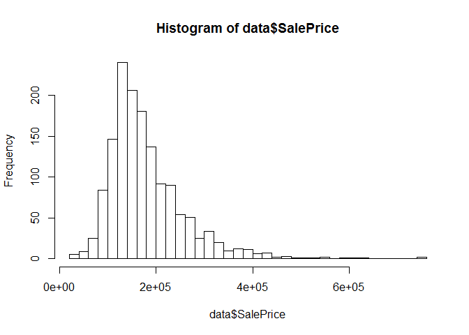

``` r
#We check for missing values
str(data)
```

    ## 'data.frame':    2919 obs. of  81 variables:
    ##  $ Id           : int  1 2 3 4 5 6 7 8 9 10 ...
    ##  $ MSSubClass   : int  60 20 60 70 60 50 20 60 50 190 ...
    ##  $ MSZoning     : chr  "RL" "RL" "RL" "RL" ...
    ##  $ LotFrontage  : int  65 80 68 60 84 85 75 NA 51 50 ...
    ##  $ LotArea      : int  8450 9600 11250 9550 14260 14115 10084 10382 6120 7420 ...
    ##  $ Street       : chr  "Pave" "Pave" "Pave" "Pave" ...
    ##  $ Alley        : chr  NA NA NA NA ...
    ##  $ LotShape     : chr  "Reg" "Reg" "IR1" "IR1" ...
    ##  $ LandContour  : chr  "Lvl" "Lvl" "Lvl" "Lvl" ...
    ##  $ Utilities    : chr  "AllPub" "AllPub" "AllPub" "AllPub" ...
    ##  $ LotConfig    : chr  "Inside" "FR2" "Inside" "Corner" ...
    ##  $ LandSlope    : chr  "Gtl" "Gtl" "Gtl" "Gtl" ...
    ##  $ Neighborhood : chr  "CollgCr" "Veenker" "CollgCr" "Crawfor" ...
    ##  $ Condition1   : chr  "Norm" "Feedr" "Norm" "Norm" ...
    ##  $ Condition2   : chr  "Norm" "Norm" "Norm" "Norm" ...
    ##  $ BldgType     : chr  "1Fam" "1Fam" "1Fam" "1Fam" ...
    ##  $ HouseStyle   : chr  "2Story" "1Story" "2Story" "2Story" ...
    ##  $ OverallQual  : int  7 6 7 7 8 5 8 7 7 5 ...
    ##  $ OverallCond  : int  5 8 5 5 5 5 5 6 5 6 ...
    ##  $ YearBuilt    : int  2003 1976 2001 1915 2000 1993 2004 1973 1931 1939 ...
    ##  $ YearRemodAdd : int  2003 1976 2002 1970 2000 1995 2005 1973 1950 1950 ...
    ##  $ RoofStyle    : chr  "Gable" "Gable" "Gable" "Gable" ...
    ##  $ RoofMatl     : chr  "CompShg" "CompShg" "CompShg" "CompShg" ...
    ##  $ Exterior1st  : chr  "VinylSd" "MetalSd" "VinylSd" "Wd Sdng" ...
    ##  $ Exterior2nd  : chr  "VinylSd" "MetalSd" "VinylSd" "Wd Shng" ...
    ##  $ MasVnrType   : chr  "BrkFace" "None" "BrkFace" "None" ...
    ##  $ MasVnrArea   : int  196 0 162 0 350 0 186 240 0 0 ...
    ##  $ ExterQual    : chr  "Gd" "TA" "Gd" "TA" ...
    ##  $ ExterCond    : chr  "TA" "TA" "TA" "TA" ...
    ##  $ Foundation   : chr  "PConc" "CBlock" "PConc" "BrkTil" ...
    ##  $ BsmtQual     : chr  "Gd" "Gd" "Gd" "TA" ...
    ##  $ BsmtCond     : chr  "TA" "TA" "TA" "Gd" ...
    ##  $ BsmtExposure : chr  "No" "Gd" "Mn" "No" ...
    ##  $ BsmtFinType1 : chr  "GLQ" "ALQ" "GLQ" "ALQ" ...
    ##  $ BsmtFinSF1   : int  706 978 486 216 655 732 1369 859 0 851 ...
    ##  $ BsmtFinType2 : chr  "Unf" "Unf" "Unf" "Unf" ...
    ##  $ BsmtFinSF2   : int  0 0 0 0 0 0 0 32 0 0 ...
    ##  $ BsmtUnfSF    : int  150 284 434 540 490 64 317 216 952 140 ...
    ##  $ TotalBsmtSF  : int  856 1262 920 756 1145 796 1686 1107 952 991 ...
    ##  $ Heating      : chr  "GasA" "GasA" "GasA" "GasA" ...
    ##  $ HeatingQC    : chr  "Ex" "Ex" "Ex" "Gd" ...
    ##  $ CentralAir   : chr  "Y" "Y" "Y" "Y" ...
    ##  $ Electrical   : chr  "SBrkr" "SBrkr" "SBrkr" "SBrkr" ...
    ##  $ X1stFlrSF    : int  856 1262 920 961 1145 796 1694 1107 1022 1077 ...
    ##  $ X2ndFlrSF    : int  854 0 866 756 1053 566 0 983 752 0 ...
    ##  $ LowQualFinSF : int  0 0 0 0 0 0 0 0 0 0 ...
    ##  $ GrLivArea    : int  1710 1262 1786 1717 2198 1362 1694 2090 1774 1077 ...
    ##  $ BsmtFullBath : int  1 0 1 1 1 1 1 1 0 1 ...
    ##  $ BsmtHalfBath : int  0 1 0 0 0 0 0 0 0 0 ...
    ##  $ FullBath     : int  2 2 2 1 2 1 2 2 2 1 ...
    ##  $ HalfBath     : int  1 0 1 0 1 1 0 1 0 0 ...
    ##  $ BedroomAbvGr : int  3 3 3 3 4 1 3 3 2 2 ...
    ##  $ KitchenAbvGr : int  1 1 1 1 1 1 1 1 2 2 ...
    ##  $ KitchenQual  : chr  "Gd" "TA" "Gd" "Gd" ...
    ##  $ TotRmsAbvGrd : int  8 6 6 7 9 5 7 7 8 5 ...
    ##  $ Functional   : chr  "Typ" "Typ" "Typ" "Typ" ...
    ##  $ Fireplaces   : int  0 1 1 1 1 0 1 2 2 2 ...
    ##  $ FireplaceQu  : chr  NA "TA" "TA" "Gd" ...
    ##  $ GarageType   : chr  "Attchd" "Attchd" "Attchd" "Detchd" ...
    ##  $ GarageYrBlt  : int  2003 1976 2001 1998 2000 1993 2004 1973 1931 1939 ...
    ##  $ GarageFinish : chr  "RFn" "RFn" "RFn" "Unf" ...
    ##  $ GarageCars   : int  2 2 2 3 3 2 2 2 2 1 ...
    ##  $ GarageArea   : int  548 460 608 642 836 480 636 484 468 205 ...
    ##  $ GarageQual   : chr  "TA" "TA" "TA" "TA" ...
    ##  $ GarageCond   : chr  "TA" "TA" "TA" "TA" ...
    ##  $ PavedDrive   : chr  "Y" "Y" "Y" "Y" ...
    ##  $ WoodDeckSF   : int  0 298 0 0 192 40 255 235 90 0 ...
    ##  $ OpenPorchSF  : int  61 0 42 35 84 30 57 204 0 4 ...
    ##  $ EnclosedPorch: int  0 0 0 272 0 0 0 228 205 0 ...
    ##  $ X3SsnPorch   : int  0 0 0 0 0 320 0 0 0 0 ...
    ##  $ ScreenPorch  : int  0 0 0 0 0 0 0 0 0 0 ...
    ##  $ PoolArea     : int  0 0 0 0 0 0 0 0 0 0 ...
    ##  $ PoolQC       : chr  NA NA NA NA ...
    ##  $ Fence        : chr  NA NA NA NA ...
    ##  $ MiscFeature  : chr  NA NA NA NA ...
    ##  $ MiscVal      : int  0 0 0 0 0 700 0 350 0 0 ...
    ##  $ MoSold       : int  2 5 9 2 12 10 8 11 4 1 ...
    ##  $ YrSold       : int  2008 2007 2008 2006 2008 2009 2007 2009 2008 2008 ...
    ##  $ SaleType     : chr  "WD" "WD" "WD" "WD" ...
    ##  $ SaleCondition: chr  "Normal" "Normal" "Normal" "Abnorml" ...
    ##  $ SalePrice    : num  208500 181500 223500 140000 250000 ...

``` r
sort(sapply(data, function(x) sum(is.na(x))),decreasing=TRUE)
```

    ##        PoolQC   MiscFeature         Alley         Fence     SalePrice 
    ##          2909          2814          2721          2348          1459 
    ##   FireplaceQu   LotFrontage   GarageYrBlt  GarageFinish    GarageQual 
    ##          1420           486           159           159           159 
    ##    GarageCond    GarageType      BsmtCond  BsmtExposure      BsmtQual 
    ##           159           157            82            82            81 
    ##  BsmtFinType2  BsmtFinType1    MasVnrType    MasVnrArea      MSZoning 
    ##            80            79            24            23             4 
    ##     Utilities  BsmtFullBath  BsmtHalfBath    Functional   Exterior1st 
    ##             2             2             2             2             1 
    ##   Exterior2nd    BsmtFinSF1    BsmtFinSF2     BsmtUnfSF   TotalBsmtSF 
    ##             1             1             1             1             1 
    ##    Electrical   KitchenQual    GarageCars    GarageArea      SaleType 
    ##             1             1             1             1             1 
    ##            Id    MSSubClass       LotArea        Street      LotShape 
    ##             0             0             0             0             0 
    ##   LandContour     LotConfig     LandSlope  Neighborhood    Condition1 
    ##             0             0             0             0             0 
    ##    Condition2      BldgType    HouseStyle   OverallQual   OverallCond 
    ##             0             0             0             0             0 
    ##     YearBuilt  YearRemodAdd     RoofStyle      RoofMatl     ExterQual 
    ##             0             0             0             0             0 
    ##     ExterCond    Foundation       Heating     HeatingQC    CentralAir 
    ##             0             0             0             0             0 
    ##     X1stFlrSF     X2ndFlrSF  LowQualFinSF     GrLivArea      FullBath 
    ##             0             0             0             0             0 
    ##      HalfBath  BedroomAbvGr  KitchenAbvGr  TotRmsAbvGrd    Fireplaces 
    ##             0             0             0             0             0 
    ##    PavedDrive    WoodDeckSF   OpenPorchSF EnclosedPorch    X3SsnPorch 
    ##             0             0             0             0             0 
    ##   ScreenPorch      PoolArea       MiscVal        MoSold        YrSold 
    ##             0             0             0             0             0 
    ## SaleCondition 
    ##             0

``` r
plot(sapply(data, function(x) sum(is.na(x))),type = "h" )
```

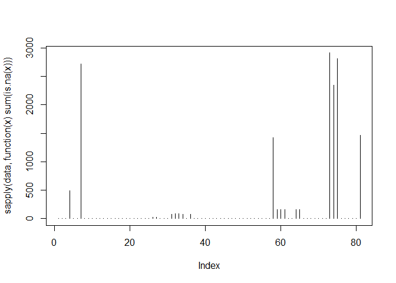

``` r
#There are some columns with lots of missing values.We will decide later what to do with these.
#Basically,in most cases there are not missing values,but an indication that the apartment
#doesn't have these amenities. So let's remove these Na's with none and explore these variables

#PoolQC:  Pool quality
data$PoolQC[is.na(data$PoolQC)] <- "None"
table(data$PoolQC)
```

    ## 
    ##   Ex   Fa   Gd None 
    ##    4    2    4 2909

``` r
Qual_Cond <- c('None' = 0, 'Po' = 1, 'Fa' = 2, 'TA' = 3, 'Gd' = 4, 'Ex' = 5)
data$PoolQC<-revalue(data$PoolQC,Qual_Cond)
```

    ## The following `from` values were not present in `x`: Po, TA

``` r
data$PoolQC<-as.integer(data$PoolQC)

#MiscFeature: Miscellaneous feature not covered in other categories   
table(data$MiscFeature)
```

    ## 
    ## Gar2 Othr Shed TenC 
    ##    5    4   95    1

``` r
data$MiscFeature[is.na(data$MiscFeature)] <- "None"
table(data$MiscFeature)
```

    ## 
    ## Gar2 None Othr Shed TenC 
    ##    5 2814    4   95    1

``` r
data$MiscFeature<-as.factor(data$MiscFeature) 
plot(data$MiscFeature)
```

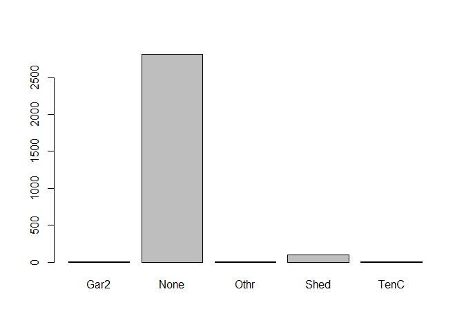

``` r
#Alley: Type of alley access to property  
table(data$Alley)
```

    ## 
    ## Grvl Pave 
    ##  120   78

``` r
data$Alley[is.na(data$Alley)] <- "None"
data$Alley<-as.factor(data$Alley)
plot(data$Alley,data$SalePrice) #Seems to affect the price
```

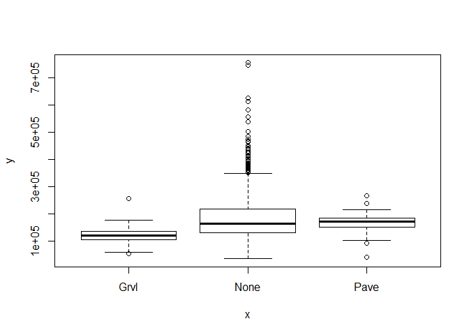

``` r
table(data$Alley)
```

    ## 
    ## Grvl None Pave 
    ##  120 2721   78

``` r
#Fence
table(data$Fence)
```

    ## 
    ## GdPrv  GdWo MnPrv  MnWw 
    ##   118   112   329    12

``` r
data$Fence[is.na(data$Fence)] <- "None"
data$Fence<-as.factor(data$Fence)
plot(data$Fence,data$SalePrice) #Seems to affect the price,but no fence has the highest median!
```

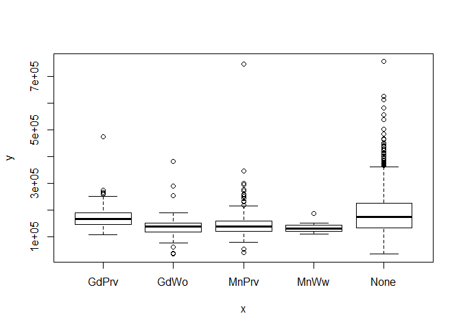

``` r
table(data$Fence)
```

    ## 
    ## GdPrv  GdWo MnPrv  MnWw  None 
    ##   118   112   329    12  2348

``` r
#FireplaceQu
table(data$FireplaceQu)
```

    ## 
    ##  Ex  Fa  Gd  Po  TA 
    ##  43  74 744  46 592

``` r
data$FireplaceQu[is.na(data$FireplaceQu)] <- "None"
data$FireplaceQu<-revalue(data$FireplaceQu,Qual_Cond) #replace the values with Quality/Condition values
data$FireplaceQu<-as.integer(data$FireplaceQu)
plot(data$FireplaceQu,data$SalePrice) #Seems to affect the price!
abline(lm(data$SalePrice~data$FireplaceQu))
```

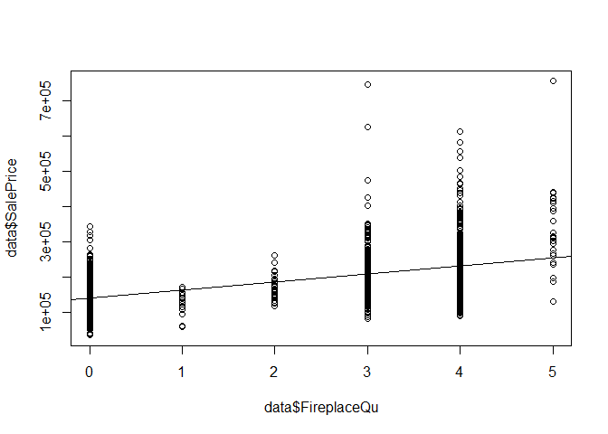

``` r
table(data$FireplaceQu)
```

    ## 
    ##    0    1    2    3    4    5 
    ## 1420   46   74  592  744   43

``` r
#LotFrontage: Linear feet of street connected to property. there are 259 NA's
summary(data$LotFrontage)
```

    ##    Min. 1st Qu.  Median    Mean 3rd Qu.    Max.    NA's 
    ##   21.00   59.00   68.00   69.31   80.00  313.00     486

``` r
cor(data$LotFrontage,data$SalePrice, use = "pairwise.complete.obs")
```

    ## [1] 0.3517991

``` r
hist(data$LotFrontage,breaks=30,xlim = c(0,200))
```

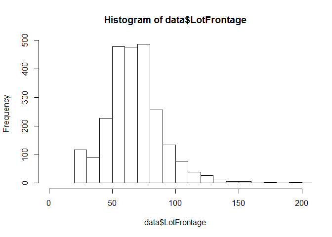

``` r
plot(data$LotFrontage,data$SalePrice)
abline(lm(data$SalePrice~data$LotFrontage))
```


``` r
summary(lm(data$SalePrice~data$LotFrontage))
```

    ## 
    ## Call:
    ## lm(formula = data$SalePrice ~ data$LotFrontage)
    ## 
    ## Residuals:
    ##     Min      1Q  Median      3Q     Max 
    ## -314258  -48878  -19402   33290  533217 
    ## 
    ## Coefficients:
    ##                  Estimate Std. Error t value Pr(>|t|)    
    ## (Intercept)      96149.04    6881.97   13.97   <2e-16 ***
    ## data$LotFrontage  1208.02      92.83   13.01   <2e-16 ***
    ## ---
    ## Signif. codes:  0 '***' 0.001 '**' 0.01 '*' 0.05 '.' 0.1 ' ' 1
    ## 
    ## Residual standard error: 78090 on 1199 degrees of freedom
    ##   (1718 observations deleted due to missingness)
    ## Multiple R-squared:  0.1238, Adjusted R-squared:  0.123 
    ## F-statistic: 169.4 on 1 and 1199 DF,  p-value: < 2.2e-16

``` r
#R squared is very low so it doesn't fit the data well.
#maybe we will replace na's with mean
data$LotFrontage[is.na(data$LotFrontage)] <- mean(na.omit(as.numeric(data$LotFrontage)))
#Good idea to implement is fill Na's with median from Neighborhood. Some other time

# GarageYrBlt
summary(data$GarageYrBlt)
```

    ##    Min. 1st Qu.  Median    Mean 3rd Qu.    Max.    NA's 
    ##    1895    1960    1979    1978    2002    2207     159

``` r
plot(data$GarageYrBlt) #there is a wrong observation unless it is a house from the future - 2207.
```

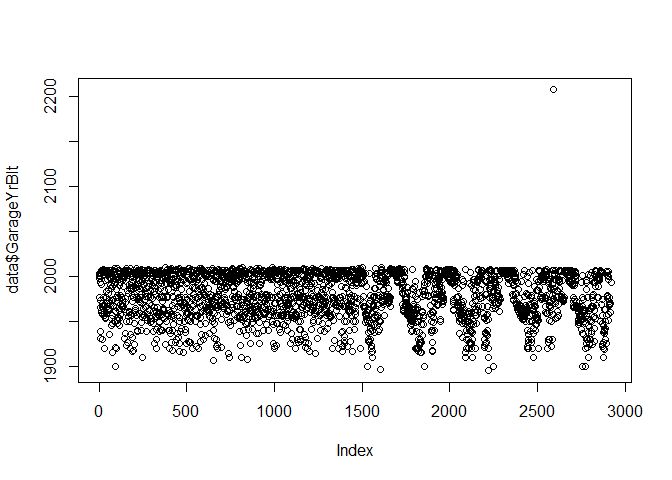

``` r
#We replace it with 2007
which(data[,"GarageYrBlt"]>2019)
```

    ## [1] 2593

``` r
data[2593,"GarageYrBlt"]<-2007
plot(as.factor(data$GarageYrBlt),data$SalePrice) #Find out by another variable,YearBuilt
```

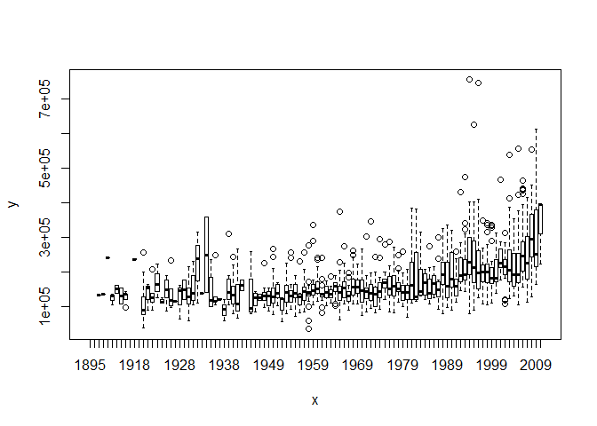

``` r
data.frame(data$YearBuilt,data$GarageYrBlt)
```

    ##      data.YearBuilt data.GarageYrBlt
    ## 1              2003             2003
    ## 2              1976             1976
    ## 3              2001             2001
    ## 4              1915             1998
    ## 5              2000             2000
    ## 6              1993             1993
    ## 7              2004             2004
    ## 8              1973             1973
    ## 9              1931             1931
    ## 10             1939             1939
    ## 11             1965             1965
    ## 12             2005             2005
    ## 13             1962             1962
    ## 14             2006             2006
    ## 15             1960             1960
    ## 16             1929             1991
    ## 17             1970             1970
    ## 18             1967             1967
    ## 19             2004             2004
    ## 20             1958             1958
    ## 21             2005             2005
    ## 22             1930             1930
    ## 23             2002             2002
    ## 24             1976             1976
    ## 25             1968             1968
    ## 26             2007             2007
    ## 27             1951             2005
    ## 28             2007             2008
    ## 29             1957             1957
    ## 30             1927             1920
    ## 31             1920             1920
    ## 32             1966             1966
    ## 33             2007             2007
    ## 34             1959             1959
    ## 35             2005             2005
    ## 36             2004             2004
    ## 37             1994             1995
    ## 38             1954             1954
    ## 39             1953             1953
    ## 40             1955               NA
    ## 41             1965             1965
    ## 42             1959             1959
    ## 43             1983             1983
    ## 44             1975             1977
    ## 45             1959             1959
    ## 46             2005             2005
    ## 47             2003             2003
    ## 48             2006             2006
    ## 49             1920               NA
    ## 50             1966             1966
    ## 51             1997             1997
    ## 52             1934             1985
    ## 53             1963             1963
    ## 54             1981             1981
    ## 55             1955             1962
    ## 56             1964             1964
    ## 57             1999             1999
    ## 58             2004             2004
    ## 59             2006             2006
    ## 60             1972             1973
    ## 61             2004             2006
    ## 62             1920             1935
    ## 63             2006             2006
    ## 64             1921             1990
    ## 65             1997             1998
    ## 66             2004             2004
    ## 67             1970             1970
    ## 68             2003             2003
    ## 69             1945             1945
    ## 70             1953             1953
    ## 71             1973             1973
    ## 72             1982             1987
    ## 73             1998             1998
    ## 74             1954             1989
    ## 75             1915             1915
    ## 76             1973             1973
    ## 77             1956             1956
    ## 78             1948             1948
    ## 79             1968               NA
    ## 80             1910             1966
    ## 81             1968             1968
    ## 82             1998             1998
    ## 83             2007             2007
    ## 84             1960             1974
    ## 85             1995             1995
    ## 86             1991             1991
    ## 87             2005             2005
    ## 88             2009             2009
    ## 89             1915               NA
    ## 90             1994               NA
    ## 91             1950             1950
    ## 92             1961             1961
    ## 93             1921             1921
    ## 94             1910             1900
    ## 95             1997             1997
    ## 96             1993             1993
    ## 97             1999             1999
    ## 98             1965             1965
    ## 99             1920             1920
    ## 100            1959               NA
    ## 101            1977             1977
    ## 102            1985             1985
    ## 103            1979             1979
    ## 104            2009             2009
    ## 105            1931             1951
    ## 106            2003             2003
    ## 107            1885             1954
    ## 108            1948             1948
    ## 109            1919               NA
    ## 110            1977             1977
    ## 111            1954             1954
    ## 112            2000             2000
    ## 113            2007             2007
    ## 114            1953             1953
    ## 115            1945             1945
    ## 116            1999             1999
    ## 117            1962             1962
    ## 118            2006             2007
    ## 119            1990             1990
    ## 120            2005             2005
    ## 121            1969             1969
    ## 122            1939             1979
    ## 123            1958             1958
    ## 124            1993             1993
    ## 125            1979             1979
    ## 126            1935               NA
    ## 127            1976             1977
    ## 128            1930               NA
    ## 129            1966             1966
    ## 130            1958             1998
    ## 131            1966             1966
    ## 132            2000             2000
    ## 133            1959             1974
    ## 134            2001             2001
    ## 135            1968             1968
    ## 136            1970             1970
    ## 137            1967             1967
    ## 138            1988             1989
    ## 139            1999             1999
    ## 140            1997             1997
    ## 141            1971               NA
    ## 142            2005             2005
    ## 143            1952             2000
    ## 144            1999             1999
    ## 145            1963             1963
    ## 146            2004             2004
    ## 147            1931             1931
    ## 148            2001             2001
    ## 149            2004               NA
    ## 150            1936             1936
    ## 151            1975             1975
    ## 152            2007             2007
    ## 153            1971             1971
    ## 154            1960             1960
    ## 155            1923             1923
    ## 156            1924               NA
    ## 157            1950             1950
    ## 158            2009             2009
    ## 159            2004             2004
    ## 160            2005             2006
    ## 161            1984             1984
    ## 162            2003             2003
    ## 163            2005             2005
    ## 164            1956               NA
    ## 165            1926             1926
    ## 166            1940               NA
    ## 167            1955             1955
    ## 168            2007             2007
    ## 169            2004             2004
    ## 170            1981             1981
    ## 171            1941             1991
    ## 172            1960             1960
    ## 173            1987             1987
    ## 174            1961             1961
    ## 175            1986             1986
    ## 176            1950             1950
    ## 177            1988             1988
    ## 178            1958             1958
    ## 179            2008             2009
    ## 180            1923             1935
    ## 181            2000             2000
    ## 182            1920             1920
    ## 183            1957             1957
    ## 184            2003             2003
    ## 185            1908             1986
    ## 186            1892             1993
    ## 187            1990             1990
    ## 188            1916             1916
    ## 189            1979             1979
    ## 190            2001             2001
    ## 191            1932             1932
    ## 192            1972             1972
    ## 193            1999             1999
    ## 194            2004             2004
    ## 195            1972             1989
    ## 196            1976             1976
    ## 197            2007             2007
    ## 198            1918             1918
    ## 199            1912               NA
    ## 200            2004             2004
    ## 201            2003             2003
    ## 202            1977             1980
    ## 203            1924             1924
    ## 204            2004             2004
    ## 205            1947             1948
    ## 206            1990             1990
    ## 207            1962             1962
    ## 208            1960             1960
    ## 209            1988             1988
    ## 210            1964             1964
    ## 211            1925               NA
    ## 212            2009             2009
    ## 213            2009             2009
    ## 214            1995             1996
    ## 215            1977             1977
    ## 216            1957             1957
    ## 217            2004             2004
    ## 218            1925             1940
    ## 219            1939             1939
    ## 220            2005             2005
    ## 221            2006             2006
    ## 222            2002             2002
    ## 223            1975             1975
    ## 224            1971             1989
    ## 225            2003             2003
    ## 226            1971             1991
    ## 227            1995             1995
    ## 228            1970             1987
    ## 229            1967             1974
    ## 230            2005             2005
    ## 231            1959             1959
    ## 232            1995             1995
    ## 233            1972             1972
    ## 234            1976             1976
    ## 235            2002             2002
    ## 236            1971             1971
    ## 237            2004             2004
    ## 238            1993             1993
    ## 239            2007             2007
    ## 240            1945             1949
    ## 241            2008             2008
    ## 242            1945               NA
    ## 243            1900             1940
    ## 244            1980             1980
    ## 245            1994             1994
    ## 246            1988             1988
    ## 247            1910             1910
    ## 248            1954             1954
    ## 249            2003             2003
    ## 250            1958             1958
    ## 251            1940               NA
    ## 252            2006             2006
    ## 253            2004             2004
    ## 254            1964             1964
    ## 255            1957             1957
    ## 256            1999             1999
    ## 257            2003             2003
    ## 258            2006             2006
    ## 259            2001             2001
    ## 260            1956             1956
    ## 261            1962             1991
    ## 262            2007             2007
    ## 263            1977             1978
    ## 264            1929             1974
    ## 265            1925             1965
    ## 266            1981             1981
    ## 267            1997             1997
    ## 268            1939             1939
    ## 269            1940             1966
    ## 270            1976             1987
    ## 271            2006             2006
    ## 272            1954             1954
    ## 273            1999             1999
    ## 274            1958             1958
    ## 275            1982             1982
    ## 276            1925             1978
    ## 277            2003             2003
    ## 278            1951             1951
    ## 279            2006             2007
    ## 280            1977             1977
    ## 281            1989             1989
    ## 282            2006             2006
    ## 283            2007             2008
    ## 284            2008             2008
    ## 285            1992             1992
    ## 286            2006             2006
    ## 287            1962             1962
    ## 288            1971               NA
    ## 289            1967             1970
    ## 290            1915             2003
    ## 291            2006             2006
    ## 292            1912               NA
    ## 293            1949             1949
    ## 294            1977             1977
    ## 295            1953             1953
    ## 296            1984             1984
    ## 297            1950             1950
    ## 298            1997             1997
    ## 299            1968             1968
    ## 300            1950             1950
    ## 301            1953             1953
    ## 302            1998             1998
    ## 303            2001             2001
    ## 304            1972             1975
    ## 305            1880             2003
    ## 306            2004             2004
    ## 307            1990             1990
    ## 308            1920               NA
    ## 309            1940             1961
    ## 310            2003             2003
    ## 311            1993             1993
    ## 312            1948             1948
    ## 313            1939             1939
    ## 314            1965             1965
    ## 315            1925             1925
    ## 316            2004             2004
    ## 317            1980             1983
    ## 318            2006             2006
    ## 319            1993             1993
    ## 320            1980             1980
    ## 321            2006             2006
    ## 322            2004             2004
    ## 323            1986             1987
    ## 324            1955             1955
    ## 325            1967             1961
    ## 326            1941             1941
    ## 327            1993             1993
    ## 328            1960             1960
    ## 329            1916             1930
    ## 330            1920             1920
    ## 331            1964             2002
    ## 332            1958             1958
    ## 333            2003             2003
    ## 334            2004             2004
    ## 335            1998             1998
    ## 336            1965             1965
    ## 337            2005             2005
    ## 338            2002             2002
    ## 339            1984             1984
    ## 340            1958             1958
    ## 341            2002             2002
    ## 342            1950             1950
    ## 343            1949             1949
    ## 344            2005             2005
    ## 345            1976             1976
    ## 346            1939             1939
    ## 347            1960             1960
    ## 348            1960             1960
    ## 349            2003             2003
    ## 350            2005             2006
    ## 351            2007             2007
    ## 352            1986             1986
    ## 353            1941             1941
    ## 354            1928             2005
    ## 355            1940             1940
    ## 356            1995             1995
    ## 357            1992             1992
    ## 358            1976             1976
    ## 359            1958             1958
    ## 360            1998             1998
    ## 361            1978             1978
    ## 362            1940             1940
    ## 363            2003             2003
    ## 364            1972             1972
    ## 365            1976             1976
    ## 366            1920             1964
    ## 367            1963             1963
    ## 368            1962             1962
    ## 369            1954             1954
    ## 370            1959             1997
    ## 371            2000             2000
    ## 372            1959             1991
    ## 373            1984             1984
    ## 374            1953             1953
    ## 375            2003             2003
    ## 376            1922               NA
    ## 377            1996             1998
    ## 378            2004             2004
    ## 379            2010             2010
    ## 380            2000             2000
    ## 381            1924             1924
    ## 382            2006             2006
    ## 383            2006             2006
    ## 384            1928             1950
    ## 385            1992             1992
    ## 386            2004             2004
    ## 387            1910               NA
    ## 388            1976             1977
    ## 389            1999             1999
    ## 390            2007             2008
    ## 391            1900             1978
    ## 392            2001             2001
    ## 393            1959             1959
    ## 394            1941               NA
    ## 395            1940             1940
    ## 396            1956             1956
    ## 397            1972             1985
    ## 398            1962             1962
    ## 399            1920             1920
    ## 400            2006             2007
    ## 401            1996             1996
    ## 402            2005             2005
    ## 403            1940             1940
    ## 404            1998             1998
    ## 405            1995             1995
    ## 406            1976             1993
    ## 407            1936             1936
    ## 408            1915             1960
    ## 409            2006             2006
    ## 410            2007             2008
    ## 411            1958             1958
    ## 412            1955             1955
    ## 413            2009             2009
    ## 414            1927             1927
    ## 415            1993             1993
    ## 416            2007             2007
    ## 417            1978             1978
    ## 418            1918             1918
    ## 419            1940             1940
    ## 420            1968             1968
    ## 421            1997             1997
    ## 422            1977             1977
    ## 423            1954             1954
    ## 424            1998             1998
    ## 425            1956             1956
    ## 426            1946             1947
    ## 427            1989             1989
    ## 428            1957             1964
    ## 429            2007             2007
    ## 430            1988             1988
    ## 431            1971             1971
    ## 432            1920               NA
    ## 433            1971             1971
    ## 434            1997             1997
    ## 435            1972               NA
    ## 436            1996             1996
    ## 437            1920             1990
    ## 438            1926             1926
    ## 439            1913             1990
    ## 440            1920             2005
    ## 441            2008             2008
    ## 442            1955               NA
    ## 443            1930             1930
    ## 444            2006             2007
    ## 445            1994             1994
    ## 446            1956             1956
    ## 447            1966             1966
    ## 448            1998             1998
    ## 449            1937             1937
    ## 450            1948             1981
    ## 451            1930             1932
    ## 452            1975             1975
    ## 453            1996             1996
    ## 454            2008             2008
    ## 455            1976             1976
    ## 456            1973             1973
    ## 457            1916             1916
    ## 458            1954             1954
    ## 459            1925             1925
    ## 460            1950             1950
    ## 461            2009             2009
    ## 462            1936             1971
    ## 463            1965             1965
    ## 464            1934             1939
    ## 465            1978               NA
    ## 466            2004             2004
    ## 467            1970             1970
    ## 468            1942             1942
    ## 469            2006             2006
    ## 470            1993             1993
    ## 471            1985             1985
    ## 472            1977             1977
    ## 473            2005             2005
    ## 474            2006             2006
    ## 475            2000             2000
    ## 476            1963             1996
    ## 477            1997             1997
    ## 478            2006             2006
    ## 479            2007             2007
    ## 480            1937             1995
    ## 481            2004             2004
    ## 482            2003             2003
    ## 483            1915             1915
    ## 484            1998             1998
    ## 485            1962             1963
    ## 486            1950             1950
    ## 487            1965             1965
    ## 488            1971             1971
    ## 489            1900             1970
    ## 490            1970             1970
    ## 491            1976             1976
    ## 492            1941             1941
    ## 493            2006             2006
    ## 494            1960             1964
    ## 495            1938             1938
    ## 496            1920               NA
    ## 497            1992             1992
    ## 498            1925             1925
    ## 499            1967             1967
    ## 500            1958             1958
    ## 501            1973             1973
    ## 502            2005             2005
    ## 503            1965             1965
    ## 504            1959             1959
    ## 505            1974             1974
    ## 506            1952             1952
    ## 507            1993             1993
    ## 508            2009             2009
    ## 509            1928             1928
    ## 510            1959             1959
    ## 511            1951             1951
    ## 512            2005             2005
    ## 513            1958             1964
    ## 514            1983             1983
    ## 515            1926             1926
    ## 516            2009             2009
    ## 517            1972             1972
    ## 518            1996             1996
    ## 519            1998             1998
    ## 520            1926             1926
    ## 521            1900               NA
    ## 522            1957             1957
    ## 523            1947             1950
    ## 524            2007             2007
    ## 525            1996             1996
    ## 526            2005             2005
    ## 527            1956             1956
    ## 528            2008             2008
    ## 529            1920               NA
    ## 530            1957             1975
    ## 531            1988             1988
    ## 532            1920             1920
    ## 533            1955             1967
    ## 534            1946               NA
    ## 535            2004             2004
    ## 536            1910               NA
    ## 537            1998             1998
    ## 538            1972             1980
    ## 539            1968             1968
    ## 540            2001             2001
    ## 541            2006             2006
    ## 542            2000             2000
    ## 543            1998             1998
    ## 544            1998             1998
    ## 545            2006             2006
    ## 546            1988             1988
    ## 547            1923             1950
    ## 548            1970             1987
    ## 549            1955             1963
    ## 550            2003             2003
    ## 551            1977             1977
    ## 552            1957             1957
    ## 553            2006             2006
    ## 554            1949             2002
    ## 555            2003             2003
    ## 556            1922             1922
    ## 557            1957             1957
    ## 558            1920             1994
    ## 559            1996             1996
    ## 560            2003             2003
    ## 561            1957             1957
    ## 562            1974             1975
    ## 563            1940               NA
    ## 564            1918             1955
    ## 565            1992             1992
    ## 566            1915             1920
    ## 567            2005             2005
    ## 568            2004             2004
    ## 569            1983             1983
    ## 570            1979             1979
    ## 571            1965             1987
    ## 572            1959             1959
    ## 573            2009             2009
    ## 574            2000             2000
    ## 575            1971             1971
    ## 576            1947             1947
    ## 577            1928             1928
    ## 578            1966             1966
    ## 579            2007             2007
    ## 580            1954             1954
    ## 581            1960             1960
    ## 582            2008             2009
    ## 583            1990               NA
    ## 584            1893             1988
    ## 585            1935             1935
    ## 586            2005             2005
    ## 587            1918             1961
    ## 588            1982             1996
    ## 589            1968             1968
    ## 590            1930             1988
    ## 591            2004             2004
    ## 592            2008             2008
    ## 593            1982             1985
    ## 594            2003             2003
    ## 595            1975             1981
    ## 596            2005             2005
    ## 597            1910             1930
    ## 598            2006             2006
    ## 599            1977             1977
    ## 600            1980             1980
    ## 601            2005             2003
    ## 602            1937             1979
    ## 603            1992             1992
    ## 604            2004             2004
    ## 605            2002             2002
    ## 606            1965             1965
    ## 607            1996             2000
    ## 608            1948             1948
    ## 609            1934             1934
    ## 610            1961             1961
    ## 611            2000             2000
    ## 612            1978             1978
    ## 613            2001             2001
    ## 614            2007               NA
    ## 615            1972               NA
    ## 616            1963             1963
    ## 617            2002             2002
    ## 618            1954             1962
    ## 619            2007             2007
    ## 620            2003             2003
    ## 621            1914               NA
    ## 622            1974             1974
    ## 623            1977             1986
    ## 624            2000             2000
    ## 625            1972             1972
    ## 626            1962             1962
    ## 627            1960             1960
    ## 628            1955             1955
    ## 629            1969             1969
    ## 630            1964             1964
    ## 631            1880             1937
    ## 632            2006             2006
    ## 633            1977             1977
    ## 634            1954             1954
    ## 635            1980             1980
    ## 636            1914               NA
    ## 637            1936               NA
    ## 638            1954             1954
    ## 639            1910               NA
    ## 640            2006             2006
    ## 641            2003             2003
    ## 642            2001             2001
    ## 643            1972             1972
    ## 644            1969             1969
    ## 645            2009             2009
    ## 646            1971             1979
    ## 647            1950             1950
    ## 648            1953             1953
    ## 649            1966             1966
    ## 650            1970               NA
    ## 651            2007             2007
    ## 652            1940             1940
    ## 653            1996             1996
    ## 654            1906             1906
    ## 655            1995             1995
    ## 656            1971             1971
    ## 657            1959             1959
    ## 658            1931             1931
    ## 659            1948             1948
    ## 660            1964             1968
    ## 661            1976             1976
    ## 662            1994             1994
    ## 663            1968             1968
    ## 664            1972             1974
    ## 665            2005             2005
    ## 666            2000             2000
    ## 667            1965             1965
    ## 668            1994             1994
    ## 669            1956             1999
    ## 670            1922             1922
    ## 671            2005             2005
    ## 672            1925             1930
    ## 673            1977             1977
    ## 674            1957             1957
    ## 675            1965             1965
    ## 676            1978             1978
    ## 677            1900             1920
    ## 678            1924             1924
    ## 679            2008             2008
    ## 680            1961             1963
    ## 681            1980             1980
    ## 682            1932             1968
    ## 683            1996             1996
    ## 684            2002             2002
    ## 685            1998             1998
    ## 686            1984             1984
    ## 687            2007             2007
    ## 688            2004             2004
    ## 689            2007             2007
    ## 690            2005             2005
    ## 691            2004             2004
    ## 692            1994             1994
    ## 693            1989             1989
    ## 694            1921             1968
    ## 695            1936             1995
    ## 696            1987             1987
    ## 697            1921             1921
    ## 698            1952             1952
    ## 699            1965             1973
    ## 700            2004             2004
    ## 701            2002             2002
    ## 702            1969             1969
    ## 703            2006             2006
    ## 704            1900             1999
    ## 705            2004             2004
    ## 706            1930               NA
    ## 707            1971             1971
    ## 708            2006             2006
    ## 709            2007             2007
    ## 710            1966             1966
    ## 711            1935               NA
    ## 712            1900             1964
    ## 713            1988             1988
    ## 714            1970             1970
    ## 715            1976             1976
    ## 716            1974             1974
    ## 717            1890             1996
    ## 718            1973             1973
    ## 719            1993             1993
    ## 720            1969             1969
    ## 721            1985             1985
    ## 722            2004             2004
    ## 723            1970             1994
    ## 724            1954             1958
    ## 725            2007             2007
    ## 726            1970             1989
    ## 727            1988             1988
    ## 728            2007             2007
    ## 729            1958             1968
    ## 730            1925             1962
    ## 731            1995             1995
    ## 732            2003             2003
    ## 733            1998             1998
    ## 734            1961             1961
    ## 735            1968             1968
    ## 736            1914             1914
    ## 737            1950             1949
    ## 738            2005             2005
    ## 739            1987               NA
    ## 740            2004             2004
    ## 741            1910             1910
    ## 742            1961             1962
    ## 743            2000             2000
    ## 744            1963             1997
    ## 745            1993             1993
    ## 746            1976             1994
    ## 747            2000             2000
    ## 748            1880             1950
    ## 749            1996             1996
    ## 750            1945             1945
    ## 751            1910               NA
    ## 752            2003             2003
    ## 753            1997             1997
    ## 754            2005             2005
    ## 755            1969             1969
    ## 756            1999             1999
    ## 757            2007             2007
    ## 758            1978             1978
    ## 759            1999             1999
    ## 760            1995             1995
    ## 761            1959             2008
    ## 762            1924             1965
    ## 763            2009             2009
    ## 764            1999             1999
    ## 765            1995             1995
    ## 766            2008             2008
    ## 767            1988             1988
    ## 768            1940             1989
    ## 769            2004             2004
    ## 770            2003             2003
    ## 771            1982             1983
    ## 772            1951             1951
    ## 773            1976             1976
    ## 774            1958             1958
    ## 775            2006             2006
    ## 776            1998             1998
    ## 777            2005             2005
    ## 778            1974             1974
    ## 779            1977             1977
    ## 780            1977             1977
    ## 781            1995             1995
    ## 782            1992             1992
    ## 783            2001             2001
    ## 784            1978             1978
    ## 785            1914               NA
    ## 786            1967             1967
    ## 787            1915             1961
    ## 788            2004             2004
    ## 789            1954             1954
    ## 790            1966             1966
    ## 791            2005             2005
    ## 792            1976             1976
    ## 793            1996             1997
    ## 794            2007             2007
    ## 795            1994             1994
    ## 796            1980             1980
    ## 797            1977             1977
    ## 798            1953             1953
    ## 799            2008             2009
    ## 800            1937             1939
    ## 801            1997             1997
    ## 802            1916             1957
    ## 803            2005             2005
    ## 804            2008             2009
    ## 805            1954             1954
    ## 806            2008             2008
    ## 807            1967             1967
    ## 808            1923             1923
    ## 809            1966             1966
    ## 810            1898             1910
    ## 811            1974             1974
    ## 812            2004             2004
    ## 813            1952             1952
    ## 814            1958             1958
    ## 815            1918             1955
    ## 816            1998             1998
    ## 817            1954             1954
    ## 818            2002             2002
    ## 819            1971             1971
    ## 820            2009             2010
    ## 821            2003             2003
    ## 822            1953             1974
    ## 823            2003             2003
    ## 824            1940             1940
    ## 825            2006             2006
    ## 826            2007             2007
    ## 827            1924               NA
    ## 828            2001             2001
    ## 829            1967             1967
    ## 830            2005             2005
    ## 831            1957             1957
    ## 832            2005             2005
    ## 833            2003             2003
    ## 834            1964             1964
    ## 835            1961             1961
    ## 836            1950             1996
    ## 837            1948             1948
    ## 838            1973             1973
    ## 839            1995             1999
    ## 840            1946             1946
    ## 841            1925             1934
    ## 842            1904             1983
    ## 843            1966             1966
    ## 844            1961               NA
    ## 845            1915             1949
    ## 846            1975             1975
    ## 847            1993             1993
    ## 848            1972             1972
    ## 849            1908             1908
    ## 850            1976             1976
    ## 851            2003             2003
    ## 852            2003             2003
    ## 853            1941             1941
    ## 854            1964             1964
    ## 855            1955             1955
    ## 856            1962             1962
    ## 857            1978             1981
    ## 858            1994             1994
    ## 859            1976             1976
    ## 860            1968             1968
    ## 861            1918             1925
    ## 862            1965             1965
    ## 863            1984             1986
    ## 864            1959             1959
    ## 865            2007             2008
    ## 866            1970             1973
    ## 867            2006             2007
    ## 868            1961             1961
    ## 869            1948             1979
    ## 870            1993             1993
    ## 871            1962             1962
    ## 872            1998             1998
    ## 873            1953             1953
    ## 874            1949             1949
    ## 875            1941             1941
    ## 876            2007             2007
    ## 877            1963             1963
    ## 878            2004             2004
    ## 879            1961             1987
    ## 880            1978             1978
    ## 881            2005             2005
    ## 882            1990             1990
    ## 883            1992             1993
    ## 884            1912             1997
    ## 885            1967             1967
    ## 886            1999             1999
    ## 887            1959             2005
    ## 888            1955             1955
    ## 889            1970             1970
    ## 890            1953             1953
    ## 891            1949             2003
    ## 892            1978             1978
    ## 893            1963             1963
    ## 894            1954             1954
    ## 895            1979             1979
    ## 896            1963             1963
    ## 897            1936             1936
    ## 898            1979             1979
    ## 899            2009             2009
    ## 900            1961             1961
    ## 901            1971             1979
    ## 902            1957             1968
    ## 903            2003             2003
    ## 904            2006             2006
    ## 905            1967             1967
    ## 906            1954             1954
    ## 907            2006             2006
    ## 908            1936             1936
    ## 909            1983             1983
    ## 910            2005             2005
    ## 911            1960             1960
    ## 912            1977             1978
    ## 913            1925             1925
    ## 914            1949             1949
    ## 915            2009             2009
    ## 916            1970             1970
    ## 917            1949             1958
    ## 918            1956             1956
    ## 919            1991             1991
    ## 920            1958             1990
    ## 921            1994             1994
    ## 922            1900               NA
    ## 923            2005             2005
    ## 924            1993             1993
    ## 925            1980             1980
    ## 926            1977             1977
    ## 927            2003             2003
    ## 928            1968             1968
    ## 929            2001             2001
    ## 930            1997             1997
    ## 931            2007             2007
    ## 932            1965             1965
    ## 933            2006             2006
    ## 934            2004             2004
    ## 935            1960             1960
    ## 936            1926             1953
    ## 937            2003             2003
    ## 938            2005             2005
    ## 939            2006             2006
    ## 940            1940             1940
    ## 941            1976             1976
    ## 942            1999             1999
    ## 943            1977               NA
    ## 944            1967             1967
    ## 945            1958             1958
    ## 946            1890             1963
    ## 947            1959             1959
    ## 948            2002             2002
    ## 949            2002             2002
    ## 950            1972             1972
    ## 951            1950             1980
    ## 952            1965             1979
    ## 953            1972             1974
    ## 954            1969             1969
    ## 955            1975               NA
    ## 956            1946             1946
    ## 957            1980             1980
    ## 958            1962             1977
    ## 959            2003             2003
    ## 960            1999             1999
    ## 961            1958               NA
    ## 962            1977             1977
    ## 963            1976             1976
    ## 964            2007             2007
    ## 965            2002             2002
    ## 966            2005             2005
    ## 967            1940             1940
    ## 968            1955             1955
    ## 969            1910               NA
    ## 970            1958             1958
    ## 971            1949               NA
    ## 972            2003             2003
    ## 973            1979             1979
    ## 974            2007             2007
    ## 975            1910             1997
    ## 976            2000             2000
    ## 977            1923               NA
    ## 978            2006             2007
    ## 979            1954             1999
    ## 980            1963             1963
    ## 981            1961             1961
    ## 982            1998             1998
    ## 983            2007             2007
    ## 984            2002             2002
    ## 985            1977             1977
    ## 986            1950             1950
    ## 987            1910             1950
    ## 988            2009             2010
    ## 989            1976             1976
    ## 990            2006             2006
    ## 991            1997             1997
    ## 992            1882             1925
    ## 993            1964             1964
    ## 994            2005             2005
    ## 995            2006             2008
    ## 996            1946             1946
    ## 997            1961             1961
    ## 998            1970             1970
    ## 999            1922             1922
    ## 1000           2006             2006
    ## 1001           1952             1956
    ## 1002           1920             1920
    ## 1003           2006             2006
    ## 1004           1976             1976
    ## 1005           2005             2005
    ## 1006           1977             1977
    ## 1007           1970             1970
    ## 1008           1970             1970
    ## 1009           2004             2004
    ## 1010           1926               NA
    ## 1011           1948             1948
    ## 1012           1965               NA
    ## 1013           1923             1923
    ## 1014           1910             1956
    ## 1015           1948             1948
    ## 1016           2001             2001
    ## 1017           1996             1996
    ## 1018           1984             1984
    ## 1019           1991             1991
    ## 1020           2005             2005
    ## 1021           2005             2005
    ## 1022           2006             2006
    ## 1023           1930             1957
    ## 1024           2005             2005
    ## 1025           1976             1976
    ## 1026           1972             1980
    ## 1027           1960             1960
    ## 1028           2007             2008
    ## 1029           1941             1941
    ## 1030           1972             1972
    ## 1031           1916               NA
    ## 1032           1920             1970
    ## 1033           1993             1993
    ## 1034           2002             2002
    ## 1035           1938             1938
    ## 1036           1957             1957
    ## 1037           2007             2008
    ## 1038           2001             2001
    ## 1039           1970               NA
    ## 1040           1970             1970
    ## 1041           1957             1957
    ## 1042           1966             1966
    ## 1043           2005             2005
    ## 1044           1990             1990
    ## 1045           1981             1981
    ## 1046           1955             1955
    ## 1047           2005             2005
    ## 1048           1994             1996
    ## 1049           1960             1960
    ## 1050           1946             1946
    ## 1051           2007             2007
    ## 1052           2007             2007
    ## 1053           1964             1964
    ## 1054           1957             1957
    ## 1055           2002             2002
    ## 1056           1976             1976
    ## 1057           2005             2005
    ## 1058           1994             1994
    ## 1059           2008             2008
    ## 1060           1932             1977
    ## 1061           2001             2001
    ## 1062           1935             1994
    ## 1063           1900             1945
    ## 1064           1925             1976
    ## 1065           1966             1966
    ## 1066           1996             1996
    ## 1067           1993             1993
    ## 1068           1964             1964
    ## 1069           1973             1973
    ## 1070           1949             1985
    ## 1071           1956             1956
    ## 1072           1968             1968
    ## 1073           1948             1954
    ## 1074           1977             1977
    ## 1075           2006             2006
    ## 1076           1940             1940
    ## 1077           1936             1950
    ## 1078           1969             1969
    ## 1079           2004             2004
    ## 1080           1994             1996
    ## 1081           1971             1971
    ## 1082           1963             1963
    ## 1083           2002             2002
    ## 1084           1964             1964
    ## 1085           1995             1995
    ## 1086           1992             1992
    ## 1087           1973             1973
    ## 1088           2005             2005
    ## 1089           2004             2004
    ## 1090           2005             2005
    ## 1091           1950             1987
    ## 1092           1999             1999
    ## 1093           1925             1925
    ## 1094           1965             1977
    ## 1095           1956             1956
    ## 1096           2006             2006
    ## 1097           1914               NA
    ## 1098           1986             1987
    ## 1099           1936             1936
    ## 1100           1978             1978
    ## 1101           1920             1930
    ## 1102           1971             1981
    ## 1103           1960             1960
    ## 1104           1959             1954
    ## 1105           1970             1970
    ## 1106           1994             1994
    ## 1107           1990             1990
    ## 1108           2006             2006
    ## 1109           2000             2000
    ## 1110           2004             2004
    ## 1111           1995             1995
    ## 1112           1976             1976
    ## 1113           1957             1957
    ## 1114           1953             1953
    ## 1115           1954             1955
    ## 1116           2007             2007
    ## 1117           2002             2002
    ## 1118           1967             1967
    ## 1119           1958             1958
    ## 1120           1959             1959
    ## 1121           1920             1920
    ## 1122           2005             2005
    ## 1123           1956             1956
    ## 1124           1947               NA
    ## 1125           1992             1992
    ## 1126           1955             1977
    ## 1127           2007             2007
    ## 1128           2004             2004
    ## 1129           2004             2004
    ## 1130           1980             1980
    ## 1131           1928             1981
    ## 1132           1991               NA
    ## 1133           1880             1930
    ## 1134           1995             1995
    ## 1135           1997             1997
    ## 1136           1926             1926
    ## 1137           1950             1950
    ## 1138           1875               NA
    ## 1139           1977             1977
    ## 1140           1920             1972
    ## 1141           1951             1988
    ## 1142           1976             1976
    ## 1143           2006             2006
    ## 1144           1959               NA
    ## 1145           1941             1941
    ## 1146           1928             1928
    ## 1147           1985             1985
    ## 1148           1941             1941
    ## 1149           1926             1982
    ## 1150           1920             1930
    ## 1151           1950             1950
    ## 1152           1959             1959
    ## 1153           1956             1956
    ## 1154           1930             2002
    ## 1155           1965             1965
    ## 1156           1976             1976
    ## 1157           1965             1965
    ## 1158           2007             2008
    ## 1159           2007             2008
    ## 1160           1974             1974
    ## 1161           1978             1978
    ## 1162           1954             1993
    ## 1163           1968             1968
    ## 1164           1969             1969
    ## 1165           1978             1978
    ## 1166           2009             2009
    ## 1167           2008             2008
    ## 1168           2000             2000
    ## 1169           1935             1935
    ## 1170           1995             1995
    ## 1171           1977             1977
    ## 1172           1958             1958
    ## 1173           2006             2006
    ## 1174           1946               NA
    ## 1175           1932             1932
    ## 1176           1992             1992
    ## 1177           1984             1984
    ## 1178           1926             1926
    ## 1179           1921             1921
    ## 1180           1954               NA
    ## 1181           1990             1990
    ## 1182           2008             2008
    ## 1183           1996             1996
    ## 1184           1920             1970
    ## 1185           1963             1963
    ## 1186           1924             1965
    ## 1187           1900             1920
    ## 1188           1994             1994
    ## 1189           2002             2002
    ## 1190           1999             1999
    ## 1191           1961             1975
    ## 1192           1999             1999
    ## 1193           1925             1925
    ## 1194           1999             1999
    ## 1195           1969             1969
    ## 1196           2005             2005
    ## 1197           2006             2006
    ## 1198           1916             1916
    ## 1199           2001             2001
    ## 1200           1963             1974
    ## 1201           1970             1972
    ## 1202           1998             1998
    ## 1203           1925             1960
    ## 1204           2000             2000
    ## 1205           1975             1975
    ## 1206           1990             1990
    ## 1207           1966             1966
    ## 1208           2003             2003
    ## 1209           1962             1980
    ## 1210           2006             2006
    ## 1211           1992             1992
    ## 1212           1988             1988
    ## 1213           1941             1941
    ## 1214           1965             1965
    ## 1215           1962             1962
    ## 1216           1966             1966
    ## 1217           1978             1978
    ## 1218           2009             2009
    ## 1219           1947               NA
    ## 1220           1971               NA
    ## 1221           1964             1964
    ## 1222           1968             1968
    ## 1223           1949             1949
    ## 1224           1951             1951
    ## 1225           2004             2004
    ## 1226           1958             1958
    ## 1227           2007             2007
    ## 1228           1965             1992
    ## 1229           2008             2008
    ## 1230           1960             1960
    ## 1231           1977             1977
    ## 1232           1962             1962
    ## 1233           1962             1962
    ## 1234           1959             1959
    ## 1235           1911               NA
    ## 1236           1914             1914
    ## 1237           2003             2003
    ## 1238           2004             2004
    ## 1239           2005             2005
    ## 1240           2006             2006
    ## 1241           2003             2003
    ## 1242           2007             2007
    ## 1243           1974             1974
    ## 1244           2006             2006
    ## 1245           1929             1931
    ## 1246           1984             1984
    ## 1247           2005             2005
    ## 1248           1976             1976
    ## 1249           1917             1950
    ## 1250           1950             1950
    ## 1251           1968             1968
    ## 1252           2003             2003
    ## 1253           1968             1968
    ## 1254           1974             1974
    ## 1255           2003             2003
    ## 1256           1931             1978
    ## 1257           1994             1994
    ## 1258           1922               NA
    ## 1259           2005             2005
    ## 1260           1969             1969
    ## 1261           1999             1999
    ## 1262           1956             1956
    ## 1263           1957             1957
    ## 1264           1919             1940
    ## 1265           1998             1998
    ## 1266           1999             1999
    ## 1267           1910             1960
    ## 1268           2008             2009
    ## 1269           1935             1982
    ## 1270           1958             1958
    ## 1271           1979             1979
    ## 1272           1968             1968
    ## 1273           1965             1965
    ## 1274           1959             1959
    ## 1275           1910             1985
    ## 1276           1948             1948
    ## 1277           1972             1972
    ## 1278           1967             1967
    ## 1279           2002             2002
    ## 1280           1920             1980
    ## 1281           2002             2002
    ## 1282           1990             1990
    ## 1283           1977             1977
    ## 1284           1971               NA
    ## 1285           1919             1969
    ## 1286           1939             1939
    ## 1287           1963             1963
    ## 1288           1964             1964
    ## 1289           2000             2000
    ## 1290           2006             2006
    ## 1291           1964             1964
    ## 1292           1972             1972
    ## 1293           1892             1985
    ## 1294           1976             1976
    ## 1295           1955             1957
    ## 1296           1968             1968
    ## 1297           1963             1963
    ## 1298           2005             2005
    ## 1299           2008             2008
    ## 1300           1959             1959
    ## 1301           1999             1999
    ## 1302           1942             1942
    ## 1303           1994             1994
    ## 1304           2005             2005
    ## 1305           2004             2004
    ## 1306           2006             2006
    ## 1307           2005             2005
    ## 1308           1994             2000
    ## 1309           1948             1948
    ## 1310           1991             1991
    ## 1311           1959             1959
    ## 1312           2005             2005
    ## 1313           1990             1990
    ## 1314           1999             1999
    ## 1315           1954             1956
    ## 1316           1969             1969
    ## 1317           2008             2008
    ## 1318           2006             2006
    ## 1319           2001             2001
    ## 1320           1954             1954
    ## 1321           1957             1957
    ## 1322           1949             1955
    ## 1323           1992             1992
    ## 1324           1940               NA
    ## 1325           2006             2007
    ## 1326           1922               NA
    ## 1327           1931               NA
    ## 1328           1982             1982
    ## 1329           1920             1920
    ## 1330           1998             1998
    ## 1331           2006             2006
    ## 1332           1976             1976
    ## 1333           1938             1958
    ## 1334           1938             1951
    ## 1335           1970             1970
    ## 1336           1977             1977
    ## 1337           1973             1973
    ## 1338           1941               NA
    ## 1339           2002             2002
    ## 1340           1972             1972
    ## 1341           1971             1974
    ## 1342           2003             2004
    ## 1343           2002             2002
    ## 1344           1928             1929
    ## 1345           2006             2006
    ## 1346           1920             1997
    ## 1347           1968             1968
    ## 1348           2006             2006
    ## 1349           1998             1998
    ## 1350           1872               NA
    ## 1351           1969             1969
    ## 1352           1962             1962
    ## 1353           1937             1999
    ## 1354           1995             1996
    ## 1355           2000             2000
    ## 1356           1968             1968
    ## 1357           1966             1966
    ## 1358           1971             1971
    ## 1359           2000             2000
    ## 1360           2004             2004
    ## 1361           1921             1998
    ## 1362           2005             2005
    ## 1363           1920             1920
    ## 1364           2006             2007
    ## 1365           2005             2005
    ## 1366           2000             2000
    ## 1367           1999             1999
    ## 1368           1977             1977
    ## 1369           2003             2003
    ## 1370           2003             2003
    ## 1371           1920             1967
    ## 1372           1955             1955
    ## 1373           1998             1998
    ## 1374           2001             2001
    ## 1375           2005             2005
    ## 1376           2007             2007
    ## 1377           1930             1925
    ## 1378           1941             1977
    ## 1379           1973             1973
    ## 1380           2006             2007
    ## 1381           1914             1938
    ## 1382           1970             1970
    ## 1383           1920             1989
    ## 1384           1918             2007
    ## 1385           1939             1939
    ## 1386           1922             1922
    ## 1387           1978             1978
    ## 1388           1916             1916
    ## 1389           2006             2006
    ## 1390           1941             2003
    ## 1391           2000             2000
    ## 1392           1967             1967
    ## 1393           1967             1967
    ## 1394           1905             2003
    ## 1395           2006             2006
    ## 1396           2005             2005
    ## 1397           1948             1966
    ## 1398           1920             1933
    ## 1399           1950             1950
    ## 1400           1925             1925
    ## 1401           1929             1929
    ## 1402           2004             2004
    ## 1403           2006             2006
    ## 1404           2007             2007
    ## 1405           1915             1998
    ## 1406           2004             2004
    ## 1407           1972             1988
    ## 1408           1985               NA
    ## 1409           1910             1966
    ## 1410           1986             1986
    ## 1411           2001             2001
    ## 1412           1950             1950
    ## 1413           1949             1956
    ## 1414           2005             2005
    ## 1415           1923             1922
    ## 1416           2007             2007
    ## 1417           1885             1971
    ## 1418           1998             1998
    ## 1419           1963             1962
    ## 1420           1969             1969
    ## 1421           1968             1968
    ## 1422           1977             1977
    ## 1423           2003             2003
    ## 1424           1966             1966
    ## 1425           1958             1970
    ## 1426           1959             1960
    ## 1427           1994             1994
    ## 1428           1945             1962
    ## 1429           1940             1940
    ## 1430           1981             1981
    ## 1431           2005             2005
    ## 1432           1976             1976
    ## 1433           1927             1928
    ## 1434           2000             2000
    ## 1435           1977             1977
    ## 1436           1962             1962
    ## 1437           1971             1974
    ## 1438           2008             2008
    ## 1439           1957             1957
    ## 1440           1979             1979
    ## 1441           1922             1993
    ## 1442           2004             2004
    ## 1443           2008             2008
    ## 1444           1916             1916
    ## 1445           2004             2004
    ## 1446           1966             1990
    ## 1447           1962             1962
    ## 1448           1995             1995
    ## 1449           1910             1950
    ## 1450           1970               NA
    ## 1451           1974               NA
    ## 1452           2008             2008
    ## 1453           2005             2005
    ## 1454           2006               NA
    ## 1455           2004             2004
    ## 1456           1999             1999
    ## 1457           1978             1978
    ## 1458           1941             1941
    ## 1459           1950             1950
    ## 1460           1965             1965
    ## 1461           1961             1961
    ## 1462           1958             1958
    ## 1463           1997             1997
    ## 1464           1998             1998
    ## 1465           1992             1992
    ## 1466           1993             1993
    ## 1467           1992             1992
    ## 1468           1998             1998
    ## 1469           1990             1990
    ## 1470           1970             1970
    ## 1471           1999             1999
    ## 1472           1971             1971
    ## 1473           1971             1997
    ## 1474           1975             1975
    ## 1475           1975             1975
    ## 1476           2009             2009
    ## 1477           2009             2009
    ## 1478           2005             2005
    ## 1479           2005             2005
    ## 1480           2003             2003
    ## 1481           2002             2002
    ## 1482           2006             2006
    ## 1483           2005             2005
    ## 1484           2006             2006
    ## 1485           2004             2004
    ## 1486           2004             2004
    ## 1487           1998             1998
    ## 1488           2005             2005
    ## 1489           2009             2009
    ## 1490           2005             2005
    ## 1491           2004             2004
    ## 1492           1920             1920
    ## 1493           1974             1974
    ## 1494           1993             1993
    ## 1495           1992             1992
    ## 1496           2004             2004
    ## 1497           2004             2004
    ## 1498           2004             2004
    ## 1499           2004             2004
    ## 1500           2005             2005
    ## 1501           2000             2000
    ## 1502           2003             2003
    ## 1503           2010             2010
    ## 1504           2000             2000
    ## 1505           2002             2002
    ## 1506           1967             1967
    ## 1507           1993             1993
    ## 1508           1978             1978
    ## 1509           1971             1971
    ## 1510           1966             1966
    ## 1511           1966             1966
    ## 1512           1967             1967
    ## 1513           1964             1964
    ## 1514           1962               NA
    ## 1515           1952             1994
    ## 1516           1949             1949
    ## 1517           1966             1966
    ## 1518           1958             1958
    ## 1519           2003             2003
    ## 1520           1959             1959
    ## 1521           1959             1959
    ## 1522           1959             1956
    ## 1523           1956             1956
    ## 1524           1952             1952
    ## 1525           1955             1955
    ## 1526           1958             1958
    ## 1527           1920             1989
    ## 1528           1948             1950
    ## 1529           1960             1960
    ## 1530           1963             1963
    ## 1531           1900             1900
    ## 1532           1920               NA
    ## 1533           1957             1957
    ## 1534           1938             1938
    ## 1535           1948             1948
    ## 1536           1920             1962
    ## 1537           1923             1928
    ## 1538           1900             1930
    ## 1539           1890             2003
    ## 1540           1910               NA
    ## 1541           1922             1970
    ## 1542           1950             1950
    ## 1543           1922             1928
    ## 1544           1925             1926
    ## 1545           1939             1939
    ## 1546           1940             1973
    ## 1547           1942             1942
    ## 1548           1948             1948
    ## 1549           1936             1979
    ## 1550           1930             1930
    ## 1551           1923             1923
    ## 1552           1915             1915
    ## 1553           1912               NA
    ## 1554           1920             1920
    ## 1555           1959             1959
    ## 1556           1917             1917
    ## 1557           1915               NA
    ## 1558           1940             1940
    ## 1559           1907               NA
    ## 1560           1910             1910
    ## 1561           1967               NA
    ## 1562           1966             1966
    ## 1563           1968             1969
    ## 1564           1978             1978
    ## 1565           1968             1968
    ## 1566           1977             1977
    ## 1567           1927             1945
    ## 1568           1978             1978
    ## 1569           1938             1938
    ## 1570           1950             1987
    ## 1571           1947             1947
    ## 1572           1954             1954
    ## 1573           2009             2009
    ## 1574           1964             1964
    ## 1575           1987             1987
    ## 1576           1993             2000
    ## 1577           2010             2009
    ## 1578           1900             1957
    ## 1579           1996             1998
    ## 1580           1997             1997
    ## 1581           1977             1977
    ## 1582           1972             1977
    ## 1583           2003             2003
    ## 1584           1997             1997
    ## 1585           2003             2003
    ## 1586           1945             1945
    ## 1587           1954             1954
    ## 1588           1968             1968
    ## 1589           1948             1956
    ## 1590           1975             1975
    ## 1591           1958               NA
    ## 1592           1924             1979
    ## 1593           1939             1939
    ## 1594           1967               NA
    ## 1595           1931               NA
    ## 1596           1941             1941
    ## 1597           1950             1950
    ## 1598           1994             1994
    ## 1599           1989             1989
    ## 1600           1989             1989
    ## 1601           1941             1951
    ## 1602           1921             1950
    ## 1603           1896             1896
    ## 1604           2004             2004
    ## 1605           1998             1998
    ## 1606           1977             1977
    ## 1607           1976             1976
    ## 1608           2008             2008
    ## 1609           2009             2010
    ## 1610           2006             2007
    ## 1611           1965             1965
    ## 1612           2004             2004
    ## 1613           1999             2001
    ## 1614           1973             1973
    ## 1615           1970               NA
    ## 1616           1970               NA
    ## 1617           1972             1972
    ## 1618           1971             1971
    ## 1619           1984             1984
    ## 1620           1985             1985
    ## 1621           1991             1993
    ## 1622           1969             1969
    ## 1623           1994             1994
    ## 1624           1993             1993
    ## 1625           1956             1956
    ## 1626           1974             1974
    ## 1627           1997             1997
    ## 1628           2003             2003
    ## 1629           1996             1996
    ## 1630           2004             2004
    ## 1631           1998             1998
    ## 1632           1995             1995
    ## 1633           1998             1998
    ## 1634           1998             1998
    ## 1635           1994             1994
    ## 1636           1993             1993
    ## 1637           1977             1977
    ## 1638           1978             1978
    ## 1639           1978             1978
    ## 1640           1980             1980
    ## 1641           1978             1978
    ## 1642           2003             2003
    ## 1643           2000             2000
    ## 1644           2002             2002
    ## 1645           1975             1975
    ## 1646           1974             1974
    ## 1647           1975             1975
    ## 1648           1970             1970
    ## 1649           1971             1971
    ## 1650           1970             2001
    ## 1651           1971             1986
    ## 1652           1973             1973
    ## 1653           1972             1972
    ## 1654           1976             1976
    ## 1655           1975             1975
    ## 1656           1977             1977
    ## 1657           1978             1978
    ## 1658           1978             1978
    ## 1659           1976             1976
    ## 1660           1966             1966
    ## 1661           2007             2007
    ## 1662           2009             2009
    ## 1663           2008             2008
    ## 1664           2007             2007
    ## 1665           2008             2008
    ## 1666           2004             2004
    ## 1667           2007             2007
    ## 1668           2008             2008
    ## 1669           2006             2006
    ## 1670           2008             2008
    ## 1671           2003             2003
    ## 1672           2003             2003
    ## 1673           2003             2003
    ## 1674           2006             2006
    ## 1675           2005             2005
    ## 1676           2005             2005
    ## 1677           2007             2008
    ## 1678           2004             2004
    ## 1679           2003             2003
    ## 1680           2008             2008
    ## 1681           2008             2008
    ## 1682           2002             2002
    ## 1683           2003             2003
    ## 1684           2005             2005
    ## 1685           2005             2005
    ## 1686           2005             2005
    ## 1687           2004             2004
    ## 1688           2004             2004
    ## 1689           2004             2004
    ## 1690           2003             2003
    ## 1691           2003             2003
    ## 1692           2002             2002
    ## 1693           2004             2004
    ## 1694           2000             2000
    ## 1695           1999             1999
    ## 1696           1999             1999
    ## 1697           1999             1999
    ## 1698           2000             2000
    ## 1699           1994             1994
    ## 1700           1995             1995
    ## 1701           1993             1993
    ## 1702           2008             2008
    ## 1703           2008             2008
    ## 1704           2007             2007
    ## 1705           2006             2006
    ## 1706           2005             2005
    ## 1707           2008             2008
    ## 1708           2008             2008
    ## 1709           2007             2008
    ## 1710           2006             2006
    ## 1711           2006             2006
    ## 1712           2008             2009
    ## 1713           2006             2006
    ## 1714           2003             2003
    ## 1715           2003             2003
    ## 1716           2007             2007
    ## 1717           2006             2006
    ## 1718           2004               NA
    ## 1719           2004             2004
    ## 1720           2004             2004
    ## 1721           2004             2005
    ## 1722           2004               NA
    ## 1723           2003             2004
    ## 1724           2008             2008
    ## 1725           1996             1997
    ## 1726           1992             1992
    ## 1727           1990             1990
    ## 1728           1994             1994
    ## 1729           1986             1986
    ## 1730           1981             1981
    ## 1731           1962             1969
    ## 1732           1961             1982
    ## 1733           1961             1961
    ## 1734           1965             1965
    ## 1735           1963             1963
    ## 1736           1962             1962
    ## 1737           1980             1980
    ## 1738           1991             1991
    ## 1739           2004             2004
    ## 1740           2008             2008
    ## 1741           2008             2008
    ## 1742           2000             2000
    ## 1743           1999             1999
    ## 1744           1977             1977
    ## 1745           1981             1981
    ## 1746           1976             1976
    ## 1747           1974             1974
    ## 1748           1967             1967
    ## 1749           1969             1969
    ## 1750           1969             1969
    ## 1751           1977             1977
    ## 1752           1967             1967
    ## 1753           1967             1967
    ## 1754           1974             1974
    ## 1755           1971             1971
    ## 1756           1960             1988
    ## 1757           1959             1960
    ## 1758           1957             1982
    ## 1759           1956             1956
    ## 1760           1961             1961
    ## 1761           1964             1964
    ## 1762           1965             1965
    ## 1763           1961             1961
    ## 1764           1955             1955
    ## 1765           1967             1967
    ## 1766           1961             1961
    ## 1767           1966             1966
    ## 1768           1956             1956
    ## 1769           1960             1960
    ## 1770           1959             1959
    ## 1771           1956             1956
    ## 1772           1955             1955
    ## 1773           1956             1956
    ## 1774           1958             1958
    ## 1775           1954             1954
    ## 1776           1951             1951
    ## 1777           1945             1945
    ## 1778           1952             1952
    ## 1779           1953             1953
    ## 1780           1948             1948
    ## 1781           1950             1950
    ## 1782           1958             1958
    ## 1783           1939             1939
    ## 1784           1900             1940
    ## 1785           1925             1987
    ## 1786           1915             1954
    ## 1787           1910             2008
    ## 1788           1940               NA
    ## 1789           1920             1980
    ## 1790           1890             1959
    ## 1791           1969             1969
    ## 1792           1963             1963
    ## 1793           1967             1967
    ## 1794           1958             1985
    ## 1795           1957             1957
    ## 1796           1958             1958
    ## 1797           1950             1989
    ## 1798           1958             1958
    ## 1799           1952             1952
    ## 1800           1959             1959
    ## 1801           1949             1949
    ## 1802           1948             1994
    ## 1803           1964             1964
    ## 1804           1978             1978
    ## 1805           1963             1963
    ## 1806           1935             1920
    ## 1807           1910             1920
    ## 1808           1910             1959
    ## 1809           1910               NA
    ## 1810           1939             1939
    ## 1811           1920               NA
    ## 1812           1910               NA
    ## 1813           1950             1950
    ## 1814           1920             1920
    ## 1815           1940             1965
    ## 1816           1923             1963
    ## 1817           1910             1974
    ## 1818           1900             1930
    ## 1819           1917             1917
    ## 1820           1910               NA
    ## 1821           1920             1920
    ## 1822           1910             1950
    ## 1823           1900               NA
    ## 1824           1923             1923
    ## 1825           1930             1955
    ## 1826           1924             1924
    ## 1827           1925             1926
    ## 1828           1938             1938
    ## 1829           1925             1982
    ## 1830           1915             1930
    ## 1831           1915             1915
    ## 1832           1922               NA
    ## 1833           1927             1927
    ## 1834           1915             1915
    ## 1835           1902               NA
    ## 1836           1927             1927
    ## 1837           1923               NA
    ## 1838           1915             1915
    ## 1839           1946             1946
    ## 1840           1987               NA
    ## 1841           1978             1960
    ## 1842           1934             1934
    ## 1843           1967             1984
    ## 1844           1978             1978
    ## 1845           1961             1961
    ## 1846           1960             1960
    ## 1847           1956             1956
    ## 1848           1947               NA
    ## 1849           1954             1980
    ## 1850           1956             1956
    ## 1851           1946             1946
    ## 1852           1954             1954
    ## 1853           1984             1984
    ## 1854           1990             1990
    ## 1855           1983             1983
    ## 1856           1993             1993
    ## 1857           1880             1900
    ## 1858           1979             1979
    ## 1859           1979             1979
    ## 1860           1979             1979
    ## 1861           1979             1979
    ## 1862           2000             2000
    ## 1863           2000             2000
    ## 1864           2000             2000
    ## 1865           2009             2009
    ## 1866           2008             2008
    ## 1867           2008             2008
    ## 1868           2007             2007
    ## 1869           2007             2007
    ## 1870           2008             2008
    ## 1871           2005             2005
    ## 1872           2005             2005
    ## 1873           1992             1992
    ## 1874           1994             1995
    ## 1875           1998             1998
    ## 1876           1998             1998
    ## 1877           2002             2002
    ## 1878           2001             2001
    ## 1879           1978             1978
    ## 1880           1979             1979
    ## 1881           2002             2002
    ## 1882           2003             2003
    ## 1883           2002             2002
    ## 1884           2001             2001
    ## 1885           1999             1999
    ## 1886           2002             2002
    ## 1887           1997             1997
    ## 1888           2007             2007
    ## 1889           2007             2007
    ## 1890           1960             1968
    ## 1891           2005             2005
    ## 1892           1959             1959
    ## 1893           1950             1950
    ## 1894           1959               NA
    ## 1895           1956             1956
    ## 1896           1941             1940
    ## 1897           1938             1938
    ## 1898           1935             1926
    ## 1899           1916             1916
    ## 1900           1918             1918
    ## 1901           1940             1961
    ## 1902           1960             1960
    ## 1903           1940             1940
    ## 1904           1954             1954
    ## 1905           1960             1960
    ## 1906           1949             1949
    ## 1907           1954             1954
    ## 1908           1980             1980
    ## 1909           1980             1980
    ## 1910           1980             1980
    ## 1911           1986             1986
    ## 1912           1971             1971
    ## 1913           1900             1998
    ## 1914           1925             1940
    ## 1915           2007             2007
    ## 1916           1910             1975
    ## 1917           2000             2000
    ## 1918           1977             1977
    ## 1919           1977             1977
    ## 1920           1991             1991
    ## 1921           2008             2008
    ## 1922           2008             2008
    ## 1923           1980             1980
    ## 1924           1987             1987
    ## 1925           2003             2003
    ## 1926           2007             2007
    ## 1927           1968             1968
    ## 1928           1969             1969
    ## 1929           1972             1998
    ## 1930           1993             1993
    ## 1931           1992             1998
    ## 1932           1992             2001
    ## 1933           1969             1969
    ## 1934           1997             1997
    ## 1935           1995             1995
    ## 1936           1998             1998
    ## 1937           1996             1996
    ## 1938           1996             1996
    ## 1939           1997             1997
    ## 1940           1992             1992
    ## 1941           1998             1998
    ## 1942           1991             1991
    ## 1943           1989             1989
    ## 1944           2005             2005
    ## 1945           2004             2004
    ## 1946           1952             1952
    ## 1947           2007             2007
    ## 1948           1950             1950
    ## 1949           1988             1988
    ## 1950           1983             1983
    ## 1951           1978             1978
    ## 1952           1979             1979
    ## 1953           1976             1976
    ## 1954           1980             1980
    ## 1955           1969             1969
    ## 1956           1978             1978
    ## 1957           1976             1976
    ## 1958           1996             1996
    ## 1959           1974             1982
    ## 1960           1969             1969
    ## 1961           1971             1977
    ## 1962           1973             1973
    ## 1963           1972             1975
    ## 1964           1972             1972
    ## 1965           1975             1975
    ## 1966           1977             1977
    ## 1967           2007             2007
    ## 1968           2007             2007
    ## 1969           2007             2007
    ## 1970           2006             2006
    ## 1971           2005             2005
    ## 1972           2005             2005
    ## 1973           2007             2007
    ## 1974           2004             2004
    ## 1975           2003             2003
    ## 1976           2003             2003
    ## 1977           2001             2001
    ## 1978           2003             2003
    ## 1979           2008             2008
    ## 1980           2005             2005
    ## 1981           2007             2008
    ## 1982           2006             2007
    ## 1983           2006             2007
    ## 1984           2003             2003
    ## 1985           2003             2003
    ## 1986           2004             2004
    ## 1987           2007             2007
    ## 1988           2004             2004
    ## 1989           2002             2002
    ## 1990           2003             2003
    ## 1991           2007             2008
    ## 1992           2000             2000
    ## 1993           2002             2002
    ## 1994           1999             1999
    ## 1995           1999             1999
    ## 1996           1997             1997
    ## 1997           2000             2000
    ## 1998           1998             1998
    ## 1999           1996             1996
    ## 2000           1995             1995
    ## 2001           1993             1993
    ## 2002           2006             2006
    ## 2003           2007             2007
    ## 2004           2007             2007
    ## 2005           2006             2006
    ## 2006           2007             2008
    ## 2007           2007             2007
    ## 2008           2007             2008
    ## 2009           2003             2003
    ## 2010           2003             2003
    ## 2011           2005               NA
    ## 2012           2007             2007
    ## 2013           1995             1995
    ## 2014           1993             1993
    ## 2015           1994             1994
    ## 2016           2001             2001
    ## 2017           1992             1992
    ## 2018           1963             1963
    ## 2019           1961             1962
    ## 2020           1968             1970
    ## 2021           1963             1963
    ## 2022           1974             1974
    ## 2023           1972             1972
    ## 2024           1990             1990
    ## 2025           1993             1993
    ## 2026           2004             2004
    ## 2027           2005             2005
    ## 2028           2007             2007
    ## 2029           1999             1999
    ## 2030           2000             2000
    ## 2031           2001             2001
    ## 2032           2001             2001
    ## 2033           1999             1999
    ## 2034           1999             1999
    ## 2035           2001             2001
    ## 2036           1999             1999
    ## 2037           1999             2000
    ## 2038           1998             1998
    ## 2039           1995             1995
    ## 2040           1977             1977
    ## 2041           1976             1976
    ## 2042           2002             2002
    ## 2043           1969             1969
    ## 2044           1968             1968
    ## 2045           1967             1967
    ## 2046           1965             1965
    ## 2047           1968             1968
    ## 2048           1965             1978
    ## 2049           1965             1987
    ## 2050           1971             1971
    ## 2051           1956             1956
    ## 2052           1961             1961
    ## 2053           1960             1960
    ## 2054           1937             1937
    ## 2055           1960             1960
    ## 2056           1950             1950
    ## 2057           1953             1953
    ## 2058           1966             1966
    ## 2059           1957             1957
    ## 2060           1959             1959
    ## 2061           1958             1958
    ## 2062           1956             1956
    ## 2063           1952             1952
    ## 2064           1953             1971
    ## 2065           1953             1953
    ## 2066           1957             1957
    ## 2067           1957             1957
    ## 2068           1957             1958
    ## 2069           1948             1948
    ## 2070           1925             1932
    ## 2071           1940             1997
    ## 2072           1922             1968
    ## 2073           1968             1990
    ## 2074           1958             1958
    ## 2075           1960             1960
    ## 2076           1951             1972
    ## 2077           1959             1959
    ## 2078           1962             1962
    ## 2079           1948             1994
    ## 2080           1954             1954
    ## 2081           1954             1954
    ## 2082           1961               NA
    ## 2083           1955             1955
    ## 2084           1954             1954
    ## 2085           1963             1963
    ## 2086           2008             2008
    ## 2087           1948             1948
    ## 2088           1910             1910
    ## 2089           1940             1950
    ## 2090           1915             1915
    ## 2091           1910               NA
    ## 2092           1940             1958
    ## 2093           1920             1920
    ## 2094           1920               NA
    ## 2095           1940             1940
    ## 2096           1910             1930
    ## 2097           1890               NA
    ## 2098           1946             1959
    ## 2099           1946             1949
    ## 2100           1949               NA
    ## 2101           1900             1950
    ## 2102           1920             1935
    ## 2103           1900             1961
    ## 2104           1920             1930
    ## 2105           1905               NA
    ## 2106           1920             1920
    ## 2107           1890             1950
    ## 2108           1959             1959
    ## 2109           1958             1959
    ## 2110           1928             1992
    ## 2111           1945             1945
    ## 2112           1935             1950
    ## 2113           1941             1941
    ## 2114           1900             1926
    ## 2115           1940             1940
    ## 2116           1924             1924
    ## 2117           1937             2004
    ## 2118           1939             1939
    ## 2119           1926             1926
    ## 2120           1920             1920
    ## 2121           1946             1946
    ## 2122           1929             1990
    ## 2123           1945             1925
    ## 2124           1939             1939
    ## 2125           1923             1960
    ## 2126           1915             1970
    ## 2127           1910               NA
    ## 2128           1910             1910
    ## 2129           1930             1930
    ## 2130           1952             1952
    ## 2131           1938             1938
    ## 2132           1915             1950
    ## 2133           1925             1993
    ## 2134           1925             1985
    ## 2135           1912             1997
    ## 2136           1915               NA
    ## 2137           1947             1947
    ## 2138           1963             1996
    ## 2139           1978             1978
    ## 2140           1967             1967
    ## 2141           1978             1978
    ## 2142           1967             1967
    ## 2143           1984             1984
    ## 2144           1920             1920
    ## 2145           1963             1963
    ## 2146           1956             1956
    ## 2147           1960             1960
    ## 2148           1941             1973
    ## 2149           1970             1979
    ## 2150           1979             1979
    ## 2151           1948             1948
    ## 2152           1940               NA
    ## 2153           1956             1956
    ## 2154           1975               NA
    ## 2155           1962             1962
    ## 2156           1995             1995
    ## 2157           1994             1994
    ## 2158           1993             1993
    ## 2159           1996             1996
    ## 2160           2007             2007
    ## 2161           2007             2007
    ## 2162           2008             2008
    ## 2163           2008             2008
    ## 2164           1995             1995
    ## 2165           1966             1966
    ## 2166           1994             1997
    ## 2167           1997             1997
    ## 2168           1997             1997
    ## 2169           2000             2000
    ## 2170           2000             2000
    ## 2171           1978             1978
    ## 2172           1975             1985
    ## 2173           1975             1975
    ## 2174           2001             2001
    ## 2175           2001             2001
    ## 2176           2002             2002
    ## 2177           2003             2003
    ## 2178           1999             1999
    ## 2179           2004             2004
    ## 2180           1997             1998
    ## 2181           2004             2004
    ## 2182           2007             2007
    ## 2183           2007             2007
    ## 2184           1966             1966
    ## 2185           1976             1976
    ## 2186           1976             1991
    ## 2187           1977             1977
    ## 2188           1976             1976
    ## 2189           1959             1959
    ## 2190           1955               NA
    ## 2191           1955               NA
    ## 2192           1955               NA
    ## 2193           1938               NA
    ## 2194           1947               NA
    ## 2195           1953             1953
    ## 2196           1954             1954
    ## 2197           1923             1923
    ## 2198           1921             1921
    ## 2199           1930             1930
    ## 2200           1926             2001
    ## 2201           1914             1994
    ## 2202           1925             1925
    ## 2203           1923             1980
    ## 2204           1937             1937
    ## 2205           1938             1938
    ## 2206           1951             1951
    ## 2207           1935             1935
    ## 2208           1950             1994
    ## 2209           1956             1956
    ## 2210           1980             1980
    ## 2211           1926             1926
    ## 2212           1940             1940
    ## 2213           1930               NA
    ## 2214           1967             1967
    ## 2215           1930             1934
    ## 2216           1958             1958
    ## 2217           1952             1952
    ## 2218           1895             1895
    ## 2219           1910             1910
    ## 2220           1920             1920
    ## 2221           2007             2007
    ## 2222           2004             2004
    ## 2223           1996             1996
    ## 2224           1996             1996
    ## 2225           1976             1976
    ## 2226           1991             1991
    ## 2227           1986             1986
    ## 2228           2006             2007
    ## 2229           2007             2007
    ## 2230           2006             2007
    ## 2231           2008             2008
    ## 2232           1989             1989
    ## 2233           1986             1986
    ## 2234           2003             2003
    ## 2235           1999             1999
    ## 2236           2007             2007
    ## 2237           2005             2005
    ## 2238           1997             1997
    ## 2239           2007               NA
    ## 2240           1997             1997
    ## 2241           1964             1964
    ## 2242           1975             1975
    ## 2243           1976             1976
    ## 2244           1973             1973
    ## 2245           1973             1973
    ## 2246           1968             1968
    ## 2247           1970               NA
    ## 2248           1983             1983
    ## 2249           1982             1982
    ## 2250           1984             1984
    ## 2251           1900             1900
    ## 2252           1971             1971
    ## 2253           1997             1997
    ## 2254           1994             1994
    ## 2255           1999             2000
    ## 2256           1996             1996
    ## 2257           1999             1999
    ## 2258           1992             1992
    ## 2259           1993             1993
    ## 2260           1964             1964
    ## 2261           1988             1988
    ## 2262           1990             1990
    ## 2263           2005             2005
    ## 2264           2006             2005
    ## 2265           1969             1969
    ## 2266           2006             2006
    ## 2267           2006             2006
    ## 2268           2006             2007
    ## 2269           1984             1984
    ## 2270           1981             1981
    ## 2271           1978             1978
    ## 2272           1979             1979
    ## 2273           1984             1984
    ## 2274           1979             1979
    ## 2275           1971             1971
    ## 2276           1976             1976
    ## 2277           1974             1974
    ## 2278           1970             1988
    ## 2279           1970             1970
    ## 2280           1961             1961
    ## 2281           2001             2001
    ## 2282           1997             1997
    ## 2283           1973             1973
    ## 2284           1973             1973
    ## 2285           1978             1978
    ## 2286           1966             1974
    ## 2287           2006             2007
    ## 2288           2006             2006
    ## 2289           2007             2007
    ## 2290           2007             2007
    ## 2291           2006             2006
    ## 2292           2005             2005
    ## 2293           2007             2007
    ## 2294           2005             2005
    ## 2295           2007             2007
    ## 2296           2007             2007
    ## 2297           2007             2007
    ## 2298           2006             2006
    ## 2299           2004             2004
    ## 2300           2003             2003
    ## 2301           2007             2007
    ## 2302           2005             2005
    ## 2303           2005             2005
    ## 2304           2006             2006
    ## 2305           2005             2005
    ## 2306           2005             2005
    ## 2307           2005             2005
    ## 2308           2006             2006
    ## 2309           2005             2005
    ## 2310           2006             2006
    ## 2311           2003             2003
    ## 2312           2007             2007
    ## 2313           2005             2005
    ## 2314           2006             2007
    ## 2315           2006             2006
    ## 2316           2006             2007
    ## 2317           2005             2005
    ## 2318           2007             2007
    ## 2319           2007             2007
    ## 2320           2007             2007
    ## 2321           2003             2003
    ## 2322           2007             2007
    ## 2323           2004             2004
    ## 2324           2004             2004
    ## 2325           2006             2006
    ## 2326           2003             2003
    ## 2327           2003             2003
    ## 2328           2002             2002
    ## 2329           2000             2000
    ## 2330           1999             1999
    ## 2331           1997             1998
    ## 2332           1998             1998
    ## 2333           1998             1998
    ## 2334           1998             1998
    ## 2335           1992             1992
    ## 2336           1996             1996
    ## 2337           2007             2007
    ## 2338           2007             2007
    ## 2339           2006             2006
    ## 2340           2007             2007
    ## 2341           2007             2007
    ## 2342           2005             2005
    ## 2343           2005             2005
    ## 2344           2006             2006
    ## 2345           2006             2006
    ## 2346           2007             2007
    ## 2347           2006             2007
    ## 2348           2007             2007
    ## 2349           2007             2007
    ## 2350           2007             2007
    ## 2351           2007             2007
    ## 2352           2006             2006
    ## 2353           2004             2004
    ## 2354           2006               NA
    ## 2355           2006               NA
    ## 2356           2003             2004
    ## 2357           2006             2006
    ## 2358           1993             1993
    ## 2359           1980             1980
    ## 2360           1977             1979
    ## 2361           1968             1991
    ## 2362           1990             1990
    ## 2363           1974             1974
    ## 2364           1973             1973
    ## 2365           2004             2004
    ## 2366           2006             2006
    ## 2367           2006             2006
    ## 2368           2006             2006
    ## 2369           2006             2007
    ## 2370           1999             1999
    ## 2371           2000             2000
    ## 2372           1999             1999
    ## 2373           2003             2003
    ## 2374           1998             1998
    ## 2375           1994             1994
    ## 2376           1980             1980
    ## 2377           1981             1981
    ## 2378           1968             1968
    ## 2379           1970             1970
    ## 2380           1969             1969
    ## 2381           1968             1968
    ## 2382           1972             1972
    ## 2383           1993             1993
    ## 2384           1993             1993
    ## 2385           1966             1966
    ## 2386           1963             1963
    ## 2387           1967             1967
    ## 2388           1964             1964
    ## 2389           1956             1966
    ## 2390           1961             1961
    ## 2391           1961             1985
    ## 2392           1960             1965
    ## 2393           1966             1966
    ## 2394           1965             1965
    ## 2395           1964             1964
    ## 2396           1964             1964
    ## 2397           1959             1959
    ## 2398           1940             1975
    ## 2399           1946               NA
    ## 2400           1945               NA
    ## 2401           1958             1963
    ## 2402           1955             1955
    ## 2403           1968             1968
    ## 2404           1966             1966
    ## 2405           1961             1961
    ## 2406           1957             1957
    ## 2407           1956             1964
    ## 2408           1963             1994
    ## 2409           1960             1960
    ## 2410           1957             1957
    ## 2411           1957             1957
    ## 2412           1955             1955
    ## 2413           1955             1955
    ## 2414           1953             1962
    ## 2415           1958             1958
    ## 2416           1952             1952
    ## 2417           1953             1953
    ## 2418           1956             1956
    ## 2419           1955             2002
    ## 2420           1955             1955
    ## 2421           1953             1953
    ## 2422           1952             1952
    ## 2423           1890               NA
    ## 2424           1953             1953
    ## 2425           1935             2007
    ## 2426           1925             1978
    ## 2427           1895               NA
    ## 2428           1963             1963
    ## 2429           1961             1961
    ## 2430           1968             1968
    ## 2431           1950             1950
    ## 2432           1959             1959
    ## 2433           1958             1958
    ## 2434           1960             1960
    ## 2435           1960             1965
    ## 2436           1961             1961
    ## 2437           1962             1962
    ## 2438           1962             1962
    ## 2439           1926             1981
    ## 2440           1927             1980
    ## 2441           1922             1922
    ## 2442           1920             1920
    ## 2443           1940             1940
    ## 2444           1900             2000
    ## 2445           1900             1930
    ## 2446           1900             1935
    ## 2447           1910             1992
    ## 2448           1927             1927
    ## 2449           1910             1920
    ## 2450           1910             1979
    ## 2451           1930             2004
    ## 2452           1879             1950
    ## 2453           1956             1956
    ## 2454           1949             1957
    ## 2455           1925             1969
    ## 2456           1950             1950
    ## 2457           1939             1939
    ## 2458           1939             1939
    ## 2459           1939             1939
    ## 2460           1938             1968
    ## 2461           1939             1939
    ## 2462           1930             1930
    ## 2463           1926             1926
    ## 2464           1918             1950
    ## 2465           1920             1977
    ## 2466           1926             1965
    ## 2467           1929             1979
    ## 2468           1901             1920
    ## 2469           1901             1920
    ## 2470           1963             1963
    ## 2471           1950             1950
    ## 2472           1915             2006
    ## 2473           1958             1958
    ## 2474           1910             1910
    ## 2475           1937             1937
    ## 2476           1942             1942
    ## 2477           1963             1963
    ## 2478           1964             1964
    ## 2479           1964             1964
    ## 2480           1964             1970
    ## 2481           1966             1966
    ## 2482           1971             1989
    ## 2483           1968             1968
    ## 2484           1967             1972
    ## 2485           1966             1966
    ## 2486           1956             1956
    ## 2487           1920             1946
    ## 2488           1940             1940
    ## 2489           1954             1954
    ## 2490           1958             1958
    ## 2491           1945             1952
    ## 2492           1984             1984
    ## 2493           1948             1996
    ## 2494           1953             1953
    ## 2495           1946             1946
    ## 2496           1954             1954
    ## 2497           1954             1954
    ## 2498           1958             1958
    ## 2499           1958             1958
    ## 2500           1984             1984
    ## 2501           1951             1951
    ## 2502           1951             1951
    ## 2503           1920             1920
    ## 2504           1984             1984
    ## 2505           1994             1994
    ## 2506           2007             2007
    ## 2507           2006             2006
    ## 2508           2007             2007
    ## 2509           2005             2005
    ## 2510           2006             2005
    ## 2511           2005             2005
    ## 2512           2005             2005
    ## 2513           1988             1988
    ## 2514           1976             1976
    ## 2515           1994             1995
    ## 2516           1997             1997
    ## 2517           1994             1995
    ## 2518           1996             1996
    ## 2519           1999             1999
    ## 2520           1998             1998
    ## 2521           2001             2001
    ## 2522           2000             2000
    ## 2523           1974             1974
    ## 2524           1976             1979
    ## 2525           1977             1977
    ## 2526           1977             1977
    ## 2527           1977             1977
    ## 2528           1975             1975
    ## 2529           1972             1977
    ## 2530           1972             1975
    ## 2531           2000             2000
    ## 2532           2003             2003
    ## 2533           2002             2002
    ## 2534           1994             1994
    ## 2535           2001             2001
    ## 2536           1996             1996
    ## 2537           1999             1999
    ## 2538           2007             2007
    ## 2539           2005             2005
    ## 2540           2006             2006
    ## 2541           2006             2006
    ## 2542           2005             2005
    ## 2543           1967             1967
    ## 2544           1963             2002
    ## 2545           1925             1975
    ## 2546           1960             1960
    ## 2547           1976             1976
    ## 2548           1979             1979
    ## 2549           2005             2005
    ## 2550           2008             2008
    ## 2551           2005             2005
    ## 2552           1959             1959
    ## 2553           1955               NA
    ## 2554           1946               NA
    ## 2555           1920             1920
    ## 2556           1955             1959
    ## 2557           1955             1996
    ## 2558           1923               NA
    ## 2559           1926             1973
    ## 2560           1921             1994
    ## 2561           1930             1930
    ## 2562           1921             1992
    ## 2563           1926             1926
    ## 2564           1927             1927
    ## 2565           1951             1951
    ## 2566           1930             1930
    ## 2567           1941             1966
    ## 2568           1960             1960
    ## 2569           1968             1968
    ## 2570           1980             1980
    ## 2571           1995             1996
    ## 2572           1988             1988
    ## 2573           1971             1971
    ## 2574           1986             1986
    ## 2575           1940             1965
    ## 2576           1925               NA
    ## 2577           1923               NA
    ## 2578           1922             1922
    ## 2579           1939             1950
    ## 2580           1895               NA
    ## 2581           1957             1985
    ## 2582           1930             1930
    ## 2583           2006             2006
    ## 2584           1979             1979
    ## 2585           2002             2002
    ## 2586           2002             2002
    ## 2587           1991             1991
    ## 2588           1975             1975
    ## 2589           1974             1974
    ## 2590           1987             1987
    ## 2591           1958             1958
    ## 2592           2006             2007
    ## 2593           2006             2007
    ## 2594           1985             1985
    ## 2595           2001             2001
    ## 2596           2002             2002
    ## 2597           1996             1996
    ## 2598           2003             2003
    ## 2599           2006             2006
    ## 2600           1953             1953
    ## 2601           1996             1996
    ## 2602           1972             1972
    ## 2603           1970             1970
    ## 2604           1970               NA
    ## 2605           1976             1976
    ## 2606           1977             1977
    ## 2607           1977             1977
    ## 2608           1977             1977
    ## 2609           1977             1977
    ## 2610           1971               NA
    ## 2611           1961             1961
    ## 2612           1976             1976
    ## 2613           1983             1983
    ## 2614           1984             1984
    ## 2615           1954             1954
    ## 2616           1956             1956
    ## 2617           1957             1957
    ## 2618           1957             1957
    ## 2619           1969             1969
    ## 2620           1997             1997
    ## 2621           1995             1995
    ## 2622           1996             1996
    ## 2623           2005             2005
    ## 2624           2005             2006
    ## 2625           1994             1994
    ## 2626           1993             1993
    ## 2627           1987             1987
    ## 2628           2005             2005
    ## 2629           2006             2006
    ## 2630           2006             2006
    ## 2631           2006             2006
    ## 2632           2005             2005
    ## 2633           2005             2005
    ## 2634           2005             2005
    ## 2635           1980             1980
    ## 2636           1978             1978
    ## 2637           1976             1976
    ## 2638           2005             2005
    ## 2639           1975             1975
    ## 2640           1974             1974
    ## 2641           1971             1995
    ## 2642           2002             2002
    ## 2643           1973             1973
    ## 2644           1973             1973
    ## 2645           1972             1973
    ## 2646           1972             1972
    ## 2647           1972             1972
    ## 2648           1975             1975
    ## 2649           1967             1974
    ## 2650           1976             1976
    ## 2651           1976             1976
    ## 2652           2006             2006
    ## 2653           2004             2004
    ## 2654           2006             2006
    ## 2655           2005             2005
    ## 2656           2005             2005
    ## 2657           2005             2005
    ## 2658           2005             2005
    ## 2659           2006             2006
    ## 2660           2005             2005
    ## 2661           2005             2005
    ## 2662           2004             2004
    ## 2663           2004             2004
    ## 2664           2005             2005
    ## 2665           2006             2006
    ## 2666           2006             2006
    ## 2667           2005             2005
    ## 2668           2006             2006
    ## 2669           2006             2006
    ## 2670           2004             2004
    ## 2671           2006             2006
    ## 2672           2006             2006
    ## 2673           2002             2002
    ## 2674           2004             2004
    ## 2675           2005             2005
    ## 2676           2004             2004
    ## 2677           2000             2000
    ## 2678           2006             2006
    ## 2679           1998             1998
    ## 2680           2000             2000
    ## 2681           2000             2000
    ## 2682           1995             1995
    ## 2683           1993             1993
    ## 2684           1994             1994
    ## 2685           1993             1993
    ## 2686           2005             2005
    ## 2687           2006             2006
    ## 2688           2006             2006
    ## 2689           2006             2006
    ## 2690           2006             2006
    ## 2691           2005             2005
    ## 2692           2005               NA
    ## 2693           2005             2005
    ## 2694           2005               NA
    ## 2695           2005             2005
    ## 2696           2005             2005
    ## 2697           1997             1997
    ## 2698           1992             1992
    ## 2699           1990             1990
    ## 2700           1991             1991
    ## 2701           1994             1994
    ## 2702           1962             1977
    ## 2703           1977             1977
    ## 2704           1962             1972
    ## 2705           1965             1965
    ## 2706           1968             1968
    ## 2707           1963             1990
    ## 2708           1965             1965
    ## 2709           1964               NA
    ## 2710           1967             1967
    ## 2711           1974             1974
    ## 2712           1992             1992
    ## 2713           2004             2004
    ## 2714           2005             2005
    ## 2715           2000             2000
    ## 2716           2003             2003
    ## 2717           1997             1997
    ## 2718           2001             2001
    ## 2719           1972             1972
    ## 2720           1967             1967
    ## 2721           1968             1968
    ## 2722           1968             1968
    ## 2723           1968             1968
    ## 2724           1968             1968
    ## 2725           1966             1966
    ## 2726           1967             1967
    ## 2727           1965             1965
    ## 2728           1964             1964
    ## 2729           1964             1964
    ## 2730           1960             1960
    ## 2731           1934             1949
    ## 2732           1947             1947
    ## 2733           1961             1961
    ## 2734           1952             1952
    ## 2735           1951             1951
    ## 2736           1949             1949
    ## 2737           1954             1954
    ## 2738           1967             1967
    ## 2739           1964             1964
    ## 2740           1963             1963
    ## 2741           1957             1957
    ## 2742           1958             1958
    ## 2743           1956             1956
    ## 2744           1956             1956
    ## 2745           1954             1954
    ## 2746           1952             1952
    ## 2747           1951             1951
    ## 2748           1956             1993
    ## 2749           1956             1956
    ## 2750           1955             1955
    ## 2751           1951             1951
    ## 2752           1941             1941
    ## 2753           1956             2001
    ## 2754           1925             1977
    ## 2755           1947             1953
    ## 2756           1930             1936
    ## 2757           1929             1967
    ## 2758           1900             1900
    ## 2759           1915             1974
    ## 2760           1910             1935
    ## 2761           1963             1963
    ## 2762           1962             1962
    ## 2763           1961             1961
    ## 2764           1959             1959
    ## 2765           1962             1962
    ## 2766           1950             1950
    ## 2767           1950             1950
    ## 2768           1960               NA
    ## 2769           1961             1961
    ## 2770           1962             1962
    ## 2771           1962             1962
    ## 2772           1962               NA
    ## 2773           1900             1900
    ## 2774           1948             1948
    ## 2775           1920             1920
    ## 2776           1900             1956
    ## 2777           1900             1985
    ## 2778           1930             1930
    ## 2779           1900             1993
    ## 2780           1924             1995
    ## 2781           1925             1925
    ## 2782           1950             1952
    ## 2783           1905             1930
    ## 2784           1955             1976
    ## 2785           1924             1976
    ## 2786           1921             1921
    ## 2787           1945             1945
    ## 2788           1920             1938
    ## 2789           1910             1910
    ## 2790           1920               NA
    ## 2791           1958             2002
    ## 2792           1918               NA
    ## 2793           1924             1943
    ## 2794           1930             1930
    ## 2795           1930             1930
    ## 2796           1925             1925
    ## 2797           1962             1962
    ## 2798           1924             1924
    ## 2799           1910             2001
    ## 2800           1919               NA
    ## 2801           1930             1930
    ## 2802           1951             1951
    ## 2803           1964             1964
    ## 2804           1950             1950
    ## 2805           1935             1939
    ## 2806           1936             1936
    ## 2807           2004             2004
    ## 2808           1967             1967
    ## 2809           1964             1964
    ## 2810           1966             1966
    ## 2811           1967             1967
    ## 2812           1978             1979
    ## 2813           1977             1977
    ## 2814           1977             1977
    ## 2815           1924             1924
    ## 2816           1967             1967
    ## 2817           1963             1993
    ## 2818           1971             1973
    ## 2819           1980             1980
    ## 2820           1954             1954
    ## 2821           1942             1942
    ## 2822           1928             1928
    ## 2823           1935             1993
    ## 2824           1962             1962
    ## 2825           1952             2002
    ## 2826           1955             1955
    ## 2827           1953             1953
    ## 2828           1989             1989
    ## 2829           1993             1993
    ## 2830           2005             2005
    ## 2831           2005             2005
    ## 2832           2006             2006
    ## 2833           2005             2005
    ## 2834           2005             2005
    ## 2835           2005             2005
    ## 2836           2005             2005
    ## 2837           1968             1968
    ## 2838           1996             1996
    ## 2839           1995             1995
    ## 2840           1998             1998
    ## 2841           1999             1999
    ## 2842           1999             1999
    ## 2843           1977             1977
    ## 2844           1978             1989
    ## 2845           1972             1977
    ## 2846           2002             2002
    ## 2847           1999             1999
    ## 2848           2002             2002
    ## 2849           2002             2002
    ## 2850           1999             1999
    ## 2851           1996             1997
    ## 2852           1998             1998
    ## 2853           1995             1995
    ## 2854           2003             2003
    ## 2855           2003             2003
    ## 2856           2006             2006
    ## 2857           2005             2005
    ## 2858           2005             2005
    ## 2859           1910             1950
    ## 2860           1975               NA
    ## 2861           1969             1969
    ## 2862           2003             2003
    ## 2863           2002               NA
    ## 2864           2003             2003
    ## 2865           2005             2005
    ## 2866           2004             2004
    ## 2867           1948             1948
    ## 2868           1915             1974
    ## 2869           1924             1924
    ## 2870           1954             1956
    ## 2871           1922               NA
    ## 2872           1922             1922
    ## 2873           1910             1910
    ## 2874           1938             1938
    ## 2875           1945             1945
    ## 2876           1926             1926
    ## 2877           1920             1920
    ## 2878           1919             1919
    ## 2879           1939             1939
    ## 2880           1941             1941
    ## 2881           1920             1937
    ## 2882           1940             1940
    ## 2883           1929             1963
    ## 2884           1932             1963
    ## 2885           1930             1930
    ## 2886           1950             1950
    ## 2887           1942             1942
    ## 2888           1926             1950
    ## 2889           1925               NA
    ## 2890           1925             1925
    ## 2891           1957             1957
    ## 2892           1945               NA
    ## 2893           1951               NA
    ## 2894           1916               NA
    ## 2895           2005             2005
    ## 2896           2004             2004
    ## 2897           1979             1979
    ## 2898           1978             1978
    ## 2899           2001             2001
    ## 2900           1975             1975
    ## 2901           1958             1958
    ## 2902           2000             2000
    ## 2903           2005             2005
    ## 2904           2005             2005
    ## 2905           1951             1951
    ## 2906           1997             1997
    ## 2907           1977             1977
    ## 2908           1968             1968
    ## 2909           1970             1970
    ## 2910           1970               NA
    ## 2911           1972             1972
    ## 2912           1969             1969
    ## 2913           1970             1970
    ## 2914           1970               NA
    ## 2915           1970               NA
    ## 2916           1970             1970
    ## 2917           1960             1960
    ## 2918           1992               NA
    ## 2919           1993             1993

``` r
#indeed the year the house was built is in most cases the same as the year the garage was built,
#so we will use the observations from YearBuilt variable
data$GarageYrBlt[is.na(data$GarageYrBlt)]<-data$YearBuilt[is.na(data$GarageYrBlt)]
#we can see the correlation 
cor(data$GarageYrBlt,data$YearBuilt)
```

    ## [1] 0.8607324

``` r
#We'll probably drop the variable and keep the YearBuilt variable.
data <- subset(data, select = -GarageYrBlt)

# GarageFinish:Interior finish of the garage
plot(as.factor(data$GarageFinish))
```

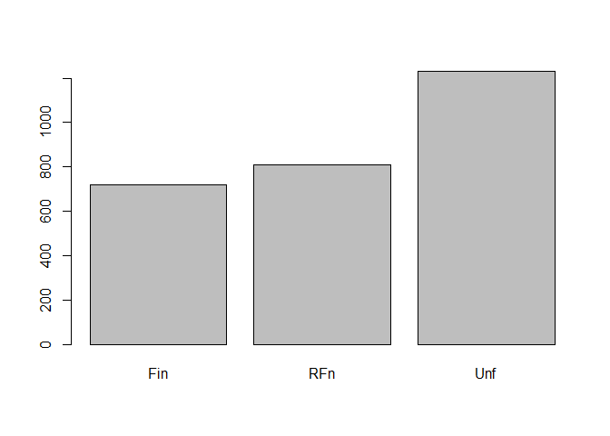

``` r
plot(as.factor(data$GarageFinish),data$SalePrice)
```

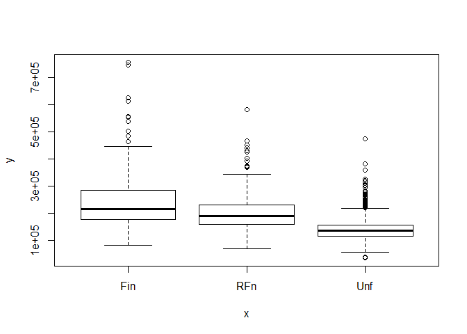

``` r
data$GarageFinish[is.na(data$GarageFinish)] <- "None"
plot(as.factor(data$GarageFinish),data$SalePrice)
```

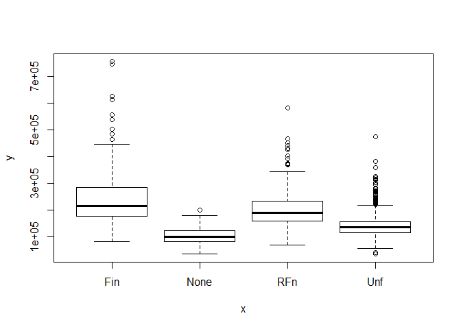

``` r
#it seems ordinal
levels(as.factor(data$GarageFinish))
```

    ## [1] "Fin"  "None" "RFn"  "Unf"

``` r
Finish<-c('None' = 0, "Unf" = 1, "RFn" = 2, "Fin" = 3)
data$GarageFinish<-revalue(data$GarageFinish,Finish)
data$GarageFinish<-as.integer(data$GarageFinish)  
plot(data$GarageFinish,data$SalePrice)
```


``` r
# GarageQual   
table(data$GarageQual)
```

    ## 
    ##   Ex   Fa   Gd   Po   TA 
    ##    3  124   24    5 2604

``` r
plot(as.factor(data$GarageQual),data$SalePrice)
```

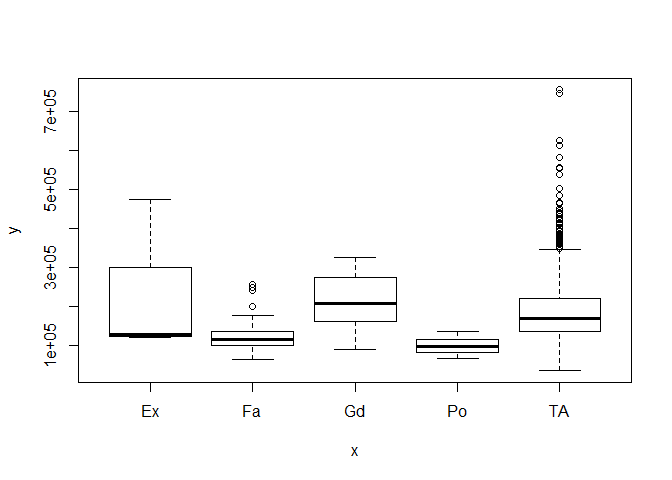

``` r
data$GarageQual[is.na(data$GarageQual)] <- "None"
plot(as.factor(data$GarageQual),data$SalePrice)
```

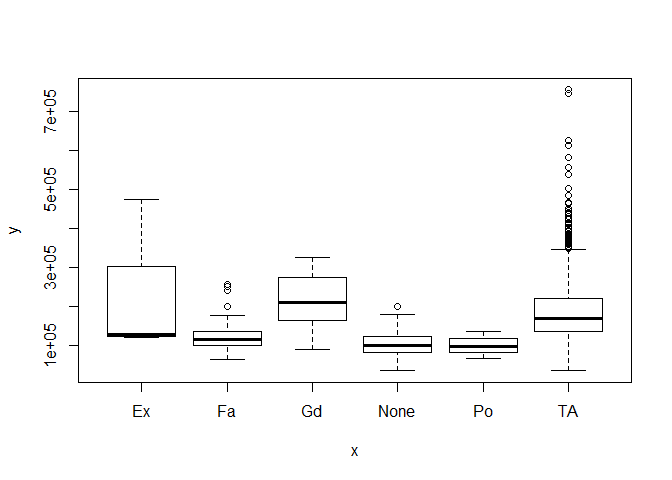

``` r
data$GarageQual<-revalue(data$GarageQual,Qual_Cond)
table(data$GarageQual)
```

    ## 
    ##    0    1    2    3    4    5 
    ##  159    5  124 2604   24    3

``` r
data$GarageQual<-as.integer(data$GarageQual)


# GarageCond    
table(data$GarageCond)
```

    ## 
    ##   Ex   Fa   Gd   Po   TA 
    ##    3   74   15   14 2654

``` r
plot(as.factor(data$GarageCond),data$SalePrice)
```

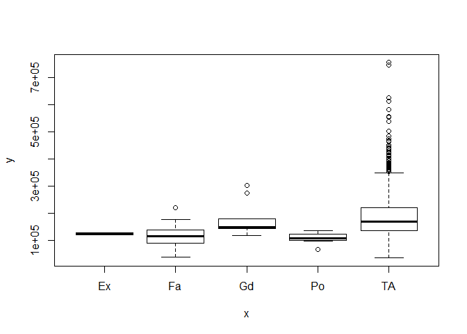

``` r
data$GarageCond[is.na(data$GarageCond)] <- "None"
plot(as.factor(data$GarageCond),data$SalePrice)
```

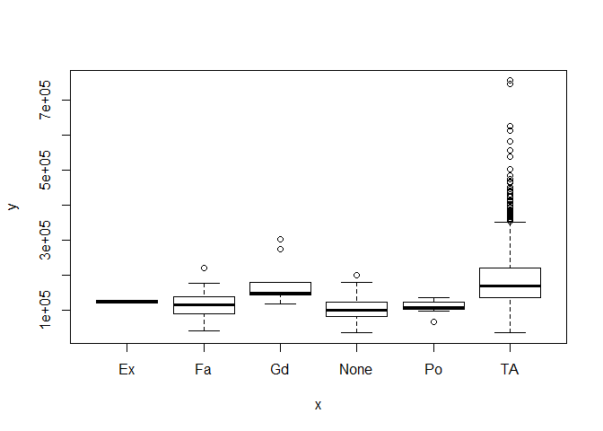

``` r
data$GarageCond<-revalue(data$GarageCond,Qual_Cond)
table(data$GarageCond)
```

    ## 
    ##    0    1    2    3    4    5 
    ##  159   14   74 2654   15    3

``` r
data$GarageCond<-as.integer(data$GarageCond)
#we can see the correlation 
cor(data$GarageCond,data$GarageQual)
```

    ## [1] 0.9466563

``` r
#It is a huge correlation,we must drop one of 2 variables
cor(data[1:1459,'SalePrice'],data[1:1459,'GarageCond'])
```

    ## [1] 0.2632897

``` r
cor(data[1:1459,'SalePrice'],data[1:1459,'GarageQual'])
```

    ## [1] 0.2739379

``` r
#We'll drop the variable less correlated with sales price
data <- subset(data, select = -GarageCond)

# GarageType
table(data$GarageType)
```

    ## 
    ##  2Types  Attchd Basment BuiltIn CarPort  Detchd 
    ##      23    1723      36     186      15     779

``` r
plot(as.factor(data$GarageType),data$SalePrice)
```


``` r
data$GarageType[is.na(data$GarageType)] <- "None"
plot(as.factor(data$GarageType),data$SalePrice)
data$GarageType<-as.factor(data$GarageType)
plot(data$GarageType,data$SalePrice)
```

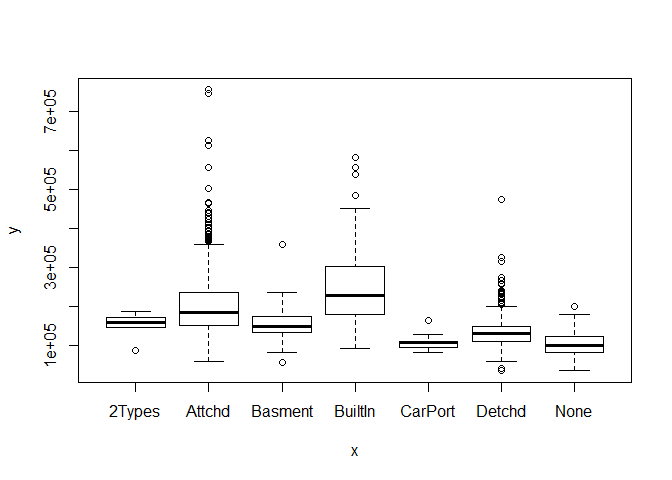

``` r
#Maybe classify together the basement and garage variables later?

# BsmtCond:Evaluates the general condition of the basement
table(data$BsmtCond)
```

    ## 
    ##   Fa   Gd   Po   TA 
    ##  104  122    5 2606

``` r
plot(as.factor(data$BsmtCond),data$SalePrice)
```

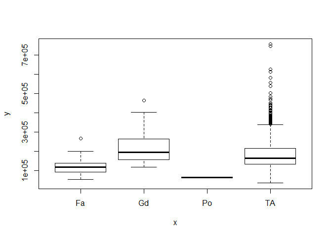

``` r
data$BsmtCond[is.na(data$BsmtCond)] <- "None"
plot(as.factor(data$BsmtCond),data$SalePrice)
```


``` r
data$BsmtCond<-revalue(data$BsmtCond,Qual_Cond)
```

    ## The following `from` values were not present in `x`: Ex

``` r
table(data$BsmtCond)
```

    ## 
    ##    0    1    2    3    4 
    ##   82    5  104 2606  122

``` r
data$BsmtCond<-as.integer(data$BsmtCond)
plot(as.factor(data$BsmtCond),data$SalePrice)
```

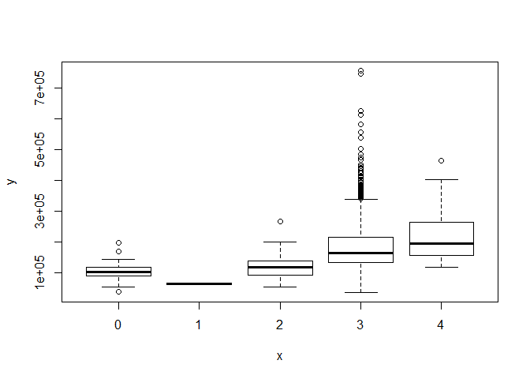

``` r
# BsmtExposure:Refers to walkout or garden level walls
table(data$BsmtExposure)
```

    ## 
    ##   Av   Gd   Mn   No 
    ##  418  276  239 1904

``` r
plot(as.factor(data$BsmtExposure),data$SalePrice)
```

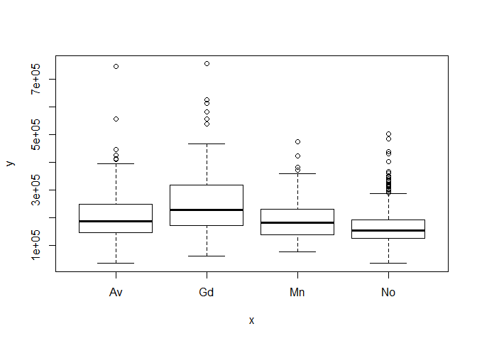

``` r
data$BsmtExposure[is.na(data$BsmtExposure)] <- "None"
plot(as.factor(data$BsmtExposure),data$SalePrice)
```

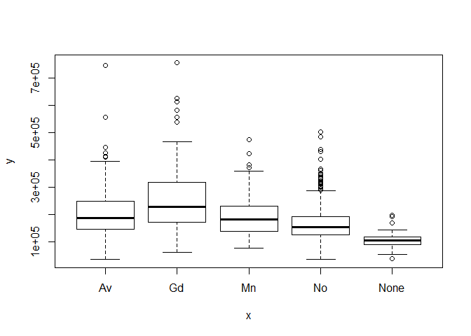

``` r
Exposure<-c("None"=0,"No"=1,'Mn'=2,'Av'=3,'Gd'=4)
data$BsmtExposure<-revalue(data$BsmtExposure,Exposure)
table(data$BsmtExposure)
```

    ## 
    ##    0    1    2    3    4 
    ##   82 1904  239  418  276

``` r
data$BsmtExposure<-as.integer(data$BsmtExposure)
plot(as.factor(data$BsmtExposure),data$SalePrice)
```

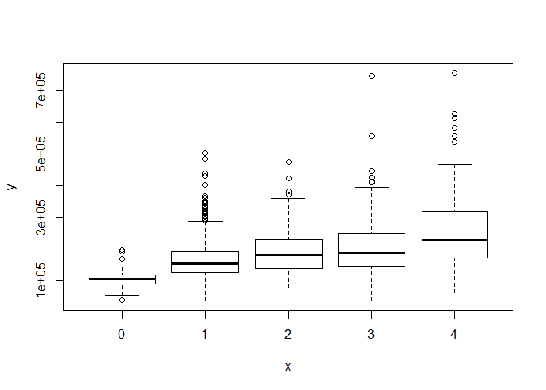

``` r
# BsmtQual:Evaluates the height of the basement
table(data$BsmtQual)
```

    ## 
    ##   Ex   Fa   Gd   TA 
    ##  258   88 1209 1283

``` r
plot(as.factor(data$BsmtQual),data$SalePrice)
```


``` r
data$BsmtQual[is.na(data$BsmtQual)] <- "None"
plot(as.factor(data$BsmtQual),data$SalePrice)
```

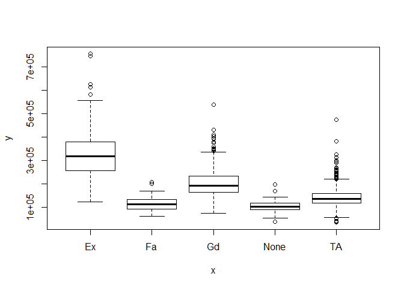

``` r
data$BsmtQual<-revalue(data$BsmtQual,Qual_Cond)
```

    ## The following `from` values were not present in `x`: Po

``` r
table(data$BsmtQual)
```

    ## 
    ##    0    2    3    4    5 
    ##   81   88 1283 1209  258

``` r
data$BsmtQual<-as.integer(data$BsmtQual)
plot(as.factor(data$BsmtQual),data$SalePrice)
```

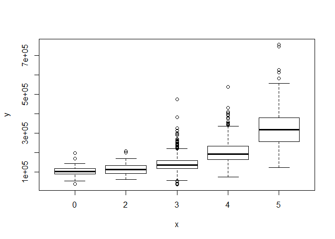

``` r
# BsmtFinType1:Rating of basement finished area
table(data$BsmtFinType1)
```

    ## 
    ## ALQ BLQ GLQ LwQ Rec Unf 
    ## 429 269 849 154 288 851

``` r
plot(as.factor(data$BsmtFinType1),data$SalePrice)
```

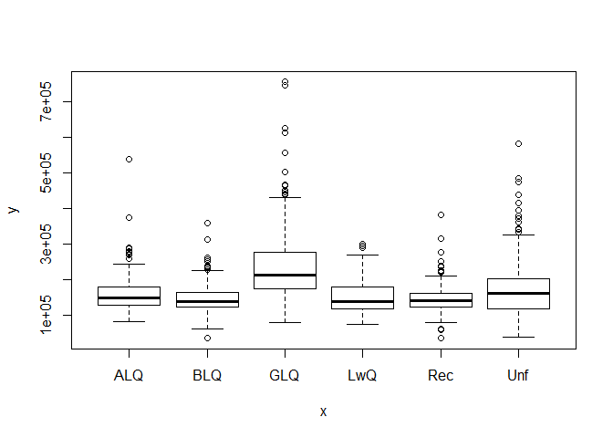

``` r
data$BsmtFinType1[is.na(data$BsmtFinType1)] <- "None"
plot(as.factor(data$BsmtFinType1),data$SalePrice)
```

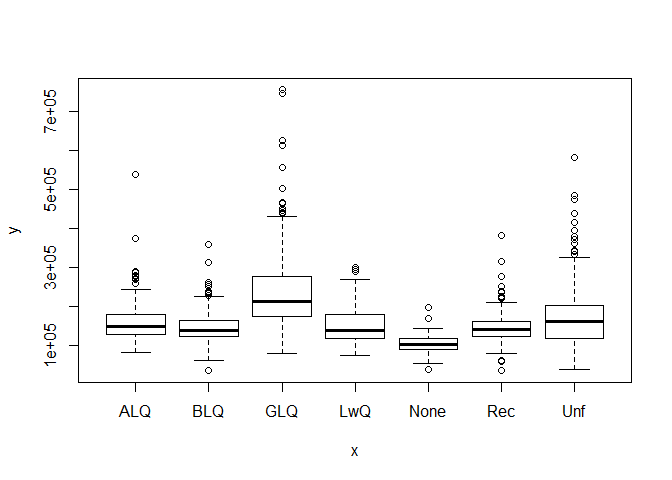

``` r
Bsm_type<-c("None"=0,"Unf"=1,'LwQ'=2,'Rec'=3,'BLQ'=4,'ALQ'=5,'GLQ'=6)
data$BsmtFinType1<-revalue(data$BsmtFinType1,Bsm_type)
table(data$BsmtFinType1)
```

    ## 
    ##   0   1   2   3   4   5   6 
    ##  79 851 154 288 269 429 849

``` r
data$BsmtFinType1<-as.integer(data$BsmtFinType1)
plot(as.factor(data$BsmtFinType1),data$SalePrice)
```


``` r
#BsmtFinType2:Rating of basement finished area (if multiple types)
table(data$BsmtFinType2)
```

    ## 
    ##  ALQ  BLQ  GLQ  LwQ  Rec  Unf 
    ##   52   68   34   87  105 2493

``` r
plot(as.factor(data$BsmtFinType2),data$SalePrice)
```

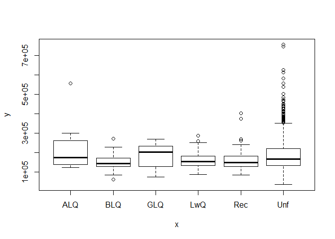

``` r
data$BsmtFinType2[is.na(data$BsmtFinType2)] <- "None"
plot(as.factor(data$BsmtFinType2),data$SalePrice)
```

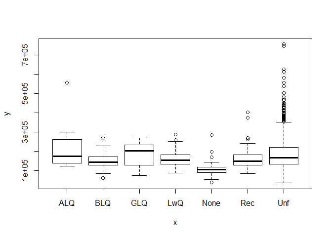

``` r
data$BsmtFinType2<-revalue(data$BsmtFinType2,Bsm_type)
table(data$BsmtFinType2)
```

    ## 
    ##    0    1    2    3    4    5    6 
    ##   80 2493   87  105   68   52   34

``` r
data$BsmtFinType2<-as.integer(data$BsmtFinType2)
plot(as.factor(data$BsmtFinType2),data$SalePrice)
```

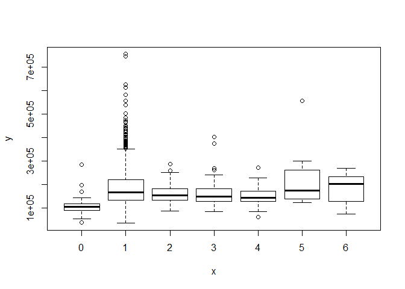

``` r
# MasVnrType: Masonry veneer type (walls)  Replace all Na's with 'none'
table(data$MasVnrType)
```

    ## 
    ##  BrkCmn BrkFace    None   Stone 
    ##      25     879    1742     249

``` r
plot(as.factor(data$MasVnrType),data$SalePrice)
```

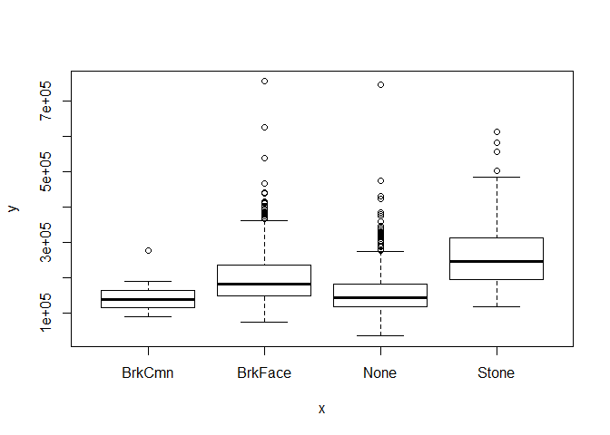

``` r
data$MasVnrType[is.na(data$MasVnrType)] <- "None"
Masonry <- c('None'=0, 'BrkCmn'=1, 'BrkFace'=2, 'Stone'=3)
data$MasVnrType<-revalue(data$MasVnrType,Masonry)
table(data$MasVnrType)
```

    ## 
    ##    0    1    2    3 
    ## 1766   25  879  249

``` r
data$MasVnrType<-as.integer(data$MasVnrType)
plot(as.factor(data$MasVnrType),data$SalePrice)
```

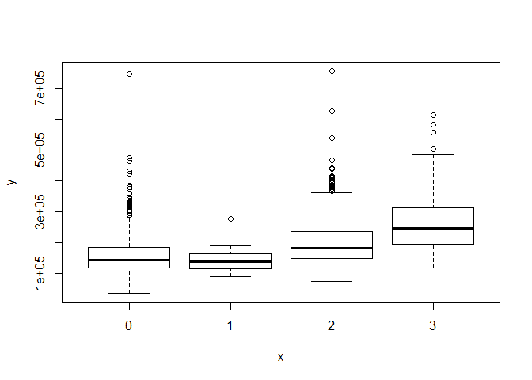

``` r
# MasVnrArea
table(data$MasVnrArea)
```

    ## 
    ##    0    1    3   11   14   16   18   20   22   23   24   27   28   30   31 
    ## 1738    3    1    1    4   11    3    4    2    4    2    1    2    4    1 
    ##   32   34   36   38   39   40   41   42   44   45   46   47   48   50   51 
    ##    4    1    2    2    1    8    3    3    7    3    1    1    1    7    3 
    ##   52   53   54   56   57   58   60   62   63   64   65   66   67   68   69 
    ##    3    2    4    2    1    2    7    1    1    1    2    2    2    5    1 
    ##   70   72   74   75   76   80   81   82   84   85   86   87   88   89   90 
    ##    4   11    4    2    7    9    1    5    7    4    3    1    5    2    6 
    ##   91   92   94   95   96   97   98   99  100  101  102  104  105  106  108 
    ##    1    2    4    3    4    1    5    4    5    3    2    4    2    7   11 
    ##  109  110  112  113  114  115  116  117  118  119  120  121  122  123  124 
    ##    1    3    6    3    2    3    3    2    1    2   15    1    3    3    1 
    ##  125  126  127  128  130  132  134  135  136  137  138  140  141  142  143 
    ##    3    4    1    9    6    8    2    3    5    1    2    7    1    2    6 
    ##  144  145  146  147  148  149  150  151  153  154  156  157  158  160  161 
    ##   11    6    2    2    5    4    5    1    3    1    3    3    3    5    3 
    ##  162  163  164  165  166  167  168  169  170  171  172  174  175  176  177 
    ##    5    2    7    3    4    1    5    3    8    2    5    7    1   13    1 
    ##  178  179  180  182  183  184  186  187  188  189  190  192  194  196  197 
    ##    8    1   12    5    4    3    7    1    3    3    3    4    5    9    1 
    ##  198  199  200  202  203  204  205  206  207  208  209  210  212  214  215 
    ##    6    1   13    2    7    2    3    5    1    3    2    9    4    1    3 
    ##  216  217  218  219  220  221  222  223  224  225  226  227  228  229  230 
    ##   12    1    3    1    4    1    1    1    1    1    4    2    2    1    2 
    ##  232  233  234  235  236  237  238  240  242  243  244  245  246  247  248 
    ##    6    2    2    1    3    1    4    7    4    2    2    2    6    1    4 
    ##  250  251  252  253  254  255  256  257  258  259  260  261  262  263  264 
    ##    4    1    7    1    2    1    8    1    2    2    7    2    1    1    3 
    ##  265  266  268  270  272  274  275  276  278  279  280  281  283  284  285 
    ##    2    2    5    7    5    1    3    1    2    1    4    2    1    3    3 
    ##  286  287  288  289  290  291  292  293  294  295  296  297  298  299  300 
    ##    2    1    6    3    3    1    2    1    2    3    2    1    3    1    7 
    ##  302  304  305  306  308  309  310  312  315  318  320  322  323  324  327 
    ##    8    3    3    6    1    2    3    3    1    2    7    1    1    1    1 
    ##  328  332  333  335  336  337  338  340  342  344  348  350  351  352  353 
    ##    2    1    1    2    4    1    2   10    2    2    1    3    2    2    1 
    ##  355  356  359  360  361  362  364  365  366  368  370  371  372  375  376 
    ##    1    2    2    7    1    2    2    2    2    2    1    1    1    1    1 
    ##  378  379  380  381  382  383  385  387  388  391  394  396  397  399  400 
    ##    2    1    2    1    1    2    1    1    1    1    1    1    1    1    1 
    ##  402  405  406  408  410  412  415  418  420  422  423  424  425  426  428 
    ##    2    1    1    1    2    1    1    1    7    2    3    2    3    1    1 
    ##  430  432  434  435  436  438  440  442  443  444  448  450  451  452  456 
    ##    2    2    1    1    1    1    1    3    1    1    1    4    1    1    7 
    ##  459  464  466  468  470  472  473  479  480  481  491  492  495  500  501 
    ##    1    1    3    2    1    3    3    1    4    1    1    2    1    2    1 
    ##  502  504  506  509  510  513  514  515  518  519  522  525  526  528  530 
    ##    1    6    2    1    2    5    1    1    1    1    1    2    1    1    1 
    ##  532  541  549  550  554  562  564  567  568  571  572  573  576  579  584 
    ##    1    1    1    1    3    1    1    2    2    1    1    1    1    1    1 
    ##  594  600  603  604  615  616  621  630  632  634  640  647  650  651  652 
    ##    1    3    1    1    1    1    2    1    2    1    1    1    2    1    1 
    ##  653  657  660  662  664  668  673  674  680  692  705  710  714  724  726 
    ##    1    1    2    1    1    1    1    2    1    1    1    1    1    1    1 
    ##  730  731  734  738  748  754  760  762  766  768  771  772  788  796  816 
    ##    1    1    1    1    1    1    1    1    1    1    1    1    1    1    1 
    ##  860  870  877  886  894  902  921  922  945  970  975 1031 1047 1050 1095 
    ##    1    1    1    1    1    1    1    1    1    1    1    1    1    1    1 
    ## 1110 1115 1129 1159 1170 1224 1290 1378 1600 
    ##    1    1    1    1    1    2    1    1    1

``` r
plot(data$MasVnrArea,data$SalePrice)
```


``` r
data$MasVnrArea[is.na(data$MasVnrArea)] <- 0
table(data$MasVnrArea)
```

    ## 
    ##    0    1    3   11   14   16   18   20   22   23   24   27   28   30   31 
    ## 1761    3    1    1    4   11    3    4    2    4    2    1    2    4    1 
    ##   32   34   36   38   39   40   41   42   44   45   46   47   48   50   51 
    ##    4    1    2    2    1    8    3    3    7    3    1    1    1    7    3 
    ##   52   53   54   56   57   58   60   62   63   64   65   66   67   68   69 
    ##    3    2    4    2    1    2    7    1    1    1    2    2    2    5    1 
    ##   70   72   74   75   76   80   81   82   84   85   86   87   88   89   90 
    ##    4   11    4    2    7    9    1    5    7    4    3    1    5    2    6 
    ##   91   92   94   95   96   97   98   99  100  101  102  104  105  106  108 
    ##    1    2    4    3    4    1    5    4    5    3    2    4    2    7   11 
    ##  109  110  112  113  114  115  116  117  118  119  120  121  122  123  124 
    ##    1    3    6    3    2    3    3    2    1    2   15    1    3    3    1 
    ##  125  126  127  128  130  132  134  135  136  137  138  140  141  142  143 
    ##    3    4    1    9    6    8    2    3    5    1    2    7    1    2    6 
    ##  144  145  146  147  148  149  150  151  153  154  156  157  158  160  161 
    ##   11    6    2    2    5    4    5    1    3    1    3    3    3    5    3 
    ##  162  163  164  165  166  167  168  169  170  171  172  174  175  176  177 
    ##    5    2    7    3    4    1    5    3    8    2    5    7    1   13    1 
    ##  178  179  180  182  183  184  186  187  188  189  190  192  194  196  197 
    ##    8    1   12    5    4    3    7    1    3    3    3    4    5    9    1 
    ##  198  199  200  202  203  204  205  206  207  208  209  210  212  214  215 
    ##    6    1   13    2    7    2    3    5    1    3    2    9    4    1    3 
    ##  216  217  218  219  220  221  222  223  224  225  226  227  228  229  230 
    ##   12    1    3    1    4    1    1    1    1    1    4    2    2    1    2 
    ##  232  233  234  235  236  237  238  240  242  243  244  245  246  247  248 
    ##    6    2    2    1    3    1    4    7    4    2    2    2    6    1    4 
    ##  250  251  252  253  254  255  256  257  258  259  260  261  262  263  264 
    ##    4    1    7    1    2    1    8    1    2    2    7    2    1    1    3 
    ##  265  266  268  270  272  274  275  276  278  279  280  281  283  284  285 
    ##    2    2    5    7    5    1    3    1    2    1    4    2    1    3    3 
    ##  286  287  288  289  290  291  292  293  294  295  296  297  298  299  300 
    ##    2    1    6    3    3    1    2    1    2    3    2    1    3    1    7 
    ##  302  304  305  306  308  309  310  312  315  318  320  322  323  324  327 
    ##    8    3    3    6    1    2    3    3    1    2    7    1    1    1    1 
    ##  328  332  333  335  336  337  338  340  342  344  348  350  351  352  353 
    ##    2    1    1    2    4    1    2   10    2    2    1    3    2    2    1 
    ##  355  356  359  360  361  362  364  365  366  368  370  371  372  375  376 
    ##    1    2    2    7    1    2    2    2    2    2    1    1    1    1    1 
    ##  378  379  380  381  382  383  385  387  388  391  394  396  397  399  400 
    ##    2    1    2    1    1    2    1    1    1    1    1    1    1    1    1 
    ##  402  405  406  408  410  412  415  418  420  422  423  424  425  426  428 
    ##    2    1    1    1    2    1    1    1    7    2    3    2    3    1    1 
    ##  430  432  434  435  436  438  440  442  443  444  448  450  451  452  456 
    ##    2    2    1    1    1    1    1    3    1    1    1    4    1    1    7 
    ##  459  464  466  468  470  472  473  479  480  481  491  492  495  500  501 
    ##    1    1    3    2    1    3    3    1    4    1    1    2    1    2    1 
    ##  502  504  506  509  510  513  514  515  518  519  522  525  526  528  530 
    ##    1    6    2    1    2    5    1    1    1    1    1    2    1    1    1 
    ##  532  541  549  550  554  562  564  567  568  571  572  573  576  579  584 
    ##    1    1    1    1    3    1    1    2    2    1    1    1    1    1    1 
    ##  594  600  603  604  615  616  621  630  632  634  640  647  650  651  652 
    ##    1    3    1    1    1    1    2    1    2    1    1    1    2    1    1 
    ##  653  657  660  662  664  668  673  674  680  692  705  710  714  724  726 
    ##    1    1    2    1    1    1    1    2    1    1    1    1    1    1    1 
    ##  730  731  734  738  748  754  760  762  766  768  771  772  788  796  816 
    ##    1    1    1    1    1    1    1    1    1    1    1    1    1    1    1 
    ##  860  870  877  886  894  902  921  922  945  970  975 1031 1047 1050 1095 
    ##    1    1    1    1    1    1    1    1    1    1    1    1    1    1    1 
    ## 1110 1115 1129 1159 1170 1224 1290 1378 1600 
    ##    1    1    1    1    1    2    1    1    1

``` r
data$MasVnrArea<-as.numeric(data$MasVnrArea)
plot(data$MasVnrArea,data$SalePrice)
```

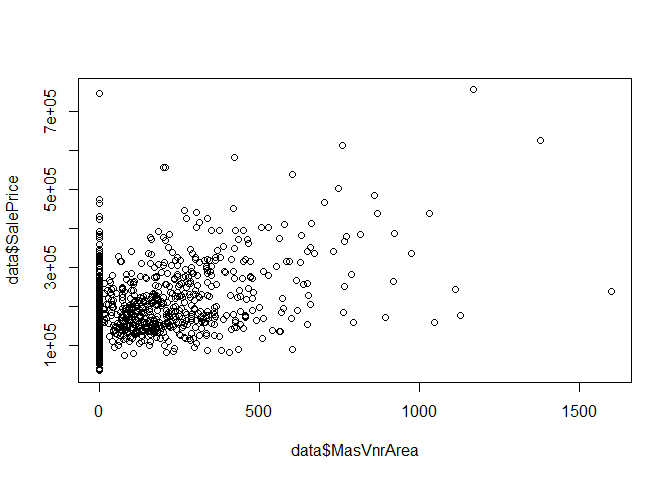

``` r
# MSZoning: Identifies the general zoning classification of the sale.
table(data$MSZoning)
```

    ## 
    ## C (all)      FV      RH      RL      RM 
    ##      25     139      26    2265     460

``` r
plot(as.factor(data$MSZoning),data$SalePrice)
```

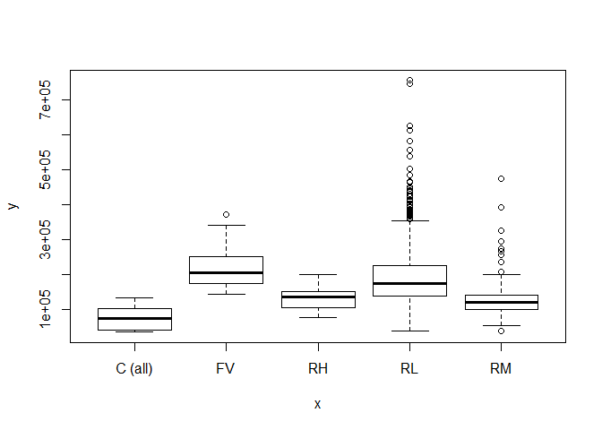

``` r
data[is.na(data$MSZoning),] #How we can find the missing values? Let's check out the MSSubClass
```

    ##        Id MSSubClass MSZoning LotFrontage LotArea Street Alley LotShape
    ## 1916 1916         30     <NA>    109.0000   21780   Grvl  None      Reg
    ## 2217 2217         20     <NA>     80.0000   14584   Pave  None      Reg
    ## 2251 2251         70     <NA>     69.3058   56600   Pave  None      IR1
    ## 2905 2905         20     <NA>    125.0000   31250   Pave  None      Reg
    ##      LandContour Utilities LotConfig LandSlope Neighborhood Condition1
    ## 1916         Lvl      <NA>    Inside       Gtl       IDOTRR       Norm
    ## 2217         Low    AllPub    Inside       Mod       IDOTRR       Norm
    ## 2251         Low    AllPub    Inside       Gtl       IDOTRR       Norm
    ## 2905         Lvl    AllPub    Inside       Gtl      Mitchel     Artery
    ##      Condition2 BldgType HouseStyle OverallQual OverallCond YearBuilt
    ## 1916       Norm     1Fam     1Story           2           4      1910
    ## 2217       Norm     1Fam     1Story           1           5      1952
    ## 2251       Norm     1Fam     2.5Unf           5           1      1900
    ## 2905       Norm     1Fam     1Story           1           3      1951
    ##      YearRemodAdd RoofStyle RoofMatl Exterior1st Exterior2nd MasVnrType
    ## 1916         1950     Gable  CompShg     Wd Sdng     Wd Sdng          0
    ## 2217         1952     Gable  CompShg     AsbShng     VinylSd          0
    ## 2251         1950       Hip  CompShg     Wd Sdng     Wd Sdng          0
    ## 2905         1951     Gable  CompShg      CBlock     VinylSd          0
    ##      MasVnrArea ExterQual ExterCond Foundation BsmtQual BsmtCond
    ## 1916          0        Fa        Fa     CBlock        0        0
    ## 2217          0        Fa        Po       Slab        0        0
    ## 2251          0        TA        TA     BrkTil        3        3
    ## 2905          0        TA        Fa     CBlock        0        0
    ##      BsmtExposure BsmtFinType1 BsmtFinSF1 BsmtFinType2 BsmtFinSF2
    ## 1916            0            0          0            0          0
    ## 2217            0            0          0            0          0
    ## 2251            1            1          0            1          0
    ## 2905            0            0          0            0          0
    ##      BsmtUnfSF TotalBsmtSF Heating HeatingQC CentralAir Electrical
    ## 1916         0           0    GasA        TA          N      FuseA
    ## 2217         0           0    Wall        Po          N      FuseA
    ## 2251       686         686    GasA        Ex          Y      SBrkr
    ## 2905         0           0    GasA        TA          Y      FuseA
    ##      X1stFlrSF X2ndFlrSF LowQualFinSF GrLivArea BsmtFullBath BsmtHalfBath
    ## 1916       810         0            0       810            0            0
    ## 2217       733         0            0       733            0            0
    ## 2251      1150       686            0      1836            0            0
    ## 2905      1600         0            0      1600            0            0
    ##      FullBath HalfBath BedroomAbvGr KitchenAbvGr KitchenQual TotRmsAbvGrd
    ## 1916        1        0            1            1          TA            4
    ## 2217        1        0            2            1          Fa            4
    ## 2251        2        0            4            1          TA            7
    ## 2905        1        1            3            1          TA            6
    ##      Functional Fireplaces FireplaceQu GarageType GarageFinish GarageCars
    ## 1916       Min1          0           0     Detchd            1          1
    ## 2217       <NA>          0           0     Attchd            1          2
    ## 2251       Maj1          0           0     Detchd            1          1
    ## 2905        Mod          0           0     Attchd            1          1
    ##      GarageArea GarageQual PavedDrive WoodDeckSF OpenPorchSF EnclosedPorch
    ## 1916        280          3          N        119          24             0
    ## 2217        487          2          N          0           0             0
    ## 2251        288          3          N          0           0             0
    ## 2905        270          2          N          0           0           135
    ##      X3SsnPorch ScreenPorch PoolArea PoolQC Fence MiscFeature MiscVal
    ## 1916          0           0        0      0  None        None       0
    ## 2217          0           0        0      0  None        None       0
    ## 2251          0           0        0      0  None        None       0
    ## 2905          0           0        0      0  None        None       0
    ##      MoSold YrSold SaleType SaleCondition SalePrice
    ## 1916      3   2009    ConLD        Normal        NA
    ## 2217      2   2008       WD       Abnorml        NA
    ## 2251      1   2008       WD        Normal        NA
    ## 2905      5   2006       WD        Normal        NA

``` r
data[is.na(data$MSZoning),c("MSZoning",'MSSubClass')]
```

    ##      MSZoning MSSubClass
    ## 1916     <NA>         30
    ## 2217     <NA>         20
    ## 2251     <NA>         70
    ## 2905     <NA>         20

``` r
table(data[,c("MSZoning",'MSSubClass')])
```

    ##          MSSubClass
    ## MSZoning    20   30   40   45   50   60   70   75   80   85   90  120  150
    ##   C (all)    3    8    0    0    7    0    4    0    0    0    0    0    0
    ##   FV        34    0    0    0    0   43    0    0    0    0    0   19    0
    ##   RH         4    2    0    1    2    0    3    0    0    0    4    6    0
    ##   RL      1016   61    4    6  159  529   57    9  115   47   92  117    1
    ##   RM        20   67    2   11  119    3   63   14    3    1   13   40    0
    ##          MSSubClass
    ## MSZoning   160  180  190
    ##   C (all)    0    0    3
    ##   FV        43    0    0
    ##   RH         0    0    4
    ##   RL        21    0   31
    ##   RM        64   17   23

``` r
plot(as.factor(data$MSZoning),as.factor(data$MSSubClass))
```

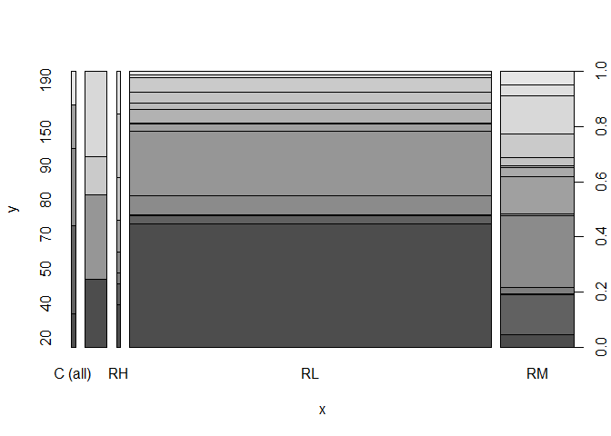

``` r
plot(as.factor(data$MSSubClass),as.factor(data$MSZoning))
```


``` r
#and now the correlations
library(corrplot)
```

    ## corrplot 0.84 loaded

``` r
cor(data$MSSubClass,data[,sapply(data, is.numeric)]) #it is not higly correlated with other numeric variables
```

    ##               Id MSSubClass LotFrontage  LotArea OverallQual OverallCond
    ## [1,] 0.008930622          1  -0.3901181 -0.20173  0.03363797 -0.06562504
    ##       YearBuilt YearRemodAdd  MasVnrType  MasVnrArea   BsmtQual
    ## [1,] 0.03440874   0.04331491 0.007170029 0.006309137 0.06525105
    ##          BsmtCond BsmtExposure BsmtFinType1 BsmtFinSF1 BsmtFinType2
    ## [1,] -0.003662076   0.05929913   0.05162957         NA  -0.03622638
    ##      BsmtFinSF2 BsmtUnfSF TotalBsmtSF  X1stFlrSF X2ndFlrSF LowQualFinSF
    ## [1,]         NA        NA          NA -0.2486415 0.3093091   0.02648179
    ##       GrLivArea BsmtFullBath BsmtHalfBath  FullBath  HalfBath BedroomAbvGr
    ## [1,] 0.07167745           NA           NA 0.1391396 0.1787502 -0.008796152
    ##      KitchenAbvGr TotRmsAbvGrd  Fireplaces FireplaceQu GarageFinish
    ## [1,]    0.2601555   0.04050946 -0.05515069 -0.05154243  -0.03689839
    ##      GarageCars GarageArea  GarageQual  WoodDeckSF OpenPorchSF
    ## [1,]         NA         NA -0.09573865 -0.01765413  -0.0159232
    ##      EnclosedPorch  X3SsnPorch ScreenPorch     PoolArea       PoolQC
    ## [1,]   -0.02086725 -0.03752892 -0.04918147 -0.003079582 -0.001679514
    ##          MiscVal       MoSold     YrSold SalePrice
    ## [1,] -0.02886686 -0.001231139 -0.0150278        NA

``` r
#We will replace MSSubClass=20 with RL , MSSubClass=70 and MSSubClass=30 with RM 
data$MSZoning[is.na(data$MSZoning)]<-c('RM','RL','RM','RL')
data[is.na(data$MSZoning),c("MSZoning",'MSSubClass')]
```

    ## [1] MSZoning   MSSubClass
    ## <0 rows> (or 0-length row.names)

``` r
data$MSZoning<-as.factor(data$MSZoning)

# Utilities: Type of utilities available
table(data$Utilities)
```

    ## 
    ## AllPub NoSeWa 
    ##   2916      1

``` r
data[is.na(data$Utilities),]
```

    ##        Id MSSubClass MSZoning LotFrontage LotArea Street Alley LotShape
    ## 1916 1916         30       RM    109.0000   21780   Grvl  None      Reg
    ## 1946 1946         20       RL     69.3058   31220   Pave  None      IR1
    ##      LandContour Utilities LotConfig LandSlope Neighborhood Condition1
    ## 1916         Lvl      <NA>    Inside       Gtl       IDOTRR       Norm
    ## 1946         Bnk      <NA>       FR2       Gtl      Gilbert      Feedr
    ##      Condition2 BldgType HouseStyle OverallQual OverallCond YearBuilt
    ## 1916       Norm     1Fam     1Story           2           4      1910
    ## 1946       Norm     1Fam     1Story           6           2      1952
    ##      YearRemodAdd RoofStyle RoofMatl Exterior1st Exterior2nd MasVnrType
    ## 1916         1950     Gable  CompShg     Wd Sdng     Wd Sdng          0
    ## 1946         1952       Hip  CompShg     BrkFace     BrkFace          0
    ##      MasVnrArea ExterQual ExterCond Foundation BsmtQual BsmtCond
    ## 1916          0        Fa        Fa     CBlock        0        0
    ## 1946          0        TA        TA     CBlock        3        3
    ##      BsmtExposure BsmtFinType1 BsmtFinSF1 BsmtFinType2 BsmtFinSF2
    ## 1916            0            0          0            0          0
    ## 1946            1            1          0            1          0
    ##      BsmtUnfSF TotalBsmtSF Heating HeatingQC CentralAir Electrical
    ## 1916         0           0    GasA        TA          N      FuseA
    ## 1946      1632        1632    GasA        TA          Y      FuseA
    ##      X1stFlrSF X2ndFlrSF LowQualFinSF GrLivArea BsmtFullBath BsmtHalfBath
    ## 1916       810         0            0       810            0            0
    ## 1946      1474         0            0      1474            0            0
    ##      FullBath HalfBath BedroomAbvGr KitchenAbvGr KitchenQual TotRmsAbvGrd
    ## 1916        1        0            1            1          TA            4
    ## 1946        1        0            3            1          TA            7
    ##      Functional Fireplaces FireplaceQu GarageType GarageFinish GarageCars
    ## 1916       Min1          0           0     Detchd            1          1
    ## 1946       Min2          2           4     Attchd            1          2
    ##      GarageArea GarageQual PavedDrive WoodDeckSF OpenPorchSF EnclosedPorch
    ## 1916        280          3          N        119          24             0
    ## 1946        495          3          Y          0           0           144
    ##      X3SsnPorch ScreenPorch PoolArea PoolQC Fence MiscFeature MiscVal
    ## 1916          0           0        0      0  None        None       0
    ## 1946          0           0        0      0  None        Shed     750
    ##      MoSold YrSold SaleType SaleCondition SalePrice
    ## 1916      3   2009    ConLD        Normal        NA
    ## 1946      5   2008       WD        Normal        NA

``` r
data[(data$Utilities=='NoSeWa'),]
```

    ##       Id MSSubClass MSZoning LotFrontage LotArea Street Alley LotShape
    ## 945  945         20       RL     69.3058   14375   Pave  None      IR1
    ## NA    NA         NA     <NA>          NA      NA   <NA>  <NA>     <NA>
    ## NA.1  NA         NA     <NA>          NA      NA   <NA>  <NA>     <NA>
    ##      LandContour Utilities LotConfig LandSlope Neighborhood Condition1
    ## 945          Lvl    NoSeWa   CulDSac       Gtl       Timber       Norm
    ## NA          <NA>      <NA>      <NA>      <NA>         <NA>       <NA>
    ## NA.1        <NA>      <NA>      <NA>      <NA>         <NA>       <NA>
    ##      Condition2 BldgType HouseStyle OverallQual OverallCond YearBuilt
    ## 945        Norm     1Fam       SLvl           6           6      1958
    ## NA         <NA>     <NA>       <NA>          NA          NA        NA
    ## NA.1       <NA>     <NA>       <NA>          NA          NA        NA
    ##      YearRemodAdd RoofStyle RoofMatl Exterior1st Exterior2nd MasVnrType
    ## 945          1958     Gable  CompShg     HdBoard     HdBoard          2
    ## NA             NA      <NA>     <NA>        <NA>        <NA>         NA
    ## NA.1           NA      <NA>     <NA>        <NA>        <NA>         NA
    ##      MasVnrArea ExterQual ExterCond Foundation BsmtQual BsmtCond
    ## 945         541        TA        TA     CBlock        3        3
    ## NA           NA      <NA>      <NA>       <NA>       NA       NA
    ## NA.1         NA      <NA>      <NA>       <NA>       NA       NA
    ##      BsmtExposure BsmtFinType1 BsmtFinSF1 BsmtFinType2 BsmtFinSF2
    ## 945             1            6        111            3        354
    ## NA             NA           NA         NA           NA         NA
    ## NA.1           NA           NA         NA           NA         NA
    ##      BsmtUnfSF TotalBsmtSF Heating HeatingQC CentralAir Electrical
    ## 945        354         819    GasA        Gd          Y      FuseA
    ## NA          NA          NA    <NA>      <NA>       <NA>       <NA>
    ## NA.1        NA          NA    <NA>      <NA>       <NA>       <NA>
    ##      X1stFlrSF X2ndFlrSF LowQualFinSF GrLivArea BsmtFullBath BsmtHalfBath
    ## 945       1344         0            0      1344            0            1
    ## NA          NA        NA           NA        NA           NA           NA
    ## NA.1        NA        NA           NA        NA           NA           NA
    ##      FullBath HalfBath BedroomAbvGr KitchenAbvGr KitchenQual TotRmsAbvGrd
    ## 945         1        0            3            1          Gd            7
    ## NA         NA       NA           NA           NA        <NA>           NA
    ## NA.1       NA       NA           NA           NA        <NA>           NA
    ##      Functional Fireplaces FireplaceQu GarageType GarageFinish GarageCars
    ## 945         Typ          1           4    Basment            2          2
    ## NA         <NA>         NA          NA       <NA>           NA         NA
    ## NA.1       <NA>         NA          NA       <NA>           NA         NA
    ##      GarageArea GarageQual PavedDrive WoodDeckSF OpenPorchSF EnclosedPorch
    ## 945         525          3          Y          0         118             0
    ## NA           NA         NA       <NA>         NA          NA            NA
    ## NA.1         NA         NA       <NA>         NA          NA            NA
    ##      X3SsnPorch ScreenPorch PoolArea PoolQC Fence MiscFeature MiscVal
    ## 945           0         233        0      0  None        None       0
    ## NA           NA          NA       NA     NA  <NA>        <NA>      NA
    ## NA.1         NA          NA       NA     NA  <NA>        <NA>      NA
    ##      MoSold YrSold SaleType SaleCondition SalePrice
    ## 945       1   2009      COD       Abnorml    137500
    ## NA       NA     NA     <NA>          <NA>        NA
    ## NA.1     NA     NA     <NA>          <NA>        NA

``` r
data[945,]
```

    ##      Id MSSubClass MSZoning LotFrontage LotArea Street Alley LotShape
    ## 945 945         20       RL     69.3058   14375   Pave  None      IR1
    ##     LandContour Utilities LotConfig LandSlope Neighborhood Condition1
    ## 945         Lvl    NoSeWa   CulDSac       Gtl       Timber       Norm
    ##     Condition2 BldgType HouseStyle OverallQual OverallCond YearBuilt
    ## 945       Norm     1Fam       SLvl           6           6      1958
    ##     YearRemodAdd RoofStyle RoofMatl Exterior1st Exterior2nd MasVnrType
    ## 945         1958     Gable  CompShg     HdBoard     HdBoard          2
    ##     MasVnrArea ExterQual ExterCond Foundation BsmtQual BsmtCond
    ## 945        541        TA        TA     CBlock        3        3
    ##     BsmtExposure BsmtFinType1 BsmtFinSF1 BsmtFinType2 BsmtFinSF2 BsmtUnfSF
    ## 945            1            6        111            3        354       354
    ##     TotalBsmtSF Heating HeatingQC CentralAir Electrical X1stFlrSF
    ## 945         819    GasA        Gd          Y      FuseA      1344
    ##     X2ndFlrSF LowQualFinSF GrLivArea BsmtFullBath BsmtHalfBath FullBath
    ## 945         0            0      1344            0            1        1
    ##     HalfBath BedroomAbvGr KitchenAbvGr KitchenQual TotRmsAbvGrd Functional
    ## 945        0            3            1          Gd            7        Typ
    ##     Fireplaces FireplaceQu GarageType GarageFinish GarageCars GarageArea
    ## 945          1           4    Basment            2          2        525
    ##     GarageQual PavedDrive WoodDeckSF OpenPorchSF EnclosedPorch X3SsnPorch
    ## 945          3          Y          0         118             0          0
    ##     ScreenPorch PoolArea PoolQC Fence MiscFeature MiscVal MoSold YrSold
    ## 945         233        0      0  None        None       0      1   2009
    ##     SaleType SaleCondition SalePrice
    ## 945      COD       Abnorml    137500

``` r
#We don't need this variable for prediction , as there is only one house "NoSeWa"
data <- subset(data, select = -Utilities)


# BsmtFullBath:Basement full bathrooms
table(data$BsmtFullBath)
```

    ## 
    ##    0    1    2    3 
    ## 1705 1172   38    2

``` r
data[is.na(data$BsmtFullBath),]
```

    ##        Id MSSubClass MSZoning LotFrontage LotArea Street Alley LotShape
    ## 2121 2121         20       RM          99    5940   Pave  None      IR1
    ## 2189 2189         20       RL         123   47007   Pave  None      IR1
    ##      LandContour LotConfig LandSlope Neighborhood Condition1 Condition2
    ## 2121         Lvl       FR3       Gtl      BrkSide      Feedr       Norm
    ## 2189         Lvl    Inside       Gtl      Edwards       Norm       Norm
    ##      BldgType HouseStyle OverallQual OverallCond YearBuilt YearRemodAdd
    ## 2121     1Fam     1Story           4           7      1946         1950
    ## 2189     1Fam     1Story           5           7      1959         1996
    ##      RoofStyle RoofMatl Exterior1st Exterior2nd MasVnrType MasVnrArea
    ## 2121     Gable  CompShg     MetalSd      CBlock          0          0
    ## 2189     Gable  CompShg     Plywood     Plywood          0          0
    ##      ExterQual ExterCond Foundation BsmtQual BsmtCond BsmtExposure
    ## 2121        TA        TA      PConc        0        0            0
    ## 2189        TA        TA       Slab        0        0            0
    ##      BsmtFinType1 BsmtFinSF1 BsmtFinType2 BsmtFinSF2 BsmtUnfSF TotalBsmtSF
    ## 2121            0         NA            0         NA        NA          NA
    ## 2189            0          0            0          0         0           0
    ##      Heating HeatingQC CentralAir Electrical X1stFlrSF X2ndFlrSF
    ## 2121    GasA        TA          Y      FuseA       896         0
    ## 2189    GasA        TA          Y      SBrkr      3820         0
    ##      LowQualFinSF GrLivArea BsmtFullBath BsmtHalfBath FullBath HalfBath
    ## 2121            0       896           NA           NA        1        0
    ## 2189            0      3820           NA           NA        3        1
    ##      BedroomAbvGr KitchenAbvGr KitchenQual TotRmsAbvGrd Functional
    ## 2121            2            1          TA            4        Typ
    ## 2189            5            1          Ex           11        Typ
    ##      Fireplaces FireplaceQu GarageType GarageFinish GarageCars GarageArea
    ## 2121          0           0     Detchd            1          1        280
    ## 2189          2           4     Attchd            1          2        624
    ##      GarageQual PavedDrive WoodDeckSF OpenPorchSF EnclosedPorch X3SsnPorch
    ## 2121          3          Y          0           0             0          0
    ## 2189          3          Y          0         372             0          0
    ##      ScreenPorch PoolArea PoolQC Fence MiscFeature MiscVal MoSold YrSold
    ## 2121           0        0      0 MnPrv        None       0      4   2008
    ## 2189           0        0      0  None        None       0      7   2008
    ##      SaleType SaleCondition SalePrice
    ## 2121    ConLD       Abnorml        NA
    ## 2189       WD        Normal        NA

``` r
paste(colnames(select(data,contains("Bsmt"))),collapse="','")
```

    ## [1] "BsmtQual','BsmtCond','BsmtExposure','BsmtFinType1','BsmtFinSF1','BsmtFinType2','BsmtFinSF2','BsmtUnfSF','TotalBsmtSF','BsmtFullBath','BsmtHalfBath"

``` r
data[is.na(data$BsmtFullBath),c('BsmtQual','BsmtCond','BsmtExposure','BsmtFinType1','BsmtFinSF1','BsmtFinType2','BsmtFinSF2','BsmtUnfSF','TotalBsmtSF','BsmtFullBath','BsmtHalfBath')]
```

    ##      BsmtQual BsmtCond BsmtExposure BsmtFinType1 BsmtFinSF1 BsmtFinType2
    ## 2121        0        0            0            0         NA            0
    ## 2189        0        0            0            0          0            0
    ##      BsmtFinSF2 BsmtUnfSF TotalBsmtSF BsmtFullBath BsmtHalfBath
    ## 2121         NA        NA          NA           NA           NA
    ## 2189          0         0           0           NA           NA

``` r
data$BsmtFullBath[is.na(data$BsmtFullBath)]<-0
plot(as.factor(data$BsmtFullBath),data$SalePrice)
```

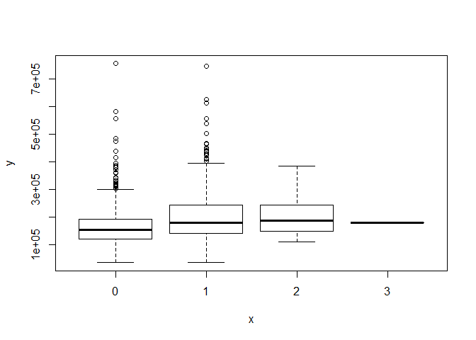

``` r
data$BsmtFullBath<-as.integer(data$BsmtFullBath)

# BsmtHalfBath
table(data$BsmtHalfBath)
```

    ## 
    ##    0    1    2 
    ## 2742  171    4

``` r
data[is.na(data$BsmtHalfBath),]
```

    ##        Id MSSubClass MSZoning LotFrontage LotArea Street Alley LotShape
    ## 2121 2121         20       RM          99    5940   Pave  None      IR1
    ## 2189 2189         20       RL         123   47007   Pave  None      IR1
    ##      LandContour LotConfig LandSlope Neighborhood Condition1 Condition2
    ## 2121         Lvl       FR3       Gtl      BrkSide      Feedr       Norm
    ## 2189         Lvl    Inside       Gtl      Edwards       Norm       Norm
    ##      BldgType HouseStyle OverallQual OverallCond YearBuilt YearRemodAdd
    ## 2121     1Fam     1Story           4           7      1946         1950
    ## 2189     1Fam     1Story           5           7      1959         1996
    ##      RoofStyle RoofMatl Exterior1st Exterior2nd MasVnrType MasVnrArea
    ## 2121     Gable  CompShg     MetalSd      CBlock          0          0
    ## 2189     Gable  CompShg     Plywood     Plywood          0          0
    ##      ExterQual ExterCond Foundation BsmtQual BsmtCond BsmtExposure
    ## 2121        TA        TA      PConc        0        0            0
    ## 2189        TA        TA       Slab        0        0            0
    ##      BsmtFinType1 BsmtFinSF1 BsmtFinType2 BsmtFinSF2 BsmtUnfSF TotalBsmtSF
    ## 2121            0         NA            0         NA        NA          NA
    ## 2189            0          0            0          0         0           0
    ##      Heating HeatingQC CentralAir Electrical X1stFlrSF X2ndFlrSF
    ## 2121    GasA        TA          Y      FuseA       896         0
    ## 2189    GasA        TA          Y      SBrkr      3820         0
    ##      LowQualFinSF GrLivArea BsmtFullBath BsmtHalfBath FullBath HalfBath
    ## 2121            0       896            0           NA        1        0
    ## 2189            0      3820            0           NA        3        1
    ##      BedroomAbvGr KitchenAbvGr KitchenQual TotRmsAbvGrd Functional
    ## 2121            2            1          TA            4        Typ
    ## 2189            5            1          Ex           11        Typ
    ##      Fireplaces FireplaceQu GarageType GarageFinish GarageCars GarageArea
    ## 2121          0           0     Detchd            1          1        280
    ## 2189          2           4     Attchd            1          2        624
    ##      GarageQual PavedDrive WoodDeckSF OpenPorchSF EnclosedPorch X3SsnPorch
    ## 2121          3          Y          0           0             0          0
    ## 2189          3          Y          0         372             0          0
    ##      ScreenPorch PoolArea PoolQC Fence MiscFeature MiscVal MoSold YrSold
    ## 2121           0        0      0 MnPrv        None       0      4   2008
    ## 2189           0        0      0  None        None       0      7   2008
    ##      SaleType SaleCondition SalePrice
    ## 2121    ConLD       Abnorml        NA
    ## 2189       WD        Normal        NA

``` r
paste(colnames(select(data,contains("Bsmt"))),collapse="','")
```

    ## [1] "BsmtQual','BsmtCond','BsmtExposure','BsmtFinType1','BsmtFinSF1','BsmtFinType2','BsmtFinSF2','BsmtUnfSF','TotalBsmtSF','BsmtFullBath','BsmtHalfBath"

``` r
data[is.na(data$BsmtHalfBath),c('BsmtQual','BsmtCond','BsmtExposure','BsmtFinType1','BsmtFinSF1','BsmtFinType2','BsmtFinSF2','BsmtUnfSF','TotalBsmtSF','BsmtFullBath','BsmtHalfBath')]
```

    ##      BsmtQual BsmtCond BsmtExposure BsmtFinType1 BsmtFinSF1 BsmtFinType2
    ## 2121        0        0            0            0         NA            0
    ## 2189        0        0            0            0          0            0
    ##      BsmtFinSF2 BsmtUnfSF TotalBsmtSF BsmtFullBath BsmtHalfBath
    ## 2121         NA        NA          NA            0           NA
    ## 2189          0         0           0            0           NA

``` r
data$BsmtHalfBath[is.na(data$BsmtHalfBath)]<-0
plot(as.factor(data$BsmtHalfBath),data$SalePrice)
```

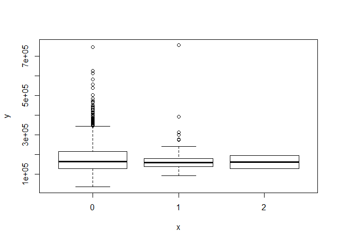

``` r
data$BsmtHalfBath<-as.integer(data$BsmtHalfBath)
#we can see the correlation 
cor(data$BsmtHalfBath,data$BsmtFullBath) #It is not correlated
```

    ## [1] -0.1486548

``` r
# Functional: Home functionality (Assume typical unless deductions are warranted)
table(data$Functional)
```

    ## 
    ## Maj1 Maj2 Min1 Min2  Mod  Sev  Typ 
    ##   19    9   65   70   35    2 2717

``` r
plot(as.factor(data$Functional),data$SalePrice)
```

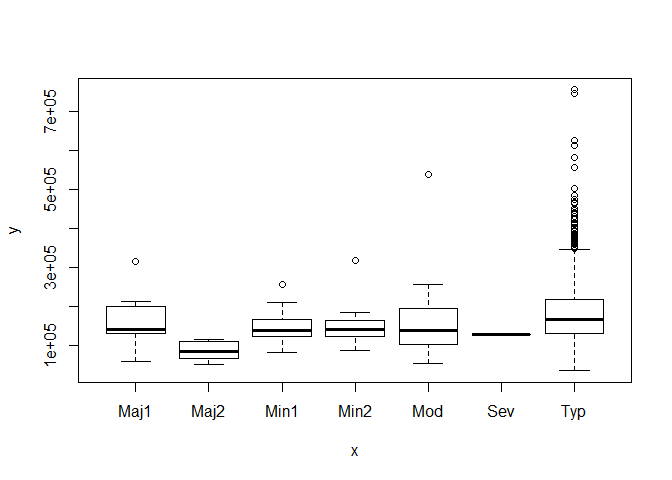

``` r
data[is.na(data$Functional),]
```

    ##        Id MSSubClass MSZoning LotFrontage LotArea Street Alley LotShape
    ## 2217 2217         20       RL          80   14584   Pave  None      Reg
    ## 2474 2474         50       RM          60   10320   Pave  Grvl      Reg
    ##      LandContour LotConfig LandSlope Neighborhood Condition1 Condition2
    ## 2217         Low    Inside       Mod       IDOTRR       Norm       Norm
    ## 2474         Lvl    Corner       Gtl       IDOTRR     Artery       Norm
    ##      BldgType HouseStyle OverallQual OverallCond YearBuilt YearRemodAdd
    ## 2217     1Fam     1Story           1           5      1952         1952
    ## 2474     1Fam     1.5Fin           4           1      1910         1950
    ##      RoofStyle RoofMatl Exterior1st Exterior2nd MasVnrType MasVnrArea
    ## 2217     Gable  CompShg     AsbShng     VinylSd          0          0
    ## 2474     Gable  CompShg     Wd Sdng     Wd Sdng          0          0
    ##      ExterQual ExterCond Foundation BsmtQual BsmtCond BsmtExposure
    ## 2217        Fa        Po       Slab        0        0            0
    ## 2474        Fa        Fa     CBlock        3        2            1
    ##      BsmtFinType1 BsmtFinSF1 BsmtFinType2 BsmtFinSF2 BsmtUnfSF TotalBsmtSF
    ## 2217            0          0            0          0         0           0
    ## 2474            1          0            1          0       771         771
    ##      Heating HeatingQC CentralAir Electrical X1stFlrSF X2ndFlrSF
    ## 2217    Wall        Po          N      FuseA       733         0
    ## 2474    GasA        Fa          Y      SBrkr       866       504
    ##      LowQualFinSF GrLivArea BsmtFullBath BsmtHalfBath FullBath HalfBath
    ## 2217            0       733            0            0        1        0
    ## 2474          114      1484            0            0        2        0
    ##      BedroomAbvGr KitchenAbvGr KitchenQual TotRmsAbvGrd Functional
    ## 2217            2            1          Fa            4       <NA>
    ## 2474            3            1          TA            6       <NA>
    ##      Fireplaces FireplaceQu GarageType GarageFinish GarageCars GarageArea
    ## 2217          0           0     Attchd            1          2        487
    ## 2474          0           0     Detchd            1          1        264
    ##      GarageQual PavedDrive WoodDeckSF OpenPorchSF EnclosedPorch X3SsnPorch
    ## 2217          2          N          0           0             0          0
    ## 2474          3          N         14         211             0          0
    ##      ScreenPorch PoolArea PoolQC Fence MiscFeature MiscVal MoSold YrSold
    ## 2217           0        0      0  None        None       0      2   2008
    ## 2474          84        0      0  None        None       0      9   2007
    ##      SaleType SaleCondition SalePrice
    ## 2217       WD       Abnorml        NA
    ## 2474      COD       Abnorml        NA

``` r
data$Functional[is.na(data$Functional)]<-7
Functional<-c('Sal'=0, 'Sev'=1, 'Maj2'=2, 'Maj1'=3, 'Mod'=4, 'Min2'=5, 'Min1'=6, 'Typ'=7)
data$Functional <- as.integer(revalue(data$Functional, Functional))
```

    ## The following `from` values were not present in `x`: Sal

``` r
table(data$Functional)
```

    ## 
    ##    1    2    3    4    5    6    7 
    ##    2    9   19   35   70   65 2719

``` r
plot(data$Functional,data$SalePrice)
```

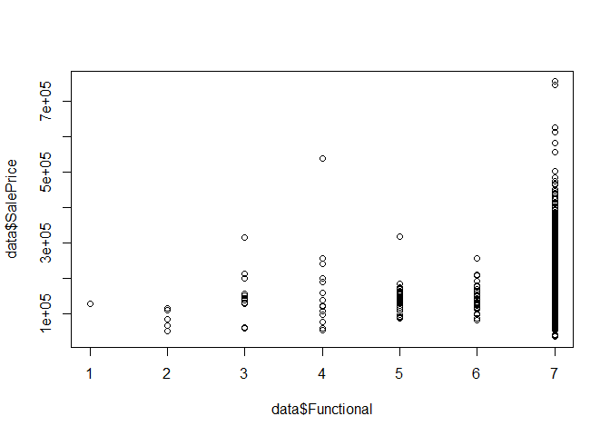

``` r
#GarageCars Size of garage in car capacity  

table(as.factor(data$GarageCars))
```

    ## 
    ##    0    1    2    3    4    5 
    ##  157  776 1594  374   16    1

``` r
plot(as.factor(data$GarageCars))
```

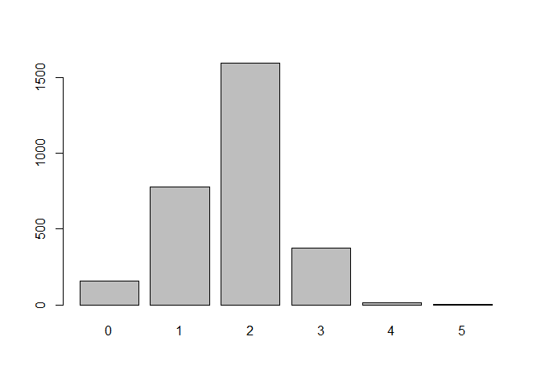

``` r
plot(as.factor(data$GarageCars),data$SalePrice)
```

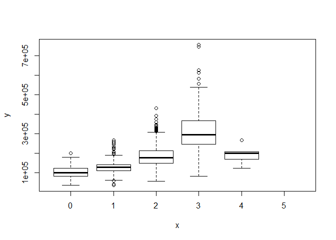

``` r
paste(colnames(select(data,contains("Garage"))),collapse="','")
```

    ## [1] "GarageType','GarageFinish','GarageCars','GarageArea','GarageQual"

``` r
data[is.na(data$GarageCars),c('GarageType','GarageFinish','GarageCars','GarageArea','GarageQual')]
```

    ##      GarageType GarageFinish GarageCars GarageArea GarageQual
    ## 2577     Detchd            0         NA         NA          0

``` r
data$GarageCars[is.na(data$GarageCars)]<-0
data$GarageCars<-as.integer(data$GarageCars)
 


#GarageArea
plot(as.factor(data$GarageArea))
```

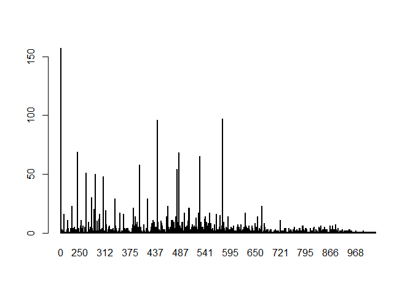

``` r
plot(data$GarageArea,data$SalePrice)
```


``` r
paste(colnames(select(data,contains("Garage"))),collapse="','")
```

    ## [1] "GarageType','GarageFinish','GarageCars','GarageArea','GarageQual"

``` r
data[is.na(data$GarageArea),c('GarageType','GarageFinish','GarageCars','GarageArea','GarageQual')]
```

    ##      GarageType GarageFinish GarageCars GarageArea GarageQual
    ## 2577     Detchd            0          0         NA          0

``` r
data$GarageArea[is.na(data$GarageArea)]<-0
data$GarageArea<-as.integer(data$GarageArea)
plot(data$GarageArea,data$SalePrice)
```

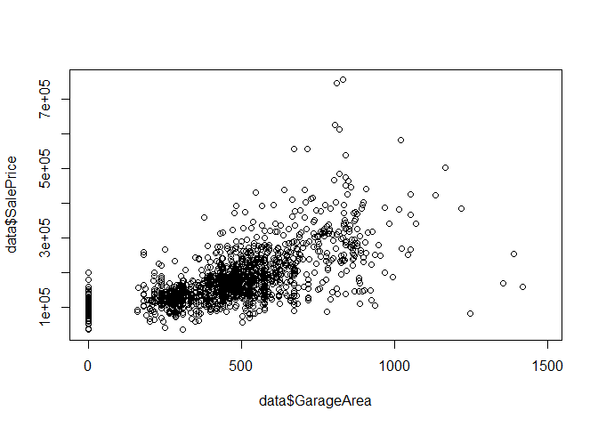

``` r
cor(data[,sapply(data, is.numeric)],data$GarageArea) 
```

    ##                       [,1]
    ## Id            -0.009851054
    ## MSSubClass    -0.103534194
    ## LotFrontage    0.339380131
    ## LotArea        0.213180376
    ## OverallQual    0.565179205
    ## OverallCond   -0.154311762
    ## YearBuilt      0.481328133
    ## YearRemodAdd   0.375892265
    ## MasVnrType     0.368002725
    ## MasVnrArea     0.371071383
    ## BsmtQual       0.422730492
    ## BsmtCond       0.136238741
    ## BsmtExposure   0.280947231
    ## BsmtFinType1   0.235311964
    ## BsmtFinSF1              NA
    ## BsmtFinType2   0.004557102
    ## BsmtFinSF2              NA
    ## BsmtUnfSF               NA
    ## TotalBsmtSF             NA
    ## X1stFlrSF      0.491996421
    ## X2ndFlrSF      0.127463905
    ## LowQualFinSF  -0.053430694
    ## GrLivArea      0.484547335
    ## BsmtFullBath   0.185151379
    ## BsmtHalfBath  -0.021217905
    ## FullBath       0.407519909
    ## HalfBath       0.179396010
    ## BedroomAbvGr   0.073723102
    ## KitchenAbvGr  -0.057647570
    ## TotRmsAbvGrd   0.328627638
    ## Functional     0.068753326
    ## Fireplaces     0.295175204
    ## FireplaceQu    0.342810880
    ## GarageFinish   0.511991097
    ## GarageCars     0.889890224
    ## GarageArea     1.000000000
    ## GarageQual     0.552595491
    ## WoodDeckSF     0.237384942
    ## OpenPorchSF    0.232875830
    ## EnclosedPorch -0.108382360
    ## X3SsnPorch     0.029493114
    ## ScreenPorch    0.062552079
    ## PoolArea       0.053053039
    ## PoolQC         0.063360935
    ## MiscVal        0.008506144
    ## MoSold         0.041181698
    ## YrSold        -0.012986182
    ## SalePrice               NA

``` r
#drop GarageArea and keep GarageCars?
cor(data[1:1459,'SalePrice'],data[1:1459,'GarageArea'])
```

    ## [1] 0.6233849

``` r
cor(data[1:1459,'SalePrice'],data[1:1459,'GarageCars']) 
```

    ## [1] 0.6403833

``` r
#We'll indeed drop the GarageArea variable since it is less corellated with sales Price 
data <- subset(data, select = -GarageArea)


# TotalBsmtSF : Total square feet of basement area
plot(as.factor(data$TotalBsmtSF))
```

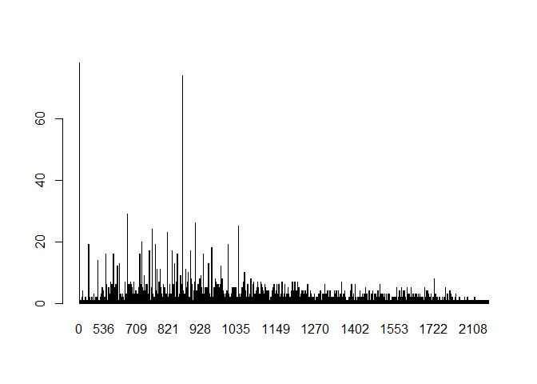

``` r
plot(data$TotalBsmtSF,data$SalePrice)
```

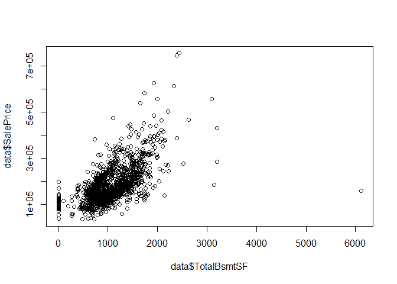

``` r
cor(data[1:1459,'SalePrice'],data[1:1459,'TotalBsmtSF'])
```

    ## [1] 0.6137915

``` r
data$TotalBsmtSF[is.na(data$TotalBsmtSF)]
```

    ## [1] NA

``` r
paste(colnames(select(data,contains("Bsmt"))),collapse="','")
```

    ## [1] "BsmtQual','BsmtCond','BsmtExposure','BsmtFinType1','BsmtFinSF1','BsmtFinType2','BsmtFinSF2','BsmtUnfSF','TotalBsmtSF','BsmtFullBath','BsmtHalfBath"

``` r
data[is.na(data$TotalBsmtSF),c('BsmtQual','BsmtCond','BsmtExposure','BsmtFinType1','BsmtFinSF1','BsmtFinType2','BsmtFinSF2','BsmtUnfSF','TotalBsmtSF','BsmtFullBath','BsmtHalfBath')]
```

    ##      BsmtQual BsmtCond BsmtExposure BsmtFinType1 BsmtFinSF1 BsmtFinType2
    ## 2121        0        0            0            0         NA            0
    ##      BsmtFinSF2 BsmtUnfSF TotalBsmtSF BsmtFullBath BsmtHalfBath
    ## 2121         NA        NA          NA            0            0

``` r
data$TotalBsmtSF[is.na(data$TotalBsmtSF)]<-0

#  BsmtFinSF1    
plot(as.factor(data$BsmtFinSF1))
```

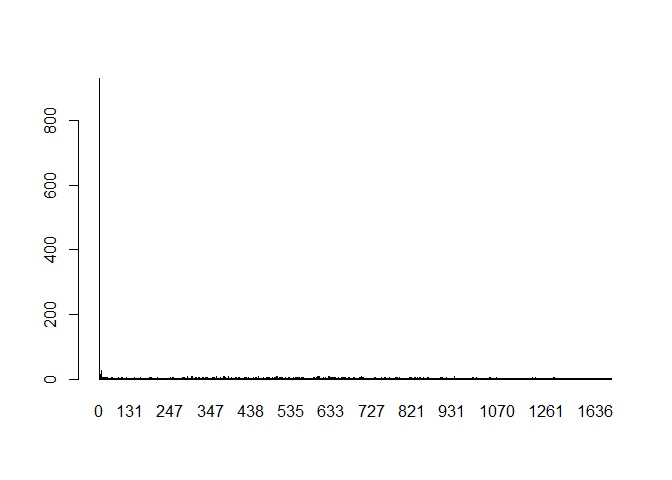

``` r
plot(data$BsmtFinSF1,data$SalePrice)
```

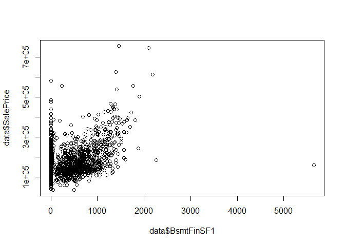

``` r
cor(data[1:1459,'SalePrice'],data[1:1459,'BsmtFinSF1'])
```

    ## [1] 0.3867829

``` r
data$BsmtFinSF1[is.na(data$BsmtFinSF1)]
```

    ## [1] NA

``` r
paste(colnames(select(data,contains("Bsmt"))),collapse="','")
```

    ## [1] "BsmtQual','BsmtCond','BsmtExposure','BsmtFinType1','BsmtFinSF1','BsmtFinType2','BsmtFinSF2','BsmtUnfSF','TotalBsmtSF','BsmtFullBath','BsmtHalfBath"

``` r
data[is.na(data$BsmtFinSF1),c('BsmtQual','BsmtCond','BsmtExposure','BsmtFinType1','BsmtFinSF1','BsmtFinType2','BsmtFinSF2','BsmtUnfSF','TotalBsmtSF','BsmtFullBath','BsmtHalfBath')]
```

    ##      BsmtQual BsmtCond BsmtExposure BsmtFinType1 BsmtFinSF1 BsmtFinType2
    ## 2121        0        0            0            0         NA            0
    ##      BsmtFinSF2 BsmtUnfSF TotalBsmtSF BsmtFullBath BsmtHalfBath
    ## 2121         NA        NA           0            0            0

``` r
data$BsmtFinSF1[is.na(data$BsmtFinSF1)]<-0

#BsmtUnfSF
plot(data$BsmtUnfSF)
```

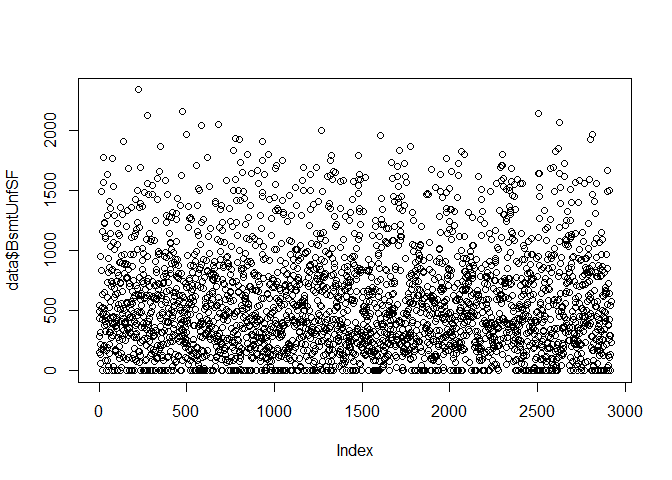

``` r
plot(data$BsmtUnfSF,data$SalePrice)
```


``` r
cor(data[1:1459,'SalePrice'],data[1:1459,'BsmtUnfSF'])
```

    ## [1] 0.2142805

``` r
data$BsmtUnfSF[is.na(data$BsmtUnfSF)]
```

    ## [1] NA

``` r
paste(colnames(select(data,contains("Bsmt"))),collapse="','")
```

    ## [1] "BsmtQual','BsmtCond','BsmtExposure','BsmtFinType1','BsmtFinSF1','BsmtFinType2','BsmtFinSF2','BsmtUnfSF','TotalBsmtSF','BsmtFullBath','BsmtHalfBath"

``` r
data[is.na(data$BsmtUnfSF),c('BsmtQual','BsmtCond','BsmtExposure','BsmtFinType1','BsmtFinSF1','BsmtFinType2','BsmtFinSF2','BsmtUnfSF','TotalBsmtSF','BsmtFullBath','BsmtHalfBath')]
```

    ##      BsmtQual BsmtCond BsmtExposure BsmtFinType1 BsmtFinSF1 BsmtFinType2
    ## 2121        0        0            0            0          0            0
    ##      BsmtFinSF2 BsmtUnfSF TotalBsmtSF BsmtFullBath BsmtHalfBath
    ## 2121         NA        NA           0            0            0

``` r
data$BsmtUnfSF[is.na(data$BsmtUnfSF)]<-0
cor(data$BsmtUnfSF,data$BsmtFinSF2)
```

    ## [1] NA

``` r
#Let's see if it is correlated with another
cor(data$BsmtUnfSF,data[,sapply(data, is.numeric)]) #correlated with BsmtFinSF1
```

    ##               Id MSSubClass LotFrontage    LotArea OverallQual OverallCond
    ## [1,] -0.01479023 -0.1255609   0.1043326 0.02158978   0.2756429  -0.1386875
    ##      YearBuilt YearRemodAdd MasVnrType MasVnrArea  BsmtQual  BsmtCond
    ## [1,] 0.1307862    0.1657697  0.1086214 0.08817341 0.2358125 0.1748441
    ##      BsmtExposure BsmtFinType1 BsmtFinSF1 BsmtFinType2 BsmtFinSF2
    ## [1,]  -0.04344334   -0.3881147 -0.4767712   -0.1902104         NA
    ##      BsmtUnfSF TotalBsmtSF X1stFlrSF     X2ndFlrSF LowQualFinSF GrLivArea
    ## [1,]         1   0.4128104 0.2967876 -3.236541e-05   0.04694399 0.2343882
    ##      BsmtFullBath BsmtHalfBath  FullBath    HalfBath BedroomAbvGr
    ## [1,]   -0.3976477   -0.1068404 0.2735304 -0.03545913    0.1836307
    ##      KitchenAbvGr TotRmsAbvGrd Functional  Fireplaces FireplaceQu
    ## [1,]   0.06505947    0.2480153 0.03766712 0.005216017   0.1097402
    ##      GarageFinish GarageCars   GarageQual  WoodDeckSF OpenPorchSF
    ## [1,]    0.0847243  0.1807326 -0.009866555 -0.03896365   0.1200272
    ##      EnclosedPorch   X3SsnPorch ScreenPorch    PoolArea      PoolQC
    ## [1,]   0.005161546 -0.005763676 -0.04901855 -0.03223645 -0.02994952
    ##          MiscVal     MoSold      YrSold SalePrice
    ## [1,] -0.01045017 0.02295447 -0.03807293        NA

``` r
#BsmtFinSF2     
plot(data$BsmtFinSF2)
```

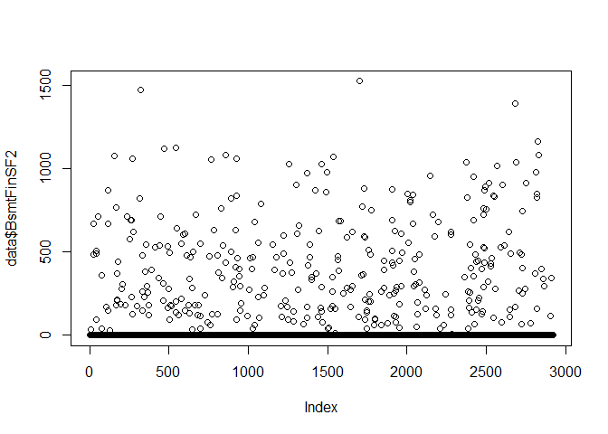

``` r
plot(data$BsmtFinSF2,data$SalePrice)
```


``` r
cor(data[1:1459,'SalePrice'],data[1:1459,'BsmtFinSF2'])
```

    ## [1] -0.01095189

``` r
data$BsmtFinSF2[is.na(data$BsmtFinSF2)]
```

    ## [1] NA

``` r
paste(colnames(select(data,contains("Bsmt"))),collapse="','")
```

    ## [1] "BsmtQual','BsmtCond','BsmtExposure','BsmtFinType1','BsmtFinSF1','BsmtFinType2','BsmtFinSF2','BsmtUnfSF','TotalBsmtSF','BsmtFullBath','BsmtHalfBath"

``` r
data[is.na(data$BsmtFinSF2),c('BsmtQual','BsmtCond','BsmtExposure','BsmtFinType1','BsmtFinSF1','BsmtFinType2','BsmtFinSF2','BsmtUnfSF','TotalBsmtSF','BsmtFullBath','BsmtHalfBath')]
```

    ##      BsmtQual BsmtCond BsmtExposure BsmtFinType1 BsmtFinSF1 BsmtFinType2
    ## 2121        0        0            0            0          0            0
    ##      BsmtFinSF2 BsmtUnfSF TotalBsmtSF BsmtFullBath BsmtHalfBath
    ## 2121         NA         0           0            0            0

``` r
data$BsmtFinSF2[is.na(data$BsmtFinSF2)]<-0
cor(data$BsmtFinSF1,data$BsmtFinSF2)
```

    ## [1] -0.05493841

``` r
#We will probably drop this variable,let's see if it is correlated with another
cor(data$BsmtFinSF2,data[,sapply(data, is.numeric)]) #correlated with BsmtFinType2
```

    ##              Id  MSSubClass LotFrontage    LotArea OverallQual OverallCond
    ## [1,] 0.01817004 -0.07243126  0.04125594 0.08410715  -0.0426052  0.04135923
    ##        YearBuilt YearRemodAdd  MasVnrType  MasVnrArea    BsmtQual
    ## [1,] -0.02750704  -0.06195898 -0.02374806 -0.01457983 -0.01267815
    ##        BsmtCond BsmtExposure BsmtFinType1  BsmtFinSF1 BsmtFinType2
    ## [1,] 0.07567332    0.1025202   0.02628983 -0.05493841    0.7992987
    ##      BsmtFinSF2  BsmtUnfSF TotalBsmtSF  X1stFlrSF   X2ndFlrSF LowQualFinSF
    ## [1,]          1 -0.2380433  0.08956092 0.08438942 -0.09765352  -0.00491318
    ##        GrLivArea BsmtFullBath BsmtHalfBath    FullBath    HalfBath
    ## [1,] -0.01774713    0.1629569   0.09953007 -0.07531358 -0.03236835
    ##      BedroomAbvGr KitchenAbvGr TotRmsAbvGrd  Functional Fireplaces
    ## [1,]   -0.0311113   -0.0377576  -0.04824545 -0.06372228 0.06570734
    ##      FireplaceQu GarageFinish  GarageCars GarageQual WoodDeckSF
    ## [1,] 0.004498087  0.009004049 -0.01447615 0.06432276  0.0984622
    ##       OpenPorchSF EnclosedPorch  X3SsnPorch ScreenPorch   PoolArea
    ## [1,] -0.005804508    0.03277453 -0.02326797  0.06332908 0.04452989
    ##          PoolQC      MiscVal     MoSold      YrSold SalePrice
    ## [1,] 0.02187298 -0.005129682 -0.0095096 0.008866935        NA

``` r
#We'll probably drop these 2 basement variables
#Now we see the correlations between basement variables

paste(colnames(select(data,contains("Bsmt"))),collapse="','")
```

    ## [1] "BsmtQual','BsmtCond','BsmtExposure','BsmtFinType1','BsmtFinSF1','BsmtFinType2','BsmtFinSF2','BsmtUnfSF','TotalBsmtSF','BsmtFullBath','BsmtHalfBath"

``` r
cor(data[,c('BsmtQual','BsmtCond','BsmtExposure','BsmtFinType1','BsmtFinSF1','BsmtFinType2','BsmtFinSF2','BsmtUnfSF','TotalBsmtSF','BsmtFullBath','BsmtHalfBath')])
```

    ##                  BsmtQual   BsmtCond BsmtExposure BsmtFinType1
    ## BsmtQual      1.000000000 0.62515749   0.43626210   0.41987055
    ## BsmtCond      0.625157488 1.00000000   0.26430401   0.30704435
    ## BsmtExposure  0.436262102 0.26430401   1.00000000   0.36706771
    ## BsmtFinType1  0.419870554 0.30704435   0.36706771   1.00000000
    ## BsmtFinSF1    0.337365829 0.16986992   0.39857979   0.70298124
    ## BsmtFinType2  0.101212924 0.22661106   0.13262795   0.09950210
    ## BsmtFinSF2   -0.012678151 0.07567332   0.10252021   0.02628983
    ## BsmtUnfSF     0.235812550 0.17484410  -0.04344334  -0.38811470
    ## TotalBsmtSF   0.578576765 0.37870825   0.40769434   0.34937955
    ## BsmtFullBath  0.259072937 0.16954774   0.33859998   0.58455430
    ## BsmtHalfBath -0.006908995 0.04755341   0.08910495   0.08452306
    ##                BsmtFinSF1 BsmtFinType2  BsmtFinSF2   BsmtUnfSF TotalBsmtSF
    ## BsmtQual      0.337365829  0.101212924 -0.01267815  0.23581255  0.57857677
    ## BsmtCond      0.169869918  0.226611061  0.07567332  0.17484410  0.37870825
    ## BsmtExposure  0.398579791  0.132627953  0.10252021 -0.04344334  0.40769434
    ## BsmtFinType1  0.702981238  0.099502102  0.02628983 -0.38811470  0.34937955
    ## BsmtFinSF1    1.000000000 -0.008849972 -0.05493841 -0.47677116  0.53665002
    ## BsmtFinType2 -0.008849972  1.000000000  0.79929873 -0.19021038  0.10785668
    ## BsmtFinSF2   -0.054938405  0.799298733  1.00000000 -0.23804333  0.08956092
    ## BsmtUnfSF    -0.476771163 -0.190210384 -0.23804333  1.00000000  0.41281039
    ## TotalBsmtSF   0.536650022  0.107856678  0.08956092  0.41281039  1.00000000
    ## BsmtFullBath  0.639038348  0.187877971  0.16295695 -0.39764765  0.32625176
    ## BsmtHalfBath  0.078500167  0.109564023  0.09953007 -0.10684037  0.01277996
    ##              BsmtFullBath BsmtHalfBath
    ## BsmtQual        0.2590729 -0.006908995
    ## BsmtCond        0.1695477  0.047553407
    ## BsmtExposure    0.3386000  0.089104955
    ## BsmtFinType1    0.5845543  0.084523061
    ## BsmtFinSF1      0.6390383  0.078500167
    ## BsmtFinType2    0.1878780  0.109564023
    ## BsmtFinSF2      0.1629569  0.099530071
    ## BsmtUnfSF      -0.3976477 -0.106840367
    ## TotalBsmtSF     0.3262518  0.012779965
    ## BsmtFullBath    1.0000000 -0.148654812
    ## BsmtHalfBath   -0.1486548  1.000000000

``` r
corrplot(cor(data[,c('BsmtQual','BsmtCond','BsmtExposure','BsmtFinType1','BsmtFinSF1','BsmtFinType2','BsmtFinSF2','BsmtUnfSF','TotalBsmtSF','BsmtFullBath','BsmtHalfBath')])
,method = "square")
```

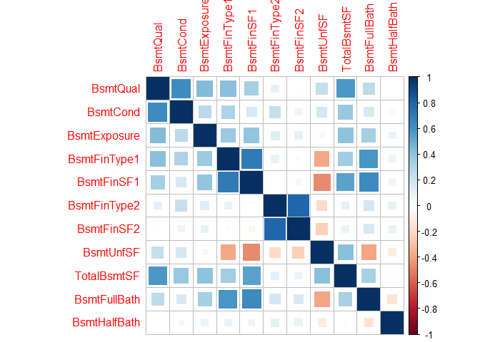

``` r
#we drop the variables BsmtFinSF1 and BsmtFinSF2
data <- subset(data, select = -BsmtFinSF1)
data <- subset(data, select = -BsmtFinSF2)
#check again
corrplot(cor(data[,c('BsmtQual','BsmtCond','BsmtExposure','BsmtFinType1','BsmtFinType2','BsmtUnfSF','TotalBsmtSF','BsmtFullBath','BsmtHalfBath')]),method='square')
```

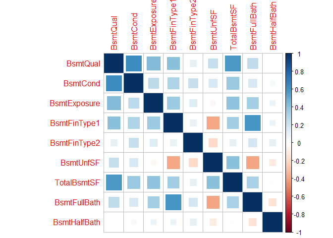

``` r
data <- subset(data, select = -TotalBsmtSF)   #MAYBE NOT THIS VARIABLE?     
corrplot(cor(data[,c('BsmtQual','BsmtCond','BsmtExposure','BsmtFinType1','BsmtFinType2','BsmtUnfSF','BsmtFullBath','BsmtHalfBath')]),method='square')
```

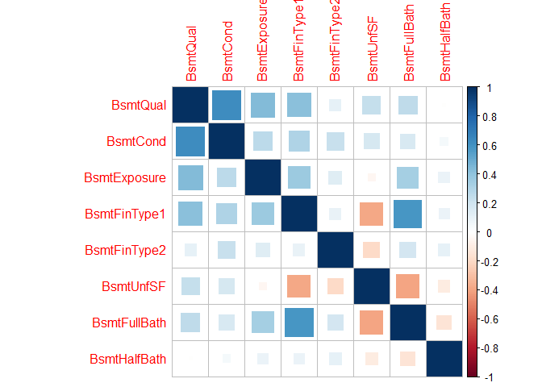

``` r
################################################################################

#Now that we have taken care of Na's let's see what the numeric variables are
colnames(data[,sapply(data, is.numeric)]) #check out which columns are numeric 
```

    ##  [1] "Id"            "MSSubClass"    "LotFrontage"   "LotArea"      
    ##  [5] "OverallQual"   "OverallCond"   "YearBuilt"     "YearRemodAdd" 
    ##  [9] "MasVnrType"    "MasVnrArea"    "BsmtQual"      "BsmtCond"     
    ## [13] "BsmtExposure"  "BsmtFinType1"  "BsmtFinType2"  "BsmtUnfSF"    
    ## [17] "X1stFlrSF"     "X2ndFlrSF"     "LowQualFinSF"  "GrLivArea"    
    ## [21] "BsmtFullBath"  "BsmtHalfBath"  "FullBath"      "HalfBath"     
    ## [25] "BedroomAbvGr"  "KitchenAbvGr"  "TotRmsAbvGrd"  "Functional"   
    ## [29] "Fireplaces"    "FireplaceQu"   "GarageFinish"  "GarageCars"   
    ## [33] "GarageQual"    "WoodDeckSF"    "OpenPorchSF"   "EnclosedPorch"
    ## [37] "X3SsnPorch"    "ScreenPorch"   "PoolArea"      "PoolQC"       
    ## [41] "MiscVal"       "MoSold"        "YrSold"        "SalePrice"

``` r
#But first let's see some correlations
corrplot(cor(na.omit(data[,sapply(data, is.numeric)])),method = "square")
```

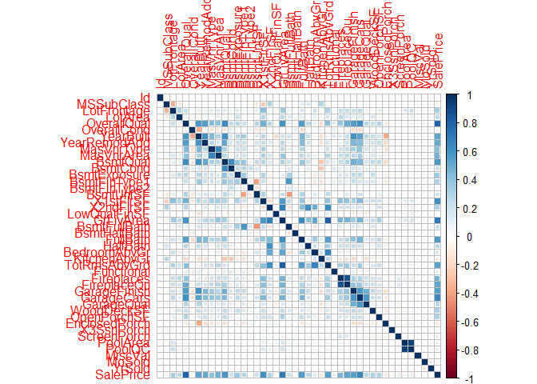

``` r
paste(which(cor(data[1:1459,sapply(data, is.numeric)],data[1:1459,'SalePrice'])>0.5 | cor(data[1:1459,sapply(data, is.numeric)],data[1:1459,'SalePrice'])<(-0.5)),collapse=',')
```

    ## [1] "5,7,8,11,17,20,23,27,30,31,32,44"

``` r
colnames(data[,sapply(data, is.numeric)][c(5,7,8,11,17,20,23,27,30,31,32,44)])
```

    ##  [1] "OverallQual"  "YearBuilt"    "YearRemodAdd" "BsmtQual"    
    ##  [5] "X1stFlrSF"    "GrLivArea"    "FullBath"     "TotRmsAbvGrd"
    ##  [9] "FireplaceQu"  "GarageFinish" "GarageCars"   "SalePrice"

``` r
#So these are the variables that have the highest correlation with the Saleprice variable.
#We will examine these further.

#Id
#We will get rid of the Id column and keep it in a vector called Id
Id<-data$Id[1461:nrow(data)]
data <- data[,-1]


#MSSubClass: Identifies the type of dwelling involved in the sale.
plot(data$MSSubClass,data$SalePrice)
```

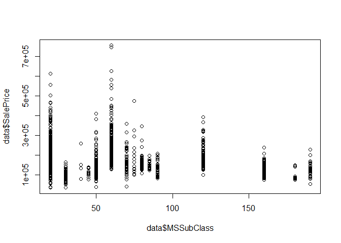

``` r
#In reality this is a factor and not numeric.
table(as.factor(data$MSSubClass))
```

    ## 
    ##   20   30   40   45   50   60   70   75   80   85   90  120  150  160  180 
    ## 1079  139    6   18  287  575  128   23  118   48  109  182    1  128   17 
    ##  190 
    ##   61

``` r
data$MSSubClass<-as.factor(data$MSSubClass)


#OverallQual: Rates the overall material and finish of the house
table(as.factor(data$OverallQual))
```

    ## 
    ##   1   2   3   4   5   6   7   8   9  10 
    ##   4  13  40 226 825 731 600 342 107  31

``` r
plot(as.factor(data$OverallQual),data$SalePrice)
```

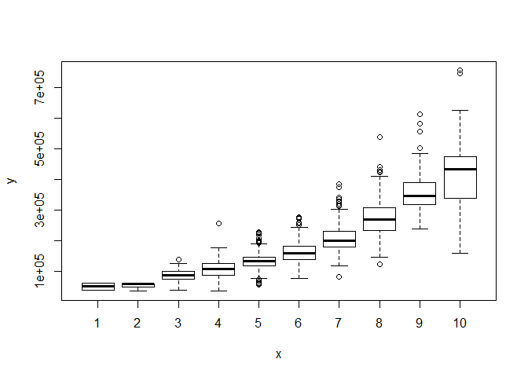

``` r
data$OverallQual<-as.integer(data$OverallQual)
table(data$OverallQual)
```

    ## 
    ##   1   2   3   4   5   6   7   8   9  10 
    ##   4  13  40 226 825 731 600 342 107  31

``` r
#OverallCond: Rates the overall condition of the house
table(as.factor(data$OverallCond))
```

    ## 
    ##    1    2    3    4    5    6    7    8    9 
    ##    7   10   50  101 1645  531  390  144   41

``` r
plot(as.factor(data$OverallCond),data$SalePrice)
```

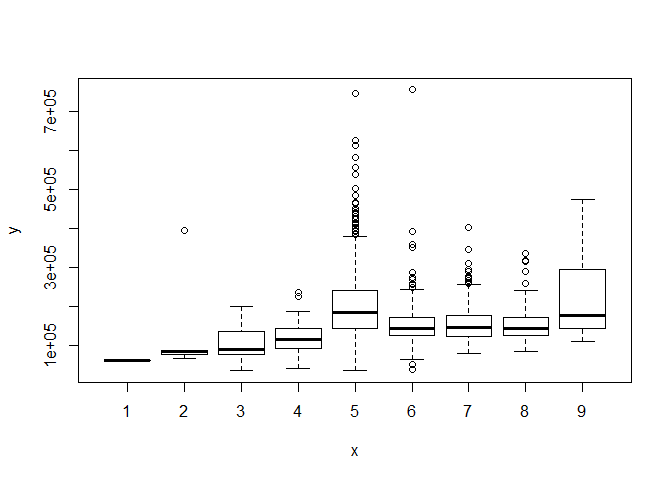

``` r
data$OverallCond<-as.integer(data$OverallCond)
table(data$OverallCond)
```

    ## 
    ##    1    2    3    4    5    6    7    8    9 
    ##    7   10   50  101 1645  531  390  144   41

``` r
#YearBuilt: Original construction date
plot(as.factor(data$YearBuilt))
```

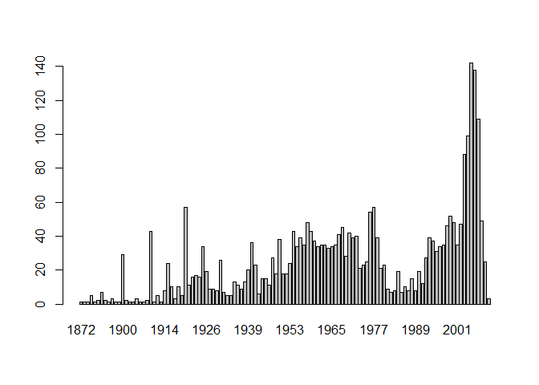

``` r
table(as.factor(data$YearBuilt))
```

    ## 
    ## 1872 1875 1879 1880 1882 1885 1890 1892 1893 1895 1896 1898 1900 1901 1902 
    ##    1    1    1    5    1    2    7    2    1    3    1    1   29    2    1 
    ## 1904 1905 1906 1907 1908 1910 1911 1912 1913 1914 1915 1916 1917 1918 1919 
    ##    1    3    1    1    2   43    1    5    1    8   24   10    3   10    5 
    ## 1920 1921 1922 1923 1924 1925 1926 1927 1928 1929 1930 1931 1932 1934 1935 
    ##   57   11   16   17   16   34   19    9    9    8   26    7    5    5   13 
    ## 1936 1937 1938 1939 1940 1941 1942 1945 1946 1947 1948 1949 1950 1951 1952 
    ##   11    9   13   20   36   23    6   15   15   11   27   18   38   18   18 
    ## 1953 1954 1955 1956 1957 1958 1959 1960 1961 1962 1963 1964 1965 1966 1967 
    ##   24   43   34   39   35   48   43   37   34   35   35   33   34   35   41 
    ## 1968 1969 1970 1971 1972 1973 1974 1975 1976 1977 1978 1979 1980 1981 1982 
    ##   45   28   42   39   40   21   23   25   54   57   39   21   23    9    7 
    ## 1983 1984 1985 1986 1987 1988 1989 1990 1991 1992 1993 1994 1995 1996 1997 
    ##    8   19    7   10    8   15    8   19   12   27   39   37   31   34   35 
    ## 1998 1999 2000 2001 2002 2003 2004 2005 2006 2007 2008 2009 2010 
    ##   46   52   48   35   47   88   99  142  138  109   49   25    3

``` r
plot(as.factor(data$YearBuilt),data$SalePrice)
```


``` r
cor(data[1:1459,'SalePrice'],data[1:1459,'YearBuilt'])
```

    ## [1] 0.5228769

``` r
# YearRemodAdd: Remodel date (same as construction date if no remodeling or additions)
plot(as.factor(data$YearRemodAdd))
```

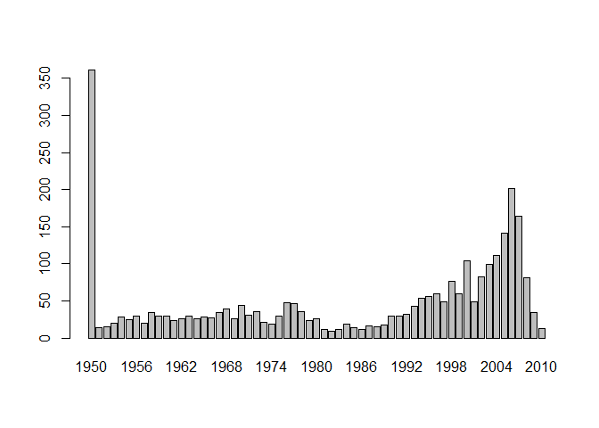

``` r
table(as.factor(data$YearRemodAdd))
```

    ## 
    ## 1950 1951 1952 1953 1954 1955 1956 1957 1958 1959 1960 1961 1962 1963 1964 
    ##  361   14   15   20   28   25   30   20   34   30   29   24   26   30   26 
    ## 1965 1966 1967 1968 1969 1970 1971 1972 1973 1974 1975 1976 1977 1978 1979 
    ##   28   27   34   39   26   44   31   35   21   19   30   48   46   36   24 
    ## 1980 1981 1982 1983 1984 1985 1986 1987 1988 1989 1990 1991 1992 1993 1994 
    ##   26   12    9   11   19   14   12   16   15   18   29   29   32   43   53 
    ## 1995 1996 1997 1998 1999 2000 2001 2002 2003 2004 2005 2006 2007 2008 2009 
    ##   56   59   49   77   60  104   49   82   99  111  141  202  164   81   34 
    ## 2010 
    ##   13

``` r
plot(as.factor(data$YearRemodAdd),data$SalePrice)
```


``` r
plot(data$YearRemodAdd,data$YearBuilt)
```


``` r
#We can see from the plot that all remodelings started on 1950. Is it true or there is some error?
cor(data$YearRemodAdd>1950,data$YearBuilt>1950) #Highly correlated with Yearbuilt
```

    ## [1] 0.6882729

``` r
# X1stFlrSF"  
# GrLivArea"   
# FullBath"   
# TotRmsAbvGrd" 
# FireplaceQu" 
# GarageFinish"
 
 
 
 
 
#Pool Area
table(data$PoolArea) #we'll drop this variable
```

    ## 
    ##    0  144  228  368  444  480  512  519  555  561  576  648  738  800 
    ## 2906    1    1    1    1    1    1    1    1    1    1    1    1    1

``` r
data <- subset(data, select = -c(PoolArea))

#PoolQC
table(data$PoolQC) #we'll drop this variable
```

    ## 
    ##    0    2    4    5 
    ## 2909    2    4    4

``` r
data <- subset(data, select = -c(PoolQC))


################################################################################
colnames(data[,sapply(data, is.character)]) #check out which columns are character
```

    ##  [1] "Street"        "LotShape"      "LandContour"   "LotConfig"    
    ##  [5] "LandSlope"     "Neighborhood"  "Condition1"    "Condition2"   
    ##  [9] "BldgType"      "HouseStyle"    "RoofStyle"     "RoofMatl"     
    ## [13] "Exterior1st"   "Exterior2nd"   "ExterQual"     "ExterCond"    
    ## [17] "Foundation"    "Heating"       "HeatingQC"     "CentralAir"   
    ## [21] "Electrical"    "KitchenQual"   "PavedDrive"    "SaleType"     
    ## [25] "SaleCondition"

``` r
#Street: Type of road access to property 
plot(as.factor(data$Street))
```

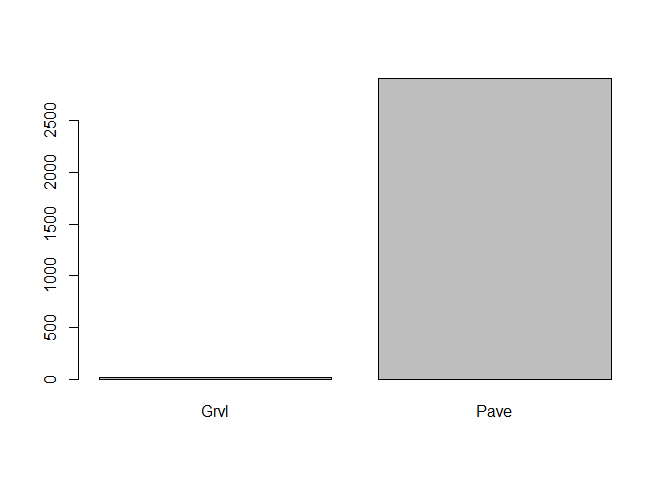

``` r
table(data$Street)
```

    ## 
    ## Grvl Pave 
    ##   12 2907

``` r
#Only 12 Gravels      
#removing Street variable 
data <- subset(data, select = -Street)
```

library(caret) library(glmnet) my\_control \<-trainControl(method=“cv”,
number=5) lassoGrid \<- expand.grid(alpha = 1, lambda = seq(0.001,0.1,by
= 0.0005))

lasso\_mod \<- train(x=train,
y=data*S**a**l**e**P**r**i**c**e*\[!*i**s*.*n**a*(*d**a**t**a*SalePrice)\],
method=‘glmnet’, trControl= my\_control, tuneGrid=lassoGrid)
lasso\_mod$bestTune

################################################################################## 

\#scale all variables except saleprice \#change it ,make a vector
salePrice datanew\<-data datanew\<-data\[,-ncol(data)\]

datanew\[,sapply(datanew,
is.numeric)\]\<-scale(datanew\[,sapply(datanew, is.numeric)\])

paste(colnames(data), collapse =“+”,sep=" ")
datanew*S**a**l**e**P**r**i**c**e* \<  − *d**a**t**a*SalePrice

train\<-datanew\[1:1460,\] test\<-datanew\[1461:nrow(datanew),\]

fit\<-step(lm(SalePrice\~MSSubClass+MSZoning+LotFrontage+LotArea+Alley+LotShape+LandContour+LotConfig+LandSlope+Neighborhood+Condition1+Condition2+BldgType+HouseStyle+OverallQual+OverallCond+YearBuilt+YearRemodAdd+RoofStyle+RoofMatl+Exterior1st+Exterior2nd+MasVnrType+MasVnrArea+ExterQual+ExterCond+Foundation+BsmtQual+BsmtCond+BsmtExposure+BsmtFinType1+BsmtFinType2+BsmtUnfSF+Heating+HeatingQC+CentralAir+Electrical+X1stFlrSF+X2ndFlrSF+LowQualFinSF+GrLivArea+BsmtFullBath+BsmtHalfBath+FullBath+HalfBath+BedroomAbvGr+KitchenAbvGr+KitchenQual+TotRmsAbvGrd+Functional+Fireplaces+FireplaceQu+GarageType+GarageFinish+GarageCars+GarageQual+PavedDrive+WoodDeckSF+OpenPorchSF+EnclosedPorch+X3SsnPorch+ScreenPorch+Fence+MiscFeature+MiscVal+MoSold+YrSold+SaleType+SaleCondition,
data=na.omit(train)),direction = “both”)  
summary(fit) test$SalePrice\<-predict(fit,test)
df\<-data.frame(Id,test\[,“SalePrice”\])

which(is.na(df)) colnames(df)\<-c(“Id”,“SalePrice”)

which(is.na(df)) \#But we have 2 NA’s (further investigate for now use
mean) for(i in 1:2){ df\[is.na(df\[,i\]), i\] \<- mean(df\[,i\], na.rm =
TRUE) } write.csv(df,“C:/Users/User/Desktop/Άγγελος/R/Data
analysis/House
prices/house-prices-advanced-regression-techniques\\submission.csv”,
row.names = FALSE) getwd()

\`\`\`
