First, we will load the libraries we need

``` r
library(plyr)
library(dplyr)
```

Then we load the data, the train and the test set seperately

``` r
setwd("C:/Users/User/Desktop/Άγγελος/R/Data analysis/House prices/house-prices-advanced-regression-techniques")
train<-read.csv("train.csv",stringsAsFactors = FALSE)
test<-read.csv("test.csv",header=TRUE,stringsAsFactors = FALSE)
```

We can add the SalePrice variable in the test set as NA

``` r
test$SalePrice<-NA
```

Now we combine the test and train set

``` r
data<-rbind(train,test)
```

Let’s explore SalePrice variable, which is the one we want to predict

``` r
summary(data$SalePrice) #we can see that the median for the sales price is 163000
```

    ##    Min. 1st Qu.  Median    Mean 3rd Qu.    Max.    NA's 
    ##   34900  129975  163000  180921  214000  755000    1459

``` r
data$SalePrice<-as.numeric(data$SalePrice) #Change to numeric
hist(data$SalePrice,breaks=30) #we can see a slightly skewed distribution to the right
```

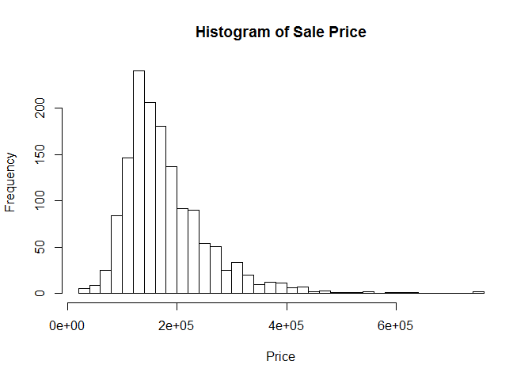

We check for missing values

``` r
str(data)
```

    ## 'data.frame':    2919 obs. of  81 variables:
    ##  $ Id           : int  1 2 3 4 5 6 7 8 9 10 ...
    ##  $ MSSubClass   : int  60 20 60 70 60 50 20 60 50 190 ...
    ##  $ MSZoning     : chr  "RL" "RL" "RL" "RL" ...
    ##  $ LotFrontage  : int  65 80 68 60 84 85 75 NA 51 50 ...
    ##  $ LotArea      : int  8450 9600 11250 9550 14260 14115 10084 10382 6120 7420 ...
    ##  $ Street       : chr  "Pave" "Pave" "Pave" "Pave" ...
    ##  $ Alley        : chr  NA NA NA NA ...
    ##  $ LotShape     : chr  "Reg" "Reg" "IR1" "IR1" ...
    ##  $ LandContour  : chr  "Lvl" "Lvl" "Lvl" "Lvl" ...
    ##  $ Utilities    : chr  "AllPub" "AllPub" "AllPub" "AllPub" ...
    ##  $ LotConfig    : chr  "Inside" "FR2" "Inside" "Corner" ...
    ##  $ LandSlope    : chr  "Gtl" "Gtl" "Gtl" "Gtl" ...
    ##  $ Neighborhood : chr  "CollgCr" "Veenker" "CollgCr" "Crawfor" ...
    ##  $ Condition1   : chr  "Norm" "Feedr" "Norm" "Norm" ...
    ##  $ Condition2   : chr  "Norm" "Norm" "Norm" "Norm" ...
    ##  $ BldgType     : chr  "1Fam" "1Fam" "1Fam" "1Fam" ...
    ##  $ HouseStyle   : chr  "2Story" "1Story" "2Story" "2Story" ...
    ##  $ OverallQual  : int  7 6 7 7 8 5 8 7 7 5 ...
    ##  $ OverallCond  : int  5 8 5 5 5 5 5 6 5 6 ...
    ##  $ YearBuilt    : int  2003 1976 2001 1915 2000 1993 2004 1973 1931 1939 ...
    ##  $ YearRemodAdd : int  2003 1976 2002 1970 2000 1995 2005 1973 1950 1950 ...
    ##  $ RoofStyle    : chr  "Gable" "Gable" "Gable" "Gable" ...
    ##  $ RoofMatl     : chr  "CompShg" "CompShg" "CompShg" "CompShg" ...
    ##  $ Exterior1st  : chr  "VinylSd" "MetalSd" "VinylSd" "Wd Sdng" ...
    ##  $ Exterior2nd  : chr  "VinylSd" "MetalSd" "VinylSd" "Wd Shng" ...
    ##  $ MasVnrType   : chr  "BrkFace" "None" "BrkFace" "None" ...
    ##  $ MasVnrArea   : int  196 0 162 0 350 0 186 240 0 0 ...
    ##  $ ExterQual    : chr  "Gd" "TA" "Gd" "TA" ...
    ##  $ ExterCond    : chr  "TA" "TA" "TA" "TA" ...
    ##  $ Foundation   : chr  "PConc" "CBlock" "PConc" "BrkTil" ...
    ##  $ BsmtQual     : chr  "Gd" "Gd" "Gd" "TA" ...
    ##  $ BsmtCond     : chr  "TA" "TA" "TA" "Gd" ...
    ##  $ BsmtExposure : chr  "No" "Gd" "Mn" "No" ...
    ##  $ BsmtFinType1 : chr  "GLQ" "ALQ" "GLQ" "ALQ" ...
    ##  $ BsmtFinSF1   : int  706 978 486 216 655 732 1369 859 0 851 ...
    ##  $ BsmtFinType2 : chr  "Unf" "Unf" "Unf" "Unf" ...
    ##  $ BsmtFinSF2   : int  0 0 0 0 0 0 0 32 0 0 ...
    ##  $ BsmtUnfSF    : int  150 284 434 540 490 64 317 216 952 140 ...
    ##  $ TotalBsmtSF  : int  856 1262 920 756 1145 796 1686 1107 952 991 ...
    ##  $ Heating      : chr  "GasA" "GasA" "GasA" "GasA" ...
    ##  $ HeatingQC    : chr  "Ex" "Ex" "Ex" "Gd" ...
    ##  $ CentralAir   : chr  "Y" "Y" "Y" "Y" ...
    ##  $ Electrical   : chr  "SBrkr" "SBrkr" "SBrkr" "SBrkr" ...
    ##  $ X1stFlrSF    : int  856 1262 920 961 1145 796 1694 1107 1022 1077 ...
    ##  $ X2ndFlrSF    : int  854 0 866 756 1053 566 0 983 752 0 ...
    ##  $ LowQualFinSF : int  0 0 0 0 0 0 0 0 0 0 ...
    ##  $ GrLivArea    : int  1710 1262 1786 1717 2198 1362 1694 2090 1774 1077 ...
    ##  $ BsmtFullBath : int  1 0 1 1 1 1 1 1 0 1 ...
    ##  $ BsmtHalfBath : int  0 1 0 0 0 0 0 0 0 0 ...
    ##  $ FullBath     : int  2 2 2 1 2 1 2 2 2 1 ...
    ##  $ HalfBath     : int  1 0 1 0 1 1 0 1 0 0 ...
    ##  $ BedroomAbvGr : int  3 3 3 3 4 1 3 3 2 2 ...
    ##  $ KitchenAbvGr : int  1 1 1 1 1 1 1 1 2 2 ...
    ##  $ KitchenQual  : chr  "Gd" "TA" "Gd" "Gd" ...
    ##  $ TotRmsAbvGrd : int  8 6 6 7 9 5 7 7 8 5 ...
    ##  $ Functional   : chr  "Typ" "Typ" "Typ" "Typ" ...
    ##  $ Fireplaces   : int  0 1 1 1 1 0 1 2 2 2 ...
    ##  $ FireplaceQu  : chr  NA "TA" "TA" "Gd" ...
    ##  $ GarageType   : chr  "Attchd" "Attchd" "Attchd" "Detchd" ...
    ##  $ GarageYrBlt  : int  2003 1976 2001 1998 2000 1993 2004 1973 1931 1939 ...
    ##  $ GarageFinish : chr  "RFn" "RFn" "RFn" "Unf" ...
    ##  $ GarageCars   : int  2 2 2 3 3 2 2 2 2 1 ...
    ##  $ GarageArea   : int  548 460 608 642 836 480 636 484 468 205 ...
    ##  $ GarageQual   : chr  "TA" "TA" "TA" "TA" ...
    ##  $ GarageCond   : chr  "TA" "TA" "TA" "TA" ...
    ##  $ PavedDrive   : chr  "Y" "Y" "Y" "Y" ...
    ##  $ WoodDeckSF   : int  0 298 0 0 192 40 255 235 90 0 ...
    ##  $ OpenPorchSF  : int  61 0 42 35 84 30 57 204 0 4 ...
    ##  $ EnclosedPorch: int  0 0 0 272 0 0 0 228 205 0 ...
    ##  $ X3SsnPorch   : int  0 0 0 0 0 320 0 0 0 0 ...
    ##  $ ScreenPorch  : int  0 0 0 0 0 0 0 0 0 0 ...
    ##  $ PoolArea     : int  0 0 0 0 0 0 0 0 0 0 ...
    ##  $ PoolQC       : chr  NA NA NA NA ...
    ##  $ Fence        : chr  NA NA NA NA ...
    ##  $ MiscFeature  : chr  NA NA NA NA ...
    ##  $ MiscVal      : int  0 0 0 0 0 700 0 350 0 0 ...
    ##  $ MoSold       : int  2 5 9 2 12 10 8 11 4 1 ...
    ##  $ YrSold       : int  2008 2007 2008 2006 2008 2009 2007 2009 2008 2008 ...
    ##  $ SaleType     : chr  "WD" "WD" "WD" "WD" ...
    ##  $ SaleCondition: chr  "Normal" "Normal" "Normal" "Abnorml" ...
    ##  $ SalePrice    : num  208500 181500 223500 140000 250000 ...

``` r
sort(sapply(data, function(x) sum(is.na(x))),decreasing=TRUE)
```

    ##        PoolQC   MiscFeature         Alley         Fence     SalePrice 
    ##          2909          2814          2721          2348          1459 
    ##   FireplaceQu   LotFrontage   GarageYrBlt  GarageFinish    GarageQual 
    ##          1420           486           159           159           159 
    ##    GarageCond    GarageType      BsmtCond  BsmtExposure      BsmtQual 
    ##           159           157            82            82            81 
    ##  BsmtFinType2  BsmtFinType1    MasVnrType    MasVnrArea      MSZoning 
    ##            80            79            24            23             4 
    ##     Utilities  BsmtFullBath  BsmtHalfBath    Functional   Exterior1st 
    ##             2             2             2             2             1 
    ##   Exterior2nd    BsmtFinSF1    BsmtFinSF2     BsmtUnfSF   TotalBsmtSF 
    ##             1             1             1             1             1 
    ##    Electrical   KitchenQual    GarageCars    GarageArea      SaleType 
    ##             1             1             1             1             1 
    ##            Id    MSSubClass       LotArea        Street      LotShape 
    ##             0             0             0             0             0 
    ##   LandContour     LotConfig     LandSlope  Neighborhood    Condition1 
    ##             0             0             0             0             0 
    ##    Condition2      BldgType    HouseStyle   OverallQual   OverallCond 
    ##             0             0             0             0             0 
    ##     YearBuilt  YearRemodAdd     RoofStyle      RoofMatl     ExterQual 
    ##             0             0             0             0             0 
    ##     ExterCond    Foundation       Heating     HeatingQC    CentralAir 
    ##             0             0             0             0             0 
    ##     X1stFlrSF     X2ndFlrSF  LowQualFinSF     GrLivArea      FullBath 
    ##             0             0             0             0             0 
    ##      HalfBath  BedroomAbvGr  KitchenAbvGr  TotRmsAbvGrd    Fireplaces 
    ##             0             0             0             0             0 
    ##    PavedDrive    WoodDeckSF   OpenPorchSF EnclosedPorch    X3SsnPorch 
    ##             0             0             0             0             0 
    ##   ScreenPorch      PoolArea       MiscVal        MoSold        YrSold 
    ##             0             0             0             0             0 
    ## SaleCondition 
    ##             0

``` r
plot(sort(sapply(data, function(x) sum(is.na(x))),decreasing=TRUE),type='h')
```

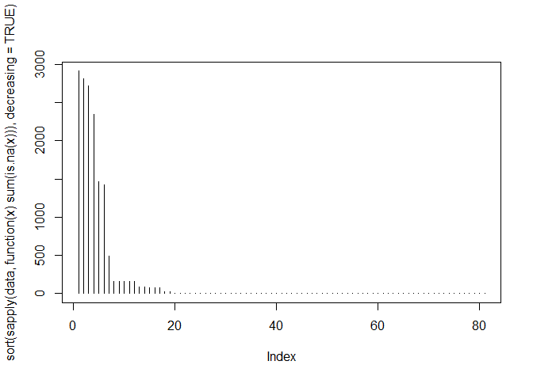

There are some columns with lots of missing values.We will decide later
what to do with these. Basically,in most cases there are not missing
values,but an indication that the apartment doesn’t have these
amenities. So let’s remove these Na’s with none and explore these
variables.

**PoolQC: Pool quality**

``` r
data$PoolQC[is.na(data$PoolQC)] <- "None"
table(data$PoolQC)
```

    ## 
    ##   Ex   Fa   Gd None 
    ##    4    2    4 2909

``` r
Qual_Cond <- c('None' = 0, 'Po' = 1, 'Fa' = 2, 'TA' = 3, 'Gd' = 4, 'Ex' = 5)
data$PoolQC<-revalue(data$PoolQC,Qual_Cond)
data$PoolQC<-as.integer(data$PoolQC)
```

**MiscFeature: Miscellaneous feature not covered in other categories**

``` r
table(data$MiscFeature)
```

    ## 
    ## Gar2 Othr Shed TenC 
    ##    5    4   95    1

``` r
data$MiscFeature[is.na(data$MiscFeature)] <- "None"
table(data$MiscFeature)
```

    ## 
    ## Gar2 None Othr Shed TenC 
    ##    5 2814    4   95    1

``` r
data$MiscFeature<-as.factor(data$MiscFeature) 
plot(data$MiscFeature)
```

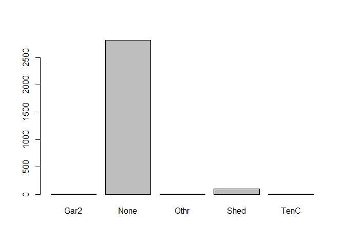

**Alley: Type of alley access to property**

``` r
table(data$Alley)
```

    ## 
    ## Grvl Pave 
    ##  120   78

``` r
data$Alley[is.na(data$Alley)] <- "None"
data$Alley<-as.factor(data$Alley)
plot(data$Alley,data$SalePrice) #Seems to affect the price
```

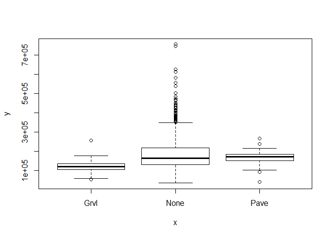

``` r
table(data$Alley)
```

    ## 
    ## Grvl None Pave 
    ##  120 2721   78

**Fence**

``` r
table(data$Fence)
```

    ## 
    ## GdPrv  GdWo MnPrv  MnWw 
    ##   118   112   329    12

``` r
data$Fence[is.na(data$Fence)] <- "None"
data$Fence<-as.factor(data$Fence)
plot(data$Fence,data$SalePrice) #Seems to affect the price,but no fence has the highest median!
```

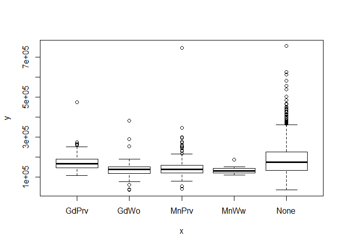

``` r
table(data$Fence)
```

    ## 
    ## GdPrv  GdWo MnPrv  MnWw  None 
    ##   118   112   329    12  2348

**FireplaceQu**

``` r
table(data$FireplaceQu)
```

    ## 
    ##  Ex  Fa  Gd  Po  TA 
    ##  43  74 744  46 592

``` r
data$FireplaceQu[is.na(data$FireplaceQu)] <- "None"
data$FireplaceQu<-revalue(data$FireplaceQu,Qual_Cond) #replace the values with Quality/Condition values
data$FireplaceQu<-as.integer(data$FireplaceQu)
plot(data$FireplaceQu,data$SalePrice) #Seems to affect the price!
abline(lm(data$SalePrice~data$FireplaceQu))
```

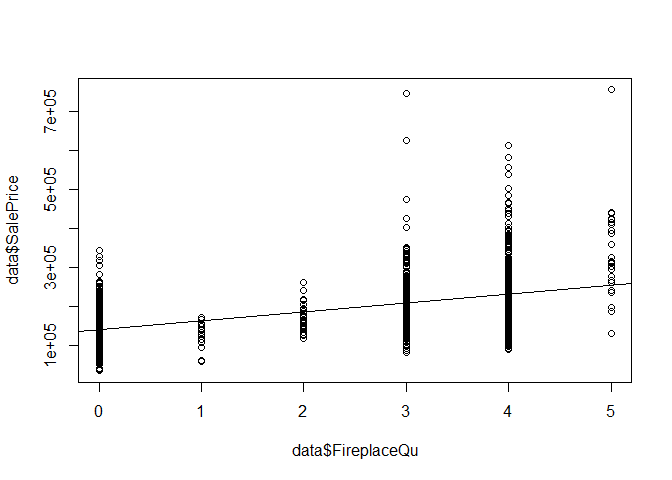

``` r
table(data$FireplaceQu)
```

    ## 
    ##    0    1    2    3    4    5 
    ## 1420   46   74  592  744   43

**LotFrontage: Linear feet of street connected to property. there are
259 NA’s**

``` r
summary(data$LotFrontage)
```

    ##    Min. 1st Qu.  Median    Mean 3rd Qu.    Max.    NA's 
    ##   21.00   59.00   68.00   69.31   80.00  313.00     486

``` r
cor(data$LotFrontage,data$SalePrice, use = "pairwise.complete.obs")
```

    ## [1] 0.3517991

``` r
hist(data$LotFrontage,breaks=30,xlim = c(0,200))
```

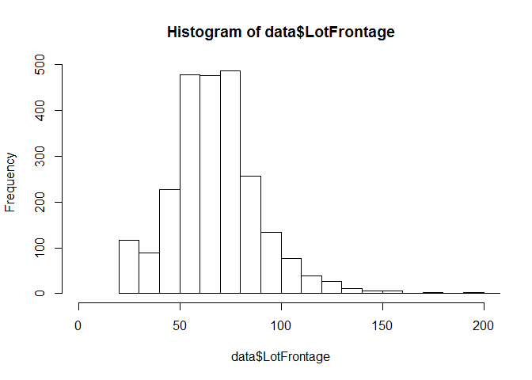

``` r
plot(data$LotFrontage,data$SalePrice)
abline(lm(data$SalePrice~data$LotFrontage))
```

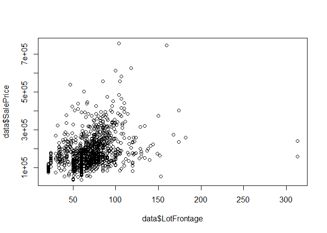

``` r
summary(lm(data$SalePrice~data$LotFrontage))
```

    ## 
    ## Call:
    ## lm(formula = data$SalePrice ~ data$LotFrontage)
    ## 
    ## Residuals:
    ##     Min      1Q  Median      3Q     Max 
    ## -314258  -48878  -19402   33290  533217 
    ## 
    ## Coefficients:
    ##                  Estimate Std. Error t value Pr(>|t|)    
    ## (Intercept)      96149.04    6881.97   13.97   <2e-16 ***
    ## data$LotFrontage  1208.02      92.83   13.01   <2e-16 ***
    ## ---
    ## Signif. codes:  0 '***' 0.001 '**' 0.01 '*' 0.05 '.' 0.1 ' ' 1
    ## 
    ## Residual standard error: 78090 on 1199 degrees of freedom
    ##   (1718 observations deleted due to missingness)
    ## Multiple R-squared:  0.1238, Adjusted R-squared:  0.123 
    ## F-statistic: 169.4 on 1 and 1199 DF,  p-value: < 2.2e-16

``` r
# R squared is very low so it doesn't fit the data well.Maybe we will replace na's with mean
data$LotFrontage[is.na(data$LotFrontage)] <-mean(na.omit(as.numeric(data$LotFrontage)))
```

**GarageYrBlt**

``` r
summary(data$GarageYrBlt)
```

    ##    Min. 1st Qu.  Median    Mean 3rd Qu.    Max.    NA's 
    ##    1895    1960    1979    1978    2002    2207     159

``` r
plot(data$GarageYrBlt) 
```

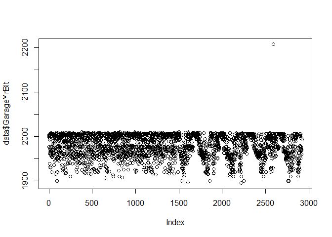

There is a wrong observation unless it is a house from the future -
2207.We replace it with the year 2007.

``` r
which(data[,"GarageYrBlt"]>2019)
```

    ## [1] 2593

``` r
data[2593,"GarageYrBlt"]<-2007
plot(as.factor(data$GarageYrBlt),data$SalePrice)
```

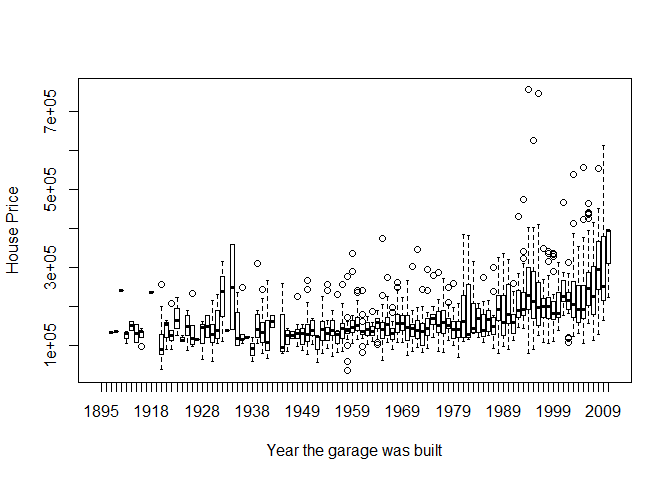

**We will find out the NA’s by another variable, YearBuilt. Let’s see if
they have a correlation**

``` r
head(data.frame(data$YearBuilt,data$GarageYrBlt),15)
```

    ##    data.YearBuilt data.GarageYrBlt
    ## 1            2003             2003
    ## 2            1976             1976
    ## 3            2001             2001
    ## 4            1915             1998
    ## 5            2000             2000
    ## 6            1993             1993
    ## 7            2004             2004
    ## 8            1973             1973
    ## 9            1931             1931
    ## 10           1939             1939
    ## 11           1965             1965
    ## 12           2005             2005
    ## 13           1962             1962
    ## 14           2006             2006
    ## 15           1960             1960

Indeed the year the house was built is in most cases the same as the
year the garage was built, so we will use the observations from
YearBuilt variable.

``` r
data$GarageYrBlt[is.na(data$GarageYrBlt)]<-data$YearBuilt[is.na(data$GarageYrBlt)]
```

We can see the correlation

``` r
cor(data$GarageYrBlt,data$YearBuilt)
```

    ## [1] 0.8607324

The correlation is very high, so we’ll drop the variable and keep the
YearBuilt variable.

``` r
data <- subset(data, select = -GarageYrBlt)
```

**GarageFinish:Interior finish of the garage**

``` r
plot(as.factor(data$GarageFinish))
```

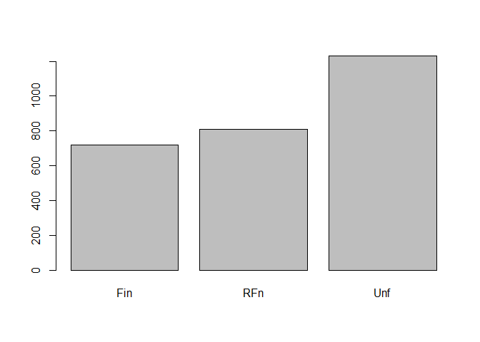

``` r
plot(as.factor(data$GarageFinish),data$SalePrice)
```

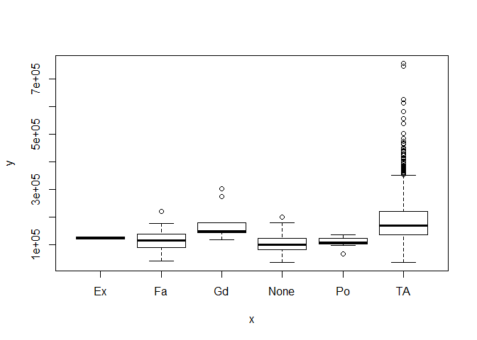

``` r
data$GarageFinish[is.na(data$GarageFinish)] <- "None"
plot(as.factor(data$GarageFinish),data$SalePrice)
```


``` r
#it seems ordinal
levels(as.factor(data$GarageFinish))
```

    ## [1] "Fin"  "None" "RFn"  "Unf"

``` r
Finish<-c('None' = 0, "Unf" = 1, "RFn" = 2, "Fin" = 3)
data$GarageFinish<-revalue(data$GarageFinish,Finish)
data$GarageFinish<-as.integer(data$GarageFinish)  
plot(data$GarageFinish,data$SalePrice)
```

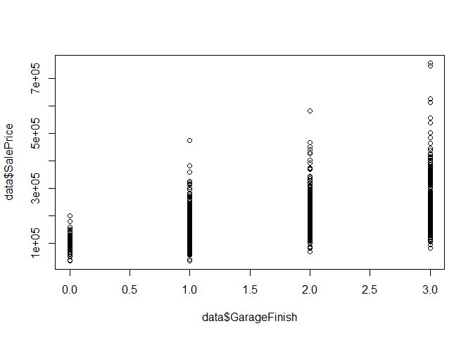

**GarageQual**

``` r
table(data$GarageQual)
```

    ## 
    ##   Ex   Fa   Gd   Po   TA 
    ##    3  124   24    5 2604

``` r
plot(as.factor(data$GarageQual),data$SalePrice)
```

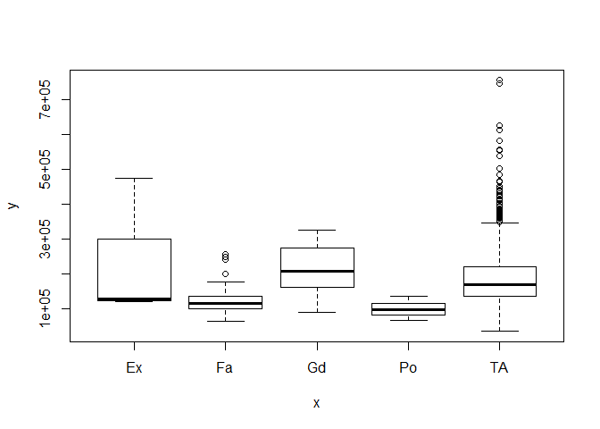

``` r
data$GarageQual[is.na(data$GarageQual)] <- "None"
plot(as.factor(data$GarageQual),data$SalePrice)
```


``` r
data$GarageQual<-revalue(data$GarageQual,Qual_Cond)
table(data$GarageQual)
```

    ## 
    ##    0    1    2    3    4    5 
    ##  159    5  124 2604   24    3

``` r
data$GarageQual<-as.integer(data$GarageQual)
```

**GarageCond**

``` r
table(data$GarageCond)
```

    ## 
    ##   Ex   Fa   Gd   Po   TA 
    ##    3   74   15   14 2654

``` r
plot(as.factor(data$GarageCond),data$SalePrice)
```

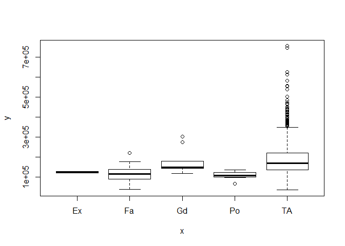

``` r
data$GarageCond[is.na(data$GarageCond)] <- "None"
plot(as.factor(data$GarageCond),data$SalePrice)
```


``` r
data$GarageCond<-revalue(data$GarageCond,Qual_Cond)
table(data$GarageCond)
```

    ## 
    ##    0    1    2    3    4    5 
    ##  159   14   74 2654   15    3

``` r
data$GarageCond<-as.integer(data$GarageCond)
```

**we can see the correlation**

``` r
cor(data$GarageCond,data$GarageQual)
```

    ## [1] 0.9466563

**It is a huge correlation,we must drop one of 2 variables**

``` r
cor(data[1:1459,'SalePrice'],data[1:1459,'GarageCond'])
```

    ## [1] 0.2632897

``` r
cor(data[1:1459,'SalePrice'],data[1:1459,'GarageQual'])
```

    ## [1] 0.2739379

**We’ll drop the variable less correlated with sales price**

``` r
data <- subset(data, select = -GarageCond)
```

**GarageType**

``` r
table(data$GarageType)
```

    ## 
    ##  2Types  Attchd Basment BuiltIn CarPort  Detchd 
    ##      23    1723      36     186      15     779

``` r
plot(as.factor(data$GarageType),data$SalePrice)
```

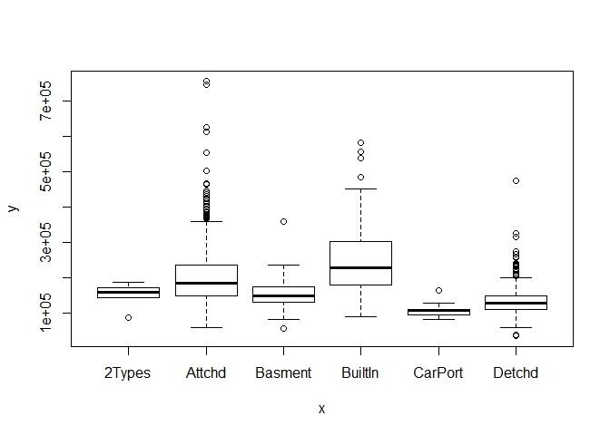

``` r
data$GarageType[is.na(data$GarageType)] <- "None"
plot(as.factor(data$GarageType),data$SalePrice)
data$GarageType<-as.factor(data$GarageType)
plot(data$GarageType,data$SalePrice)
```

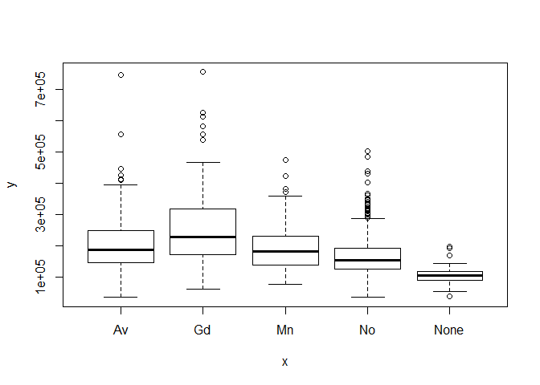

**Maybe classify together the basement and garage variables later?**

**BsmtCond:Evaluates the general condition of the basement**

``` r
table(data$BsmtCond)
```

    ## 
    ##   Fa   Gd   Po   TA 
    ##  104  122    5 2606

``` r
plot(as.factor(data$BsmtCond),data$SalePrice)
```

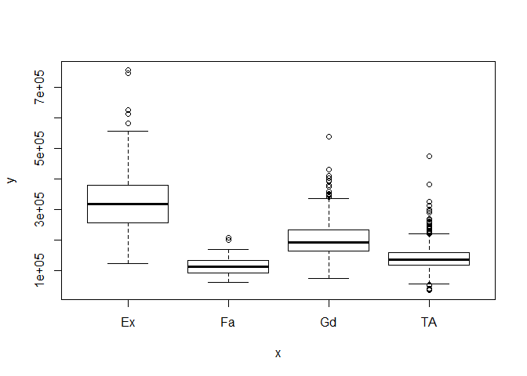

``` r
data$BsmtCond[is.na(data$BsmtCond)] <- "None"
plot(as.factor(data$BsmtCond),data$SalePrice)
```

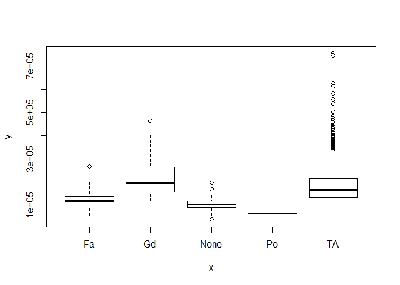

``` r
data$BsmtCond<-revalue(data$BsmtCond,Qual_Cond)
table(data$BsmtCond)
```

    ## 
    ##    0    1    2    3    4 
    ##   82    5  104 2606  122

``` r
data$BsmtCond<-as.integer(data$BsmtCond)
plot(as.factor(data$BsmtCond),data$SalePrice)
```

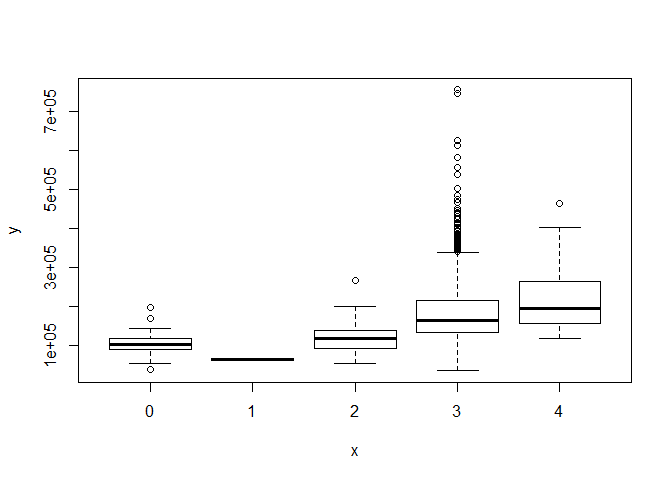

**BsmtExposure:Refers to walkout or garden level walls**

``` r
table(data$BsmtExposure)
```

    ## 
    ##   Av   Gd   Mn   No 
    ##  418  276  239 1904

``` r
plot(as.factor(data$BsmtExposure),data$SalePrice)
```

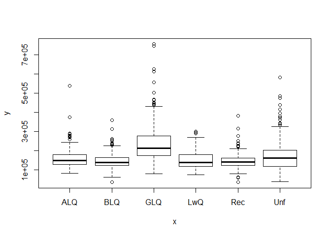

``` r
data$BsmtExposure[is.na(data$BsmtExposure)] <- "None"
plot(as.factor(data$BsmtExposure),data$SalePrice)
```


``` r
Exposure<-c("None"=0,"No"=1,'Mn'=2,'Av'=3,'Gd'=4)
data$BsmtExposure<-revalue(data$BsmtExposure,Exposure)
table(data$BsmtExposure)
```

    ## 
    ##    0    1    2    3    4 
    ##   82 1904  239  418  276

``` r
data$BsmtExposure<-as.integer(data$BsmtExposure)
plot(as.factor(data$BsmtExposure),data$SalePrice)
```

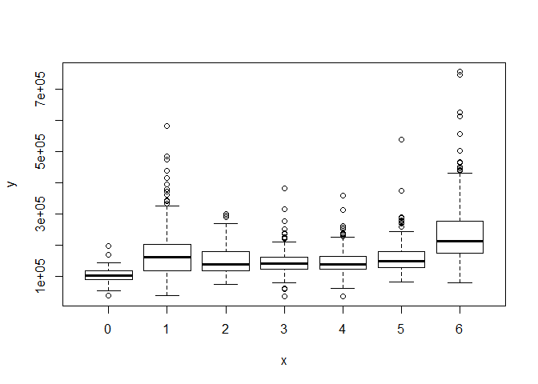

**BsmtQual:Evaluates the height of the basement**

``` r
table(data$BsmtQual)
```

    ## 
    ##   Ex   Fa   Gd   TA 
    ##  258   88 1209 1283

``` r
plot(as.factor(data$BsmtQual),data$SalePrice)
```


``` r
data$BsmtQual[is.na(data$BsmtQual)] <- "None"
plot(as.factor(data$BsmtQual),data$SalePrice)
```

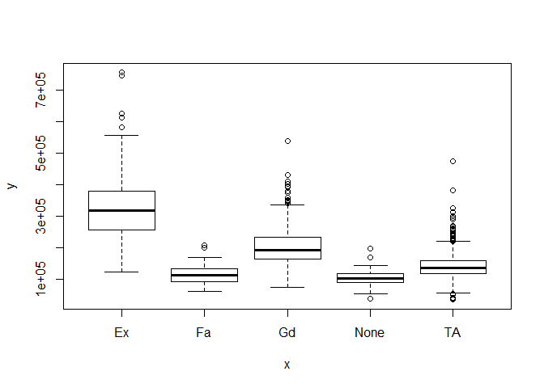

``` r
data$BsmtQual<-revalue(data$BsmtQual,Qual_Cond)
table(data$BsmtQual)
```

    ## 
    ##    0    2    3    4    5 
    ##   81   88 1283 1209  258

``` r
data$BsmtQual<-as.integer(data$BsmtQual)
plot(as.factor(data$BsmtQual),data$SalePrice)
```

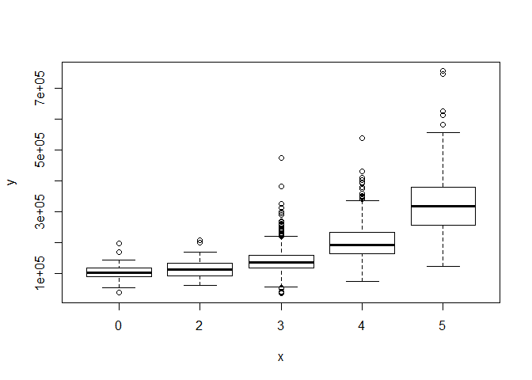

**BsmtFinType1:Rating of basement finished area**

``` r
table(data$BsmtFinType1)
```

    ## 
    ## ALQ BLQ GLQ LwQ Rec Unf 
    ## 429 269 849 154 288 851

``` r
plot(as.factor(data$BsmtFinType1),data$SalePrice)
```

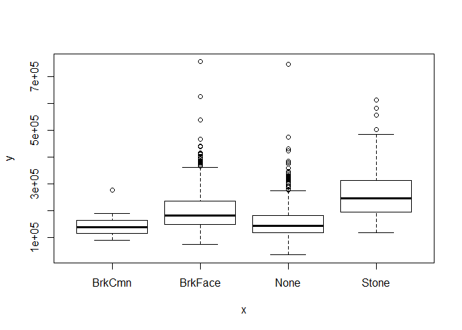

``` r
data$BsmtFinType1[is.na(data$BsmtFinType1)] <- "None"
plot(as.factor(data$BsmtFinType1),data$SalePrice)
```


``` r
Bsm_type<-c("None"=0,"Unf"=1,'LwQ'=2,'Rec'=3,'BLQ'=4,'ALQ'=5,'GLQ'=6)
data$BsmtFinType1<-revalue(data$BsmtFinType1,Bsm_type)
table(data$BsmtFinType1)
```

    ## 
    ##   0   1   2   3   4   5   6 
    ##  79 851 154 288 269 429 849

``` r
data$BsmtFinType1<-as.integer(data$BsmtFinType1)
plot(as.factor(data$BsmtFinType1),data$SalePrice)
```


**BsmtFinType2:Rating of basement finished area (if multiple types)**

``` r
table(data$BsmtFinType2)
```

    ## 
    ##  ALQ  BLQ  GLQ  LwQ  Rec  Unf 
    ##   52   68   34   87  105 2493

``` r
plot(as.factor(data$BsmtFinType2),data$SalePrice)
```


``` r
data$BsmtFinType2[is.na(data$BsmtFinType2)] <- "None"
plot(as.factor(data$BsmtFinType2),data$SalePrice)
```

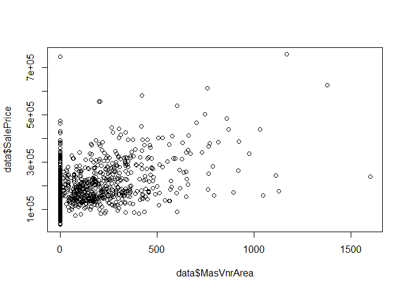

``` r
data$BsmtFinType2<-revalue(data$BsmtFinType2,Bsm_type)
table(data$BsmtFinType2)
```

    ## 
    ##    0    1    2    3    4    5    6 
    ##   80 2493   87  105   68   52   34

``` r
data$BsmtFinType2<-as.integer(data$BsmtFinType2)
plot(as.factor(data$BsmtFinType2),data$SalePrice)
```


**MasVnrType: Masonry veneer type (walls) Replace all Na’s with ‘none’**

``` r
table(data$MasVnrType)
```

    ## 
    ##  BrkCmn BrkFace    None   Stone 
    ##      25     879    1742     249

``` r
plot(as.factor(data$MasVnrType),data$SalePrice)
```

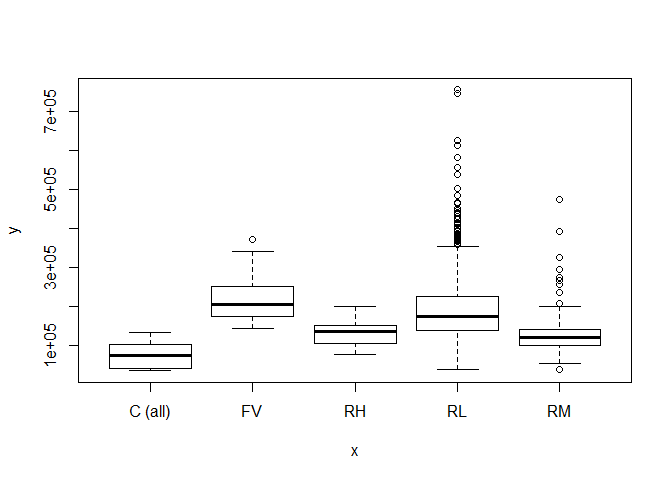

``` r
data$MasVnrType[is.na(data$MasVnrType)] <- "None"
Masonry <- c('None'=0, 'BrkCmn'=1, 'BrkFace'=2, 'Stone'=3)
data$MasVnrType<-revalue(data$MasVnrType,Masonry)
table(data$MasVnrType)
```

    ## 
    ##    0    1    2    3 
    ## 1766   25  879  249

``` r
data$MasVnrType<-as.integer(data$MasVnrType)
plot(as.factor(data$MasVnrType),data$SalePrice)
```


**MasVnrArea**

``` r
plot(data$MasVnrArea,data$SalePrice)
```


``` r
data$MasVnrArea[is.na(data$MasVnrArea)] <- 0
data$MasVnrArea<-as.numeric(data$MasVnrArea)
plot(data$MasVnrArea,data$SalePrice)
```


**MSZoning: Identifies the general zoning classification of the sale.**

``` r
table(data$MSZoning)
```

    ## 
    ## C (all)      FV      RH      RL      RM 
    ##      25     139      26    2265     460

``` r
plot(as.factor(data$MSZoning),data$SalePrice)
```


``` r
data[is.na(data$MSZoning),] #How we can find the missing values? Let's check out the MSSubClass
```

    ##        Id MSSubClass MSZoning LotFrontage LotArea Street Alley LotShape
    ## 1916 1916         30     <NA>    109.0000   21780   Grvl  None      Reg
    ## 2217 2217         20     <NA>     80.0000   14584   Pave  None      Reg
    ## 2251 2251         70     <NA>     69.3058   56600   Pave  None      IR1
    ## 2905 2905         20     <NA>    125.0000   31250   Pave  None      Reg
    ##      LandContour Utilities LotConfig LandSlope Neighborhood Condition1
    ## 1916         Lvl      <NA>    Inside       Gtl       IDOTRR       Norm
    ## 2217         Low    AllPub    Inside       Mod       IDOTRR       Norm
    ## 2251         Low    AllPub    Inside       Gtl       IDOTRR       Norm
    ## 2905         Lvl    AllPub    Inside       Gtl      Mitchel     Artery
    ##      Condition2 BldgType HouseStyle OverallQual OverallCond YearBuilt
    ## 1916       Norm     1Fam     1Story           2           4      1910
    ## 2217       Norm     1Fam     1Story           1           5      1952
    ## 2251       Norm     1Fam     2.5Unf           5           1      1900
    ## 2905       Norm     1Fam     1Story           1           3      1951
    ##      YearRemodAdd RoofStyle RoofMatl Exterior1st Exterior2nd MasVnrType
    ## 1916         1950     Gable  CompShg     Wd Sdng     Wd Sdng          0
    ## 2217         1952     Gable  CompShg     AsbShng     VinylSd          0
    ## 2251         1950       Hip  CompShg     Wd Sdng     Wd Sdng          0
    ## 2905         1951     Gable  CompShg      CBlock     VinylSd          0
    ##      MasVnrArea ExterQual ExterCond Foundation BsmtQual BsmtCond
    ## 1916          0        Fa        Fa     CBlock        0        0
    ## 2217          0        Fa        Po       Slab        0        0
    ## 2251          0        TA        TA     BrkTil        3        3
    ## 2905          0        TA        Fa     CBlock        0        0
    ##      BsmtExposure BsmtFinType1 BsmtFinSF1 BsmtFinType2 BsmtFinSF2
    ## 1916            0            0          0            0          0
    ## 2217            0            0          0            0          0
    ## 2251            1            1          0            1          0
    ## 2905            0            0          0            0          0
    ##      BsmtUnfSF TotalBsmtSF Heating HeatingQC CentralAir Electrical
    ## 1916         0           0    GasA        TA          N      FuseA
    ## 2217         0           0    Wall        Po          N      FuseA
    ## 2251       686         686    GasA        Ex          Y      SBrkr
    ## 2905         0           0    GasA        TA          Y      FuseA
    ##      X1stFlrSF X2ndFlrSF LowQualFinSF GrLivArea BsmtFullBath BsmtHalfBath
    ## 1916       810         0            0       810            0            0
    ## 2217       733         0            0       733            0            0
    ## 2251      1150       686            0      1836            0            0
    ## 2905      1600         0            0      1600            0            0
    ##      FullBath HalfBath BedroomAbvGr KitchenAbvGr KitchenQual TotRmsAbvGrd
    ## 1916        1        0            1            1          TA            4
    ## 2217        1        0            2            1          Fa            4
    ## 2251        2        0            4            1          TA            7
    ## 2905        1        1            3            1          TA            6
    ##      Functional Fireplaces FireplaceQu GarageType GarageFinish GarageCars
    ## 1916       Min1          0           0     Detchd            1          1
    ## 2217       <NA>          0           0     Attchd            1          2
    ## 2251       Maj1          0           0     Detchd            1          1
    ## 2905        Mod          0           0     Attchd            1          1
    ##      GarageArea GarageQual PavedDrive WoodDeckSF OpenPorchSF EnclosedPorch
    ## 1916        280          3          N        119          24             0
    ## 2217        487          2          N          0           0             0
    ## 2251        288          3          N          0           0             0
    ## 2905        270          2          N          0           0           135
    ##      X3SsnPorch ScreenPorch PoolArea PoolQC Fence MiscFeature MiscVal
    ## 1916          0           0        0      0  None        None       0
    ## 2217          0           0        0      0  None        None       0
    ## 2251          0           0        0      0  None        None       0
    ## 2905          0           0        0      0  None        None       0
    ##      MoSold YrSold SaleType SaleCondition SalePrice
    ## 1916      3   2009    ConLD        Normal        NA
    ## 2217      2   2008       WD       Abnorml        NA
    ## 2251      1   2008       WD        Normal        NA
    ## 2905      5   2006       WD        Normal        NA

``` r
data[is.na(data$MSZoning),c("MSZoning",'MSSubClass')]
```

    ##      MSZoning MSSubClass
    ## 1916     <NA>         30
    ## 2217     <NA>         20
    ## 2251     <NA>         70
    ## 2905     <NA>         20

``` r
table(data[,c("MSZoning",'MSSubClass')])
```

    ##          MSSubClass
    ## MSZoning    20   30   40   45   50   60   70   75   80   85   90  120  150
    ##   C (all)    3    8    0    0    7    0    4    0    0    0    0    0    0
    ##   FV        34    0    0    0    0   43    0    0    0    0    0   19    0
    ##   RH         4    2    0    1    2    0    3    0    0    0    4    6    0
    ##   RL      1016   61    4    6  159  529   57    9  115   47   92  117    1
    ##   RM        20   67    2   11  119    3   63   14    3    1   13   40    0
    ##          MSSubClass
    ## MSZoning   160  180  190
    ##   C (all)    0    0    3
    ##   FV        43    0    0
    ##   RH         0    0    4
    ##   RL        21    0   31
    ##   RM        64   17   23

``` r
plot(as.factor(data$MSZoning),as.factor(data$MSSubClass))
```

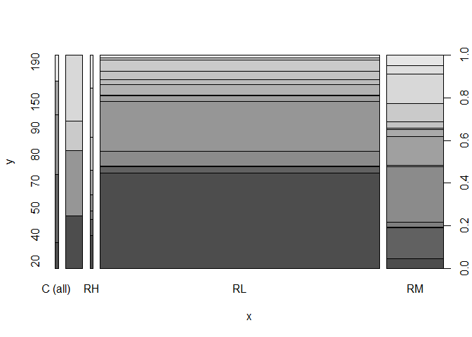

``` r
plot(as.factor(data$MSSubClass),as.factor(data$MSZoning))
```

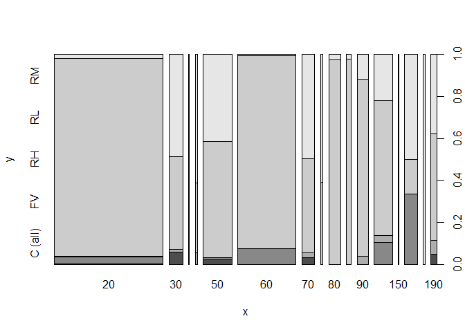

``` r
#and now the correlations
library(corrplot)
cor(data$MSSubClass,data[,sapply(data, is.numeric)]) #it is not higly correlated with other numeric variables
```

    ##               Id MSSubClass LotFrontage  LotArea OverallQual OverallCond
    ## [1,] 0.008930622          1  -0.3901181 -0.20173  0.03363797 -0.06562504
    ##       YearBuilt YearRemodAdd  MasVnrType  MasVnrArea   BsmtQual
    ## [1,] 0.03440874   0.04331491 0.007170029 0.006309137 0.06525105
    ##          BsmtCond BsmtExposure BsmtFinType1 BsmtFinSF1 BsmtFinType2
    ## [1,] -0.003662076   0.05929913   0.05162957         NA  -0.03622638
    ##      BsmtFinSF2 BsmtUnfSF TotalBsmtSF  X1stFlrSF X2ndFlrSF LowQualFinSF
    ## [1,]         NA        NA          NA -0.2486415 0.3093091   0.02648179
    ##       GrLivArea BsmtFullBath BsmtHalfBath  FullBath  HalfBath BedroomAbvGr
    ## [1,] 0.07167745           NA           NA 0.1391396 0.1787502 -0.008796152
    ##      KitchenAbvGr TotRmsAbvGrd  Fireplaces FireplaceQu GarageFinish
    ## [1,]    0.2601555   0.04050946 -0.05515069 -0.05154243  -0.03689839
    ##      GarageCars GarageArea  GarageQual  WoodDeckSF OpenPorchSF
    ## [1,]         NA         NA -0.09573865 -0.01765413  -0.0159232
    ##      EnclosedPorch  X3SsnPorch ScreenPorch     PoolArea       PoolQC
    ## [1,]   -0.02086725 -0.03752892 -0.04918147 -0.003079582 -0.001679514
    ##          MiscVal       MoSold     YrSold SalePrice
    ## [1,] -0.02886686 -0.001231139 -0.0150278        NA

``` r
#We will replace MSSubClass=20 with RL , MSSubClass=70 and MSSubClass=30 with RM 
data$MSZoning[is.na(data$MSZoning)]<-c('RM','RL','RM','RL')
data[is.na(data$MSZoning),c("MSZoning",'MSSubClass')]
```

    ## [1] MSZoning   MSSubClass
    ## <0 rows> (or 0-length row.names)

``` r
data$MSZoning<-as.factor(data$MSZoning)
```

**Utilities: Type of utilities available**

``` r
table(data$Utilities)
```

    ## 
    ## AllPub NoSeWa 
    ##   2916      1

``` r
data[is.na(data$Utilities),]
```

    ##        Id MSSubClass MSZoning LotFrontage LotArea Street Alley LotShape
    ## 1916 1916         30       RM    109.0000   21780   Grvl  None      Reg
    ## 1946 1946         20       RL     69.3058   31220   Pave  None      IR1
    ##      LandContour Utilities LotConfig LandSlope Neighborhood Condition1
    ## 1916         Lvl      <NA>    Inside       Gtl       IDOTRR       Norm
    ## 1946         Bnk      <NA>       FR2       Gtl      Gilbert      Feedr
    ##      Condition2 BldgType HouseStyle OverallQual OverallCond YearBuilt
    ## 1916       Norm     1Fam     1Story           2           4      1910
    ## 1946       Norm     1Fam     1Story           6           2      1952
    ##      YearRemodAdd RoofStyle RoofMatl Exterior1st Exterior2nd MasVnrType
    ## 1916         1950     Gable  CompShg     Wd Sdng     Wd Sdng          0
    ## 1946         1952       Hip  CompShg     BrkFace     BrkFace          0
    ##      MasVnrArea ExterQual ExterCond Foundation BsmtQual BsmtCond
    ## 1916          0        Fa        Fa     CBlock        0        0
    ## 1946          0        TA        TA     CBlock        3        3
    ##      BsmtExposure BsmtFinType1 BsmtFinSF1 BsmtFinType2 BsmtFinSF2
    ## 1916            0            0          0            0          0
    ## 1946            1            1          0            1          0
    ##      BsmtUnfSF TotalBsmtSF Heating HeatingQC CentralAir Electrical
    ## 1916         0           0    GasA        TA          N      FuseA
    ## 1946      1632        1632    GasA        TA          Y      FuseA
    ##      X1stFlrSF X2ndFlrSF LowQualFinSF GrLivArea BsmtFullBath BsmtHalfBath
    ## 1916       810         0            0       810            0            0
    ## 1946      1474         0            0      1474            0            0
    ##      FullBath HalfBath BedroomAbvGr KitchenAbvGr KitchenQual TotRmsAbvGrd
    ## 1916        1        0            1            1          TA            4
    ## 1946        1        0            3            1          TA            7
    ##      Functional Fireplaces FireplaceQu GarageType GarageFinish GarageCars
    ## 1916       Min1          0           0     Detchd            1          1
    ## 1946       Min2          2           4     Attchd            1          2
    ##      GarageArea GarageQual PavedDrive WoodDeckSF OpenPorchSF EnclosedPorch
    ## 1916        280          3          N        119          24             0
    ## 1946        495          3          Y          0           0           144
    ##      X3SsnPorch ScreenPorch PoolArea PoolQC Fence MiscFeature MiscVal
    ## 1916          0           0        0      0  None        None       0
    ## 1946          0           0        0      0  None        Shed     750
    ##      MoSold YrSold SaleType SaleCondition SalePrice
    ## 1916      3   2009    ConLD        Normal        NA
    ## 1946      5   2008       WD        Normal        NA

``` r
data[(data$Utilities=='NoSeWa'),]
```

    ##       Id MSSubClass MSZoning LotFrontage LotArea Street Alley LotShape
    ## 945  945         20       RL     69.3058   14375   Pave  None      IR1
    ## NA    NA         NA     <NA>          NA      NA   <NA>  <NA>     <NA>
    ## NA.1  NA         NA     <NA>          NA      NA   <NA>  <NA>     <NA>
    ##      LandContour Utilities LotConfig LandSlope Neighborhood Condition1
    ## 945          Lvl    NoSeWa   CulDSac       Gtl       Timber       Norm
    ## NA          <NA>      <NA>      <NA>      <NA>         <NA>       <NA>
    ## NA.1        <NA>      <NA>      <NA>      <NA>         <NA>       <NA>
    ##      Condition2 BldgType HouseStyle OverallQual OverallCond YearBuilt
    ## 945        Norm     1Fam       SLvl           6           6      1958
    ## NA         <NA>     <NA>       <NA>          NA          NA        NA
    ## NA.1       <NA>     <NA>       <NA>          NA          NA        NA
    ##      YearRemodAdd RoofStyle RoofMatl Exterior1st Exterior2nd MasVnrType
    ## 945          1958     Gable  CompShg     HdBoard     HdBoard          2
    ## NA             NA      <NA>     <NA>        <NA>        <NA>         NA
    ## NA.1           NA      <NA>     <NA>        <NA>        <NA>         NA
    ##      MasVnrArea ExterQual ExterCond Foundation BsmtQual BsmtCond
    ## 945         541        TA        TA     CBlock        3        3
    ## NA           NA      <NA>      <NA>       <NA>       NA       NA
    ## NA.1         NA      <NA>      <NA>       <NA>       NA       NA
    ##      BsmtExposure BsmtFinType1 BsmtFinSF1 BsmtFinType2 BsmtFinSF2
    ## 945             1            6        111            3        354
    ## NA             NA           NA         NA           NA         NA
    ## NA.1           NA           NA         NA           NA         NA
    ##      BsmtUnfSF TotalBsmtSF Heating HeatingQC CentralAir Electrical
    ## 945        354         819    GasA        Gd          Y      FuseA
    ## NA          NA          NA    <NA>      <NA>       <NA>       <NA>
    ## NA.1        NA          NA    <NA>      <NA>       <NA>       <NA>
    ##      X1stFlrSF X2ndFlrSF LowQualFinSF GrLivArea BsmtFullBath BsmtHalfBath
    ## 945       1344         0            0      1344            0            1
    ## NA          NA        NA           NA        NA           NA           NA
    ## NA.1        NA        NA           NA        NA           NA           NA
    ##      FullBath HalfBath BedroomAbvGr KitchenAbvGr KitchenQual TotRmsAbvGrd
    ## 945         1        0            3            1          Gd            7
    ## NA         NA       NA           NA           NA        <NA>           NA
    ## NA.1       NA       NA           NA           NA        <NA>           NA
    ##      Functional Fireplaces FireplaceQu GarageType GarageFinish GarageCars
    ## 945         Typ          1           4    Basment            2          2
    ## NA         <NA>         NA          NA       <NA>           NA         NA
    ## NA.1       <NA>         NA          NA       <NA>           NA         NA
    ##      GarageArea GarageQual PavedDrive WoodDeckSF OpenPorchSF EnclosedPorch
    ## 945         525          3          Y          0         118             0
    ## NA           NA         NA       <NA>         NA          NA            NA
    ## NA.1         NA         NA       <NA>         NA          NA            NA
    ##      X3SsnPorch ScreenPorch PoolArea PoolQC Fence MiscFeature MiscVal
    ## 945           0         233        0      0  None        None       0
    ## NA           NA          NA       NA     NA  <NA>        <NA>      NA
    ## NA.1         NA          NA       NA     NA  <NA>        <NA>      NA
    ##      MoSold YrSold SaleType SaleCondition SalePrice
    ## 945       1   2009      COD       Abnorml    137500
    ## NA       NA     NA     <NA>          <NA>        NA
    ## NA.1     NA     NA     <NA>          <NA>        NA

``` r
data[945,]
```

    ##      Id MSSubClass MSZoning LotFrontage LotArea Street Alley LotShape
    ## 945 945         20       RL     69.3058   14375   Pave  None      IR1
    ##     LandContour Utilities LotConfig LandSlope Neighborhood Condition1
    ## 945         Lvl    NoSeWa   CulDSac       Gtl       Timber       Norm
    ##     Condition2 BldgType HouseStyle OverallQual OverallCond YearBuilt
    ## 945       Norm     1Fam       SLvl           6           6      1958
    ##     YearRemodAdd RoofStyle RoofMatl Exterior1st Exterior2nd MasVnrType
    ## 945         1958     Gable  CompShg     HdBoard     HdBoard          2
    ##     MasVnrArea ExterQual ExterCond Foundation BsmtQual BsmtCond
    ## 945        541        TA        TA     CBlock        3        3
    ##     BsmtExposure BsmtFinType1 BsmtFinSF1 BsmtFinType2 BsmtFinSF2 BsmtUnfSF
    ## 945            1            6        111            3        354       354
    ##     TotalBsmtSF Heating HeatingQC CentralAir Electrical X1stFlrSF
    ## 945         819    GasA        Gd          Y      FuseA      1344
    ##     X2ndFlrSF LowQualFinSF GrLivArea BsmtFullBath BsmtHalfBath FullBath
    ## 945         0            0      1344            0            1        1
    ##     HalfBath BedroomAbvGr KitchenAbvGr KitchenQual TotRmsAbvGrd Functional
    ## 945        0            3            1          Gd            7        Typ
    ##     Fireplaces FireplaceQu GarageType GarageFinish GarageCars GarageArea
    ## 945          1           4    Basment            2          2        525
    ##     GarageQual PavedDrive WoodDeckSF OpenPorchSF EnclosedPorch X3SsnPorch
    ## 945          3          Y          0         118             0          0
    ##     ScreenPorch PoolArea PoolQC Fence MiscFeature MiscVal MoSold YrSold
    ## 945         233        0      0  None        None       0      1   2009
    ##     SaleType SaleCondition SalePrice
    ## 945      COD       Abnorml    137500

``` r
#We don't need this variable for prediction , as there is only one house "NoSeWa"
data <- subset(data, select = -Utilities)
```

**BsmtFullBath:Basement full bathrooms**

``` r
table(data$BsmtFullBath)
```

    ## 
    ##    0    1    2    3 
    ## 1705 1172   38    2

``` r
data[is.na(data$BsmtFullBath),]
```

    ##        Id MSSubClass MSZoning LotFrontage LotArea Street Alley LotShape
    ## 2121 2121         20       RM          99    5940   Pave  None      IR1
    ## 2189 2189         20       RL         123   47007   Pave  None      IR1
    ##      LandContour LotConfig LandSlope Neighborhood Condition1 Condition2
    ## 2121         Lvl       FR3       Gtl      BrkSide      Feedr       Norm
    ## 2189         Lvl    Inside       Gtl      Edwards       Norm       Norm
    ##      BldgType HouseStyle OverallQual OverallCond YearBuilt YearRemodAdd
    ## 2121     1Fam     1Story           4           7      1946         1950
    ## 2189     1Fam     1Story           5           7      1959         1996
    ##      RoofStyle RoofMatl Exterior1st Exterior2nd MasVnrType MasVnrArea
    ## 2121     Gable  CompShg     MetalSd      CBlock          0          0
    ## 2189     Gable  CompShg     Plywood     Plywood          0          0
    ##      ExterQual ExterCond Foundation BsmtQual BsmtCond BsmtExposure
    ## 2121        TA        TA      PConc        0        0            0
    ## 2189        TA        TA       Slab        0        0            0
    ##      BsmtFinType1 BsmtFinSF1 BsmtFinType2 BsmtFinSF2 BsmtUnfSF TotalBsmtSF
    ## 2121            0         NA            0         NA        NA          NA
    ## 2189            0          0            0          0         0           0
    ##      Heating HeatingQC CentralAir Electrical X1stFlrSF X2ndFlrSF
    ## 2121    GasA        TA          Y      FuseA       896         0
    ## 2189    GasA        TA          Y      SBrkr      3820         0
    ##      LowQualFinSF GrLivArea BsmtFullBath BsmtHalfBath FullBath HalfBath
    ## 2121            0       896           NA           NA        1        0
    ## 2189            0      3820           NA           NA        3        1
    ##      BedroomAbvGr KitchenAbvGr KitchenQual TotRmsAbvGrd Functional
    ## 2121            2            1          TA            4        Typ
    ## 2189            5            1          Ex           11        Typ
    ##      Fireplaces FireplaceQu GarageType GarageFinish GarageCars GarageArea
    ## 2121          0           0     Detchd            1          1        280
    ## 2189          2           4     Attchd            1          2        624
    ##      GarageQual PavedDrive WoodDeckSF OpenPorchSF EnclosedPorch X3SsnPorch
    ## 2121          3          Y          0           0             0          0
    ## 2189          3          Y          0         372             0          0
    ##      ScreenPorch PoolArea PoolQC Fence MiscFeature MiscVal MoSold YrSold
    ## 2121           0        0      0 MnPrv        None       0      4   2008
    ## 2189           0        0      0  None        None       0      7   2008
    ##      SaleType SaleCondition SalePrice
    ## 2121    ConLD       Abnorml        NA
    ## 2189       WD        Normal        NA

``` r
paste(colnames(select(data,contains("Bsmt"))),collapse="','")
```

    ## [1] "BsmtQual','BsmtCond','BsmtExposure','BsmtFinType1','BsmtFinSF1','BsmtFinType2','BsmtFinSF2','BsmtUnfSF','TotalBsmtSF','BsmtFullBath','BsmtHalfBath"

``` r
data[is.na(data$BsmtFullBath),c('BsmtQual','BsmtCond','BsmtExposure','BsmtFinType1','BsmtFinSF1','BsmtFinType2','BsmtFinSF2','BsmtUnfSF','TotalBsmtSF','BsmtFullBath','BsmtHalfBath')]
```

    ##      BsmtQual BsmtCond BsmtExposure BsmtFinType1 BsmtFinSF1 BsmtFinType2
    ## 2121        0        0            0            0         NA            0
    ## 2189        0        0            0            0          0            0
    ##      BsmtFinSF2 BsmtUnfSF TotalBsmtSF BsmtFullBath BsmtHalfBath
    ## 2121         NA        NA          NA           NA           NA
    ## 2189          0         0           0           NA           NA

``` r
data$BsmtFullBath[is.na(data$BsmtFullBath)]<-0
plot(as.factor(data$BsmtFullBath),data$SalePrice)
```

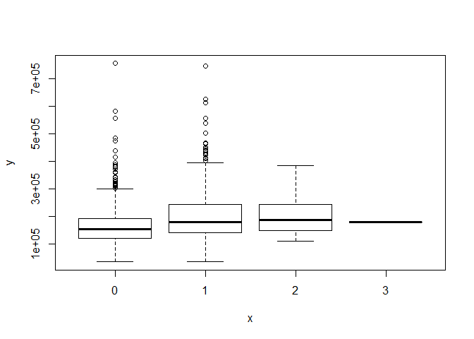

``` r
data$BsmtFullBath<-as.integer(data$BsmtFullBath)
```

**BsmtHalfBath**

``` r
table(data$BsmtHalfBath)
```

    ## 
    ##    0    1    2 
    ## 2742  171    4

``` r
data[is.na(data$BsmtHalfBath),]
```

    ##        Id MSSubClass MSZoning LotFrontage LotArea Street Alley LotShape
    ## 2121 2121         20       RM          99    5940   Pave  None      IR1
    ## 2189 2189         20       RL         123   47007   Pave  None      IR1
    ##      LandContour LotConfig LandSlope Neighborhood Condition1 Condition2
    ## 2121         Lvl       FR3       Gtl      BrkSide      Feedr       Norm
    ## 2189         Lvl    Inside       Gtl      Edwards       Norm       Norm
    ##      BldgType HouseStyle OverallQual OverallCond YearBuilt YearRemodAdd
    ## 2121     1Fam     1Story           4           7      1946         1950
    ## 2189     1Fam     1Story           5           7      1959         1996
    ##      RoofStyle RoofMatl Exterior1st Exterior2nd MasVnrType MasVnrArea
    ## 2121     Gable  CompShg     MetalSd      CBlock          0          0
    ## 2189     Gable  CompShg     Plywood     Plywood          0          0
    ##      ExterQual ExterCond Foundation BsmtQual BsmtCond BsmtExposure
    ## 2121        TA        TA      PConc        0        0            0
    ## 2189        TA        TA       Slab        0        0            0
    ##      BsmtFinType1 BsmtFinSF1 BsmtFinType2 BsmtFinSF2 BsmtUnfSF TotalBsmtSF
    ## 2121            0         NA            0         NA        NA          NA
    ## 2189            0          0            0          0         0           0
    ##      Heating HeatingQC CentralAir Electrical X1stFlrSF X2ndFlrSF
    ## 2121    GasA        TA          Y      FuseA       896         0
    ## 2189    GasA        TA          Y      SBrkr      3820         0
    ##      LowQualFinSF GrLivArea BsmtFullBath BsmtHalfBath FullBath HalfBath
    ## 2121            0       896            0           NA        1        0
    ## 2189            0      3820            0           NA        3        1
    ##      BedroomAbvGr KitchenAbvGr KitchenQual TotRmsAbvGrd Functional
    ## 2121            2            1          TA            4        Typ
    ## 2189            5            1          Ex           11        Typ
    ##      Fireplaces FireplaceQu GarageType GarageFinish GarageCars GarageArea
    ## 2121          0           0     Detchd            1          1        280
    ## 2189          2           4     Attchd            1          2        624
    ##      GarageQual PavedDrive WoodDeckSF OpenPorchSF EnclosedPorch X3SsnPorch
    ## 2121          3          Y          0           0             0          0
    ## 2189          3          Y          0         372             0          0
    ##      ScreenPorch PoolArea PoolQC Fence MiscFeature MiscVal MoSold YrSold
    ## 2121           0        0      0 MnPrv        None       0      4   2008
    ## 2189           0        0      0  None        None       0      7   2008
    ##      SaleType SaleCondition SalePrice
    ## 2121    ConLD       Abnorml        NA
    ## 2189       WD        Normal        NA

``` r
paste(colnames(select(data,contains("Bsmt"))),collapse="','")
```

    ## [1] "BsmtQual','BsmtCond','BsmtExposure','BsmtFinType1','BsmtFinSF1','BsmtFinType2','BsmtFinSF2','BsmtUnfSF','TotalBsmtSF','BsmtFullBath','BsmtHalfBath"

``` r
data[is.na(data$BsmtHalfBath),c('BsmtQual','BsmtCond','BsmtExposure','BsmtFinType1','BsmtFinSF1','BsmtFinType2','BsmtFinSF2','BsmtUnfSF','TotalBsmtSF','BsmtFullBath','BsmtHalfBath')]
```

    ##      BsmtQual BsmtCond BsmtExposure BsmtFinType1 BsmtFinSF1 BsmtFinType2
    ## 2121        0        0            0            0         NA            0
    ## 2189        0        0            0            0          0            0
    ##      BsmtFinSF2 BsmtUnfSF TotalBsmtSF BsmtFullBath BsmtHalfBath
    ## 2121         NA        NA          NA            0           NA
    ## 2189          0         0           0            0           NA

``` r
data$BsmtHalfBath[is.na(data$BsmtHalfBath)]<-0
plot(as.factor(data$BsmtHalfBath),data$SalePrice)
```

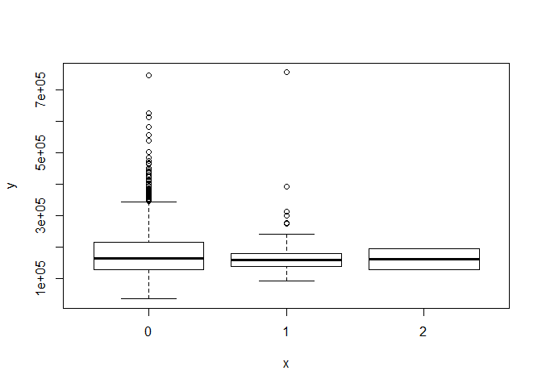

``` r
data$BsmtHalfBath<-as.integer(data$BsmtHalfBath)
#we can see the correlation 
cor(data$BsmtHalfBath,data$BsmtFullBath) #It is not correlated
```

    ## [1] -0.1486548

**Functional: Home functionality (Assume typical unless deductions are
warranted)**

``` r
table(data$Functional)
```

    ## 
    ## Maj1 Maj2 Min1 Min2  Mod  Sev  Typ 
    ##   19    9   65   70   35    2 2717

``` r
plot(as.factor(data$Functional),data$SalePrice)
```

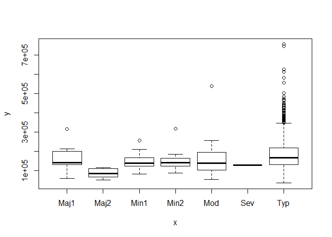

``` r
data[is.na(data$Functional),]
```

    ##        Id MSSubClass MSZoning LotFrontage LotArea Street Alley LotShape
    ## 2217 2217         20       RL          80   14584   Pave  None      Reg
    ## 2474 2474         50       RM          60   10320   Pave  Grvl      Reg
    ##      LandContour LotConfig LandSlope Neighborhood Condition1 Condition2
    ## 2217         Low    Inside       Mod       IDOTRR       Norm       Norm
    ## 2474         Lvl    Corner       Gtl       IDOTRR     Artery       Norm
    ##      BldgType HouseStyle OverallQual OverallCond YearBuilt YearRemodAdd
    ## 2217     1Fam     1Story           1           5      1952         1952
    ## 2474     1Fam     1.5Fin           4           1      1910         1950
    ##      RoofStyle RoofMatl Exterior1st Exterior2nd MasVnrType MasVnrArea
    ## 2217     Gable  CompShg     AsbShng     VinylSd          0          0
    ## 2474     Gable  CompShg     Wd Sdng     Wd Sdng          0          0
    ##      ExterQual ExterCond Foundation BsmtQual BsmtCond BsmtExposure
    ## 2217        Fa        Po       Slab        0        0            0
    ## 2474        Fa        Fa     CBlock        3        2            1
    ##      BsmtFinType1 BsmtFinSF1 BsmtFinType2 BsmtFinSF2 BsmtUnfSF TotalBsmtSF
    ## 2217            0          0            0          0         0           0
    ## 2474            1          0            1          0       771         771
    ##      Heating HeatingQC CentralAir Electrical X1stFlrSF X2ndFlrSF
    ## 2217    Wall        Po          N      FuseA       733         0
    ## 2474    GasA        Fa          Y      SBrkr       866       504
    ##      LowQualFinSF GrLivArea BsmtFullBath BsmtHalfBath FullBath HalfBath
    ## 2217            0       733            0            0        1        0
    ## 2474          114      1484            0            0        2        0
    ##      BedroomAbvGr KitchenAbvGr KitchenQual TotRmsAbvGrd Functional
    ## 2217            2            1          Fa            4       <NA>
    ## 2474            3            1          TA            6       <NA>
    ##      Fireplaces FireplaceQu GarageType GarageFinish GarageCars GarageArea
    ## 2217          0           0     Attchd            1          2        487
    ## 2474          0           0     Detchd            1          1        264
    ##      GarageQual PavedDrive WoodDeckSF OpenPorchSF EnclosedPorch X3SsnPorch
    ## 2217          2          N          0           0             0          0
    ## 2474          3          N         14         211             0          0
    ##      ScreenPorch PoolArea PoolQC Fence MiscFeature MiscVal MoSold YrSold
    ## 2217           0        0      0  None        None       0      2   2008
    ## 2474          84        0      0  None        None       0      9   2007
    ##      SaleType SaleCondition SalePrice
    ## 2217       WD       Abnorml        NA
    ## 2474      COD       Abnorml        NA

``` r
data$Functional[is.na(data$Functional)]<-7
Functional<-c('Sal'=0, 'Sev'=1, 'Maj2'=2, 'Maj1'=3, 'Mod'=4, 'Min2'=5, 'Min1'=6, 'Typ'=7)
data$Functional <- as.integer(revalue(data$Functional, Functional))
table(data$Functional)
```

    ## 
    ##    1    2    3    4    5    6    7 
    ##    2    9   19   35   70   65 2719

``` r
plot(data$Functional,data$SalePrice)
```


**GarageCars Size of garage in car capacity **

``` r
table(as.factor(data$GarageCars))
```

    ## 
    ##    0    1    2    3    4    5 
    ##  157  776 1594  374   16    1

``` r
plot(as.factor(data$GarageCars))
```

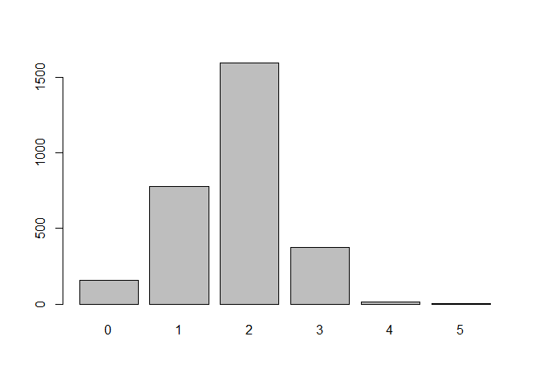

``` r
plot(as.factor(data$GarageCars),data$SalePrice)
```


``` r
paste(colnames(select(data,contains("Garage"))),collapse="','")
```

    ## [1] "GarageType','GarageFinish','GarageCars','GarageArea','GarageQual"

``` r
data[is.na(data$GarageCars),c('GarageType','GarageFinish','GarageCars','GarageArea','GarageQual')]
```

    ##      GarageType GarageFinish GarageCars GarageArea GarageQual
    ## 2577     Detchd            0         NA         NA          0

``` r
data$GarageCars[is.na(data$GarageCars)]<-0
data$GarageCars<-as.integer(data$GarageCars)
```

**GarageArea**

``` r
plot(as.factor(data$GarageArea))
```

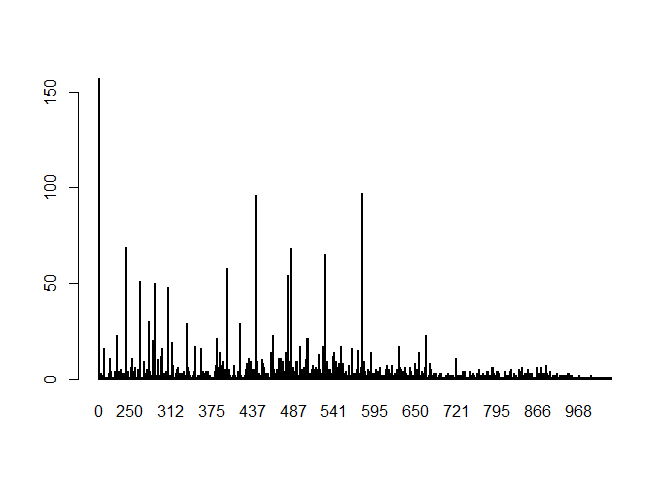

``` r
plot(data$GarageArea,data$SalePrice)
```

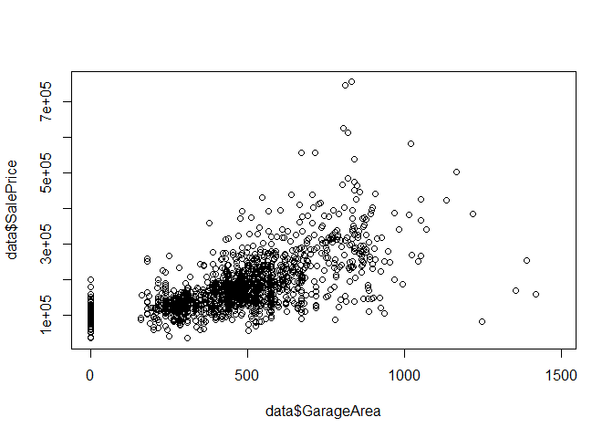

``` r
paste(colnames(select(data,contains("Garage"))),collapse="','")
```

    ## [1] "GarageType','GarageFinish','GarageCars','GarageArea','GarageQual"

``` r
data[is.na(data$GarageArea),c('GarageType','GarageFinish','GarageCars','GarageArea','GarageQual')]
```

    ##      GarageType GarageFinish GarageCars GarageArea GarageQual
    ## 2577     Detchd            0          0         NA          0

``` r
data$GarageArea[is.na(data$GarageArea)]<-0
data$GarageArea<-as.integer(data$GarageArea)
plot(data$GarageArea,data$SalePrice)
```


``` r
cor(data[,sapply(data, is.numeric)],data$GarageArea) 
```

    ##                       [,1]
    ## Id            -0.009851054
    ## MSSubClass    -0.103534194
    ## LotFrontage    0.339380131
    ## LotArea        0.213180376
    ## OverallQual    0.565179205
    ## OverallCond   -0.154311762
    ## YearBuilt      0.481328133
    ## YearRemodAdd   0.375892265
    ## MasVnrType     0.368002725
    ## MasVnrArea     0.371071383
    ## BsmtQual       0.422730492
    ## BsmtCond       0.136238741
    ## BsmtExposure   0.280947231
    ## BsmtFinType1   0.235311964
    ## BsmtFinSF1              NA
    ## BsmtFinType2   0.004557102
    ## BsmtFinSF2              NA
    ## BsmtUnfSF               NA
    ## TotalBsmtSF             NA
    ## X1stFlrSF      0.491996421
    ## X2ndFlrSF      0.127463905
    ## LowQualFinSF  -0.053430694
    ## GrLivArea      0.484547335
    ## BsmtFullBath   0.185151379
    ## BsmtHalfBath  -0.021217905
    ## FullBath       0.407519909
    ## HalfBath       0.179396010
    ## BedroomAbvGr   0.073723102
    ## KitchenAbvGr  -0.057647570
    ## TotRmsAbvGrd   0.328627638
    ## Functional     0.068753326
    ## Fireplaces     0.295175204
    ## FireplaceQu    0.342810880
    ## GarageFinish   0.511991097
    ## GarageCars     0.889890224
    ## GarageArea     1.000000000
    ## GarageQual     0.552595491
    ## WoodDeckSF     0.237384942
    ## OpenPorchSF    0.232875830
    ## EnclosedPorch -0.108382360
    ## X3SsnPorch     0.029493114
    ## ScreenPorch    0.062552079
    ## PoolArea       0.053053039
    ## PoolQC         0.063360935
    ## MiscVal        0.008506144
    ## MoSold         0.041181698
    ## YrSold        -0.012986182
    ## SalePrice               NA

``` r
#drop GarageArea and keep GarageCars?
cor(data[1:1459,'SalePrice'],data[1:1459,'GarageArea'])
```

    ## [1] 0.6233849

``` r
cor(data[1:1459,'SalePrice'],data[1:1459,'GarageCars']) 
```

    ## [1] 0.6403833

``` r
#We'll indeed drop the GarageArea variable since it is less corellated with sales Price 
data <- subset(data, select = -GarageArea)
```

**TotalBsmtSF : Total square feet of basement area**

``` r
plot(as.factor(data$TotalBsmtSF))
```

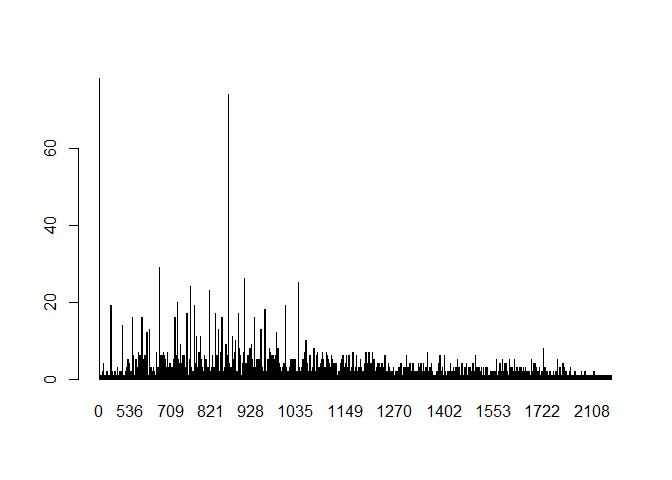

``` r
plot(data$TotalBsmtSF,data$SalePrice)
```

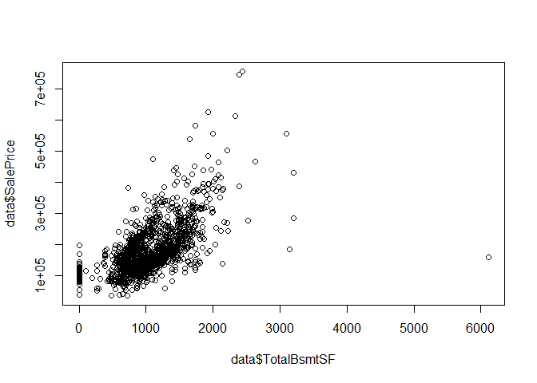

``` r
cor(data[1:1459,'SalePrice'],data[1:1459,'TotalBsmtSF'])
```

    ## [1] 0.6137915

``` r
data$TotalBsmtSF[is.na(data$TotalBsmtSF)]
```

    ## [1] NA

``` r
paste(colnames(select(data,contains("Bsmt"))),collapse="','")
```

    ## [1] "BsmtQual','BsmtCond','BsmtExposure','BsmtFinType1','BsmtFinSF1','BsmtFinType2','BsmtFinSF2','BsmtUnfSF','TotalBsmtSF','BsmtFullBath','BsmtHalfBath"

``` r
data[is.na(data$TotalBsmtSF),c('BsmtQual','BsmtCond','BsmtExposure','BsmtFinType1','BsmtFinSF1','BsmtFinType2','BsmtFinSF2','BsmtUnfSF','TotalBsmtSF','BsmtFullBath','BsmtHalfBath')]
```

    ##      BsmtQual BsmtCond BsmtExposure BsmtFinType1 BsmtFinSF1 BsmtFinType2
    ## 2121        0        0            0            0         NA            0
    ##      BsmtFinSF2 BsmtUnfSF TotalBsmtSF BsmtFullBath BsmtHalfBath
    ## 2121         NA        NA          NA            0            0

``` r
data$TotalBsmtSF[is.na(data$TotalBsmtSF)]<-0
```

**BsmtFinSF1**

``` r
plot(as.factor(data$BsmtFinSF1))
```

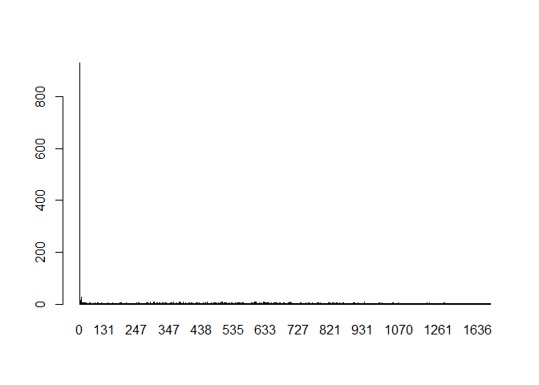

``` r
plot(data$BsmtFinSF1,data$SalePrice)
```


``` r
cor(data[1:1459,'SalePrice'],data[1:1459,'BsmtFinSF1'])
```

    ## [1] 0.3867829

``` r
data$BsmtFinSF1[is.na(data$BsmtFinSF1)]
```

    ## [1] NA

``` r
paste(colnames(select(data,contains("Bsmt"))),collapse="','")
```

    ## [1] "BsmtQual','BsmtCond','BsmtExposure','BsmtFinType1','BsmtFinSF1','BsmtFinType2','BsmtFinSF2','BsmtUnfSF','TotalBsmtSF','BsmtFullBath','BsmtHalfBath"

``` r
data[is.na(data$BsmtFinSF1),c('BsmtQual','BsmtCond','BsmtExposure','BsmtFinType1','BsmtFinSF1','BsmtFinType2','BsmtFinSF2','BsmtUnfSF','TotalBsmtSF','BsmtFullBath','BsmtHalfBath')]
```

    ##      BsmtQual BsmtCond BsmtExposure BsmtFinType1 BsmtFinSF1 BsmtFinType2
    ## 2121        0        0            0            0         NA            0
    ##      BsmtFinSF2 BsmtUnfSF TotalBsmtSF BsmtFullBath BsmtHalfBath
    ## 2121         NA        NA           0            0            0

``` r
data$BsmtFinSF1[is.na(data$BsmtFinSF1)]<-0
```

**BsmtUnfSF**

``` r
plot(data$BsmtUnfSF)
```

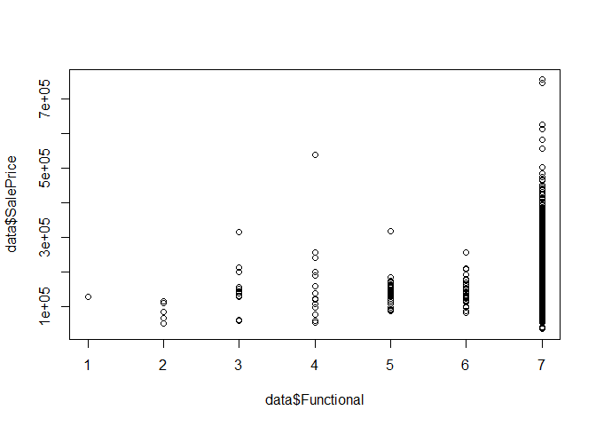

``` r
plot(data$BsmtUnfSF,data$SalePrice)
```

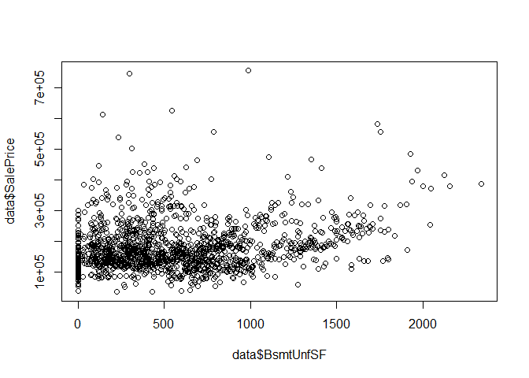

``` r
cor(data[1:1459,'SalePrice'],data[1:1459,'BsmtUnfSF'])
```

    ## [1] 0.2142805

``` r
data$BsmtUnfSF[is.na(data$BsmtUnfSF)]
```

    ## [1] NA

``` r
paste(colnames(select(data,contains("Bsmt"))),collapse="','")
```

    ## [1] "BsmtQual','BsmtCond','BsmtExposure','BsmtFinType1','BsmtFinSF1','BsmtFinType2','BsmtFinSF2','BsmtUnfSF','TotalBsmtSF','BsmtFullBath','BsmtHalfBath"

``` r
data[is.na(data$BsmtUnfSF),c('BsmtQual','BsmtCond','BsmtExposure','BsmtFinType1','BsmtFinSF1','BsmtFinType2','BsmtFinSF2','BsmtUnfSF','TotalBsmtSF','BsmtFullBath','BsmtHalfBath')]
```

    ##      BsmtQual BsmtCond BsmtExposure BsmtFinType1 BsmtFinSF1 BsmtFinType2
    ## 2121        0        0            0            0          0            0
    ##      BsmtFinSF2 BsmtUnfSF TotalBsmtSF BsmtFullBath BsmtHalfBath
    ## 2121         NA        NA           0            0            0

``` r
data$BsmtUnfSF[is.na(data$BsmtUnfSF)]<-0
cor(data$BsmtUnfSF,data$BsmtFinSF2)
```

    ## [1] NA

``` r
#Let's see if it is correlated with another
cor(data$BsmtUnfSF,data[,sapply(data, is.numeric)]) #correlated with BsmtFinSF1
```

    ##               Id MSSubClass LotFrontage    LotArea OverallQual OverallCond
    ## [1,] -0.01479023 -0.1255609   0.1043326 0.02158978   0.2756429  -0.1386875
    ##      YearBuilt YearRemodAdd MasVnrType MasVnrArea  BsmtQual  BsmtCond
    ## [1,] 0.1307862    0.1657697  0.1086214 0.08817341 0.2358125 0.1748441
    ##      BsmtExposure BsmtFinType1 BsmtFinSF1 BsmtFinType2 BsmtFinSF2
    ## [1,]  -0.04344334   -0.3881147 -0.4767712   -0.1902104         NA
    ##      BsmtUnfSF TotalBsmtSF X1stFlrSF     X2ndFlrSF LowQualFinSF GrLivArea
    ## [1,]         1   0.4128104 0.2967876 -3.236541e-05   0.04694399 0.2343882
    ##      BsmtFullBath BsmtHalfBath  FullBath    HalfBath BedroomAbvGr
    ## [1,]   -0.3976477   -0.1068404 0.2735304 -0.03545913    0.1836307
    ##      KitchenAbvGr TotRmsAbvGrd Functional  Fireplaces FireplaceQu
    ## [1,]   0.06505947    0.2480153 0.03766712 0.005216017   0.1097402
    ##      GarageFinish GarageCars   GarageQual  WoodDeckSF OpenPorchSF
    ## [1,]    0.0847243  0.1807326 -0.009866555 -0.03896365   0.1200272
    ##      EnclosedPorch   X3SsnPorch ScreenPorch    PoolArea      PoolQC
    ## [1,]   0.005161546 -0.005763676 -0.04901855 -0.03223645 -0.02994952
    ##          MiscVal     MoSold      YrSold SalePrice
    ## [1,] -0.01045017 0.02295447 -0.03807293        NA

**BsmtFinSF2**

``` r
plot(data$BsmtFinSF2)
```

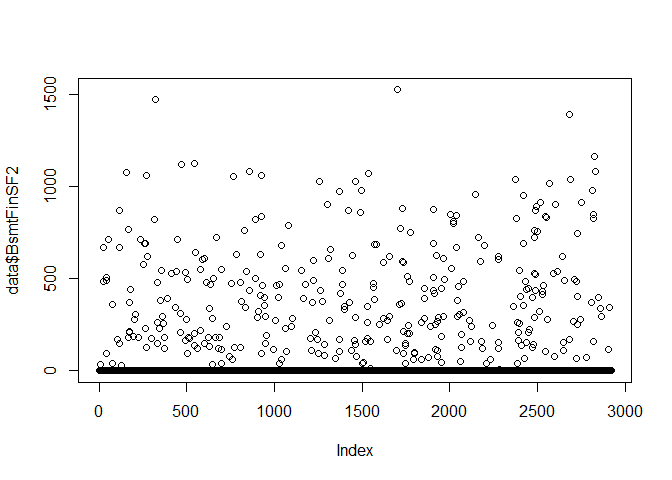

``` r
plot(data$BsmtFinSF2,data$SalePrice)
```

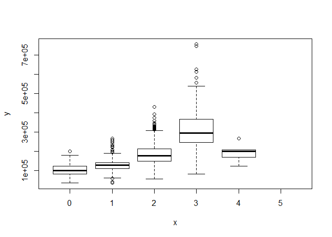

``` r
cor(data[1:1459,'SalePrice'],data[1:1459,'BsmtFinSF2'])
```

    ## [1] -0.01095189

``` r
data$BsmtFinSF2[is.na(data$BsmtFinSF2)]
```

    ## [1] NA

``` r
paste(colnames(select(data,contains("Bsmt"))),collapse="','")
```

    ## [1] "BsmtQual','BsmtCond','BsmtExposure','BsmtFinType1','BsmtFinSF1','BsmtFinType2','BsmtFinSF2','BsmtUnfSF','TotalBsmtSF','BsmtFullBath','BsmtHalfBath"

``` r
data[is.na(data$BsmtFinSF2),c('BsmtQual','BsmtCond','BsmtExposure','BsmtFinType1','BsmtFinSF1','BsmtFinType2','BsmtFinSF2','BsmtUnfSF','TotalBsmtSF','BsmtFullBath','BsmtHalfBath')]
```

    ##      BsmtQual BsmtCond BsmtExposure BsmtFinType1 BsmtFinSF1 BsmtFinType2
    ## 2121        0        0            0            0          0            0
    ##      BsmtFinSF2 BsmtUnfSF TotalBsmtSF BsmtFullBath BsmtHalfBath
    ## 2121         NA         0           0            0            0

``` r
data$BsmtFinSF2[is.na(data$BsmtFinSF2)]<-0
cor(data$BsmtFinSF1,data$BsmtFinSF2)
```

    ## [1] -0.05493841

``` r
#We will probably drop this variable,let's see if it is correlated with another
cor(data$BsmtFinSF2,data[,sapply(data, is.numeric)]) #correlated with BsmtFinType2
```

    ##              Id  MSSubClass LotFrontage    LotArea OverallQual OverallCond
    ## [1,] 0.01817004 -0.07243126  0.04125594 0.08410715  -0.0426052  0.04135923
    ##        YearBuilt YearRemodAdd  MasVnrType  MasVnrArea    BsmtQual
    ## [1,] -0.02750704  -0.06195898 -0.02374806 -0.01457983 -0.01267815
    ##        BsmtCond BsmtExposure BsmtFinType1  BsmtFinSF1 BsmtFinType2
    ## [1,] 0.07567332    0.1025202   0.02628983 -0.05493841    0.7992987
    ##      BsmtFinSF2  BsmtUnfSF TotalBsmtSF  X1stFlrSF   X2ndFlrSF LowQualFinSF
    ## [1,]          1 -0.2380433  0.08956092 0.08438942 -0.09765352  -0.00491318
    ##        GrLivArea BsmtFullBath BsmtHalfBath    FullBath    HalfBath
    ## [1,] -0.01774713    0.1629569   0.09953007 -0.07531358 -0.03236835
    ##      BedroomAbvGr KitchenAbvGr TotRmsAbvGrd  Functional Fireplaces
    ## [1,]   -0.0311113   -0.0377576  -0.04824545 -0.06372228 0.06570734
    ##      FireplaceQu GarageFinish  GarageCars GarageQual WoodDeckSF
    ## [1,] 0.004498087  0.009004049 -0.01447615 0.06432276  0.0984622
    ##       OpenPorchSF EnclosedPorch  X3SsnPorch ScreenPorch   PoolArea
    ## [1,] -0.005804508    0.03277453 -0.02326797  0.06332908 0.04452989
    ##          PoolQC      MiscVal     MoSold      YrSold SalePrice
    ## [1,] 0.02187298 -0.005129682 -0.0095096 0.008866935        NA

``` r
#We'll probably drop these 2 basement variables
#Now we see the correlations between basement variables

paste(colnames(select(data,contains("Bsmt"))),collapse="','")
```

    ## [1] "BsmtQual','BsmtCond','BsmtExposure','BsmtFinType1','BsmtFinSF1','BsmtFinType2','BsmtFinSF2','BsmtUnfSF','TotalBsmtSF','BsmtFullBath','BsmtHalfBath"

``` r
cor(data[,c('BsmtQual','BsmtCond','BsmtExposure','BsmtFinType1','BsmtFinSF1','BsmtFinType2','BsmtFinSF2','BsmtUnfSF','TotalBsmtSF','BsmtFullBath','BsmtHalfBath')])
```

    ##                  BsmtQual   BsmtCond BsmtExposure BsmtFinType1
    ## BsmtQual      1.000000000 0.62515749   0.43626210   0.41987055
    ## BsmtCond      0.625157488 1.00000000   0.26430401   0.30704435
    ## BsmtExposure  0.436262102 0.26430401   1.00000000   0.36706771
    ## BsmtFinType1  0.419870554 0.30704435   0.36706771   1.00000000
    ## BsmtFinSF1    0.337365829 0.16986992   0.39857979   0.70298124
    ## BsmtFinType2  0.101212924 0.22661106   0.13262795   0.09950210
    ## BsmtFinSF2   -0.012678151 0.07567332   0.10252021   0.02628983
    ## BsmtUnfSF     0.235812550 0.17484410  -0.04344334  -0.38811470
    ## TotalBsmtSF   0.578576765 0.37870825   0.40769434   0.34937955
    ## BsmtFullBath  0.259072937 0.16954774   0.33859998   0.58455430
    ## BsmtHalfBath -0.006908995 0.04755341   0.08910495   0.08452306
    ##                BsmtFinSF1 BsmtFinType2  BsmtFinSF2   BsmtUnfSF TotalBsmtSF
    ## BsmtQual      0.337365829  0.101212924 -0.01267815  0.23581255  0.57857677
    ## BsmtCond      0.169869918  0.226611061  0.07567332  0.17484410  0.37870825
    ## BsmtExposure  0.398579791  0.132627953  0.10252021 -0.04344334  0.40769434
    ## BsmtFinType1  0.702981238  0.099502102  0.02628983 -0.38811470  0.34937955
    ## BsmtFinSF1    1.000000000 -0.008849972 -0.05493841 -0.47677116  0.53665002
    ## BsmtFinType2 -0.008849972  1.000000000  0.79929873 -0.19021038  0.10785668
    ## BsmtFinSF2   -0.054938405  0.799298733  1.00000000 -0.23804333  0.08956092
    ## BsmtUnfSF    -0.476771163 -0.190210384 -0.23804333  1.00000000  0.41281039
    ## TotalBsmtSF   0.536650022  0.107856678  0.08956092  0.41281039  1.00000000
    ## BsmtFullBath  0.639038348  0.187877971  0.16295695 -0.39764765  0.32625176
    ## BsmtHalfBath  0.078500167  0.109564023  0.09953007 -0.10684037  0.01277996
    ##              BsmtFullBath BsmtHalfBath
    ## BsmtQual        0.2590729 -0.006908995
    ## BsmtCond        0.1695477  0.047553407
    ## BsmtExposure    0.3386000  0.089104955
    ## BsmtFinType1    0.5845543  0.084523061
    ## BsmtFinSF1      0.6390383  0.078500167
    ## BsmtFinType2    0.1878780  0.109564023
    ## BsmtFinSF2      0.1629569  0.099530071
    ## BsmtUnfSF      -0.3976477 -0.106840367
    ## TotalBsmtSF     0.3262518  0.012779965
    ## BsmtFullBath    1.0000000 -0.148654812
    ## BsmtHalfBath   -0.1486548  1.000000000

``` r
corrplot(cor(data[,c('BsmtQual','BsmtCond','BsmtExposure','BsmtFinType1','BsmtFinSF1','BsmtFinType2','BsmtFinSF2','BsmtUnfSF','TotalBsmtSF','BsmtFullBath','BsmtHalfBath')])
,method = "square")
```


``` r
#we drop the variables BsmtFinSF1 and BsmtFinSF2
data <- subset(data, select = -BsmtFinSF1)
data <- subset(data, select = -BsmtFinSF2)
#check again
corrplot(cor(data[,c('BsmtQual','BsmtCond','BsmtExposure','BsmtFinType1','BsmtFinType2','BsmtUnfSF','TotalBsmtSF','BsmtFullBath','BsmtHalfBath')]),method='square')
```

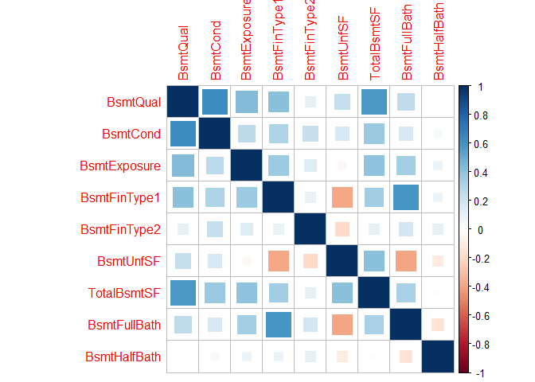

``` r
data <- subset(data, select = -TotalBsmtSF)   #MAYBE NOT THIS VARIABLE?     
corrplot(cor(data[,c('BsmtQual','BsmtCond','BsmtExposure','BsmtFinType1','BsmtFinType2','BsmtUnfSF','BsmtFullBath','BsmtHalfBath')]),method='square')
```

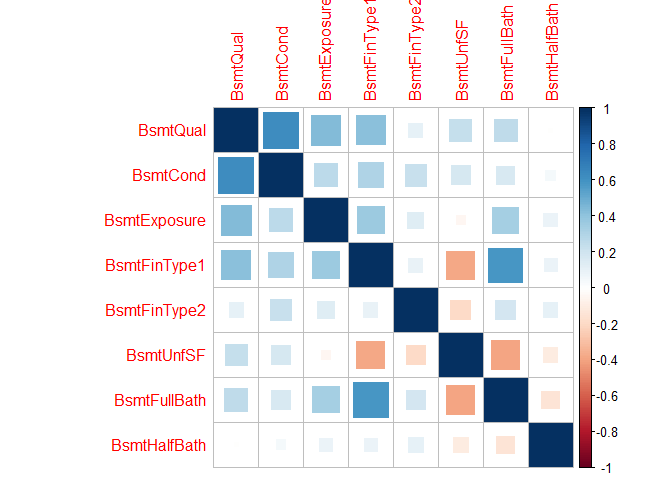

**Now that we have taken care of Na’s let’s see what the numeric
variables are**

``` r
colnames(data[,sapply(data, is.numeric)]) #check out which columns are numeric 
```

    ##  [1] "Id"            "MSSubClass"    "LotFrontage"   "LotArea"      
    ##  [5] "OverallQual"   "OverallCond"   "YearBuilt"     "YearRemodAdd" 
    ##  [9] "MasVnrType"    "MasVnrArea"    "BsmtQual"      "BsmtCond"     
    ## [13] "BsmtExposure"  "BsmtFinType1"  "BsmtFinType2"  "BsmtUnfSF"    
    ## [17] "X1stFlrSF"     "X2ndFlrSF"     "LowQualFinSF"  "GrLivArea"    
    ## [21] "BsmtFullBath"  "BsmtHalfBath"  "FullBath"      "HalfBath"     
    ## [25] "BedroomAbvGr"  "KitchenAbvGr"  "TotRmsAbvGrd"  "Functional"   
    ## [29] "Fireplaces"    "FireplaceQu"   "GarageFinish"  "GarageCars"   
    ## [33] "GarageQual"    "WoodDeckSF"    "OpenPorchSF"   "EnclosedPorch"
    ## [37] "X3SsnPorch"    "ScreenPorch"   "PoolArea"      "PoolQC"       
    ## [41] "MiscVal"       "MoSold"        "YrSold"        "SalePrice"

**But first let’s see some correlations**

``` r
corrplot(cor(na.omit(data[,sapply(data, is.numeric)])),method = "square")
```

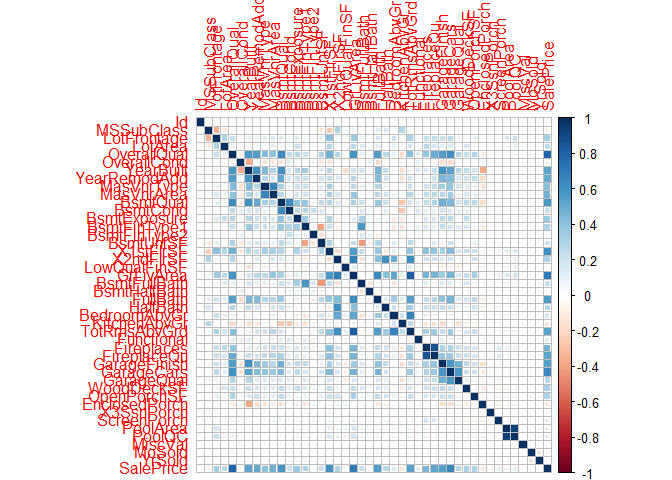

``` r
paste(which(cor(data[1:1459,sapply(data, is.numeric)],data[1:1459,'SalePrice'])>0.5 | cor(data[1:1459,sapply(data, is.numeric)],data[1:1459,'SalePrice'])<(-0.5)),collapse=',')
```

    ## [1] "5,7,8,11,17,20,23,27,30,31,32,44"

``` r
colnames(data[,sapply(data, is.numeric)][c(5,7,8,11,17,20,23,27,30,31,32,44)])
```

    ##  [1] "OverallQual"  "YearBuilt"    "YearRemodAdd" "BsmtQual"    
    ##  [5] "X1stFlrSF"    "GrLivArea"    "FullBath"     "TotRmsAbvGrd"
    ##  [9] "FireplaceQu"  "GarageFinish" "GarageCars"   "SalePrice"

**So these are the variables that have the highest correlation with the
Saleprice variable.We will examine these further.**

**Id** **We will get rid of the Id column and keep it in a vector called
Id**

``` r
Id<-data$Id[1461:nrow(data)]
data <- data[,-1]
```

**MSSubClass: Identifies the type of dwelling involved in the sale.**

``` r
plot(data$MSSubClass,data$SalePrice)
```


``` r
#In reality this is a factor and not numeric.
table(as.factor(data$MSSubClass))
```

    ## 
    ##   20   30   40   45   50   60   70   75   80   85   90  120  150  160  180 
    ## 1079  139    6   18  287  575  128   23  118   48  109  182    1  128   17 
    ##  190 
    ##   61

``` r
data$MSSubClass<-as.factor(data$MSSubClass)
```

**OverallQual: Rates the overall material and finish of the house**

``` r
table(as.factor(data$OverallQual))
```

    ## 
    ##   1   2   3   4   5   6   7   8   9  10 
    ##   4  13  40 226 825 731 600 342 107  31

``` r
plot(as.factor(data$OverallQual),data$SalePrice)
```


``` r
data$OverallQual<-as.integer(data$OverallQual)
table(data$OverallQual)
```

    ## 
    ##   1   2   3   4   5   6   7   8   9  10 
    ##   4  13  40 226 825 731 600 342 107  31

**OverallCond: Rates the overall condition of the house**

``` r
table(as.factor(data$OverallCond))
```

    ## 
    ##    1    2    3    4    5    6    7    8    9 
    ##    7   10   50  101 1645  531  390  144   41

``` r
plot(as.factor(data$OverallCond),data$SalePrice)
```


``` r
data$OverallCond<-as.integer(data$OverallCond)
table(data$OverallCond)
```

    ## 
    ##    1    2    3    4    5    6    7    8    9 
    ##    7   10   50  101 1645  531  390  144   41

**YearBuilt: Original construction date**

``` r
plot(as.factor(data$YearBuilt))
```

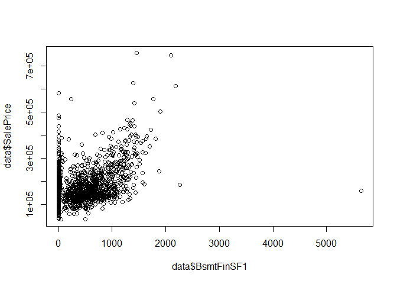

``` r
table(as.factor(data$YearBuilt))
```

    ## 
    ## 1872 1875 1879 1880 1882 1885 1890 1892 1893 1895 1896 1898 1900 1901 1902 
    ##    1    1    1    5    1    2    7    2    1    3    1    1   29    2    1 
    ## 1904 1905 1906 1907 1908 1910 1911 1912 1913 1914 1915 1916 1917 1918 1919 
    ##    1    3    1    1    2   43    1    5    1    8   24   10    3   10    5 
    ## 1920 1921 1922 1923 1924 1925 1926 1927 1928 1929 1930 1931 1932 1934 1935 
    ##   57   11   16   17   16   34   19    9    9    8   26    7    5    5   13 
    ## 1936 1937 1938 1939 1940 1941 1942 1945 1946 1947 1948 1949 1950 1951 1952 
    ##   11    9   13   20   36   23    6   15   15   11   27   18   38   18   18 
    ## 1953 1954 1955 1956 1957 1958 1959 1960 1961 1962 1963 1964 1965 1966 1967 
    ##   24   43   34   39   35   48   43   37   34   35   35   33   34   35   41 
    ## 1968 1969 1970 1971 1972 1973 1974 1975 1976 1977 1978 1979 1980 1981 1982 
    ##   45   28   42   39   40   21   23   25   54   57   39   21   23    9    7 
    ## 1983 1984 1985 1986 1987 1988 1989 1990 1991 1992 1993 1994 1995 1996 1997 
    ##    8   19    7   10    8   15    8   19   12   27   39   37   31   34   35 
    ## 1998 1999 2000 2001 2002 2003 2004 2005 2006 2007 2008 2009 2010 
    ##   46   52   48   35   47   88   99  142  138  109   49   25    3

``` r
plot(as.factor(data$YearBuilt),data$SalePrice)
```


``` r
cor(data[1:1459,'SalePrice'],data[1:1459,'YearBuilt'])
```

    ## [1] 0.5228769

**YearRemodAdd: Remodel date (same as construction date if no remodeling
or additions)**

``` r
plot(as.factor(data$YearRemodAdd))
```


``` r
table(as.factor(data$YearRemodAdd))
```

    ## 
    ## 1950 1951 1952 1953 1954 1955 1956 1957 1958 1959 1960 1961 1962 1963 1964 
    ##  361   14   15   20   28   25   30   20   34   30   29   24   26   30   26 
    ## 1965 1966 1967 1968 1969 1970 1971 1972 1973 1974 1975 1976 1977 1978 1979 
    ##   28   27   34   39   26   44   31   35   21   19   30   48   46   36   24 
    ## 1980 1981 1982 1983 1984 1985 1986 1987 1988 1989 1990 1991 1992 1993 1994 
    ##   26   12    9   11   19   14   12   16   15   18   29   29   32   43   53 
    ## 1995 1996 1997 1998 1999 2000 2001 2002 2003 2004 2005 2006 2007 2008 2009 
    ##   56   59   49   77   60  104   49   82   99  111  141  202  164   81   34 
    ## 2010 
    ##   13

``` r
plot(as.factor(data$YearRemodAdd),data$SalePrice)
```


``` r
plot(data$YearRemodAdd,data$YearBuilt)
```

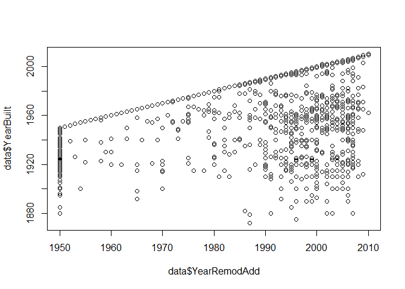

``` r
#We can see from the plot that all remodelings started on 1950. Is it true or there is some error?
cor(data$YearRemodAdd>1950,data$YearBuilt>1950) #Highly correlated with Yearbuilt
```

    ## [1] 0.6882729

X1stFlrSF"
==========

GrLivArea"
==========

FullBath"
=========

TotRmsAbvGrd"
=============

FireplaceQu"
============

GarageFinish"
=============

**Pool Area**

``` r
table(data$PoolArea) #we'll drop this variable
```

    ## 
    ##    0  144  228  368  444  480  512  519  555  561  576  648  738  800 
    ## 2906    1    1    1    1    1    1    1    1    1    1    1    1    1

``` r
data <- subset(data, select = -c(PoolArea))
```

**PoolQC**

``` r
table(data$PoolQC) #we'll drop this variable
```

    ## 
    ##    0    2    4    5 
    ## 2909    2    4    4

``` r
data <- subset(data, select = -c(PoolQC))
```

**check out which columns are character**

``` r
colnames(data[,sapply(data, is.character)]) 
```

    ##  [1] "Street"        "LotShape"      "LandContour"   "LotConfig"    
    ##  [5] "LandSlope"     "Neighborhood"  "Condition1"    "Condition2"   
    ##  [9] "BldgType"      "HouseStyle"    "RoofStyle"     "RoofMatl"     
    ## [13] "Exterior1st"   "Exterior2nd"   "ExterQual"     "ExterCond"    
    ## [17] "Foundation"    "Heating"       "HeatingQC"     "CentralAir"   
    ## [21] "Electrical"    "KitchenQual"   "PavedDrive"    "SaleType"     
    ## [25] "SaleCondition"

**Street: Type of road access to property **

``` r
plot(as.factor(data$Street))
```

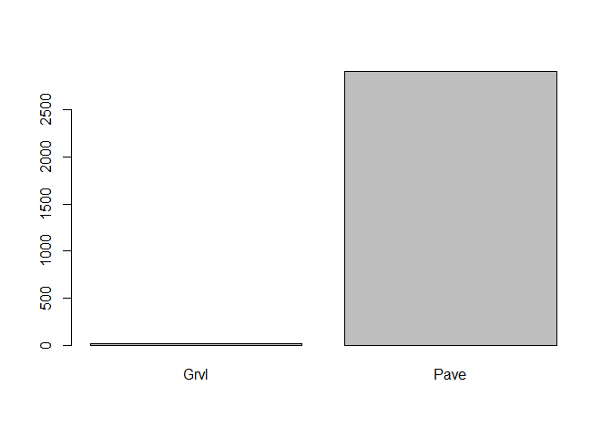

``` r
table(data$Street)
```

    ## 
    ## Grvl Pave 
    ##   12 2907

``` r
#Only 12 Gravels      
#removing Street variable 
data <- subset(data, select = -Street)
```

library(caret) library(glmnet) my\_control \<-trainControl(method=“cv”,
number=5) lassoGrid \<- expand.grid(alpha = 1, lambda = seq(0.001,0.1,by
= 0.0005))

lasso\_mod \<- train(x=train,
y=data*S**a**l**e**P**r**i**c**e*\[!*i**s*.*n**a*(*d**a**t**a*SalePrice)\],
method=‘glmnet’, trControl= my\_control, tuneGrid=lassoGrid)
lasso\_mod$bestTune

############################################################################
