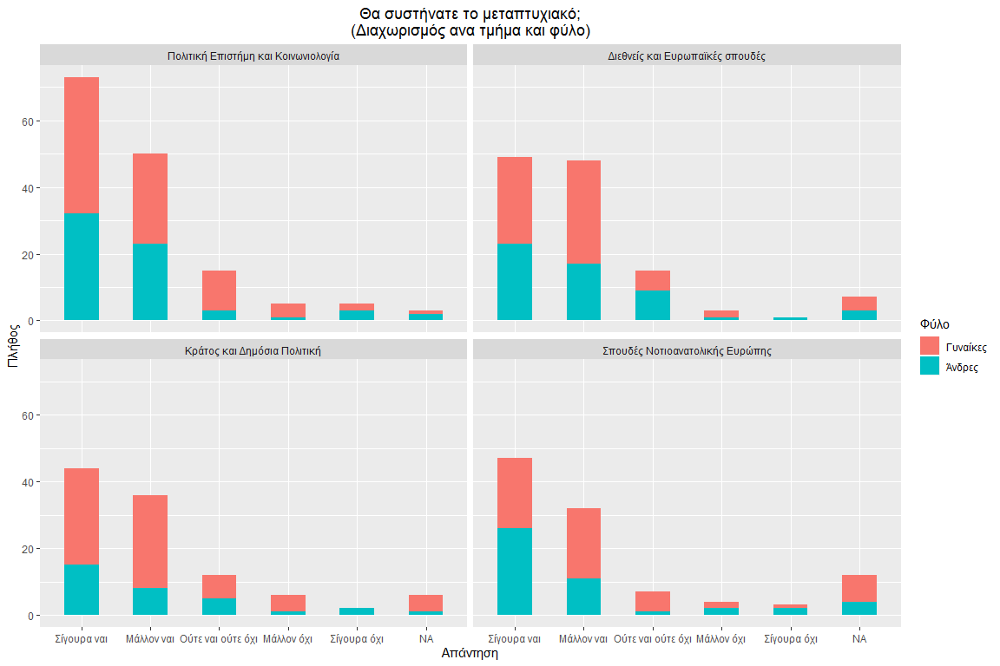
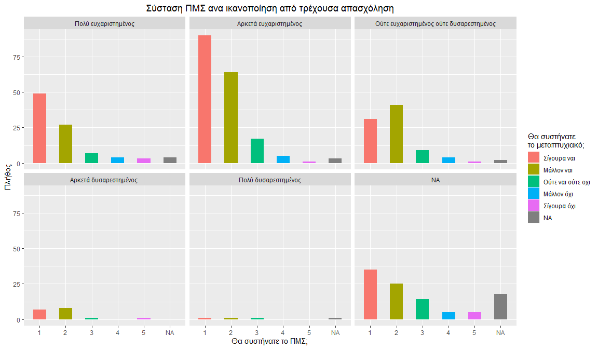

This is my first Markdown Document! \#md\_document: \#variant:
markdown\_github

Let’s load some libraries
-------------------------

    ## Warning: package 'foreign' was built under R version 3.6.3

    ## 
    ## Attaching package: 'dplyr'

    ## The following objects are masked from 'package:stats':
    ## 
    ##     filter, lag

    ## The following objects are masked from 'package:base':
    ## 
    ##     intersect, setdiff, setequal, union

### Now let’s load the data

First we will find all the missing values
=========================================

``` r
Missing_values<-data.frame(sort(sapply(data,function(x) sum(is.na(x))),decreasing = TRUE))
knitr::kable(Missing_values, format = "html", table.attr = "style='width:10%;'")
```

<table style='width:10%;'>
<thead>
<tr>
<th style="text-align:left;">
</th>
<th style="text-align:right;">
sort.sapply.data..function.x..sum.is.na.x…..decreasing…TRUE.
</th>
</tr>
</thead>
<tbody>
<tr>
<td style="text-align:left;">
Q7
</td>
<td style="text-align:right;">
102
</td>
</tr>
<tr>
<td style="text-align:left;">
submitdate
</td>
<td style="text-align:right;">
28
</td>
</tr>
<tr>
<td style="text-align:left;">
Q13
</td>
<td style="text-align:right;">
28
</td>
</tr>
<tr>
<td style="text-align:left;">
Q10\_1
</td>
<td style="text-align:right;">
26
</td>
</tr>
<tr>
<td style="text-align:left;">
Q10\_2
</td>
<td style="text-align:right;">
26
</td>
</tr>
<tr>
<td style="text-align:left;">
Q10\_3
</td>
<td style="text-align:right;">
26
</td>
</tr>
<tr>
<td style="text-align:left;">
Q10\_4
</td>
<td style="text-align:right;">
26
</td>
</tr>
<tr>
<td style="text-align:left;">
Q10\_5
</td>
<td style="text-align:right;">
26
</td>
</tr>
<tr>
<td style="text-align:left;">
Q10\_6
</td>
<td style="text-align:right;">
26
</td>
</tr>
<tr>
<td style="text-align:left;">
Q10\_7
</td>
<td style="text-align:right;">
26
</td>
</tr>
<tr>
<td style="text-align:left;">
Q10\_8
</td>
<td style="text-align:right;">
26
</td>
</tr>
<tr>
<td style="text-align:left;">
Q9\_SQ001
</td>
<td style="text-align:right;">
21
</td>
</tr>
<tr>
<td style="text-align:left;">
Q9\_SQ002
</td>
<td style="text-align:right;">
21
</td>
</tr>
<tr>
<td style="text-align:left;">
Q9\_SQ003
</td>
<td style="text-align:right;">
21
</td>
</tr>
<tr>
<td style="text-align:left;">
Q9\_SQ004
</td>
<td style="text-align:right;">
21
</td>
</tr>
<tr>
<td style="text-align:left;">
Q9\_SQ005
</td>
<td style="text-align:right;">
21
</td>
</tr>
<tr>
<td style="text-align:left;">
Q9\_SQ006
</td>
<td style="text-align:right;">
21
</td>
</tr>
<tr>
<td style="text-align:left;">
Q9\_SQ007
</td>
<td style="text-align:right;">
21
</td>
</tr>
<tr>
<td style="text-align:left;">
Q9\_SQ008
</td>
<td style="text-align:right;">
21
</td>
</tr>
<tr>
<td style="text-align:left;">
Q9\_SQ009
</td>
<td style="text-align:right;">
21
</td>
</tr>
<tr>
<td style="text-align:left;">
Q9\_SQ010
</td>
<td style="text-align:right;">
21
</td>
</tr>
<tr>
<td style="text-align:left;">
Q9\_SQ011
</td>
<td style="text-align:right;">
21
</td>
</tr>
<tr>
<td style="text-align:left;">
Q9\_SQ012
</td>
<td style="text-align:right;">
21
</td>
</tr>
<tr>
<td style="text-align:left;">
Q9\_SQ013
</td>
<td style="text-align:right;">
21
</td>
</tr>
<tr>
<td style="text-align:left;">
Q9\_SQ014
</td>
<td style="text-align:right;">
21
</td>
</tr>
<tr>
<td style="text-align:left;">
Q9\_SQ015
</td>
<td style="text-align:right;">
21
</td>
</tr>
<tr>
<td style="text-align:left;">
Q9\_SQ016
</td>
<td style="text-align:right;">
21
</td>
</tr>
<tr>
<td style="text-align:left;">
Q9\_SQ017
</td>
<td style="text-align:right;">
21
</td>
</tr>
<tr>
<td style="text-align:left;">
Q8
</td>
<td style="text-align:right;">
14
</td>
</tr>
<tr>
<td style="text-align:left;">
Q6
</td>
<td style="text-align:right;">
12
</td>
</tr>
<tr>
<td style="text-align:left;">
Emplmnt
</td>
<td style="text-align:right;">
12
</td>
</tr>
<tr>
<td style="text-align:left;">
filter\_.
</td>
<td style="text-align:right;">
2
</td>
</tr>
<tr>
<td style="text-align:left;">
Q4
</td>
<td style="text-align:right;">
1
</td>
</tr>
<tr>
<td style="text-align:left;">
Gradyear
</td>
<td style="text-align:right;">
1
</td>
</tr>
<tr>
<td style="text-align:left;">
Grad2cats
</td>
<td style="text-align:right;">
1
</td>
</tr>
<tr>
<td style="text-align:left;">
emailstatus
</td>
<td style="text-align:right;">
0
</td>
</tr>
<tr>
<td style="text-align:left;">
language
</td>
<td style="text-align:right;">
0
</td>
</tr>
<tr>
<td style="text-align:left;">
sent
</td>
<td style="text-align:right;">
0
</td>
</tr>
<tr>
<td style="text-align:left;">
remindersent
</td>
<td style="text-align:right;">
0
</td>
</tr>
<tr>
<td style="text-align:left;">
remindercount
</td>
<td style="text-align:right;">
0
</td>
</tr>
<tr>
<td style="text-align:left;">
usesleft
</td>
<td style="text-align:right;">
0
</td>
</tr>
<tr>
<td style="text-align:left;">
id
</td>
<td style="text-align:right;">
0
</td>
</tr>
<tr>
<td style="text-align:left;">
token
</td>
<td style="text-align:right;">
0
</td>
</tr>
<tr>
<td style="text-align:left;">
lastpage
</td>
<td style="text-align:right;">
0
</td>
</tr>
<tr>
<td style="text-align:left;">
startlanguage
</td>
<td style="text-align:right;">
0
</td>
</tr>
<tr>
<td style="text-align:left;">
ipaddr
</td>
<td style="text-align:right;">
0
</td>
</tr>
<tr>
<td style="text-align:left;">
Q1
</td>
<td style="text-align:right;">
0
</td>
</tr>
<tr>
<td style="text-align:left;">
Q2
</td>
<td style="text-align:right;">
0
</td>
</tr>
<tr>
<td style="text-align:left;">
Q3
</td>
<td style="text-align:right;">
0
</td>
</tr>
<tr>
<td style="text-align:left;">
Q5\_SQ001
</td>
<td style="text-align:right;">
0
</td>
</tr>
<tr>
<td style="text-align:left;">
Q11\_SQ001
</td>
<td style="text-align:right;">
0
</td>
</tr>
<tr>
<td style="text-align:left;">
Q11\_SQ002
</td>
<td style="text-align:right;">
0
</td>
</tr>
<tr>
<td style="text-align:left;">
Q11\_SQ003
</td>
<td style="text-align:right;">
0
</td>
</tr>
<tr>
<td style="text-align:left;">
Q11\_SQ004
</td>
<td style="text-align:right;">
0
</td>
</tr>
<tr>
<td style="text-align:left;">
Q11\_SQ005
</td>
<td style="text-align:right;">
0
</td>
</tr>
<tr>
<td style="text-align:left;">
Q11\_SQ006
</td>
<td style="text-align:right;">
0
</td>
</tr>
<tr>
<td style="text-align:left;">
Q12\_SQ001
</td>
<td style="text-align:right;">
0
</td>
</tr>
<tr>
<td style="text-align:left;">
Q12\_SQ002
</td>
<td style="text-align:right;">
0
</td>
</tr>
<tr>
<td style="text-align:left;">
Q12\_SQ003
</td>
<td style="text-align:right;">
0
</td>
</tr>
<tr>
<td style="text-align:left;">
Q12\_SQ004
</td>
<td style="text-align:right;">
0
</td>
</tr>
<tr>
<td style="text-align:left;">
Q12\_SQ005
</td>
<td style="text-align:right;">
0
</td>
</tr>
<tr>
<td style="text-align:left;">
Q12\_SQ006
</td>
<td style="text-align:right;">
0
</td>
</tr>
<tr>
<td style="text-align:left;">
Q12\_SQ007
</td>
<td style="text-align:right;">
0
</td>
</tr>
<tr>
<td style="text-align:left;">
Age
</td>
<td style="text-align:right;">
0
</td>
</tr>
<tr>
<td style="text-align:left;">
Age2cats
</td>
<td style="text-align:right;">
0
</td>
</tr>
<tr>
<td style="text-align:left;">
age2017
</td>
<td style="text-align:right;">
0
</td>
</tr>
</tbody>
</table>

Now let’s try some plots
========================


    ## Loading required package: grid


Γραφήματα που αφορούν την επιλογή των απόφοιτων για τη σύσταση του μεταπτυχιακού σε τρίτους
-------------------------------------------------------------------------------------------

``` r
ggplot(data, aes(x = factor(Q13))) +  
  geom_bar(aes(y = (..count..)/sum(..count..), fill = factor(Q13))) + 
  geom_text(aes( label = scales::percent((..count..)/sum(..count..)),
                 y=(..count..)/sum(..count..) ), stat= "count", vjust = -.3) +
  scale_y_continuous(labels = percent) + 
  labs(title='Θα συστήνατε το μεταπτυχιακό;', x='Απάντηση',y='Πλήθος',
       fill='Θα συστήνατε 
το μεταπτυχιακό?')+
  theme(plot.title = element_text(hjust = 0.5))+
  scale_x_discrete(labels=c('Σίγουρα ναι','Μάλλον ναι','Ούτε ναι ούτε όχι','Μάλλον όχι','Σίγουρα όχι'))+
scale_fill_discrete(labels=c('Σίγουρα ναι','Μάλλον ναι','Ούτε ναι ούτε όχι','Μάλλον όχι','Σίγουρα όχι'))
```





### Στο παρακάτω γράφημα η τελευταία κατηγορία (ΝΑ)

### αποτελείται κυρίως από τα άτομα που δεν εργάζονται




### Στο παρακάτω γράφημα παρατηρούμε οτι το τμήμα πολιτικής επιστήμης έχει συγκριτικά με τα υπόλοιπα τμήματα μεγαλύτερη συμβολή στην εύρεση εργασίας


