This is my first Markdown Document!

Let’s load some data

``` r
library(foreign)
```

    ## Warning: package 'foreign' was built under R version 3.6.3

``` r
library(knitr)
library(ggplot2)
library(scales)
source("http://peterhaschke.com/Code/multiplot.R")

data <- read.spss("C:/Users/User/Desktop/Άγγελος/ΕΛΚΕ/Έρευνα/sodanet/My-encoding.sav",use.value.labels = FALSE, to.data.frame=TRUE)

#file.choose()
dataset.labels <- as.data.frame(attr(data, "variable.labels"))
knitr::kable(dataset.labels, caption = "Labels table", floating.environment="sidewaystable")
```

|               | attr(data, “variable.labels”)                                                                                                                      |
|---------------|:---------------------------------------------------------------------------------------------------------------------------------------------------|
| emailstatus   | Κατάσταση email                                                                                                                                    |
| language      | Κωδικός γλώσσας                                                                                                                                    |
| sent          | Ημερομηνία αποστολής πρόσκλησης                                                                                                                    |
| remindersent  | Ημερομηνία αποστολής τελευταίας υπενθύμισης                                                                                                        |
| remindercount | Συνολικός αριθμός απεσταλμένων υπενθυμίσεων                                                                                                        |
| usesleft      | Χρήσεις που απομένουν                                                                                                                              |
| id            | id                                                                                                                                                 |
| token         | token                                                                                                                                              |
| submitdate    | submitdate                                                                                                                                         |
| lastpage      | lastpage                                                                                                                                           |
| startlanguage | startlanguage                                                                                                                                      |
| ipaddr        | ipaddr                                                                                                                                             |
| Q1            | Φύλο                                                                                                                                               |
| Q2            | Παρακαλώ, εισαγάγετε το έτος γέννησής σας.                                                                                                         |
| Q3            | Ποιο Πρόγραμμα Μεταπτυχιακών Σπουδών (ΠΜΣ) παρακολουθήσατε;                                                                                        |
| Q4            | Ποιο έτος αποφοιτήσατε από το ανωτέρω ΠΜΣ;                                                                                                         |
| Q5\_SQ001     | \[Βαθμός ικανοποίησης από το ΠΜΣ\] Πόσο ικανοποιημένος/η μείνατε από τις σπουδές σας στο ανωτέρω ΠΜΣ, σε μια κλίμακα από 1 έως 10, όπου 1 σημαίνει |
| Q6            | Αυτή την περίοδο εργάζεστε και, αν ναι, ποια είναι η θέση σας στην απασχόληση;                                                                     |
| Q7            | Και πόσο ικανοποιημένος/η θα λέγατε ότι είστε από την τρέχουσα απασχόλησή σας;                                                                     |
| Q8            | Πόσο σχετικό θεωρείτε το αντικείμενο της τρέχουσας/πιο πρόσφατης εργασίας σας με τις μεταπτυχιακές σπουδές σας;                                    |
| Q9\_SQ001     | \[Ικανότητα αναλυτικής και θεωρητικής σκέψης\] Πόσο θεωρείτε ότι συνέβαλαν οι σπουδές σας στο ανωτέρω ΠΜΣ;                                         |
| Q9\_SQ002     | \[Εύρεση εργασίας\] Πόσο θεωρείτε ότι συνέβαλαν οι σπουδές σας στο ανωτέρω ΠΜΣ σε κάθε έναν από τους παρακάτω τομείς;                              |
| Q9\_SQ003     | \[Εργασιακή εξέλιξη (προαγωγές κλπ)\] Πόσο θεωρείτε ότι συνέβαλαν οι σπουδές σας στο ανωτέρω ΠΜΣ σε κάθε έναν από τους παρακάτω τομείς;            |
| Q9\_SQ004     | \[Μισθολογική εξέλιξη\] Πόσο θεωρείτε ότι συνέβαλαν οι σπουδές σας στο ανωτέρω ΠΜΣ σε κάθε έναν από τους παρακάτω τομείς;                          |
| Q9\_SQ005     | \[Διατύπωση πρωτότυπων ιδεών\] Πόσο θεωρείτε ότι συνέβαλαν οι σπουδές σας στο ανωτέρω ΠΜΣ σε κάθε έναν από τους παρακάτω τομείς;                   |
| Q9\_SQ006     | \[Κατανόηση σημασίας επιστήμης και έρευνας\] Πόσο θεωρείτε ότι συνέβαλαν οι σπουδές σας στο ανωτέρω ΠΜΣ σε κάθε έναν από τους παρακάτω τομείς;     |
| Q9\_SQ007     | \[Σε βάθος γνώση ενός συγκεκριμένου επιστημονικού πεδίου\] Πόσο θεωρείτε ότι συνέβαλαν οι σπουδές σας στο ανωτέρω ΠΜΣ σε κάθε έναν από τους πα     |
| Q9\_SQ008     | \[Ικανότητα δουλειάς ως μέλος μιας ομάδας\] Πόσο θεωρείτε ότι συνέβαλαν οι σπουδές σας στο ανωτέρω ΠΜΣ σε κάθε έναν από τους παρακάτω τομείς;      |
| Q9\_SQ009     | \[Ηγετικές ικανότητες\] Πόσο θεωρείτε ότι συνέβαλαν οι σπουδές σας στο ανωτέρω ΠΜΣ σε κάθε έναν από τους παρακάτω τομείς;                          |
| Q9\_SQ010     | \[Ικανότητα συγγραφής εργασιών/αναφορών\] Πόσο θεωρείτε ότι συνέβαλαν οι σπουδές σας;                                                              |
| Q9\_SQ011     | \[Πολιτική συμμετοχή\] Πόσο θεωρείτε ότι συνέβαλαν οι σπουδές σας στο ανωτέρω ΠΜΣ σε κάθε έναν από τους παρακάτω τομείς;                           |
| Q9\_SQ012     | \[Συμμετοχή σε θεσμούς και οργανώσεις της κοινωνίας πολιτών\] Πόσο θεωρείτε ότι συνέβαλαν οι σπουδές σας στο ανωτέρω ΠΜΣ σε κάθε έναν από τους     |
| Q9\_SQ013     | \[Ικανότητα παρουσίασης και δημόσιας ομιλίας\] Πόσο θεωρείτε ότι συνέβαλαν οι σπουδές σας στο ανωτέρω ΠΜΣ;                                         |
| Q9\_SQ014     | \[Κατανόηση πολιτικών, κοινωνικών και οικονομικών προβλημάτων\] Πόσο θεωρείτε ότι συνέβαλαν οι σπουδές σας στο ανωτέρω ΠΜΣ;                        |
| Q9\_SQ015     | \[Χρήση ερευνητικών μεθόδων\] Πόσο θεωρείτε ότι συνέβαλαν οι σπουδές σας στο ανωτέρω ΠΜΣ σε κάθε έναν από τους παρακάτω τομείς;                    |
| Q9\_SQ016     | \[Κατανόηση λειτουργίας διεθνούς και ευρωπαϊκού περιβάλλοντος\] Πόσο θεωρείτε ότι συνέβαλαν οι σπουδές σας στο ανωτέρω ΠΜΣ σε κάθε έναν από τ      |
| Q9\_SQ017     | \[Προσωπική ολοκλήρωση\] Πόσο θεωρείτε ότι συνέβαλαν οι σπουδές σας στο ανωτέρω ΠΜΣ σε κάθε έναν από τους παρακάτω τομείς;                         |
| Q10\_1        | \[Απόκτηση συγκεκριμένων επαγγελματικών δεξιοτήτων\] Και για κάθε έναν από τους παρακάτω τομείς, θα προτιμούσατε η έμφαση του ΠΜΣ να αυξηθεί,      |
| Q10\_2        | \[Διδασκαλία μεθόδων συλλογής και ανάλυσης ερευνητικών δεδομένων\] Έμφαση ΠΜΣ                                                                      |
| Q10\_3        | \[Διδασκαλία θεωρητικών μοντέλων/επιστημονικών παραδειγμάτων/σχολών σκέψης\] Έμφαση ΠΜΣ                                                            |
| Q10\_4        | \[Σύνδεση με άλλα πανεπιστήμια/πανεπιστημιακά τμήματα\] Και για κάθε έναν από τους παρακάτω τομείς, θα προτιμούσατε η έμφαση του ΠΜΣ να αυξηθε     |
| Q10\_5        | \[Σύνδεση με την κοινωνία των πολιτών\] Και για κάθε έναν από τους παρακάτω τομείς, θα προτιμούσατε η έμφαση του ΠΜΣ να αυξηθεί, να παραμείνει ω   |
| Q10\_6        | \[Διοργάνωση επιστημονικών εκδηλώσεων (συνέδρια, ημερίδες, ομιλίες κλπ)\] Και για κάθε έναν από τους παρακάτω τομείς, θα προτιμούσατε η έμφαση     |
| Q10\_7        | \[Συνεργασία/επαφή με τους/τις διδάσκοντες/ουσες\] Και για κάθε έναν από τους παρακάτω τομείς, θα προτιμούσατε η έμφαση του ΠΜΣ να αυξηθεί, να π   |
| Q10\_8        | \[Συνεργασία μεταξύ των φοιτητών/φοιτητριών\] Και για κάθε έναν από τους παρακάτω τομείς, θα προτιμούσατε η έμφαση του ΠΜΣ να αυξηθεί, να παραμ    |
| Q11\_SQ001    | \[Όχι\] Μετά την ολοκλήρωση του ανωτέρω ΠΜΣ, συνεχίσατε τις σπουδές σας;                                                                           |
| Q11\_SQ002    | \[Ναι, διδακτορικό στην Ελλάδα\] Μετά την ολοκλήρωση του ανωτέρω ΠΜΣ, συνεχίσατε τις σπουδές σας;                                                  |
| Q11\_SQ003    | \[Ναι, διδακτορικό στο εξωτερικό\] Μετά την ολοκλήρωση του ανωτέρω ΠΜΣ, συνεχίσατε τις σπουδές σας;                                                |
| Q11\_SQ004    | \[Ναι, άλλο ΠΜΣ στην Ελλάδα\] Μετά την ολοκλήρωση του ανωτέρω ΠΜΣ, συνεχίσατε τις σπουδές σας;                                                     |
| Q11\_SQ005    | \[Ναι, άλλο ΠΜΣ στο εξωτερικό\] Μετά την ολοκλήρωση του ανωτέρω ΠΜΣ, συνεχίσατε τις σπουδές σας;                                                   |
| Q11\_SQ006    | \[Ναι, προπτυχιακές σπουδές σε άλλο αντικείμενο\] Μετά την ολοκλήρωση του ανωτέρω ΠΜΣ, συνεχίσατε τις σπουδές σας;                                 |
| Q12\_SQ001    | \[Όχι.\] Μετά την ολοκλήρωση του ανωτέρω ΠΜΣ, είχατε κάποια επιστημονική-ακαδημαϊκή δραστηριότητα (μόνος/η ή και από κοινού με κάποιον/α συνάδε    |
| Q12\_SQ002    | \[Συγγραφή βιβλίου\] Μετά την ολοκλήρωση του ανωτέρω ΠΜΣ, είχατε κάποια επιστημονική-ακαδημαϊκή δραστηριότητα (μόνος/η ή και από κοινού με κάπ     |
| Q12\_SQ003    | \[Συγγραφή επιστημονικού άρθρου σε επιστημονικό περιοδικό με τυφλή αξιολόγηση\] Μετά την ολοκλήρωση του ανωτέρω ΠΜΣ, είχατε κάποια επιστημον       |
| Q12\_SQ004    | \[Συγγραφή επιστημονικού άρθρου σε επιστημονικό περιοδικό χωρίς τυφλή αξιολόγηση\] Μετά την ολοκλήρωση του ανωτέρω ΠΜΣ, είχατε κάποια επιστη       |
| Q12\_SQ005    | \[Συμμετοχή σε συνέδριο με ανακοίνωση\] Μετά την ολοκλήρωση του ανωτέρω ΠΜΣ, είχατε κάποια επιστημονική-ακαδημαϊκή δραστηριότητα (μόνος/η ή κ      |
| Q12\_SQ006    | \[Συμβολή σε συλλογικό τόμο\] Μετά την ολοκλήρωση του ανωτέρω ΠΜΣ, είχατε κάποια επιστημονική-ακαδημαϊκή δραστηριότητα (μόνος/η ή κ                |
| Q12\_SQ007    | Συγγραφή άρθρου γενικού πολιτικού, κοινωνικού, οικονομικού, επιστημονικού ενδιαφέροντος σε εφημερίδα-περιοδικό-διαδικτυακό τόπο                    |
| Q13           | Θα προτείνατε το ανωτέρω ΠΜΣ;                                                                                                                      |
| Emplmnt       | Θέση στην Απασχόληση                                                                                                                               |
| Age           | Ηλικία                                                                                                                                             |
| Gradyear      | Έτος Αποφοίτησης                                                                                                                                   |
| filter\_$     | Q3 = 1 and Emplmnt \< 16 (FILTER)                                                                                                                  |
| Age2cats      |                                                                                                                                                    |
| Grad2cats     |                                                                                                                                                    |
| age2017       | Ηλικία σε έτη                                                                                                                                      |

Let’s try some plots

``` r
p1<-ggplot(data, aes(x = factor(Q1))) +  
  geom_bar(aes(y = (..count..)/sum(..count..), fill = factor(Q1))) + 
  geom_text(aes( label = scales::percent((..count..)/sum(..count..)),
                 y=(..count..)/sum(..count..) ), stat= "count", vjust = -.3) +
  scale_y_continuous(labels = percent) +
  labs(title='Ποσοστό Φύλων', x='Φύλο',y='Ποσοστό')+
  theme(plot.title = element_text(hjust = 0.5))+
  scale_x_discrete(labels=c('Γυναίκες','Άνδρες'))+
  scale_fill_discrete(name = "Φύλο", 
                       labels=c("Γυναίκες", "Άνδρες"))


p2<-ggplot(data, aes(x = factor(Age))) +  
  geom_bar(aes(y = (..count..)/sum(..count..), fill = factor(Age))) + 
  geom_text(aes( label = scales::percent((..count..)/sum(..count..)),
                 y=(..count..)/sum(..count..) ), stat= "count", vjust = -.3) +
  scale_y_continuous(labels = percent) +
  labs(title='Ποσοστό Ηλικίας', x='Ηλικία',y='Ποσοστό')+
  theme(plot.title = element_text(hjust = 0.5))+
  scale_x_discrete(labels=c('25-29','30-34','35-39','40+'))+
  scale_fill_discrete(name = "Ηλικία", 
                      labels=c('25-29','30-34','35-39','40+'))


multiplot(p1, p2, cols=2)
```

    ## Loading required package: grid

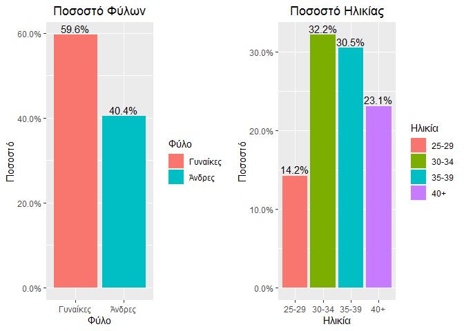

``` r
library(ggplot2)
library(scales)
ggplot(data, aes(x = factor(Q13),fill = factor(Q8))) +  
  geom_bar(aes(y = (..count..)/sum(..count..))) + 
  scale_y_continuous(labels = percent)+
  labs(title='Συνάφεια ΠΜΣ με εργασία και σύσταση ΠΜΣ', x='Θα προτείνατε το ΠΜΣ;',y='Ποσοστό',
       fill='Συνάφεια με εργασία')+
  theme(plot.title = element_text(hjust = 0.5))+
  scale_x_discrete(labels=c('Σίγουρα ναι','Μάλλον ναι','Ούτε ναι ούτε όχι','Μάλλον όχι','Σίγουρα όχι'))+
scale_fill_manual(values=c("darkred","red","blue","green4","darkgreen","yellow"),
  labels = c("Πολύ ", "Αρκετά ", "Όχι και τόσο ", "Καθόλου ", "Δεν έχω εργαστεί",'NA'))
```

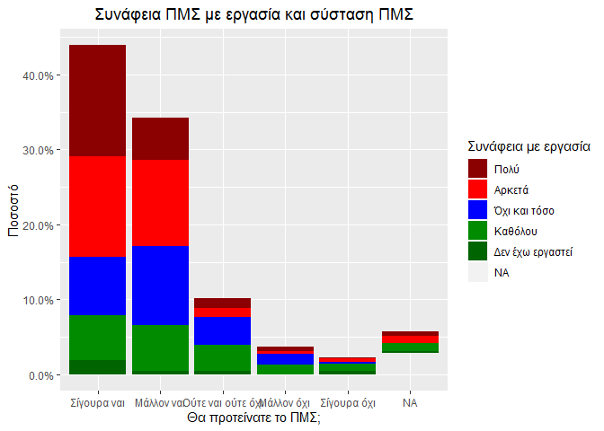

``` r
source("http://peterhaschke.com/Code/multiplot.R")


ggplot(data, aes(x = factor(Gradyear))) +  
  geom_bar(aes(y = (..count..)/sum(..count..), fill = factor(Gradyear))) + 
  geom_text(aes( label = scales::percent((..count..)/sum(..count..)),
                 y=(..count..)/sum(..count..) ), stat= "count", vjust = -.3) +
  scale_y_continuous(labels = percent) +
  labs(title='Έτος Αποφοίτησης', x='Graduation Year',y='Percent')+
  theme(plot.title = element_text(hjust = 0.5))+
  scale_x_discrete(labels=c('1997-2002','2003-2007','2008-2012','2013-2017'))+
  scale_fill_discrete(name = "Φύλο", 
                      labels=c('1997-2002','2003-2007','2008-2012','2013-2017'))
```

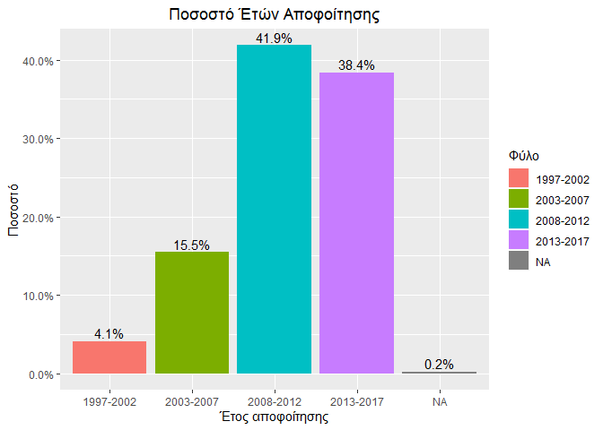

``` r
p1<-ggplot(data, aes(x = factor(Q1))) +  
  geom_bar(aes(y = (..count..)/sum(..count..), fill = factor(Q1))) + 
  geom_text(aes( label = scales::percent((..count..)/sum(..count..)),
                 y=(..count..)/sum(..count..) ), stat= "count", vjust = -.3) +
  scale_y_continuous(labels = percent) +
  labs(title='Ποσοστό Φύλων', x='Φύλο',y='Ποσοστό')+
  theme(plot.title = element_text(hjust = 0.5))+
  scale_x_discrete(labels=c('Γυναίκες','Άνδρες'))+
  scale_fill_discrete(name = "Φύλο", 
                       labels=c("Γυναίκες", "Άνδρες"))


p2<-ggplot(data, aes(x = factor(Age))) +  
  geom_bar(aes(y = (..count..)/sum(..count..), fill = factor(Age))) + 
  geom_text(aes( label = scales::percent((..count..)/sum(..count..)),
                 y=(..count..)/sum(..count..) ), stat= "count", vjust = -.3) +
  scale_y_continuous(labels = percent) +
  labs(title='Ποσοστό Ηλικίας', x='Ηλικία',y='Ποσοστό')+
  theme(plot.title = element_text(hjust = 0.5))+
  scale_x_discrete(labels=c('25-29','30-34','35-39','40+'))+
  scale_fill_discrete(name = "Ηλικία", 
                      labels=c('25-29','30-34','35-39','40+'))


multiplot(p1, p2, cols=2)
```

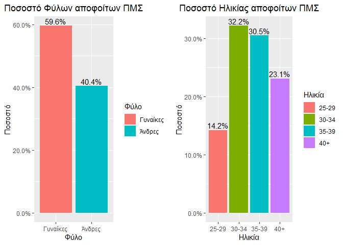

``` r
table(data$Q6)
```

    ## 
    ##   1   2   3   4   5   6   7   8   9  10  16  17  18  19 
    ##  48  75   2 164   3  11  36  43   1   2  46   3  25  14

``` r
round(sapply(table(as.factor(data$Emplmnt)),function(x) x/nrow(data)*100),1)
```

    ##    1    2    4    7    8   16   17 
    ## 10.9 17.7 34.4  7.4  8.9 14.6  3.5

``` r
#To idio afairwntas ta na's
round(sapply(table(as.factor(data$Emplmnt)),function(x) x/length(which(!is.na(data$Q6)))*100),1)
```

    ##    1    2    4    7    8   16   17 
    ## 11.2 18.2 35.3  7.6  9.1 15.0  3.6

``` r
data.frame(attr(data$Emplmnt,"value.labels"))
```

    ##                                                                                                                         attr.data.Emplmnt...value.labels..
    ## Σπουδάζουν/δεν εργάζονται και δεν αναζητούν εργασία                                                                                                     17
    ## Άνεργοι/ες                                                                                                                                              16
    ## Μη χειρώνακτες υπάλληλοι μεσαίας/κατώτερης βαθμίδας, (σερβιτόροι, ταμίες, αστυνομικοί κλπ)                                                               8
    ## Μη χειρώνακτες υπάλληλοι ανώτερης βαθμίδας (πχ διευθυντές πωλήσεων)                                                                                      7
    ## Επιστημονικά και τεχνικά επαγγέλματα (δάσκαλοι, τεχνικοί υπολογιστών κλπ)                                                                                4
    ## Ανώτερο διοικητικό στέλεχος δημόσιου/ιδιωτικού τομέα, Διευθυντής/Διευθύντρια μεγάλων βιομηχανιών, Ανώτατοι αξιωματικοί.                                  2
    ## Εργοδότες/Αυτοαπασχολούμενοι                                                                                                                             1

``` r
#As kanoume ena grafima pou afora tin aksiologisi ana filo


data$Q13
```

    ##   [1]  5  2  1  1  4  2  1  1  2  1  2 NA  1  2  2  1  1  1  4  1  2  1  3
    ##  [24]  1  1  1  1  2  1  2  1  1  4  1  2  1  2  1  1  2  1  2  1  1  1  1
    ##  [47]  3  2  2  2  2  1  1  1  2  2  2  1  1  5  3  1  3  1  2  1  1 NA  1
    ##  [70]  1  1 NA  3  1  2  1  1  1  1  2  1  3  3  1 NA  1  2  1  4  1  2  1
    ##  [93]  4  2  1  4  1  2  2  4  3  1  2  2  3  1  2  1  1  5  1  2  2  1  2
    ## [116]  2  2  1  3  1 NA  3  2  1  2  2  1  1  4  1  1  2  2  3  3  2  2  3
    ## [139]  1  1  1  1  1  1  1  1  2  5  2  1  1  1  1  2  1  2  2  1  1  1  1
    ## [162]  3  3  1  1  1  2  1 NA  2  1  1  2  2  3  1  2  1 NA  1  2  2  2 NA
    ## [185]  2  1  2  3  2  2  5  2  1  1  3  4  2  1  1  2  3  1  2  1  2  1  1
    ## [208]  1  2  2  5  1  2  3  2  1  1  1  1  2  2  1  1  1  2  2  2  2  1 NA
    ## [231]  3  1  2  3  1  2  1  1  2  2  2  1 NA  1  1  3  3  2  1  2  3  2  3
    ## [254]  3 NA  3  2  3  1  1  2  3  1  5  1  3  2  2  3  1  1  2  2  2  1  2
    ## [277]  1  2  2  4  3  2  2  2  2  2  2  1  2  2  1  1  2  2  2  2  1  1  1
    ## [300]  4  1  1  2  1  1  1  1  2  2  3  1  2  2  2  1  4  1  2  1  4  3  2
    ## [323] NA  4  2  2  1  3  2  1  3  2  1  1  1  2  2 NA  1  2  1  2  1  2  2
    ## [346]  1  1  2  3  1 NA  1  2  2  2  1  1  1  2 NA  1  5  2  1  2 NA  1  1
    ## [369]  1  2  3  2  1  2  3  1  1  1  3  2  2  2  1  2  1  1  2  2 NA  2 NA
    ## [392]  1  1  1 NA  1  2  1  3 NA  2  1 NA  1  1  1  1  3  2  1 NA  1  2  5
    ## [415]  1  1  2  2  1  5  1  3  1  1  2  1  2  4  1 NA  2  1  4  1  1  4  2
    ## [438]  1  2  1  1  1  1  1 NA  1  3 NA  1  1  2  2 NA  2  1  3  2  2  1  1
    ## [461]  1 NA NA  3  2  1  5  2  1  2  2  3  1  2  1  2  1  2  2  1  2  1  2
    ## [484]  1  4
    ## attr(,"value.labels")
    ##       Σίγουρα όχι        Μάλλον όχι Ούτε ναι ούτε όχι        Μάλλον ναι 
    ##                 5                 4                 3                 2 
    ##       Σίγουρα ναι 
    ##                 1

``` r
ggplot(data, aes(x = factor(Q13),fill=factor(Q13))) +  
  geom_bar(width=0.5) + 
  labs(fill='Θα συστήνατε?')
```

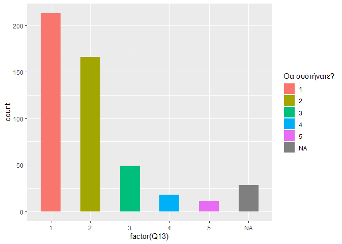

``` r
plot(as.factor(data$Q13))
```

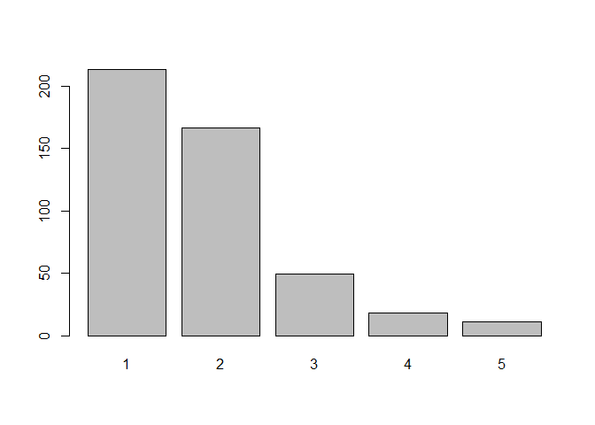

``` r
table(as.factor(data$Q13))
```

    ## 
    ##   1   2   3   4   5 
    ## 213 166  49  18  11

``` r
sapply(table(as.factor(data$Q13)),function(x) x/nrow(data)*100)
```

    ##         1         2         3         4         5 
    ## 43.917526 34.226804 10.103093  3.711340  2.268041

``` r
#######
plot(factor(data$Q1))
```

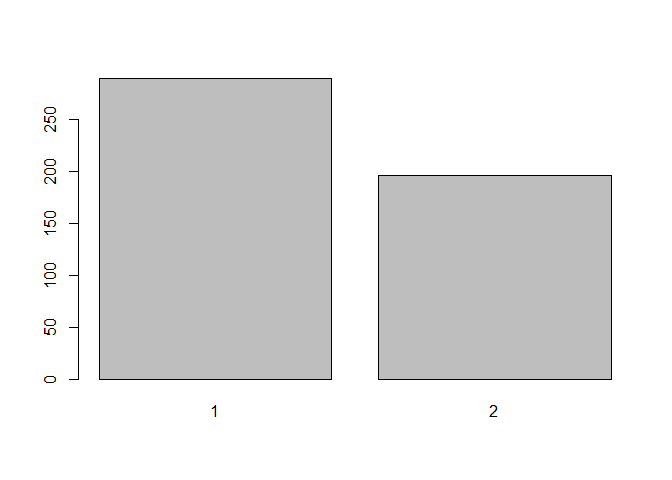

``` r
sapply(table(as.factor(data$Q1)),function(x) x/nrow(data)*100)
```

    ##        1        2 
    ## 59.58763 40.41237

``` r
ggplot(data, aes(x = factor(Q13),fill=factor(Q1))) +  
  geom_bar(width=0.5) + 
  facet_wrap(~factor(Q5_SQ001))+
  labs(fill='Gender')
```

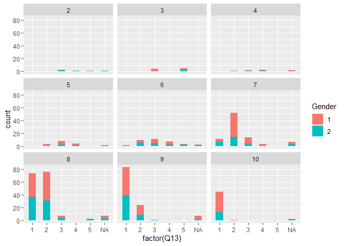

``` r
  ggplot(data, aes(x = factor(Q13),fill=factor(Q1))) +  
    geom_bar(width=0.5) + 
    facet_wrap(~factor(Age))+
  labs(fill='Gender')
```

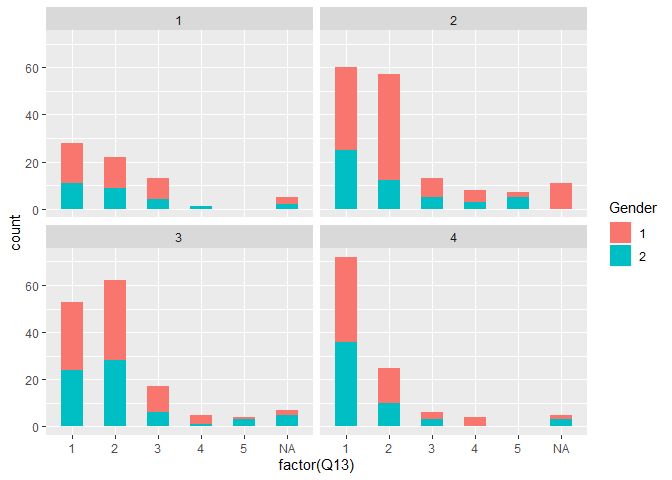

``` r
  #LABELS AGE#
  ggplot(data, aes(x = factor(Q13),fill=factor(Q1))) +  
    geom_bar(width=0.5) + 
    labs(title='Γνώμη για σύσταση ΠΜΣ ανά Ηλικίακή ομάδα', x='Γνώμη',y='Πλήθος')+
    facet_wrap(~factor(Age))+
    theme(plot.title = element_text(hjust = 0.5))+
    scale_x_discrete(labels = c("Σίγουρα ναι", "Μάλλον ναι", "Ούτε ναι ούτε οχι", "Μάλλον όχι", "Σίγουρα όχι"))+
    scale_fill_discrete(name = "Φύλο", 
                        labels=c("Γυναίκες", "Άνδρες"))
```

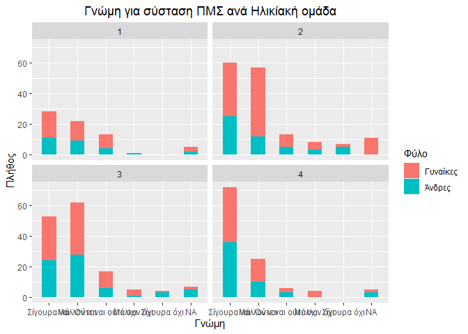

``` r
  ggplot(data, aes(x = factor(Q13),fill=factor(Q1))) +  
    geom_bar(width=0.5) + 
    facet_wrap(~factor(Age2cats))+
  labs(fill='Gender')
```

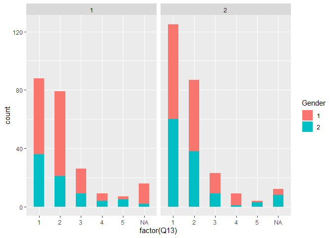

``` r
  ggplot(data, aes(x = factor(Q13),fill=factor(Q1))) +  
    geom_bar(width=0.5) + 
    facet_wrap(~factor(Q7))+
    labs(fill='Gender')
```

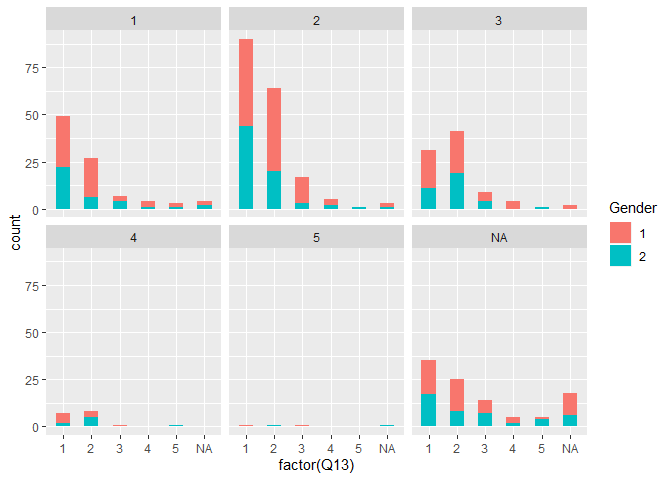

``` r
  ggplot(data, aes(x = factor(Q13),fill=factor(Q1))) +  
    geom_bar(width=0.5) + 
    facet_wrap(~factor(language))+
    labs(fill='Gender')
```

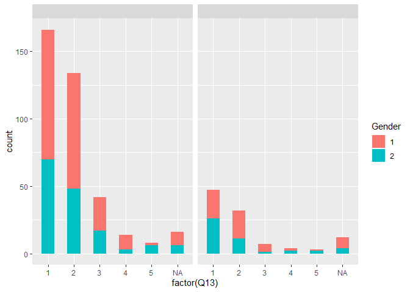

``` r
  ggplot(data, aes(x = factor(Q13),fill=factor(Q1))) +  
    geom_bar(width=0.5) + 
    facet_wrap(~ factor(Q3))+
    labs(fill='Gender')
```

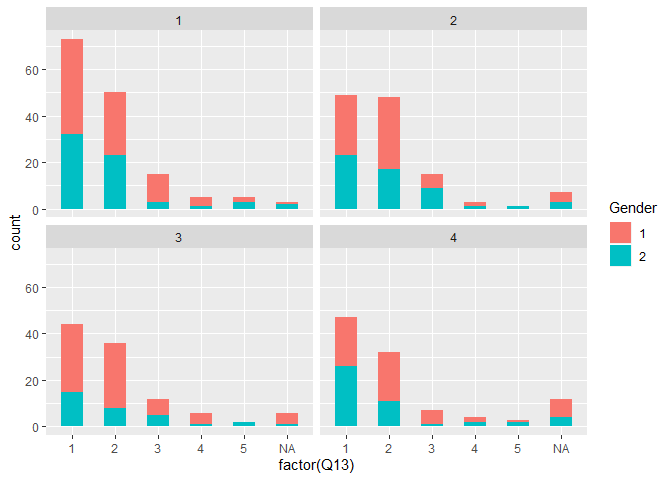

``` r
  ggplot(data, aes(x = factor(Q13),fill=factor(Q1))) +  
    geom_bar(width=0.5) + 
    facet_wrap(~ factor(Q8))+
    labs(fill='Gender')
```

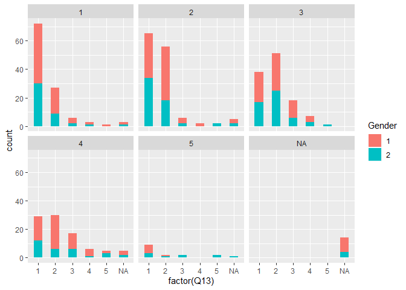

``` r
ggplot(data, aes(x = factor(Q13),fill=factor(Age))) +  
  geom_bar(width=0.5) + 
  labs(fill='Age group')
```

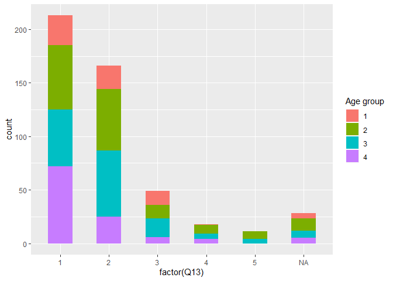

``` r
ggplot(data, aes(x = factor(Q13),fill=factor(language))) +  
  geom_bar(width=0.5) + 
  labs(fill='Language group')
```

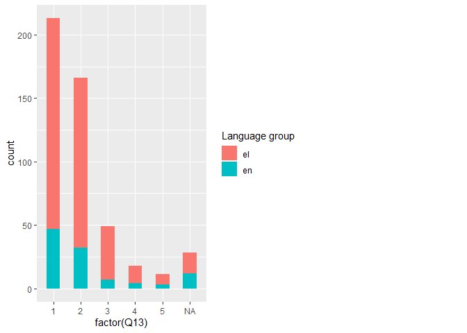

``` r
ggplot(data, aes(x = factor(Q13),fill=factor(Q3))) +  
  geom_bar(width=0.5) + 
  labs(fill='Tmima group')
```

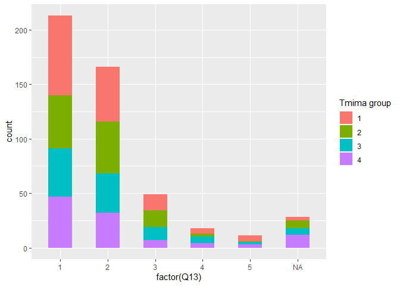

``` r
ggplot(data, aes(x = factor(Q13),fill=factor(Q5_SQ001))) +  
  geom_bar(width=0.5) + 
  labs(fill='Satisfaction group')
```

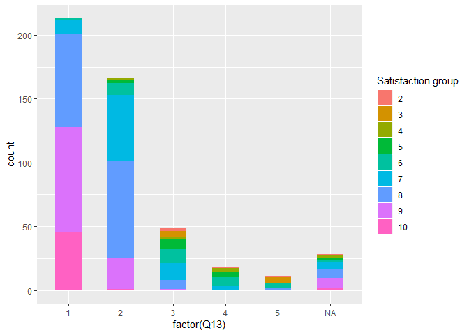

``` r
ggplot(data, aes(x = factor(Q13),fill=factor(Q8))) +  
  geom_bar(width=0.5) + 
  labs(fill='Sinafeia me ergasia group')
```

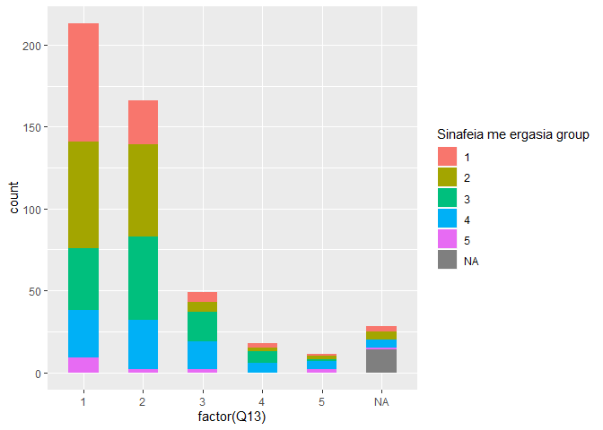

``` r
ggplot(data, aes(x = factor(Q13),fill = factor(Q8))) +  
  geom_bar(aes(y = (..count..)/sum(..count..))) + 
  scale_y_continuous(labels = percent)+
  labs(title='Συνάφεια ΠΜΣ με εργασία και σύσταση ΠΜΣ', x='Θα προτείνατε το ΠΜΣ;',y='Ποσοστό',
       fill='Συνάφεια με εργασία')+
  theme(plot.title = element_text(hjust = 0.5))+
  scale_x_discrete(labels=c('Σίγουρα ναι','Μάλλον ναι','Ούτε ναι ούτε όχι','Μάλλον όχι','Σίγουρα όχι'))+
scale_fill_manual(values=c("darkred","red","blue","green4","darkgreen","yellow"),
  labels = c("Πολύ ", "Αρκετά ", "Όχι και τόσο ", "Καθόλου ", "Δεν έχω εργαστεί",'NA'))
```


\#\#How about a picture?\#\#


