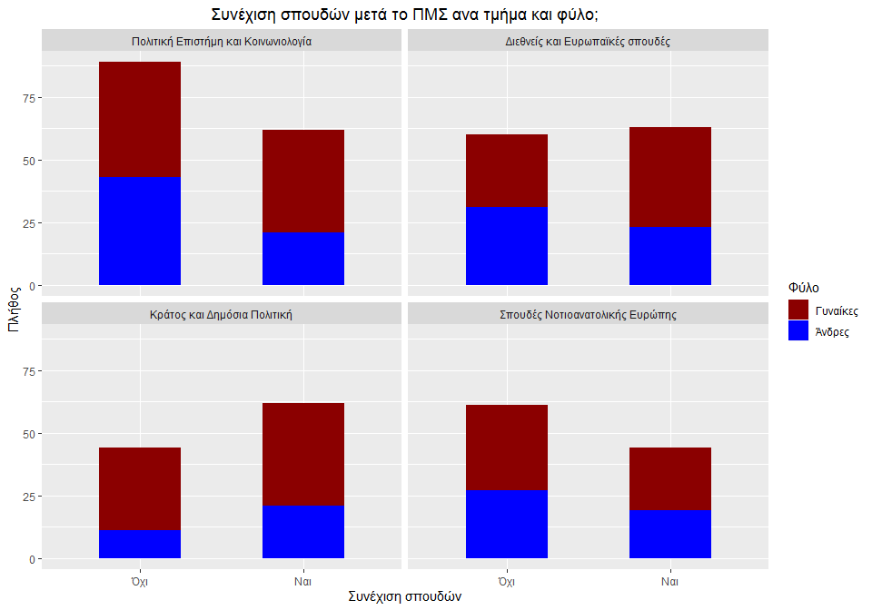
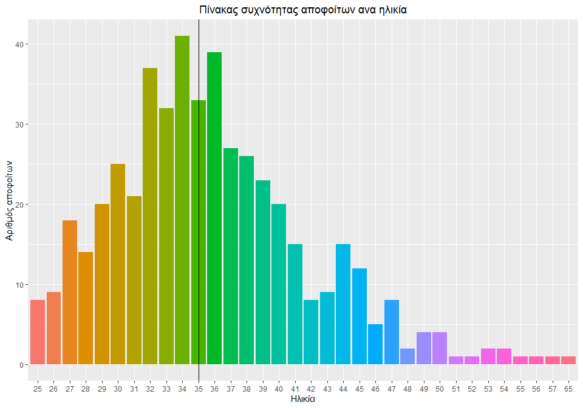

### ΔΙΑΓΡΑΜΜΑΤΑ ΓΙΑ ΤΗΝ ΕΡΕΥΝΑ ΑΠΟΦΟΙΤΩΝ ΠΜΣ

    ## Warning: package 'foreign' was built under R version 3.6.3

    ## 
    ## Attaching package: 'dplyr'

    ## The following objects are masked from 'package:stats':
    ## 
    ##     filter, lag

    ## The following objects are masked from 'package:base':
    ## 
    ##     intersect, setdiff, setequal, union

### Αρχικά παρουσιάζουμε κάποια γραφήματα που αφορούν τα ποσοστά ετών αποφοίτησης, φύλων και ηλικίας των αποφοίτων.

### Στη συνέχεια , το διάγραμμα απεικονίζει το ποσοστό αποφοίτων που θα σύστηναν το μεταπτυχιακό σε τρίτους.Παρατηρούμε οτι ένα μεγάλο ποσοστό 78.1%, θα το σύστηνε.

### Παρακάτω έχουμε το ίδιο διάγραμμα, αυτή τη φορά όμως ανα τμήμα ΠΜΣ.

### Το επόμενο διάγραμμα μας δείχνει την απάντηση για τη σύσταση ΠΜΣ σε τρίτους, ανα βαθμό ικανοποίησης από τις σπουδές των αποφοίτων.Υπάρχει όπως φαίνεται μια σύνδεση ανάμεσα στις μεταβλητές.

### Στο επόμενο γράφημα παρατηρούμε την απάντηση για σύσταση του ΠΜΣ σε τρίτους ανά ηλικιακή ομάδα και φύλο.

### Στο παρακάτω γράφημα παρατηρούμε το πως η ικανοποίηση από την τρέχουσα απασχόληση επηρεάζει την απάντηση για σύσταση του ΠΜΣ σε τρίτους.

### Στο παρακάτω γράφημα ελέγχουμε αν η εργασιακή κατάσταση επηρεάζει την απόφαση για την σύσταση του ΠΜΣ σε τρίτους .

### Στο παρακάτω γράφημα παρατηρούμε τον αριθμό των αποφοίτων σε κάθε τμήμα , ανα ηλικιακή ομάδα και φύλο. Οι γυναίκες υπερισχύουν στο τμήμα Κράτος και Δημόσια Πολιτική ,σε κάθε ηλικιακή ομάδα.

### Το ίδιο γράφημα, αυτή τη φορά ανα ηλικιακή ομάδα και εργασιακή κατάσταση.

### Στο παρακάτω γράφημα παρατηρούμε οτι το Τμήμα Πολιτικής Επιστήμης έχει συγκριτικά με τα υπόλοιπα τμήματα μεγαλύτερη συμβολή στην εύρεση εργασίας.

### Στο παρακάτω γράφημα μπορούμε να παρατηρήσουμε αν η σχέση του ΠΜΣ με την απασχόληση των αποφοίτων, επηρεάζει την απόφασή τους για τη σύσταση του ΠΜΣ.

### Στη συνέχεια το γράφημα απεικονίζει τη πλήθος αποφοίτων που συνέχισαν (ή όχι) τις σπουδές τους, ανα τμήμα και φύλο.

### Παρακάτω απεικονίζεται η συνέχιση (ή μη) των σπουδών μετά το ΠΜΣ ανα Hλικία και επιστημονική δραστηριότητα μετά την ολοκλήρωση του ΠΜΣ.Όπως είναι αναμενόμενο, παρατηρούμε οτι όλες οι μεταβλητές συνδέονται.

### Γράφημα για συνέχιση(ή μη) των σπουδών ανά φύλο.

### Bαθμός ικανοποίησης ανά ηλικιακή ομάδα, όλων συνολικά των αποφοίτων.

### Το ίδιο γράφημα, αυτή τη φορά ανα ηλικιακή ομάδα και τμήμα

### Τέλος, ένα γράφημα που απεικονίζει το πλήθος των αποφοίτων ανα ηλικία

    ## [1] "Η Διάμεσος της ηλικίας είναι 35 έτη"
