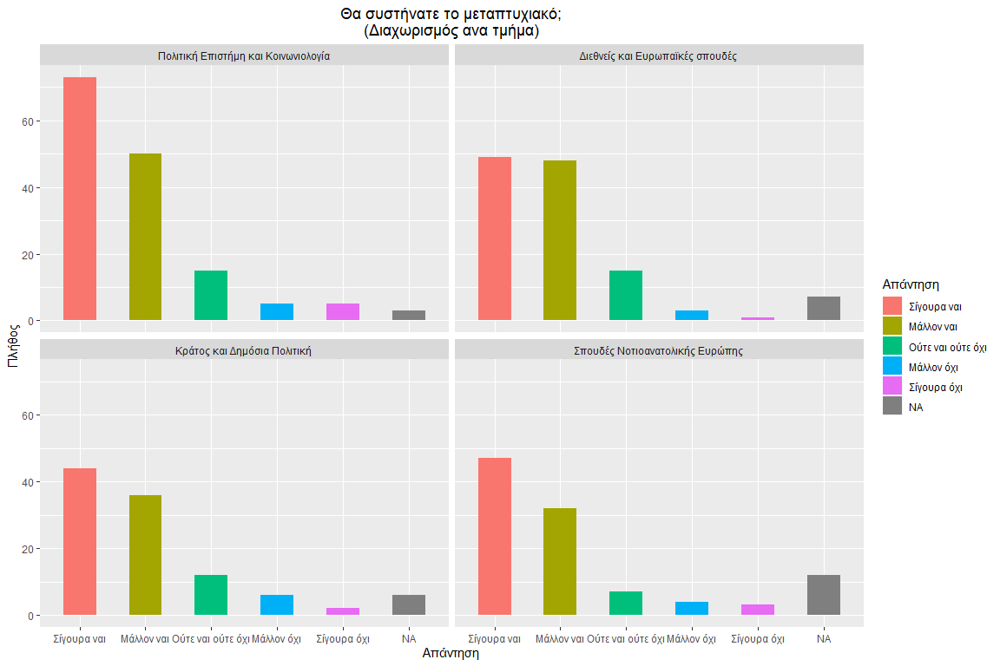
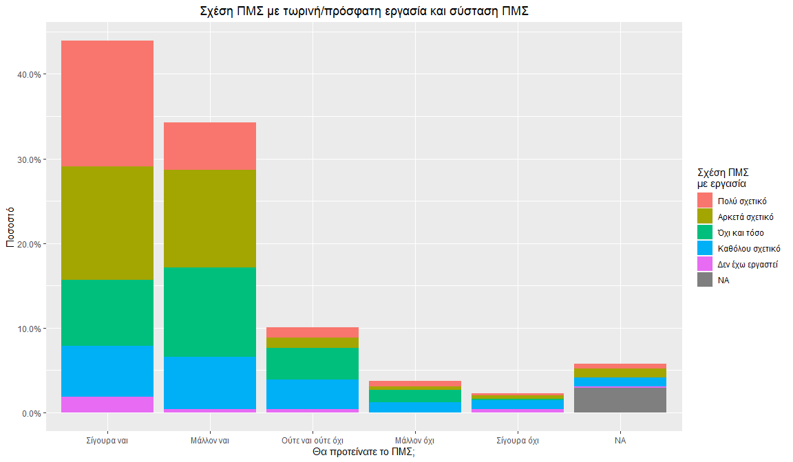

    ## Warning: package 'foreign' was built under R version 3.6.3

    ## 
    ## Attaching package: 'dplyr'

    ## The following objects are masked from 'package:stats':
    ## 
    ##     filter, lag

    ## The following objects are masked from 'package:base':
    ## 
    ##     intersect, setdiff, setequal, union

ΔΙΑΓΡΑΜΜΑΤΑ
===========


    ## Loading required package: grid


Γραφήματα που αφορούν την επιλογή των απόφοιτων για τη σύσταση του μεταπτυχιακού σε τρίτους
-------------------------------------------------------------------------------------------

``` r
ggplot(data, aes(x = factor(Q13))) +  
  geom_bar(aes(y = (..count..)/sum(..count..), fill = factor(Q13))) + 
  geom_text(aes( label = scales::percent((..count..)/sum(..count..)),
                 y=(..count..)/sum(..count..) ), stat= "count", vjust = -.3) +
  scale_y_continuous(labels = percent) + 
  labs(title='Θα συστήνατε το μεταπτυχιακό;', x='Απάντηση',y='Πλήθος',
       fill='Θα συστήνατε 
το μεταπτυχιακό?')+
  theme(plot.title = element_text(hjust = 0.5))+
  scale_x_discrete(labels=c('Σίγουρα ναι','Μάλλον ναι','Ούτε ναι ούτε όχι','Μάλλον όχι','Σίγουρα όχι'))+
scale_fill_discrete(labels=c('Σίγουρα ναι','Μάλλον ναι','Ούτε ναι ούτε όχι','Μάλλον όχι','Σίγουρα όχι'))
```




### Το επόμενο διάγραμμα μας δείχνει την απάντηση για τη σύσταση ΠΜΣ σε τρίτους, ανα βαθμό ικανοποίησης από τις σπουδές των αποφοίτων.Υπάρχει όπως φαίνεται μια σύνδεση ανάμεσα στις 2 μεταβλητές.


### Στο επόμενο γράφημα παρατηρούμε την απάντηση για σύσταση του ΠΜΣ σε τρίτους ανά ηλικιακή ομάδα και φύλο


### Στο παρακάτω γράφημα παρατηρούμε το πως η ικανοποίηση από την τρέχουσα απασχόληση επηρεάζει την απάντηση για σύσταση του ΠΜΣ σε τρίτους


### Στο παρακάτω γράφημα ελέγχουμε αν η εργασιακή κατάσταση επηρεάζει την απόφαση για την σύσταση του ΠΜΣ σε τρίτους


### Στο παρακάτω γράφημα παρατηρούμε τον αριθμό των αποφοίτων σε κάθε τμήμα , ανα ηλικιακή ομάδα και φύλο. Οι γυναίκες υπερισχύουν στο τμήμα Κράτος και Δημόσια Πολιτική ,σε κάθε ηλικιακή ομάδα


### Το ίδιο γράφημα, αυτή τη φορά ανα ηλικιακή ομάδα και εργασιακή κατάσταση.


### Στο παρακάτω γράφημα παρατηρούμε οτι το Τμήμα Πολιτικής Επιστήμης έχει συγκριτικά με τα υπόλοιπα τμήματα μεγαλύτερη συμβολή στην εύρεση εργασίας


### Στο παρακάτω γράφημα μπορούμε να παρατηρήσουμε αν η σχέση του ΠΜΣ με την απασχόληση των αποφοίτων, επηρεάζει την απόφασή τους για τη σύσταση του ΠΜΣ


