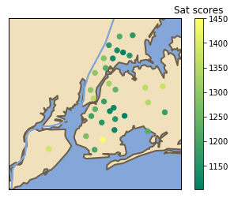
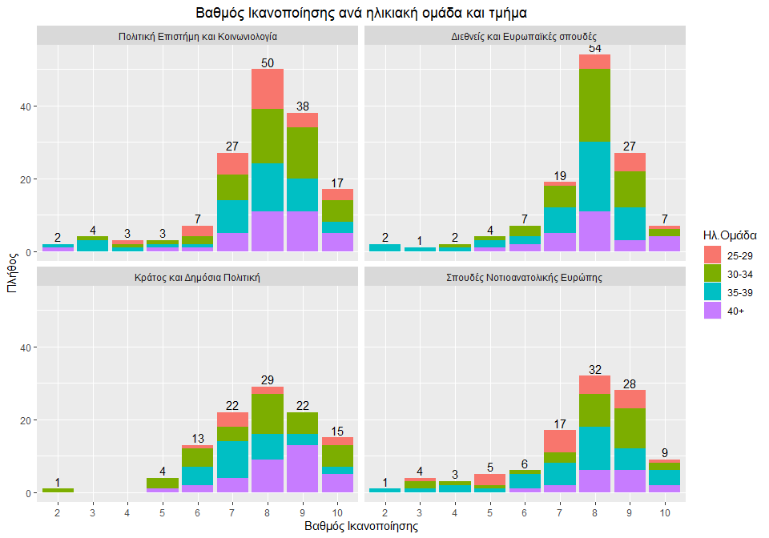
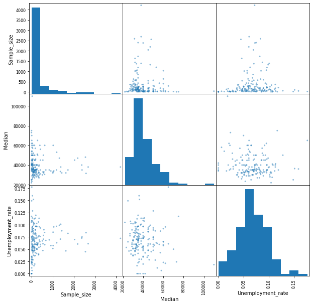
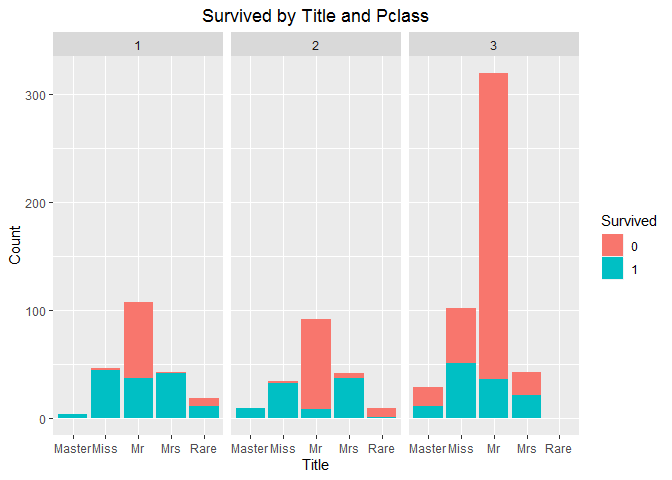

Below is a quick summary of some of the projects I keep in this repositorie.

## [**Project 1 - Analyzing NY High School Data (SAT results)**](https://github.com/AngelosTheodorakis/Data_Analysis_Projects/tree/master/Analyzing%20NY%20High%20School%20Data)
This is a project about New York City public schools, based on a Dataquest guided project.  
I combined data from various datasets, into a single dataframe. The list of the datasets which I have combined is available in the [schools](https://github.com/AngelosTheodorakis/Data_Analysis_Projects/tree/master/Analyzing%20NY%20High%20School%20Data/schools) folder.

### After combining the data, I did the following:
* Found which variables better correlate with SAT scores.
* Used *basemap toolkit* to plot SAT score and safety score values in NY map.

## [**Project 2 - Covid cases in Greece.**](https://github.com/AngelosTheodorakis/Data_Analysis_Projects/tree/master/Covid-19_Greece)
In this project I focused on the covid cases in Greece and did the following: 
* I gathered data from many web sources and combined them. 
* I used *choropleth maps*, to plot the data and reach some conclusions.
* Found some general statistics about the data.
 
The last update I used on Covid cases and deaths was on 8 October 2020. However, if you run the code it should work for later updates. (It depends on the wikipedia site updates).

## [**Project 3 - Study of EKPA.**](https://github.com/AngelosTheodorakis/Data_Analysis_Projects/tree/master/EKPA_Postgraduate_study)
Made some visualizations using data from a recent study of *National and Kapodistrian University of Athens (EKPA)*, in which I was responsible for the study documentation. A survey was organized, asking graduates of EKPA postgraduate programs questions about employment, satisfaction with their studies etc. \
Some interesting observations are the following:
- According to graduates, their postgraduate program didn't have a big impact on helping them land a job.
- Generally, the graduates were satisfied with their postgraduate program and they would reccomend it to others.
 
I used the *ggplot* library in R for all the visualizations

## [**Project 4 - Lotto probabilities.**](https://github.com/AngelosTheodorakis/Data_Analysis_Projects/tree/master/Lotto%20Probabilities)
In this project I worked on the 6/49 lottery (Lotto) and answered the following questions:

* What is the probability of winning the big prize with a single or more tickets ticket?
* What is the probability of having exactly five (or four, three, etc.) winning numbers on a single ticket?
* What is the probability of having at least five (or four, three, etc.) winning numbers on a single ticket?
* Are some numbers more likely to appear, based on historical data?

Finally, I used [historical data](https://www.kaggle.com/datascienceai/lottery-dataset) from the national 6/49 lottery game in Canada, with drawings dating from 1982 to 2018. By comparing a ticket against the historical lottery data in Canada, someone can determine whether he would have ever won by now.

## [**Project 5 - Visualizing Earnings Based On College Majors.**](https://github.com/AngelosTheodorakis/Data_Analysis_Projects/tree/master/Visualizing%20Earnings%20Based%20On%20College%20Majors)
This is a dataset on the job outcomes of students who graduated from college between 2010 and 2012. The original data on job outcomes was released by American
Community Survey, which conducts surveys and aggregates the data.\
This is a part of a project i did on Dataquest and I had the chance to work with some plots like histograms, scatterplots and barplots, in Jupyter notebooks.
- Performed visualisations using matplotlib library, primarly working in pandas.

## [**Project 6 - Titanic dataset.**](https://github.com/AngelosTheodorakis/Data_Analysis_Projects/tree/master/Titanic_Dataset)
This is the famous Titanic dataset. I've downloaded the data from Kaggle.
- Conducted *EDA*.
- Used *logistic regression* to predict whether the passengers on the test set survived or not.

