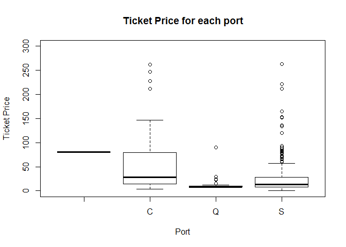

TITANIC DATASET EXPLORATION
---------------------------

### In this project we will explore the Titanic dataset (downloaded from Kaggle.com) by making some plots and observations about the data. Also, we will make a prediction about whether the passengers on the test set survived or not./

**First, we read the data**

``` r
setwd("C:/Users/User/Desktop/Άγγελος/R/Data analysis/Titanic/titanic")
test<-read.csv("test.csv")
train<-read.csv("train.csv")
```

**Then we load some libraries**

``` r
library('ggplot2') 
library('ggthemes')
library('scales') 
library('dplyr') 
```

    ## 
    ## Attaching package: 'dplyr'

    ## The following objects are masked from 'package:stats':
    ## 
    ##     filter, lag

    ## The following objects are masked from 'package:base':
    ## 
    ##     intersect, setdiff, setequal, union

**Now we will create a new column which we want to predict, for the test
matrix.**

``` r
Survived<-rep(NA,nrow(test)) # Make a vector of NA's
test<-as.data.frame(cbind(Survived,test)) # Test matrix with the new column
data<-rbind(train,test) # Join the 2 matrices together (Train and test set)
rm(Survived) #remove the survived vector
```

**We are ready to explore our data. We will make some plots to visualise
our data and explore all the columns of this dataset. Let’s look at a
summary of our variables.**

``` r
str(data)
```

    ## 'data.frame':    1309 obs. of  12 variables:
    ##  $ PassengerId: int  1 2 3 4 5 6 7 8 9 10 ...
    ##  $ Survived   : int  0 1 1 1 0 0 0 0 1 1 ...
    ##  $ Pclass     : int  3 1 3 1 3 3 1 3 3 2 ...
    ##  $ Name       : Factor w/ 1307 levels "Abbing, Mr. Anthony",..: 109 191 358 277 16 559 520 629 417 581 ...
    ##  $ Sex        : Factor w/ 2 levels "female","male": 2 1 1 1 2 2 2 2 1 1 ...
    ##  $ Age        : num  22 38 26 35 35 NA 54 2 27 14 ...
    ##  $ SibSp      : int  1 1 0 1 0 0 0 3 0 1 ...
    ##  $ Parch      : int  0 0 0 0 0 0 0 1 2 0 ...
    ##  $ Ticket     : Factor w/ 929 levels "110152","110413",..: 524 597 670 50 473 276 86 396 345 133 ...
    ##  $ Fare       : num  7.25 71.28 7.92 53.1 8.05 ...
    ##  $ Cabin      : Factor w/ 187 levels "","A10","A14",..: 1 83 1 57 1 1 131 1 1 1 ...
    ##  $ Embarked   : Factor w/ 4 levels "","C","Q","S": 4 2 4 4 4 3 4 4 4 2 ...

``` r
summary(data)
```

    ##   PassengerId      Survived          Pclass     
    ##  Min.   :   1   Min.   :0.0000   Min.   :1.000  
    ##  1st Qu.: 328   1st Qu.:0.0000   1st Qu.:2.000  
    ##  Median : 655   Median :0.0000   Median :3.000  
    ##  Mean   : 655   Mean   :0.3838   Mean   :2.295  
    ##  3rd Qu.: 982   3rd Qu.:1.0000   3rd Qu.:3.000  
    ##  Max.   :1309   Max.   :1.0000   Max.   :3.000  
    ##                 NA's   :418                     
    ##                                Name          Sex           Age       
    ##  Connolly, Miss. Kate            :   2   female:466   Min.   : 0.17  
    ##  Kelly, Mr. James                :   2   male  :843   1st Qu.:21.00  
    ##  Abbing, Mr. Anthony             :   1                Median :28.00  
    ##  Abbott, Mr. Rossmore Edward     :   1                Mean   :29.88  
    ##  Abbott, Mrs. Stanton (Rosa Hunt):   1                3rd Qu.:39.00  
    ##  Abelson, Mr. Samuel             :   1                Max.   :80.00  
    ##  (Other)                         :1301                NA's   :263    
    ##      SibSp            Parch            Ticket          Fare        
    ##  Min.   :0.0000   Min.   :0.000   CA. 2343:  11   Min.   :  0.000  
    ##  1st Qu.:0.0000   1st Qu.:0.000   1601    :   8   1st Qu.:  7.896  
    ##  Median :0.0000   Median :0.000   CA 2144 :   8   Median : 14.454  
    ##  Mean   :0.4989   Mean   :0.385   3101295 :   7   Mean   : 33.295  
    ##  3rd Qu.:1.0000   3rd Qu.:0.000   347077  :   7   3rd Qu.: 31.275  
    ##  Max.   :8.0000   Max.   :9.000   347082  :   7   Max.   :512.329  
    ##                                   (Other) :1261   NA's   :1        
    ##              Cabin      Embarked
    ##                 :1014    :  2   
    ##  C23 C25 C27    :   6   C:270   
    ##  B57 B59 B63 B66:   5   Q:123   
    ##  G6             :   5   S:914   
    ##  B96 B98        :   4           
    ##  C22 C26        :   4           
    ##  (Other)        : 271

**Now, let’s find the missing values.**

``` r
Missing_values<-data.frame(sort(sapply(data,function(x) sum(is.na(x))),decreasing = TRUE))
Missing_values
```

    ##             sort.sapply.data..function.x..sum.is.na.x.....decreasing...TRUE.
    ## Survived                                                                 418
    ## Age                                                                      263
    ## Fare                                                                       1
    ## PassengerId                                                                0
    ## Pclass                                                                     0
    ## Name                                                                       0
    ## Sex                                                                        0
    ## SibSp                                                                      0
    ## Parch                                                                      0
    ## Ticket                                                                     0
    ## Cabin                                                                      0
    ## Embarked                                                                   0

**Survived is the variable we want to predict in our test set. So we
will later look at its correlation with the other variables.**

``` r
ggplot(train, aes(x = factor(Survived))) +  
  geom_bar(aes(y = (..count..)/sum(..count..), fill = factor(Survived))) + 
  geom_text(aes( label = scales::percent((..count..)/sum(..count..)),
                 y=(..count..)/sum(..count..) ), stat= "count", vjust =-.3)+
  scale_y_continuous(labels = percent) +
  labs(title='Passengers survived', x='Survived',y='Percent')+
  theme(plot.title = element_text(hjust = 0.5),legend.position="none")+
  scale_x_discrete(labels=c('NO','YES'))
```


**We can see from the plot above that approximately 62% of the
passengers didn’t survive.**

**Next, we will convert to factors some of our variables and make some
plots to get an idea of our data.**

``` r
train$Survived <- as.factor(train$Survived)
data$Pclass<-as.factor(data$Pclass)
data$Survived<-as.factor(data$Survived)
data$Pclass<-as.factor(data$Pclass)
data$SibSp<-as.factor(data$SibSp)
data$Parch<-as.factor(data$Parch)

par(mfrow=c(2,4))
plot(train$Survived,col="red",main="Survived")
plot(data$Pclass,col="green",main="Pclass")
plot(data$Sex,col="brown",main="Gender")
hist(data$Age,col="yellow",breaks = 15)

plot(data$SibSp,col="purple",main="Siblings")
plot(data$Parch,col="pink",main="Parents/Children")
hist(data$Fare,col="blue",main="Fare")
plot(data$Embarked,main="Port Embarked") 
```


**From the plots above we can make some observations:**

-   The third class passengers were the majority.
-   There was almost a double number of men than women in the ship.
-   Most of the passengers were around 30 years old.
-   Most of the passengers travelled alone.
-   We can see that there is an outlier for the ticket fair.
-   There is a small number of missing values for the embarkation port,
    that we did’n find before,because they are not stored as NA’s.

**We will try to find the missing cabins**

``` r
levels(data$Embarked)
```

    ## [1] ""  "C" "Q" "S"

``` r
which(data$Embarked=="") # 2 Cabins are unknown
```

    ## [1]  62 830

``` r
subset(data,Embarked=="")
```

    ##     PassengerId Survived Pclass                                      Name
    ## 62           62        1      1                       Icard, Miss. Amelie
    ## 830         830        1      1 Stone, Mrs. George Nelson (Martha Evelyn)
    ##        Sex Age SibSp Parch Ticket Fare Cabin Embarked
    ## 62  female  38     0     0 113572   80   B28         
    ## 830 female  62     0     0 113572   80   B28

**We can see that the 2 persons were on the same cabin (B28),they were
both females,they both survived and belonged to the first class.They
also traveled alone (so they were not relatives) and had the same number
of ticket. So we could guess that they embarked from the same port.**

**How will we find the port from which the 2 persons embarged? Maybe it
has some correlation with some other variable, like the ticket price or
the Cabin for example. We will first find if there is correlation wih
the Cabin variable**

``` r
levels(data$Cabin)[1:20] # First 20 levels
```

    ##  [1] ""     "A10"  "A14"  "A16"  "A19"  "A20"  "A23"  "A24"  "A26"  "A31" 
    ## [11] "A32"  "A34"  "A36"  "A5"   "A6"   "A7"   "B101" "B102" "B18"  "B19"

``` r
length(levels(data$Cabin)) # Number of different levels
```

    ## [1] 187

``` r
length(which(data$Cabin== "")) # Missing values
```

    ## [1] 1014

**First we can see that Cabin starts with letters. Also, there is an
empty level and we find that there are 1014 missing values for this
level that are not stored as NA’s. We will use just the first letter of
the cabins, to reduce the levels,and hopefully make some conclusions.**

``` r
Cabin_levels = substr(data$Cabin, start = 1, stop = 1)
data$Cabin_levels <- as.factor(Cabin_levels) # Create a new column

# Cabin levels (Percentages)
sapply(table(data$Cabin_levels),function(x) round((x/nrow(data)*100),2))
```

    ##           A     B     C     D     E     F     G     T 
    ## 77.46  1.68  4.97  7.18  3.51  3.13  1.60  0.38  0.08

``` r
# Table of Cabin levels Percentages, seperately for each Port
prop.table(table(data$Cabin_levels,data$Embarked), 1)*100
```

    ##    
    ##                         C          Q          S
    ##       0.000000  14.990138  11.637081  73.372781
    ##   A   0.000000  50.000000   0.000000  50.000000
    ##   B   3.076923  49.230769   0.000000  47.692308
    ##   C   0.000000  43.617021   3.191489  53.191489
    ##   D   0.000000  43.478261   0.000000  56.521739
    ##   E   0.000000  26.829268   2.439024  70.731707
    ##   F   0.000000  14.285714   4.761905  80.952381
    ##   G   0.000000   0.000000   0.000000 100.000000
    ##   T   0.000000   0.000000   0.000000 100.000000

**We can see that for the Cabins starting with B there is an equal
probability that people have embarged from C and S.**

**What about the correlation with the ticket Fare?**

``` r
plot(data$Embarked,data$Fare,ylim=c(0,300),xlab = "Port", ylab = "Ticket Price", main="Ticket Price for each port")
```



**From the plot above it seems that the ticket fare is more likely to
belong to the C port. Let’s investigate more specifically for females
that belong to the first class.**

``` r
median(data[which(data$Embarked=="C" & data$Pclass==1 & data$Sex == "female"),"Fare"]) # median fare for the first class female passengers, that have embarged from the port of Charbourg.
```

    ## [1] 83.1583

``` r
median(data[which(data$Embarked=="S" & data$Pclass==1 & data$Sex == "female"),"Fare"]) # # median fare for the first class female passengers, that have embarged from the port of Southampton.
```

    ## [1] 78.85

**From the results above we cannot make a conclusion about the
embarkation port. We won’t stay longer here and we will replace the 2
missing values with the most common port (Southampton). Maybe we will
come back later.**

``` r
data[which(data$Embarked==""),"Embarked"] <- "S"
```

**Now for the Fare variable there is only one missing value.**

``` r
data[which(is.na(data$Fare)),] 
```

    ##      PassengerId Survived Pclass               Name  Sex  Age SibSp Parch
    ## 1044        1044     <NA>      3 Storey, Mr. Thomas male 60.5     0     0
    ##      Ticket Fare Cabin Embarked Cabin_levels
    ## 1044   3701   NA              S

**We can maybe find it by again looking the other attributes of the
passenger. One variable we could use is the Pclass variable, because the
higher the class is , the higher the ticket cost. Let’s confirm that.**

``` r
par(mfrow=c(1,1))
plot(factor(data$Pclass),data$Fare,ylim=c(0,300),xlab = "Class", ylab = "Ticket Price", main="Ticket Price for each class") #price of ticket for Pclass
```


**There is certainly a correlation. We will replace the missing value
with the median fare of male passengers who belong to the third class
and embarked from Southampton port.**

``` r
median(data[which(data$Embarked=="S" & data$Pclass==3 & data$Sex == "male"),"Fare"],na.rm = TRUE) #median
```

    ## [1] 8.05

``` r
data[which(is.na(data$Fare)),"Fare"] <- median(data[which(data$Embarked=="S" & data$Pclass==3 & data$Sex == "male"),"Fare"],na.rm = TRUE) #Replace the missing value
```

**The remaining missing values are for the Age variable. We have seen
before a plot regarding the age of the passengers. Let’s make some plots
and matrices to get a better sense of how the variable is connected to
other attributes of a passenger.**

``` r
ggplot(data, aes(x = Sex, y=Age, fill=factor(Sex))) +  
  labs(title='Median Age for each class', x='Gender',y='Age')+
  theme(plot.title = element_text(hjust = 0.5),legend.position="none")+
  stat_summary(fun.y="median", geom="bar")+
  facet_wrap(~factor(Pclass))
```

    ## Warning: Removed 263 rows containing non-finite values (stat_summary).


**From the plot above, we can see clearly that the Pclass variable is
correlated with age. Maybe the older people have more wealth and so they
belong to a higher class. Let’s see more specificaly the numbers in the
matrix that follows:**

``` r
data %>% 
  group_by(Pclass,Sex) %>% 
  summarize(Median_Age = median(Age,na.rm = TRUE)) 
```

    ## # A tibble: 6 x 3
    ## # Groups:   Pclass [3]
    ##   Pclass Sex    Median_Age
    ##   <fct>  <fct>       <dbl>
    ## 1 1      female       36  
    ## 2 1      male         42  
    ## 3 2      female       28  
    ## 4 2      male         29.5
    ## 5 3      female       22  
    ## 6 3      male         25

**We could replace the mising values with the median age for each
class**

**One other way to predict the age of the passenger, would be to extract
the title from their name. As we can see all the names have titles, so
we will extract them and make a new column with just the titles. Then we
will see if there is indeed a correlation between the title and the age
of the passengers.**

``` r
list <- strsplit(as.character(data$Name),(', ')) # We first split the words
head(list)
```

    ## [[1]]
    ## [1] "Braund"          "Mr. Owen Harris"
    ## 
    ## [[2]]
    ## [1] "Cumings"                                   
    ## [2] "Mrs. John Bradley (Florence Briggs Thayer)"
    ## 
    ## [[3]]
    ## [1] "Heikkinen"   "Miss. Laina"
    ## 
    ## [[4]]
    ## [1] "Futrelle"                          
    ## [2] "Mrs. Jacques Heath (Lily May Peel)"
    ## 
    ## [[5]]
    ## [1] "Allen"             "Mr. William Henry"
    ## 
    ## [[6]]
    ## [1] "Moran"     "Mr. James"

``` r
title <- as.factor(sapply(list, function(x) x[2]))
list<-strsplit(as.character(title),("\\.")) # We split again
title <- as.factor(sapply(list, function(x) x[1]))
data$Title<-title # Make the new column with the titles
rm(title) #We remove the vectors
rm(list)
```

**So we now have the titles column ready. Let’s explore it**

``` r
levels(data$Title)
```

    ##  [1] "Capt"         "Col"          "Don"          "Dona"        
    ##  [5] "Dr"           "Jonkheer"     "Lady"         "Major"       
    ##  [9] "Master"       "Miss"         "Mlle"         "Mme"         
    ## [13] "Mr"           "Mrs"          "Ms"           "Rev"         
    ## [17] "Sir"          "the Countess"

``` r
table(data$Title)
```

    ## 
    ##         Capt          Col          Don         Dona           Dr 
    ##            1            4            1            1            8 
    ##     Jonkheer         Lady        Major       Master         Miss 
    ##            1            1            2           61          260 
    ##         Mlle          Mme           Mr          Mrs           Ms 
    ##            2            1          757          197            2 
    ##          Rev          Sir the Countess 
    ##            8            1            1

``` r
table(data$Sex,data$Title)
```

    ##         
    ##          Capt Col Don Dona  Dr Jonkheer Lady Major Master Miss Mlle Mme
    ##   female    0   0   0    1   1        0    1     0      0  260    2   1
    ##   male      1   4   1    0   7        1    0     2     61    0    0   0
    ##         
    ##           Mr Mrs  Ms Rev Sir the Countess
    ##   female   0 197   2   0   0            1
    ##   male   757   0   0   8   1            0

``` r
table(data$Pclass,data$Title)
```

    ##    
    ##     Capt Col Don Dona  Dr Jonkheer Lady Major Master Miss Mlle Mme  Mr Mrs
    ##   1    1   4   1    1   6        1    1     2      5   60    2   1 159  77
    ##   2    0   0   0    0   2        0    0     0     11   50    0   0 150  55
    ##   3    0   0   0    0   0        0    0     0     45  150    0   0 448  65
    ##    
    ##      Ms Rev Sir the Countess
    ##   1   0   0   1            1
    ##   2   1   8   0            0
    ##   3   1   0   0            0

**We can reduce the levels because we can see that some titles are rare,
so we will make a level with just these rare titles**

``` r
paste(as.character(levels(data$Title)),collapse = "','")
```

    ## [1] "Capt','Col','Don','Dona','Dr','Jonkheer','Lady','Major','Master','Miss','Mlle','Mme','Mr','Mrs','Ms','Rev','Sir','the Countess"

``` r
rare_title<-c('Capt','Col','Don','Dona','Dr','Jonkheer','Lady','Major','Mlle','Mme','Ms','Rev','Sir','the Countess')
data$Title<-as.character((data$Title)) # Convert to character 
data$Title[which(data$Title %in% rare_title)]<-"Rare" # Change the titles to "Rare"
data$Title<-as.factor(data$Title) #Convert back to factor
table(data$Sex,data$Title) # Titles by gender
```

    ##         
    ##          Master Miss  Mr Mrs Rare
    ##   female      0  260   0 197    9
    ##   male       61    0 757   0   25

**We can now answer our question about whether the title is correlated
with age**

``` r
plot(data$Title,data$Age) 
```


``` r
data %>% 
  group_by(Title) %>% 
  summarize(Median_Age = median(Age,na.rm = TRUE)) # The exact median ages
```

    ## # A tibble: 5 x 2
    ##   Title  Median_Age
    ##   <fct>       <dbl>
    ## 1 Master        4  
    ## 2 Miss         22  
    ## 3 Mr           29  
    ## 4 Mrs          35.5
    ## 5 Rare         44.5

**The plot is showing that title is related with age! So we could
replace the missing values with the median age of passengers according
to their class and title**

``` r
data %>% 
  group_by(Title,Pclass) %>% 
  summarize(Median_Age = median(Age,na.rm = TRUE)) 
```

    ## # A tibble: 15 x 3
    ## # Groups:   Title [5]
    ##    Title  Pclass Median_Age
    ##    <fct>  <fct>       <dbl>
    ##  1 Master 1             6  
    ##  2 Master 2             2  
    ##  3 Master 3             6  
    ##  4 Miss   1            30  
    ##  5 Miss   2            20  
    ##  6 Miss   3            18  
    ##  7 Mr     1            41.5
    ##  8 Mr     2            30  
    ##  9 Mr     3            26  
    ## 10 Mrs    1            45  
    ## 11 Mrs    2            30.5
    ## 12 Mrs    3            31  
    ## 13 Rare   1            47  
    ## 14 Rare   2            41  
    ## 15 Rare   3            NA

\#HOW?

**Now we are going to use some plots to find the important variables.**

**Visualize the relationship between Pclass & survival**

``` r
ggplot(train, aes(x =Pclass, fill = Survived)) +
  geom_bar(stat='count') +
  labs(x = 'Pclass',title = 'Survived by class') +
  theme(plot.title = element_text(hjust = 0.5))
```


**The passengers of first and second class were more likely to survive
than those of the third class** **Let’s visualize the relationship
between Sex & survival**

``` r
ggplot(train, aes(x =Sex, fill = Survived)) +
  geom_bar(stat='count') +
  labs(x = 'Gender',title = 'Survived by Sex') +
  theme(plot.title = element_text(hjust = 0.5))
```


**The female passengers were more likely to survive** **Now let’s
Combine the above plots**

``` r
ggplot(train, aes(x = Sex, fill=Survived)) +  
  labs(title='Survived by Sex and Class', x='Gender',y='Age')+
  theme(plot.title = element_text(hjust = 0.5))+
  geom_bar(stat='count') +
  facet_wrap(~factor(Pclass))
```


**That is a very interesting plot that shows that almost all of the
female passengers of first and second class survived. Also, it shows
that most male passengers didn’t survive (in the first class the
percentage of survival was bigger)**

**Next we’ll look at the relationship between age and survival**

``` r
ggplot(train, aes(Age, fill = factor(Survived))) + 
  geom_histogram(bins = 80) + 
  theme_few()
```

    ## Warning: Removed 177 rows containing non-finite values (stat_bin).


``` r
ggplot(train, aes(Age, fill = factor(Survived))) + 
  geom_histogram() + 
  facet_grid(.~Pclass) + 
  theme_few()
```

    ## `stat_bin()` using `bins = 30`. Pick better value with `binwidth`.

    ## Warning: Removed 177 rows containing non-finite values (stat_bin).


``` r
ggplot(train, aes(Age, fill = factor(Survived))) + 
  geom_histogram() + 
  facet_grid(.~Sex) + 
  theme_few()
```

    ## `stat_bin()` using `bins = 30`. Pick better value with `binwidth`.

    ## Warning: Removed 177 rows containing non-finite values (stat_bin).


**From the above plots, age doesn’t seem to play a big role in survival,
apart from the young ages of first and second class.**

\*\*What about the Title variable we made earlier? Let’s see some plots:

``` r
ggplot(train, aes(x = data[1:891,"Title"], fill=Survived)) +  
  labs(title='Survived by Title', x='Title',y='Count')+
  theme(plot.title = element_text(hjust = 0.5))+
  geom_bar(stat='count') 
```


``` r
ggplot(train, aes(x = data[1:891,"Title"], fill=Survived)) +  
  labs(title='Survived by Title and Pclass', x='Title',y='Count')+
  theme(plot.title = element_text(hjust = 0.5))+
  geom_bar(stat='count') +
  facet_wrap(~factor(Pclass))
```


**These are also very interesting plots. We can see for example that
almost all of the adult males in second class didn’t survive, but all of
the young males survived in first and second class. Half of them
survived in the third class.**

**As for the siblings and Parch variables:**

``` r
ggplot(train, aes(x = SibSp, fill=Survived)) +  
  labs(title='Survived by number of Siblings and Parents/Children', x='x = number of Siblings',y='Count')+
  theme(plot.title = element_text(hjust = 0.5))+
  geom_bar(stat='count') +
  facet_wrap(~factor(Parch))
```


**It seems that family size plays a negative role in survival.**

**We will now predict using logistic regression, the survival of the
Titanic passengers at the test set.**

Build the model (note: not all possible variables are used)
===========================================================

rf\_model \<- randomForest(factor(Survived) \~ Pclass + Sex + Age +
SibSp + Parch + Fare + Embarked + Title + FsizeD + Child + Mother, data
= train)

Show model error
================

plot(rf\_model, ylim=c(0,0.36)) legend(‘topright’,
colnames(rf\_model$err.rate), col=1:3, fill=1:3)

Get importance
==============

importance \<- importance(rf\_model) varImportance \<-
data.frame(Variables = row.names(importance), Importance =
round(importance\[ ,‘MeanDecreaseGini’\],2))

Create a rank variable based on importance
==========================================

rankImportance \<- varImportance %\>% mutate(Rank =
paste0(‘\#’,dense\_rank(desc(Importance)))) \#\#How do I do it with
another way?

Use ggplot2 to visualize the relative importance of variables
=============================================================

ggplot(rankImportance, aes(x = reorder(Variables, Importance), y =
Importance, fill = Importance)) + geom\_bar(stat=‘identity’) +
geom\_text(aes(x = Variables, y = 0.5, label = Rank), hjust=0,
vjust=0.55, size = 4, colour = ‘red’) + labs(x = ‘Variables’) +
coord\_flip() + theme\_few()

Predict using the test set
==========================

prediction \<- predict(rf\_model, test)

Save the solution to a dataframe with two columns: PassengerId and Survived (prediction)
========================================================================================

solution \<- data.frame(PassengerId = test$PassengerId, Survived =
prediction)

Write the solution to file
==========================

write.csv(solution, file = ‘Titanic\_Solution.csv’, row.names = F)
